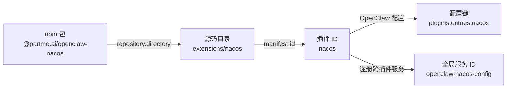
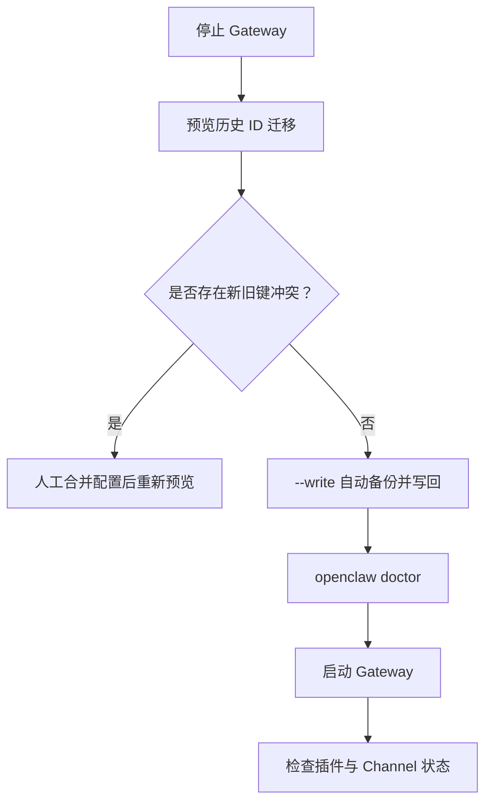

# OpenClaw 插件分层命名与升级迁移

## 1. 一眼看懂四层名称

```text
@partme.ai/openclaw-nacos          npm 包名：发布、安装、依赖解析
              │
              ▼
extensions/nacos                  工作区目录：源码与构建边界
              │
              ▼
id: nacos                         插件 ID：plugins.entries.nacos
              │
              ▼
openclaw-nacos-config             服务 ID：跨插件注册表中的全局标识
```



统一规则：

- 目录名、`openclaw.plugin.json#id`、运行时插件 ID 必须是同一个短 kebab-case ID。
- npm 包默认命名为 `@partme.ai/openclaw-<plugin-id>`。
- `weixin`、`wechat-ipad`、`wecom`、`wecom-kf` 是显式登记的独立品牌包。
- Channel ID 属于外部协议层，可以与插件 ID 不同。例如微信插件 ID 是 `wechat`，Channel ID 仍是 `openclaw-weixin`。
- 跨插件可见的服务 ID、Tool 名和协议名应保留命名空间，防止全局冲突。

## 2. 历史 ID 迁移表

| 历史 ID | Canonical ID |
|---|---|
| `openclaw-bridge` | `bridge` |
| `openclaw-gotify` | `gotify` |
| `openclaw-knowledge` | `knowledge` |
| `openclaw-mqtt` | `mqtt` |
| `openclaw-mtls` | `mtls` |
| `openclaw-nacos` | `nacos` |
| `openclaw-oauth2` | `oauth2` |
| `openclaw-prometheus` | `prometheus` |
| `openclaw-rabbitmq` | `rabbitmq` |
| `openclaw-redis-stream` | `redis-stream` |
| `xhs` | `rednode` |
| `openclaw-rockermq` | `rocketmq` |
| `openclaw-stomp` | `stomp` |
| `openclaw-tracing` | `tracing` |
| `openclaw-web-mqtt` | `web-mqtt` |
| `openclaw_web_stomp` | `web-stomp` |
| `openclaw-weixin` | `wechat` |
| `openclaw_wechat_ipad` | `wechat-ipad` |
| `wecom_kf` | `wecom-kf` |

## 3. 安全迁移流程



先预览，不修改文件：

```bash
node scripts/migrate-plugin-config-ids.mjs --config /path/to/openclaw.json
```

确认后写入。工具会先创建 `.bak` 备份；如果新旧 `plugins.entries` 同时存在，则拒绝覆盖：

```bash
node scripts/migrate-plugin-config-ids.mjs --config /path/to/openclaw.json --write
```

微信插件需要特别区分两层配置：

```json
{
  "plugins": {
    "entries": {
      "wechat": { "enabled": true }
    }
  },
  "channels": {
    "openclaw-weixin": {}
  }
}
```

