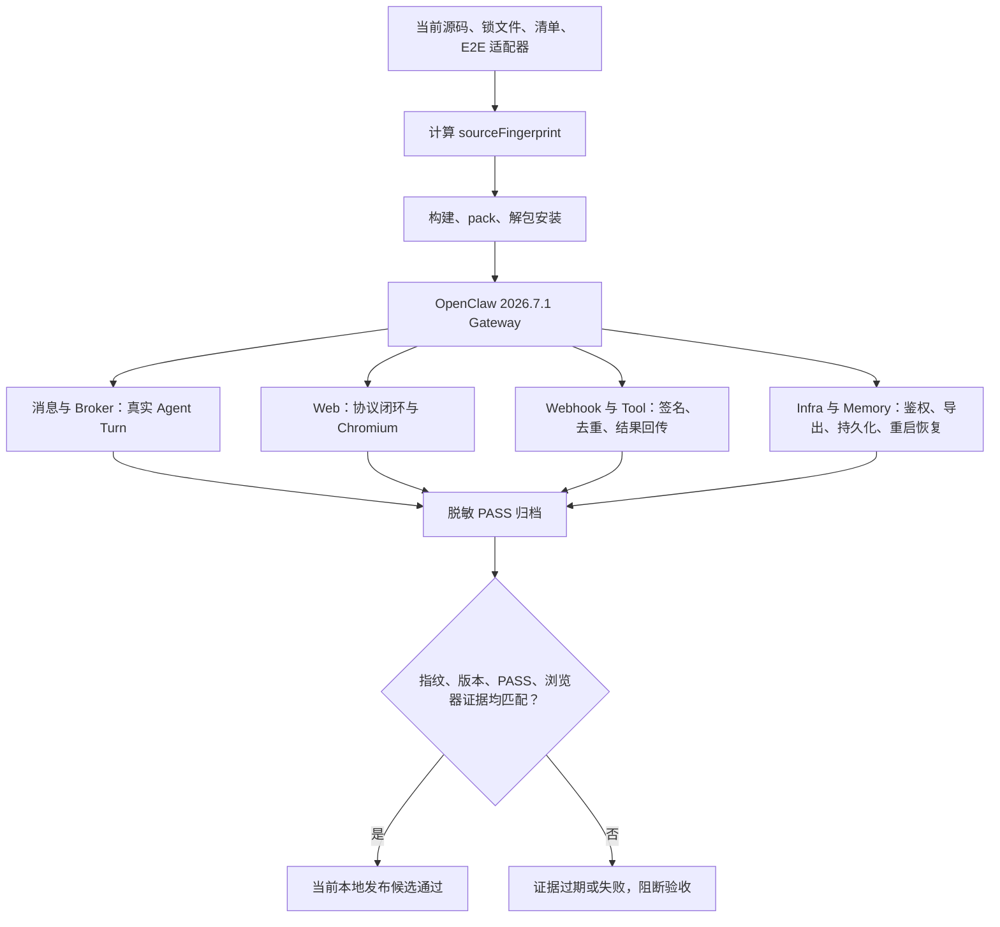

# OpenClaw Plugins 生产优化计划

更新时间：2026-07-17
目标 OpenClaw：2026.7.1

## 基线说明

- `nacos`、`wecom`：用户已在上一版本的真实环境验证。后续只做 2026.7.1 回归、兼容性和发布门禁，不优先重构。
- 除 `nacos`、`wecom` 外的插件：按安全风险、共享影响面、数据可靠性、外部渠道依赖的顺序逐个优化。
- 原独立 `cluster` 插件已按产品决策删除；Nacos 内置的节点发现与 `/nacos/cluster` 能力不受影响。
- 单个插件完成标准：真实入口契约、类型检查、构建、单元/契约测试、必要的真实依赖 E2E、结构检查、中文原理注释，以及与当前实现一致的 Mermaid 架构/时序图均通过。

## 优化顺序

| 顺序 | 插件         | 主要目标                                                             | 状态                                                                |
| ---: | ------------ | -------------------------------------------------------------------- | ------------------------------------------------------------------- |
|    1 | mtls         | 改为真实 HTTPS/mTLS 代理并接入 trusted-proxy                         | 已完成代码与本地 E2E，待环境验收                                    |
|    2 | oauth2       | 修复错误的 HTTP Route 中间件模型，接入 Gateway 正式鉴权路径          | 已完成代码与本地 E2E，待环境验收                                    |
|    3 | mqtt         | 统一 ACL、连接接管、发布前策略与真实 QoS/TLS 契约                    | 已完成代码、本地 Redis/TLS E2E 与 2026.7.1 安装验证，待环境验收     |
|    4 | web-mqtt     | 复用统一 ACL，补 WSS、浏览器鉴权与可靠 Agent 交付                    | 已完成代码、真实 Agent tarball E2E 与 Chromium 回复闭环，待环境验收 |
|    5 | douyin       | 清除 TODO 占位，实现真实开放平台 API                                 | 已完成代码与协议测试，待环境验收                                    |
|    6 | memory       | 实现保留策略、异步存储与真实能力分层                                 | 已完成真实 Gateway 跨重启 E2E，待压力/备份恢复验收                   |
|    7 | openmem      | 可靠 HTTP、Memory Host、事件投影恢复与真实 Sidecar E2E                | 条件上线候选，待受保护网络和故障演练                                |
|    8 | web-socket   | 鉴权、背压、心跳、结构补全与 E2E                                     | 已完成 2026.7.1 tarball Agent/Chromium E2E，待环境验收               |
|    9 | web-stomp    | WSS、认证、会话隔离、背压、资源限制与生命周期                        | 已完成代码、真实 WSS 与 tarball Agent E2E，待环境验收               |
|   10 | stomp        | TCP/TLS、认证、ACK、会话隔离、有界队列与生命周期                     | 已完成代码与真实 TLS 测试，待环境验收                               |
|   11 | rabbitmq     | Confirm、重试/DLQ、可靠 ACK 与真实 Broker 验证                       | 已完成代码与本地 RabbitMQ E2E，待环境验收                           |
|   12 | redis-stream | PEL 回收、有界重试/DLQ、可靠停机与真实 Redis 验证                    | 已完成代码与本地 Redis E2E，待环境验收                              |
|   13 | rocketmq     | 可靠 ACK/NACK、SDK 退避兼容、DLQ、生命周期与真实 Broker 验证         | 已完成代码与本地 RocketMQ E2E，待环境验收                           |
|   14 | gotify       | WS 生命周期、backlog 有界恢复、消息确认语义与诊断路由                | 已完成代码、本地真实 Gotify 2.9.1 E2E，待正式环境验收               |
|   15 | router       | 官方 Hook/Outbound 契约、持久 Outbox、重试/DLQ、跨进程单写与真实投递 | 已完成代码、本地 Router→Gotify E2E，待正式环境验收                  |
|   16 | bridge       | 官方消息 Hook、公共 Outbound Adapter、配置/渠道清单纠偏与有界重试    | 已完成代码、安装态与契约验证，待真实 MQ 环境验收                    |
|   17 | tracing      | 官方 Hook 生命周期、OTLP/File 可靠导出、有界资源、健康诊断与隐私边界 | 已完成安装态 Agent→OTLP Collector 闭环，待正式环境验收              |
|   18 | prometheus   | 官方 metrics/health 路由、指标基数与鉴权边界                         | 已完成安装态抓取/鉴权/并发闭环，待正式监控环境验收                  |
|   19 | knowledge    | RAG 存储隔离、持久化、ACL、检索质量与真实安装态                      | 已完成代码、本地 Gateway 与归档安装验证，待真实数据环境验收         |
|   20 | amap         | 删除伪渠道，收敛为高德地点搜索 2.0 capability                        | 已完成代码、归档安装验证，待真实 Key 环境验收                       |
|   21 | meituan      | 删除伪渠道与猜测接口，按官方 MTOp 通用协议实现白名单工具             | 已完成代码与协议测试，待真实应用环境验收                            |
|   22 | rednode      | 删除伪渠道，按官方 Ark 协议实现白名单工具与写操作确认门              | 已完成代码、安装态 Agent Tool E2E，待真实沙箱验收                    |
|   23 | wechat-ipad  | 非官方外部桥接风险确认、生命周期、边界与真实安装态                   | 已完成安装态收发/重启 E2E，待隔离真实账号验收                       |
|   24 | wechat       | iLink 游标可靠性、HTTP/CDN 边界、隐私日志与 2026.7.1 安装态          | 已完成代码、安装态收发/重启 E2E，待真实扫码账号验收                  |
|   25 | wecom-kf     | OpenClaw 运行时契约、KF 回调安全、游标可靠性与控制面隐私             | 已完成 2026.7.1 安装态协议闭环，待真实企微 KF 环境验收              |

目录对账：除 `_template` 外共有 28 个扩展；上表 25 个、已由用户验证的 `nacos`/`wecom` 两个基线，以及共享 `message-sdk`，已全部纳入本计划。当前没有遗漏的独立插件。

## 全仓中文注释与图例审计

2026-07-17 按 `OpenClaw-Plugins-Structure-Standard.md` §9.1 对 `extensions/` 全量复核：

- 排除测试代码、`vitest.config.ts`、`tsup.config.ts`、第三方/环境声明 `.d.ts` 和仅供本地联调的脚本后，生产 TypeScript 源码已不存在“完全没有中文说明”的文件。薄入口说明职责与副作用边界；协议、存储、鉴权、重试、幂等和生命周期模块补充“为什么这样设计”的文件级或关键状态注释。
- `extensions/` 下 29 份中文 README（28 个扩展加 `_template`）现均包含 Mermaid。图按实际能力分别表达 trusted-proxy、Authorization Code + PKCE、Hook/Outbox/DLQ、Broker ACK、Webhook、Memory Host、Tracing 导出或 Tool 调用链，不用同一张模板图冒充实现。
- 原有仍然成立的长篇说明、字符图和代码示例继续保留；实现变化导致旧图失效时，在原位置重写为当前调用关系，而不是删除后只留下概述文章。
- 注释审计不以“每行都有中文”为目标。构建/测试配置、环境声明和机械转出文件只保留必要说明，避免重复代码字面含义、制造后续维护噪音。

## 当前自动化安装态矩阵

2026-07-17 已对 27 个运行时插件完成当前工作区的统一安装态复验；共享
`message-sdk` 不作为独立 Gateway 插件运行，由发布包导出、消费者契约和 OpenClaw
运行时符号门禁覆盖。每个运行时插件均从最终 tarball 安装到隔离的 OpenClaw
2026.7.1 profile，再执行真实协议、Agent Turn、外部服务夹具或安全边界验证。

字符速览图（保留用于终端、代码审查和纯文本阅读）：

```text
当前源码/锁文件/清单/E2E 适配器
                │
                ▼ SHA-256 sourceFingerprint
        构建 → pack → 解包安装
                │
                ▼
       OpenClaw 2026.7.1 Gateway
                │
      ┌─────────┼──────────┬──────────────┐
      ▼         ▼          ▼              ▼
  消息/Broker  Web/浏览器  Webhook/Tool   Infra/Memory
  Agent Turn   Chromium    签名/去重      鉴权/持久化
      └─────────┴──────────┴──────────────┘
                │
                ▼
       脱敏 PASS 归档 + 源码指纹
                │
                ▼
  pnpm check-e2e-evidence（27/27 才通过）
```

同一关系的 Mermaid 图（便于文档渲染和按节点追踪）：



| 类别 | 插件 | 当前安装态证据 |
| ---- | ---- | -------------- |
| 消息与 Broker | `mqtt`、`stomp`、`rabbitmq`、`rocketmq`、`redis-stream`、`gotify` | 真实协议收发、Agent Turn、回复以及 ACK/PEL/确认语义通过 |
| Web | `web-mqtt`、`web-stomp`、`web-socket` | 服务端协议闭环和真实 Chromium 鉴权、发送、Agent 回复均通过 |
| 企业与内容渠道 | `wecom`、`wecom-kf`、`wechat`、`wechat-ipad`、`douyin` | 签名/加密回调、真实 Agent Turn、出站与进程内/重启去重通过 |
| Tool/能力 | `amap`、`meituan`、`rednode`、`knowledge` | 真实 Agent Tool Call 或 RAG 注入、签名/白名单/持久检索通过 |
| 基础设施 | `bridge`、`router`、`nacos`、`mtls`、`oauth2`、`tracing`、`prometheus` | Hook/Outbox、配置与注册、鉴权、OTLP、指标抓取闭环通过 |
| 记忆 | `memory`、`openmem` | 落盘/Sidecar、Gateway 重启、跨轮次或跨会话召回通过 |

E2E 报告现在记录每个插件的 `sourceFingerprints`。`pnpm check-e2e-evidence`
逐插件查找最新 PASS，并同时要求安装版本为 2026.7.1；`browserTest=true` 的插件还必须存在
同一报告内的 Chromium PASS。源码、message-sdk、锁文件或统一 E2E Harness 变化后，旧报告
立即失效，不能再冒充当前候选物的证明。E2E 安装器通过 `plugins install --link` 写入
2026.7.1 installed-plugin index；安装种子阶段暂不写入尚未注册的 channel，完成全部 link 后
再生成完整配置，避免多插件冷启动被未知 channel id 阻断。

该结果证明 27 个运行时插件均达到“当前本地发布候选”标准，不等于全部完成真实生产验收。
`nacos`、`wecom` 的上一版本真实环境证据由用户确认；其他插件仍需按各章节完成正式域名/TLS、
真实平台账号或服务、HA/故障切换、容量压测、备份恢复和长稳运行。完成对应环境验收前，
不能笼统宣称整个仓库已生产就绪。

## Message SDK 当前交付

- 包版本为 2026.7.1；公开入口补齐到 23 个，`types` 与 `lifecycle` 的源码承诺现在有真实 package exports。运行时与类型入口全部指向编译产物，发布包不再携带 `src/`，并补回中文 README 与架构文档。
- `prepack` / `prepublishOnly` 强制执行三层门禁：全部 JS/DTS 动态 import、真实消费者命名导出/类型导出、OpenClaw 2026.7.1 版本与 Hook Runtime 符号；任一漂移都会阻断打包。
- 消费者契约从其他插件生产 TypeScript 源码自动提取，不维护容易过期的手工白名单；当前覆盖 82 个源码文件、15 个实际使用子路径和 138 个命名符号。
- `IdempotencyCache` 增加显式释放；`InboundMessageQueue` 先检查容量再预占幂等键，`onPush` 失败时原子回滚队列项与幂等记录。
- `InboundMessageQueue` 对容量配置 fail-fast，并用 `pushDetailed` 区分重复与满载；Wire 派发满载时抛出容量错误，避免把需要重试的消息误标为重复并确认消费。
- `OutboundMessageQueue` 增加跨 session 总容量限制、溢出回调和准确总量统计；默认 drain 改为跨 session 轮询，防止热点会话饿死其他会话。
- `createKeyedRunQueue` 增加待处理任务与活跃 key 双容量闸门、溢出观测和生命周期取消；超时只提前结束调用方等待并通知 AbortSignal，同 key 下一任务必须等待底层任务真实 settle，避免副作用重叠。
- 队列观测回调与业务结果隔离，异步回调失败不会产生未处理 rejection 或覆盖原始任务错误；关键并发、超时、容量与反压语义均补充中文原理注释和 Mermaid 图。
- Wire reply 在协议 deliver 成功/失败后统一补齐官方 `message_sent`，使自定义 MQ reply pipeline 可被 Bridge/Tracing/审计一致观察，同时保留协议错误给 ACK/重试边界。
- 媒体下载不再先完整 `arrayBuffer()` 后检查大小，改为流式累计、超限取消；临时文件使用 UUID、`wx`、`0600`，失败删除残片。本地路径白名单改用目录相对关系与 `realpath`，阻断前缀混淆、符号链接读逃逸和符号链接覆盖。
- 腾讯 Flash ASR 增加空音频、凭据与超时 fail-fast，并用独立 HMAC 计算锁定签名、认证/HTTP/业务码/JSON/空结果/超时错误分类。
- OCR 删除两个无法真实工作的公共导出：DeepSeek 官方 Chat schema 不接受旧实现的图像内容数组；旧千帆实现把 API Key 直接冒充 access token 且依赖未验证的 ERNIE 图像消息。保留并验证 GLM-4.5V 官方多模态与自部署 PaddleOCR，统一限制 URL、base64 语法/体积、凭据和超时。
- OpenAI TTS 对齐当前 `/audio/speech` 的 voice、format、speed 与 4096 字符契约，未知值明确失败，音频改为有界流；Edge TTS 明确为本机 Python CLI，限制输出大小并在所有结果下清理整个临时目录。ChatTTS/Mars5/Qwen/pyttsx3 明确为元数据，不再写成已实现 provider。
- 公开声明显式引用 Node 类型，并声明必需的 `@types/node` peer，兼容 pnpm 隔离依赖布局。
- 最终 dist 的根入口与 Bridge 入口静态依赖 OpenClaw Hook Runtime，因此移除错误的 optional peer 标记，明确要求 `openclaw >= 2026.7.1`；无 OpenClaw 的设备/异构客户端使用独立 `sdk/typescript`。

本地门禁（2026-07-17）：

- `pnpm --filter @partme.ai/openclaw-message-sdk test`：61 个测试文件、441 个测试通过，覆盖队列/反压、Wire reply `message_sent`、媒体流/路径安全，以及 ASR/OCR/TTS 协议和错误分类。
- V8 覆盖率：语句 74.19%、分支 65.20%、函数 73.73%、行 78.36%；ASR 97.61%、OCR 89.31%、TTS 89.00%，bridge/dispatch/queue/transport 核心路径保持高覆盖。剩余主要缺口在通用 HTTP、Transcript 辅助与少量媒体归档分支。
- 类型检查、23 入口构建、package export verifier、消费者契约与 OpenClaw 2026.7.1 的 5 个 Hook Runtime 符号检查全部通过。
- 核心微基准（当前机器）：Envelope 5 万次往返约 57.8 万次/秒；出站队列 10 万次 push/pop 操作约 818 万次/秒。CI 阈值保持保守，只用于阻止数量级性能退化，不替代真实负载测试。
- MQTT 12 个测试文件 78 项、Web-MQTT 14 个测试文件 80 项、WeCom 32 个测试文件 395 项依赖回归通过；WeCom fire-and-forget chat 队列显式消费 rejection，并由脱敏错误回调保留可观测性。
- `npm pack --dry-run` 触发完整 prepack 后通过；最终清单为 84 个文件，包含 23 个编译入口、LICENSE、中英文 README 和架构文档，不包含生产 TypeScript 源码。
- 真实 tarball 与 `openclaw@2026.7.1` 安装到空目录后，23 个入口全部成功 import；安装目录再次确认不存在 `src/`，生产依赖 `npm audit --omit=dev` 为 0 漏洞。
- 中英文 README 与架构文档同时保留字符职责图和 Mermaid 消息流/发布门禁图，明确 SDK、渠道传输层和 OpenClaw 的所有权边界。

环境验收仍需对大消息、高并发、磁盘故障和进程崩溃执行压力/故障演练；自动消费者契约证明发布接口一致，但不代替各渠道真实 Broker/平台行为。进程内队列本身不宣称持久化。

## mTLS 当前交付

- 包与 manifest 版本升级为 2026.7.1，OpenClaw peer 下限为 `>=2026.7.1`。
- 独立 HTTPS/mTLS 反向代理，不再伪装为 `registerHttpRoute` 全局中间件。
- manifest 声明 `activation.onStartup=true`，确保 `registerService` 在 Gateway 启动阶段执行，而不是只在延迟 agent-runtime 预热时加载。
- TLS 1.2+、CA 客户端证书校验、CN/issuer/fingerprint 白名单。
- HTTP 和 WebSocket Upgrade 转发。
- 覆盖客户端伪造的 trusted-proxy 身份、`Forwarded`、`X-Forwarded-*` 与 `X-Real-IP` Header，并只重建可信转发链。
- `/mtls/status` 不再由代理匿名短路，统一转发到 OpenClaw 的 `auth: "gateway"` 路由；默认受 mTLS 路径策略保护。
- 公开路径上的证书只有通过 CA 校验和 `allowedClients` 后才会获得身份，避免借公开路径绕过客户端白名单。
- 移除不属于 OpenClaw 2026.7.1 trusted-proxy 契约的 `x-openclaw-scopes` 注入；Header 名、路径规则和白名单项 fail-fast 校验。
- WebSocket 隧道纳入生命周期跟踪，插件停止时主动关闭，避免 Gateway 优雅退出悬挂。
- 未配置默认禁用；启用但证书缺失时 fail closed。
- 启动时校验 OpenClaw `trusted-proxy` 模式、`userHeader`、`allowLoopback`、`trustedProxies` 与 Gateway 端口；只允许回源本机 `127.0.0.1`/`::1` Gateway。
- 禁止 `passthrough=true`、`requestCert=false`、`rejectUnauthorized=false`，公开路径只能通过显式路径规则声明。
- 清理 hop-by-hop 及 `Connection` 指定 Header，阻止代理 Header 走私；WebSocket Upgrade 仅重建必需 Header。
- 真实 OpenSSL CA/服务端/客户端证书集成测试。

本地门禁（2026-07-16）：

- `pnpm --dir extensions/mtls test`：2 个测试文件、19 个测试通过。
- `pnpm --dir extensions/mtls typecheck`：通过。
- `pnpm --dir extensions/mtls build`：通过。
- 严格结构检查：0 error、0 warning。
- 根工作区 `pnpm typecheck`、`pnpm test:unit`、`pnpm build`：通过，构建覆盖 30 个工作区包。
- `2026.7.1.tgz` 安装到隔离的 OpenClaw 2026.7.1 状态目录后，`plugins inspect mtls` 为 loaded，`plugins doctor` 无问题。
- 统一 E2E `--plugins mtls` 从 tarball 安装后，用临时 OpenSSL CA 验证无证书 401、非受信 CA 证书 401、受信证书 200，并由 OpenClaw 2026.7.1 `trusted-proxy` 完成 `/mtls/status` 鉴权；该安全场景与九插件默认组合隔离运行。

环境验收时还需使用真实域名证书启动 Gateway，执行 `openclaw security audit`，确认 Gateway 上游端口未直接暴露，并验证证书轮换、吊销、过期、CA 切换和长连接排空策略。

## OAuth2 当前交付

- 包与 manifest 版本升级为 2026.7.1，OpenClaw peer 下限为 `>=2026.7.1`。
- 独立 Bearer Resource Server HTTP/WebSocket 反向代理，接入 OpenClaw `trusted-proxy`。
- manifest 增加 `activation.onStartup`，确保非 channel 的代理服务随 Gateway 启动。
- 仅使用 `openid-client` 实现标准 OAuth2/OIDC Authorization Code Client：Discovery、PKCE、token、userinfo、introspection、refresh、revoke 全链路。
- 支持显式配置授权、Token、UserInfo、Introspection、Revocation 端点，以及 `client_secret_post`、`client_secret_basic`、公共客户端。
- 非 loopback issuer 与端点强制 HTTPS；Bearer Token 只允许通过 Authorization Header 传入。
- 启动前强校验 Gateway 的 `trusted-proxy` 模式、身份 Header、`allowLoopback`、`trustedProxies` 与端口；上游仅允许本机 loopback Gateway。
- 覆盖伪造的 forwarded/user/tenant/scope headers，并清除 hop-by-hop 与 `Connection` 指定头，只重建可信身份和转发链；不再注入 OpenClaw 2026.7.1 不识别的 `x-openclaw-scopes`。
- 删除无效的 viewer/operator/admin 映射，改为 `requiredScopes` 代理准入；Gateway 权限仍由 OpenClaw trusted-proxy 与 `allowUsers` 负责。
- HttpOnly/SameSite 会话、先验签后一次性消费 state、站内 returnTo 校验；logout 仅允许 POST，避免 GET CSRF。
- 内存 state/session store 增加容量上限，异步 handler 失败返回有界 503；同进程并发 refresh 使用 session 单飞，刷新后重新校验身份与 `requiredScopes`，避免重复使用旋转型 refresh token 或沿用已收窄权限。
- `/auth/oauth2/status` 不再由代理匿名短路，统一转发到 OpenClaw `auth: "gateway"` 路由。
- Redis 后端支持共享 state/session/token 和原子 `GETDEL` state；跨实例条件测试已具备，当前环境未配置 `TEST_REDIS_URL`，因此不把真实 Redis 计为已验收。

本地门禁（2026-07-16）：

- `pnpm --filter @partme.ai/openclaw-oauth2 test`：5 个测试文件、15 个测试通过；1 个真实 Redis 条件测试因未配置 `TEST_REDIS_URL` 跳过。
- 类型检查、构建、严格结构检查通过（0 error、0 warning）。
- 本地标准授权服务器完整覆盖 Discovery、Authorization Code + PKCE、UserInfo、并发 Refresh、Revocation；显式端点覆盖 Bearer Introspection 和 WebSocket。
- `2026.7.1.tgz` 安装到隔离 OpenClaw 2026.7.1 后，统一 E2E 使用标准 OAuth2 服务完成 Authorization Code + PKCE、短期 Token 自动刷新、Introspection、Bearer、Revocation、伪造身份覆盖，并穿过 OpenClaw `trusted-proxy`/`allowUsers`，结果 PASS。

环境验收需要接入至少一个真实标准 OAuth2/OIDC Server 和 Redis，验证真实 Discovery/JWKS/issuer 行为、自定义身份字段、授权 Scope、旋转 refresh token、多实例刷新竞争、吊销传播、授权服务器故障策略和 TLS 终止链路。

## Douyin 当前交付

- Webhook 使用常量时间比较校验 `SHA1(app_secret + rawBody)`，同时校验事件 `client_key`。
- `verify_webhook` 按官方协议返回 JSON challenge；普通事件兼容 object 和 JSON 字符串两种 `content`。
- 强制普通事件携带 `Msg-Id`；按账号使用 24 小时/10000 条持久化 claim/commit/release 去重，只有成功派发才提交，失败和超时释放后可重试。
- 回调快速返回成功后异步派发，满足官方 5 秒连接窗口；但“ACK 成功后进程立即崩溃”的事件仍可能丢失，严格可靠场景后续需增加持久化 inbox。
- `client_token` 使用按凭据隔离的本地缓存、并发请求合并和提前刷新，平台 Token 失效时仅刷新对应账号。
- `douyin_query_orders` 已对接官方 `GET /goodlife/v1/trade/order/query/`，校验分页上限并支持 cursor/订单/状态/时间筛选。
- `douyin_reply_review` 已对接官方 `POST /goodlife/v1/akte/comment/reply/`，使用 `account_id`、`poi_id`、`rate_id`、`text` 正式参数。
- OpenAPI 使用官方 `access-token` 与 `Rpc-Transit-Life-Account` Header，平台错误不再伪装为空数据成功；Token/OpenAPI JSON 响应限制为 2 MiB，只对安全查询执行带退避的有限重试。
- 命名账号自动派生独立 Webhook 路径，显式重复路由启动失败，不再通过 `replaceExisting` 静默覆盖其他账号处理器。
- 修复真实 Gateway 配置读取：Webhook 从 `runtime.config.loadConfig()` 获取当前快照，不再把配置服务对象误传给 Agent 路由器。
- 自定义 Webhook 显式执行 `dmPolicy`、`allowFrom`、pairing store 和命令授权；移除无条件 `CommandAuthorized: true` 的越权路径。pairing 只创建宿主请求，不把配对码泄露到平台 ACK 或日志。
- 生活服务 Webhook 没有对称私信 API，通用 `sendText` 和 Agent 回复不再返回虚假送达结果。
- 清单版本与包版本对齐；修复 OpenClaw 2026.7.1 实际使用的 `channelConfigs.douyin.schema`，完整补齐多账号、商户、POI、网络、媒体和安全字段，并用字段一致性测试防止 schema 再漂移。

本地门禁（2026-07-16）：

- `pnpm --dir extensions/douyin test`：11 个测试文件、83 个测试通过。
- `pnpm --dir extensions/douyin typecheck`：通过。
- `pnpm --dir extensions/douyin build`：通过。
- 归档安装到独立 `OPENCLAW_STATE_DIR` 后，OpenClaw 2026.7.1 `plugins doctor` 无问题，`plugins inspect douyin` 显示版本 2026.7.1，`channels list --all` 可识别抖音渠道。
- 统一独立 E2E 已通过：正式 tarball 安装后完成签名挑战、非法签名 401、真实 Agent Turn、同进程 `Msg-Id` 防重及 Gateway 重启后的持久防重。脱敏归档为 `2026-07-16T23-16-33.693Z-douyin-877aff81-832c-4ae1-9e82-dea231663444.json`。

环境验收还需使用已获 `life.capacity.order.query`、`life.capacity.catering.comment` 和评价回复权限的真实生活服务应用，验证 HTTPS Webhook、重复投递、订单查询、Token 轮换及评价回复。

## AMap 当前交付

- 删除没有真实平台协议支撑的 channel、Webhook、setup 和始终返回成功的占位出站。
- 收敛为三个高德地点搜索 2.0 工具：文本搜索、周边搜索、POI 详情。
- 使用 `AMAP_WEB_SERVICE_KEY` 注入凭据；请求只允许固定 API 路径，生产基址锁定官方 `restapi.amap.com` 且禁止自定义端口，只有 loopback E2E 可用 HTTP，修复任意 HTTPS Origin 可形成 SSRF 的漏洞。
- 增加六位 POI 类型码、最多 10 个 POI ID、经纬度和 200 条组合分页校验；分别用响应体上限和 Tool Result 上限保护进程内存与模型上下文。
- HTTP 200 响应必须显式包含成功信封 `status=1`；畸形信封不再被静默视作成功。供应商错误和 Tool 异常统一遮蔽 URL 用户信息、Authorization、API Key、实际配置 Key 与控制字符后再进入 Agent transcript。
- 429、5xx、网络故障及官方分钟/QPS/网关瞬时错误使用带双向抖动的有限指数退避，降低多 Gateway 同步重试惊群；日配额、Key、权限与参数错误快速失败。每次真实 HTTP 尝试都计入进程内配额，重试不再绕过限流。
- 移除 message-sdk 运行时依赖，插件配置与包版本对齐 OpenClaw 2026.7.1。
- 双语 README 在原有 Mermaid 调用链与重试决策图之前增加字符架构速览，直接展示 Tool 参数边界、固定 GET 白名单、限流/重试、响应流上限、错误脱敏和 Agent transcript 上限。

本地门禁（2026-07-17）：4 个测试文件、23 个测试通过；statements 84.61%、branches 76.96%、functions 92.1%、lines 90.67%。TypeScript、Node 22 ESM/DTS 构建、8 文件正式包、中文注释与字符图 + Mermaid 文档门禁通过。安装态无运行时依赖，`npm audit --omit=dev` 为 0 漏洞。统一独立 E2E 从最终 tarball 安装后，由真实 Agent 发起 `amap_search_places` Tool Call，本地高德 v5 夹具先返回 503 再成功，确认每次安全 GET 尝试计入限流、Key/关键词/路径参数正确且 POI Tool Result 回到模型 transcript。最新脱敏归档为 `scripts/e2e/reports/2026-07-17T07-40-35.665Z-amap-aa4cab8a-a22c-4009-9341-b8a8de6e6121.json`。

环境验收还需使用真实高德 Web 服务 Key 验证配额、地点搜索结果、429/平台错误和多实例统一限流策略。

## Meituan 当前交付

- 删除没有真实对称消息协议支撑的 channel、Webhook、setup、message-sdk 依赖和始终返回成功的占位出站。
- 删除猜测的 `/open/order/list`、`/open/review/reply` 等接口，不再把未经业务授权和协议验证的路径宣称为已实现。
- 按官方 `MtOpJavaSDK` 通用协议实现表单 POST：`biz`、`businessId`、`developerId`、`timestamp`、`charset`、`version`、`appAuthToken`。
- 签名与官方 SDK 对齐：`signKey + 按 key 排序拼接非空 key/value` 后计算 SHA-1。
- API 路径和 `businessId` 必须通过 `operations` 显式白名单配置；Agent 不能自由输入 URL。
- 默认 owner-only，增加 HTTPS 基址约束、请求/响应体上限、超时和进程内限流；不自动重试 POST，避免核销/退款等写操作重复执行。
- 插件与清单版本对齐 OpenClaw 2026.7.1，移除运行时依赖。
- operation 增加 `riskLevel=read|write`，缺省按高风险 write 处理；每次 write 工具调用都必须显式 `confirm=true`，只读业务需由管理员根据已审批文档明确标记。
- 响应必须包含 operation 允许的标准成功码，默认仅接受 `OP_SUCCESS`；Token 失效、权限或业务失败不再作为成功数据返回。
- 运行时配置严格拒绝未知顶层/operation 字段；非官方远程 Origin 默认拒绝，只有显式风险确认后才允许可信自定义 HTTPS 代理。
- 配置根对象与 `enabled`、`ownerOnly`、`allowCustomApiBaseUrl`、`requiresAuth` 全部严格校验布尔类型，不再把数组或字符串安全开关静默解释为禁用/启用；响应超过硬上限时主动取消 reader。
- `maxRequestBytes` 同时约束原始 `biz` 和包含 Token/sign 的最终 URL-encoded Form；平台、可信代理、网络和 Tool 异常统一遮蔽 URL 用户信息、Authorization、DeveloperId、实际 Token/SignKey、签名字段与控制字符，并限制长度。
- 多门店凭据按 OpenClaw 受信任的 `agentAccountId` 绑定，可通过环境变量为每个账号注入 `appAuthToken`；Agent 参数不能选择租户，配置账号后默认强制绑定，未匹配账号的鉴权 operation 失败关闭。
- `requiresAuth=false` 的 operation 不再携带全局门店 Token；完整表单通过本地容量校验后才消耗请求配额。本地拒绝不会挤占真实平台调用额度。
- 新增独立 `maxToolResultBytes`，与保护进程内存的 `maxResponseBytes` 分工，防止大业务响应进入模型上下文和会话存储。
- 源码补充 Tool 风险确认、签名、错误和配置边界的中文注释；双语 README 同时保留字符调用链、Mermaid 运行架构图，中文 README 继续保留账号绑定图和单次 POST/失败不重试时序图。
- 文档明确 `confirm=true` 只是防止模型误触的技术门槛，不等同于业务审批或资金风控；退款、核销、发货等高风险 operation 必须由上层审批工作流授权，或不向通用 Agent 开放。
- 发布清单移除 `tsconfig`、tsup/vitest 配置和 `.gitignore` 等开发文件，只交付运行时构建产物、manifest、双语 README 与 LICENSE。
- E2E inventory 从错误的 `channel/webhook-platform` 修正为 `capability/capability`。

本地门禁（2026-07-17）：

- `pnpm --dir extensions/meituan test`：5 个测试文件、33 个测试通过；statements 87.85%、branches 83.84%、functions 95.12%、lines 89.27%，Tool lines 96.77%、错误安全边界 lines 100%。覆盖 SHA-1 向量、官方表单字段、真实本地 HTTP round-trip、白名单/owner、read/write 确认、多门店受信任账号绑定、无鉴权 Token 最小披露、完整表单与 Tool Result 上限、POST 不重试、标准成功码、平台/代理/Tool 双层错误脱敏、严格配置、响应流取消和自定义 Origin 确认。
- `typecheck`、Node 22 ESM/DTS 构建、8 文件正式包、严格结构检查与 CodeGraph 同步通过；安装态无运行时依赖，`npm audit --omit=dev` 为 0 漏洞。
- 统一独立 E2E 已通过：最终 tarball 安装到 OpenClaw 2026.7.1 后，真实 Agent 发起 `meituan_openapi_invoke`；本地 MTOp 夹具独立重算签名，确认白名单路径、DeveloperId Header、`businessId/developerId/appAuthToken/biz/sign` Form、POST 恰好一次及 Tool Result 回到模型 transcript。最新脱敏归档为 `scripts/e2e/reports/2026-07-17T07-47-09.459Z-meituan-b37ad9c4-2b8c-4c54-8d98-86cdf7da4f4e.json`。

环境验收还需使用已审批的真实美团应用，在开发者中心复制目标业务的真实 API 路径与 `businessId`，完成门店授权后验证 `appAuthToken`、`OP_SUCCESS`、traceId、平台限流以及只读/写操作权限。多 Gateway 的集中限流和高风险写操作审批仍需由部署侧补充。

## Rednode 当前交付

- 删除并不存在的“小红书聊天渠道”、Webhook Agent 回复链路、伪成功出站和 message-sdk 依赖。
- 删除非官方的 `/api/order/list` 等猜测接口以及错误的 `open.xiaohongshu.com + HMAC-SHA256` 调用方式。
- 按小红书官方 Ark 协议实现：生产网关 `https://ark.xiaohongshu.com`，Header 携带 `timestamp`、`app-key`、`sign`，Body 使用 JSON。
- MD5 签名已逐字节复现官方公开示例；签名输入为 API 路径、排序后的 query/Header 参数和 app-secret。
- 支持 GET、POST、PUT 和安全路径模板；API 只能来自 `operations` 白名单，POST/PUT 额外要求 `confirm=true`。
- 默认 owner-only，具备超时、请求/响应体上限、业务错误识别和进程内限流；版本对齐 OpenClaw 2026.7.1。
- 运行时配置改为严格拒绝未知顶层/operation 字段；非官方远程 Origin 默认拒绝，只有显式 `allowCustomApiBaseUrl=true` 才允许把 Ark 凭据发送到可信 HTTPS 代理，回环地址仅保留给本地测试。
- 只有幂等 GET 会对网络异常及官方列出的 HTTP 500/502 使用有上限的指数退避和双向抖动；每次重试重新生成 timestamp/sign 并计入本地限流。POST/PUT 因没有服务端幂等键始终只执行一次。
- 请求 URL 与 JSON Body 都受大小限制；平台业务错误和网络错误统一遮蔽 URL 用户信息、Bearer、Authorization、AppKey/AppSecret、sign 和真实配置值，再移除控制字符并截断。
- HTTP 2xx 响应必须是对象且显式包含 Boolean `success`；缺失或字符串形式不再被当作成功，修复畸形信封假成功。
- 客户端边界与最终 Agent Tool 出口执行双层脱敏；路径和查询拒绝控制字符、`NaN` 与无穷数，错误码只接受字符串或数字。
- 新增独立 `maxToolResultBytes`，与上游 `maxResponseBytes` 分别保护模型上下文和进程内存。
- 根配置和安全布尔开关改为严格类型校验；响应声明或实际流量超过上限时主动取消 Body/Reader，避免错误配置被静默降级和超限连接继续占用资源。
- 关键配置、签名客户端和 Tool 边界补充中文设计注释；双语 README 同时保留字符架构速览与 Mermaid 组件图，中文 README 继续保留 GET 重试、写操作不重试和响应决策图。
- 文档明确 `confirm=true` 只是防止 Agent 偶然触发写请求的技术门槛，不等同于小红书平台审核、内容合规、业务审批或人工复核；高风险操作仍须由上层审批工作流授权。
- 正式发布包删除 `tsconfig`、tsup/vitest 配置和 `.gitignore`，只保留运行产物、manifest、双语 README 与 LICENSE。
- E2E inventory 中的类型从错误的 `channel/webhook-platform` 修正为 `capability/capability`，不再把纯 Tool 插件误报为缺失 Webhook/消息闭环。

本地门禁（2026-07-17）：

- `pnpm --dir extensions/rednode test:coverage`：5 个测试文件、27 个测试通过；语句覆盖率 85.91%、分支覆盖率 83.88%、函数覆盖率 84.31%、行覆盖率 89.01%，共享错误安全边界行覆盖率 100%。覆盖官方签名向量、Header/路径模板、白名单、owner-only、写确认、GET 网络/500/502 重试、POST/PUT 禁止重试、请求/响应/Tool Result 上限与流取消、严格 `success: Boolean` 信封、平台/代理/Tool 双层脱敏、非有限数与控制字符拒绝、异常值归一化、严格配置和自定义 Origin 风险确认。
- `typecheck`、Node 22 ESM/DTS 构建和 8 文件正式包通过；安装态仅 1 个包、无运行时依赖，`npm audit --omit=dev` 为 0 漏洞。
- 统一独立 E2E 已通过：正式 tarball 安装到 OpenClaw 2026.7.1 后，真实 Agent 发起 `rednode_ark_invoke`；本地 Ark 夹具独立重算 MD5，确认 Header、Query、白名单路径、首次 502 后 GET 恰好重试一次，并验证 Tool Result 回到模型 transcript。最新脱敏归档为 `scripts/e2e/reports/2026-07-17T07-53-56.293Z-rednode-d13a3d44-35c4-4ddb-b8c4-9c06022f5c5e.json`。

环境验收还需先申请官方沙箱，使用真实 app-key/app-secret 验证 401/403、商品/订单只读接口，再逐项验证上下架、发货等写操作。多 Gateway 集中限流与高风险操作审批仍需由部署侧提供。

## WeChat iPad 当前交付

- 明确收窄为“用户自行运营的外部非官方桥接服务”，插件不实现或分发 iPad 底层协议。
- 默认 `enabled=false`；启用时必须显式设置 `acknowledgeUnofficialProtocolRisk=true`，否则配置校验失败。
- 已改用 OpenClaw 2026.7.1 `defineChannelPluginEntry`、`ChannelOutboundAdapter` 与标准 `gateway.startAccount` 契约；连接状态通过账户快照和 `probeAccount` 驱动 `/readyz`，修复 Socket 已连接但健康检查仍失败的问题，并删除全局信号处理和启动降级兼容分支。
- WebSocket 与 HTTP Token 使用 Bearer Header，不再放入 URL；远程端点强制 WSS/HTTPS，仅回环地址允许明文协议。
- 远程桥接启用时强制要求 Token；WebSocket 与 HTTP API 默认必须同主机，拆分部署只有显式设置 `allowSplitBridgeHosts=true` 才允许。网络异常、WebSocket 异常和 HTTP 200 业务失败统一遮蔽 URL 用户信息、Bearer/Authorization/token 字段、真实 Token 与控制字符，并严格限制长度。
- 增加连接/请求超时、WS/HTTP 响应上限、响应提前取消、登录状态白名单、单一心跳 Pong 哨兵、带抖动的指数退避和文本上限；布尔配置类型错误时 fail-closed，不再静默回退。
- 成功消息 ID 使用有界 JSONL 持久化，0700 目录、0600 文件、同目录临时文件原子压缩；Agent 失败不提交，Gateway 重启后可抑制桥接重放。
- 群消息默认关闭；开启时必须配置非空白名单，或再次显式确认 `allowAllGroups=true`。
- 私聊默认 `dmPolicy=allowlist` 且启用时必须配置 `allowFrom`；`commandAllowFrom` 独立决定 `CommandAuthorized`，修复旧版任意私聊发送者进入 Agent 并被固定标记为命令已授权的问题。
- WebSocket 消息进入有界单消费者队列后再调用 Agent，`maxPendingMessages` 同时限制等待任务并保持消息顺序；队列关闭与溢出不会继续创建模型任务。
- `probeAccount` 仅在合法 `login_status=logged_in` 后通过，Socket 打开不再被误报为微信账号业务就绪；热重载清理比较桥接实例所有权，旧生命周期不能清除新连接或新去重状态。
- 删除会泄露 wxid 的会话列表端点；剩余状态端点使用 exact 匹配和 Gateway 认证，只返回脱敏状态。
- 包与清单版本已对齐 2026.7.1，移除 `clawdbot` / `moltbot` 历史 peer dependency。
- 桥接层保留完整中文职责说明和字符调用链；三份入口 README 均同时保留字符架构速览与 Mermaid，中文文档继续保留入站、连接状态和重启去重图，不以文字重写替代原图。
- 正式发布包移除 `tsconfig`、tsup/vitest 配置，只发布运行产物、manifest、三份 README 与 LICENSE。

本地门禁（2026-07-17）：13 个测试文件、73 个测试通过；语句覆盖率 83%、分支覆盖率 75.69%、函数覆盖率 76.35%、行覆盖率 86.19%，并设置 80/70/70/80 最低阈值。TypeScript、Node 22 ESM/DTS 构建与正式包通过；安装态 2 个包，`npm audit --omit=dev` 为 0 漏洞。统一独立 E2E 从正式 tarball 安装到 OpenClaw 2026.7.1 后，先确认 `logged_in` 就绪，再完成 `白名单 WebSocket 私聊 → Agent Turn → Bearer HTTP 回复`，并在 Gateway 重启后重放同一 `msgId`，确认模型和出站均只执行一次；最新脱敏归档为 `scripts/e2e/reports/2026-07-17T07-58-27.366Z-wechat-ipad-5e20ec2e-7589-40e6-a9ea-b1c2f58fd284.json`。该 E2E 只验证公开桥接契约，不连接或实现非官方微信协议。

环境验收仍需使用隔离微信账号与真实外部桥接服务，验证登录、Token 失效、私聊收发、白名单群、长时间心跳、桥接强杀恢复与账号风险控制；由于协议本身非官方，完成真实验收后也只能作为明确接受风险的可选渠道，不能等同官方生产通道。

## WeChat 当前交付

- npm 包、插件 ID、Channel ID 和版本分别为 `@partme.ai/weixin`、`wechat`、`openclaw-weixin`、`2026.7.1`；安装元数据不再指向上游包，配置写入 `plugins.entries.wechat`。
- `get_updates_buf` 改为整批消息全部处理成功后才持久化；失败时不推进游标，保证至少一次语义，避免批次中途故障造成后续消息永久跳过。
- 成功处理的 `message_id` 以 7 天/10000 条有界 JSONL 追加日志持久化，批次重放与进程重启时跳过已完成消息；压缩采用同目录临时文件原子替换，文件权限限制为 0600，避免每条消息重写整个去重集合。
- 服务端长轮询超时限制在 1–60 秒；普通 GET 默认 15 秒超时；修复成功响应未清除超时定时器的问题，全部请求路径现在都在 `finally` 释放定时器。
- API 响应最大 2 MiB，CDN/远程媒体最大 100 MiB；远程下载强制 HTTPS、拒绝常见 loopback/私网字面地址，并设置 30 秒超时。
- API/CDN 非 2xx 错误不再回显响应正文；日志删除消息正文、同步游标、用户 ID、token 前缀、文件路径、签名参数和错误堆栈。
- Channel 配置 Schema 改为拒绝未知字段；默认只允许官方 iLink/CDN 地址，自定义 HTTPS 代理必须分别显式确认，loopback HTTP 仅随确认开关用于隔离 E2E。二维码 `redirect_host` 与登录完成 `baseurl` 独立按官方域名校验，不能利用管理员的自定义代理开关绕过。
- Bot Token、账号索引、`context_token` 与 `get_updates_buf` 统一采用 0700 目录、0600 文件、同目录临时文件和原子 rename，避免崩溃留下空凭据或损坏游标。
- 入站管线调整为 `DM/命令鉴权 → 已授权 slash → 媒体/getConfig → Agent → 完成记录 → 整批游标`；未授权发送者不能再触发内置命令、媒体下载或远端配置查询。运行时缺失与发送者 ID 缺失改为抛错保留游标，避免静默消费造成消息丢失。
- 服务端显式返回空 `get_updates_buf` 时也会提交游标重置；可配置 `allowFrom` 静态白名单并与扫码配对存储合并，空名单不代表全放行，未知配置字段严格拒绝。
- typing 配置缓存和每账号 `context_token` 状态增加 10000 项上限与输入/文件大小校验；allowFrom 文件通过锁内原子私密写入。账号日志改用 SHA-256 短指纹，二维码、Bot Token 与用户标识不再显示任何前缀；最终日志出口统一清除 Bearer/Authorization、用户、会话、正文、路径和 URL 细节。
- 三份入口 README 同时保留字符事务总览与 Mermaid 架构/时序/状态图；中文文档直观说明授权前无副作用、批内串行、整批提交和至少一次重放边界，不以一种图例替换另一种。

本地门禁（2026-07-17）：29 个测试文件、369 个测试通过，覆盖授权前无副作用、空游标重置及持久化、运行时失败保留游标、持久去重、缓存容量、私密配对存储、严格配置、完整凭据遮蔽和日志最终出口；语句 90.54%、分支 90.10%、函数 96.49%、行 90.54%，其中日志脱敏模块四项覆盖率均为 100%。TypeScript 与 Node 22 ESM/DTS 构建通过；安装态 3 个包，`npm audit --omit=dev` 为 0 漏洞。全仓中文注释、双图示文档、本地化和插件结构门禁均为 0 问题。统一独立 E2E 从正式 tarball 安装到 OpenClaw 2026.7.1 后，完成真实 `getUpdates → 配对鉴权 → Agent Turn → sendMessage`，核对 Bearer、收件人、`context_token`、回复正文，并在 Gateway 重启后重放同一 `message_id` 验证不重复调用模型/发送。最新脱敏归档为 `scripts/e2e/reports/2026-07-17T08-03-12.354Z-wechat-83f92117-83f6-43d7-8a6d-d8b94e76edac.json`。

真实生产验收仍需用隔离微信账号完成扫码、凭据刷新、文本/媒体双向收发、断网重投、Gateway 强杀恢复和多账号会话隔离。当前是 at-least-once；插件能抑制已持久化完成记录的重放，但进程在回复成功、写入完成记录前崩溃仍可能重复回复，严格业务仍需下游幂等；完成真实账号验收前不标记为生产就绪。

## Memory 当前交付

- 按 Agent 哈希目录和 session 双重物理隔离数据；会话目录名由本机 256-bit 随机密钥 HMAC 生成 128-bit opaque capability，补齐 OpenClaw `readFile()` 不携带 `sessionKey` 的宿主契约缺口。只有显式设置 `profileScope: "agent"` 的单用户 Agent 才允许 L3 跨 session 召回。
- `agent_end` 只保存当前轮消息，使用 `runId` 做持久化幂等，避免每轮重复写入完整历史。
- L0/L1/L2/L3 均有真实数据模型：当前轮、情景记忆、周期场景、明确偏好/身份/长期指令画像。
- 全部文件 I/O 改为异步，同一 JSONL 文件写入串行化；服务停止前排空队列。
- `retentionDays` 在启动时和每日生效；过期的对话、情景、场景和画像文件会自动删除。
- Agent 工具使用 OpenClaw 可信 `agentId`/`sessionKey` 上下文；缺少 sessionKey 时 fail-closed，拒绝目录穿越和旧版可枚举路径，且禁止读取 L0 原始对话。
- 可通过 `encryptionKeyEnv` 启用 AES-256-GCM 逐行静态加密；密钥值至少 32 字节，缺失或错误时启动失败，不再把解密失败静默表现为空记忆。
- `maxRecordBytes` 同时约束 L0 和批量 L1/L2/L3；配置数值要求合法整数，不再静默夹逼或截断。
- `maxSearchResults` 现在是不可被 Memory Host 调用参数绕过的管理员硬上限；词法搜索改为逐行流式解析，并以 `maxSearchBytes` 在层级和日期文件之间共享扫描预算。`readFile` 只读取指定窗口和一条截断探针，单次最多返回 `maxReadLines` 条，非法分页参数直接拒绝。
- 首次启动自动把旧版按日混合目录拆分进会话目录，并保留 `.legacy-backup`；重启后 status 会重新发现磁盘文件。
- OpenClaw 2026.7.1 对非内置 `agent_end` 强制显式信任：配置必须包含 `plugins.entries.memory.hooks.allowConversationAccess=true`。插件在缺失时会明确告警，避免 `loaded` 但不产生新记忆的假健康状态。
- 修复真实 Agent Harness scoped runtime 不执行 `registerService.start()` 导致 `agent_end` 报 `store is not initialized`：Service、Hook、Tool、Memory Host 共用单飞惰性初始化屏障。
- `before_prompt_build` 现在按当前用户输入执行有界自动召回，具有结果数、字符数和 50～5000ms 超时限制；召回文本显式标注为不可信历史事实，不能覆盖当前请求或安全规则。
- 补齐 OpenClaw 2026.7.1 `cliMetadata` 契约，`openclaw memory search ... --json` 可在 Gateway 重启后独立初始化 Store 验证持久化结果。
- 明确标注为本地词法检索，不宣称向量或语义能力；多节点共享记忆交由 OpenMem 等外部后端。

本地门禁（2026-07-17）：

- `pnpm --dir extensions/memory test`：1 个测试文件、36 个测试通过，覆盖物理会话隔离、scoped runtime 惰性初始化、跨会话 L3 召回、错误密钥、记录/搜索/分页上限、流式字节预算、重启状态和旧目录迁移；覆盖率为 statements 82.75%、branches 70.96%、functions 82.90%、lines 87.65%。
- `pnpm --filter @partme.ai/openclaw-memory typecheck`：通过。
- `pnpm --dir extensions/memory build`：通过。
- 统一 E2E `OPENCLAW_E2E_HOST_GATEWAY=1 node scripts/e2e/run-e2e.mjs --plugins memory --skip-browser` 已通过：构建、打包、隔离安装、真实 Agent Turn、L0-L3 落盘、0600 权限、Gateway 重启、CLI L3 查询及不同 session 的 Prompt 自动注入均为 PASS。
- 2026-07-17 从最终工作树重新执行并生成独立脱敏归档报告；报告带 runId、插件集合和毫秒时间戳，不会被后续隔离插件运行覆盖。
- 本轮流式搜索与读取边界修改后再次从最终 tarball 安装到 OpenClaw 2026.7.1，真实 Agent Turn、L0-L3 落盘、Gateway 重启、CLI 搜索和跨 session L3 自动注入全部 PASS；新归档为 `scripts/e2e/reports/2026-07-17T05-31-51.659Z-memory-5c496e47-bcdb-4322-9a5d-7d1e2ecbb7ad.json`。

环境验收还需验证群聊 session 的共享边界、备份恢复、90 天清理及大文件/高并发磁盘压力。当前静态加密不支持在线密钥轮换，轮换前应离线导出或重加密旧数据；完成这些验收前不标记为生产就绪。

## OpenMem 当前交付

- 按 OpenMem 真实 REST Schema 修复搜索结果映射：使用 `chunk.text`、`source`、`recall_type`，不再读取不存在的 `content`。
- 接入 OpenClaw `session_start` / `agent_end` / `session_end`：创建或恢复 ACTIVE session、当前轮事件 ingest、working memory append、结束时 commit/archive。
- `runId + 消息序号` 生成稳定 SHA-256 `eventId`，使 `/events/ingest` 可有限重试且不会重复写事件。
- HTTP 客户端具备超时、幂等请求有限指数退避、流式响应大小上限、JSON/Schema 校验、调用方取消及关闭时中止；错误正文会移除控制字符并遮蔽当前 API Key。
- 配置运行时拒绝未知字段、隐式类型转换、越界整数、Header 注入和绝对 URL 逃逸，不只依赖 manifest Schema。
- 可配置 `required` 启动策略；可通过 `apiKeyEnv`、`authHeader`、`authScheme` 向鉴权反向代理发送密钥，配置中不存明文 secret。
- 默认只服务一个 `agentId`；`allowSharedRecall: false` 时仅召回同一 OpenClaw sessionKey 的上一条归档。continuity 必须优先 ARCHIVED session，因为 ACTIVE session 通常尚未生成 archive。
- `readFile` 使用搜索结果缓存，并支持 archive/externalized-memory 正式详情端点和分页。
- 搜索来源缓存同时受 1000 条和 `maxCacheBytes` 总字节预算约束，按 LRU 淘汰，避免少量大响应占满 Gateway 内存。
- 能力探测如实声明当前 OpenMem 是 FTS5 + 字符 n-gram 重排，不是 embedding/vector 搜索。
- `/events/ingest` 作为持久事实源；事件携带稳定 turnId/序号/总数，working-memory append 以前置 turnId 标记避免重复。
- 恢复 ACTIVE session 与 commit 前会从最近 1000 条事件重建完整轮次，补偿 ingest 成功、append 前进程退出的窗口；同一 sessionKey 的 start/ingest/commit 串行执行。
- `client.close()` 现在使用生命周期 AbortController 同时取消在途 fetch 和重试退避；Service stop 会等待 coordinator 的全部 session 串行链收敛后再清空 manager 缓存，避免 Gateway 停止后残留后台网络任务。
- Sidecar/代理错误进入 Hook 日志和 Memory Host health 前统一执行 SDK 与插件规则联合脱敏，遮蔽 API Key、Bearer、`sk-*`，清理控制字符并限制为 500 字符。
- 脱敏器改为 ESM 静态导入 OpenClaw 官方安全运行时，避免生产环境触发 `require is not defined`；同时覆盖 Basic、Bot、Bearer 和常见 key/token/password 字段。
- 请求 JSON 在发送前只序列化一次，并以 `maxRequestBytes`（默认 2 MiB、可配置 1 KiB～8 MiB）实施硬上限；响应继续受流式字节预算约束，防止 Sidecar 请求或响应占满 Gateway 内存。
- 幂等重试继续使用指数退避并加入 0.8～1.2 对称抖动，降低 OpenMem 短暂故障恢复时多个 Gateway 同步重试形成的惊群。
- 单轮最多摄取 100 条消息，保留首条用户消息和最新尾部；工具查询最多 4000 字符，负数搜索分数按无效响应拒绝，避免无界输入扩散到外部服务。
- `agent_end` 缺少可信 `sessionKey`/`sessionId` 时 fail closed 并告警，不再落入共享的 `unknown` thread，消除不同会话记忆串写风险。
- 中英文文档均保留并补充字符图与 Mermaid：运行时架构、HTTP 安全边界和记忆连续性同时提供可快速扫读与可渲染版本。

本地门禁（2026-07-17）：

- `pnpm --filter @partme.ai/openclaw-openmem test`：3 个测试文件、38 个测试通过；覆盖请求体上限、查询/分数边界、单轮消息上限、缺失 session fail-closed 等回归场景；覆盖率为 statements 82%、branches 75.44%、functions 85.54%、lines 91.16%。
- `pnpm --filter @partme.ai/openclaw-openmem typecheck`：通过。
- `pnpm --filter @partme.ai/openclaw-openmem build`：通过。
- 最终 tarball 内容检查通过，共 7 个发布文件并包含 LICENSE；隔离生产依赖安装审计为 0 vulnerabilities。
- 统一 E2E `OPENCLAW_E2E_HOST_GATEWAY=1 node scripts/e2e/run-e2e.mjs --plugins openmem --skip-browser`：PASS。它编译并启动工作区真实 OpenMem Server，打包安装 `openmem@2026.7.1`，完成 Agent Turn、事件摄取、working memory、shutdown drain 提交、archive、Gateway 重启及下一轮 continuity Prompt 注入。
- 2026-07-17 从最终工作树再次执行并生成独立脱敏归档报告：`scripts/e2e/reports/2026-07-17T08-57-07.233Z-openmem-ce052608-f8a0-4b96-8205-dabef55acb73.json`；OpenMem fixture 构建、插件安装与 Gateway 重启证据可单独追溯。

环境验收仍有外部前置条件：当前 OpenMem Server 没有内置请求鉴权，且 `app.listen(PORT)` 未显式绑定 loopback。生产环境必须使用容器/防火墙网络隔离或鉴权反向代理。插件已用持久事件和 turnId 对账补偿常见双写崩溃窗口，但超过最近 1000 条恢复窗口的极长 ACTIVE session 要获得严格原子性，仍需 Sidecar 事务批接口或原生幂等 append。完成受保护网络和 Sidecar 故障演练前，OpenMem 只能标记为条件上线候选。

## MQTT 当前交付

- 默认仅监听 `127.0.0.1`；未启用认证时禁止绑定非 loopback 地址。
- 认证开启但未配置用户时启动失败；匿名用户和未知身份的 ACL 均为 fail closed。
- 匿名访问必须显式配置 `anonymous` 用户及其发布/订阅 ACL。
- `maxConnections` 现在是实际连接上限，而不是误作 Aedes 并发参数。
- 容量门禁移到 clientId 已解析的认证阶段；满容量时允许同 clientId 安全接管，旧连接断开不会清除新连接的身份和状态。
- payload 大小与 retain 策略在 Aedes 转发给订阅者之前拒绝；异步 OpenClaw 入站处理被真实等待，异常不会形成未处理 Promise rejection。
- 删除未接入协议链路的伪 QoS ACK/retry handler；QoS 0/1/2 由 Aedes/MQTT 协议栈处理，插件只对 QoS0 OpenClaw 分发链路实施有界背压。
- `/mqtt/status` 改为 exact 路由并仅输出脱敏配置摘要，不再泄露 MQTT/Redis 密码、证书路径或持久化端点。
- 删除未实现的 `wsPort` 与未使用的 `ws` 依赖；浏览器 WebSocket MQTT 由独立 `web-mqtt` 插件承担。
- TCP、TLS、Aedes、Redis 的启动失败回滚与异步关闭均等待资源真正释放。
- MQTT Packet Identifier 改为按 `clientId + topic + messageId + payload 摘要` 作用域去重；`DUP=false` 新报文可安全复用编号，Agent dispatch 失败会释放幂等预占，避免 QoS 重投被误判成功而丢消息。
- Broker 停止时先停用并排空按客户端任务队列，主动销毁已认证及认证中 socket，再关闭 TCP/TLS/Aedes/Redis，避免在线设备使 Gateway stop 永久等待或留下后台 Agent 任务。
- Gateway 状态和审计错误统一脱敏：遮蔽 MQTT 用户口令/哈希、Redis 密码、MongoDB URI userinfo、Bearer 与 `sk-*`，同时移除控制字符并限制诊断长度。
- Redis 持久化使用正确的 `conn` / `packetTTL` 契约；按已确定的“放弃 cluster”边界移除 `mqemitter-redis` 跨 Gateway 总线，只保留单 Gateway 的 Redis 状态持久化，并禁止多个 Gateway 共享同一 keyPrefix。
- 插件清单补齐 `host`、`tls.port`、`packetTTL` 并拒绝未知根配置。
- 文档按 Aedes 真实能力修正为 MQTT 3.1/3.1.1；MQTT 5.0 当前不支持。
- 升级到 `aedes@1.1.1` 与 `aedes-persistence-redis@11.2.2`，适配 Aedes 1.x 显式异步 `listen()` 生命周期；移除仍携带 `hyperid -> uuid@8` 安全公告链的 `mqemitter-redis`。

本地门禁（2026-07-15 至 2026-07-16）：

- `TEST_REDIS_URL=redis://127.0.0.1:16379 pnpm --dir extensions/mqtt test`：10 个测试文件、57 个测试通过，包含真实 Redis 8.4。
- `pnpm --dir extensions/mqtt typecheck`：通过。
- `pnpm --dir extensions/mqtt build`：通过。
- 2026-07-16 回归：11 个测试文件、65 个测试通过，1 个 Redis 条件测试因本轮未提供 Redis 而跳过；新增真实 OpenSSL TLS + QoS2、同 clientId 接管、发布前拒绝、启动回滚、异步异常与状态脱敏覆盖。
- 2026-07-17 回归：14 个测试文件中 13 个通过、1 个 Redis 条件文件跳过，共 83 项中 82 项通过、1 项跳过；最终覆盖率为 statements 62.32%、branches 58.78%、functions 51.74%、lines 62.62%。新增 Packet Identifier 跨客户端隔离、失败回滚、错误脱敏、在线连接停机与 Agent 任务排空覆盖。
- `pnpm pack` 产物已由 OpenClaw `2026.7.1 (2d2ddc4)` 从 `.tgz` 安装；`plugins info mqtt` 显示 `Status: loaded`、`Version: 2026.7.1`，Doctor 插件统计 `Errors: 0`。
- 本轮最终 tarball 再次安装到 OpenClaw 2026.7.1，真实执行 MQTT QoS 1 publish → Agent Turn → reply Topic 订阅回包并 PASS；升级 Aedes 并移除 cluster 总线后的最终脱敏归档为 `scripts/e2e/reports/2026-07-17T05-59-39.658Z-mqtt-b322a865-c2da-4529-9be8-3dfa681359f7.json`。
- 本轮 ESM 官方脱敏与正文日志修复后，14 个测试文件中 13 个通过、1 个 Redis 条件文件跳过，共 83 项通过、1 项跳过；覆盖率为 statements 62.13%、branches 58.93%、functions 51.74%、lines 62.48%。最终 tarball 再次完成 MQTT QoS 1 → 真实 Agent Turn → reply 订阅闭环，归档为 `scripts/e2e/reports/2026-07-17T08-32-15.577Z-mqtt-f9266a85-ecdc-45bb-bdf8-23adc592c321.json`；14 文件归档含 LICENSE，隔离安装态 75 个生产依赖审计 0 漏洞。
- 最终安装态 `npm audit --omit=dev`：75 个生产依赖，0 漏洞；升级前由 Aedes/MQEmitter 的旧 UUID 链带来的 4 个中危项已清零。

环境验收还需验证 TLS 设备证书、断网重连、Redis 故障恢复、连接上限和高负载背压。当前内嵌 Broker 明确不支持多 Gateway 集群；需要水平扩展时应使用独立生产 MQTT Broker。

## Web-MQTT 当前交付

- 明文 WS 默认仅监听 `127.0.0.1`；非 loopback 必须同时启用 WSS 与客户端认证。
- 认证用户使用实际认证映射参与 ACL；未知用户、无规则用户和匿名用户均 fail closed。
- 匿名访问必须显式配置 `anonymous` 用户及 ACL。
- `maxConnections` 和 `maxSubscriptionsPerClient` 现在是实际运行时上限。
- Aedes 连接身份、订阅集合和在线所有权绑定实际 Client 对象；同 clientId 接管后，旧连接断开不会清除新连接状态。
- payload 大小在 Aedes 转发给订阅者前拒绝，避免“OpenClaw 不处理但 broker 已向浏览器广播”的策略绕过。
- 客户端 publish 改为在 Aedes `authorizePublish` 阶段进入按 clientId 串行的 Agent 队列；QoS 1 PUBACK 只有在 Agent 与回复投递完成后才返回，失败会拒绝 publish。
- 新增单客户端 pending 入站上限和 Agent 任务硬超时，避免慢模型或故障下队列无限增长。
- 幂等仅接受 payload 中显式的应用级 `idempotencyKey` / `messageId`；不再把可复用的 MQTT packet id 或相同正文错误当作跨 Turn 幂等键。幂等按 claim/commit/release 落账，Agent 失败后可重试。
- 回复缺少会话上下文、被 outbound ACL 拒绝或没有活跃订阅者时明确失败，不再静默向 Agent 报告成功。
- 客户端断开及 Gateway 停机时清理会话路由，避免长期运行下残留 client/session 映射。
- 浏览器 `Origin` 使用精确白名单，未列出的 Origin 在 WebSocket 握手阶段返回 403；原生客户端可不发送 Origin。
- 默认关闭 WebSocket 压缩，降低不可信载荷的压缩资源消耗；帧上限与 MQTT payload 上限保持一致。
- WSS 缺少 key/cert、未实现的 PROXY Protocol、错误的网络暴露配置均启动 fail-fast。
- 启动失败回滚、WebSocket client terminate、HTTP(S)/Aedes 关闭均等待完成。
- 升级到 `aedes@1.1.1` 并适配显式异步 `listen()`，消除旧 Aedes 的 `hyperid -> uuid@8` 安全公告链。
- 停机在 terminate WebSocket 后同时等待 HTTP(S)、Aedes 与已开始的按客户端 Agent 任务链收敛，避免 stop 返回后残留 dispatch。
- 队列及 Aedes 错误进入状态前统一遮蔽用户口令/哈希、Bearer、`sk-*` 和控制字符，并限制诊断长度。
- 修复 ESM 归档中用 `require()` 加载 OpenClaw `security-runtime`、导致真实 Gateway 跳过官方脱敏器的问题；改为静态导入，并补充 Basic/Bot、key/token/password 等通用凭据规则。认证、队列、发布、停机与状态错误均经过同一安全边界，渠道配置诊断改用 OpenClaw `ChannelLogSink`。
- 未显式配置 `channels.mqtt-ws.port/path` 时不再自动声明默认账号；已 abort 的 Gateway 生命周期不会永久挂起。
- `/mqtt-ws/status` 使用 exact 路由，只输出用户数量和 TLS 状态等脱敏摘要，不暴露用户名、密码或证书路径。
- manifest 的插件配置 schema 与 `channelConfigs.mqtt-ws.schema` 已分离，OpenClaw 可在插件运行前正确校验渠道配置。
- 清单版本与包版本对齐，修复 npm 打包中错误的 README/RELEASING 文件名。
- 正式归档包含 MIT LICENSE；中英文 README 同时保留字符总架构、消息确认链、双层授权图以及对应 Mermaid 组件图、时序图和流程图。

本地门禁（2026-07-15 至 2026-07-17）：

- `pnpm --dir extensions/web-mqtt test`：13 个测试文件、54 个测试通过，包含真实 OpenSSL WSS 握手。
- `pnpm --dir extensions/web-mqtt typecheck`：通过。
- `pnpm --dir extensions/web-mqtt build`：通过。
- 2026-07-16 回归：14 个测试文件、63 个测试通过；新增发布前超限拒绝、同 clientId 接管、TLS 启动失败回收、预中止生命周期、账号显式配置与深度状态脱敏覆盖。
- 2026-07-17 回归：14 个测试文件、69 个测试通过；新增 QoS 1 deferred PUBACK、应用级 claimable idempotency、失败释放、合法重复正文、零订阅者拒绝、断连会话清理与队列资源上限覆盖。
- 本轮 Aedes 1.x、停机排空与错误脱敏回归：15 个测试文件、81 个测试通过；覆盖率为 statements 73.41%、branches 65.81%、functions 67.10%、lines 75.78%。
- OpenClaw 2026.7.1 隔离 profile 安装本地 tarball 后，真实执行 `WS MQTT QoS 1 publish → Agent Turn → subscribed reply`；回复信封/路由正确，模型调用恰好 1 次，入出站统计有效。
- 真实 Chromium 完成 connect、subscribe、publish 与 Agent reply 闭环；浏览器测试运行期间模型 fixture 保持存活，并只运行本次选中的 Web 插件。
- Aedes 1.x 最终 tarball 再次安装到 OpenClaw 2026.7.1；Node WS MQTT 与真实 Chromium 两条 Agent reply 链路均 PASS，脱敏归档为 `scripts/e2e/reports/2026-07-17T06-05-32.930Z-web-mqtt-37322ab2-9b02-48f5-80b5-2845fe67e9eb.json`。
- 最终安装态 `npm audit --omit=dev`：37 个生产依赖，0 漏洞；发布包包含 17 个预期文件。
- 最终 `.tgz` 已由 OpenClaw `2026.7.1 (2d2ddc4)` 安装；`plugins info web-mqtt` 显示 `Status: loaded`、`Version: 2026.7.1`。OpenClaw 对 `channels.mqtt-ws.port=70000` 按插件渠道 schema 正确拒绝。
- 本轮官方 ESM 脱敏与状态出口修复后，15 个测试文件、83 项全部通过；覆盖率为 statements 73.17%、branches 66.24%、functions 67.10%、lines 75.56%。最终包共 17 个文件并包含 LICENSE；与 message-sdk 最终包共同实体安装后共 38 个生产依赖，`npm audit --omit=dev` 为 0 漏洞。
- 最终 tarball 再次安装到 OpenClaw 2026.7.1，Node MQTT.js 的 `QoS 1 publish → real Agent Turn → subscribed reply` 与真实 Chromium 的 connect/subscribe/publish/Agent reply 均 PASS；最新脱敏归档为 `scripts/e2e/reports/2026-07-17T08-39-24.571Z-web-mqtt-1f6070bd-2f56-44dd-8458-8dddfb991948.json`。
- 公共 npm 源尚未发布 `@partme.ai/openclaw-message-sdk@2026.7.1`，因此 Web-MQTT 单 tarball 的空目录安装会按预期失败。发布顺序必须先 message-sdk、再验证 Web-MQTT 空目录安装，当前不能宣称公网单包可直接部署。

环境验收仍需验证目标浏览器的真实 Origin、生产证书链、反向代理 Upgrade 配置、断网重连和预期并发负载，因此当前结论仍是“代码与本地协议门禁完成，待环境验收”。

环境验收还需使用真实浏览器域名、正式证书和反向代理验证 Origin 转发、WSS 断线重连、连接洪峰、慢客户端和大规模订阅压力。

## WebSocket 当前交付

- 默认监听从 `0.0.0.0` 收紧为 `127.0.0.1`；远程明文监听必须配置 token 并显式确认 `allowInsecureRemote`。
- 服务端改为在 HTTP upgrade 阶段完成路径、Origin、Bearer token 和连接上限校验，未授权连接不再先完成 WebSocket 握手。
- token 使用 SHA-256 固定长度摘要与 `timingSafeEqual` 比较；查询参数 token 默认关闭，客户端不再把 token 写入 URL。
- 默认忽略入站帧自报的 `agentId`，只接受服务端 `defaultAgentId` / `agentBindings`；需要客户端选择 Agent 时必须显式启用 `allowFrameAgentId`。
- 每连接增加分钟级消息限速、串行异步入站队列和最大待处理数，避免慢 Agent 导致无限积压。
- client 模式现在执行与 server 模式相同的分钟限速；非法帧会明确返回 error，不再静默吞掉。
- `messageId` 改为 claim/commit/release 两阶段去重：只有 Agent 与回复投递均成功才 commit，失败会 release，允许上游安全重试。
- 公共 Outbound Adapter 在连接离线、会话上下文缺失或背压拒绝时抛错，不再返回占位 messageId 造成 Router Outbox 静默确认。
- 出站检查 `bufferedAmount` 与 UTF-8 帧大小，慢客户端超过上限时快速断开。
- 服务端和客户端均增加 WebSocket ping/pong 心跳、pong 超时；客户端增加握手超时和受控指数退避。
- 客户端在握手完成前收到 close 时会拒绝启动 Promise，避免 Gateway 生命周期永久悬空。
- 连接清理实现幂等，停机主动 terminate 存量 socket 并等待 HTTP/WebSocket Server 关闭；Server/Client 还会排空已接纳的 Agent 任务，避免热重载丢消息；移除插件级全局 `SIGTERM` 监听。
- Client 在入站消息入队时固定处理器引用；即使停机随后清空全局 handler，已经通过容量闸门的消息仍会执行完成，不会静默变成空操作。
- Socket、入站处理器和 Gateway 状态错误统一遮蔽 URL userinfo、Bearer Token、服务端 Token、客户端 Token 与自定义认证 Header，并移除控制字符、限制错误长度。
- 修复 ESM 归档用 `require()` 加载 OpenClaw `security-runtime`、导致真实 Gateway 跳过官方脱敏的问题；改为静态导入并补充 Basic/Bot、key/token/password 规则。传输层错误改用 OpenClaw `ChannelLogSink`，普通入站/回复不再通过裸 `console` 输出连接、Peer、Agent 或 Session 标识。
- Client 状态和日志 URL 只保留 scheme、host、port、path，统一删除 userinfo、query、fragment；状态配置从对象展开改为显式白名单快照，协议与自定义 Header 只输出数量，TLS 只输出策略而不输出证书路径。
- `agentId`、`messageId`、`peerId` 在进入路由、Session 和幂等状态前限制为 256 字符并拒绝控制字符，避免不可信帧放大状态和日志。
- 修复 client 模式完成 Agent 处理后不发送 `accepted` 的协议缺口；现在 server/client 都只在 Agent 与回复投递完成后确认，失败返回 error 且不产生假成功。
- 状态接口继续由 OpenClaw 插件认证保护，并对 token 和客户端 headers 脱敏；路由改为 exact、GET-only、`no-store`，非 GET 返回 405。
- 补齐 LICENSE、中文 README、发布文件和真实 WebSocket transport 集成测试；中文架构文档同时保留字符总览图与 Mermaid 架构、时序和状态图。
- 中英文 README 均保留并补充字符总架构、消息完成链、路由优先级图及对应 Mermaid 组件图、时序图、状态图和流程图。

本地门禁（2026-07-17）：

- `pnpm --filter @partme.ai/openclaw-web-socket test`：7 个测试文件、35 个测试通过，包含真实 HTTP upgrade 鉴权、Origin/query token 拒绝、客户端 Bearer header、异步消息顺序、Server/Client 停机排空、错误脱敏、两阶段去重失败重试、client 限流和离线出站失败语义。
- `pnpm --filter @partme.ai/openclaw-web-socket test:coverage`：statements 68.71%、branches 56.58%、functions 67.91%、lines 70.15%；传输层 statements 72.06%，统一脱敏模块 statements/lines 100%。
- `pnpm --filter @partme.ai/openclaw-web-socket typecheck`：通过。
- `pnpm --filter @partme.ai/openclaw-web-socket build`：通过。
- 发布包 dry-run 包含 14 个预期文件；最终 `web-socket@2026.7.1` 与本地 `message-sdk@2026.7.1` tarball 安装到 OpenClaw 2026.7.1 隔离 profile，宿主 installed-plugin index 注册、Gateway 启动和 Channel 生命周期通过。
- 最终 tarball 生产依赖安装后执行 `npm audit --omit=dev`：0 漏洞。
- 统一 E2E adapter 完成 Bearer/浏览器子协议鉴权、版本化消息、真实 Agent Turn、reply 与 `accepted`；真实 Chromium 同样完成子协议鉴权和 Agent 回复闭环。最新脱敏归档为 `scripts/e2e/reports/2026-07-17T06-16-13.453Z-web-socket-5a94be29-6bb9-4f89-8eca-341bf241e4ac.json`。
- 本轮协议一致性、官方 ESM 脱敏与状态白名单修复后，8 个测试文件、39 项全部通过；覆盖率为 statements 69.55%、branches 57.81%、functions 69.34%、lines 71.36%。最终包 14 个文件并包含 LICENSE；与 message-sdk 最终包共同实体安装后共 6 个包，`npm audit --omit=dev` 为 0 漏洞。
- 最终 tarball 再次安装到 OpenClaw 2026.7.1，Bearer/浏览器子协议鉴权、版本化消息、真实 Agent Turn、reply、accepted 为 PASS；真实 Chromium 同样 PASS。最新脱敏归档为 `scripts/e2e/reports/2026-07-17T08-48-54.465Z-web-socket-86ddd30a-85c0-4eec-9183-a74e9ec0b139.json`。

环境验收还需使用正式 TLS 反向代理和真实浏览器验证 `wss://`、Origin 转发、token 轮换、断线重连、连接洪峰、慢客户端及长时间心跳稳定性。

## Web-STOMP 当前交付

- 按 STOMP 1.2 实现 CONNECT 前置状态机和 login/passcode 认证；支持环境变量明文凭证及 SHA-256/SHA-512 哈希，比较使用固定长度摘要与 `timingSafeEqual`。
- 默认仅监听 `127.0.0.1`；非 loopback 地址强制启用 WSS，TLS 证书缺失或认证用户为空时启动失败。
- WSS 使用真实 HTTPS Server；Upgrade 阶段校验精确路径、Origin 白名单和连接上限，并关闭 WebSocket 压缩。
- 实现 STOMP 心跳协商、CONNECT 超时、入站消息限速、串行异步队列、帧大小上限、出站 `bufferedAmount` 背压、订阅与待 ACK 上限。
- `SEND` 仅允许访问 `defaultAgentId` 和 `allowedAgentIds`；RECEIPT 在 OpenClaw 入站派发成功后才返回。
- Runtime 缺失、Agent 失败或没有订阅者接收回复时返回 `ERROR`，不再生成假成功 `RECEIPT`；其中内部 Agent/Runtime 异常不再原样暴露给外部客户端，统一返回稳定的 `Agent dispatch failed`，脱敏原因只进入 Gateway 日志与 Channel 状态。入站 `message-id` 使用 claim/commit/release，失败后可安全重试。
- 默认只允许订阅当前连接自己的 `/topic/session.stomp:<connectionId>@<agentId>` 回复主题，阻止跨会话窃听；共享主题必须显式开启。
- ACK/NACK 按连接隔离，修复 ACK header 与 pending key 不一致的问题；重复订阅 ID 被拒绝。
- `client` 累计 ACK 改用单调投递序号，不再以毫秒时间戳判断先后，避免同一毫秒内 ACK 较早消息时误确认后续消息。
- WebSocket 写入失败会撤销对应 pending ACK，避免慢客户端或断连占满 ACK 窗口；直接出站在零订阅者时明确失败。
- 接入 OpenClaw 2026.7.1 正式 Channel Gateway 生命周期，移除插件级全局进程信号监听，启动失败可回滚，带活跃连接停机可完成。
- 清单、版本、打包文件和中英文文档已对齐；删除仓库中误提交的旧 `.tgz`。
- 文档明确能力边界：订阅和 ACK 状态仅在内存中，NACK 不重投，也不提供持久队列、死信或 Broker 集群语义。
- Transport 不再直接输出原始 `console.error` 或逐条订阅日志；WebSocket/TLS/Listener 错误统一经 OpenClaw 日志器脱敏 URL 用户信息、Authorization、passcode 与 Token，字符图与 Mermaid 同时保留连接、会话隔离和 ACK 窗口。
- 脱敏器改为 ESM 静态导入 OpenClaw 官方 `security-runtime`，帧解析失败不再绕过插件日志边界写 `console.error`；状态快照改用字段白名单，只暴露证书是否配置，不返回证书/私钥文件路径。
- Agent 回复的成功边界从“调用 `ws.send`”收紧为“等待 `ws.send` callback 成功”；写出错误会终止连接并撤销 pending ACK，Agent reply pipeline 不再把尚未落到套接字的帧误判为成功。
- Gateway 停机先禁止新帧并关闭连接，再等待已进入每连接串行队列的 Agent Turn；`shutdownTimeoutMs`（默认 10 秒）提供 100～120000ms 有界排空，超时产生可观测告警。
- 中英文文档新增成对的字符图和 Mermaid，分别解释写出确认边界与 Gateway 停机排空时序，原有连接架构、失败流和 ACK 状态图均保留。

本地门禁（2026-07-17）：

- `pnpm --dir extensions/web-stomp test`：13 个测试文件、77 个测试通过，包含真实 OpenSSL WSS、认证、Origin、连接上限、会话隔离、心跳、claimable idempotency、官方 ESM 脱敏、失败重试、无订阅者拒绝、同毫秒累计 ACK 顺序、写出确认、启动回滚和停机排空。
- `pnpm --dir extensions/web-stomp test:coverage`：Statements 73.91%、Branches 63.75%、Functions 61.79%、Lines 76.53%；`src/transport` 行覆盖率 86.5%。
- `pnpm --dir extensions/web-stomp typecheck`：通过。
- `pnpm --dir extensions/web-stomp build`：通过。
- OpenClaw 2026.7.1 隔离 profile 安装最终本地 tarball 后，真实执行 `CONNECT → SUBSCRIBE → SEND → Agent Turn → MESSAGE → ACK/RECEIPT`；Chromium 认证、订阅、发送和 Agent 回复闭环也通过。最新归档：`scripts/e2e/reports/2026-07-17T09-05-54.420Z-web-stomp-d68f7534-af4f-44ad-96b9-15873aadc8d3.json`。
- `npm pack --dry-run --json`：18 个预期文件，包含 LICENSE、英文/中文 README、清单和构建产物，不含旧归档。
- 安装态生产依赖审计：4 个生产包，0 漏洞。

环境验收还需使用正式证书、真实浏览器和 `@stomp/stompjs` 验证 WSS/Origin、凭证轮换、长时间心跳、慢客户端、连接洪峰和大规模订阅。需要持久化、重投、死信或事务语义的业务必须使用 RabbitMQ 等消息代理，不能把本插件当作生产 Broker。

## STOMP TCP 当前交付

- 插件明确为 STOMP 1.2 子集，不再错误宣称完整支持 1.0/1.1/1.2；支持 CONNECT、SEND、SUBSCRIBE、UNSUBSCRIBE、ACK、NACK 和 DISCONNECT。
- 明文 TCP 默认仅监听 `127.0.0.1`，非 loopback 明文配置启动失败；远程接入使用 TLS 1.2+，支持可选 mTLS。
- 认证从“任意非空 login/passcode 即通过”改为 fail-closed 用户表，支持环境变量凭证和 SHA-256/SHA-512 哈希；未配置用户时拒绝启动。
- 非 loopback TLS 监听必须启用 login 认证或验证客户端证书，避免仅加密但无身份校验的公网服务。
- CONNECT 前命令被拒绝，认证失败关闭连接；STOMP 心跳真实协商并发送，超时连接主动清理。
- SEND 只允许标准 Agent 队列、Agent 白名单或显式 `topicBindings`；客户端不能通过自报 peer/Agent 绕过服务端路由。
- 默认订阅范围限定到当前 `session` 的回复 Topic，移除与 Web-STOMP 冲突的 `stomp` 渠道别名；共享 Topic 必须显式开启。
- `SEND` RECEIPT 在 OpenClaw Agent 处理且回复被订阅接受后返回；`client` 使用累计 ACK，`client-individual` 使用单条 ACK，NACK 默认有界重入队。
- Runtime 缺失、Agent 失败或没有订阅者接收回复时返回 `ERROR`，不再生成假成功 `RECEIPT`；入站 `message-id` 使用 claim/commit/release，失败后可安全重试。
- 连接、帧、Socket 缓冲、消息速率、入站队列、订阅、prefetch、单订阅队列和进程内 durable state 均有硬上限。
- 启动失败完整回滚 TCP/TLS Listener，Gateway 停机销毁活动连接并等待 Server 关闭；移除插件级 `SIGTERM` 和旧 `registerService` 旁路。
- 状态接口要求插件认证并对凭证脱敏；清单、包版本、发布文件和中英文文档对齐，删除旧 `.tgz` 及无效子包 pnpm 配置。
- 文档明确能力边界：支持进程内 `BEGIN` / `COMMIT` / `ABORT` 事务缓冲，但 durable state 和未提交事务均不落盘，Gateway 重启即丢失；不支持磁盘持久化、死信、Broker 集群或 exactly-once。
- 公共 `publishOutboundMessage` 与正式 Channel Adapter 对齐：零活动/durable 订阅时明确抛错，不再让直接调用方把静默返回当作投递成功。
- Agent 派发异常在直接 `SEND` 和事务 `COMMIT` 两条路径统一处理：客户端只收到稳定的 `Agent dispatch failed`，内部 URL、令牌和异常细节仅写入脱敏日志。
- 连接、监听器与帧处理异常统一接入 OpenClaw Logger，不再使用裸 `console.error`；速率限制、队列溢出、心跳超时等预期断连不再制造可被攻击者放大的错误日志。
- 中英文 README 同时保留字符架构总览与 Mermaid 组件图、事务图和消息时序图；关键代码补充连接生命周期、事务提交和错误边界的中文设计注释。
- 事务动作限制改为每连接跨全部事务的总量硬上限，消除“事务数量 × 每事务动作数”形成平方级内存占用；COMMIT/ABORT/连接清理都会准确回收计数。
- `allowDurableSubscriptions` 现在强制要求 login/passcode 认证，避免未认证客户端共同使用 `anonymous` durable owner；认证用户必须且只能配置一种凭据来源，hash 长度和 login 控制字符在启动时校验。
- 脱敏器改为 ESM 静态导入 OpenClaw 官方 `security-runtime`；状态配置使用显式字段白名单，只报告证书是否配置，不泄漏 key/cert/CA 文件路径。
- Gateway 停机先禁止新连接/新帧并停止心跳，再按 `shutdownTimeoutMs` 有界等待已进入连接串行队列的 Agent Turn；中英文文档新增成对字符图与 Mermaid 停机时序，原有图例全部保留。

本地门禁（2026-07-17）：

- `pnpm --dir extensions/stomp test`：11 个测试文件、53 个测试通过，包含真实 TCP、OpenSSL TLS、认证、会话隔离、claimable idempotency、异步 RECEIPT、心跳、连接上限、ACK/NACK、事务总量、durable 身份隔离、官方 ESM 脱敏、零订阅失败、启动回滚和停机排空。
- `pnpm --dir extensions/stomp test:coverage`：statements 65.74%、branches 53.58%、functions 53.89%、lines 71.08%；核心传输层 statements 72.32%、branches 59.89%、functions 75.29%、lines 80.92%。
- `pnpm --dir extensions/stomp typecheck`：通过。
- `pnpm --dir extensions/stomp build`：通过。
- 最终 tarball 包含 14 个预期文件；安装态 3 个生产依赖执行 `npm audit --omit=dev`：0 漏洞。
- OpenClaw 2026.7.1 隔离 profile 从最终 tarball 干净安装：认证 `CONNECT → SEND/ACK → BEGIN/SEND/COMMIT → 2 次真实 Agent Turn` 全链路通过；最新归档为 `scripts/e2e/reports/2026-07-17T09-13-50.039Z-stomp-4c0f80b8-9dd5-49a6-9c5f-0fe6779abf94.json`。

环境验收还需使用正式 CA/证书和真实 Java/企业 STOMP Client 验证凭证轮换、mTLS、Agent 完整回复、长时间心跳、半开连接、慢消费者、重连风暴和高并发订阅。需要跨进程持久化、事务、死信或集群语义时应改用 RabbitMQ，不应扩张内嵌插件职责。

## RabbitMQ 当前交付

- 默认使用稳定、持久的 `openclaw.rabbitmq` 队列，多个 Gateway 实例按 competing consumers 分摊消息；广播语义要求显式配置不同队列名。
- 出站回复、重试转发与死信转发均使用 Confirm Channel、持久消息、confirm 超时和 drain 背压；只有 Broker 确认下一跳后才 ACK 原投递。
- 所有发布启用 `mandatory` 并关联单次发布 ID；不可路由的 `basic.return` 会使 Agent 回复或重试转发失败，不再把“Broker 接收但没有队列命中”报告为成功。
- `mq.request` 使用独立 Confirm Channel + Direct Reply-to，校验目标队列与超时，并覆盖 publisher confirm、mandatory、背压和超时释放。
- 重试流量进入独立 `<exchange>.retry`，避免重试消息被主 Exchange 的宽泛 binding 提前消费；TTL 到期后按原 routing key 回流。
- 重试耗尽进入独立 `<exchange>.dlx` / `<queue>.dlq`，不再无限热 requeue；重试发布失败时原消息重新入队。
- 幂等默认开启，并从“接收即记录”改为 claim/commit/release，处理或回复失败会释放 claim；无稳定 messageId/correlationId 时不误判相同正文。
- 意外断开会重新入队未 settle 投递，并使用单一后台重连循环按指数退避加双向抖动持续恢复，降低多副本惊群。
- 正常停机先 `basic.cancel` 阻断新消费，保持 Confirm Channel 与 retry/DLQ 可用并排空已接纳 Agent Turn，最后才 NACK 极端竞态中仍未 settle 的投递；修复“先 NACK、旧 Turn 仍产生副作用、Broker 重投再执行”的重复处理窗口。
- amqplib、Agent dispatch、retry publish 与 NACK 诊断统一遮蔽当前/任意 AMQP URL userinfo，移除控制字符并限制错误长度，状态接口不再保存第三方原始异常。
- Channel Outbound 缺少 peer/session 映射时明确抛错，不再返回 `no-peer` / `no-session-context` 占位 ID 让 Router Outbox 误确认。
- 配置校验 fail-fast，拒绝非法 AMQP 协议、不安全的 quorum queue 组合和显式错误数值/枚举；远程 Broker 默认强制 `amqps://`，仅显式风险确认后允许明文。
- Runtime 未初始化会进入失败重试路径，禁止普通返回导致 transport 误 ACK；不可信 `x-attempt` 只接受非负安全整数。
- Message SDK 在 `dispatchReplyFromConfig()` 返回后继续等待 OpenClaw reply dispatcher `waitForIdle()`；消除 Agent 已完成但异步 publish confirm 尚未落定时 deferred ACK 抢先 NACK 的竞态。
- 包版本和清单对齐到 2026.7.1，修复中文 README 打包文件名并删除仓库中的旧 `.tgz`。
- 中文 README 同时保留字符总览图与 Mermaid 架构、ACK 时序和停机时序；Vitest 与覆盖率 Provider 统一升级到 4.x，`test:coverage` 不再因版本错配而不可执行。
- 脱敏器改为 ESM 静态导入 OpenClaw 官方 `security-runtime`，覆盖云凭据及 Basic/Bot/Bearer；Runtime 注入、主题忽略、路由失败和 Agent 异常不再直接写 `console`，统一进入 Channel logger。
- `consume.shutdownTimeoutMs`（默认 30 秒）为停机排空增加硬边界：超时后告警、清除旧生命周期任务跟踪并 NACK 未决 delivery 重新入队；迟到任务因 delivery 已 settle 不会二次 ACK/NACK。
- 中英文 README 在原 Mermaid 停机时序之外补充字符图，直观看出 `basic.cancel → Agent/Confirm 排空 → 超时 NACK → 关闭连接` 的顺序，原有图例未删除。

本地门禁（2026-07-17）：

- `pnpm --dir extensions/message-sdk test`：56 个测试文件、396 个测试通过；新增 reply dispatcher 排空等待回归测试。
- `pnpm --dir extensions/rabbitmq test`：真实 Broker 启用时 12 个测试文件、123 个通过；包含显式配置探测、mandatory 不可路由、confirm、RPC、退避抖动、retry、DLQ、deferred ACK、正常/超时停机排空、官方 ESM 脱敏、claimable idempotency 和真实 Broker 测试。
- `pnpm --dir extensions/rabbitmq test:coverage`：statements 68.73%、branches 57.2%、functions 59.25%、lines 69.45%；传输层 statements 72.11%、lines 72.9%，脱敏模块 lines 92.3%。
- OpenClaw 2026.7.1 隔离 profile 从最终 tarball 干净安装：RabbitMQ confirm 入站 → OpenClaw Agent Turn → 本地 OpenAI-compatible 模型 → confirmed reply → deferred ACK 全链路通过；模型调用恰好一次，reply envelope/routing key 与 received/sent/confirmed/acked 统计均通过。最新脱敏归档为 `scripts/e2e/reports/2026-07-17T09-23-55.866Z-rabbitmq-eb8d59cc-9f58-4756-a2d0-c9970bce20f8.json`。
- `pnpm --dir extensions/rabbitmq typecheck`、Node 22 目标构建、CodeGraph 同步：通过。
- 最终安装态 8 个生产包执行 `npm audit --omit=dev`：0 漏洞；发布包包含 18 个预期文件。
- 中文 README 新增字符架构图并保留 Mermaid ACK/retry/DLQ/停机时序图；关键代码补充“为何确认、何时 ACK、为何抛错”的设计注释。

环境验收还需在正式 RabbitMQ 集群验证 TLS/凭据轮换、quorum queue、节点故障、网络分区、镜像升级、积压恢复、重连风暴和跨实例业务幂等。当前进程内幂等不能宣称跨节点 exactly-once。

## Redis Stream 当前交付

- Stream 使用独立阻塞消费连接，避免 `XREADGROUP` 阻塞出站发布；启动任一步失败都会回滚已建立的客户端。
- 消息仅在 Agent 派发和 Stream 回复写入成功后 `XACK`；失败会释放幂等 claim 并留在 PEL，避免重投被错误当成已完成重复消息。
- `XAUTOCLAIM` 回收超时 PEL；达到 `maxAttempts` 后以 Redis 事务原子执行 DLQ `XADD` 与原 Stream `XACK`，避免无限热重试。
- 出站与 DLQ 支持近似 `MAXLEN`，消费者名留空时按 hostname + pid 唯一生成，多 Gateway 副本可安全竞争消费。
- Stream 回复使用持久化 `XADD`，不再错误降级为 Pub/Sub `PUBLISH`；Pub/Sub 模式明确保持 at-most-once。
- Pub/Sub 增加 `maxPubSubInFlight` 并发闸门，超限消息明确拒绝并计入失败，避免突发流量无限堆积 Agent turn。
- `PUBLISH` 以 Redis 返回的订阅者数量判定投递结果；回复/主动出站在订阅者为 0 时失败，不再产生“零接收者成功”。
- 停机改为一个 `shutdownTimeoutMs` 总预算：先销毁 Subscriber/Consumer 阻断新接收，再排空 Stream 当前处理与 Pub/Sub 已接纳任务，最后关闭 publisher 和主连接；超时后强制销毁 socket，避免 Gateway 卡死。
- 重连统计、连接状态、失败与 DLQ 计数进入认证状态端点；健康/状态路由精确匹配并设置 `no-store`。
- 配置拒绝非 `redis://` / `rediss://` URL 和未知字段，URL 用户名、密码均脱敏；包与清单版本对齐 OpenClaw 2026.7.1。
- 远程 Redis 默认强制 `rediss://`，仅回环地址允许默认明文；错误对象在构造边界再次脱敏，避免连接失败日志泄露 ACL 用户名和密码。
- node-redis 重连改为有上限的指数退避和双向抖动；消费循环错误退避可由 Gateway 停止信号立即中断，避免停机最长额外等待 30 秒。
- Agent Turn 增加显式 `network.agentReplyTimeoutMs`；Stream 的 PEL 回收租约默认提升到 180 秒，且配置强制 `pendingClaimIdleMs` 大于 Agent 超时，避免慢请求仍在执行时被其他消费者 `XAUTOCLAIM` 后重复处理。
- 停机顺序调整为“停止新订阅/读取 → 有界排空已接纳的 Stream 与 Pub/Sub Agent 任务 → 清除 publisher → 关闭主连接”；超时的 Stream 条目不执行 `XACK`、继续留在 PEL 供恢复，Pub/Sub 则记录 outcome unknown 告警。
- 入站日志不再输出消息正文，只记录 UTF-8 字节数；运行状态、消费循环、回收与客户端错误统一经过 Redis URL/用户名/密码脱敏。
- 所有生产日志改由 OpenClaw Gateway logger 注入，默认实现静默；脱敏器使用 ESM 静态导入 OpenClaw 2026.7.1 官方 `security-runtime`，并叠加 Redis URL、Basic/Bot/Bearer 与 API key 规则。
- E2E 注册表与 Docker Compose 已接入 Redis 7；主场景使用本地 OpenAI-compatible fixture 真实覆盖消费组读取、OpenClaw Agent Turn、reply Stream、XACK 与空 PEL，故障场景继续覆盖 PEL 回收和 DLQ。

本地门禁（2026-07-17）：

- `pnpm --dir extensions/redis-stream test`：无 Redis 时 14 个测试文件、111 个测试通过、4 个环境测试跳过；真实 Redis 启用时 15 个测试文件、115 个测试全部通过，包含正常排空、停机硬超时、Stream PEL/DLQ、Agent 超时/PEL 租约和官方脱敏回归。
- 真实 Redis 覆盖率：statements 75.07%、branches 72.48%、functions 67.14%、lines 75.63%；核心传输层 statements 76.7%、lines 78.24%。
- OpenClaw 2026.7.1 隔离 profile 从最终 tarball 安装：真实 `XADD → XREADGROUP → Agent → 本地模型 → reply Stream → XACK` 通过；回复信封/路由正确、模型调用恰好一次、最终 PEL 为 0。最新归档为 `scripts/e2e/reports/2026-07-17T09-32-44.117Z-redis-stream-e8c4721a-d912-455a-a485-da3d32294477.json`；失败 `XAUTOCLAIM → DLQ → XACK` 闭环也由真实 Redis 测试覆盖。
- `pnpm --dir extensions/redis-stream typecheck`、`build`、`npm pack --dry-run --json`：通过。
- 最终安装态 11 个生产包执行 `npm audit --omit=dev`：0 漏洞；发布包包含 14 个预期文件。
- 中英文 README 同时保留字符双模式架构图与 Mermaid PEL/reclaim/DLQ 时序图，并新增成对的有界停机字符图和 Mermaid 决策图；原有原理、样例和图例均未删除。

环境验收还需在正式 Redis HA 环境验证 TLS/ACL、主从切换、网络分区、积压恢复、重连风暴和跨实例业务幂等。原生 Redis Cluster 拓扑发现当前不支持；若通过代理接入 Cluster，入站与 DLQ key 必须使用相同 hash tag。进程内幂等不能宣称跨节点 exactly-once。

## RocketMQ 当前交付

- 处理器抛异常与显式 `reconsume=true` 已统一进入同一最大尝试/DLQ 状态机，修复异常路径绕过非 FIFO 毒消息耗尽判断的问题。
- 普通出站缺少 session context 时明确失败，不再返回 `no-session-context` 占位成功结果。
- Producer、Consumer 与 one-shot Producer 停机均增加时间预算；超时进入诊断统计且不阻塞 Gateway 退出。
- 停机增加显式在途任务集合：拒绝新投递并关闭 Consumer 后，按 Agent dispatch 预算排空已接纳 Turn，最后才关闭回复 Producer，避免依赖 SDK 隐含 shutdown 语义截断回复。

- 只有 Agent 派发与可选回复发布成功后才返回 ACK；临时失败返回 `ConsumeResult.FAILURE`，幂等 claim 会释放，Broker 再投可重新处理。
- 幂等默认开启并改为 claim/commit/release；进程内并发重复和已完成重复被 ACK，不把失败消息提前标记为完成。
- `rocketmq-client-nodejs` 升级到 1.0.7；针对其不实现 Broker customized-backoff、首投 attempt 可能为 0 的缺口，使用可配置安全指数退避。
- 非 FIFO 消息达到 `consumer.retry.maxAttempts` 后显式调用 Broker DLQ API；只有 DLQ 转发成功才 ACK 原消息，失败则继续 NACK，避免毒消息静默丢失。
- 启动配置 fail-fast，支持可中断启动退避、部分启动回滚、重复启动保护和停止后状态清理；Producer 发送尝试次数可配置。
- 启动重试由固定间隔升级为“指数退避 + 最大延迟 + 抖动”，防止多 Gateway 实例在 Broker 恢复时同步重连；AbortSignal 可立即打断等待。
- 显式非法数值、枚举、重复订阅/绑定和半套 ACL 凭证不再被默认值或过滤器静默吞掉，而是在启动前集中报错。
- Producer 增加默认 4 MiB 单消息上限，超限载荷在创建连接前拒绝；one-shot Producer 的 shutdown 次生异常不再覆盖 Broker send 结果。
- ACK/NACK/requeued/dropped/DLQ 统计与实际 Broker 返回值对齐：永久丢弃计 dropped+ACK，DLQ 成功后才计 ACK，DLQ 失败继续 NACK。
- 健康与状态使用精确路由和 `no-store`，永久不可路由消息单独计为 dropped，不污染连接健康；ACL 三项凭据全部脱敏。
- SDK、Proxy 与 Agent 第三方错误统一经过 AccessKey/AccessSecret/SecurityToken 脱敏和控制字符清理；Broker reason 与 dropped 指标只保留低基数原因码。
- 插件 ID、清单与包版本统一为 `rocketmq` / 2026.7.1，移除不存在的 `mq.publish` 契约、旧 `.tgz` 和过时文档。
- E2E Compose 增加 Broker/NameServer 就绪控制、Topic/Consumer Group 初始化和异常墙钟防护。
- 修复点号标准 Topic 与 RocketMQ Broker 命名约束不兼容的问题：标准路由改为 `{prefix}--agent--<agentId>--in|out[--<peerId>]`，显式 Topic、回复 Topic、订阅与 Consumer Group 在启动前校验合法字符。

本地门禁（2026-07-17）：

- `pnpm --dir extensions/rocketmq test`：8 个测试文件，87 个通过、2 个条件跳过；新增覆盖异常耗尽转 DLQ、停机超时与在途 Agent 排空、错误凭据脱敏、缺失会话出站失败、严格配置、指数退避抖动、永久丢弃统计和出站载荷上限。
- `pnpm --dir extensions/rocketmq test:coverage`：statements 85.44%、branches 73.5%、functions 89.85%、lines 85.99%；传输层 statements 82.21%，脱敏模块 lines 100%。
- `apache/rocketmq:5.3.2` Namesrv + Broker + Proxy：真实 NACK、再次投递 ACK、耗尽后 Broker DLQ 转发及 DLQ 消费两条测试通过。
- OpenClaw 2026.7.1 隔离 profile 从正式 tarball 安装：真实 `Producer → PushConsumer → Agent → 本地模型 → reply Topic → ACK` 通过；回复信封/路由正确、模型调用恰好一次，最终 `received/sent/acked > 0` 且 `inFlight=0`。归档为 `scripts/e2e/reports/2026-07-17T06-48-11.912Z-rocketmq-ded599ae-16fe-4141-8a04-b780ecdd436d.json`。
- `pnpm --dir extensions/rocketmq typecheck`、`build`、`npm pack --dry-run`：通过，发布包 18 个文件，双语 README 与 2026.7.1 清单均进入包。
- 最终安装态 58 个生产包执行 `npm audit --omit=dev`：0 漏洞；`protobufjs` 安装脚本需在正式发布策略中显式 allow/deny 审核。
- README 同时保留字符运行/停机总览图与 Mermaid 消费/DLQ 时序和连接状态图，不以文字段落替代架构可视化。

环境验收还需在正式 RocketMQ 集群验证 ACL/TLS、Consumer Group 策略对齐、Broker/Proxy 故障、网络分区、再均衡、积压恢复和跨实例业务幂等。进程内幂等不能宣称跨节点 exactly-once；`consumer.retry.maxAttempts` 应与服务端 Consumer Group 策略保持一致。

## Gotify 当前交付

- 实时 `/stream` 派发增加账号级有界顺序队列和可中断指数退避；失败消息成功前不允许后续消息越过，耗尽后 fail-closed 停止账号并保留 Gotify 原消息，等待下次 backlog 恢复。
- `maxBufferedMessages` 同时约束启动回放缓冲与正常实时队列，避免 Agent 故障期间 Promise 链无限增长。
- 持久 cursor 改为“仅 ENOENT 视为首次启动”；损坏 JSON、权限和 IO 错误明确阻断回放，避免静默归零造成历史 Agent turn 重复。
- 非安全 accountId 的 cursor 文件名增加稳定哈希后缀，避免不同账号经字符替换后碰撞并共享错误游标。
- 成功链路调整为“Agent/回复完成 → 持久 cursor → 进程内 dedupe → best-effort 删除原消息”，缩小崩溃窗口并避免游标失败被短期去重伪装为成功。
- WebSocket listener 增加并发重复启动合并、连接代际隔离和初始连接失败收口，不再留下后台幽灵重连循环。
- 修复账号级 REST 锁只覆盖“入队”而未覆盖实际 HTTP 请求的问题；现在同一账号的完整任务串行执行，避免并发突破 Gotify 限流或打乱管理操作。
- 停机顺序调整为“关闭 WebSocket 新入口 → 中断重试退避 → 等待已接纳 Agent Turn 完成游标持久化 → 结束账号”，防止 stopAccount 返回后旧任务继续修改状态或删除消息。
- backlog/实时流交接期缓冲溢出会立即 fail-closed；不再仅由 ws-listener 吞并记录异常而让连接继续接收。
- backlog replay 增加分页前移校验、消息 ID 去重和默认 10000 条内存安全上限，异常时 fail closed，不推进 cursor。
- backlog cursor 改为同目录临时文件 + 原子 rename，并按消息 ID 单调推进；并发或乱序实时消息不能把 cursor 写回旧值。
- replay 与实时流交接期间的内存缓冲设为可配置有界队列，默认最多 1000 条；溢出会停止账号并保留 backlog，避免静默丢消息或无限吃内存。
- WebSocket 重连使用指数退避与双向抖动，计时器不再阻止进程退出；多实例恢复时不会在同一时刻集中冲击服务端。
- OpenClaw runtime 缺失时明确抛错，避免 backlog 把未派发消息静默确认为成功；可选 Application 名称查询失败不再阻断 Agent 主链路。
- 只在 Agent 派发与回复投递完成后删除已消费的入站消息；Agent 回复保留在 Gotify，保证离线客户端仍可读取。
- 启动前集中校验 URL、凭据、Application ID、DM 策略、优先级和重连参数；显式非法配置不再被默认值悄悄改写。
- Gotify 不提供服务端幂等写入键，因此消息/Application/Client 的 POST 默认不做盲目网络重试，避免超时或 5xx 后生成重复资源；只对安全/幂等 HTTP 方法自动重试。
- `/gotify/status`、`/gotify/health`、`/gotify/doctor` 改为精确匹配、仅 GET、`no-store`；失败的 health/doctor 返回 503。
- 日志、健康状态、probe 与 doctor 的第三方错误统一脱敏 App/Client Token、`token` 查询参数和 `X-Gotify-Key`，并清理控制字符、限制诊断长度。
- 包与清单版本统一为 2026.7.1，清单补齐入站必需的 `allowedAppId`，移除仓库中的旧 `.tgz`。
- 双语 README 同时保留字符运行/停机总览图与 backlog/实时流交接 Mermaid 图，中文说明明确入站删除、回复保留和无幂等键 POST 不盲重试的原因。

本地门禁（2026-07-17）：

- `pnpm --dir extensions/gotify test`：升级 Vitest 4.1.6 后 12 个测试文件、128 个测试通过，新增完整任务级 REST 串行、停机排空已接纳 Turn、交接缓冲溢出 fail-closed 和 token 脱敏回归。
- `pnpm --dir extensions/gotify test:coverage`：statements 75.23%、branches 66.51%、functions 62.67%、lines 76.22%；backlog cursor/replay、传输和渠道主链均有覆盖。
- `pnpm --dir extensions/gotify typecheck`、`build`、`npm pack --dry-run`：通过；安装包 15 个文件，包含双语 README 与 2026.7.1 清单。
- `gotify/server:2.9.1` + OpenClaw 2026.7.1 隔离 profile 从正式 tarball 安装：真实 `REST publish → WebSocket → Agent → 本地模型 → retained reply → delete inbound` 通过；回复正文与防回环标记正确、模型调用恰好一次，原入站消息仅在整轮成功后删除。归档为 `scripts/e2e/reports/2026-07-17T07-01-10.439Z-gotify-7552865e-8c56-42e4-bcd8-8755bd19266a.json`。
- 最终安装态 5 个生产包执行 `npm audit --omit=dev`：0 漏洞；发布包包含 15 个预期文件。
- E2E 安装改用显式 `plugins.allow` 与 `plugins.load.paths`，本地 message-sdk 以 tarball 实体安装，符合 2026.7.1 插件安全扫描；报告自动脱敏且不再跟踪 token、PID、日志等运行态文件。
- CodeGraph 索引已同步；结构检查不再报告 Gotify 的 committed-tgz 错误。

正式环境验收还需验证反向代理/TLS、WebSocket 断线恢复、停机 backlog、离线客户端回复可见性，以及多实例下由外部共享幂等/单活消费策略保障不重复触发 Agent。

## Router 当前交付

- Hook 对齐 OpenClaw 2026.7.1：入站/出站使用 `message_received`、`message_sent`，Agent 回复使用真实带 payload 的 `reply_payload_sending`，不再误用无正文的 `reply_dispatch`。
- 投递使用第三方插件可调用的 `runtime.channel.outbound.loadAdapter`，不再使用不存在的 `publishInbound`，也不误用仅 bundled/trusted official 可调用的 Gateway RPC。
- 同一事件的全部 action 使用 `enqueueBatch` 一次原子进入 Outbox；Hook 只等待可靠落盘，实际投递在后台有界并发执行。
- 投递具备超时、指数退避、持久去重和 DLQ；稳定任务 ID 通过 outbound `deliveryQueueId` 传给目标适配器。Broker 直达使用显式 `openclaw-direct-topic:v1:` target 契约，避免把 OpenClaw 普通 durable reply 的通用 `deliveryQueueId` 误判成直达投递并绕过 session/replyTopic/ACL。
- JSON 文件状态采用 copy-on-write、文件与目录 fsync、结构/version 校验；持久化失败不会污染内存状态。
- 状态目录使用跨进程活跃写租约，第二实例 fail-fast；pending、payload、dedupe、audit、DLQ 均有容量边界，DLQ 满时保留 pending 而不静默丢弃。
- `/router/status`、`/router/health`、`/router/audit`、`/router/dlq`、`/router/dlq/replay` 均精确匹配并使用插件鉴权；DLQ 查询默认只返回脱敏摘要。
- 目标 adapter 与存储租约异常在进入日志、运行状态、持久 DLQ 和审计记录前统一脱敏 URL 用户信息、认证头、Token/Secret，并清理控制字符、限制诊断长度；持久化回归测试同时检查四个出口。
- 通配符规则、最大跳数、Router 自有投递身份跳过用于降低路由闭环风险；未提供 messageId/runId 的事件使用独立随机身份，不再按时间戳错误合并。
- 中英文 README 均保留“字符架构图 + Mermaid”双图示，明确 Hooks、原子 Outbox、成功后幂等提交、退避重试和 DLQ 的边界。

本地门禁（2026-07-17）：

- `pnpm --dir extensions/router test`：5 个测试文件、55 个测试通过，覆盖批量先落盘、同 run 多段/相同正文回复、重启去重、并发投递、永久悬挂超时、重试/DLQ/replay、双写实例拒绝、错误脱敏，以及 rename 已提交但目录 fsync 失败时不重复入队。MQTT、Web-MQTT、RabbitMQ、Redis Stream、RocketMQ 另有回归测试证明普通 core durable reply 仍走原会话路由。
- `pnpm --dir extensions/router test:coverage`：Statements 80.61%、Branches 65.67%、Functions 90.15%、Lines 85.03%。
- `pnpm --dir extensions/router typecheck`、`build`、`npm pack`：通过；发布包 7 个文件，包与清单版本为 2026.7.1；安装态生产依赖审计 0 漏洞。
- OpenClaw 2026.7.1 隔离 profile + `gotify/server:2.9.1`：预置持久 Outbox 在 Gateway 启动后恢复，经 public channel outbound adapter 真实发送到 Gotify，并由 Gotify Client API 反查到准确正文；Router health 与 Gotify REST/WebSocket E2E 均通过。证据归档：`scripts/e2e/reports/2026-07-17T07-08-20.135Z-router+gotify-6b966732-b1db-429a-9424-a9d96dfcde49.json`。
- E2E 同时验证普通第三方插件调用 Gateway `send` RPC 会被宿主拒绝，防止后续回退到“类型存在但运行时无权限”的错误实现。

正式环境验收还需验证高积压 I/O、磁盘满/只读文件系统、长时间租约心跳、目标渠道故障恢复和进程强杀后的重复窗口。当前文件后端是单写、at-least-once，不是分布式 exactly-once；多 Gateway 主动-主动路由应改接外部事务存储或明确 Leader。

## Bridge 当前交付

- 删除无效的 `api.publishInbound?.(...)` 静默路径，改用 OpenClaw 2026.7.1 公共 `runtime.channel.outbound.loadAdapter`。
- 消息观察从 `agent_end` 全历史扫描改为 `message_received` 与传输完成后的 `message_sent`。Bridge 仅镜像 `success=true` 的出站结果，不再把发送前的 `reply_payload_sending` 当成平台已接受消息的证据。
- `message-sdk` 的自定义 reply pipeline 在真实 Wire/MQ deliver 成功或失败后统一补齐官方 `message_sent`；这使 MQTT、RabbitMQ、Redis Stream 等不经过公共 outbound delivery 的路径也能被 Bridge、Tracing 和审计插件一致观察。Hook 观察者失败采用 fire-and-forget，不反向改变已经完成的协议发送；deliver 失败仍原样抛给 ACK/重试边界。
- Broker Topic 使用 `openclaw-direct-topic:v1:` 显式契约；MQTT、Web-MQTT、RabbitMQ、Redis Stream、RocketMQ 的普通 core durable reply 回归测试证明不会因通用 `deliveryQueueId` 绕过 session/replyTopic/ACL。
- Hook 只负责校验、归一化与非阻塞入队；Broker 网络等待和失败重试移入有界后台投递器，避免观测镜像拖慢 OpenClaw 主消息链。OpenClaw 2026.7.1 的 scoped Hook Runtime 不启动同实例的 `registerService`，因此投递器支持 Hook 首次入队惰性启动，并保留幂等 Service 生命周期。后台队列限制并发与积压，不同 trace 并发而同一会话保序，队满明确记录丢弃，停止时有界排空并中断重试退避。
- 配置最大尝试次数、退避、发布超时、最大载荷、最大并发、最大积压和停机超时；重试复用稳定 SHA-256 delivery ID，会话 trace 摘要由 32 位 FNV 升级为截断 SHA-256。
- 单消息 ID 的四位 `Math.random()` 后缀改为 UUID v4（122 位随机熵）；全仓回归曾在仅 100 次高频调用中复现碰撞，现以 10000 次同毫秒级生成测试锁定唯一性，避免去重、重试和审计身份串线。
- 插件 ID 与清单统一为 `bridge`，包与清单版本统一为 2026.7.1；未知来源渠道、未知 MQ、空 Topic 前缀及非法 delivery 参数启动即失败。
- 清单声明 `activation.onStartup=true`，确保无 Channel/Command 的纯 Hook 插件会被 Gateway 主动加载，而不是只有安装记录却没有运行实例。
- 渠道表对齐本地 OpenClaw 2026.7.1：飞书/QQ stock ID 为 `feishu`/`qqbot`；27 条能力记录明确区分 20 个 stock、仓库内 6 个来源渠道与外部钉钉连接器。静态能力只表示配置/预设可识别，不再被描述成“全部已安装/已验收”。
- 来源 Channel 的 `message_sent.error` 与目标 MQ adapter 异常在进入 Gateway 日志前统一脱敏 URL 用户信息、Authorization、Token/Secret，并清理控制字符、限制诊断长度。
- 发布清单补回 `README.zh-CN.md`；中英文入口均保留字符架构图与 Mermaid，直观区分 Prompt 上下文链、Hook 主链和后台 MQ 镜像链。

本地门禁（2026-07-17）：

- `pnpm --dir extensions/bridge test`：9 个测试文件、147 个测试通过，覆盖真实 Hook 载荷、失败出站跳过、审计防回环、显式直达 target、多段回复唯一 ID、Hook Runtime 惰性启动、有界队列、跨会话并发与会话内保序、停机排空、后台重试、错误脱敏与 fail-fast 配置。
- `pnpm --dir extensions/bridge test:coverage`：Statements 84.91%、Branches 70.56%、Functions 90%、Lines 89.48%。
- `message-sdk`：61 个测试文件、440 个测试通过；新增 Wire reply、媒体安全及 ASR/OCR/TTS 真实协议契约测试。
- `typecheck`、`build`、结构检查、`npm pack`：全部通过；发布包 14 个文件，结构检查 0 issue；安装态生产依赖审计 0 漏洞。
- OpenClaw 2026.7.1 隔离 state 安装 tarball：`plugins inspect bridge --json` 显示版本 2026.7.1、状态 loaded、Schema 完整；`plugins doctor` 无问题。
- 安装态 E2E：Bridge + MQTT 均 PASS，覆盖真实 MQTT QoS 1 入站、Agent Turn、MQTT 回复、Bridge inbound/outbound 审计 Topic 各一条及同源防递归；最新归档 `scripts/e2e/reports/2026-07-17T07-13-58.707Z-bridge+mqtt-632ab82a-b006-4b02-8510-094e28988ea9.json`。

Bridge 的重试仍是进程内 best-effort/at-least-once。进程退出会丢失未完成重试，Broker 超时后结果可能未知；需要跨重启恢复、DLQ、审计与回放的业务应使用 Router 持久 Outbox。MQTT 安装态闭环已通过，但其余 26 个静态渠道并未因此自动获得生产验收；仍需逐个使用真实账号/租户检查 Hook 完整性、正文、身份、Topic、ACL、限流和重连。

## Tracing 当前交付

- 插件 ID、清单和包版本统一为 `tracing` / `2026.7.1`；OpenClaw `>=2026.7.1` 改为必需 peer dependency；清单声明 `activation.onStartup`，确保非 Channel sidecar 被 Gateway 启动索引加载。
- 使用 OpenClaw 2026.7.1 官方 `message_received`、tool、`reply_payload_sending(kind=final)`、`agent_end`、`session_end` Hook。标准出站链在 final reply 关闭 trace；Message SDK Wire Bridge 等自定义 dispatcher 不触发该 Hook，改由 `agent_end` 幂等兜底，因此必须显式配置 `plugins.entries.tracing.hooks.allowConversationAccess=true`。Hook 按 Gateway 生命周期动态获取当前后端，兼容 OpenClaw scoped plugin-runtime 实例。
- `gateway_start` 与首批 Hook 通过同一初始化 Promise 门闩合并，停止通过 lifecycle generation 防止迟到初始化发布僵尸后端；惰性初始化失败由 Hook fail-open，仅降低观测能力，不阻断消息或工具调用。
- 同一会话的 Trace 状态变更串行，工具关联键升级为 `traceId + toolCallId`，避免并发会话复用调用 ID 串线；缺少 session/run 的消息不再创建无法关联终止事件的孤儿根 Span，同时增加 `maxActiveTraces` 总容量闸门。
- 缺少 `toolCallId` 时不再创建无法结束的 span；`durationMs` 在导出前固化。会话提前结束、新消息覆盖旧 trace、工具回调缺失和 30 分钟 TTL 均会实际关闭 orphan span，而不是只删映射。
- 后端收敛为真实可用的 log、File JSONL 和 OTLP/HTTP。原 SkyWalking 实现未把内部 span 转成 SkyWalking span，只调用 agent flush，会静默丢数据，现已删除；需要 SkyWalking 时通过 OpenTelemetry Collector 转发。
- File/OTLP Hook 只写有界内存缓冲，阈值刷新转为后台任务，不再让临界业务 Hook 等待磁盘或 Collector；单轮 flush 只处理开始时的快照，File 每批 100 条、OTLP 每批 50 个 Span，避免持续流量和超大请求。
- OTLP 具备 endpoint 规范化、无 URL 凭据约束、可配置鉴权头、请求超时、有限重试、`partialSuccess.rejectedSpans` 检测与正确 float 属性编码；File 具备按日文件和默认 7 天保留期。Gateway 关闭增加总 `shutdownTimeoutMs`，防止异常文件系统或后端无限拖住停止。
- OTLP 重试语义按结果分类：仅网络错误、408/429 与 5xx 进入有界退避，永久 4xx 不再放大请求；`partialSuccess` 不再重发整个批次，避免复制 Collector 已接受的 Span，拒绝数计入 `droppedSpans`。成功响应按真实流量限制为 64 KiB，阻断异常 Collector 的无界响应体。
- `/tracing/status`、`/tracing/traces`、`/tracing/trace` 使用插件鉴权、GET-only、no-store；后端故障时 status 返回 503，并公开缓冲、丢弃量、最近导出与错误摘要。
- TraceStore 增加统一隐私出口：SDK 与插件规则联合脱敏 Bearer/`sk-*`，清理控制字符并限制字符串为 500 字符；session/run/message/tool-call 标识使用进程级随机 HMAC 令牌替代。内存查询、Log、File 与 OTLP 共享相同安全结果，错误日志和 backend status 同样脱敏。
- 修复 ESM 包使用 `require()` 导致 OpenClaw 官方脱敏器在真实 Gateway 中永远被跳过的问题，改为静态导入 2026.7.1 `security-runtime`；Span 名称也纳入统一脱敏/控制字符/长度边界。活动配置新增组合预算 `maxActiveTraces * maxSpansPerTrace <= 100000`，默认活动 Trace 从 10000 收紧为 1000。
- 配置 Schema 与运行时双重 fail-fast 校验，未知字段不再静默忽略；采样率、活动 trace/span/缓冲容量、保留期、flush、导出/停机超时和重试均有明确范围。消息正文捕获保持默认关闭，最多截取 500 字符，OTLP 鉴权头不经日志或状态接口回显。
- 正式发布清单补回 MIT LICENSE，构建目标与 `engines` 统一为 Node.js 22；中英文 README 保留字符架构速览与 Mermaid，中文入口新增 OTLP 响应决策字符图和 Mermaid 流程图。

本地门禁（2026-07-17）：

- `pnpm --dir extensions/tracing test`：6 个测试文件、54 个测试通过，覆盖 Hook 生命周期、并发初始化、fail-open、活动容量与组合预算、跨 Trace toolCallId 隔离、final reply 与 `agent_end` 兜底、orphan 清理、配置拒绝、OTLP 鉴权头/有界批次/partial success 不重发/永久错误不重试/响应体上限/浮点属性、后台非阻塞导出、缓冲溢出、File JSONL、认证路由，以及官方 ESM 脱敏、Span 名称限制和业务 ID 关联令牌。覆盖率为 statements 79.84%、branches 64.11%、functions 80.29%、lines 83.33%。
- `typecheck`、构建、结构检查和 pack 均通过，结构检查 0 issue；子目录冗余 lockfile 与伪 SkyWalking 依赖已从发布面删除。
- OpenClaw 2026.7.1 隔离 state 中，Tracing + MQTT 真实 Agent Turn 已打通：MQTT 入站、OpenAI-compatible 本地模型请求、MQTT 回复、`agent_end` trace 关闭、OTLP/HTTP 导出至 OpenTelemetry Collector Contrib 0.128.0 均通过；Collector 收到 `message.received` 与 `openclaw.channel`，状态接口确认 `activeSpans=0`、已完成 trace 被保留且后端缓冲清空。
- 2026-07-17 从最终 tarball 重跑 `tracing,mqtt` 安装态 E2E：两项均 PASS；脱敏归档为 `scripts/e2e/reports/2026-07-17T01-24-15.955Z-tracing+mqtt-96bd2deb-0492-493c-952a-6c17b02e3bb8.json`。
- 本轮中央隐私边界修改后再次从最终 tarball 重跑 `tracing,mqtt`：真实 Agent Turn、MQTT 回复与 OTLP/HTTP Collector 导出均 PASS；新归档为 `scripts/e2e/reports/2026-07-17T05-24-35.809Z-tracing+mqtt-81530ec3-a147-4ef9-aaf2-013d3d770733.json`。
- 本轮 ESM 脱敏、OTLP 响应边界与重试语义修改后，从最终 tarball 重跑 `tracing,mqtt`：MQTT QoS 1 入站、真实 Agent Turn、回复及 OTLP/HTTP Collector 导出全部 PASS；归档为 `scripts/e2e/reports/2026-07-17T08-26-36.067Z-tracing+mqtt-c5134334-86da-4d08-a3e0-84d00ce54f03.json`。Tracing 归档含 LICENSE，隔离安装态生产依赖审计 0 漏洞。

Tracing 的 File/OTLP 缓冲仍是进程内 best-effort，不是持久 Outbox 或 exactly-once。进程崩溃会丢失尚未 flush 的 span，OTLP 超时存在结果未知窗口。正式环境还需验证 Collector 认证/TLS、HA、长时间故障恢复、容量/负载告警、敏感数据策略和目标 APM 的 trace 呈现。

## Nacos 当前交付

- 包版本、manifest、OpenClaw peer/compat/build 基线统一为 `2026.7.1`；最终包通过 `dist/bootstrap.cjs` 加载并保留 Nacos SDK 旧 `uuid/v4` 兼容垫片。
- Naming 注册、Config 同步和集群发现任一步启动失败都会关闭已创建的 SDK 客户端；停止时使用原订阅 listener 取消订阅、注销实例并关闭客户端，不再泄漏心跳、长轮询和定时器。
- Config Center 的 public 命名空间按 Nacos 真实协议归一化为空 tenant id，修复“控制台发布成功、Node SDK 始终拉取为空”；Naming 仍使用 `public`。
- 配置通知使用合并调度，拉取中到达的新事件会在当前轮完成后再执行一轮；生命周期 generation 阻止停止或热重载后的迟到请求覆盖新配置。
- 停止流程不无界等待可能卡在远端网络的 `getConfig`，但会排空已经越过生命周期检查并进入 `replaceConfigFile` 的宿主写盘；`stop()` 返回后旧代实例不会再晚写覆盖热重载后的新代配置。
- 配置正文限制为 2 MiB、64 层和 100000 个节点，YAML 别名最多 50 个且键唯一；JSON/YAML 均拒绝循环引用、`__proto__`、`prototype`、`constructor`，深合并再次实施防线。
- `${VAR}` 缺失且无默认值时失败关闭，保留上一份有效配置；备份使用秒级时间戳加 UUID 后缀，连续写入不会覆盖。新增 `backupRetentionCount`（默认 20，范围 1..1000），只清理严格匹配插件命名规则的旧备份，避免长期订阅导致 stateDir 无界增长。
- 自定义 metadata 不能覆盖 `gatewayPort`、`provider`、hooks 状态等保留字段；集群节点限制 1000 个，非法 host 被忽略，诊断路由会脱敏 password/secret/token/credential/apiKey/authorization 类 metadata。
- 健康状态按 Config、Naming、Cluster 三组件分别记录，单组件成功不再清除其他组件错误；启动失败策略默认 `fail`，但 OpenClaw 2026.7.1 会隔离插件 Service 的异常，所以该策略表示“拒绝失败组件启动”，不是强制终止整个 Gateway，文档已明确该宿主边界。

本地门禁（2026-07-17）：

- `pnpm --dir extensions/nacos test:coverage`：14 个测试文件、125 个测试通过；语句 81.16%、分支 78.64%、函数 77.35%、行 81.75%。覆盖启动/停止资源回收、写盘排空、订阅事件合并、同秒唯一备份、有界备份保留、public tenant、配置资源边界、原型污染、错误脱敏和 2026.7.1 注册契约。
- `typecheck`、ESM/CJS/DTS 构建和最终 tarball 安装通过；统一 E2E 新增 Nacos 2.5.1 容器，成组映射 HTTP 与 SDK 2.x gRPC 端口。
- 从最终 tarball 执行真实 OpenClaw 2026.7.1 + Nacos 2.5.1 E2E：Naming 注册、集群自过滤、Config 初始拉取与订阅、写盘前备份、缺失环境变量拒绝、上一有效配置保持和修复后恢复全部 PASS。最后复验归档：`scripts/e2e/reports/2026-07-17T04-14-18.231Z-nacos-3e58a3a5-969c-4690-bab0-627308dbb9d4.json`。
- 本轮从最终 tarball 重跑同一闭环，并把 `backupRetentionCount` 设为 2；多轮订阅、Gateway 原地重启、无效配置失败关闭与恢复后只保留 1..2 份插件备份，结果 PASS。最新脱敏归档：`scripts/e2e/reports/2026-07-17T09-58-41.337Z-nacos-5ad14687-f2de-47bf-88e4-693fe34e87c6.json`。

用户已在上一版本环境验证过 Nacos；本轮证据证明 2026.7.1 安装态与本地真实 Nacos 协议闭环，但仍需在目标生产 Nacos 集群验证鉴权、真实 namespace id、多节点地址切换、Nacos Server 重启、网络分区、临时实例续约、配置规模和凭据轮换后，才能完成当前环境的生产验收。

## WeCom 当前优化进度

- 包、manifest、OpenClaw peer 与 message-sdk 基线已统一为 `2026.7.1`；manifest 不再接受任意渠道根字段，已声明账号、接入模式、策略、流式、媒体和用户文案等配置结构。
- manifest 声明 `contracts.tools=["wecom_mcp"]`；修复 OpenClaw 2026.7.1 在最终包启动时拒绝未声明 Agent Tool 的回归。
- Webhook-only 账号在 `isConfigured`、账号描述与状态快照中使用同一判定，修复“可运行但状态显示未配置”。
- 多账号 Bot WS 共用的 MessageState TTL 清理器改为按 accountId 引用计数，单个账号退出不会停止其他在线账号的过期状态回收。
- Agent Webhook 注册返回精确注销器；配置热重载时，旧生命周期迟到的 abort 只能移除自己的 target，不会误删新实例。
- Bot 与 Agent Webhook 均拒绝超过五分钟时间窗的已签名回调；单个坏账号的 AES/密钥配置不会拖垮同路径其他账号；解密后的 `aibotid` / `AgentID` 不匹配时失败关闭。
- Agent 媒体兜底和 Agent Runtime 回复不再使用裸 `fetch`、无界 `arrayBuffer` 或任意 `fs.readFile`：远程 URL 经过 OpenClaw SSRF Guard 并流式实施真实字节上限，本地文件经过白名单 Path Guard，所有路径共享 `media.maxBytes`。
- Agent API token 缓存以 corpId/corpSecret/agentId 的 SHA-256 指纹隔离，支持密钥轮换、并发 single-flight 和容量上限；平台错误与部分失败只输出脱敏摘要和数量。
- Agent OpenAPI 支持账号级 `agent.apiBaseUrl`，默认保持官方地址；覆盖地址仅允许 HTTPS，只有 localhost/loopback 可使用 HTTP。缓存指纹同时包含 API origin，避免兼容网关与官方环境误复用 Token。
- `send` / `sendAttachment` Tool 不再在 Bot WS 离线或媒体上传失败时伪造成功 messageId；只有收到真实投递结果才返回成功，可选 caption 会实际发送。
- WS 认证后获取 MCP 配置的轮询增加 60 秒上限、`unref` 与停止清理；Agent-only 与 Bot WS 均处理启动前已 abort 的边界，避免幽灵连接。
- 默认日志不再记录消息正文、成员/群聊/msgId、媒体路径或文件内容十六进制；MCP 参数/结果只在显式 debug 时输出且有长度上限。
- MCP Streamable HTTP 的普通 JSON 与 SSE 响应统一实施 32 MiB 硬上限；先检查 `Content-Length`，chunked/伪造长度响应再按实际流字节累计，越界主动取消 reader，避免外部 MCP Server 用无界正文耗尽 Gateway 内存。
- `smartsheet_add_records` / `smartsheet_update_records` 的 `image_path` / `file_path` 不再直接 `stat + readFile` 任意本地路径：账号级 `mediaLocalRoots` 从 Tool 工厂进入拦截器，复用 Path Guard 校验默认根、stateDir、真实路径和符号链接边界；单次最多 20 个文件、单文件 10 MiB、总计 20 MiB。
- 智能表格 MCP 本地上传移除默认 `console.log/error` 的完整路径与平台错误输出；结构化错误仍返回当前 Tool 调用，详细诊断只在显式 MCP debug 下有界输出。
- 将公网 XML 解析依赖 `fast-xml-parser` 从 5.3.4 升到 5.10.1，将不可信媒体识别依赖 `file-type` 从 18.7.0 升到 22.0.1，消除最终生产依赖审计中的 critical/high/moderate 漏洞；同时移除仓库根 `package.json` 中把 scoped 包名错误拆成对象的非法依赖，恢复根级 `pnpm install`。
- Nacos 与 WeCom 文档保留原字符架构/数据流图，同时增加 Mermaid；后续插件遵循“字符速览 + Mermaid 架构/时序 + 原理说明 + 配置代码”，不以一种图例替换另一种。

本地门禁（2026-07-17，阶段性）：

- `pnpm --dir extensions/wecom test`：39 个测试文件、425 个测试通过。最近一次覆盖率基线为语句 36.96%、分支 29.01%、函数 39.84%、行 37.71%；新增 Bot WS abort 生命周期、Bot/Agent Webhook 重放与账号隔离、Agent handler 二次失败关闭、Agent API token/脱敏、自定义 OpenAPI 地址约束、SSRF Guard、MCP JSON/SSE 响应体上限、智能表格 Path Guard/上传数量/大小边界。覆盖率已提升，但 `channel.ts`、Webhook Gateway 和其余 MCP 拦截器仍不足，不能据此认定生产就绪。
- `typecheck`、ESM/DTS 构建、`--strict-new` 结构检查与 `npm pack --dry-run --json` 已通过；归档 `partme.ai-wecom-2026.7.1.tgz` 为 87 个文件。
- 变更后的最终 tarball 与 message-sdk tarball 实体化安装到 `/tmp/wecom-audit-final2.YoxVfv/candidate/package` 后，生产依赖审计 critical/high/moderate 为 0；全新 `wecom-audit-final` profile 中 OpenClaw 2026.7.1 显示 WeCom `Status: loaded`、`Version: 2026.7.1` 且无插件诊断，Webhook-only 配置通过严格 Schema 校验，Gateway 在 19791 端口进入 ready，SIGINT 时注销 Target 并于 273ms 内 clean shutdown。
- 新增统一 E2E 适配器并从最终 tarball 完成全离线闭环：OpenClaw 2026.7.1 安装加载、企业微信标准 AES/SHA1 URL 验证、非法签名拒绝、加密 XML 入站、真实 Agent Turn、本地 `gettoken` / `message/send`、同进程 MsgId 去重和 Gateway 重启后持久化去重全部 PASS。脱敏归档：`scripts/e2e/reports/2026-07-17T10-21-51.242Z-wecom-b6397996-d357-4ce3-85ca-799654e6d949.json`。

用户已在上一版本环境验证过 WeCom；本轮 2026.7.1 最终 tarball 的 Agent Webhook/dispatch/出站与跨重启去重自动化已完成。仍需在真实企业微信租户复验 Bot WS、Bot Webhook、主动发送、媒体、流式、断线重连、可信 IP/代理、多账号与凭据轮换，并继续补 Channel 主入口、Webhook Gateway 和其余 MCP 拦截器覆盖。完成这些前，WeCom 是“2026.7.1 本地候选”，不是目标环境的生产验收完成。

## WeCom KF 当前交付

- 公网 XML 解析依赖从 `fast-xml-parser@4.x` 升到 5.10.1，消除最终生产依赖审计中的 moderate XML 注入公告；Token 缓存增加 256 指纹上限，外部错误移除控制字符并限长。
- 默认日志不再打印 `fail_msgid`、动态 Agent 派生 ID、欢迎语平台原始 `errmsg`；保留事件类型与 errcode 供运维聚合。
- 对齐 OpenClaw 2026.7.1 `runtime.config.current()` 契约，修复回调、系统事件和事件文案仍把配置 facade 当成配置对象的问题；测试 mock 同步改为宿主真实形态。
- 账号探测从解析后的 `account.config` 读取 KF 凭据；事件文案按 `open_kfid` 反查账号键，避免多账号覆盖失效。
- `eventMessages` 已同步进入顶层、账号快捷字段和嵌套 `kf` 的配置类型，消除运行时已支持但 DTS 契约缺失的漂移；控制面结果统计显式使用数值归约，确保全仓严格类型检查通过。
- 删除重复系统事件处理路径、未实现的 `kf-status` 声明和无法工作的旧 MCP bridge 注册；manifest 顶层插件配置收敛为空，渠道配置只由 `channelConfigs.wecom-kf` 承载。
- 回调签名使用常量时间比较，并拒绝与本机时间相差超过 5 分钟的请求；`msgid` 继续使用 claim/commit/release，只有处理成功才推进游标。
- 快速 ACK 后的 `sync_msg` 增加有界指数退避，非零错误码不再被当成后台成功；响应缺少 `errcode`、分页字段或合法消息结构时 fail closed，防止错误推进游标。
- 游标文件名加入账号键 SHA-256 摘要，避免字符清洗碰撞；兼容读取旧文件名，空/损坏文件 fail closed。游标与会话状态使用临时文件加原子 rename、`0700/0600` 权限，单次写失败不会毒化后续持久化队列。
- 生产代理仍强制 HTTPS；仅 `localhost`、`127.0.0.1`、`[::1]` 允许明文 HTTP，用于本地沙箱和可重复安装态 E2E。
- 控制面审计日志不再输出企微原始响应、账号 ID、外部联系人 ID、消息 ID、会话键或账号链接，仅保留动作、成功状态、错误码与结果规模。
- `@partme.ai/openclaw-message-sdk` 依赖升级到 `workspace:^2026.7.1`；包、manifest 与 OpenClaw peer 下限均为 2026.7.1。
- 删除未注册、不可达且与 KF-only 边界冲突的自建应用 XML handler、旧 reply delivery、普通 Agent `message/send` / `appchat/send`、裸 access-token 兼容 API、通用 MCP 旁路和 Bot WebSocket uploader；KF 回调、Control Tools 与受保护的 KF media API 成为唯一真实路径，同时移除不再需要的 `@wecom/aibot-node-sdk` 依赖。
- Gateway 停机先停止接受新的后台同步任务：新回调返回 503 保留企微重试语义，已快速 ACK 的账号队列在 30 秒有界窗口内排空，避免确认后退出造成消息丢失。
- 快速 ACK 后若账号映射、`open_kfid`、OpenClaw Runtime 或 `corpSecret` 尚未就绪，不再记录日志后假成功退出；统一抛入账号串行队列执行有界重试，避免企微已确认而消息未拉取。
- `send_msg` 从“检查后发送、成功后计数”改为会话内原子预占；API 错误或网络异常回滚，同期产生新客户消息时用代际凭证避免误减新一轮额度，并发请求不能再突破 5 条上限。
- access_token 缓存按 `corpId + corpSecret + apiBaseUrl` 的 SHA-256 指纹隔离；相同凭据共享并发刷新，Secret 轮换和私有化网关切换不会复用旧 token。
- 本地媒体 Path Guard 增加真实文件、兄弟目录前缀、文件系统根、符号链接逃逸和大小上限测试；主架构与 Roadmap 的旧 handler/MCP/ICS 路径已校准，并补充停机排空与额度预占 Mermaid 流程。
- 正式发布包补回 MIT LICENSE；三份入口 README 同时保留字符消息链路与 Mermaid 时序/流程/状态图，不以文字重写替换原有图例。
- 多账号回调收紧为“精确路径绑定账号”：使用绑定账号凭据验签解密后，事件 `OpenKfId` 必须与绑定值一致；不一致请求在快速 ACK 前返回 400，不能再按事件字段切换到其他账号的 `corpSecret`。
- DM 策略与接管状态日志不再输出外部联系人 ID；第三方异常统一清除 URL 凭据、查询参数、常见 secret、控制字符并限制为 512 字符，降低日志泄密与注入风险。

本地门禁（2026-07-17）：

- `pnpm --filter @partme.ai/wecom-kf exec vitest run --coverage`：36 个测试文件、167 个测试通过；语句覆盖率 58.88%、分支 42.95%、函数 60.26%、行 60.89%。核心回调语句覆盖率 89.24%，新增跨账号回调拒绝、用户标识日志脱敏和异常摘要测试；ASR、语音转码、probe、onboarding 和部分 API/媒体分支仍需真实环境与后续专项补测。
- 最终 tarball 与 message-sdk tarball 实体化安装后，安装态 12 个生产包，`npm audit --omit=dev` 为 0 漏洞。
- `typecheck`、构建、`--strict-new` 结构检查和 `git diff --check` 全部通过；结构检查 0 error、0 warning，CodeGraph 已同步。
- 组装 message-sdk 与 wecom-kf 两个本地 tarball 到无 workspace symlink 的实体依赖目录后，OpenClaw `2026.7.1 (2d2ddc4)` 显示 `Status: loaded`、`Version: 2026.7.1`；隔离配置校验通过，Gateway 日志显示只加载 `wecom-kf` 并进入 ready。
- 从最终 tarball 重跑安装态 E2E 已通过：独立夹具生成企业微信格式 AES-CBC/SHA-1 回调，完成 `gettoken → sync_msg → Agent Turn → send_msg`，重启 Gateway 后恢复 cursor，并对相同 `msgid` 保持模型与出站各一次。最新归档：`scripts/e2e/reports/2026-07-17T10-31-07.503Z-wecom-kf-89dd0667-13f0-4fdb-8808-632f7fd5b464.json`。
- 单独安装 wecom-kf tarball 会因默认 npm 源尚无 `@partme.ai/openclaw-message-sdk@2026.7.1` 而失败。发布顺序必须是先发布 message-sdk 2026.7.1，再验证空目录安装，最后发布 wecom-kf；在此之前不能宣称归档可独立部署。

正式环境仍需按 `doc/wecom-kf/Integration-Checklist.md` 验证真实企微租户的公网回调、平台分页窗口、多账号映射、图片/语音、人工转接、满意度、Token/Secret 轮换、反向代理时间同步和平台重试行为。未完成这些测试前，状态是“安装态协议闭环通过”，不是“真实环境生产验收完成”。

## Knowledge 当前交付

- 默认生产存储收敛为 Node.js 22 内置 SQLite + WAL/FTS5，ZVec 仅作为开发与轻量后端；namespace 表名和持久化文件名使用摘要后缀，避免字符清洗碰撞。
- `VectorStore` 增加 `replaceBySource` 原子替换契约。SQLite 在一个 `BEGIN IMMEDIATE` 事务中同步替换向量行与 FTS 行，任一步失败都会回滚并保留旧文档；ZVec 在完整校验新数据后一次性切换内存快照。
- 文件索引、文本写入、摘要写入以及三类更新路径全部使用原子替换，不再执行可能造成数据丢失的 `deleteBySource → upsert`。
- 同一 Store/sourceId 的完整加载、切块、Embedding 与替换流程按调用顺序串行，不同 sourceId 仍可并发，避免较早请求晚完成后覆盖较新请求。
- Embedding 向量维度与有限值在任何存储变更前校验；SQLite 向量与 FTS 变更保持一致，ZVec 使用 owner-only 临时文件与原子 rename 持久化，并在关闭时 flush。
- OpenAI-compatible、DashScope、智谱、千帆调用增加可配置请求超时、408/429/5xx 与网络错误有限重试、错误正文截断、批量拆分，以及响应数量/index/维度/有限值校验；Ollama 同样实施超时、批量拆分和响应校验。
- Tool 写入实施 account/mode namespace ACL、sourceId 与正文大小上限；文件摄取默认关闭，仅 owner 可用，且 realpath 必须位于显式允许根目录，防止路径穿越与符号链接逃逸。
- RAG Hook 具备输入、topK、上下文块数和 token/字符边界；Store 初始化按 namespace 合并并发请求，Gateway 停止时释放缓存资源。
- Manifest 增加 `activation.onStartup`，确保无 channel/service 的 Hook + Tool capability 在 Gateway 启动阶段加载；只标记 enabled 已不足以进入 OpenClaw 2026.7.1 启动计划。
- `before_prompt_build` 已按 2026.7.1 双参数契约修正：正文读取 `event.prompt`，路由键读取 `ctx`；检索结果使用 `prependSystemContext`/`prependContext` 追加，不再误用不存在的 `userPrompt` 或覆盖完整 system prompt。
- OpenClaw 2026.7.1 的 Prompt Hook 不提供 `accountId`。Hook 与 Tool 现统一由官方 `sessionKey` 派生不可逆摘要 namespace，修复此前 Hook 落入 `default:agent`、Tool 落入另一空间而无法互相召回的问题；旧 `accountId:mode` 数据不做跨租户自动迁移。
- source add/update/delete 共享 source 写锁，namespace clear 使用公平的 Store 独占屏障；clear 前已排队写入先完成，clear 后提交的写入等待屏障结束，避免删除后被迟到更新复活或关闭仍在使用的 SQLite 句柄。
- Store 配置指纹切换串行发布；旧 Store 在关闭前先撤销缓存可见性，新实例初始化失败时不会留下已关闭的“僵尸缓存”。
- 外部 Provider 共用有界 HTTP 客户端，覆盖调用方取消、408/429/5xx 有限重试、响应流字节上限、错误凭据/控制字符脱敏。DashScope 与千帆按官方模型硬上限自动拆批；智谱本地 PDF/PNG/JPEG 在 owner 文件 ACL 后转为受限 base64 再出站。
- 删除伪 Ollama Reranker：Qwen3-Reranker 不能作为普通 Chat 模型通过 Prompt 生成可信 cross-encoder 分数。当前只保留具备正式 Rerank HTTP 契约的智谱与 Jina；Ollama Parser 也明确只接收图片，PDF 必须先渲染页面或改用智谱。
- SQLite 运行时加载单独封装：规避 tsup/esbuild 把 `node:sqlite` 错误改写为 npm 包 `sqlite` 的安装态故障，同时保留可 mock 的单元测试边界。
- Provider、Parser、SQLite、ZVec 与文件系统异常统一经过 Knowledge 错误安全边界；URL 用户信息、Bearer/API Key、JSON 密码字段、宿主绝对路径和控制字符在进入 Hook 日志或 Tool 返回前遮蔽并截断。定时 ZVec flush 不再把原始 Error 直接写入控制台。
- 中英文入口 README 同时保留字符架构总览和 Mermaid RAG 流程图，直观表达摄取与查询双路径、namespace/realpath 边界、原子替换、Provider 资源上限和 Gateway stop 生命周期。
- Provider 公共边界新增严格整数范围校验：请求超时 1..300000ms、重试 0..10、响应 1..64MiB、Embedding 批次 1..2048；非法配置在任何循环或网络请求前 fail-fast，修复 `maxBatchSize=0` 导致批处理 offset 永不前进的挂死风险。

本地门禁（2026-07-17）：

- `pnpm --filter @partme.ai/openclaw-knowledge test`：Vitest 4.1.6 下 23 个测试文件、164 个测试通过；新增 Provider 非法资源边界与批次挂死回归，并继续覆盖真实 SQLite 跨 reopen、替换失败回滚、ZVec 替换隔离/预校验、source/clear 公平屏障、Store 切换失败恢复、官方 Hook namespace、CRUD Tool 契约、Provider HTTP 故障和供应商批次硬上限。
- `pnpm --filter @partme.ai/openclaw-knowledge exec vitest run --coverage`：Vitest 4/V8 statements 57.91%、branches 45.53%、functions 64.05%、lines 61.15%；Embedding HTTP lines 93.33%、Store lines 84.15%、索引调度 lines 80.46%、错误安全边界 lines 100%。远程 Provider 的真实服务响应与 `src/index.ts` 注册面仍是下一轮补测重点，不能把总覆盖率解读为生产验收完成。
- `pnpm --dir extensions/knowledge typecheck`、`build`、最终 tarball 打包：通过；归档版本为 2026.7.1，共 12 个预期文件，包含双语 README、INSTALL、清单和构建产物。安装态 4 个生产包执行 `npm audit --omit=dev`：0 漏洞。
- OpenClaw 2026.7.1 隔离 profile 从 tarball 安装后，`plugins info knowledge` 显示 `Status: loaded`、`Version: 2026.7.1`；Doctor 显示 Knowledge Hook 与 4 个 Tool 已注册，插件统计 `Errors: 0`。
- 统一 E2E `OPENCLAW_E2E_HOST_GATEWAY=1 node scripts/e2e/run-e2e.mjs --plugins knowledge --skip-browser` 已通过：最终 tarball API 完成文档切分、8 维 OpenAI-compatible Embedding、SQLite 写入和直接检索；真实 Agent Turn 自动注入知识，Gateway 重启后使用同一稳定 sessionKey 再次召回成功。最新独立脱敏归档为 `scripts/e2e/reports/2026-07-17T10-35-42.445Z-knowledge-c74378fd-7f09-4924-8b31-a5943d58cc1d.json`。

正式环境仍需使用实际 Embedding/Reranker/Tokenizer 服务与真实业务文档验证限流、超时、模型维度、召回率、误召回、中文 FTS 效果、数据规模与磁盘故障。当前 SQLite 向量召回仍是进程内全表扫描，适合单机中小规模知识库；大规模或多 Gateway 部署应接入具备租户隔离、ANN、备份恢复和高可用能力的外部向量数据库，不能把当前实现宣称为分布式生产就绪。

## Prometheus 当前交付

- 并发 cache miss 使用 single-flight：即使 `collectIntervalMs=0`，同一时刻的 scrape 也只触发一套底层采集，避免 Prometheus 并发抓取放大 Gateway RPC 压力。
- `collectorTimeoutMs` 为每个 collector 设置 100-60000ms 等待边界；已超时但尚未结束的底层调用会被复用，不会在后续 scrape 中重复创建永久悬挂任务。单个 collector 失败只影响自身 success/diagnostic，不阻断其他指标。
- `maxScrapeSeries` 对最终响应实施 100-50000 系列硬上限，并以 `openclaw_metrics_scrape_series_dropped` 暴露本次省略数；过载时优先保留 exporter/collector 健康信号，Histogram 同一标签组的 bucket/sum/count 原子保留或丢弃，不再产生残缺分布。diagnostics 与 runtime store 原有 2048/4096 独立上限继续生效。
- 修复 diagnostics 指标被通用 collector 和原始文本块重复输出的问题；通用 formatter 现在能在一个 histogram HELP/TYPE 下正确输出 `_bucket/_sum/_count`，不会把子系列错误标记为 auto-discovered gauge。
- 渠道指标不再输出自由文本 `channel_label`，channel id/type 统一清洗；collector 与 RPC 原始错误经 OpenClaw 脱敏、控制字符清理和长度限制后才进入 JSON 健康/调试响应。Runtime Registry 现在拷贝调用方标签，避免写入后修改造成 series key 与导出值不一致；最终 scrape 出口再次统一脱敏 RPC 样本。SDK 与插件的 Bearer/sk-* 脱敏规则取并集，不再因 SDK 存在而跳过本地兜底。
- activity 刷新的已观测渠道/账号 Map 增加独立 512 项硬上限，避免它绕开 2048/4096 series 上限无界增长；超限计入 `openclaw_observed_channel_accounts_dropped_total`。
- Bearer Token 使用常量时间比较；全部 HTTP 路由保持 exact、GET-only、`no-store`，参数校验不会先于鉴权暴露端点差异。未授权抓取返回 401；配置启用鉴权但缺少 token、Token 含控制字符、Schema 外字段或错误类型现在启动即失败，不再静默采用默认值或等首次抓取才 503。
- Provider 快照刷新增加 single-flight 和运行代际校验：并发 health/定时刷新只触发一次真实鉴权探测，停止或热重载后的迟到结果不能污染新 RuntimeStore。Prometheus 文本格式补齐 `+Inf/-Inf/NaN` 和零时间戳语义。
- 修复 ESM 包中通过 `require()` 加载 `security-runtime` 导致官方脱敏器永远被跳过的问题，改为静态导入 OpenClaw 2026.7.1 安全运行时，并叠加 Bearer/Basic/Bot、key/token/password 等 exporter 规则。动态 tool/channel/agent-item 标签族各自限制为 64 个规范化值，超限聚合到 `other`；稳定状态字段使用固定桶，避免单个 Hook 标签族抢占 4096 系列总预算。
- 修复工具错误率 SLI 始终为 0 的问题：`openclaw_tool_*` 指标实际带 `tool` 标签，现按指标族全部标签系列求和后计算比率。正式发布清单补回 MIT `LICENSE`。
- 发布包修正运维文件清单：删除不存在的 `grafana` 目录声明，实际包含 alerts/config/deploy。高基数告警改为监控三层 dropped-series 指标，不再使用受 4096 上限约束、永远达不到 100000 的无效阈值；Prometheus health JSON 不再被错误配置成 scrape target。
- Health、Plugin Runtime、CollectorRunner 与最终系列截断边界补充中文设计注释，明确“超时不等于取消”、悬挂任务复用、错误上抛和多层基数保护的原因。
- 中英文 README 与架构文档同时保留字符速览图和 Mermaid 架构/时序图；新增标签隐私与基数双图，直观说明 Gateway 路由、single-flight、RPC/diagnostics/hooks 数据源、官方脱敏、动态标签桶与最终系列上限。
- Bearer Token 改为先校验环境变量/开发配置的原始字符串再规范化；换行、Tab、NUL、DEL 等 C0/DEL 控制字符启动即失败，修复前后换行被 `trim()` 静默移除后意外成为合法密钥的边界漂移。

本地门禁（2026-07-17）：

- `pnpm --filter @partme.ai/openclaw-prometheus test`：13 个测试文件、53 个测试通过；覆盖百路并发 single-flight、Provider 快照合并与热重载代际隔离、永久悬挂 collector 超时/复用、健康信号优先与 Histogram 原子截断、Prometheus 特殊浮点、Health RPC、原始 Token 控制字符/严格配置/鉴权、运行时 registry/observed-account 上限、官方 ESM 脱敏、动态标签桶、工具 SLI 聚合和 OpenClaw 注册链路。覆盖率为 statements 41.32%、branches 36.23%、functions 45.25%、lines 40.86%，其中 `src/index.ts` 在覆盖统计中仍为 0；剩余主要缺口是 HTTP 总入口、Gateway RPC Collector 和入口编排的更深集成路径。
- `typecheck`、DTS/ESM 构建、结构检查、`git diff --check` 和 `npm pack --dry-run` 全部通过；归档含 14 个预期文件及完整运维样例。
- OpenClaw `2026.7.1 (2d2ddc4)` 隔离 profile 从最终 tarball 安装并启动 Gateway：只加载 prometheus，13 个 collector 全部 success，`openclaw_up=1`，build info 版本为 2026.7.1，`/metrics/health` 返回 200/healthy 且 RPC initialized；无 Token `/metrics` 返回 401。
- 对运行中的 Gateway 发起 100 路、并发度 25 的真实 HTTP scrape：全部成功，Gateway 日志只出现一组底层 RPC，验证 single-flight 在真实宿主生效；diagnostics HELP 实际只输出一次。
- 官方 `prom/prometheus:v3.5.0` `promtool`：13 条告警规则、发布用 Prometheus 配置和本地配置（含 rule file 解析）全部校验通过。
- Prometheus 已进入统一 `scripts/e2e` 注册表并标记为 isolated infra adapter；2026-07-17 从空 profile 冷启动执行构建、45 项单测、DTS/ESM 打包、tarball 解包安装和真实 Gateway 路由，Bearer 401/200、`openclaw_up`、2026.7.1 build info、health/RPC、POST 405、exact 子路径隔离与 25 路并发抓取全部 PASS，并生成独立脱敏归档报告。
- E2E 报告机制不再只有会被覆盖的 `e2e-report.json`：保留 latest 的同时，每次运行写入 `reports/<timestamp>-<plugins>-<runId>.json`，Node 测试锁定双写、脱敏和连续运行不覆盖语义；正式 CI 可直接上传该目录作为逐插件验收证据。
- 2026-07-17 从最终 tarball 重跑独立安装态 E2E：Bearer 401/200、健康状态、精确 GET 路由、25 路并发 scrape 和缓冲复用全部 PASS；归档为 `scripts/e2e/reports/2026-07-17T01-25-54.005Z-prometheus-7211f2ae-5ae8-424e-8f7b-7a394bb3b210.json`。
- 本轮标签与基数防线修改后再次从空 profile 构建、打包、安装并运行 OpenClaw 2026.7.1 E2E，Bearer、health/RPC、精确 GET 路由与并发抓取全部 PASS；新归档为 `scripts/e2e/reports/2026-07-17T05-18-57.628Z-prometheus-cf8e96f6-7e7f-4ef0-bc91-d1d200209cd4.json`。最终包 14 个预期文件，生产依赖审计 moderate/high/critical 均为 0。
- 本轮原始 Token 校验修复后，再次从最终 tarball 安装到真实 OpenClaw 2026.7.1；Bearer 401/200、metrics/health、精确 GET 路由和并发 scrape 全部 PASS，归档为 `scripts/e2e/reports/2026-07-17T10-39-07.408Z-prometheus-155780cd-efbe-4d23-8de4-187df93fcaea.json`。归档含 MIT LICENSE，隔离安装态生产依赖审计 0 漏洞。

正式环境仍需在真实 Prometheus/Grafana/Alertmanager 环境验证 TLS/反向代理、Token 轮换、Prometheus HA 双副本抓取、长时间高频 scrape、Gateway RPC 故障、指标保留成本、告警路由和业务阈值。当前 collector 超时无法取消 OpenClaw GatewayClient 已发出的底层 RPC，只能阻止 scrape 等待和重复创建；若宿主未来提供 AbortSignal，应进一步传递取消信号。
- 本轮复核修复 ESM 包通过 `require()` 加载 `security-runtime`、导致真实 Gateway 永远跳过官方脱敏器的问题；改为静态导入 OpenClaw 2026.7.1 安全运行时，并补充 Basic/Bot、key/token/password 规则。
- 入站运行日志不再输出消息正文前 100 字符，仅记录 `textLength`；Topic、Client、Session、TCP/TLS/Publish/Runtime dispatch 错误统一经过单行、500 字符脱敏边界。正式发布清单补回 MIT LICENSE，双语 README 新增字符隐私链路图并保留 Mermaid。
