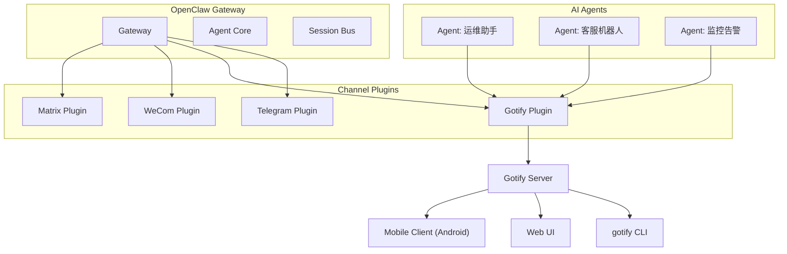
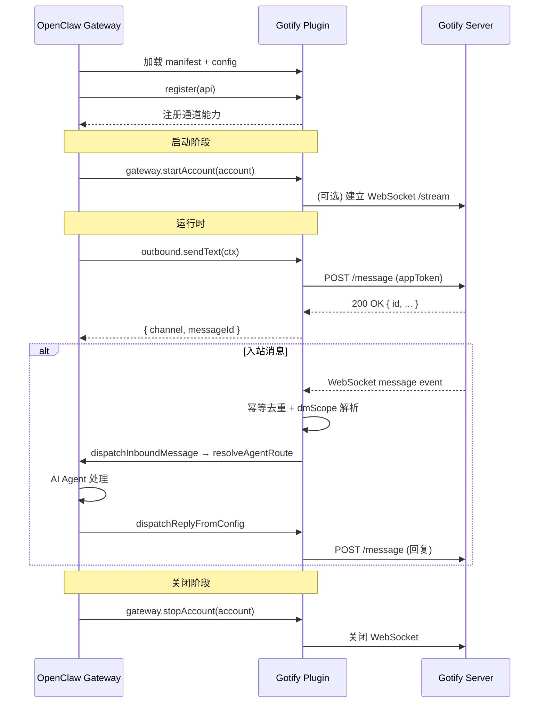
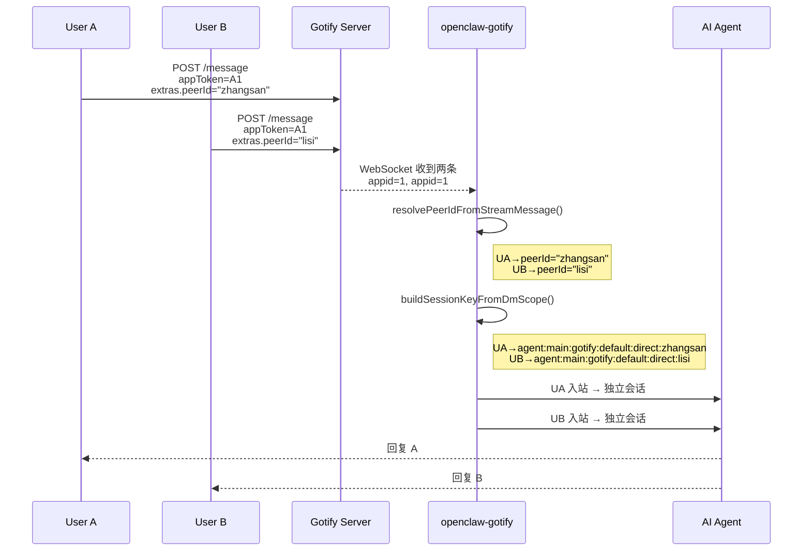
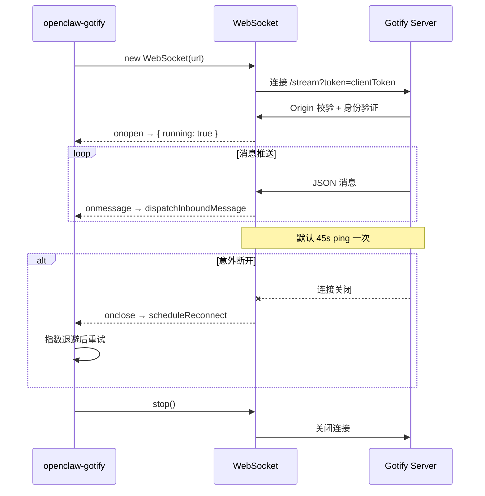
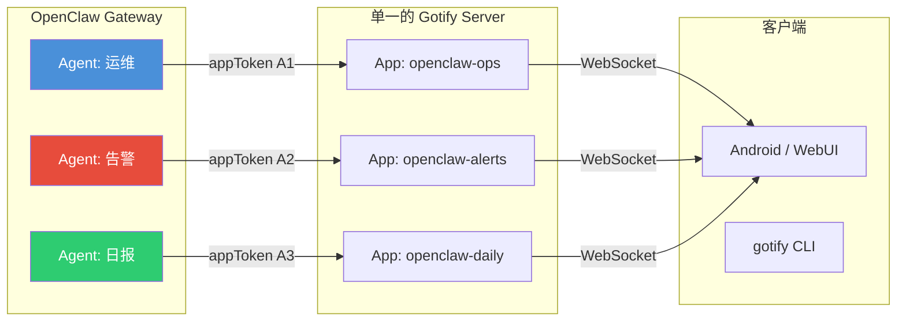

# OpenClaw-Gotify 架构设计文档（渠道插件版）

> **OpenClaw-Gotify = OpenClaw 生态的 Gotify 渠道适配器。**  
> 它遵循 OpenClaw 插件规范与通道契约，将 Gotify 自托管推送服务接入 OpenClaw 的统一消息平面，实现**出站通知、入站指令、自动化配置与双向交互**。

[](#)
[](#)
[](#)

---

**文档约定**：本文以 OpenClaw 插件 SDK 为基线，定义 `openclaw-gotify` 的架构设计、模块划分、API 交互与实现落点。「插件」即指 `openclaw-gotify`；默认运行环境为 Node.js / TypeScript，插件宿主为 OpenClaw Gateway。

**同步原则**：
- 与 OpenClaw 插件规范（`@openclaw/plugin-sdk`）保持同一套生命周期与能力注册模型；
- 必须实现 `ChannelPlugin` 完整接口，覆盖出站发送、入站监听、配置校验与生命周期钩子；
- 所有 Gotify 特定实现必须封装在独立客户端层，不污染 OpenClaw 通道抽象。

---

## 目录

### Part I：定位与核心价值
- 1. 为什么需要 OpenClaw-Gotify
- 2. 在 OpenClaw 插件生态中的位置
- 3. 应用场景
- 4. 三条硬约束与总体架构

### Part II：架构总览——通道插件模型
- 5. OpenClaw 通道插件模型回顾
- 6. Gotify 适配的五层职责
- 7. 核心工作流：出站、入站与配置向导
  - 7.5 双向多用户通信模型

### Part III：核心技术实现
- 8. 模块划分与目录结构
- 9. Gotify REST API 客户端封装（gotify-api.ts）
- 10. Gotify WebSocket 客户端与入站监听（ws-listener.ts）
- 11. 消息映射器：OpenClaw ↔ Gotify（message-mapper.ts）
- 12. 配置解析与多账号管理（config.ts + channel-config.ts）
- 13. 会话隔离与 DM 作用域（dm-scope.ts）
  - 13.3 Gotify Client 交互模型
- 14. 运行时快照与状态追踪（runtime.ts）
- 15. 自动化配置引导（setup.ts + config-wizard.ts）
- 16. 入口与 HTTP 路由（index.ts + channel.ts）
  - 16.4 入站消息分派流程（多用户视角）

### Part IV：OpenClaw 插件契约对齐
- 17. ChannelPlugin 适配器映射
- 18. SDK 导入路径与注册模式
- 19. ChannelConfigSchema 配置校验

### Part V：部署与集成
- 20. 插件安装与配置
- 21. 多账号部署模式
- 22. 运维命令与诊断

### Part VI：测试与验收
- 23. 单元测试策略
- 24. 集成测试：端到端消息流
- 25. 兼容性验证基线

### Part VII：附录
- 附录 A：Gotify API 速查表
- 附录 B：配置示例
- 附录 C：术语表

---

# Part I：定位与核心价值

## 1. 为什么需要 OpenClaw-Gotify

OpenClaw 本身提供了一套强大的多渠道消息抽象，但官方渠道生态无法覆盖所有用户偏好的通知方式。Gotify 是一个轻量、安全的**自托管消息推送服务**，深受自托管爱好者和开发者的青睐。

`openclaw-gotify` 插件将 Gotify 接入 OpenClaw 的消息平面，实现以下关键价值：

- **隐私优先**：消息不经过第三方推送服务，完全由用户自托管的 Gotify 服务器中转。
- **实时推送**：利用 Gotify 的 WebSocket 机制，实现 OpenClaw 事件的即时手机通知。
- **双向交互潜力**：不仅支持 OpenClaw → Gotify 的出站通知，还可通过 WebSocket 监听 Gotify 客户端的回复，为 OpenClaw 提供简易的移动端指令入口。
- **零摩擦配置**：利用 Gotify 的 Application API 实现自动化应用创建，用户仅需提供客户端令牌即可完成配置。
- **多智能体通知路由**：通过 OpenClaw 的多账号绑定，实现不同 AI Agent 到不同 Gotify 应用的路由隔离。

### 1.1 三大非妥协目标

| 目标 | 强约束 | 插件体现 |
|------|--------|----------|
| **OpenClaw 通道契约兼容** | 必须完整实现 `ChannelPlugin` 接口，遵循出站/入站规范 | `defineChannelPluginEntry`，`outbound.sendText`，`gateway.startAccount/stopAccount` |
| **Gotify API 全量对接** | 支持 Message API、WebSocket Stream API、Application API | `gotify-api.ts`、`ws-listener.ts`、`setup.ts` |
| **用户体验闭环** | 安装、配置、运行、诊断形成完整闭环 | 配置校验、`channel-config.ts` JSON Schema、doctor 风格诊断输出 |

### 1.2 非目标

- 不替代 Gotify 官方客户端或服务端功能；
- 不实现 Gotify 的用户管理或客户端管理（User API / Client API 仅用于向导场景）；
- 不在插件内实现消息存储或离线队列（由 Gotify 服务器和 OpenClaw 共同保证）；
- 不实现 Gotify Go 插件系统（openclaw-gotify 是 TypeScript 渠道插件，非 Go plugin）。

## 2. 在 OpenClaw 插件生态中的位置

`openclaw-gotify` 属于 **Channel Plugin** 类别，与 `@openclaw/matrix`、`@wecom/wecom-openclaw-plugin` 等处于同一扩展层。



**插件层级职责**：
- **上承 OpenClaw Gateway**：通过标准化通道接口接收出站消息，回调入站处理器；
- **下接 Gotify 服务器**：封装 REST API 和 WebSocket 连接，处理认证、序列化、错误重试、幂等去重。

## 3. 应用场景

### 3.1 AI Agent 移动通知中心

OpenClaw 的 AI Agent 在后台执行任务时（如代码审查、数据查询、定时任务），通过 Gotify 通道向用户手机推送通知：

```
Agent (代码审查) → OpenClaw Gateway → Gotify 通道 → POST /message
                                                      ↓
                                               Gotify Server
                                                      ↓
                                          Android 推送通知 ← WebSocket
```

用户无需打开 OpenClaw Web UI，即可在手机上实时收到 Agent 的通知消息。支持点击通知直接跳转到相关页面（通过 `client::notification.click.url` extras）。

### 3.2 多智能体通知隔离

通过 OpenClaw 的多账号绑定功能，不同 Agent 的消息路由到不同的 Gotify 应用/账号：

```json
{
  "channels": {
    "gotify": {
      "accounts": {
        "ops": { "serverUrl": "...", "appToken": "A1..." },
        "alerts": { "serverUrl": "...", "appToken": "A2..." },
        "daily": { "serverUrl": "...", "appToken": "A3..." }
      }
    }
  },
  "bindings": [
    { "agentId": "ops-agent", "match": { "channel": "gotify", "accountId": "ops" } },
    { "agentId": "monitor", "match": { "channel": "gotify", "accountId": "alerts" } },
    { "agentId": "reporter", "match": { "channel": "gotify", "accountId": "daily" } }
  ]
}
```

不同 Agent 的输出在 Gotify Web UI 中按应用分组展示，用户可以按来源筛选和查看。

### 3.3 入站指令响应

当用户通过 Gotify 手机客户端发送消息时，WebSocket 流将该消息传入 OpenClaw，触发 Agent 执行：

```
用户发消息 → Gotify 手机客户端 → Gotify Server
                                      ↓
                                WebSocket /stream
                                      ↓
                          ws-listener.ts → dispatchInboundMessage
                                      ↓
                          resolveAgentRoute → Agent 处理
                                      ↓
                          dispatchReplyFromConfig → sendGotifyMessage
                                      ↓
                              用户收到 Agent 回复 ← Gotify 推送
```

典型场景：用户发送 `@agent 查看服务器状态`，Agent 执行系统命令后通过 Gotify 返回结果。

### 3.4 监控告警与自动通知

与监控系统结合，作为告警通知通道：

- **Prometheus Alertmanager**：通过 webhook 将告警转发到 OpenClaw，再由 Gotify 通道推送到手机；
- **Uptime Kuma**：服务宕机/恢复通知；
- **CI/CD 流水线**：构建成功/失败通知，支持按优先级区分告警级别；
- **定时任务报告**：Agent 定时执行任务（如日报生成）后推送结果。

### 3.5 跨渠道消息中继

利用 OpenClaw 的多通道能力，将 Gotify 收到的消息 relay 到其他渠道（如 Telegram、Slack），实现"一处发送，多处接收"。

```
Gotify Server → Gotify 通道 → OpenClaw Gateway
                                ↓
                   ┌───────────┼───────────┐
                   ↓           ↓           ↓
               Telegram    Slack      WeChat
```

## 4. 三条硬约束与总体架构

### 4.1 硬约束 A：OpenClaw 通道契约不可退化

| 契约对象 | 要求 | 插件落点 |
|----------|------|----------|
| `ChannelPlugin.id` | 唯一标识 `gotify` | `channel.ts:76` |
| `ChannelPlugin.config` | 提供配置解析与账号管理 | `config.ts` 导出函数 |
| `ChannelPlugin.configSchema` | 提供 JSON Schema 校验配置 | `channel-config.ts` 导出 `gotifyConfigSchema` |
| `ChannelPlugin.outbound.sendText` | 发送消息到 Gotify | `outbound.ts` → `gotify-api.ts:sendGotifyMessage` |
| `ChannelPlugin.gateway.startAccount` | 启动入站 WebSocket 监听 | `channel.ts:167` → `ws-listener.ts` |
| `ChannelPlugin.gateway.stopAccount` | 停止入站监听 | `channel.ts:197` |
| 注册 HTTP 路由 | 插件状态查看与诊断 | `index.ts:22-52` |

### 4.2 硬约束 B：Gotify API 语义必须完整封装

| Gotify 能力 | 对应 API | 插件封装 |
|-------------|----------|----------|
| 发送消息 | `POST /message`（appToken） | `gotify-api.ts:sendGotifyMessage` |
| 接收实时消息 | WebSocket `/stream`（clientToken） | `ws-listener.ts:createGotifyWsListener` |
| 创建应用 | `POST /application`（clientToken） | `gotify-api.ts:createApplication` |
| 查询应用 | `GET /application`（clientToken） | `gotify-api.ts:listApplications` |
| 查询客户端 | `GET /client`（clientToken） | `gotify-api.ts:listClients` |

### 4.3 硬约束 C：用户体验必须自包含

- 用户不应被迫阅读 Gotify 文档才能配置插件；
- 插件应提供清晰的错误信息，指明配置缺失项；
- 向导模式应自动完成应用创建，并提示用户保存生成的令牌；
- 提供 `doctor` 诊断端点，一键检查配置连通性。

---

# Part II：架构总览——通道插件模型

## 5. OpenClaw 通道插件模型回顾

OpenClaw 的通道插件遵循以下生命周期：



## 6. Gotify 适配的五层职责

| 层次 | 职责 | 实现组件 |
|------|------|----------|
| **接口适配层** | 实现 `ChannelPlugin` 接口，处理配置解析、账号管理 | `src/channel.ts` + `src/index.ts` |
| **消息转换层** | OpenClaw OutboundContext ↔ Gotify MessagePayload | `src/message-mapper.ts` |
| **网络客户端层** | Gotify REST API 封装（含重试、超时、并发锁） | `src/gotify-api.ts` (+ `src/gotify-client.ts` 轻量封装) |
| **WebSocket 监听层** | WebSocket 连接管理、自动重连、消息分发 | `src/ws-listener.ts` |
| **配置引导层** | 自动应用创建、令牌获取、doctor 诊断 | `src/setup.ts` + `src/config-wizard.ts` |

## 7. 核心工作流

### 7.1 出站消息流（OpenClaw → Gotify）

1. OpenClaw 产生通知（如任务完成、审批请求）；
2. Gateway 根据 `bindings` 配置将消息路由到 `gotify` 通道；
3. 插件的 `outbound.sendText` 被调用，传入 `ChannelOutboundContext`；
4. `selectAccountId()` 解析目标账号（优先级：显式 accountId > target 前缀 > 默认账号）；
5. `resolveGotifyAccount()` 合并单账号 + 多账号配置，补齐所有默认值；
6. `mapOutboundToGotify()` 将 OpenClaw 格式转换为 Gotify 请求体（含 extras 映射）；
7. `sendGotifyMessage()` 通过账号级并发锁串行化请求，执行 `fetchWithRetry`；
8. Gotify 服务器存储消息并通过 WebSocket 推送到客户端；
9. `patchAccountSnapshot()` 更新运行时快照（`lastOutboundAt`）。

### 7.2 入站消息流（Gotify → OpenClaw）

1. 插件在 `gateway.startAccount` 中创建 WebSocket 连接（`createGotifyWsListener`）；
2. Gotify 服务器推送新消息；
3. `ws-listener.ts` 解析 JSON → `dispatchInboundMessage()`；
4. **幂等去重**：检查 `dedupCache`，30 秒窗口内相同 `messageId` 丢弃；
5. `resolvePeerIdFromStreamMessage()` 识别对端（优先级：extras > appid > title > "gotify"）；
6. `buildSessionKeyFromDmScope()` 按 dmScope 策略构造会话键；
7. `runtime.channel.routing.resolveAgentRoute()` 路由到目标 Agent；
8. `runtime.channel.reply.finalizeInboundContext()` 构建入站上下文；
9. `runtime.channel.reply.dispatchReplyFromConfig()` 执行 Agent 回复流程；
10. Agent 回复通过 `sendGotifyMessage()` 发送回 Gotify。

### 7.3 自动化配置向导流

1. 用户配置 `serverUrl` + `clientToken`，未提供 `appToken`；
2. 插件激活时检测到 `bootstrap.enabled: true`；
3. `bootstrapGotifyAccount()` → `listApplications()` 检查同名应用；
4. 若不存在且 `autoCreateApplication: true`，调用 `POST /application` 创建新应用；
5. 返回生成的 `appToken`，提示用户更新配置文件。

### 7.4 健康诊断流

HTTP GET `/gotify/doctor` 触发：

1. 遍历所有已配置账号；
2. 对每个账号执行 `runGotifyDoctor()`：
   - 检查 `serverUrl`、`appToken`、`clientToken` 是否缺失；
   - 若 `clientToken` 存在，尝试 `listApplications()` 和 `listClients()` 验证连通性；
3. 返回完整诊断报告。

---

### 7.5 双向多用户通信模型

openclaw-gotify 支持**多用户与 AI Agent 之间的双向通信**。这一能力源自 Gotify 的消息模型与 OpenClaw 通道插件架构的结合。

#### 7.5.1 模型基础：Gotify 的消息广播机制

Gotify 的 WebSocket 流**不区分消息来源**。同一个 Gotify 账户下，**所有 Application 产生的消息都会出现在同一个 WebSocket 流中**：

```
┌─ Gotify User Account ────────────────────────────┐
│                                                   │
│  Application "openclaw-agent" ← appToken = A1     │
│    └─ 消息: { id:1, appid:1, message:"通知" }     │
│                                                   │
│  Application "user-zhang"     ← appToken = A2     │
│    └─ 消息: { id:2, appid:2, message:"查询" }     │
│                                                   │
│  Client "openclaw-listener"   ← clientToken = C   │
│    └─ WebSocket /stream → 收到 appid=1 和 appid=2 │
│      该用户账户下所有 Application 的消息            │
└───────────────────────────────────────────────────┘
```

这意味着：**只要使用同一个 Gotify 用户账户下的 token，任何人都可以向任意 Application 发送消息，且所有消息都会被 WebSocket 流接收。**

#### 7.5.2 多用户隔离机制

多个用户向同一个 Agent 发消息时，通过 `extras.openclaw.peerId` 实现会话隔离：



**会话键差异保证对话完全隔离**。两种常用模式：

| 模式 | 原理 | 适用场景 |
|------|------|----------|
| **显式 peerId** | 发送方在 `extras.openclaw.peerId` 中携带身份 | 多个用户共享同一个 appToken，内部工具场景 |
| **隐式 appid** | 每人独立的 Application，WebSocket 通过 appid 区分 | 每人独享 appToken，隔离性更好 |

#### 7.5.3 出站方向：Agent 回复的可见性

**所有出站消息（Agent 回复）都使用配置的 account 的 `appToken` 发送**：

```typescript
// channel.ts: dispatchInboundMessage 中创建回复分发器
const dispatcher = runtime.channel.reply.createReplyDispatcherWithTyping({
  deliver: async (payload) => {
    await sendGotifyMessage(account, {
      message: payload.text,
      title: peerId,  // 回复标题标记这是给谁的
      priority: account.defaultPriority,
    });
  },
});
```

Agent 回复在 `title` 字段中携带 `peerId`，接收方可以知道回复目标。这是 Gotify 的"广播"特性——无法做到定向推送，所有能访问该 WebSocket 流的客户端都会收到。

#### 7.5.4 三种部署模式对比

| 模式 | 配置复杂度 | 用户隔离 | 回复可见性 | 适用场景 |
|------|-----------|---------|-----------|----------|
| **单应用 + peerId** | 低：一个 appToken 共享 | 会话隔离 | 所有用户看到所有回复 | 运维小团队 |
| **每人一应用** | 中：每人一个 appToken | 会话隔离 | 用户只看到给自己应用的回复 | 独立用户 |
| **混合** | 高：按角色分组 | 组内共享，组间隔离 | 组内可见 | 多部门多角色 |

**模式一：单应用 + peerId（推荐快速启动）**

```json
{
  "channels": {
    "gotify": {
      "serverUrl": "https://gotify.example.com",
      "appToken": "A_AGENT",
      "clientToken": "C_BOT",
      "inbound": { "enabled": true }
    }
  }
}
```

用户发送时各带自己的 peerId：

```bash
# User A
curl -X POST "https://gotify.example.com/message?token=A_AGENT" \
  -d '{"message":"查负载","extras":{"openclaw":{"peerId":"zhangsan"}}}'

# User B
curl -X POST "https://gotify.example.com/message?token=A_AGENT" \
  -d '{"message":"明天天气","extras":{"openclaw":{"peerId":"lisi"}}}'
```

**模式二：每人一应用**

```json
{
  "channels": {
    "gotify": {
      "serverUrl": "https://gotify.example.com",
      "clientToken": "C_BOT",
      "inbound": { "enabled": true },
      "accounts": {
        "agent": { "appToken": "A_AGENT" }
      }
    }
  }
}
```

用户各用自己的 appToken 发送，插件通过 `appid` 自动区分：

```bash
# User A → 用自己的 Application
curl -X POST "https://gotify.example.com/message?token=A_USERA" \
  -d '{"message":"查负载"}'

# User B → 用自己的 Application
curl -X POST "https://gotify.example.com/message?token=A_USERB" \
  -d '{"message":"明天天气"}'
```

`resolvePeerIdFromStreamMessage()` 兜底到 `appid`，appid 不同 → session key 不同 → 会话隔离。

---

# Part III：核心技术实现

## 8. 模块划分与目录结构

```
openclaw-gotify/
├── src/
│   ├── index.ts                # 插件入口，defineChannelPluginEntry + HTTP 路由
│   ├── channel.ts              # 通道插件核心实现（ChannelPlugin 对象）
│   ├── channel-config.ts       # 配置 Schema 定义（Zod + JSON Schema + uiHints）
│   ├── config.ts               # 配置解析、账号合并、默认值补齐
│   ├── types.ts                # TypeScript 类型定义（9 个接口）
│   ├── openclaw-sdk.d.ts       # OpenClaw SDK 类型声明（补丁）
│   ├── gotify-api.ts           # Gotify HTTP API 封装（fetch + 重试 + 超时 + 并发锁）
│   ├── gotify-client.ts        # GotifyClient 类（gotify-api 的轻量面向对象封装）
│   ├── outbound.ts             # 出站适配器（deliveryMode: 'direct'）
│   ├── message-mapper.ts       # OpenClaw ↔ Gotify 消息格式转换
│   ├── dm-scope.ts             # 会话隔离策略（4 种 dmScope）
│   ├── runtime.ts              # 运行时快照（账号状态追踪）
│   ├── ws-listener.ts          # WebSocket 监听器（指数退避重连）
│   ├── setup.ts                # bootstrap + doctor 能力
│   ├── setup-entry.ts          # 轻量 setup 入口（defineSetupPluginEntry）
│   └── config-wizard.ts        # 配置向导
├── scripts/test-client.ts      # 手动测试脚本
├── docs/                       # 架构文档 + 使用指南
├── .github/workflows/          # CI + Release
├── package.json / tsconfig.json / vitest.config.ts / eslint.config.mjs
└── openclaw.plugin.json        # 插件清单（manifest）
```

**模块职责速查**：

| 文件 | 核心导出 | 职责 |
|------|---------|------|
| `index.ts` | `default export` (defineChannelPluginEntry) | 插件入口，注册 HTTP 路由 |
| `channel.ts` | `gotifyChannel` (ChannelPlugin) | ChannelPlugin 完整实现 |
| `channel-config.ts` | `gotifyConfigSchema` (ChannelConfigSchema) | 配置 JSON Schema + Zod 类型校验 |
| `config.ts` | `resolveGotifyAccount`, `listGotifyAccountIds` | 配置解析、账号合并 |
| `gotify-api.ts` | `sendGotifyMessage`, `listApplications`, `createApplication` | REST API 调用（含重试/超时/并发锁） |
| `gotify-client.ts` | `GotifyClient` class | 面向对象封装 |
| `outbound.ts` | `gotifyOutbound` (ChannelOutboundAdapter) | 出站发送适配器 |
| `message-mapper.ts` | `mapOutboundToGotify`, `mapGotifyToInbound` | 格式转换与 extras 处理 |
| `dm-scope.ts` | `buildSessionKeyFromDmScope`, `resolvePeerIdFromStreamMessage` | 会话隔离 |
| `runtime.ts` | `patchAccountSnapshot`, `getAllAccountSnapshots` | 运行时状态追踪 |
| `ws-listener.ts` | `createGotifyWsListener` | WebSocket 连接管理 + 自动重连 |
| `setup.ts` | `bootstrapGotifyAccount`, `doctorGotifyAccount` | 应用创建 + 诊断 |
| `config-wizard.ts` | `runConfigWizard` | 配置向导（查找/创建 Application） |

## 9. Gotify REST API 客户端封装（gotify-api.ts）

`gotify-api.ts` 负责所有 HTTP 请求，统一处理 URL 拼接、认证头、错误转换、重试策略和并发控制。

### 9.1 账号级并发锁

```typescript
const accountLocks = new Map<string, Promise<void>>();
```

同一 `accountId` 的请求**串行化**，防止高并发下触发 Gotify 服务端限流。实现方式：

1. 每次请求前将上一个请求的 Promise 存入 `accountLocks` Map；
2. 新请求 await 上一个 Promise 完成后再执行；
3. 当前请求完成后清理 Map（仅当没有新请求在等待时）；
4. 本质是轻量级的**请求队列**，无需外部协调服务。

### 9.2 重试与超时策略

```
fetchWithRetry(fetchImpl, url, init, options)
  ├─ retryCount: 1 (默认) — 最多重试 1 次
  ├─ retryDelayMs: 250ms (默认) — 重试间隔
  ├─ timeoutMs: 8000ms (默认) — 请求超时
  │
  ├─ 5xx 服务端错误 → 等待后重试
  ├─ 网络异常 (rejected) → 等待后重试
  └─ 4xx 客户端错误 → 立即抛出，不重试
```

超时实现：`AbortController` + `setTimeout`，超时后 `controller.abort()`。

### 9.3 发送消息

```typescript
sendGotifyMessage(account, payload, options?)
  → buildMessageRequest → POST {serverUrl}/message
  → Headers: X-Gotify-Key: {appToken}
  → Body: { message, title?, priority?, extras? }
  → Response: { id, appid, title, message, priority, extras, date }
```

### 9.4 应用/客户端查询

```typescript
listApplications(account)  → GET {serverUrl}/application  → Header: X-Gotify-Key: {clientToken}
listClients(account)       → GET {serverUrl}/client       → Header: X-Gotify-Key: {clientToken}
createApplication(account, {name, description}) → POST {serverUrl}/application
```

### 9.5 Doctor 诊断

```typescript
runGotifyDoctor(account) → GotifyDoctorReport {
  ok: boolean;
  serverUrl: string | null;
  hasAppToken: boolean;
  hasClientToken: boolean;
  applicationsChecked: boolean;
  clientsChecked: boolean;
  errors: string[];
}
```

## 10. Gotify WebSocket 客户端与入站监听（ws-listener.ts）

`createGotifyWsListener()` 创建一个 WebSocket 监听器控制器，提供连接管理、自动重连、消息分发。

### 10.1 连接生命周期



### 10.2 指数退避重连

| 参数 | 默认值 | 说明 |
|------|--------|------|
| `reconnectDelayMs` | 2000ms | 初始重连延迟 |
| `maxReconnectDelayMs` | 30000ms | 最大重连延迟（上限） |
| `maxReconnectAttempts` | 10 | 最大重连尝试次数 |

算法：
1. 连接断开 → 等待 `reconnectDelay`
2. 重连失败 → `reconnectDelay = min(reconnectDelay * 2, maxReconnectDelayMs)`
3. 连接成功 → `reconnectDelay` 重置为初始值，`reconnectAttempts` 归零
4. 超过 `maxReconnectAttempts` → 停止重连，报告 "WebSocket reconnect attempts exhausted"

### 10.3 消息分发

```typescript
socket.onmessage = async (event) => {
  const parsed = JSON.parse(event.data) as GotifyStreamEnvelope;
  await deps.onMessage(parsed);
};
```

解析错误时通过 `onStateChange` 回调报告，不中断连接。

### 10.4 安全终止

```typescript
stop() {
  stopped = true;       // 防止重连调度
  clearTimeout(reconnectTimer);
  socket?.close();
  socket = null;
  deps.onStateChange?.({ running: false, lastError: null });
}
```

## 11. 消息映射器：OpenClaw ↔ Gotify（message-mapper.ts）

### 11.1 出站映射（`mapOutboundToGotify`）

| OpenClaw 字段 | Gotify 字段 | 处理逻辑 |
|---------------|-------------|----------|
| `ctx.text` | `message` | 直接映射 |
| `ctx.title` | `title` | 可选，默认 undefined |
| `ctx.priority` | `priority` | 可选，未指定则使用 `account.defaultPriority` |
| `ctx.extras` | `extras.*` | 深度合并 |
| `metadata.url` | `extras.client::notification.click.url` | 点击通知打开 URL |
| `metadata.contentType` | `extras.client::display.contentType` | 如 `text/markdown` |

**extras 合并策略**：`deepMerge()` 递归合并，确保不丢失已有字段。仅当输出非空时设置 extras。

### 11.2 入站映射（`mapGotifyToInbound`）

| Gotify 字段 | OpenClaw 入站字段 | 说明 |
|-------------|-------------------|------|
| `message` | `text` | 消息正文 |
| `id`, `appid`, `title`, `priority`, `extras`, `date` | `metadata.*` | 聚合为元数据对象 |

## 12. 配置解析与多账号管理（config.ts + channel-config.ts）

### 12.1 配置结构

```typescript
interface GotifyChannelConfig {
  // 单账号模式（顶层字段）
  enabled?: boolean;
  serverUrl?: string;
  appToken?: string;
  clientToken?: string;
  defaultPriority?: number;
  inbound?: GotifyStreamConfig;
  bootstrap?: GotifyBootstrapConfig;

  // 多账号模式
  defaultAccount?: string;
  accounts?: Record<string, GotifyAccountConfig>;
}
```

### 12.2 账号解析策略

`resolveGotifyAccount(cfg, accountId?)`：

1. 读取 `channels.gotify` 配置；
2. 确定账号 ID：优先使用传入的 `accountId`，否则使用 `resolveDefaultGotifyAccountId()`；
3. 读取多账号配置 `accounts[resolvedAccountId]`；
4. 单账号配置（顶层字段）作为 `base`，多账号配置作为 `override`，**深度合并**；
5. 所有字段补齐默认值（priority=5, reconnect=2s/30s/10次 等）；
6. 返回 `ResolvedGotifyAccount`（所有字段已解析为具体值）。

**合并优先级**：`multiAccount config > singleAccount top-level config > defaults`

### 12.3 账号 ID 枚举

```typescript
listGotifyAccountIds(cfg): string[]
  → 优先返回 accounts 字典的 key 列表
  → 若 accounts 为空，返回 ['default']（兼容单账号模式）

resolveDefaultGotifyAccountId(cfg): string
  → 优先使用配置中的 defaultAccount
  → 否则使用 listGotifyAccountIds()[0]
  → 兜底返回 DEFAULT_GOTIFY_ACCOUNT_ID ('default')
```

### 12.4 配置 Schema（channel-config.ts）

使用 Zod 定义运行时类型推导 + JSON Schema 用于 OpenClaw 配置 UI 校验：

```typescript
// Zod schema（类型推导）
export const GotifyAccountSchema = z.object({
  serverUrl: z.string().url().optional(),
  appToken: z.string().min(1).optional(),
  // ...
}).strict();

// JSON Schema（配置校验 + UI 提示）
export const gotifyConfigSchema: ChannelConfigSchema = {
  schema: {
    type: 'object',
    properties: {
      serverUrl: { type: 'string', format: 'uri', description: '...' },
      appToken: { type: 'string', minLength: 1, description: '...' },
      clientToken: { type: 'string', description: '...' },
      // ...
    }
  },
  uiHints: {
    serverUrl: { label: 'Gotify Server URL', placeholder: 'https://gotify.example.com' },
    appToken: { label: 'App Token', secret: true },
    clientToken: { label: 'Client Token', secret: true },
  }
};
```

## 13. 会话隔离与 DM 作用域（dm-scope.ts）

### 13.1 四种会话隔离策略

| dmScope | 会话键格式 | 隔离粒度 |
|---------|-----------|----------|
| `main` | `agent:{agentId}:main` | 所有入站消息共享一个会话 |
| `per-peer` | `agent:{agentId}:direct:{peerId}` | 按对端隔离 |
| `per-channel-peer` | `agent:{agentId}:{channel}:direct:{peerId}` | 按渠道+对端隔离 |
| `per-account-channel-peer` | `agent:{agentId}:{channel}:{accountId}:direct:{peerId}` | 按账号+渠道+对端隔离（最细粒度） |

### 13.2 对端识别优先级

`resolvePeerIdFromStreamMessage(message)` 决定了入站消息"是谁发的"，直接影响会话隔离：

```typescript
// dm-scope.ts:46-62
export function resolvePeerIdFromStreamMessage(message): string {
  const extraPeerId = (message.extras?.openclaw as Record<string, unknown> | undefined)?.peerId;
  if (typeof extraPeerId === 'string' && extraPeerId.trim()) {
    return normalizeToken(extraPeerId);    // ① 最高优先级
  }
  if (typeof message.appid === 'number' || typeof message.appid === 'string') {
    return normalizeToken(String(message.appid)); // ② appid 兜底
  }
  if (typeof message.title === 'string' && message.title.trim()) {
    return normalizeToken(message.title);  // ③ title 兜底
  }
  return 'gotify';                          // ④ 最终兜底
}
```

**优先级规则**：

| 优先级 | 来源字段 | 示例 | 典型场景 |
|--------|---------|------|----------|
| 1 (最高) | `extras.openclaw.peerId` | `"zhangsan"` | 多用户共享同一 appToken 时的显式身份标识 |
| 2 | `appid` | `1`, `2` | 每人一应用模式，通过 App ID 自动区分 |
| 3 | `title` | 消息标题 | 无 appid 和 peerId 时的兜底 |
| 4 | 固定值 `"gotify"` | — | 以上都缺失时回退 |

**多用户场景下的 peerId 解析示例**：

```
User A: 发送消息带 extras.openclaw.peerId="zhangsan"
       → resolvePeerIdFromStreamMessage → "zhangsan"
       → sessionKey: agent:main:gotify:default:direct:zhangsan

User B: 发送消息带 extras.openclaw.peerId="lisi"
       → resolvePeerIdFromStreamMessage → "lisi"
       → sessionKey: agent:main:gotify:default:direct:lisi
                                         不同 → 会话隔离 ✓
```

所有标识统一经过 `normalizeToken()`：`value.trim().toLowerCase()`。

### 13.3 Gotify Client 交互模型

openclaw-gotify 的 WebSocket 监听器使用 **clientToken** 连接到 Gotify 服务端。该 clientToken 属于一个 Gotify 用户账户，能看到该账户下**所有 Application 的所有消息**。

```typescript
// ws-listener.ts
const url = `${normalizeServerUrl(account.serverUrl)
  .replace(/^http/i, 'ws')}/stream?token=${encodeURIComponent(account.clientToken)}`;
```

理解这个模型对多用户场景至关重要：

```
同一 Gotify 用户账户:
  ├── Application A (appToken = A1) → 消息 appid=1
  ├── Application B (appToken = A2) → 消息 appid=2
  └── Client C (clientToken = C) → WebSocket 同时看到 appid=1 和 appid=2
                                   → 谁发的都收得到
                                   → 通过 peerId/appid 区分
```

**这不是限制，而是特性**——它让 openclaw-gotify 天然支持多用户入站，无需每个用户分配独立的 WebSocket 连接。

## 14. 运行时快照与状态追踪（runtime.ts）

使用内存 Map 追踪每个账号的运行状态：

```typescript
interface GotifyRuntimeSnapshot {
  running: boolean;           // 是否运行中
  lastStartAt: number | null; // 上次启动时间
  lastStopAt: number | null;  // 上次停止时间
  lastError: string | null;   // 上次错误信息
  lastInboundAt: number | null;  // 上次收到入站消息时间
  lastOutboundAt: number | null; // 上次发出出站消息时间
}
```

`patchAccountSnapshot()` 使用不可变更新（spread），每次调用返回最新快照。

`getAllAccountSnapshots()` 用于 `/gotify/status` 端点响应。

## 15. 自动化配置引导（setup.ts + config-wizard.ts）

### 15.1 Bootstrap 流程

```typescript
bootstrapGotifyAccount(account):
  1. 检查 bootstrap.enabled → 未启用则抛出
  2. GET /application 获取应用列表
  3. 查找同名应用 (bootstrap.applicationName)
  4. 已存在 → 返回 { created: false, applicationName, applicationToken }
  5. 不存在 → 检查 autoCreateApplication
  6. 未启用 → 抛出 "not found"
  7. 已启用 → POST /application 创建
  8. 返回 { created: true, applicationName, applicationToken }
```

### 15.2 Config Wizard

`runConfigWizard()` 与 bootstrap 逻辑相似，但专用于**配置 UI** 场景，返回 `appToken` 字符串用于写入配置。

### 15.3 Doctor 诊断

`runGotifyDoctor(account)` 返回包含以下信息的报告：
- 配置完整性（serverUrl、appToken、clientToken）
- API 连通性（applicationsChecked、clientsChecked）
- 错误详情列表

## 16. 入口与 HTTP 路由（index.ts + channel.ts）

### 16.1 插件入口（index.ts）

```typescript
export default defineChannelPluginEntry({
  id: 'openclaw-gotify',
  name: 'Gotify',
  description: 'OpenClaw Gotify channel plugin with REST delivery and WebSocket stream support.',
  plugin: gotifyChannel,
  setRuntime: setGotifyRuntime,
  registerFull(api) {
    // HTTP GET /gotify/status — 所有账号状态
    api.registerHttpRoute({
      path: '/gotify/status', auth: 'plugin', match: 'prefix',
      handler: async (req, res) => {
        const accounts = listGotifyAccountIds(cfg).map(id => ({
          ...resolveGotifyAccount(cfg, id),
          runtime: getAllAccountSnapshots()[id] ?? null,
        }));
        res.end(JSON.stringify({ ok: true, data: { accounts } }));
      },
    });
    // HTTP GET /gotify/doctor — 诊断所有账号
    api.registerHttpRoute({
      path: '/gotify/doctor', auth: 'plugin', match: 'prefix',
      handler: async (req, res) => {
        const reports = await Promise.all(
          listGotifyAccountIds(cfg).map(id => doctorGotifyAccount(resolveGotifyAccount(cfg, id)))
        );
        res.end(JSON.stringify({ ok: reports.every(r => r.ok), data: reports }));
      },
    });
  },
});
```

### 16.2 通道插件核心（channel.ts）

**能力声明**：
```typescript
capabilities: {
  chatTypes: ['direct'],   // 仅支持私聊
  media: false,
  reactions: false,
  threads: false,
  polls: false,
  nativeCommands: false,
  blockStreaming: true,    // 使用 block streaming 模式
}
```

**配置适配器**：委托给 `config.ts` 的纯函数。

**状态适配器**：`defaultRuntime` → `buildChannelSummary` → `probeAccount` → `buildAccountSnapshot`，结合 `runtime.ts` 的运行时快照和 `config.ts` 的配置摘要。

**网关适配器**：
- `startAccount`：创建 WebSocket 监听器，建立 `onMessage` 和 `onStateChange` 回调；
- `stopAccount`：关闭 WebSocket，清理监听器 Map。

### 16.3 幂等去重机制

```typescript
const dedupCache = new Map<string, number>();  // messageId → 到期时间戳
const DEDUP_WINDOW_MS = 30_000;                // 30 秒窗口

// 每 60 秒清理过期条目
setInterval(() => {
  for (const [id, expiresAt] of dedupCache) {
    if (expiresAt < Date.now()) dedupCache.delete(id);
  }
}, 60_000);
```

在 `dispatchInboundMessage` 中，收到消息后先检查 `dedupCache`：
- 命中且未过期 → 静默丢弃
- 未命中 → 设置到期时间，继续处理

### 16.4 入站消息分派流程（多用户视角）

`dispatchInboundMessage()` 是连接 WebSocket 入站与 OpenClaw Agent 的核心桥梁，也是多用户通信的关键路径：

```typescript
// channel.ts:217-295
export async function dispatchInboundMessage(
  ctx: ChannelGatewayContext<ResolvedGotifyAccount>,
  account: ResolvedGotifyAccount,
  message: GotifyStreamEnvelope
): Promise<void> {
  // ① 运行时健壮性检查
  if (!runtime?.config?.loadConfig || !runtime?.channel?.routing) return;

  // ② 幂等去重（30s 窗口）
  if (messageId && dedupCache.get(messageId) ...) return;

  // ③ 多用户识别 — 不同发送者解析出不同 peerId
  const peerId = resolvePeerIdFromStreamMessage(message);
  //    extras.openclaw.peerId → "zhangsan" / "lisi" (显式)
  //    appid                → "1" / "2" (隐式)

  // ④ 路由解析 — 按 (channel, accountId, peerId) 匹配
  const route = await runtime.channel.routing.resolveAgentRoute({
    cfg, channel: 'gotify',
    accountId: account.accountId,
    peer: { kind: 'dm', id: peerId },  // ← peerId 驱动路由
  });

  // ⑤ 会话隔离 — 不同 peerId → 不同 sessionKey → 不同对话上下文
  const sessionKey = buildSessionKeyFromDmScope({
    cfg, agentId: resolvedAgentId,
    channel: 'gotify',
    accountId: account.accountId,
    peerId,  // ← sessionKey 中的 peerId 保证隔离
  });

  // ⑥ 构建入站上下文
  const inboundContext = await runtime.channel.reply.finalizeInboundContext({
    channel: 'gotify', accountId: account.accountId,
    from: peerId, text: inbound.text, chatType: 'direct',
  });

  // ⑦ Agent 回复分发器
  const dispatcher = runtime.channel.reply.createReplyDispatcherWithTyping({
    deliver: async (payload) => {
      await sendGotifyMessage(account, {  // 使用 account.appToken 发送
        message: payload.text, title: peerId,  // title 携带接收者标识
        priority: account.defaultPriority,
      });
    },
  });

  // ⑧ 执行回复
  await runtime.channel.reply.dispatchReplyFromConfig({
    ctx: inboundContext, cfg, dispatcher, replyOptions: route,
  });
}
```

**多用户请求的分派差异**：

| 步骤 | User A 路径 | User B 路径 |
|------|------------|------------|
| peerId 解析 | `extras.openclaw.peerId="zhangsan"` → `"zhangsan"` | `extras.openclaw.peerId="lisi"` → `"lisi"` |
| 路由匹配 | `peer.id="zhangsan"` | `peer.id="lisi"` |
| sessionKey | `agent:main:gotify:default:direct:zhangsan` | `agent:main:gotify:default:direct:lisi` |
| Agent 上下文 | Agent 记忆 User A 的对话历史 | Agent 记忆 User B 的对话历史（完全独立） |
| 回复 title | `"zhangsan"` | `"lisi"` |
| 回复 appToken | 相同（account.appToken） | 相同（account.appToken） |

---

# Part IV：OpenClaw 插件契约对齐

## 17. ChannelPlugin 适配器映射

| ChannelPlugin 适配器 | openclaw-gotify 实现 | 关键函数/属性 |
|---|---|---|
| `configSchema` | `channel-config.ts:gotifyConfigSchema` | JSON Schema + uiHints |
| `config.listAccountIds` | `config.ts:listGotifyAccountIds` | 枚举账号 ID |
| `config.resolveAccount` | `config.ts:resolveGotifyAccount` | 合并单+多账号配置 |
| `config.defaultAccountId` | `config.ts:resolveDefaultGotifyAccountId` | 默认账号 ID |
| `config.setAccountEnabled` | SDK `setAccountEnabledInConfigSection` | 启用/禁用账号 |
| `config.deleteAccount` | SDK `deleteAccountFromConfigSection` | 删除账号 |
| `config.isConfigured` | `account.configured` | serverUrl + appToken 是否存在 |
| `config.unconfiguredReason` | `'channels.gotify missing serverUrl or appToken'` | 未配置原因 |
| `config.describeAccount` | `config.ts:describeGotifyAccountSnapshot` | 配置摘要 |
| `outbound` | `outbound.ts:gotifyOutbound` | `deliveryMode: 'direct'` |
| `status.defaultRuntime` | 默认 `GotifyRuntimeSnapshot` | running=false |
| `status.buildChannelSummary` | 适配器函数 | 运行状态摘要 |
| `status.probeAccount` | `async () => ({ ok: true })` | 空探测 |
| `status.buildAccountSnapshot` | 合并配置 + 运行时快照 | 完整快照 |
| `gateway.startAccount` | `channel.ts:167` | WebSocket 启动 |
| `gateway.stopAccount` | `channel.ts:197` | WebSocket 停止 |
| `capabilities` | `chatTypes: ['direct'], blockStreaming: true` | 能力声明 |
| `messaging.normalizeTarget` | `normalizeGotifyMessagingTarget` | 去除 gotify: 前缀 |
| `messaging.targetResolver` | `looksLikeId + hint` | 目标解析 |
| `threading.resolveReplyToMode` | `() => 'off'` | 无线程回复 |
| `groups.resolveRequireMention` | `() => false` | 无需 @提及 |
| `reload` | `configPrefixes: ['channels.gotify', 'session.dmScope']` | 热重载触发 |

## 18. SDK 导入路径与注册模式

### 18.1 使用的 SDK 导入路径

| 导入路径 | 用途 |
|---|---|
| `openclaw/plugin-sdk/channel-core` | `defineChannelPluginEntry`, `defineSetupPluginEntry` |
| `openclaw/plugin-sdk/core` | `OpenClawPluginApi` 类型 |
| `openclaw/plugin-sdk` (barrel) | `OpenClawConfig`, `ChannelAccountSnapshot`, `ChannelPlugin`, `ChannelGatewayContext`, `ChannelOutboundContext`, `OutboundDeliveryResult`, `ChannelOutboundAdapter` |
| `openclaw/plugin-sdk` (barrel) | `deleteAccountFromConfigSection`, `setAccountEnabledInConfigSection` |

### 18.2 注册模式

`defineChannelPluginEntry` 自动处理 OpenClaw 的四种注册模式：

| 模式 | openclaw-gotify 行为 |
|---|---|
| `"full"` | 注册通道能力 + HTTP 路由（status/doctor） |
| `"setup-only"` | 仅注册通道能力 |
| `"setup-runtime"` | 注册通道能力 + 设置 runtime 引用 |
| `"cli-metadata"` | 无额外注册（无 CLI 命令） |

`setup-entry.ts` 使用 `defineSetupPluginEntry(gotifyChannel)`，实现轻量加载。

## 19. ChannelConfigSchema 配置校验

openclaw-gotify 的配置 Schema 等效于 OpenClaw SDK 的 `buildCatchallMultiAccountChannelSchema()` + `buildChannelConfigSchema()`，手动构建为以下结构：

```typescript
{
  schema: {
    type: 'object',
    additionalProperties: true,          // 允许账号任意扩展字段
    properties: {
      serverUrl: { type: 'string', format: 'uri' },
      appToken: { type: 'string', minLength: 1 },
      clientToken: { type: 'string' },
      defaultPriority: { type: 'integer', minimum: 0, maximum: 10, default: 5 },
      inbound: { type: 'object', properties: { ... }, additionalProperties: false },
      bootstrap: { type: 'object', properties: { ... }, additionalProperties: false },
      accounts: { type: 'object', additionalProperties: true },
      defaultAccount: { type: 'string' },
    },
  },
  uiHints: { ... },
}
```

所有配置字段均为可选（`required: []`），由 `resolveGotifyAccount()` 补齐默认值，确保即使配置不完整也不会导致启动失败。

---

# Part V：部署与集成

## 20. 插件安装与配置

### 20.1 通过 ClawHub 安装

```bash
openclaw plugins install @partme.ai/openclaw-gotify
```

### 20.2 本地开发安装

```bash
git clone https://github.com/partme-ai/openclaw-gotify
cd openclaw-gotify
pnpm install && pnpm build
openclaw plugins install ./openclaw-gotify
```

### 20.3 最小配置（仅出站）

```json
{
  "channels": {
    "gotify": {
      "serverUrl": "https://gotify.example.com",
      "appToken": "YOUR_APP_TOKEN"
    }
  }
}
```

### 20.4 完整配置（出站 + 入站 + 多账号）

参见附录 B。

## 21. 多账号部署模式

### 21.1 场景：多智能体通知隔离

```json
{
  "channels": {
    "gotify": {
      "defaultAccount": "ops",
      "accounts": {
        "ops": {
          "serverUrl": "https://gotify.example.com",
          "appToken": "A_OPS_TOKEN",
          "clientToken": "C_OPS_TOKEN",
          "inbound": { "enabled": true }
        },
        "alerts": {
          "serverUrl": "https://gotify.example.com",
          "appToken": "A_ALERTS_TOKEN"
        },
        "daily": {
          "serverUrl": "https://gotify.example.com",
          "appToken": "A_DAILY_TOKEN"
        }
      }
    }
  },
  "bindings": [
    { "agentId": "ops-agent", "match": { "channel": "gotify", "accountId": "ops" } },
    { "agentId": "monitor", "match": { "channel": "gotify", "accountId": "alerts" } },
    { "agentId": "reporter", "match": { "channel": "gotify", "accountId": "daily" } }
  ],
  "session": {
    "dmScope": "per-account-channel-peer"
  }
}
```

### 21.2 场景：多 Gotify 服务器聚合

```json
{
  "channels": {
    "gotify": {
      "accounts": {
        "prod": { "serverUrl": "https://gotify.prod.example.com", "appToken": "A_PROD" },
        "staging": { "serverUrl": "https://gotify.staging.example.com", "appToken": "A_STAGING" }
      }
    }
  }
}
```

### 21.3 网络拓扑



## 22. 运维命令与诊断

```bash
# 查看插件状态
openclaw plugins list

# 查看 Gotify 账号状态（通过插件 HTTP 路由）
curl http://gateway:port/gotify/status

# 运行诊断
curl http://gateway:port/gotify/doctor

# 使用测试脚本
GOTIFY_SERVER_URL=... GOTIFY_APP_TOKEN=... GOTIFY_CLIENT_TOKEN=... npm run test:client
```

**日志约定**：插件所有日志均以 `[openclaw-gotify]` 前缀输出，便于过滤。

---

# Part VI：测试与验收

## 23. 单元测试策略

| 测试文件 | 测试内容 | Mock 策略 |
|---|---|---|
| `config.test.ts` | 账号解析、多账号合并、默认值补齐 | 纯函数测试，无需 mock |
| `gotify-api.test.ts` | 消息发送、重试、doctor | `vi.fn()` mock fetch |
| `outbound.test.ts` | 账号选择策略 | 纯函数测试 |
| `message-mapper.test.ts` | 出站/入站格式转换 | 纯函数测试 |
| `dm-scope.test.ts` | 会话键构造、对端识别 | 纯函数测试 |
| `ws-listener.test.ts` | WebSocket 连接、消息转发 | `FakeWebSocket` 类模拟 |
| `setup.test.ts` | bootstrap 流程 | mock fetch |

## 24. 集成测试：端到端消息流

1. 启动本地 Gotify 服务器（Docker）；
2. 配置 OpenClaw 使用 `openclaw-gotify` 通道；
3. 触发一条出站消息，验证 Gotify 客户端收到通知；
4. 通过 Gotify WebSocket 发送一条模拟入站消息，验证 OpenClaw 收到回调。

## 25. 兼容性验证基线

| 验证项 | 方法 | 预期结果 |
|--------|------|----------|
| 配置 JSON Schema 校验 | 传入无效配置 | 配置解析返回错误 |
| 出站消息发送 | 调用 `outbound.sendText` | Gotify 服务器收到正确格式的消息 |
| 入站消息接收 | 开启 inbound.enabled | WebSocket 连接建立，消息传达到 Agent |
| 幂等去重 | 发送重复 messageId | 30 秒内相同 ID 被丢弃 |
| 重试机制 | 模拟网络故障 | 自动重试 1 次后报错 |
| WebSocket 重连 | 模拟连接断开 | 指数退避重连 |
| 多账号配置 | 配置多个 accounts | 各账号独立解析和发送 |
| 账号级并发锁 | 高频发送 | 同一账号请求串行化 |

---

# Part VII：附录

## 附录 A：Gotify API 速查表

| 端点 | 方法 | 认证 | 说明 |
|------|------|------|------|
| `/message` | POST | appToken | 发送消息 |
| `/message` | GET | clientToken | 获取消息列表（游标分页，limit 1-200） |
| `/message` | DELETE | clientToken | 清空所有消息 |
| `/message/{id}` | DELETE | clientToken | 删除单条消息 |
| `/application/{id}/message` | GET/DELETE | clientToken | 按应用查询/删除消息 |
| `/stream` | WebSocket | clientToken | 实时消息推送（token 通过 query/header/bearer） |
| `/application` | GET | clientToken | 获取应用列表 |
| `/application` | POST | clientToken | 创建应用（name 必填） |
| `/application/{id}` | PUT/DELETE | clientToken | 更新/删除应用 |
| `/application/{id}/image` | POST/DELETE | clientToken | 应用图标管理 |
| `/client` | GET | clientToken | 获取客户端列表 |
| `/client` | POST | clientToken | 创建客户端（name 必填） |
| `/client/{id}` | PUT/DELETE | clientToken | 更新/删除客户端 |
| `/user` | GET/POST | admin | 用户管理 |
| `/user/{id}` | GET/POST/DELETE | admin | 用户管理 |
| `/current/user` | GET | 当前用户 | 获取当前用户信息 |
| `/current/user/password` | POST | 当前用户 | 修改密码 |

**Token 传递方式**（优先级相同）：
- Header: `X-Gotify-Key: <token>`
- Query: `?token=<token>`
- Bearer: `Authorization: Bearer <token>`
- Basic Auth（仅 client 操作可用）

**Token 前缀约定**：appToken 以 `A` 开头，clientToken 以 `C` 开头，两者不可互换。

## 附录 B：配置示例

### 单账号（仅出站）

```json
{
  "channels": {
    "gotify": {
      "serverUrl": "https://gotify.example.com",
      "appToken": "A3F4G5H6J7K8L9M0"
    }
  }
}
```

### 单账号（出站 + 入站 + bootstrap）

```json
{
  "channels": {
    "gotify": {
      "serverUrl": "https://gotify.example.com",
      "appToken": "A3F4G5H6J7K8L9M0",
      "clientToken": "C1L2I3E4N5T6T7O8K9E0N",
      "defaultPriority": 5,
      "inbound": { "enabled": true },
      "bootstrap": {
        "enabled": true,
        "autoCreateApplication": false,
        "applicationName": "openclaw-default"
      }
    }
  },
  "session": {
    "dmScope": "per-account-channel-peer"
  }
}
```

### 多账号（推荐用于多智能体隔离）

参见第 21 节。

## 附录 C：术语表

| 术语 | 定义 |
|------|------|
| Gotify | 开源的自托管消息推送服务器 |
| App Token | 应用令牌（前缀 `A`），用于发送消息 |
| Client Token | 客户端令牌（前缀 `C`），用于接收消息或管理资源 |
| WebSocket Stream | Gotify 提供的实时消息流端点 `/stream` |
| Extras | Gotify 消息的附加字段，用于客户端特定行为（点击 URL、Markdown、大图等） |
| OpenClaw Channel | OpenClaw 中用于消息收发的抽象通道 |
| ChannelPlugin | OpenClaw 通道插件的核心接口 |
| dmScope | 会话隔离策略（main/per-peer/per-channel-peer/per-account-channel-peer） |
| Block Streaming | OpenClaw 块流模式，适用于不支持流式输出的渠道 |
| ACP | Agent Communication Protocol，OpenClaw 的智能体间通信协议 |
| Binding | Agent 与渠道账号的绑定关系，决定消息路由 |
| Bucket | OpenClaw 中的幂等去重机制，此处指 30 秒窗口的 dedupCache |

---

**文档版本**：2.0.0  
**最后更新**：2026-04-28  
**维护者**：PartMe.AI
