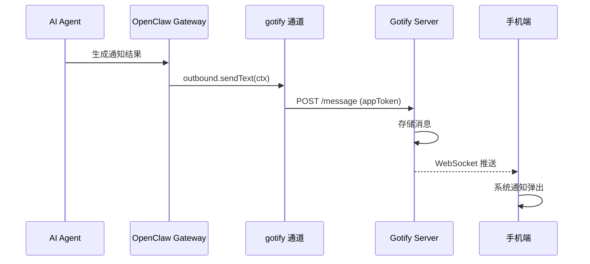
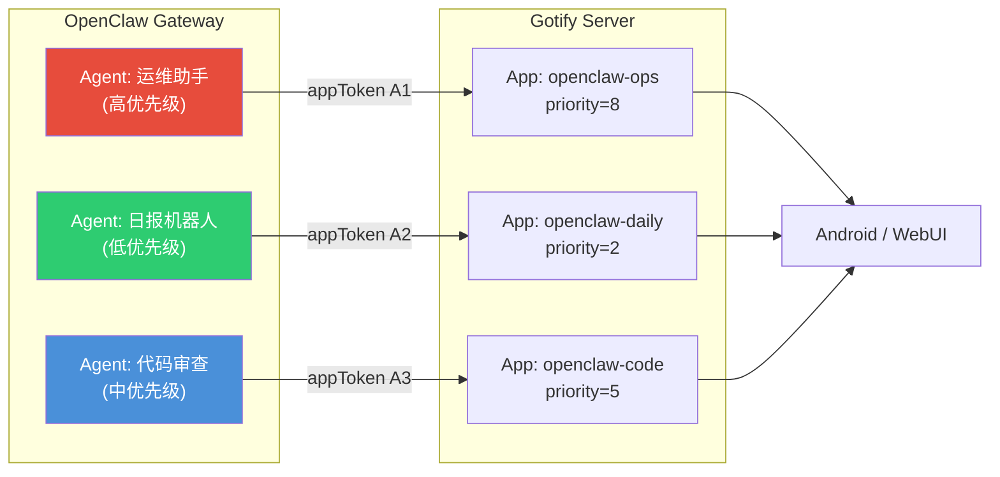
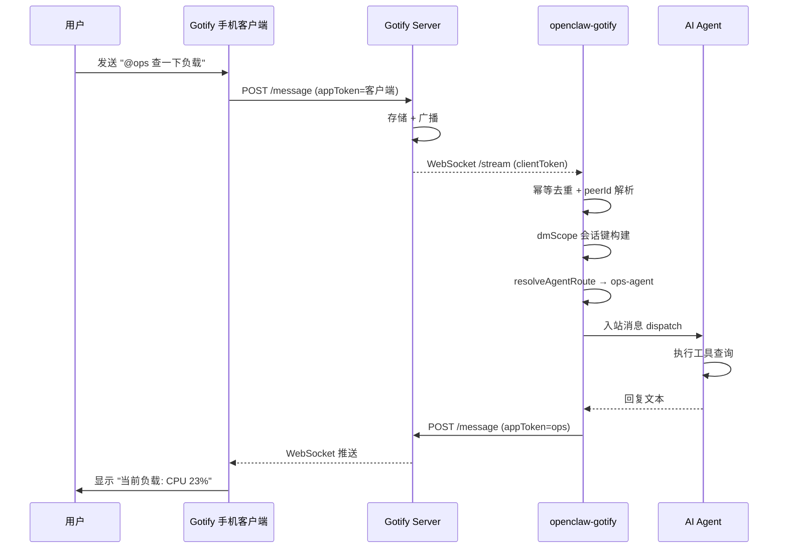
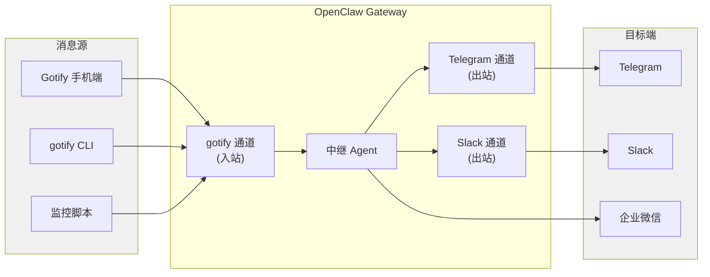
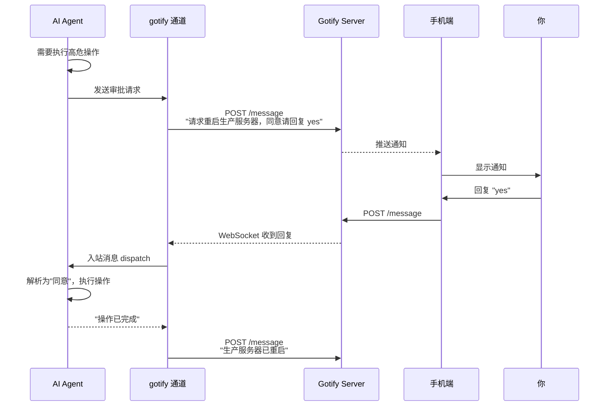

# OpenClaw-Gotify 使用指南（安装 Gotify + 安装 openclaw-gotify + 集成配置）

本指南面向希望把 OpenClaw 接入自托管 Gotify 的使用者，覆盖从 Gotify 部署、令牌获取，到 `openclaw-gotify` 插件安装与联调验证的完整路径。

> 术语速记：
> - **Application（应用）**：只能发送消息；用 **appToken** 鉴权。
> - **Client（客户端）**：只能接收/管理资源（用户、应用、客户端、消息管理）；用 **clientToken** 鉴权。
> - **openclaw-gotify**：OpenClaw 的 Channel Plugin，通过 Gotify Message API 出站发送，通过 Stream API（WebSocket）可选入站监听；bootstrap/doctor 时会用到 Application/Client API。

---

## 0. 总体架构与能力边界

- 出站发送：Gotify **Message API** `POST /message`（**appToken**）
- 入站监听：Gotify **WebSocket Stream API** `GET /stream`（**clientToken**）
- 向导/诊断：Gotify **Application and Client API**（**clientToken**）
- 会话隔离：严格遵循 OpenClaw `session.dmScope`，插件不新增 Gotify 自定义隔离配置
- 用户管理：Gotify **User API** 不作为运行期必需依赖；仅用于运维诊断与管理边界说明

建议先阅读架构设计文档了解模块划分与约束：
- [OpenClaw-Gotify-Architecture_CN.md](OpenClaw-Gotify-Architecture_CN.md)

---

## 1. 安装 Gotify（服务端）

Gotify 是一个用于发送/接收消息的轻量自托管服务，支持 REST API 发送消息、WebSocket 订阅消息流、以及用户/客户端/应用管理。

### 1.1 部署方式建议

建议优先使用 Docker（便于升级与迁移）。如果你需要系统服务管理与开机自启，再使用 systemd 配合。

你也可以采用反向代理（如 Nginx）统一 TLS、域名与访问控制。

### 1.2 Docker 部署（示例）

> 下述为通用示例，具体参数以你的环境为准（端口、数据目录、TLS 等）。

1) 启动容器（示意）

```bash
docker run -d --name gotify \
  -p 8080:80 \
  -v $(pwd)/gotify-data:/app/data \
  --restart unless-stopped \
  gotify/server
```

2) 访问 Web UI（示例：`http://<host>:8080`）

配套截图（可选）：
- Docker 示例：[bt-docker-godity.png](../media/bt-docker-godity.png)
- 初始化示例：[bt-docker-godity-init.png](../media/bt-docker-godity-init.png)
- 运行示例：[bt-docker-godity-runing.png](../media/bt-docker-godity-runing.png)

3) 放行端口（如云服务器安全组/防火墙）

示例截图：[bt-firewall-add-port.png](../media/bt-firewall-add-port.png)

### 1.3 Nginx 反向代理（建议）

当你希望使用 `https://gotify.example.com` 这种稳定入口时，建议用 Nginx 反代 Gotify，并在 Nginx 层做 TLS 与访问策略。

注意事项：
- WebSocket（`/stream`）需要 Nginx 正确转发 Upgrade 头
- 如果 Gotify 配置了 `AllowedWebSocketOrigins`，浏览器跨域来源可能被拒绝（服务端行为）

### 1.4 systemd（可选）

如果你不使用 Docker，或希望把 Gotify 作为系统服务运行，请用 systemd 管理启动/重启/日志。

### 1.5 Nginx 反向代理与负载（推荐生产）

下面给出可直接落地的 Nginx 配置模板。核心目标：
- 反向代理 Gotify HTTP
- 正确透传 WebSocket（`/stream`）
- 保留 Host（Gotify 会结合 Host 与 Origin 做 WebSocket 校验）
- 给长连接设置足够超时

#### 1.5.1 单实例（域名根路径）

```nginx
upstream gotify {
  server 127.0.0.1:1245;
}

server {
  listen 80;
  server_name push.example.com;

  location / {
    proxy_pass         http://gotify;
    proxy_http_version 1.1;

    # WebSocket 透传
    proxy_set_header   Upgrade $http_upgrade;
    proxy_set_header   Connection "upgrade";

    # 真实来源信息
    proxy_set_header   X-Real-IP $remote_addr;
    proxy_set_header   X-Forwarded-For $proxy_add_x_forwarded_for;
    proxy_set_header   X-Forwarded-Proto http;
    proxy_redirect     http:// $scheme://;

    # 必须保留 Host，避免 WebSocket origin/host 校验失败
    proxy_set_header   Host $http_host;

    # WebSocket 长连接超时
    proxy_connect_timeout   1m;
    proxy_send_timeout      1m;
    proxy_read_timeout      1m;
  }
}
```

#### 1.5.2 子路径部署（`/gotify/`）

```nginx
upstream gotify {
  server 127.0.0.1:8080;
}

server {
  listen 80;
  server_name push.example.com;

  location /gotify/ {
    proxy_pass         http://gotify;
    rewrite ^/gotify(/.*) $1 break;
    proxy_http_version 1.1;

    proxy_set_header   Upgrade $http_upgrade;
    proxy_set_header   Connection "upgrade";
    proxy_set_header   X-Real-IP $remote_addr;
    proxy_set_header   X-Forwarded-For $proxy_add_x_forwarded_for;
    proxy_set_header   X-Forwarded-Proto http;
    proxy_redirect     http:// $scheme://;
    proxy_set_header   Host $http_host;

    proxy_connect_timeout   1m;
    proxy_send_timeout      1m;
    proxy_read_timeout      1m;
  }
}
```

#### 1.5.3 HTTPS 与 TLS 建议

- 若 TLS 终止在 Nginx，建议 Gotify 保持 HTTP（如 `GOTIFY_SERVER_SSL_ENABLED=false`），由 Nginx 统一加密。
- 生产建议把 `listen 80` 重定向到 `443`，并开启 HSTS（按你的安全策略评估）。

#### 1.5.4 Nginx 负载均衡示例（多 Gotify 实例）

> 仅在你明确知道会话一致性与数据一致性策略时使用。多数场景建议先单实例验证。

```nginx
upstream gotify_cluster {
  # 可按机房/权重调整
  server 10.0.0.11:8080 max_fails=3 fail_timeout=30s;
  server 10.0.0.12:8080 max_fails=3 fail_timeout=30s;
  keepalive 64;
}

server {
  listen 443 ssl http2;
  server_name push.example.com;

  # ssl_certificate / ssl_certificate_key 省略

  location / {
    proxy_pass         http://gotify_cluster;
    proxy_http_version 1.1;
    proxy_set_header   Upgrade $http_upgrade;
    proxy_set_header   Connection "upgrade";
    proxy_set_header   Host $http_host;
    proxy_set_header   X-Real-IP $remote_addr;
    proxy_set_header   X-Forwarded-For $proxy_add_x_forwarded_for;
    proxy_set_header   X-Forwarded-Proto https;
    proxy_connect_timeout 1m;
    proxy_send_timeout    1m;
    proxy_read_timeout    1m;
  }
}
```

排查要点：
- WebSocket 频繁断开：优先检查 `Upgrade/Connection/Host` 三个头是否正确透传。
- 浏览器端能开页面但 stream 失败：优先检查 origin 校验与子路径 rewrite。

### 1.6 本地部署的 systemd 服务化（Linux）

如果你把 Gotify 作为本地长期服务运行，推荐用 systemd 管理生命周期、日志与开机自启。

#### 1.6.1 目录与文件约定（示例）

- 可执行文件：`/opt/gotify/gotify`
- 配置文件：`/etc/gotify/config.yml`
- 服务文件：`/opt/gotify/gotify.service`（后续链接到 `/etc/systemd/system/`）
- 日志目录：`/var/log/gotify/`

#### 1.6.2 最小服务文件

```ini
[Unit]
Description=Gotify
Requires=network.target
After=network.target

[Service]
Type=simple
User=root
WorkingDirectory=/opt/gotify
ExecStart=/opt/gotify/gotify
StandardOutput=append:/var/log/gotify/gotify.log
StandardError=append:/var/log/gotify/gotify-error.log
Restart=always
RestartSec=3

[Install]
WantedBy=multi-user.target
```

> 这是最小可用模板。生产中建议使用专用低权限用户而非 root（见下方“加固建议”）。

#### 1.6.3 启用与启动

```bash
sudo mkdir -p /var/log/gotify
sudo chmod -R go-rw /opt/gotify /etc/gotify/config.yml /var/log/gotify
sudo ln -sf /opt/gotify/gotify.service /etc/systemd/system/gotify.service
sudo systemctl daemon-reload
sudo systemctl enable gotify
sudo systemctl start gotify
sudo systemctl status gotify
sudo tail -f /var/log/gotify/gotify.log
```

#### 1.6.4 systemd 加固建议（生产）

- 使用独立系统用户（例如 `gotify`）运行服务。
- 限制写权限到必要目录（数据目录、日志目录）。
- 结合反向代理后，可将 Gotify 监听在内网地址（如 `127.0.0.1`）。

---

## 2. Gotify 基础配置：用户 / 应用 / 客户端 / 令牌

### 2.1 创建用户

建议为 OpenClaw 集成创建独立用户（例如 `openclaw`），避免把个人用户令牌暴露在服务配置中。

### 2.2 创建 Application（获取 appToken）

出站发送依赖 **appToken**。创建方式：
- Web UI：登录后在 apps 页面创建应用
- REST API：使用 client 侧鉴权创建应用（例如 basic auth 或 clientToken）

应用创建完成后，会得到一个 **application token**（appToken）。

### 2.3 创建 Client（获取 clientToken）

入站监听（WebSocket stream）与应用/客户端管理 API 需要 **clientToken**。Gotify 官方客户端（Android/WebUI 等）通常会自动创建或展示 client token。

> 重要：clientToken 的权限比 appToken 更高（可管理客户端/应用/消息），因此应只在需要入站监听或 bootstrap/doctor 时使用，并妥善保管。

---

## 3. 验证 Gotify 可用性（Message API / Stream API）

### 3.1 验证 Message API（POST /message）

你可以用 curl/HTTPie/PowerShell 向 Gotify 推送消息。关键点：
- 发送端点：`POST /message`
- `message` 字段必填（JSON 请求体时）
- `title/priority/extras` 可选
- 鉴权：appToken（可通过 `X-Gotify-Key`、query `token` 或 Bearer token 提供）

示例（query token 方式）：

```bash
curl "https://gotify.example.com/message?token=<apptoken>" \
  -F "title=my title" \
  -F "message=my message" \
  -F "priority=5"
```

### 3.2 验证 WebSocket Stream（/stream）

Stream 用于实时接收消息：
- 端点：`GET /stream`
- 鉴权：clientToken（query `token` / header `X-Gotify-Key` / Bearer 等）

若你通过浏览器/反代访问，可能会受到 Gotify 的 origin 校验影响（服务端行为）。

---

## 4. Gotify Extras（富交互通知）

Gotify 的 `extras` 用于改变客户端行为、携带扩展信息。常见字段：

- `client::display.contentType`：`text/plain` 或 `text/markdown`
- `client::notification.click.url`：点击通知打开 URL
- `client::notification.bigImageUrl`：大图通知（Android 支持）

示例（JSON）：

```json
{
  "message": "Hello from OpenClaw",
  "title": "OpenClaw",
  "priority": 5,
  "extras": {
    "client::display": { "contentType": "text/markdown" },
    "client::notification": { "click": { "url": "https://gotify.net" } }
  }
}
```

安全提示：
- `text/markdown` 可能带来远程图片加载等风险；来自不可信输入时建议使用 `text/plain`。

---

## 5. 安装 openclaw-gotify（OpenClaw 渠道插件）

### 5.1 安装插件

```bash
openclaw plugins install @partme.ai/openclaw-gotify
```

### 5.2 最小配置（单账号）

```json
{
  "channels": {
    "gotify": {
      "serverUrl": "https://gotify.example.com",
      "appToken": "YOUR_GOTIFY_APP_TOKEN",
      "clientToken": "YOUR_GOTIFY_CLIENT_TOKEN",
      "defaultPriority": 5,
      "inbound": { "enabled": true },
      "bootstrap": {
        "enabled": true,
        "autoCreateApplication": false,
        "applicationName": "openclaw-default"
      }
    }
  },
  "session": {
    "dmScope": "per-account-channel-peer"
  }
}
```

说明：
- **仅出站发送**：只填 `serverUrl + appToken` 即可；无需 clientToken
- **开启入站监听**：需要 `clientToken` 且 `inbound.enabled=true`
- **bootstrap/doctor**：需要 `clientToken`；可选自动创建应用（受 `autoCreateApplication` 控制）

### 5.3 多账号配置（推荐用于多智能体隔离）

```json
{
  "channels": {
    "gotify": {
      "defaultAccount": "ops",
      "accounts": {
        "ops": {
          "serverUrl": "https://gotify-ops.example.com",
          "appToken": "OPS_APP_TOKEN",
          "clientToken": "OPS_CLIENT_TOKEN",
          "inbound": { "enabled": true }
        },
        "alerts": {
          "serverUrl": "https://gotify-alerts.example.com",
          "appToken": "ALERTS_APP_TOKEN"
        }
      }
    }
  },
  "bindings": [
    { "agentId": "ops-agent", "match": { "channel": "gotify", "accountId": "ops" } },
    { "agentId": "alerts-agent", "match": { "channel": "gotify", "accountId": "alerts" } }
  ],
  "session": {
    "dmScope": "per-account-channel-peer"
  }
}
```

---

## 6. 联调验证（openclaw-gotify）

### 6.1 运行测试（插件仓库内）

```bash
npm run typecheck
npm test
npm run build
```

### 6.2 使用测试端脚本验证 doctor / bootstrap / send

在 `openclaw-plugins/openclaw-gotify` 目录下：

```bash
GOTIFY_SERVER_URL=https://gotify.example.com \
GOTIFY_APP_TOKEN=app-token \
GOTIFY_CLIENT_TOKEN=client-token \
GOTIFY_BOOTSTRAP=true \
GOTIFY_BOOTSTRAP_CREATE=false \
npm run test:client
```

注意：
- 不要在日志中打印完整 token；必要时仅展示前后缀

---

## 7. 应用场景实战

### 7.1 AI Agent 移动通知中心

**场景描述**：你在 OpenClaw 中配置了多个 AI Agent（运维助手、代码审查员、数据分析师）。当 Agent 在后台执行完任务时，通过 Gotify 将结果推送到你的手机上——无需打开电脑或 Web UI。

**架构示意**：



**配置步骤**：

1. 在 Gotify WebUI 创建一个 Application（如 `openclaw-agent`），获取 `appToken`；
2. 配置 OpenClaw：

```json
{
  "channels": {
    "gotify": {
      "serverUrl": "https://gotify.example.com",
      "appToken": "A_APP_TOKEN",
      "defaultPriority": 5
    }
  }
}
```

**要点**：
- 仅需 `serverUrl + appToken` 即可工作，无需 `clientToken`；
- 使用 `defaultPriority` 控制通知的默认重要程度（0-10）；
- 若需要区分不同 Agent 的输出，使用多账号配置（见 7.2）。

### 7.2 多智能体通知隔离

**场景描述**：你有三个 Agent——"运维助手"负责服务器监控告警（高优先级）、"日报机器人"每天早上推送摘要（低优先级）、"代码审查员"在 PR 审查完成后通知（中优先级）。你希望它们在 Gotify 中分开展示，便于按来源筛选和查看。

**架构示意**：



**配置**：

1. 在 Gotify 中创建 3 个 Application（如 `openclaw-ops`、`openclaw-daily`、`openclaw-code`），分别获取各自的 `appToken`；
2. 配置 OpenClaw 多账号 + bindings：

```json
{
  "channels": {
    "gotify": {
      "defaultAccount": "ops",
      "accounts": {
        "ops": {
          "serverUrl": "https://gotify.example.com",
          "appToken": "A_OPS_TOKEN",
          "clientToken": "C_OPS_TOKEN",
          "inbound": { "enabled": true }
        },
        "daily": {
          "serverUrl": "https://gotify.example.com",
          "appToken": "A_DAILY_TOKEN"
        },
        "code": {
          "serverUrl": "https://gotify.example.com",
          "appToken": "A_CODE_TOKEN"
        }
      }
    }
  },
  "bindings": [
    { "agentId": "ops-agent", "match": { "channel": "gotify", "accountId": "ops" } },
    { "agentId": "daily-agent", "match": { "channel": "gotify", "accountId": "daily" } },
    { "agentId": "code-agent", "match": { "channel": "gotify", "accountId": "code" } }
  ],
  "session": {
    "dmScope": "per-account-channel-peer"
  }
}
```

**要点**：
- 每次 Agent 回复时，`outbound.ts` 的 `selectAccountId()` 会按 binding 匹配正确的 `accountId`；
- 在 Gotify WebUI 中按应用筛选即可查看不同 Agent 的消息；
- 手机通知可根据优先级不同展示不同样式（高优先带声音+震动，低优先静默）。

### 7.3 入站指令响应：手机发消息触发 Agent

**场景描述**：你在外面用手机通过 Gotify 客户端发送一条消息如 `@ops 查一下服务器负载`，OpenClaw 通过 WebSocket 收到该消息，路由到对应的 Agent 处理，处理结果通过 Gotify 回复给你。

**工作流**：



**配置**：

```json
{
  "channels": {
    "gotify": {
      "defaultAccount": "ops",
      "accounts": {
        "ops": {
          "serverUrl": "https://gotify.example.com",
          "appToken": "A_OPS_TOKEN",
          "clientToken": "C_OPS_TOKEN",
          "inbound": {
            "enabled": true,
            "reconnectDelayMs": 2000,
            "maxReconnectDelayMs": 30000,
            "maxReconnectAttempts": 10
          }
        }
      }
    }
  },
  "bindings": [
    { "agentId": "ops-agent", "match": { "channel": "gotify", "accountId": "ops" } }
  ],
  "session": {
    "dmScope": "per-account-channel-peer"
  }
}
```

**要点**：
- `inbound.enabled: true` 启用 WebSocket 监听；
- `clientToken` 必须配置，用于 WebSocket 身份验证；
- `dmScope: per-account-channel-peer` 确保每个来源的会话独立，上下文不污染；
- Gotify 中没有"发送消息"的概念，需要通过 Gotify 手机 APP 或其他具有 `clientToken` 的客户端发送消息才能触发入站；
- 入站消息的 `peerId` 识别优先级：`extras.openclaw.peerId` > `appid` > `title` > `"gotify"`。

### 7.4 监控告警管道

**场景描述**：你的服务器上运行了 Uptime Kuma、Prometheus Alertmanager 等监控工具。当服务宕机或指标异常时，告警通过 OpenClaw 的 Gotify 通道推送到你的手机。

**集成方式**：监控工具 → Webhook → OpenClaw → Gotify 通道 → 手机

**方案 A：监控工具直接调用 OpenClaw API**

监控工具通过 OpenClaw Gateway 的 Chat API 发送告警消息：

```bash
# Uptime Kuma 告警 → 通过 OpenClaw API 触发通知
curl -X POST "https://openclaw-gateway/api/chat/send" \
  -H "Authorization: Bearer <token>" \
  -d '{
    "channel": "gotify",
    "accountId": "alerts",
    "text": "🔴 服务宕机: web-server-01\n时间: 2026-04-28 14:32:00\nPing 超时, 已自动重启",
    "title": "Uptime Kuma 告警",
    "priority": 8
  }'
```

**方案 B：监控工具 → OpenClaw Agent → Gotify**

配置 Agent 监听 webhook，Agent 判断严重级别后决定是否推送：

```json
{
  "channels": {
    "gotify": {
      "accounts": {
        "critical": {
          "serverUrl": "https://gotify.example.com",
          "appToken": "A_CRITICAL_TOKEN",
          "defaultPriority": 9
        },
        "warnings": {
          "serverUrl": "https://gotify.example.com",
          "appToken": "A_WARN_TOKEN",
          "defaultPriority": 4
        }
      }
    }
  },
  "bindings": [
    { "agentId": "monitor-agent", "match": { "channel": "gotify" } }
  ]
}
```

**要点**：
- 利用 `priority` 字段区分告警级别：critical (8-10)、warning (5-7)、info (0-4)；
- `extras.client::notification.click.url` 可指向监控面板链接，点击直达；
- 多账号可将不同告警源分开展示。

### 7.5 CI/CD 流水线通知

**场景描述**：你使用 GitHub Actions / GitLab CI 进行持续集成。构建成功或失败时，通过 Gotify 通道通知到手机上。

**配置**：

在 CI 流水线中添加步骤：

```yaml
# GitHub Actions 示例
- name: Notify via OpenClaw
  run: |
    curl -X POST "https://openclaw-gateway/api/chat/send" \
      -H "Authorization: Bearer ${{ secrets.OPENCLAW_TOKEN }}" \
      -H "Content-Type: application/json" \
      -d '{
        "channel": "gotify",
        "accountId": "ci",
        "text": "✅ 构建成功: '${{ github.repository }}'#'${{ github.run_number }}'\n提交: ${{ github.sha }}\n分支: ${{ github.ref_name }}",
        "title": "CI 通知",
        "priority": 3
      }'
```

OpenClaw 配置：

```json
{
  "channels": {
    "gotify": {
      "accounts": {
        "ci": {
          "serverUrl": "https://gotify.example.com",
          "appToken": "A_CI_TOKEN",
          "defaultPriority": 3
        }
      }
    }
  }
}
```

**要点**：
- 成功通知设为低优先（priority 3），失败通知设为高优先（priority 8）；
- 使用 `extras.client::notification.click.url` 指向构建页面；
- CI 环境中的 token 应作为 Secret 管理，不要硬编码。

### 7.6 定时任务报告推送

**场景描述**：你配置了一个 Agent 每天早上 9 点自动运行，汇总昨天的服务器状态、错误日志和资源使用情况，生成日报并通过 Gotify 推送到手机。

**OpenClaw 侧的 cron 触发**：

```json
{
  "cron": [
    {
      "schedule": "0 9 * * *",
      "agentId": "reporter",
      "message": "请生成昨天的运维日报，包括：1) 服务器CPU/内存/磁盘使用情况  2) 错误日志摘要  3) 关键事件时间线。完成后推送到 gotify 通道。"
    }
  ]
}
```

**配置**：

```json
{
  "channels": {
    "gotify": {
      "accounts": {
        "report": {
          "serverUrl": "https://gotify.example.com",
          "appToken": "A_REPORT_TOKEN",
          "defaultPriority": 3,
          "bootstrap": {
            "enabled": true,
            "autoCreateApplication": true,
            "applicationName": "openclaw-daily-report"
          }
        }
      }
    }
  },
  "bindings": [
    { "agentId": "reporter", "match": { "channel": "gotify", "accountId": "report" } }
  ]
}
```

**要点**：
- 利用 `extras.client::display.contentType: "text/markdown"` 让日报使用 Markdown 格式展示；
- 低优先级确保日报不会在深夜打扰（如果 9 点对你来说太早）；
- 多账号模式可将日报与告警消息分开查看。

### 7.7 跨渠道消息中继

**场景描述**：你已经使用了 Telegram / Slack / WeChat 等渠道。希望 Gotify 收到的消息自动 relay 到其他渠道，反之亦然——实现"一处发送，多处接收"。

**架构示意**：



**思路**：
- OpenClaw 天然支持多渠道绑定，一个 Agent 可以同时路由到多个 channel；
- Agent 在系统 prompt 中配置："当你从 Gotify 收到消息时，同时回复到 Telegram 和 Slack"；
- 结合 OpenClaw 的 `outbound` 目标路由功能实现广播式分发。

### 7.8 移动审批：AI 申请在你手机上确认

**场景描述**：Agent 需要执行高风险操作（如重启服务、执行数据库变更），通过 Gotify 推送审批请求到手机，你在手机上回复同意/拒绝，Agent 收到回复后执行或取消操作。

**工作流**：



**配置**（需启用入站监听）：

```json
{
  "channels": {
    "gotify": {
      "accounts": {
        "approval": {
          "serverUrl": "https://gotify.example.com",
          "appToken": "A_APPROVAL_TOKEN",
          "clientToken": "C_APPROVAL_TOKEN",
          "inbound": { "enabled": true },
          "defaultPriority": 10
        }
      }
    }
  },
  "bindings": [
    { "agentId": "ops-agent", "match": { "channel": "gotify", "accountId": "approval" } }
  ],
  "session": {
    "dmScope": "per-account-channel-peer"
  }
}
```

**要点**：
- 审批请求使用 `priority: 10`（最高优先级），确保手机端发出声音+震动；
- 利用 `client::notification.click.url` 指向审批页面（如果有 Web UI）；
- 入站回复通过 `resolvePeerIdFromStreamMessage()` 识别发送者，确保只有你才能审批；
- 建议 Agent 系统 prompt 中明确审批流程和关键词匹配逻辑。

### 7.9 家庭自动化（Home Assistant）警报

**场景描述**：你的 Home Assistant 检测到入侵、烟雾报警、门窗异常等事件时，通过 OpenClaw + Gotify 推送到你的手机。

**集成方式**：Home Assistant → Webhook → OpenClaw → Gotify 通道 → 手机

**OpenClaw HTTP 路由**：利用 `api.registerHttpRoute` 接收 Home Assistant webhook：

```yaml
# Home Assistant automation.yaml
automation:
  - alias: "入侵检测通知"
    trigger:
      platform: state
      entity_id: binary_sensor.motion_detected
      to: "on"
    action:
      - service: rest_command.openclaw_notify
        data:
          title: "🚨 入侵告警"
          message: "检测到运动: {{ states('binary_sensor.motion_detected') }}"
          priority: 10
```

```yaml
# 对应的 REST 命令定义
rest_command:
  openclaw_notify:
    url: "https://openclaw-gateway/api/chat/send"
    method: POST
    headers:
      authorization: "Bearer YOUR_TOKEN"
      content_type: "application/json"
    payload: >
      {"channel":"gotify","accountId":"home","text":"{{ message }}","title":"{{ title }}","priority":{{ priority }}}
```

**OpenClaw 配置**：

```json
{
  "channels": {
    "gotify": {
      "accounts": {
        "home": {
          "serverUrl": "https://gotify.example.com",
          "appToken": "A_HOME_TOKEN"
        }
      }
    }
  }
}
```

**要点**：
- 安全告警使用最高 priority (10)，确保手机端必达；
- 利用 `client::notification.bigImageUrl` 可在 Android 通知中显示摄像头截图；
- 家庭自动化场景建议专用一个 Gotify Application，避免与其他消息混在一起。

---

## 8. 场景选择速查表

| 场景 | 出站 | 入站 | 多账号 | 推荐 priority | 关键配置 |
|------|------|------|--------|---------------|----------|
| Agent 通知中心 | ✅ | ❌ | 可选 | 5 | `appToken` |
| 多智能体隔离 | ✅ | 可选 | ✅ | 按 Agent | `accounts` + `bindings` |
| 入站指令响应 | ✅ | ✅ | ✅ | 5 | `clientToken` + `inbound.enabled` |
| 监控告警 | ✅ | ❌ | 推荐 | 8-10 | `appToken` |
| CI/CD 通知 | ✅ | ❌ | 推荐 | 3-8 | `appToken` |
| 定时报告 | ✅ | ❌ | 推荐 | 3 | cron + `appToken` |
| 跨渠道中继 | ✅ | ✅ | 可选 | 5 | 多 channel 配置 |
| 移动审批 | ✅ | ✅ | ✅ | 10 | `clientToken` + `inbound.enabled` |
| 家庭自动化 | ✅ | ❌ | 推荐 | 8-10 | `appToken` |

---

## 9. Gotify API 速查（与插件对应关系）

### 7.1 Message API（应用发送）

- `POST /message`：创建消息（appToken）
- `GET /message`、`DELETE /message`、`DELETE /message/{id}`：通常需要 clientToken（用于管理/检索）

### 7.2 WebSocket Stream API（实时订阅）

- `GET /stream`：实时消息推送（clientToken）

### 7.3 Application and Client API（向导/运维）

- `GET /application`、`POST /application`：应用管理（clientToken）
- `GET /client`：客户端管理（clientToken）

### 7.4 User API（边界说明）

User API 用于用户管理与运维诊断，不是 openclaw-gotify 的运行期必需依赖。

---

## 10. 常见问题与排查

### 10.1 401/403（鉴权失败）

- 发送 `POST /message` 必须使用 **appToken**（不能用 clientToken 代替发送身份）
- 访问 `/application`、`/client`、`/message` 的管理接口通常需要 **clientToken**

### 10.2 WebSocket 连接不上

- 检查反代是否支持 WebSocket Upgrade
- 检查 Gotify 侧 origin 校验配置（`AllowedWebSocketOrigins`）是否限制跨域来源
- 检查 clientToken 是否有效

### 10.3 消息显示不符合预期

- 确认 `extras.client::display.contentType` 是否设置为 `text/plain` 或 `text/markdown`
- 点击跳转：确认 `extras.client::notification.click.url` 是否为合法 URL

---

## 11. 关于 Gotify Server 插件（Go Plugin）的说明

Gotify 自身支持 Go 插件体系（server-side plugins），用于扩展 Gotify 的能力（Webhook、UI 扩展等）。  
这与 OpenClaw 的 `openclaw-gotify` 插件是两个不同的扩展体系：

- **Gotify 插件**：运行在 Gotify server 内（Go plugin），用于扩展 Gotify 本身
- **openclaw-gotify**：运行在 OpenClaw 侧（TypeScript），用于把 OpenClaw 接入 Gotify 的消息平面

通常使用 `openclaw-gotify` 不需要编写/部署 Gotify server 插件。
