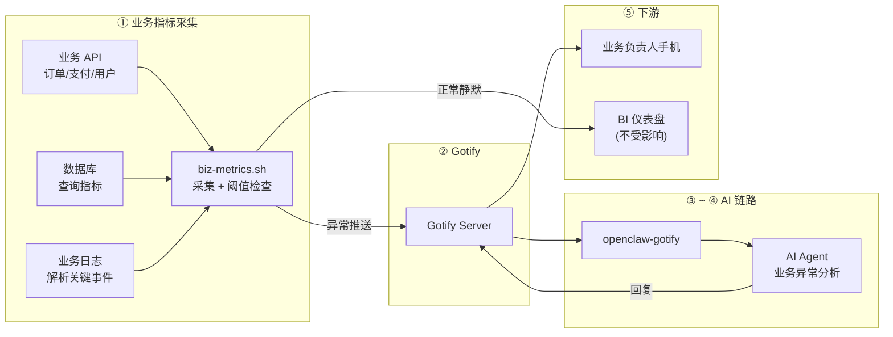

# 【AI 智能运维】业务指标 + OpenClaw：订单暴跌、支付失败率飙升——AI 替你盯业务健康，第一时间告警+分析

> **完整链路**：业务系统（自定义指标 API）→ 定时采集脚本 → Gotify → openclaw-gotify → AI Agent → 业务负责人手机
> **一句话**：定时采集核心业务指标（订单量、支付成功率、用户活跃度），指标异常时推送 Gotify，AI Agent 分析业务影响并诊断根因。

---

## 1. 方案概述

### 适用场景

- 需要监控**业务层面**的健康状态，而不仅是服务器指标
- 核心指标（日活、订单、收入、转化率）需要分钟级异常感知
- 业务数据在内部系统或数据库中，需要定制采集逻辑
- 不想在 BI 工具和监控系统之间反复切换

### 核心优势

| 维度 | 说明 |
|------|------|
| 关注层面 | **业务健康**而非基础设施，直接反映公司收入 |
| 定制灵活 | 任意可脚本化的数据源（SQL 查询、API 调用、日志解析） |
| 对比智能 | AI 自动做同比/环比分析，判断是否真正异常 |
| 可叠加 | 与服务器监控共用同一 Gotify + Agent 体系 |

### 局限

- 需要写定制化的指标采集逻辑
- 业务指标通常需要同比/环比基线，新业务初期基线不充分
- 跨系统数据源较多时采集脚本复杂

---

## 2. 整体架构



---

## 3. 前置条件

| 条件 | 要求 |
|------|------|
| 数据源 | 业务 API、数据库或日志文件（任一即可） |
| 已安装 | curl、jq、bc |
| 网络 | 出站 HTTPS 到 Gotify 服务器 |
| 权限 | 脚本需要读取业务数据的访问权限 |

---

## 4. 安装步骤

```bash
# 安装依赖
apt-get install -y curl jq bc

# 如需查询数据库
apt-get install -y mysql-client  # MySQL
# 或
apt-get install -y postgresql-client  # PostgreSQL
```

---

## 5. 采集脚本

```bash
#!/bin/bash
# /opt/biz-monitor/biz-metrics.sh — 业务指标采集推送
#
# 功能：
# 1. 采集核心业务指标（订单量、支付成功率、用户活跃度等）
# 2. 对比阈值和历史基线，异常时推送 Gotify
# 3. 正常时静默退出
#
# 可根据需要替换为实际的业务 API 或 SQL 查询

set -euo pipefail

# ═══════════════ 配置 ═══════════════
GOTIFY_URL="${GOTIFY_URL:-https://gotify.example.com}"
GOTIFY_APP_TOKEN="${GOTIFY_APP_TOKEN:-}"
PEER_ID="${PEER_ID:-$(hostname)-biz}"
ENV_NAME="${ENV_NAME:-production}"

# 指标阈值
ORDER_DROP_WARN="${ORDER_DROP_WARN:-20}"   # 订单环比下降超过 20% 告警
PAY_FAIL_CRIT="${PAY_FAIL_CRIT:-5}"        # 支付失败率超过 5% 严重告警
USER_DROP_WARN="${USER_DROP_WARN:-15}"     # 活跃用户下降超过 15% 告警
REVENUE_DROP_CRIT="${REVENUE_DROP_CRIT:-30}" # 收入下降超过 30% 严重告警

# ═══════════════ 业务数据采集 ═══════════════
# ⚠️ 以下为示例，请替换为实际的业务数据采集逻辑

HOSTNAME=$(hostname)
TIMESTAMP=$(date -u +"%Y-%m-%dT%H:%M:%SZ")

# ── 示例：从业务 API 采集（替换为真实 API）──
fetch_biz_api() {
  local endpoint="$1"
  curl -sf --max-time 10 "https://api.example.com/metrics/${endpoint}" 2>/dev/null || echo "null"
}

# ── 示例：从 MySQL 查询（替换为真实查询）──
query_mysql() {
  local sql="$1"
  mysql -h "${DB_HOST:-localhost}" -u "${DB_USER:-root}" \
    -p"${DB_PASS:-}" "${DB_NAME:-business}" -N -e "$sql" 2>/dev/null || echo "null"
}

# ── 示例业务指标（简化为文件模拟，实际请用真实数据源）──
# 生产环境替换为真实采集：
# ORDERS_TODAY=$(fetch_biz_api "orders/count?date=today")
# ORDERS_YESTERDAY=$(fetch_biz_api "orders/count?date=yesterday")
# PAY_SUCCESS=$(fetch_biz_api "payments/success-rate")
# ACTIVE_USERS=$(fetch_biz_api "users/active")
# REVENUE_TODAY=$(fetch_biz_api "revenue/total?date=today")

# ── 模拟数据（仅演示，生产改为真实数据源）──
if [ "${DEMO_MODE:-false}" = "true" ]; then
  # 模拟正常数据
  ORDERS_TODAY=$((RANDOM % 2000 + 8000))
  ORDERS_YESTERDAY=$((RANDOM % 2000 + 8000))
  PAY_SUCCESS=98.5
  PAY_FAIL=1.5
  ACTIVE_USERS=$((RANDOM % 50000 + 200000))
  ACTIVE_USERS_YESTERDAY=$((RANDOM % 50000 + 200000))
  REVENUE_TODAY=$((RANDOM % 50000 + 300000))
  REVENUE_YESTERDAY=$((RANDOM % 50000 + 300000))
else
  # ⚠️ 生产环境请替换为真实数据源
  echo "ERROR: 设置 DEMO_MODE=true 或替换为真实数据源"
  exit 1
fi

# ═══════════════ 计算指标 ═══════════════

# 订单环比变化
[ "$ORDERS_YESTERDAY" -gt 0 ] 2>/dev/null && \
  ORDER_CHANGE=$(awk "BEGIN {printf \"%.1f\", (${ORDERS_TODAY} - ${ORDERS_YESTERDAY}) / ${ORDERS_YESTERDAY} * 100}" 2>/dev/null) || ORDER_CHANGE=0

# 支付相关
[ -z "${PAY_FAIL:-}" ] && PAY_FAIL=$(awk "BEGIN {printf \"%.1f\", 100 - ${PAY_SUCCESS}}" 2>/dev/null) || true

# 用户活跃度变化
[ "$ACTIVE_USERS_YESTERDAY" -gt 0 ] 2>/dev/null && \
  USER_CHANGE=$(awk "BEGIN {printf \"%.1f\", (${ACTIVE_USERS} - ${ACTIVE_USERS_YESTERDAY}) / ${ACTIVE_USERS_YESTERDAY} * 100}" 2>/dev/null) || USER_CHANGE=0

# 收入变化
[ "$REVENUE_YESTERDAY" -gt 0 ] 2>/dev/null && \
  REVENUE_CHANGE=$(awk "BEGIN {printf \"%.1f\", (${REVENUE_TODAY} - ${REVENUE_YESTERDAY}) / ${REVENUE_YESTERDAY} * 100}" 2>/dev/null) || REVENUE_CHANGE=0

# ═══════════════ 阈值检查 ═══════════════

ALERTS=""
PRIORITY=3

# 订单下跌
ORDER_DROP_ABS=$(echo "$ORDER_CHANGE" | awk '{print ($1 < 0 ? -$1 : $1)}' 2>/dev/null || echo 0)
[ "$(echo "$ORDER_DROP_ABS >= $ORDER_DROP_WARN" | bc -l 2>/dev/null)" = "1" ] && [ "$(echo "$ORDER_CHANGE < 0" | bc -l 2>/dev/null)" = "1" ] && {
  ALERTS+="🔴 订单量下跌: ${ORDER_CHANGE}%（昨日: ${ORDERS_YESTERDAY} → 今日: ${ORDERS_TODAY}）\n"
  PRIORITY=9
}

# 支付失败率
[ "$(echo "$PAY_FAIL >= $PAY_FAIL_CRIT" | bc -l 2>/dev/null)" = "1" ] && {
  ALERTS+="🔴 支付失败率异常: ${PAY_FAIL}%（高于阈值 ${PAY_FAIL_CRIT}%）\n"
  PRIORITY=9
}

# 用户下跌
USER_DROP_ABS=$(echo "$USER_CHANGE" | awk '{print ($1 < 0 ? -$1 : $1)}' 2>/dev/null || echo 0)
[ "$(echo "$USER_DROP_ABS >= $USER_DROP_WARN" | bc -l 2>/dev/null)" = "1" ] && [ "$(echo "$USER_CHANGE < 0" | bc -l 2>/dev/null)" = "1" ] && {
  ALERTS+="🟡 活跃用户下跌: ${USER_CHANGE}%\n"
  [ "$PRIORITY" -lt 6 ] && PRIORITY=6
}

# 收入下跌
REVENUE_DROP_ABS=$(echo "$REVENUE_CHANGE" | awk '{print ($1 < 0 ? -$1 : $1)}' 2>/dev/null || echo 0)
[ "$(echo "$REVENUE_DROP_ABS >= $REVENUE_DROP_CRIT" | bc -l 2>/dev/null)" = "1" ] && [ "$(echo "$REVENUE_CHANGE < 0" | bc -l 2>/dev/null)" = "1" ] && {
  ALERTS+="🔴 收入暴跌: ${REVENUE_CHANGE}%（昨日: ¥${REVENUE_YESTERDAY} → 今日: ¥${REVENUE_TODAY}）\n"
  PRIORITY=9
}

# ═══════════════ 无异常 → 静默退出 ═══════════════
[ -z "$ALERTS" ] && {
  logger -t "biz-metrics" "OK: ORDERS=${ORDERS_TODAY} PAY_FAIL=${PAY_FAIL}% USERS=${ACTIVE_USERS} REVENUE=${REVENUE_TODAY}"
  exit 0
}

# ═══════════════ 推送 Gotify ═══════════════

COLOR="🔴"; [ "$PRIORITY" -le 6 ] && COLOR="🟡"

MSG="## ${COLOR} 业务指标异常告警

**环境:** \`${ENV_NAME}\`
**服务器:** \`${HOSTNAME}\`
**时间:** $(date '+%Y-%m-%d %H:%M:%S')
**优先级:** ${PRIORITY}

### 异常指标
$(echo -e "$ALERTS")

### 当前业务概览
| 指标 | 今日值 | 昨日值 | 变化率 |
|------|--------|--------|--------|
| 订单量 | ${ORDERS_TODAY} | ${ORDERS_YESTERDAY} | ${ORDER_CHANGE}% |
| 支付成功率 | ${PAY_SUCCESS}% | — | 失败率 ${PAY_FAIL}% |
| 活跃用户 | ${ACTIVE_USERS} | ${ACTIVE_USERS_YESTERDAY} | ${USER_CHANGE}% |
| 收入 | ¥${REVENUE_TODAY} | ¥${REVENUE_YESTERDAY} | ${REVENUE_CHANGE}% |

---

🤖 *已发送 AI Agent 分析中...*"

PAYLOAD=$(jq -n \
  --arg title "${COLOR} 业务异常 [${ENV_NAME}]" \
  --arg msg "$MSG" \
  --argjson priority "$PRIORITY" \
  --arg peerId "$PEER_ID" \
  --argjson orders_today "$ORDERS_TODAY" \
  --argjson orders_yesterday "$ORDERS_YESTERDAY" \
  --argjson pay_fail "$PAY_FAIL" \
  --argjson active_users "$ACTIVE_USERS" \
  --argjson revenue_today "$REVENUE_TODAY" \
  '{
    title: $title, message: $msg, priority: $priority,
    extras: {
      "client::display": {"contentType": "text/markdown"},
      "openclaw": {"peerId": $peerId},
      "biz_metrics": {
        orders: {today: $orders_today, yesterday: $orders_yesterday},
        payment: {fail_rate_percent: $pay_fail},
        users: {active: $active_users},
        revenue: {today: $revenue_today},
        env: "'"${ENV_NAME}"'"
      }
    }
  }')

curl -s -X POST "${GOTIFY_URL}/message?token=${GOTIFY_APP_TOKEN}" \
  -H "Content-Type: application/json" \
  -d "$PAYLOAD" > /dev/null

logger -t "biz-metrics" "ALERT: ${PRIORITY} ORDERS=${ORDERS_TODAY} PAY_FAIL=${PAY_FAIL}%"
```

---

## 6. Gotify 对接

创建 Application 获取 appToken：

1. 登录 Gotify WebUI，点击顶部 Apps → Create Application
2. 名称设为 `openclaw-biz`
3. 创建后复制 appToken

### 验证连通性

```bash
curl -X POST "${GOTIFY_URL}/message?token=${GOTIFY_APP_TOKEN}" \
  -H "Content-Type: application/json" \
  -d '{"title":"🧪 业务指标连通性测试","message":"业务监控链连通","priority":3}'
```

---

## 7. openclaw-gotify 集成

### OpenClaw 配置

```json
{
  "channels": {
    "gotify": {
      "accounts": {
        "biz-monitor": {
          "serverUrl": "https://gotify.example.com",
          "appToken": "A_BIZ_TOKEN",
          "clientToken": "C_BIZ_TOKEN",
          "inbound": { "enabled": true }
        }
      }
    }
  },
  "bindings": [
    {
      "agentId": "ops-agent",
      "match": { "channel": "gotify", "accountId": "biz-monitor" }
    }
  ],
  "session": {
    "dmScope": "per-account-channel-peer"
  }
}
```

---

## 8. AI Agent 配置

### 智能体定义

本场景推荐的 AI Agent 对应 [agency-agents-zh](https://github.com/jnMetaCode/agency-agents-zh) 中的 **数据分析师**：

- 中文定义：[support-analytics-reporter.md](https://github.com/jnMetaCode/agency-agents-zh/blob/main/support/support-analytics-reporter.md)
- 英文定义：[support-analytics-reporter.md](https://github.com/msitarzewski/agency-agents/blob/main/support/support-analytics-reporter.md)

### TOOLS.md (智能体本地配置)

```markdown
# TOOLS.md - Local Notes

## 本智能体的本地路径与文档
- openclaw-gotify 配置: 见本方案第 7 节
- Gotify appToken: 通过环境变量 GOTIFY_APP_TOKEN 配置
- 采集脚本路径: /opt/biz-monitor/biz-metrics.sh
- 环境变量配置: /opt/biz-monitor/config.env

## 本地执行约定
- 所有运行时约定保持在本方案文档目录内
- 部署时 workspace 路径: `~/.openclaw/workspace-analytics-reporter`

## 数据源
- 业务指标：通过业务 API、数据库查询或日志解析采集
- 采集频率：3 分钟（cron 驱动）
- 对比基线：昨日/上周同期数据，自动做同比环比分析
```

### AI Agent 提示词

```markdown
## 业务指标异常分析

当收到来自 gotify 通道的业务指标告警时：

### 第一步：理解异常
查看 `biz_metrics` 中的具体指标，确认是哪个业务维度异常：
- **订单下跌** → 检查是流量下降还是转化率下降
- **支付失败率高** → 检查支付网关、渠道、风控策略
- **用户活跃度下降** → 检查是否有产品变更、竞品动作
- **收入暴跌** → 检查定价变更、大客户流失、退款激增

### 第二步：关联分析
- 多个指标同时异常 → 可能是有共因的系统级问题
- 单个指标异常 → 局部问题，聚焦该业务线
- 对比时间维度：同比（上周同一天）还是环比（昨天）

### 第三步：输出诊断

回复格式：
🔴 **{环境}** — 业务异常分析
━━━━━━━━━━━━━━━
📊 异常指标: {列表}
🔍 可能原因:
  1. {原因 1}
  2. {原因 2}
💡 建议行动:
  - {行动 1}
  - {行动 2}

分析时要区分是"真正的问题"还是"自然波动"（如周末流量下降）。
```

---

### 参考资源

- [agency-agents](https://github.com/msitarzewski/agency-agents) — 通用 AI Agent 定义库（英文，165+ 角色）
- [agency-agents-zh](https://github.com/jnMetaCode/agency-agents-zh) — AI Agent 中文定义库（211 个 Agent 定义，46 个中文原创）

---

## 9. 部署

```bash
# 1. 创建目录
mkdir -p /opt/biz-monitor

# 2. 复制脚本（修改为真实业务数据源）
cat > /opt/biz-monitor/biz-metrics.sh << 'SCRIPT'
# 粘贴第 5 节完整脚本内容（将模拟数据替换为真实采集）
SCRIPT
chmod 755 /opt/biz-monitor/biz-metrics.sh

# 3. 配置环境变量
cat > /opt/biz-monitor/config.env << 'ENV'
GOTIFY_URL=https://gotify.example.com
GOTIFY_APP_TOKEN=A_BIZ_TOKEN
PEER_ID=web-01-biz
ENV_NAME=production
DB_HOST=db.internal
DB_USER=reader
DB_PASS=xxxx
DB_NAME=business
ENV

# 4. 添加 cron（建议 1-5 分钟）
echo "*/3 * * * * root . /opt/biz-monitor/config.env; /opt/biz-monitor/biz-metrics.sh" \
  > /etc/cron.d/biz-monitor

# 5. 验证
/bin/bash /opt/biz-monitor/biz-metrics.sh
```

---

## 10. 验证

```bash
# 测试模式：模拟异常
DEMO_MODE=true /opt/biz-monitor/biz-metrics.sh

# 查看日志
journalctl -t biz-metrics --since "5 min ago"

# 检查 Gotify
curl -s -H "X-Gotify-Key: C_BIZ_TOKEN" \
  "https://gotify.example.com/message?limit=3" | jq '.messages[].title'
```

---

## 11. 运维

```bash
# 采集日志
journalctl -t biz-metrics --since "1 hour ago"

# 临时停用
rm /etc/cron.d/biz-monitor

# 添加新指标
# 编辑脚本，在"采集"区域添加新的指标获取逻辑
```

### 常见问题

**Q: 业务 API 返回不稳定导致误告警？**
A: 在采集函数中添加重试和超时处理，连续 3 次失败再推送。

**Q: 阈值如何调优？**
A: 先观察一周正常数据，计算均值和标准差，设置 `mean ± 2*std` 为阈值。

**Q: 数据源是数据库但脚本无法直连？**
A: 可以通过 REST API 包装一层，或使用 Prometheus exporter 暴露指标。

---

## 12. 附录

### 常见业务指标采集源

| 指标 | 典型数据源 | 采集方式 |
|------|-----------|---------|
| 订单量/支付额 | MySQL/PostgreSQL | SQL 查询 |
| 支付成功率 | 支付网关 API | REST API |
| 用户活跃度 | Redis / 埋点系统 | Redis GET / API |
| 收入/退款 | 财务系统 | API / 数据仓库 |
| 转化率 | 分析平台（GA/Amplitude） | Export API |
| 库存预警 | ERP/OMS 系统 | API / 数据库 |

### 指标基线配置建议

```
# 高敏指标（响应式）
ORDER_DROP_WARN=10     # 订单下降 10% 即告警
PAY_FAIL_CRIT=3        # 支付失败率超 3% 严重告警

# 中敏指标
USER_DROP_WARN=20      # 日活下降 20% 告警
REVENUE_DROP_CRIT=25   # 收入下降 25% 严重告警

# 低敏指标（关注趋势）
# 设置较大的阈值，避免低频指标的噪声触发频繁告警
```
