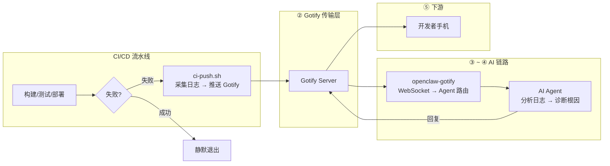

# 【AI 智能运维】CI/CD + OpenClaw：流水线又挂了？AI 自动分析日志定位根因——让开发者少熬夜

> **完整链路**：CI/CD 流水线（GitHub Actions / GitLab CI）→ Gotify → openclaw-gotify → AI Agent → 开发者手机
> **一句话**：CI/CD 构建或部署失败时自动推送错误日志到 Gotify，AI Agent 瞬间分析堆栈、定位失败根因并给出修复方案，不用再人工翻日志。

---

## 1. 方案概述

### 适用场景

- 团队每天多次部署，构建失败需要快速排查
- 想减少"翻日志找原因"的重复劳动
- 存在偶发性的环境问题（依赖缓存、网络超时）需要 AI 识别模式
- 开发者希望手机第一时间知道构建挂了 + 原因分析

### 核心优势

| 维度 | 说明 |
|------|------|
| 响应速度 | **秒级**（CI 失败 → Gotify → AI Agent，全过程 <10 秒） |
| 分析深度 | AI 自动读日志，定位具体错误行和失败步骤 |
| 价值 | 减少一个人工排查环节，每个失败节省 5-15 分钟 |
| 兼容性 | 支持 GitHub Actions、GitLab CI、Jenkins 等主流 CI |

### 局限

- 需要 CI 环境能发出站 HTTPS 请求（大部分 CI runner 默认允许）
- 日志过长时 AI 会截断，建议只推送关键错误信息而非完整日志
- AI Agent 需要针对项目特点做少量提示词调优

---

## 2. 整体架构



---

## 3. 前置条件

| 条件 | 要求 |
|------|------|
| CI 平台 | GitHub Actions、GitLab CI 或 Jenkins |
| 网络 | CI runner 可出站 HTTPS 到 Gotify 服务器 |
| 已安装 | curl（CI runner 预装） |
| Gotify | 已部署 Gotify 服务器并创建 Application |

---

## 4. 安装步骤

无需额外安装工具。所有 CI runner 预装 curl。

```bash
# 验证 curl 可用
curl --version
```

---

## 5. 集成脚本

### CI 推送脚本

```bash
#!/bin/bash
# /opt/ci-monitor/ci-push.sh — CI/CD 失败推送脚本
#
# 调用方式：在 CI 流水线的失败步骤中调用
# 例如 GitHub Actions: - run: ./ci-push.sh
#
# 通过环境变量传入失败信息

set -euo pipefail

# ═══════════════ 配置 ═══════════════
GOTIFY_URL="${GOTIFY_URL:-https://gotify.example.com}"
GOTIFY_APP_TOKEN="${GOTIFY_APP_TOKEN:-}"
PEER_ID="${PEER_ID:-ci-pipeline}"

# 从环境变量读取 CI 上下文（各 CI 平台自动注入）
CI_SYSTEM="${CI_SYSTEM:-github-actions}"
REPO="${GITHUB_REPOSITORY:-${CI_PROJECT_PATH:-unknown}}"
BRANCH="${GITHUB_REF_NAME:-${CI_COMMIT_BRANCH:-unknown}}"
COMMIT="${GITHUB_SHA:-${CI_COMMIT_SHA:-unknown}}"
COMMIT_MSG="${COMMIT_MSG:-}"
ACTOR="${GITHUB_ACTOR:-${GITLAB_USER_NAME:-unknown}}"
WORKFLOW="${GITHUB_WORKFLOW:-${CI_JOB_NAME:-unknown}}"
RUN_ID="${GITHUB_RUN_ID:-${CI_JOB_ID:-unknown}}"
RUN_URL="${GITHUB_SERVER_URL:-https://github.com}/${GITHUB_REPOSITORY:-}/actions/runs/${GITHUB_RUN_ID:-}"

# 失败步骤和错误摘要（由调用方设置）
FAILED_STEP="${FAILED_STEP:-unknown}"
ERROR_SUMMARY="${ERROR_SUMMARY:-}"
ERROR_LOG="${ERROR_LOG:-}"  # 关键错误日志（截断至 2000 字符）

# 截断错误日志
ERROR_LOG_TRUNCATED="${ERROR_LOG:0:2000}"
[ "${#ERROR_LOG}" -gt 2000 ] && ERROR_LOG_TRUNCATED+="\n\n...（日志过长已截断）"

# ═══════════════ 构建推送消息 ═══════════════

TIMESTAMP=$(date -u +"%Y-%m-%dT%H:%M:%SZ")
SHORT_COMMIT="${COMMIT:0:8}"

MSG="## 🔴 CI/CD 流水线失败

**仓库:** \`${REPO}\`
**分支:** \`${BRANCH}\`
**提交:** \`${SHORT_COMMIT}\` ${COMMIT_MSG}
**触发者:** ${ACTOR}
**失败步骤:** \`${FAILED_STEP}\`
**流水线:** [查看详情](${RUN_URL})
**时间:** ${TIMESTAMP}

### 错误摘要

\`\`\`
${ERROR_SUMMARY:-无错误摘要}
\`\`\`

### 关键日志

\`\`\`
${ERROR_LOG_TRUNCATED:-无日志}
\`\`\`

---

🤖 *已发送 AI Agent 分析中...*"

# ═══════════════ 推送 Gotify ═══════════════

PRIORITY=9
TITLE="🔴 CI/CD 失败: ${REPO} - ${BRANCH} - ${FAILED_STEP}"

if command -v jq &>/dev/null; then
  PAYLOAD=$(jq -n \
    --arg title "$TITLE" \
    --arg msg "$MSG" \
    --argjson priority "$PRIORITY" \
    --arg peerId "${PEER_ID}" \
    --arg repo "$REPO" \
    --arg branch "$BRANCH" \
    --arg commit "$COMMIT" \
    --arg failed_step "$FAILED_STEP" \
    --arg error_summary "$ERROR_SUMMARY" \
    '{
      title: $title, message: $msg, priority: $priority,
      extras: {
        "client::display": {"contentType": "text/markdown"},
        "openclaw": {"peerId": $peerId},
        "ci_event": {
          repo: $repo, branch: $branch, commit: $commit,
          failed_step: $failed_step, error_summary: $error_summary
        }
      }
    }')

  curl -s -X POST "${GOTIFY_URL}/message?token=${GOTIFY_APP_TOKEN}" \
    -H "Content-Type: application/json" \
    -d "$PAYLOAD" > /dev/null
else
  # 无 jq 时的精简推送
  curl -s -X POST "${GOTIFY_URL}/message?token=${GOTIFY_APP_TOKEN}" \
    -F "title=$TITLE" \
    -F "message=${REPO}: ${FAILED_STEP} 失败 — ${ERROR_SUMMARY:0:200}" \
    -F "priority=$PRIORITY" > /dev/null
fi

logger -t "ci-push" "Pushed: ${REPO} ${FAILED_STEP} failed"
```

### GitHub Actions 集成

在仓库中创建 `.github/workflows/ci-monitor.yml`：

```yaml
name: CI Monitor

on:
  workflow_run:
    workflows: ["*"]
    types: [completed]

jobs:
  notify-on-failure:
    runs-on: ubuntu-latest
    if: ${{ github.event.workflow_run.conclusion == 'failure' }}
    steps:
      - name: 采集失败日志
        uses: actions/github-script@v7
        id: fetch-logs
        with:
          script: |
            const run = context.payload.workflow_run;
            const jobs = await github.rest.actions.listJobsForWorkflowRun({
              owner: context.repo.owner,
              repo: context.repo.repo,
              run_id: run.id,
            });
            const failedJobs = jobs.data.jobs.filter(j => j.conclusion === 'failure');
            const summary = failedJobs.map(j =>
              `${j.name}: ${j.steps?.filter(s => s.conclusion === 'failure').map(s => s.name).join(', ')}`
            ).join('; ');
            core.exportVariable('FAILED_STEP', summary);
            core.exportVariable('COMMIT_MSG', run.head_commit?.message || '');

      - name: 推送 Gitify
        env:
          GOTIFY_URL: ${{ secrets.GOTIFY_URL }}
          GOTIFY_APP_TOKEN: ${{ secrets.GOTIFY_APP_TOKEN }}
          PEER_ID: "github-actions"
          CI_SYSTEM: "github-actions"
          FAILED_STEP: ${{ env.FAILED_STEP }}
          ERROR_SUMMARY: "Workflow ${{ github.event.workflow_run.name }} 在分支 ${{ github.event.workflow_run.head_branch }} 上失败"
        run: |
          curl -sL "${{ env.GOTIFY_SCRIPT_URL }}" -o /tmp/ci-push.sh
          chmod +x /tmp/ci-push.sh
          /tmp/ci-push.sh
```

> **提示**：也可以在最简单的 CI 步骤中直接调用 curl，无需安装任何脚本：
>
> ```yaml
> - name: 失败通知
>   if: failure()
>   run: |
>     curl -s -X POST "${{ secrets.GOTIFY_URL }}/message?token=${{ secrets.GOTIFY_APP_TOKEN }}" \
>       -H "Content-Type: application/json" \
>       -d '{
>         "title": "🔴 CI 失败: '"${GITHUB_REPOSITORY}"'",
>         "message": "流水线失败，请查看: '"${GITHUB_SERVER_URL}/${GITHUB_REPOSITORY}/actions/runs/${GITHUB_RUN_ID}"'",
>         "priority": 9,
>         "extras": {
>           "client::display": {"contentType": "text/plain"},
>           "openclaw": {"peerId": "github-actions"}
>         }
>       }'
> ```

---

## 6. Gotify 对接

创建 Application 获取 appToken：

1. 登录 Gotify WebUI，点击顶部 Apps → Create Application
2. 名称设为 `openclaw-ci`
3. 创建后复制 appToken（形如 `Axxxx...`）

### 验证连通性

```bash
curl -X POST "${GOTIFY_URL}/message?token=${GOTIFY_APP_TOKEN}" \
  -H "Content-Type: application/json" \
  -d '{"title":"🧪 CI 连通性测试","message":"CI 监控链连通","priority":3}'
```

检查 Gotify WebUI → Messages 确认消息到达。

---

## 7. openclaw-gotify 集成

### OpenClaw 配置

```json
{
  "channels": {
    "gotify": {
      "accounts": {
        "ci-monitor": {
          "serverUrl": "https://gotify.example.com",
          "appToken": "A_CI_APP_TOKEN",
          "clientToken": "C_CI_CLIENT_TOKEN",
          "inbound": { "enabled": true }
        }
      }
    }
  },
  "bindings": [
    {
      "agentId": "ci-agent",
      "match": { "channel": "gotify", "accountId": "ci-monitor" }
    }
  ],
  "session": {
    "dmScope": "per-account-channel-peer"
  }
}
```

### CI 方案的独特数据

```json
{
  "extras": {
    "openclaw": { "peerId": "github-actions" },
    "ci_event": {
      "repo": "myorg/myapp",
      "branch": "main",
      "commit": "a1b2c3d4e5f6...",
      "failed_step": "test (单元测试)",
      "error_summary": "AssertionError: expected 200, got 500"
    }
  }
}
```

Agent 可以通过 `ci_event` 字段精确知道是哪个仓库、哪个分支、哪一步失败。

---

## 8. AI Agent 配置

### 智能体定义

本场景推荐的 AI Agent 对应 [agency-agents-zh](https://github.com/jnMetaCode/agency-agents-zh) 中的 **DevOps 自动化师**：

- 中文定义：[engineering-devops-automator.md](https://github.com/jnMetaCode/agency-agents-zh/blob/main/engineering/engineering-devops-automator.md)
- 英文定义：[engineering-devops-automator.md](https://github.com/msitarzewski/agency-agents/blob/main/engineering/engineering-devops-automator.md)

### TOOLS.md (智能体本地配置)

```markdown
# TOOLS.md - Local Notes

## 本智能体的本地路径与文档
- openclaw-gotify 配置: 见本方案第 7 节
- Gotify appToken: 通过环境变量 GOTIFY_APP_TOKEN 配置
- CI 推送脚本路径: /opt/ci-monitor/ci-push.sh
- GitHub Secrets: GOTIFY_URL, GOTIFY_APP_TOKEN（仓库级配置）

## 本地执行约定
- 所有运行时约定保持在本方案文档目录内
- 部署时 workspace 路径: `~/.openclaw/workspace-devops-automator`

## 数据源
- CI 事件：通过 GitHub Actions workflow_run 触发器或 GitLab CI webhook 获取
- 错误日志：由 CI runner 环境变量传入，脚本截断至 2000 字符
- Runner 为临时环境，无需持久化配置
```

### AI Agent 提示词

```markdown
## CI/CD 流水线失败诊断

当收到来自 gotify 通道的 CI/CD 失败消息时：

### 第一步：理解失败上下文
- 查看 `ci_event.repo` 确定项目
- 查看 `ci_event.failed_step` 确定失败阶段（构建/测试/部署）
- 查看 `ci_event.error_summary` 了解错误类型

### 第二步：分析错误日志
- 编译错误：指出语法错误或依赖问题
- 测试失败：指出哪个测试用例失败，是断言错误还是环境问题
- 超时：可能是资源不足或死锁
- 部署失败：检查配置变更或环境问题

### 第三步：输出诊断和修复方案

回复格式：
🔴 **{repo}** — CI/CD 失败分析报告
━━━━━━━━━━━━━━━━━
📋 失败阶段: {构建/测试/部署}
🔍 根因分析: {错误原因和影响范围}
💡 修复建议: {具体修复命令或代码修改}

示例分析：
- "npm install 失败 → 检查 package-lock.json 是否过期，执行 npm install --legacy-peer-deps"
- "测试断言错误 → API 可能返回了非预期响应，检查最近代码变更"
- "Docker 构建失败 → 基础镜像标签不存在，检查 Dockerfile 中的镜像版本"
```

---

### 参考资源

- [agency-agents](https://github.com/msitarzewski/agency-agents) — 通用 AI Agent 定义库（英文，165+ 角色）
- [agency-agents-zh](https://github.com/jnMetaCode/agency-agents-zh) — AI Agent 中文定义库（211 个 Agent 定义，46 个中文原创）

---

## 9. 部署

### 在仓库中设置 Secrets

```bash
# 在 GitHub 仓库 Settings → Secrets and variables → Actions 中添加：
# GOTIFY_URL: https://gotify.example.com
# GOTIFY_APP_TOKEN: A_CI_APP_TOKEN

# GitHub CLI 方式
gh secret set GOTIFY_URL -b "https://gotify.example.com" -R myorg/myapp
gh secret set GOTIFY_APP_TOKEN -b "A_CI_APP_TOKEN" -R myorg/myapp
```

### 在 CI runner 上部署脚本

如果使用自托管 runner：

```bash
mkdir -p /opt/ci-monitor
cat > /opt/ci-monitor/ci-push.sh << 'SCRIPT'
# 粘贴第 5 节的完整脚本内容
SCRIPT
chmod 755 /opt/ci-monitor/ci-push.sh
```

---

## 10. 验证

```bash
# 模拟一次 CI 失败推送
FAILED_STEP="单元测试" \
ERROR_SUMMARY="AssertionError: expected 200, got 500" \
ERROR_LOG="Error: Test 'GET /api/users' failed\n  expected 200\n  got 500" \
  bash /opt/ci-monitor/ci-push.sh

# 检查 Gotify 消息
curl -s -H "X-Gotify-Key: C_CI_CLIENT_TOKEN" \
  "https://gotify.example.com/message?limit=3" | jq '.messages[].title'
```

---

## 11. 运维

```bash
# 查看推送日志
journalctl -t ci-push --since "1 hour ago"

# 排查常见问题
# Q: CI runner 无法访问 Gotify？
# A: 检查 runner 是否需要配置 HTTP 代理
# Q: 消息被截断？
# A: 默认截断 2000 字符，可在脚本中调整 ERROR_LOG 上限
```

---

## 12. 附录

### 各 CI 平台环境变量

| 信息 | GitHub Actions | GitLab CI | Jenkins |
|------|---------------|-----------|---------|
| 仓库 | `GITHUB_REPOSITORY` | `CI_PROJECT_PATH` | `GIT_URL` |
| 分支 | `GITHUB_REF_NAME` | `CI_COMMIT_BRANCH` | `BRANCH_NAME` |
| 提交 | `GITHUB_SHA` | `CI_COMMIT_SHA` | `GIT_COMMIT` |
| 触发者 | `GITHUB_ACTOR` | `GITLAB_USER_NAME` | `BUILD_USER` |

### 常见 CI 失败类型 AI 分析模板

| 失败类型 | AI 关注点 |
|---------|----------|
| 编译错误 | 语法错误位置、缺失的依赖 |
| 测试失败 | 断言行号、预期 vs 实际值 |
| 超时 | 是否有死循环、资源不足 |
| 部署失败 | K8s 错误、数据库迁移失败 |
| 依赖问题 | 版本冲突、registry 不可达 |
