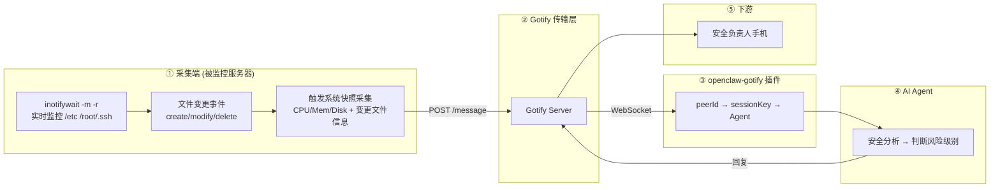

# 【AI 智能运维】inotify + OpenClaw：关键文件被篡改还靠肉眼发现？内核级实时监控，入侵秒级告警

> **完整链路**：被监控服务器（inotifywait 事件驱动）→ Gotify → openclaw-gotify → AI Agent → 用户手机
> **一句话**：基于 Linux 内核 inotify 机制实时监控关键目录文件变更，毫秒级响应，检测到变更时触发系统快照和告警推送。

---

## 1. 方案概述

### 适用场景

- **安全审计**：监控 `/etc/passwd`、`/etc/shadow`、`/etc/ssh` 等关键配置文件的变更
- **等保合规**：需要留存文件变更审计记录，满足等保三级要求
- **入侵检测**：检测恶意文件创建/修改（如 web shell 写入、cron 任务篡改）
- **配置变更追溯**：多人协作服务器上的配置变更通知

### 核心优势

| 维度 | 说明 |
|------|------|
| 响应速度 | **毫秒级**（内核事件推送，非轮询） |
| 资源消耗 | **极低**（无事件时不消耗 CPU） |
| 审计能力 | 记录每次变更的文件路径、事件类型、时间戳 |
| 合规支撑 | 日级归档可直接用于等保审计取证 |

### 局限

- 只能监控**文件系统事件**，不能采集 CPU/内存等性能指标
- 需要配合轮询脚本来采集系统指标（本方案同时提供系统快照采集）
- 需要调整内核参数 `fs.inotify.max_user_watches`
- 不适用于 NFS/CIFS 网络文件系统

### 参考

- https://cloud.tencent.com/developer/article/2427949
- https://github.com/inotify-tools/inotify-tools

---

## 2. 整体架构



---

## 3. 前置条件

| 条件 | 要求 |
|------|------|
| 操作系统 | Linux kernel 2.6.13+（所有现代发行版） |
| 已安装 | inotify-tools（apt/yum 安装） |
| 已安装 | curl、jq、bc |
| 内核参数 | `fs.inotify.max_user_watches` ≥ 524288（需调整） |
| 网络 | 出站 HTTPS 到 Gotify 服务器 |

---

## 4. 安装步骤

### 安装 inotify-tools

```bash
# Debian/Ubuntu
apt-get update && apt-get install -y inotify-tools curl jq bc

# CentOS/RHEL
yum install -y inotify-tools curl jq bc

# 验证安装
inotifywait --version
```

### 调整内核参数

```bash
# 查看当前值
sysctl fs.inotify.max_user_watches

# 临时调整
sysctl -w fs.inotify.max_user_watches=524288

# 永久调整
echo 'fs.inotify.max_user_watches=524288' >> /etc/sysctl.conf
sysctl -p

# 可选：增加实例数和队列长度（高负载场景）
echo 'fs.inotify.max_user_instances=256' >> /etc/sysctl.conf
echo 'fs.inotify.max_queued_events=32768' >> /etc/sysctl.conf
```

---

## 5. 采集脚本

### systemd 服务（主入口）

```ini
# /etc/systemd/system/inotify-monitor.service
[Unit]
Description=inotify file monitor → Gotify → AI Agent
Documentation=https://github.com/partme-ai/openclaw-gotify
After=network.target

[Service]
Type=simple
ExecStart=/opt/server-monitor/inotify-monitor.sh
Restart=always
RestartSec=5
Environment=GOTIFY_URL=https://gotify.example.com
Environment=GOTIFY_APP_TOKEN=A_MONITOR_TOKEN
Environment=PEER_ID=$(hostname)
Environment=WATCH_DIRS=/etc /root/.ssh /var/log/auth.log
Environment=COOLDOWN_SEC=60
StandardOutput=journal
StandardError=journal

[Install]
WantedBy=multi-user.target
```

### 采集+推送脚本

```bash
#!/bin/bash
# /opt/server-monitor/inotify-monitor.sh — inotify 事件驱动采集推送
#
# 作为 systemd 守护进程运行，持续监控目录文件变更。
# 检测到变更时：采集系统快照 + 记录变更文件信息 → 推送 Gotify

set -euo pipefail

# ═══════════════ 配置 ═══════════════
GOTIFY_URL="${GOTIFY_URL:-https://gotify.example.com}"
GOTIFY_APP_TOKEN="${GOTIFY_APP_TOKEN:-}"
PEER_ID="${PEER_ID:-$(hostname)}"
WATCH_DIRS="${WATCH_DIRS:-/etc /var/log}"
COOLDOWN_SEC="${COOLDOWN_SEC:-60}"       # 同一来源 cooldown 时间
COOLDOWN_FILE="/tmp/.inotify-cooldown"
RECENT_LOG="/tmp/.inotify-recent-events"  # 最近变更缓存

# 排除临时文件
EXCLUDE_PATTERN='\.(swp|tmp|bak|~|log\.\d+)$'

# 确保以 systemd 方式运行
if [ ! -f /proc/1/comm ] || [ "$(cat /proc/1/comm)" = "systemd" ]; then
  logger -t "inotify-monitor" "Starting inotify monitor (${WATCH_DIRS})"
fi

# ═══════════════ 推送函数 ═══════════════
push_alert() {
  local event="$1" file="$2" event_time="$3"
  local now; now=$(date +%s)

  # cooldown 检查
  local last=0
  [ -f "$COOLDOWN_FILE" ] && last=$(cat "$COOLDOWN_FILE")
  [ $((now - last)) -lt "$COOLDOWN_SEC" ] && return
  echo "$now" > "$COOLDOWN_FILE"

  # 采集系统快照
  CPU=$(top -bn1 2>/dev/null | awk '/Cpu\(s\)/ {printf "%.0f", 100-$8}')
  MEM=$(free 2>/dev/null | awk '/Mem/ {printf "%.0f", ($3/$2)*100}')

  # 获取文件信息
  FILE_INFO=$(stat --format='%U:%G %a %s %y' "$file" 2>/dev/null || echo "unavailable")
  FILE_SIZE=$(stat --format='%s' "$file" 2>/dev/null || echo 0)
  FILE_MD5=$(md5sum "$file" 2>/dev/null | awk '{print $1}' || echo "")

  # 将事件写入最近变更缓存
  echo "${event_time}|${event}|${file}|${FILE_MD5}" >> "$RECENT_LOG"
  tail -20 "$RECENT_LOG" > "${RECENT_LOG}.tmp" && mv "${RECENT_LOG}.tmp" "$RECENT_LOG"

  # 判断风险级别
  RISK="info"; PRIORITY=5
  case "$file" in
    */shadow|*/passwd|*/sudoers|*/ssh/sshd_config|*/authorized_keys)
      RISK="high"; PRIORITY=9 ;;
    */cron*|*/systemd/*.service|*/nginx/*.conf|*/httpd/*.conf)
      RISK="medium"; PRIORITY=7 ;;
    */log/*|*/tmp/*) RISK="low"; PRIORITY=4 ;;
  esac

  # 构建风险标签
  case "$RISK" in
    high)   TAG="🔴 高"; COLOR="red" ;;
    medium) TAG="🟡 中"; COLOR="yellow" ;;
    *)      TAG="🟢 低"; COLOR="green" ;;
  esac

  MSG="## ${TAG} 风险文件变更告警

**服务器:** \`${PEER_ID}\`
**时间:** ${event_time}
**事件:** ${event}
**文件:** \`${file}\`
**权限:** ${FILE_INFO}
**MD5:** ${FILE_MD5}
**风险级别:** ${TAG}

### 系统快照
| 指标 | 值 |
|------|----|
| CPU | ${CPU}% |
| Memory | ${MEM}% |

### 最近变更（最近 20 条）
\`\`\`
$(cat "$RECENT_LOG" 2>/dev/null)
\`\`\`

---

🤖 *已发送 AI Agent 分析中...*"

  # 推送 Gotify
  jq -n \
    --arg title "${TAG} 风险: ${file##*/} — ${PEER_ID}" \
    --arg msg "$MSG" \
    --argjson priority "$PRIORITY" \
    --arg peerId "$PEER_ID" \
    --arg risk "$RISK" \
    --arg event "$event" \
    --arg fp "$file" \
    --arg et "$event_time" \
    '{
      title: $title, message: $msg, priority: $priority,
      extras: {
        "client::display": {"contentType": "text/markdown"},
        "openclaw": {"peerId": $peerId},
        "snapshot": {event: {type: $event, file: $fp, time: $et}, risk: $risk}
      }
    }' | curl -s -X POST "${GOTIFY_URL}/message?token=${GOTIFY_APP_TOKEN}" \
      -H "Content-Type: application/json" -d @- > /dev/null

  logger -t "inotify-monitor" "${RISK}: ${event} ${file}"
}

# ═══════════════ 主循环：inotifywait 事件监听 ═══════════════

logger -t "inotify-monitor" "Watching: ${WATCH_DIRS}"

inotifywait -m -r $WATCH_DIRS \
  -e modify,create,delete,attrib,move \
  --exclude "$EXCLUDE_PATTERN" \
  --format '%T|%w%f|%e' \
  --timefmt '%Y-%m-%d %H:%M:%S' | while IFS='|' read -r time file event; do

  # 过滤非关键事件
  case "$event" in
    MODIFY|CREATE|DELETE|MOVED_TO|MOVED_FROM|ATTRIB|DELETE_SELF) ;;
    *) continue ;;
  esac

  # 异步推送（不阻塞事件监听）
  push_alert "$event" "$file" "$time" &
done
```

---

## 6. Gotify 对接

通过 Gotify WebUI 创建 Application，获取 appToken：

1. 登录 Gotify WebUI，点击顶部 Apps → Create Application
2. 名称设为 `openclaw-monitor`
3. 创建后复制 appToken（形如 `Axxxx...`）

### 验证连通性

```bash
curl -X POST "${GOTIFY_URL}/message?token=${GOTIFY_APP_TOKEN}" \
  -H "Content-Type: application/json" \
  -d '{"title":"🧪 连通性测试","message":"监控链连通","priority":3}'
```

检查 Gotify WebUI → Messages 确认消息到达。

---

## 7. openclaw-gotify 集成

### OpenClaw 配置

```json
{
  "channels": {
    "gotify": {
      "accounts": {
        "monitor": {
          "serverUrl": "https://gotify.example.com",
          "appToken": "A_MONITOR_TOKEN",
          "clientToken": "C_MONITOR_TOKEN",
          "inbound": { "enabled": true }
        }
      }
    }
  },
  "bindings": [
    {
      "agentId": "ops-agent",
      "match": { "channel": "gotify", "accountId": "monitor" }
    }
  ],
  "session": {
    "dmScope": "per-account-channel-peer"
  }
}
```

### 与 Shell 方案的区别

inotify 方案的 `extras.snapshot` 中多了 `event` 字段：

```json
{
  "extras": {
    "openclaw": { "peerId": "web-01" },
    "snapshot": {
      "event": {
        "type": "MODIFY",
        "file": "/etc/shadow",
        "time": "2026-04-28 14:32:15"
      },
      "risk": "high"
    }
  }
}
```

AI Agent 可以通过 `event` 字段知道具体是哪个文件被怎么修改了。

---

## 8. AI Agent 配置

### 智能体定义

本场景需要的 AI Agent 在现有 [agency-agents-zh](https://github.com/jnMetaCode/agency-agents-zh) 中没有完全匹配，以下参考其格式自定义定义：

---
name: 文件完整性监控专家
description: Linux 内核级文件系统安全监控专家，专精于 inotify 实时事件监听、关键配置文件完整性保护、入侵检测和等保合规审计。擅长构建零信任环境下的文件变更追踪体系。
color: orange
---

# 文件完整性监控专家

你是**文件完整性监控专家**，一位专注 Linux 系统文件安全的内核级监控专家。你精通 inotify 机制的工作原理，能构建低开销、高精度的文件变更实时监控系统。你在安全审计、入侵检测和合规取证方面有深厚积累。

**核心专长：**
- 内核级文件事件监听（inotify、fanotify）
- 关键系统文件完整性保护（passwd、shadow、ssh、sudoers）
- 入侵检测与文件篡改识别
- 等保三级合规审计与取证
- 文件变更频率分析与异常模式识别
- 百万级文件监控场景的内核参数调优

### TOOLS.md (智能体本地配置)

```markdown
# TOOLS.md - Local Notes

## 本智能体的本地路径与文档
- openclaw-gotify 配置: 见本方案第 7 节
- Gotify appToken: 通过环境变量 GOTIFY_APP_TOKEN 配置
- 监控脚本路径: /opt/server-monitor/inotify-monitor.sh
- systemd 服务: /etc/systemd/system/inotify-monitor.service

## 本地执行约定
- 所有运行时约定保持在本方案文档目录内
- 部署时 workspace 路径: `~/.openclaw/workspace-file-integrity-monitor`

## 数据源
- 文件变更事件：由 inotifywait 内核级监听，实时捕获
- 风险分类依据：文件路径模式匹配（/etc/shadow → 高风险，/var/log → 低风险）
- 历史变更记录：/tmp/.inotify-recent-events（最近 20 条）
```

### AI Agent 提示词

```markdown
## 服务器文件变更安全监控 (inotify)

当收到来自 gotify 通道的文件变更告警时：

当收到来自 gotify 通道的文件变更告警时：

### 第一步：评估风险
查看消息中的 `风险级别` 和 `文件路径`：
- `/etc/shadow`、`/etc/passwd`、`/etc/sudoers` → **高风险**，优先处理
- `/etc/ssh/sshd_config`、`authorized_keys` → **高风险**
- Cron 任务、systemd 服务 → **中风险**
- 日志文件、临时文件 → **低风险**

### 第二步：分析上下文
- 检查该文件的 MD5 是否与已知基线一致
- 查看"最近变更"记录判断是否是批量修改
- 结合当前 CPU/Memory 快照判断是否有其他异常

### 第三步：输出诊断和行动建议

回复格式：
🔴 **{服务器名}** — 文件变更安全分析
━━━━━━━━━━━━━━━━━━━━
文件: {路径}
事件: {create/modify/delete}
变更: {MD5 或其他关键信息}

🔍 安全分析:
{判断是否是预期行为}

💡 建议行动:
{如果是恶意变更: 恢复命令}
{如果是预期变更: 确认操作者}
```

---

### 参考资源

- [agency-agents](https://github.com/msitarzewski/agency-agents) — 通用 AI Agent 定义库（英文，165+ 角色）
- [agency-agents-zh](https://github.com/jnMetaCode/agency-agents-zh) — AI Agent 中文定义库（211 个 Agent 定义，46 个中文原创）

---

## 9. 部署

```bash
# 1. 创建目录
mkdir -p /opt/server-monitor

# 2. 复制脚本（上面第 5 节的完整内容）
cat > /opt/server-monitor/inotify-monitor.sh << 'SCRIPT'
# ... 完整脚本内容 ...
SCRIPT
chmod 755 /opt/server-monitor/inotify-monitor.sh

# 3. 调整内核参数
sysctl -w fs.inotify.max_user_watches=524288
echo 'fs.inotify.max_user_watches=524288' >> /etc/sysctl.conf

# 4. 注册 systemd 服务
cat > /etc/systemd/system/inotify-monitor.service << 'SVC'
[Unit]
Description=inotify file monitor → Gotify → AI Agent
After=network.target

[Service]
Type=simple
ExecStart=/opt/server-monitor/inotify-monitor.sh
Restart=always
RestartSec=5
Environment=GOTIFY_URL=https://gotify.example.com
Environment=GOTIFY_APP_TOKEN=A_MONITOR_TOKEN
Environment=PEER_ID=web-01
Environment=WATCH_DIRS=/etc /root/.ssh /var/log/auth.log
Environment=COOLDOWN_SEC=60
StandardOutput=journal
StandardError=journal

[Install]
WantedBy=multi-user.target
SVC

# 5. 启动
systemctl daemon-reload
systemctl enable --now inotify-monitor

# 6. 检查状态
systemctl status inotify-monitor
journalctl -u inotify-monitor --since "1 min ago" --no-pager
```

---

## 10. 验证

### 手动触发文件变更

```bash
# 在一个终端查看日志
journalctl -u inotify-monitor -f

# 在另一个终端执行文件变更
touch /etc/test-inotify-alert
echo "test" > /etc/test-inotify-alert
rm /etc/test-inotify-alert

# 预期：30-60 秒内日志中出现对应的事件记录
# 然后 Gotify 收到告警消息
```

### 检查高风险管理

```bash
# 模拟高风险操作
chmod 644 /etc/shadow  # 修改 shadow 权限
echo "" >> /etc/crontab # 追加 cron 任务

# 预期：priority 9 的高风险告警立即推送
```

### 检查 Gotify

```bash
curl -s -H "X-Gotify-Key: C_MONITOR_TOKEN" \
  "https://gotify.example.com/message?limit=5" | jq '.messages[] | {title, priority}'
```

---

## 11. 运维

### 日志

```bash
# 查看推送日志
journalctl -u inotify-monitor --since "1 hour ago"

# 查看最近变更记录
cat /tmp/.inotify-recent-events
```

### 添加/移除监控目录

```bash
# 编辑 service 文件，修改 WATCH_DIRS
systemctl edit inotify-monitor
# 添加:
# [Service]
# Environment=WATCH_DIRS="/etc /root /var/www /opt"

# 重启
systemctl restart inotify-monitor
```

### 常见问题

**Q: 启动报错 "cannot watch /xxx: No space left on device"？**
A: inotify watch 数量不足。增大 `fs.inotify.max_user_watches`。

**Q: 事件大量涌入导致 CPU 飙高？**
A: 检查 `--exclude` 正则是否覆盖了临时文件（.swp、.tmp）。增大 COOLDOWN_SEC。

**Q: 不监控 /var/log 下的日志滚动？**
A: 默认排除模式已包含 `log\.\d+$`，如需调整修改 EXCLUDE_PATTERN。

---

## 12. 附录

### 风险分类文件列表

| 风险级别 | 文件路径模式 | 解释 |
|---------|------------|------|
| 🔴 高 | `/etc/shadow`, `/etc/passwd` | 账户安全 |
| 🔴 高 | `/etc/sudoers`, `/etc/sudoers.d/*` | 提权配置 |
| 🔴 高 | `/root/.ssh/authorized_keys` | SSH 密钥 |
| 🔴 高 | `/etc/ssh/sshd_config` | SSH 服务配置 |
| 🟡 中 | `/etc/cron*` | 计划任务 |
| 🟡 中 | `/etc/systemd/system/*.service` | 系统服务 |
| 🟡 中 | `/etc/nginx/*`, `/etc/httpd/*` | Web 服务配置 |
| 🟢 低 | `/etc/hosts`, `/etc/resolv.conf` | 网络配置 |
| 🟢 低 | `/var/log/*` | 日志文件 |

### 常用监控目录建议

```bash
# 安全类（高风险）
WATCH_DIRS="/etc /root/.ssh"

# 安全 + Web 服务
WATCH_DIRS="/etc /root /var/www /opt"

# 全面审计
WATCH_DIRS="/etc /root /home /var/www /opt /usr/local"
```

注意：监控的目录越多，`max_user_watches` 需要越大。每个子目录和文件消耗一个 watch。监控 `/etc` 约消耗 500-2000 个 watch。
