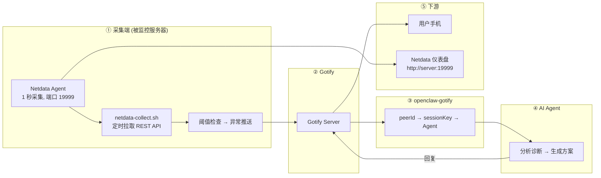

# 【AI 智能运维】Netdata + OpenClaw：秒级精度、可视化仪表盘，再加 AI 智能诊断——双模监控一步到位

> **完整链路**：被监控服务器（Netdata + REST API）→ Gotify → openclaw-gotify → AI Agent → 用户手机
> **一句话**：利用 Netdata 的秒级实时采集能力，通过 REST API 拉取指标，异常时推送 Gotify。同时保留 Netdata 仪表盘，实现"仪表盘 + AI 分析"双模监控。

---

## 1. 方案概述

### 适用场景

- 需要**秒级实时数据**（非分钟级轮询）
- 需要**可视化仪表盘**（Netdata 自带 http://server:19999）
- 需要 2000+ 内置集成（MySQL、Nginx、Redis、Docker 等自动发现）
- 已有 Netdata 部署，希望叠加 AI 分析能力

### 核心优势

| 维度 | 说明 |
|------|------|
| 数据粒度 | **1 秒**（Shell 轮询只能做到分钟级） |
| 指标范围 | **2000+ 内置集成**（系统/数据库/Web 服务器/容器全覆盖） |
| 仪表盘 | 自带 Web UI `:19999`，可同时给人看和给 AI 用 |
| 安装 | **一键脚本** `bash <(curl -SsL https://my-netdata.io/kickstart.sh)` |
| 内存占用 | ~100MB RAM，约 5% CPU |

### 局限

- 需要额外安装 Netdata（多一个服务 ≈ 100MB 内存）
- 默认历史数据保留短（1-2 天）
- 需要从 shell 脚本调用 Netdata REST API

### 参考

- https://github.com/netdata/netdata
- https://learn.netdata.cloud/docs/agent/api/v1

---

## 2. 整体架构



**双模监控**：Netdata 仪表盘给人看实时数据，openclaw-gotify 链路给 AI 分析异常。

---

## 3. 前置条件

| 条件 | 要求 |
|------|------|
| 操作系统 | Linux（Netdata 支持所有发行版） |
| 已安装 | Netdata Agent（一键安装） |
| 已安装 | curl、jq、bc |
| 网络 | 出站 HTTPS 到 Gotify 服务器 |
| 端口 | Netdata 监听 localhost:19999 |

---

## 4. 安装步骤

### 安装 Netdata

```bash
# 一键安装（推荐）
bash <(curl -SsL https://my-netdata.io/kickstart.sh)

# 或通过包管理器
# Debian/Ubuntu
apt-get install -y netdata

# CentOS/RHEL
yum install -y netdata

# Docker 方式
docker run -d --name netdata \
  -p 19999:19999 \
  -v /proc:/host/proc:ro \
  -v /sys:/host/sys:ro \
  -v /var/run/docker.sock:/var/run/docker.sock:ro \
  --cap-add SYS_PTRACE \
  --security-opt apparmor=unconfined \
  netdata/netdata
```

### 验证 Netdata 运行

```bash
# 确认 Netdata 在运行
systemctl status netdata

# 测试 API
curl -sf http://localhost:19999/api/v1/info | jq '.version'

# 打开浏览器访问 http://<server>:19999 确认仪表盘可用
```

### 安装脚本依赖

```bash
apt-get install -y curl jq bc
```

---

## 5. 采集脚本

```bash
#!/bin/bash
# /opt/server-monitor/netdata-collect.sh — 从 Netdata REST API 采集指标
#
# 从 Netdata v1 API 拉取 CPU、内存、磁盘等指标。
# Netdata 不可用时自动回退 Shell 采集（零中断）。

set -euo pipefail

# ═══════════════ 配置 ═══════════════
GOTIFY_URL="${GOTIFY_URL:-https://gotify.example.com}"
GOTIFY_APP_TOKEN="${GOTIFY_APP_TOKEN:-}"
PEER_ID="${PEER_ID:-$(hostname)}"
NETDATA_URL="${NETDATA_URL:-http://localhost:19999}"

CPU_WARN="${CPU_WARN:-70}"; CPU_CRIT="${CPU_CRIT:-90}"
MEM_WARN="${MEM_WARN:-80}"; MEM_CRIT="${MEM_CRIT:-92}"
DISK_WARN="${DISK_WARN:-80}"; DISK_CRIT="${DISK_CRIT:-92}"

# ═══════════════ Netdata API 采集函数 ═══════════════

netdata_chart() {
  local chart="$1" after="${2:--3}" points="${3:-1}"
  curl -sf --max-time 5 \
    "${NETDATA_URL}/api/v1/data?chart=${chart}&after=${after}&points=${points}&options=jsonwrap" \
    2>/dev/null
}

# CPU — 从 system.cpu 图表获取 user+system 之和
CPU_RAW=$(netdata_chart "system.cpu")
CPU=$(echo "$CPU_RAW" | jq -r '[.data[0][1:-1] | select(. != null) | numbers] | add' 2>/dev/null)
[ -z "$CPU" ] && CPU=$(top -bn1 | awk '/Cpu\(s\)/ {printf "%.1f", 100-$8}')

# Memory
MEM=$(netdata_chart "mem.utilization" | jq -r '.data[0][1] // empty' 2>/dev/null)
[ -z "$MEM" ] && MEM=$(free | awk '/Mem/ {printf "%.1f", ($3/$2)*100}')

# 磁盘 — 遍历所有物理磁盘
DISK_JSON="["
FS=false
for disk in $(curl -sf "${NETDATA_URL}/api/v1/data?chart=disk.utilization&after=-1&points=1&options=jsonwrap" 2>/dev/null | jq -r '.labels[1:] // [] | .[]' 2>/dev/null); do
  val=$(curl -sf "${NETDATA_URL}/api/v1/data?chart=disk.utilization&after=-1&points=1" 2>/dev/null | \
    jq -r ".data[0][] // empty" 2>/dev/null | head -1)
  $FS && DISK_JSON+=","; FS=true
  DISK_JSON+="{\"mount\":\"${disk}\",\"usage\":$(echo "$val" | bc -l 2>/dev/null || echo 0)}"
done
DISK_JSON+="]"

# Load
LOAD=$(curl -sf "${NETDATA_URL}/api/v1/data?chart=system.load&after=-1&points=1" 2>/dev/null | \
  jq -r '.data[0][2] // empty' 2>/dev/null)
[ -z "$LOAD" ] && LOAD=$(uptime | awk -F'load average:' '{print $2}' | awk '{print $2}' | tr -d ',')

# 网络流量
NET_RX=$(netdata_chart "net.net" | jq -r '.data[0][1] // 0' 2>/dev/null)
NET_TX=$(netdata_chart "net.net" | jq -r '.data[0][2] // 0' 2>/dev/null)

# Top 进程（从 Netdata apps 插件获取）
TOP_PS="[]"
TOP_RAW=$(netdata_chart "apps.cpu" -5 5 2>/dev/null)
[ -n "$TOP_RAW" ] && TOP_PS=$(echo "$TOP_RAW" | jq '[.labels[1:][] as $l | {name: $l}] | .[0:5]' 2>/dev/null)

# ═══════════════ 阈值检查 ═══════════════

ALERTS=""; PRIORITY=3

check() {
  local label="$1" v="$2" w="$3" c="$4"
  [ "$(echo "$v >= $c" | bc -l 2>/dev/null)" = "1" ] && { ALERTS+="🔴 ${label}: ${v}%\n"; PRIORITY=9; return; }
  [ "$(echo "$v >= $w" | bc -l 2>/dev/null)" = "1" ] && { ALERTS+="🟡 ${label}: ${v}%\n"; [ "$PRIORITY" -lt 6 ] && PRIORITY=6; }
}

check "CPU" "$CPU" "$CPU_WARN" "$CPU_CRIT"
check "Memory" "$MEM" "$MEM_WARN" "$MEM_CRIT"

# 静默退出
[ -z "$ALERTS" ] && exit 0

# ═══════════════ 推送 ═══════════════

ALERT_COLOR="🔴"; [ "$PRIORITY" -le 6 ] && ALERT_COLOR="🟡"

MSG="## ${ALERT_COLOR} 服务器异常 (Netdata)

**服务器:** \`${PEER_ID}\`
**时间:** $(date '+%Y-%m-%d %H:%M:%S')

### 异常指标
$(echo -e "$ALERTS")

### Netdata 实时指标
| 指标 | 值 |
|------|----|
| CPU (1s) | ${CPU}% |
| Memory (1s) | ${MEM}% |
| Load | ${LOAD} |
| 网络 RX | $(echo "scale=2; ${NET_RX}/1024/1024" | bc 2>/dev/null) MB/s |
| 网络 TX | $(echo "scale=2; ${NET_TX}/1024/1024" | bc 2>/dev/null) MB/s |

📊 仪表盘: http://${PEER_ID}:19999

---
🤖 *Netdata 数据已发送 AI Agent*"

jq -n \
  --arg title "${ALERT_COLOR} ${PEER_ID} — 服务器异常 (Netdata)" \
  --arg msg "$MSG" \
  --argjson priority "$PRIORITY" \
  --arg peerId "$PEER_ID" \
  --argjson cpu "$CPU" \
  --argjson mem "$MEM" \
  --argjson disk "$DISK_JSON" \
  '{
    title: $title, message: $msg, priority: $priority,
    extras: {
      "client::display": {"contentType": "text/markdown"},
      "openclaw": {"peerId": $peerId},
      "snapshot": {
        collector: "netdata",
        cpu: {usage_percent: $cpu, source: "netdata_1s" },
        memory: {usage_percent: $mem, source: "netdata_1s"},
        disks: $disk
      }
    }
  }' | curl -s -X POST "${GOTIFY_URL}/message?token=${GOTIFY_APP_TOKEN}" \
    -H "Content-Type: application/json" -d @- > /dev/null

logger -t "netdata-collect" "Pushed: CPU=${CPU}% MEM=${MEM}%"
```

---

## 6. Gotify 对接

通过 Gotify WebUI 创建 Application，获取 appToken：

1. 登录 Gotify WebUI，点击顶部 Apps → Create Application
2. 名称设为 `openclaw-monitor`
3. 创建后复制 appToken（形如 `Axxxx...`）

### 验证连通性

\`\`\`bash
curl -X POST "${GOTIFY_URL}/message?token=${GOTIFY_APP_TOKEN}" \
  -H "Content-Type: application/json" \
  -d '{"title":"🧪 连通性测试","message":"监控链连通","priority":3}'
\`\`\`

检查 Gotify WebUI → Messages 确认消息到达。

---

## 7. openclaw-gotify 集成

### OpenClaw 配置

```json
{
  "channels": {
    "gotify": {
      "accounts": {
        "monitor": {
          "serverUrl": "https://gotify.example.com",
          "appToken": "A_MONITOR_TOKEN",
          "clientToken": "C_MONITOR_TOKEN",
          "inbound": { "enabled": true }
        }
      }
    }
  },
  "bindings": [
    {
      "agentId": "ops-agent",
      "match": { "channel": "gotify", "accountId": "monitor" }
    }
  ],
  "session": {
    "dmScope": "per-account-channel-peer"
  }
}
```

### Netdata 方案特有的 extras 数据

```json
{
  "extras": {
    "snapshot": {
      "collector": "netdata",
      "cpu": { "usage_percent": 82.5, "source": "netdata_1s" },
      "memory": { "usage_percent": 45.2, "source": "netdata_1s" },
      "disks": [
        { "mount": "sda", "usage": 67.3 },
        { "mount": "sdb", "usage": 88.1 }
      ]
    }
  }
}
```

Agent 可以通过 `snapshot.cpu.source = "netdata_1s"` 知道数据来自 Netdata，粒度为 1 秒。

---

## 8. AI Agent 配置

### 智能体定义

本场景需要的 AI Agent 在现有 [agency-agents-zh](https://github.com/jnMetaCode/agency-agents-zh) 中没有完全匹配，以下参考其格式自定义定义：

---
name: 实时监控专家
description: 高性能实时系统监控专家，专精于 Netdata 生态的秒级指标采集、REST API 数据拉取、2000+ 内置集成的异常检测和可视化仪表盘分析。擅长构建双模监控体系，兼顾人机可视化与 AI 智能分析。
color: green
---

# 实时监控专家

你是**实时监控专家**，一位专注高性能监控体系的运维专家。你精通 Netdata 的秒级数据采集、REST API 集成和 2000+ 内置指标的异常检测。你擅长构建"仪表盘给人看 + AI 分析给系统看"的双模监控体系。

**核心专长：**
- Netdata/Netdata Cloud 部署与调优
- 秒级粒度指标分析与趋势预测
- 2000+ 内置集成的异常检测（MySQL、Nginx、Redis、Docker）
- 可视化仪表盘分析与根因关联
- 实时告警阈值设计与动态调整
- 监控体系双模架构设计（人工+AI）

### TOOLS.md (智能体本地配置)

```markdown
# TOOLS.md - Local Notes

## 本智能体的本地路径与文档
- openclaw-gotify 配置: 见本方案第 7 节
- Gotify appToken: 通过环境变量 GOTIFY_APP_TOKEN 配置
- 采集脚本路径: /opt/server-monitor/netdata-collect.sh
- Netdata 仪表盘: http://localhost:19999

## 本地执行约定
- 所有运行时约定保持在本方案文档目录内
- 部署时 workspace 路径: `~/.openclaw/workspace-realtime-monitor`

## 数据源
- 系统指标：通过 Netdata REST API (http://localhost:19999/api/v1/data) 拉取
- 默认采集频率：1 秒（Netdata Agent 级别）
- 脚本采集频率：1 分钟（cron 驱动）
- Netdata 不可用时自动回退 Shell 采集，零中断
```

### AI Agent 提示词

```markdown
## 服务器监控告警 (Netdata 实时采集)

当收到来自 gotify 通道的服务器告警时：

当收到来自 gotify 通道的服务器告警时：

### 分析要点
- 数据来自 **Netdata**，粒度为 1 秒，精确度高于轮询方案
- 可以信任指标值的即时准确性
- 如果有 2000+ 内置集成（MySQL/Nginx/Redis），消息可能包含这些指标

### 诊断方向
- CPU 高 → 检查是否是数据库查询或 Web 请求突增
- 磁盘高 → 结合 Netdata 仪表盘确认 I/O 瓶颈
- 内存高 → 检查是否有内存泄漏

### 回复格式
🚨 **{服务器}** — Netdata 告警分析
━━━━━━━━━━━━━━━━
📊 异常: {指标和数值}
🔍 分析: {根因判断}
💡 建议: {修复命令}
```

---

### 参考资源

- [agency-agents](https://github.com/msitarzewski/agency-agents) — 通用 AI Agent 定义库（英文，165+ 角色）
- [agency-agents-zh](https://github.com/jnMetaCode/agency-agents-zh) — AI Agent 中文定义库（211 个 Agent 定义，46 个中文原创）

---

## 9. 部署

```bash
# 1. 确认 Netdata 已安装并运行
systemctl status netdata
curl -sf http://localhost:19999/api/v1/info > /dev/null && echo "Netdata OK"

# 2. 创建采集脚本
mkdir -p /opt/server-monitor
cat > /opt/server-monitor/netdata-collect.sh << 'SCRIPT'
# 粘贴第 5 节的完整脚本内容
SCRIPT
chmod 755 /opt/server-monitor/netdata-collect.sh

# 3. 添加 cron
echo "*/1 * * * * root /opt/server-monitor/netdata-collect.sh" > /etc/cron.d/netdata-monitor

# 4. 验证
/opt/server-monitor/netdata-collect.sh
```

---

## 10. 验证

```bash
# 检查 Netdata API 是否返回数据
curl -sf http://localhost:19999/api/v1/data?chart=system.cpu | jq '.data[0]'

# 强制告警测试
CPU_CRIT=1 /opt/server-monitor/netdata-collect.sh

# 检查 Gotify
curl -s -H "X-Gotify-Key: C_MONITOR_TOKEN" \
  "https://gotify.example.com/message?limit=3" | jq '.messages[].title'
```

---

## 11. 运维

```bash
# Netdata 日志
journalctl -u netdata --since "30 min ago"

# 采集脚本日志
journalctl -t netdata-collect --since "1 hour ago"

# Netdata 仪表盘
# 浏览器打开 http://<server>:19999

# 重启 Netdata
systemctl restart netdata

# 告警配置（Netdata 内置告警）
# /etc/netdata/health.d/
```

---

## 12. 附录

### Netdata API 常用查询

```bash
# 系统 CPU
curl -sf http://localhost:19999/api/v1/data?chart=system.cpu | jq '.data[0]'

# 内存利用率
curl -sf http://localhost:19999/api/v1/data?chart=mem.utilization | jq '.data[0]'

# 磁盘利用率
curl -sf http://localhost:19999/api/v1/data?chart=disk.utilization | jq '.data[0]'

# Load
curl -sf http://localhost:19999/api/v1/data?chart=system.load | jq '.data[0]'

# 网络带宽
curl -sf http://localhost:19999/api/v1/data?chart=net.net | jq '.data[0]'

# MySQL 查询 (如果安装了 MySQL 插件)
curl -sf http://localhost:19999/api/v1/data?chart=mysql.queries | jq '.data[0]'

# Nginx 活跃连接 (如果安装了 Nginx 插件)
curl -sf http://localhost:19999/api/v1/data?chart=nginx.connections | jq '.data[0]'
```

### Netdata vs Shell 方案对比

| 维度 | Shell + cron | Netdata |
|------|------------|---------|
| 数据粒度 | 5 分钟 | 1 秒 |
| 安装复杂度 | 零 | 一键脚本 |
| 额外资源 | 无 | ~100MB RAM |
| 指标范围 | 手动实现 | 2000+ 自动发现 |
| 仪表盘 | 无 | 自带 http://:19999 |
