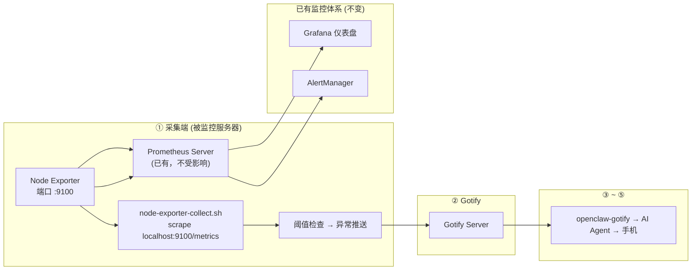

# 【AI 智能运维】Node Exporter + OpenClaw：已有 Prometheus 体系？零改造接入 AI 诊断——你的监控系统离智能就差这一步

> **完整链路**：被监控服务器（Node Exporter + scrape）→ Gotify → openclaw-gotify → AI Agent → 用户手机
> **一句话**：用 Prometheus Node Exporter 暴露标准指标，shell 脚本 scrape localhost:9100/metrics 后推送 Gotify。适合已有 Prometheus + Grafana 体系的团队无缝对接。

---

## 1. 方案概述

### 适用场景

- 已有 **Prometheus + Grafana** 监控体系
- Node Exporter 已部署在服务器上
- 希望在不改变现有架构的前提下叠加 AI 分析能力
- 需要行业标准的指标暴露格式

### 核心优势

| 维度 | 说明 |
|------|------|
| 标准 | **Prometheus 格式**，行业标准的指标暴露方式 |
| 轻量 | **~20MB RAM**，远轻于其他监控 Agent |
| 生态 | Prometheus + Grafana + AlertManager 完整生态链 |
| 复用 | 本脚本 scrape 数据**不影响** Prometheus 的 pull 采集 |
| 回退 | Node Exporter 不可用时自动回退 Shell 采集 |

### 局限

- 需要额外部署 node_exporter 二进制文件
- 默认只暴露裸指标，不做任何阈值判断
- Prometheus 文本格式解析比 JSON 复杂

### 参考

- https://github.com/prometheus/node_exporter
- https://prometheus.io/docs/guides/node-exporter/

---

## 2. 整体架构



Prometheus 仍按原配置 scrape Node Exporter → Grafana。本脚本只是额外读取本地的 /metrics 端点，互不干扰。

---

## 3. 前置条件

| 条件 | 要求 |
|------|------|
| 操作系统 | Linux（Node Exporter 支持） |
| 已安装 | Node Exporter（二进制或 Docker） |
| 运行端口 | localhost:9100 |
| 已安装 | curl、awk（解析 Prometheus 文本格式） |
| 网络 | 出站 HTTPS 到 Gotify 服务器 |

---

## 4. 安装步骤

### 如果尚未安装 Node Exporter

```bash
# 下载最新版
VERSION=$(curl -sf https://api.github.com/repos/prometheus/node_exporter/releases/latest | \
  jq -r '.tag_name' | sed 's/^v//')
wget "https://github.com/prometheus/node_exporter/releases/download/v${VERSION}/node_exporter-${VERSION}.linux-amd64.tar.gz"

# 安装
tar xzf node_exporter-${VERSION}.linux-amd64.tar.gz
sudo cp node_exporter-${VERSION}.linux-amd64/node_exporter /usr/local/bin/
rm -rf node_exporter-*

# 验证
node_exporter --version
```

### 注册 systemd 服务

```ini
# /etc/systemd/system/node_exporter.service
[Unit]
Description=Prometheus Node Exporter
After=network.target

[Service]
Type=simple
ExecStart=/usr/local/bin/node_exporter \
  --web.listen-address=127.0.0.1:9100 \
  --collector.systemd \
  --collector.processes
Restart=always

[Install]
WantedBy=multi-user.target
```

```bash
# 启动
systemctl daemon-reload
systemctl enable --now node_exporter

# 验证
curl -sf http://localhost:9100/metrics | head -20
```

---

## 5. 采集脚本

```bash
#!/bin/bash
# /opt/server-monitor/node-exporter-collect.sh — 从 Node Exporter 采集
#
# 从 localhost:9100/metrics 抓取 Prometheus 格式指标。
# Node Exporter 不可用时自动回退 Shell 采集。

set -euo pipefail

# ═══════════════ 配置 ═══════════════
GOTIFY_URL="${GOTIFY_URL:-https://gotify.example.com}"
GOTIFY_APP_TOKEN="${GOTIFY_APP_TOKEN:-}"
PEER_ID="${PEER_ID:-$(hostname)}"
NODE_EXPORTER_URL="${NODE_EXPORTER_URL:-http://localhost:9100}"

CPU_WARN="${CPU_WARN:-70}"; CPU_CRIT="${CPU_CRIT:-90}"
MEM_WARN="${MEM_WARN:-80}"; MEM_CRIT="${MEM_CRIT:-92}"
DISK_WARN="${DISK_WARN:-80}"; DISK_CRIT="${DISK_CRIT:-92}"

# ═══════════════ 采集函数 ═══════════════

fetch_metrics() {
  curl -sf --max-time 5 "${NODE_EXPORTER_URL}/metrics" 2>/dev/null || return 1
}

# 从 Prometheus 文本格式中提取指标值
# node_cpu_seconds_total{cpu="0",mode="idle"} 12345.67  → 提取 12345.67
get_metric() {
  local pattern="$1"
  echo "$METRICS" | awk -v p="$pattern" '
    $0 ~ p {
      # 取最后一个空格后的数字
      val = $NF
      gsub(/[^0-9.eE+\-]/,"",val)
      if (val != "") { print val; exit }
    }
  ' 2>/dev/null
}

# ═══════════════ 采集 ═══════════════

METRICS=$(fetch_metrics) || {
  logger -t "node-exporter" "Node Exporter unreachable, fallback to shell"
  exec "$(dirname "$0")/fallback-shell.sh"
}

# CPU — 计算所有 CPU 的 idle 平均值，反算使用率
IDLE_TOTAL=$(echo "$METRICS" | awk '/node_cpu_seconds_total.*mode="idlerate"/ {sum+=$NF} END {print sum}' 2>/dev/null)
CPU_COUNT=$(echo "$METRICS" | awk '/node_cpu_seconds_total.*mode="idle"/ {count++; if (count>1) exit} END {print count}' 2>/dev/null)
[ -z "$CPU_COUNT" ] && CPU_COUNT=$(nproc)
IDLE_AVG=$(awk "BEGIN {printf \"%.1f\", ${IDLE_TOTAL:-0} / ${CPU_COUNT:-1}}" 2>/dev/null)
CPU=$(awk "BEGIN {printf \"%.1f\", 100 - ${IDLE_AVG:-0}}" 2>/dev/null)
[ -z "$CPU" ] && CPU=0

# Memory
MEM_TOTAL=$(get_metric 'node_memory_MemTotal_bytes')
MEM_AVAIL=$(get_metric 'node_memory_MemAvailable_bytes')
MEM=0
if [ -n "$MEM_TOTAL" ] && [ -n "$MEM_AVAIL" ] && [ "$(echo "$MEM_TOTAL > 0" | bc -l)" = "1" ]; then
  MEM=$(awk "BEGIN {printf \"%.1f\", (1 - ${MEM_AVAIL}/${MEM_TOTAL}) * 100}" 2>/dev/null)
fi

# Disk — 检查根分区
DISK_TOTAL=$(get_metric 'node_filesystem_size_bytes.*mountpoint="/"')
DISK_FREE=$(get_metric 'node_filesystem_free_bytes.*mountpoint="/"')
DISK=0
if [ -n "$DISK_TOTAL" ] && [ -n "$DISK_FREE" ] && [ "$(echo "$DISK_TOTAL > 0" | bc -l)" = "1" ]; then
  DISK=$(awk "BEGIN {printf \"%.1f\", (1 - ${DISK_FREE}/${DISK_TOTAL}) * 100}" 2>/dev/null)
fi

# Load
LOAD5=$(get_metric 'node_load5')

# 系统信息
UPTIME=$(get_metric 'node_boot_time_seconds')
[ -n "$UPTIME" ] && UPTIME=$(awk "BEGIN {print systime() - ${UPTIME}}" 2>/dev/null)

# ═══════════════ 阈值检查 ═══════════════

ALERTS=""; PRIORITY=3

check() {
  local label="$1" v="$2" w="$3" c="$4"
  [ "$(echo "$v >= $c" | bc -l 2>/dev/null)" = "1" ] && { ALERTS+="🔴 ${label}: ${v}%\n"; PRIORITY=9; return; }
  [ "$(echo "$v >= $w" | bc -l 2>/dev/null)" = "1" ] && { ALERTS+="🟡 ${label}: ${v}%\n"; [ "$PRIORITY" -lt 6 ] && PRIORITY=6; }
}

check "CPU" "$CPU" "$CPU_WARN" "$CPU_CRIT"
check "Memory" "$MEM" "$MEM_WARN" "$MEM_CRIT"
check "Disk (/)" "$DISK" "$DISK_WARN" "$DISK_CRIT"

[ -z "$ALERTS" ] && exit 0

# ═══════════════ 推送 ═══════════════

COLOR="🔴"; [ "$PRIORITY" -le 6 ] && COLOR="🟡"
LOAD="${LOAD5:-N/A}"

jq -n \
  --arg title "${COLOR} ${PEER_ID} — 服务器异常 (Node Exporter)" \
  --arg msg "## ${COLOR} 服务器异常报告

**服务器:** \`${PEER_ID}\`
**采集方式:** Node Exporter
**时间:** $(date '+%Y-%m-%d %H:%M:%S')
**优先级:** ${PRIORITY}

### 异常指标
$(echo -e "$ALERTS")

| 指标 | 值 |
|------|----|
| CPU | ${CPU}% |
| Memory | ${MEM}% |
| Disk | ${DISK}% |
| Load | ${LOAD} |

---
🤖 *Node Exporter 数据已发送 AI Agent*" \
  --argjson priority "$PRIORITY" \
  --arg peerId "$PEER_ID" \
  '{
    title: $title, message: $msg, priority: $priority,
    extras: {
      "client::display": {"contentType": "text/markdown"},
      "openclaw": {"peerId": $peerId},
      "snapshot": {
        collector: "node_exporter",
        cpu: {usage_percent: $cpu}, memory: {usage_percent: $mem}, disk: {usage_percent: $disk}
      }
    }
  }' | curl -s -X POST "${GOTIFY_URL}/message?token=${GOTIFY_APP_TOKEN}" \
    -H "Content-Type: application/json" -d @- > /dev/null

logger -t "node-exporter" "Pushed: CPU=${CPU}% MEM=${MEM}%"
```

### 回退脚本（Node Exporter 不可用时）

```bash
#!/bin/bash
# /opt/server-monitor/fallback-shell.sh — Shell 回退采集
CPU=$(top -bn1 | awk '/Cpu\(s\)/ {printf "%.1f", 100-$8}')
MEM=$(free | awk '/Mem/ {printf "%.1f", ($3/$2)*100}')
echo "{\"cpu\":{\"usage_percent\":$CPU},\"memory\":{\"usage_percent\":$MEM}}"
```

---

## 6. Gotify 对接

通过 Gotify WebUI 创建 Application，获取 appToken：

1. 登录 Gotify WebUI，点击顶部 Apps → Create Application
2. 名称设为 `openclaw-monitor`
3. 创建后复制 appToken（形如 `Axxxx...`）

### 验证连通性

\`\`\`bash
curl -X POST "${GOTIFY_URL}/message?token=${GOTIFY_APP_TOKEN}" \
  -H "Content-Type: application/json" \
  -d '{"title":"🧪 连通性测试","message":"监控链连通","priority":3}'
\`\`\`

检查 Gotify WebUI → Messages 确认消息到达。

---

## 7. openclaw-gotify 集成

### OpenClaw 配置

```json
{
  "channels": {
    "gotify": {
      "accounts": {
        "monitor": {
          "serverUrl": "https://gotify.example.com",
          "appToken": "A_MONITOR_TOKEN",
          "clientToken": "C_MONITOR_TOKEN",
          "inbound": { "enabled": true }
        }
      }
    }
  },
  "bindings": [
    {
      "agentId": "ops-agent",
      "match": { "channel": "gotify", "accountId": "monitor" }
    }
  ],
  "session": {
    "dmScope": "per-account-channel-peer"
  }
}
```

---

## 8. AI Agent 配置

### 智能体定义

本场景推荐的 AI Agent 对应 [agency-agents-zh](https://github.com/jnMetaCode/agency-agents-zh) 中的 **基础设施运维师**：

- 中文定义：[support-infrastructure-maintainer.md](https://github.com/jnMetaCode/agency-agents-zh/blob/main/support/support-infrastructure-maintainer.md)
- 英文定义：[support-infrastructure-maintainer.md](https://github.com/msitarzewski/agency-agents/blob/main/support/support-infrastructure-maintainer.md)

### TOOLS.md (智能体本地配置)

```markdown
# TOOLS.md - Local Notes

## 本智能体的本地路径与文档
- openclaw-gotify 配置: 见本方案第 7 节
- Gotify appToken: 通过环境变量 GOTIFY_APP_TOKEN 配置
- 采集脚本路径: /opt/server-monitor/node-exporter-collect.sh
- 回退脚本路径: /opt/server-monitor/fallback-shell.sh
- Node Exporter 端点: http://localhost:9100/metrics

## 本地执行约定
- 所有运行时约定保持在本方案文档目录内
- 部署时 workspace 路径: `~/.openclaw/workspace-infrastructure-maintainer`

## 数据源
- 指标来源：Prometheus Node Exporter 的 /metrics 端点（localhost:9100）
- 数据格式：Prometheus 文本格式，由脚本中的 awk 函数解析
- 采集频率：5 分钟（cron 驱动）
- Node Exporter 不可用时自动回退 Shell 采集
```

### AI Agent 提示词

```markdown
## 服务器监控告警 (Node Exporter 采集)

数据来自 Prometheus Node Exporter，指标可信度高。

### 分析维度
- CPU 使用率 (取自 node_cpu_seconds_total)
- 内存使用率 (MemAvailable/MemTotal)
- 磁盘使用率 (根分区)

### 回复格式
🚨 **{服务器}** — 异常分析
━━━━━━━━━━━━━━━
🔍 诊断: {根因}
💡 建议: {修复命令}
```

---

### 参考资源

- [agency-agents](https://github.com/msitarzewski/agency-agents) — 通用 AI Agent 定义库（英文，165+ 角色）
- [agency-agents-zh](https://github.com/jnMetaCode/agency-agents-zh) — AI Agent 中文定义库（211 个 Agent 定义，46 个中文原创）

---

## 9. 部署

```bash
# 1. 确认 Node Exporter 在运行
curl -sf http://localhost:9100/metrics > /dev/null && echo "Node Exporter OK"

# 2. 创建采集脚本
mkdir -p /opt/server-monitor
cat > /opt/server-monitor/node-exporter-collect.sh << 'SCRIPT'
# 粘贴第 5 节的完整脚本
SCRIPT
cat > /opt/server-monitor/fallback-shell.sh << 'FALLBACK'
#!/bin/bash
echo "{\"cpu\":{\"usage_percent\":$(top -bn1|awk '/Cpu/{printf "%.1f",100-$8}')},\"memory\":{\"usage_percent\":$(free|awk '/Mem/{printf "%.1f",$3/$2*100})}}"
FALLBACK
chmod 755 /opt/server-monitor/*.sh

# 3. 添加 cron
echo "*/5 * * * * root /opt/server-monitor/node-exporter-collect.sh" > /etc/cron.d/node-exporter-monitor

# 4. 验证
/opt/server-monitor/node-exporter-collect.sh
```

---

## 10. 验证

```bash
# 检查 Node Exporter 指标
curl -sf http://localhost:9100/metrics | grep -E 'node_cpu_seconds_total|node_memory_MemAvailable' | head -3

# 强制告警
CPU_CRIT=1 /opt/server-monitor/node-exporter-collect.sh

# 模拟 Node Exporter 故障 → 测试回退
systemctl stop node_exporter
/opt/server-monitor/node-exporter-collect.sh  # 应该自动 fallback
systemctl start node_exporter
```

---

## 11. 运维

```bash
# Node Exporter 日志
journalctl -u node_exporter --since "30 min ago"

# 采集日志
journalctl -t node-exporter --since "1 hour ago"

# 重启 Node Exporter
systemctl restart node_exporter

# 查看指标（调试）
curl -sf http://localhost:9100/metrics | grep -c '^node_'  # 指标数量
```

### 常见问题

**Q: Node Exporter 端口暴露在公网？**
A: 务必绑定到 127.0.0.1（已通过 `--web.listen-address=127.0.0.1:9100` 限制）。

**Q: 指标值异常？**
A: Node Exporter 的 cpu idle 值可能需要多取几次样本。建议配合 `rate()` 函数。

**Q: 和已有 Prometheus 冲突？**
A: 不影响。Prometheus 从 node_exporter pull 数据，本脚本也从 node_exporter 读取，两者独立。

---

## 12. 附录

### Node Exporter 常用 collectores

```bash
# 常用启动参数
--collector.systemd         # 收集 systemd 服务状态
--collector.processes       # 收集进程信息
--collector.filesystem      # 文件系统使用率
--collector.diskstats       # 磁盘 I/O
--collector.netstat         # 网络连接统计
--collector.meminfo_numa    # NUMA 内存信息
--collector.cpu             # CPU 指标（默认启用）
--collector.loadavg         # 系统负载（默认启用）

# 完整列表: /usr/local/bin/node_exporter --collector.disable-defaults --help
```

### Node Exporter 指标示例

```prometheus
# HELP node_cpu_seconds_total Seconds the cpus spent in each mode.
# TYPE node_cpu_seconds_total counter
node_cpu_seconds_total{cpu="0",mode="idle"} 123456.78
node_cpu_seconds_total{cpu="0",mode="system"} 1234.56

# HELP node_memory_MemAvailable_bytes Memory information field MemAvailable_bytes.
# TYPE node_memory_MemAvailable_bytes gauge
node_memory_MemAvailable_bytes 8.123456e+09

# HELP node_filesystem_free_bytes Filesystem free space in bytes.
# TYPE node_filesystem_free_bytes gauge
node_filesystem_free_bytes{mountpoint="/"} 5.123456e+10

# HELP node_load5 5m load average.
# TYPE node_load5 gauge
node_load5 1.23
```
