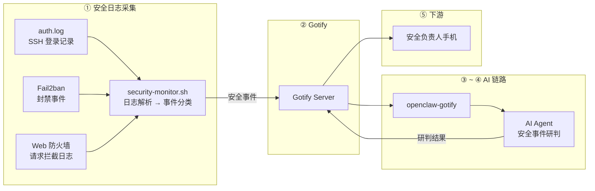

# 【AI 智能运维】安全事件 + OpenClaw：暴力破解、WebShell 写入——AI 自动研判风险，秒级响应

> **完整链路**：安全日志源（Fail2ban / auth.log / WAF）→ 采集脚本 → Gotify → openclaw-gotify → AI Agent → 安全负责人手机
> **一句话**：实时监控登录失败、端口扫描、WebShell 写入等安全事件，AI Agent 自动研判风险等级并给出处置建议。

---

## 1. 方案概述

### 适用场景

- 服务器遭受暴力破解、端口扫描等攻击
- 需要 7×24 安全事件监控和安全负责人即时告警
- 安全告警太多，需要 AI 辅助研判优先级
- 等保合规要求留存安全事件记录和处理证据

### 核心优势

| 维度 | 说明 |
|------|------|
| 响应速度 | **实时**（auth.log 写入即触发，秒级告警） |
| 研判能力 | AI 自动区分扫描、重试、真实攻击，减少误报 |
| 处置建议 | 直接输出封禁 IP 命令或防火墙策略 |
| 审计追溯 | 每次事件 + AI 研判结果均可归档，用于合规审计 |

### 局限

- 只能分析能捕获到的安全事件（需要日志源支持）
- 高级攻击（如 APT 横向移动）可能需要关联多源日志
- AI 研判仅供参考，高危操作仍需人工确认

---

## 2. 整体架构



---

## 3. 前置条件

| 条件 | 要求 |
|------|------|
| 操作系统 | Linux（日志可读） |
| 日志源 | auth.log、Fail2ban 日志、Nginx/Apache WAF 日志（任一） |
| 已安装 | curl、jq、bc |
| 权限 | 读取 `/var/log/auth.log` 等日志文件的权限 |

---

## 4. 安装步骤

### 配置 Fail2ban（可选，但推荐）

```bash
apt-get install -y fail2ban

# 基本配置
cat > /etc/fail2ban/jail.local << 'CONF'
[DEFAULT]
bantime = 3600
findtime = 600
maxretry = 5

[sshd]
enabled = true
port = ssh
filter = sshd
logpath = /var/log/auth.log
maxretry = 5
CONF

systemctl enable --now fail2ban
```

---

## 5. 采集脚本

```bash
#!/bin/bash
# /opt/security-monitor/security-monitor.sh — 安全事件采集推送
#
# 监控多个安全日志源，检测异常事件并推送 Gotify
# 支持：SSH 暴力破解、Fail2ban 封禁、Web 攻击

set -euo pipefail

# ═══════════════ 配置 ═══════════════
GOTIFY_URL="${GOTIFY_URL:-https://gotify.example.com}"
GOTIFY_APP_TOKEN="${GOTIFY_APP_TOKEN:-}"
PEER_ID="${PEER_ID:-$(hostname)}"

# 日志文件路径
AUTH_LOG="${AUTH_LOG:-/var/log/auth.log}"
FAIL2BAN_LOG="${FAIL2BAN_LOG:-/var/log/fail2ban.log}"
WAF_LOG="${WAF_LOG:-/var/log/nginx/access.log}"  # 如使用 ModSecurity 或 Nginx WAF
STATE_DIR="/tmp/.security-monitor-state"

# 威胁阈值
MAX_FAILED_LOGIN="${MAX_FAILED_LOGIN:-5}"      # 5 分钟内同 IP 失败超过此值告警
SCAN_THRESHOLD="${SCAN_THRESHOLD:-20}"         # 异常端口扫描阈值

# ═══════════════ 状态管理 ═══════════════

mkdir -p "$STATE_DIR"

get_position() {
  local key="$1"
  cat "${STATE_DIR}/${key}" 2>/dev/null || echo "0"
}

set_position() {
  local key="$1" val="$2"
  echo "$val" > "${STATE_DIR}/${key}"
}

# ═══════════════ SSH 暴力破解检测 ═══════════════

check_ssh_bruteforce() {
  local log="$1"
  [ ! -f "$log" ] && return

  local last_pos
  last_pos=$(get_position "auth_log")
  local cur_size
  cur_size=$(stat -c%s "$log" 2>/dev/null || echo 0)

  [ "$cur_size" -le "$last_pos" ] && { set_position "auth_log" "$cur_size"; return; }

  local new_content
  new_content=$(tail -c +"$((last_pos + 1))" "$log" 2>/dev/null || echo "")

  set_position "auth_log" "$cur_size"

  [ -z "$new_content" ] && return

  # 提取失败登录的 IP
  local failed_ips
  failed_ips=$(echo "$new_content" | grep "Failed password" | \
    awk '{for(i=1;i<=NF;i++) if ($i ~ /^[0-9]+\.[0-9]+\.[0-9]+\.[0-9]+$/) print $i}' | \
    sort | uniq -c | sort -rn 2>/dev/null)

  [ -z "$failed_ips" ] && return

  # 检查每个 IP 的失败次数
  while IFS= read -r line; do
    local count ip
    count=$(echo "$line" | awk '{print $1}')
    ip=$(echo "$line" | awk '{print $2}')

    [ -z "$ip" ] && continue
    [ "$count" -lt "$MAX_FAILED_LOGIN" ] && continue

    # 提取用户名（最后一个 Failed password 行的用户名）
    local username
    username=$(echo "$new_content" | grep "Failed password.*${ip}" | \
      tail -1 | awk '{for(i=1;i<=NF;i++) if ($i == "for") {print $(i+1); break}}' 2>/dev/null)

    push_security_event "ssh_bruteforce" 9 \
      "🔴 SSH 暴力破解" \
      "检测到 IP ${ip} 在短时间内 ${count} 次登录失败${username:+（尝试用户: ${username}）}" \
      '{"type":"ssh_bruteforce","source_ip":"'"${ip}"'","attempts":'"${count}"',"username":"'"${username:-unknown}"'","port":22}'

    logger -t "security-monitor" "SSH BRUTE FORCE: ${ip} (${count} attempts)"
  done <<< "$failed_ips"
}

# ═══════════════ Fail2ban 事件检测 ═══════════════

check_fail2ban() {
  local log="$1"
  [ ! -f "$log" ] && return

  local last_pos
  last_pos=$(get_position "fail2ban_log")
  local cur_size
  cur_size=$(stat -c%s "$log" 2>/dev/null || echo 0)

  [ "$cur_size" -le "$last_pos" ] && { set_position "fail2ban_log" "$cur_size"; return; }

  local new_content
  new_content=$(tail -c +"$((last_pos + 1))" "$log" 2>/dev/null || echo "")

  set_position "fail2ban_log" "$cur_size"

  [ -z "$new_content" ] && return

  # 检测封禁事件
  local ban_events
  ban_events=$(echo "$new_content" | grep -E "\[.*\].*Ban" 2>/dev/null)

  [ -z "$ban_events" ] && return

  while IFS= read -r line; do
    local ip service
    ip=$(echo "$line" | awk '{for(i=1;i<=NF;i++) if ($i ~ /^[0-9]+\.[0-9]+\.[0-9]+\.[0-9]+$/) print $i}' | tail -1)
    service=$(echo "$line" | grep -oP '\[\K[^\]]+' | head -1)

    [ -z "$ip" ] && continue

    push_security_event "fail2ban_ban" 7 \
      "🟡 Fail2ban 封禁 IP" \
      "IP ${ip} 已被 Fail2ban 自动封禁（Service: ${service:-unknown}）" \
      '{"type":"fail2ban_ban","source_ip":"'"${ip}"'","service":"'"${service:-unknown}"'"}'

    logger -t "security-monitor" "FAIL2BAN: ${ip} banned (${service})"
  done <<< "$ban_events"
}

# ═══════════════ Web 攻击检测（Nginx + ModSecurity） ═══════════════

check_web_attacks() {
  local log="$1"
  [ ! -f "$log" ] && return

  local last_pos
  last_pos=$(get_position "waf_log")
  local cur_size
  cur_size=$(stat -c%s "$log" 2>/dev/null || echo 0)

  [ "$cur_size" -le "$last_pos" ] && { set_position "waf_log" "$cur_size"; return; }

  local new_content
  new_content=$(tail -c +"$((last_pos + 1))" "$log" 2>/dev/null || echo "")

  set_position "waf_log" "$cur_size"

  [ -z "$new_content" ] && return

  # 检测 4xx/5xx 状态码 + 常见的攻击路径
  local attack_lines
  attack_lines=$(echo "$new_content" | awk '{
    status = $(NF-2)
    path = $(NF-1)
    # 检测常见攻击特征
    if (status ~ /^[45]/ || \
        path ~ /(admin|wp-admin|\.env|\.git|sql|eval|script|select|union|exec)/) {
      print $0
    }
  }' 2>/dev/null)

  [ -z "$attack_lines" ] && return

  # 按 IP 聚合
  local attack_ips
  attack_ips=$(echo "$attack_lines" | \
    awk '{for(i=1;i<=NF;i++) if ($i ~ /^[0-9]+\.[0-9]+\.[0-9]+\.[0-9]+$/) {print $1; break}}' | \
    sort | uniq -c | sort -rn | head -5)

  [ -z "$attack_ips" ] && return

  while IFS= read -r line; do
    local count ip
    count=$(echo "$line" | awk '{print $1}')
    ip=$(echo "$line" | awk '{print $2}')
    [ -z "$ip" ] && continue

    # 找攻击路径
    local attack_path
    attack_path=$(echo "$attack_lines" | grep "$ip" | head -1 | awk '{print $(NF-1)}' 2>/dev/null)

    push_security_event "web_attack" 8 \
      "🔴 Web 攻击检测" \
      "IP ${ip} 触发了 ${count} 次可疑请求，示例路径: ${attack_path:-unknown}" \
      '{"type":"web_attack","source_ip":"'"${ip}"'","requests":'"${count}"',"path":"'"${attack_path:-unknown}"'"}'

    logger -t "security-monitor" "WEB ATTACK: ${ip} (${count} suspicious requests)"
  done <<< "$attack_ips"
}

# ═══════════════ 统一推送函数 ═══════════════

push_security_event() {
  local event_type="$1" priority="$2" title="$3" summary="$4" extra_json="$5"
  local timestamp
  timestamp=$(date '+%Y-%m-%d %H:%M:%S')

  local msg="## ${title}

**服务器:** \`${PEER_ID}\`
**时间:** ${timestamp}
**事件类型:** ${event_type}

### 事件摘要

$(echo -e "$summary")

---

🤖 *已发送 AI Agent 研判中...*"

  jq -n \
    --arg t "$title" \
    --arg m "$msg" \
    --argjson p "$priority" \
    --arg peerId "$PEER_ID" \
    --arg et "$event_type" \
    --arg extra "$extra_json" \
    '{
      title: $t, message: $m, priority: $p,
      extras: {
        "client::display": {"contentType": "text/markdown"},
        "openclaw": {"peerId": $peerId},
        "security_event": ($extra | fromjson)
      }
    }' | curl -s -X POST "${GOTIFY_URL}/message?token=${GOTIFY_APP_TOKEN}" \
      -H "Content-Type: application/json" -d @- > /dev/null
}

# ═══════════════ 主流程 ═══════════════

logger -t "security-monitor" "Starting security event check"

check_ssh_bruteforce "$AUTH_LOG"
check_fail2ban "$FAIL2BAN_LOG"
check_web_attacks "$WAF_LOG"

logger -t "security-monitor" "Security check completed"
```

---

## 6. Gotify 对接

创建 Application 获取 appToken：

1. 登录 Gotify WebUI，点击顶部 Apps → Create Application
2. 名称设为 `openclaw-security`
3. 创建后复制 appToken

### 验证连通性

```bash
curl -X POST "${GOTIFY_URL}/message?token=${GOTIFY_APP_TOKEN}" \
  -H "Content-Type: application/json" \
  -d '{"title":"🧪 安全事件连通性测试","message":"安全监控链连通","priority":3}'
```

---

## 7. openclaw-gotify 集成

### OpenClaw 配置

```json
{
  "channels": {
    "gotify": {
      "accounts": {
        "security-monitor": {
          "serverUrl": "https://gotify.example.com",
          "appToken": "A_SECURITY_TOKEN",
          "clientToken": "C_SECURITY_TOKEN",
          "inbound": { "enabled": true }
        }
      }
    }
  },
  "bindings": [
    {
      "agentId": "ops-agent",
      "match": { "channel": "gotify", "accountId": "security-monitor" }
    }
  ],
  "session": {
    "dmScope": "per-account-channel-peer"
  }
}
```

### 安全方案的独特数据

```json
{
  "extras": {
    "openclaw": { "peerId": "web-01" },
    "security_event": {
      "type": "ssh_bruteforce",
      "source_ip": "203.0.113.42",
      "attempts": 15,
      "username": "root",
      "port": 22
    }
  }
}
```

Agent 可以根据 `security_event.type` 和 `source_ip` 做针对性的安全研判。

---

## 8. AI Agent 配置

### 智能体定义

本场景推荐的 AI Agent 对应 [agency-agents-zh](https://github.com/jnMetaCode/agency-agents-zh) 中的 **威胁检测工程师**：

- 中文定义：[engineering-threat-detection-engineer.md](https://github.com/jnMetaCode/agency-agents-zh/blob/main/engineering/engineering-threat-detection-engineer.md)
- 英文定义：[engineering-threat-detection-engineer.md](https://github.com/msitarzewski/agency-agents/blob/main/engineering/engineering-threat-detection-engineer.md)

### TOOLS.md (智能体本地配置)

```markdown
# TOOLS.md - Local Notes

## 本智能体的本地路径与文档
- openclaw-gotify 配置: 见本方案第 7 节
- Gotify appToken: 通过环境变量 GOTIFY_APP_TOKEN 配置
- 安全监控脚本: /opt/security-monitor/security-monitor.sh
- 日志源: /var/log/auth.log, /var/log/fail2ban.log, /var/log/nginx/access.log

## 本地执行约定
- 所有运行时约定保持在本方案文档目录内
- 部署时 workspace 路径: `~/.openclaw/workspace-threat-detection`

## 数据源
- SSH 暴力破解：从 auth.log 解析 Failed password 事件，按 IP 聚合
- Fail2ban 事件：从 fail2ban.log 监听 Ban 事件
- Web 攻击：从 web 访问日志检测 4xx/5xx 和攻击路径特征
- 检测频率：1 分钟（cron 驱动），增量读取日志
```

### AI Agent 提示词

```markdown
## 安全事件研判

当收到来自 gotify 通道的安全事件时：

### 第一步：分类事件类型
查看 `security_event.type` 确定事件类型：
- **ssh_bruteforce** → SSH 暴力破解
- **fail2ban_ban** → Fail2ban 自动封禁
- **web_attack** → Web 攻击（SQL 注入、路径遍历等）
- 其他 → 根据字段推断

### 第二步：评估风险等级
- 暴力破解：判断是扫描还是定向攻击（扫描通常来自多个 IP 各尝试一次）
- Web 攻击：判断是自动化扫描工具还是手动探测
- IP 信息：查看是否来自已知恶意 IP 段（如云服务商出口 IP 可能较可疑）

### 第三步：输出处置建议

回复格式：
🔴 **{服务器}** — 安全事件研判
━━━━━━━━━━━━━━━
📋 事件: {类型}
🎯 来源: {IP}（{位置/ASN 推断}）
🔍 研判结果:
  - 风险级别: {高/中/低}
  - 行为分析: {攻击特征分析}

💡 处置建议:
  1. 立即封禁: `iptables -A INPUT -s {IP} -j DROP`
  2. 检查是否有成功的登录: `grep "Accepted" /var/log/auth.log | grep {IP}`
  3. 修改 SSH 端口或启用密钥登录
  4. 添加至 Fail2ban 永久黑名单

📌 后续行动:
  - 是否需要升级事件处理
  - 是否需要检查其他同网段服务器
```

---

### 参考资源

- [agency-agents](https://github.com/msitarzewski/agency-agents) — 通用 AI Agent 定义库（英文，165+ 角色）
- [agency-agents-zh](https://github.com/jnMetaCode/agency-agents-zh) — AI Agent 中文定义库（211 个 Agent 定义，46 个中文原创）

---

## 9. 部署

```bash
# 1. 创建目录
mkdir -p /opt/security-monitor

# 2. 复制脚本
cat > /opt/security-monitor/security-monitor.sh << 'SCRIPT'
# 粘贴第 5 节完整脚本内容
SCRIPT
chmod 755 /opt/security-monitor/security-monitor.sh

# 3. 配置
cat > /opt/security-monitor/config.env << 'ENV'
GOTIFY_URL=https://gotify.example.com
GOTIFY_APP_TOKEN=A_SECURITY_TOKEN
PEER_ID=web-01
AUTH_LOG=/var/log/auth.log
FAIL2BAN_LOG=/var/log/fail2ban.log
WAF_LOG=/var/log/nginx/access.log
MAX_FAILED_LOGIN=5
ENV

# 4. 添加 cron（建议 1 分钟）
echo "* * * * * root . /opt/security-monitor/config.env; /opt/security-monitor/security-monitor.sh" \
  > /etc/cron.d/security-monitor

# 5. 验证
/opt/security-monitor/security-monitor.sh
```

---

## 10. 验证

```bash
# 模拟 SSH 暴力破解（从本地触发）
for i in $(seq 1 6); do
  ssh invalid-user@localhost 2>/dev/null || true
done

# 等待 cron 触发或手动运行
/opt/security-monitor/security-monitor.sh

# 检查日志
journalctl -t security-monitor --since "1 min ago"

# 检查 Gotify
curl -s -H "X-Gotify-Key: C_SECURITY_TOKEN" \
  "https://gotify.example.com/message?limit=3" | jq '.messages[].title'
```

---

## 11. 运维

```bash
# 查看安全事件日志
journalctl -t security-monitor --since "1 hour ago"

# 查看 Fail2ban 状态
fail2ban-client status sshd

# 手动封禁 IP
fail2ban-client set sshd banip 203.0.113.42

# 解封 IP
fail2ban-client set sshd unbanip 203.0.113.42

# 重置日志采集位置（重新分析所有日志）
rm -rf /tmp/.security-monitor-state
```

### 常见问题

**Q: 重复推送同一事件？**
A: 脚本基于日志文件位置（offset）增量读取，不会重复处理旧日志。

**Q: 日志被轮转后采集停止？**
A: 脚本检测到文件大小缩小会自动重置位置。

**Q: 如何添加新的安全监控源？**
A: 参考现有函数编写新的 `check_xxx` 函数，在 main 中调用即可。

---

## 12. 附录

### 安全事件优先级

| 事件类型 | 优先级 | 说明 |
|---------|--------|------|
| SSH 暴力破解 | 9 | 正在进行的攻击，需立即关注 |
| Web 攻击 | 8 | SQL 注入、文件包含等 |
| Fail2ban 封禁 | 7 | 自动封禁，确认是否准确 |
| 端口扫描 | 5 | 低风险，可能只是扫描 |
| 异常登录时间 | 3 | 非工作时间登录，需确认 |

### 推荐的安全加固措施

```bash
# 1. SSH 密钥登录（禁用密码）
sed -i 's/^#PasswordAuthentication yes/PasswordAuthentication no/' /etc/ssh/sshd_config
systemctl restart sshd

# 2. 修改 SSH 端口
sed -i 's/^#Port 22/Port 2222/' /etc/ssh/sshd_config

# 3. 安装并配置 Fail2ban
apt-get install -y fail2ban

# 4. 配置防火墙
ufw allow 2222/tcp
ufw enable

# 5. 只允许指定 IP 访问 SSH
# iptables -A INPUT -p tcp --dport 22 -s 你的IP/32 -j ACCEPT
# iptables -A INPUT -p tcp --dport 22 -j DROP
```
