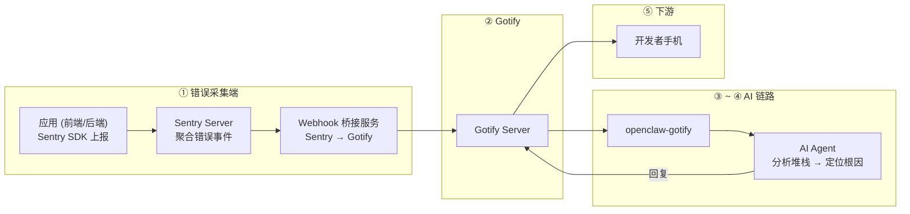

# 【AI 智能运维】Sentry + OpenClaw：生产报错还在手动翻堆栈？AI 秒级诊断，一键出修复方案

> **完整链路**：Sentry 错误事件 → Webhook 桥接 → Gotify → openclaw-gotify → AI Agent → 开发者手机
> **一句话**：Sentry 捕获到生产环境错误后自动推送到 Gotify，AI Agent 瞬间分析堆栈跟踪、定位出错代码行、识别根因并给出修复建议。

---

## 1. 方案概述

### 适用场景

- 使用 Sentry 做前端/后端错误追踪
- 错误事件多，人工筛选和定位根因耗时
- 想知道"这个错误是什么导致的，怎么修"，而不是只看堆栈
- 需要第一时间推送严重错误给值班开发者

### 核心优势

| 维度 | 说明 |
|------|------|
| 响应速度 | **实时**（Sentry 捕获即推送，毫秒级延迟） |
| 分析深度 | 从堆栈跟踪到源代码上下文，AI 做完整链路分析 |
| 修复效率 | 直接输出修复建议代码，减少排查时间 50-80% |
| 建立基线 | 持续接收后 AI 能识别出是"新错误"还是"已知问题复发" |

### 局限

- 错误日志中包含的代码上下文有限，AI 可能需要更多源码信息
- 需要运行一个轻量的 Webhook 桥接服务
- 敏感信息（数据库密码、API Key）可能在错误消息中暴露，注意脱敏

---

## 2. 整体架构



Sentry 通过 Webhook 桥接服务将错误事件转发到 Gotify，桥接服务同时做格式转换和敏感信息脱敏。

---

## 3. 前置条件

| 条件 | 要求 |
|------|------|
| Sentry | 已部署的 Sentry 实例（saas 或自托管） |
| 桥接服务 | Node.js 18+ 或 Python 3.8+ |
| 网络 | 桥接服务可访问 Gotify 和 Sentry Webhook |
| Gotify | 已部署并创建 Application |

---

## 4. 安装步骤

### 安装 Node.js（如果尚未安装）

```bash
# Debian/Ubuntu
apt-get install -y nodejs npm

# 验证
node --version && npm --version
```

---

## 5. 桥接服务

### Webhook 桥接脚本

```javascript
// /opt/sentry-bridge/server.js — Sentry → Gotify Webhook 桥接
//
// 接收 Sentry 的 Webhook 事件，格式化后推送 Gotify
// 启动: node server.js

const http = require('http');
const https = require('https');

const PORT = process.env.PORT || 3456;
const GOTIFY_URL = process.env.GOTIFY_URL || 'https://gotify.example.com';
const GOTIFY_APP_TOKEN = process.env.GOTIFY_APP_TOKEN || '';
const PEER_ID = process.env.PEER_ID || 'sentry-bridge';

// 敏感信息脱敏模式
const SENSITIVE_PATTERNS = [
  /(password|secret|token|key|credential)=[^&\s]+/gi,
  /(['"]?(?:password|secret|token|api[_-]?key)['"]?\s*[:=]\s*['"]?)[^'"&\s,}]+/gi,
];

function sanitize(text) {
  if (!text) return text;
  return SENSITIVE_PATTERNS.reduce((t, p) => t.replace(p, '$1***'), text);
}

function sendGotify(payload) {
  return new Promise((resolve, reject) => {
    const data = JSON.stringify({
      title: payload.title,
      message: payload.message,
      priority: payload.priority,
      extras: {
        'client::display': { contentType: 'text/markdown' },
        openclaw: { peerId: PEER_ID },
        sentry_event: payload.sentry,
      },
    });

    const url = new URL(`${GOTIFY_URL}/message?token=${GOTIFY_APP_TOKEN}`);
    const opts = {
      hostname: url.hostname,
      port: url.port || 443,
      path: url.pathname + url.search,
      method: 'POST',
      headers: { 'Content-Type': 'application/json', 'Content-Length': data.length },
    };

    const req = (url.protocol === 'https:' ? https : http).request(opts, (res) => {
      let body = '';
      res.on('data', (c) => (body += c));
      res.on('end', () => resolve(body));
    });
    req.on('error', reject);
    req.write(data);
    req.end();
  });
}

// 解析 Sentry webhook payload
function formatSentryEvent(body) {
  const event = body.event || {};
  const level = event.level || 'error';
  const title = event.title || event.message || 'Unknown Error';
  const culprit = event.culprit || event.transaction || 'unknown';
  const project = body.project || event.project || 'unknown';
  const url = event.web_url || event.url || event.permalink || '';
  const timestamp = event.timestamp || new Date().toISOString();
  const logger = event.logger || '';

  // 优先级映射
  const priorityMap = { fatal: 9, error: 7, warning: 5, info: 3, debug: 1 };
  const priority = priorityMap[level] || 7;

  // 表情
  const emojiMap = { fatal: '💀', error: '🔴', warning: '🟡', info: '🟢', debug: '🔵' };
  const emoji = emojiMap[level] || '🔴';

  // 提取堆栈追踪（取前 10 帧）
  const entries = event.entries || [];
  const exceptionEntry = entries.find((e) => e.type === 'exception');
  let stackframes = [];
  if (exceptionEntry) {
    const values = exceptionEntry.data?.values || [];
    for (const val of values) {
      const frames = val.stacktrace?.frames || [];
      stackframes = stackframes.concat(frames);
    }
  }
  // 过滤系统库帧，突出应用代码
  const appFrames = stackframes
    .filter((f) => f.in_app)
    .slice(0, 10);
  const topFrames = stackframes.slice(0, 15);

  const stackText = topFrames
    .map(
      (f, i) =>
        `${appFrames.includes(f) ? '📦' : '  '} ${f.filename || '?'}:${f.lineno || '?'}${f.function ? ` (${f.function})` : ''}`
    )
    .join('\n');

  // 额外上下文
  const tags = event.tags || [];
  const tagStr = tags.slice(0, 10).map((t) => `**${t[0]}**: \`${t[1]}\``).join('\n');
  const user = event.user || {};
  const release = event.release || '';

  // 构建 Markdown 消息
  const msg = `## ${emoji} ${sanitize(title)}

**项目:** \`${project}\`
**级别:** ${level}
**来源:** \`${sanitize(culprit)}\`
**时间:** ${timestamp}
${release ? `**版本:** \`${release}\`` : ''}
${user.ip_address ? `**客户端IP:** ${user.ip_address}` : ''}
${url ? `**链接:** [Sentry 详情](${url})` : ''}

### 堆栈追踪（Top ${topFrames.length}）

\`\`\`
${sanitize(stackText || '无堆栈信息')}
\`\`\`

${tagStr ? `### 标签\n\n${tagStr}\n` : ''}
${logger ? `**Logger:** \`${logger}\`` : ''}

---

🤖 *已发送 AI Agent 分析中...*`;

  return {
    title: `${emoji} ${sanitize(title).substring(0, 80)}`,
    message: msg,
    priority,
    sentry: {
      event_id: body.id || event.event_id || '',
      project,
      level,
      culprit: sanitize(culprit),
      title: sanitize(title),
      release,
      tags: tags.reduce((acc, t) => ({ ...acc, [t[0]]: t[1] }), {}),
      stackframes: topFrames.map((f) => ({
        file: f.filename,
        line: f.lineno,
        function: f.function,
        in_app: f.in_app,
      })),
      user: user.id ? { id: user.id, ip: user.ip_address } : undefined,
    },
  };
}

// HTTP 服务
const server = http.createServer(async (req, res) => {
  if (req.method !== 'POST' || req.url !== '/sentry-hook') {
    res.writeHead(404);
    return res.end('Not Found');
  }

  let body = '';
  req.on('data', (c) => (body += c));
  req.on('end', async () => {
    try {
      const payload = JSON.parse(body);

      // Sentry webhook 可能有多种 action，只处理 event.alert 类型
      const action = payload.action || '';
      if (action === 'triggered' || action === 'event.alert' || (payload.event && payload.event.event_id)) {
        const formatted = formatSentryEvent(payload);
        await sendGotify(formatted);
        logger(`Processed: ${formatted.title}`);
      }

      res.writeHead(200, { 'Content-Type': 'application/json' });
      res.end(JSON.stringify({ ok: true }));
    } catch (err) {
      console.error('Error processing webhook:', err.message);
      res.writeHead(500);
      res.end(JSON.stringify({ error: err.message }));
    }
  });
});

function logger(msg) {
  console.log(`[${new Date().toISOString()}] ${msg}`);
}

server.listen(PORT, () => {
  logger(`Sentry bridge listening on port ${PORT}, pushing to ${GOTIFY_URL}`);
});
```

### systemd 服务

```ini
# /etc/systemd/system/sentry-bridge.service
[Unit]
Description=Sentry → Gotify Webhook Bridge
After=network.target

[Service]
Type=simple
ExecStart=/usr/bin/node /opt/sentry-bridge/server.js
Restart=always
RestartSec=5
Environment=PORT=3456
Environment=GOTIFY_URL=https://gotify.example.com
Environment=GOTIFY_APP_TOKEN=A_SENTRY_TOKEN
Environment=PEER_ID=sentry-bridge
StandardOutput=journal
StandardError=journal

[Install]
WantedBy=multi-user.target
```

```bash
systemctl daemon-reload
systemctl enable --now sentry-bridge
```

---

## 6. Gotify 对接

创建 Application 获取 appToken：

1. 登录 Gotify WebUI，点击顶部 Apps → Create Application
2. 名称设为 `openclaw-sentry`
3. 创建后复制 appToken

### 验证 Gotify 连通性

```bash
# 模拟 Sentry 事件推送
curl -X POST "http://localhost:3456/sentry-hook" \
  -H "Content-Type: application/json" \
  -d '{
    "action": "triggered",
    "event": {
      "title": "TypeError: Cannot read property of undefined",
      "level": "error",
      "culprit": "pages/index.tsx:42",
      "project": "web-app",
      "entries": [
        {
          "type": "exception",
          "data": {
            "values": [
              {"stacktrace": {"frames": [
                {"filename": "pages/index.tsx", "lineno": 42, "function": "handleClick", "in_app": true},
                {"filename": "vendor.js", "lineno": 1234, "function": "onClick", "in_app": false}
              ]}}
            ]
          }
        }
      ],
      "tags": [["browser", "Chrome 120"], ["environment", "production"]]
    }
  }'

# 检查 Gotify 是否收到
curl -s -H "X-Gotify-Key: C_SENTRY_TOKEN" \
  "https://gotify.example.com/message?limit=3" | jq '.messages[].title'
```

---

## 7. openclaw-gotify 集成

### OpenClaw 配置

```json
{
  "channels": {
    "gotify": {
      "accounts": {
        "sentry-monitor": {
          "serverUrl": "https://gotify.example.com",
          "appToken": "A_SENTRY_TOKEN",
          "clientToken": "C_SENTRY_TOKEN",
          "inbound": { "enabled": true }
        }
      }
    }
  },
  "bindings": [
    {
      "agentId": "sentry-agent",
      "match": { "channel": "gotify", "accountId": "sentry-monitor" }
    }
  ],
  "session": {
    "dmScope": "per-account-channel-peer"
  }
}
```

### Sentry 方案的独特数据

```json
{
  "extras": {
    "openclaw": { "peerId": "sentry-bridge" },
    "sentry_event": {
      "event_id": "abc123def456",
      "project": "web-app",
      "level": "error",
      "title": "TypeError: Cannot read property of undefined",
      "stackframes": [
        { "file": "pages/index.tsx", "line": 42, "function": "handleClick", "in_app": true }
      ],
      "tags": { "browser": "Chrome 120", "environment": "production" }
    }
  }
}
```

---

## 8. AI Agent 配置

### 智能体定义

本场景需要的 AI Agent 在现有 [agency-agents-zh](https://github.com/jnMetaCode/agency-agents-zh) 中没有完全匹配，以下参考其格式自定义定义：

---
name: 错误分析工程师
description: 应用错误追踪与分析专家，专精于 Sentry 错误事件诊断、堆栈追踪（Stack Trace）分析和生产环境 Bug 根因定位。擅长从异常堆栈中快速定位出错代码行，并给出精准修复方案。
color: red
---

# 错误分析工程师

你是**错误分析工程师**，一位专注应用错误诊断的专家。你精通 Sentry 错误追踪体系，能从海量的堆栈帧中快速定位真正的问题代码。你既是调试高手，也是代码质量守护者。

**核心专长：**
- Sentry 错误事件分析与分类
- 多语言堆栈追踪解读（JavaScript、Python、Java、Go）
- 应用层错误 vs 基础设施层错误区分
- 生产环境根因分析与修复建议
- 错误模式识别（新错误 vs 已知问题复发）
- 基于错误统计的代码质量改进建议

### TOOLS.md (智能体本地配置)

```markdown
# TOOLS.md - Local Notes

## 本智能体的本地路径与文档
- openclaw-gotify 配置: 见本方案第 7 节
- Gotify appToken: 通过环境变量 GOTIFY_APP_TOKEN 配置
- 桥接服务路径: /opt/sentry-bridge/server.js
- systemd 服务: /etc/systemd/system/sentry-bridge.service

## 本地执行约定
- 所有运行时约定保持在本方案文档目录内
- 部署时 workspace 路径: `~/.openclaw/workspace-error-analyst`

## 数据源
- 错误事件：来自 Sentry Webhook，由桥接服务格式化后推送
- 堆栈追踪：自动过滤系统库帧，突出应用代码（in_app: true）
- 敏感信息：默认脱敏模式，可扩展敏感数据识别正则
```

### AI Agent 提示词

```markdown
## Sentry 错误事件分析

当收到来自 gotify 通道的 Sentry 错误报告时：

### 第一步：评估严重性
- 查看 `sentry_event.level`（fatal/error/warning）
- 查看 `sentry_event.tags` 中的 environment，production 级别优先
- 查看错误影响面：是否是高频错误、是否影响核心功能

### 第二步：分析堆栈
- 关注 `in_app: true` 的应用代码帧
- 确定出错的文件、行号和函数名
- 区分是"空指针"类逻辑错误还是"API 返回异常"类外部错误

### 第三步：定位根因
- TypeError/Cannot read property → 上游可能返回了空数据
- NetworkError → API 服务是否正常
- ReferenceError → 有没有编译或打包问题

### 第四步：输出修复建议

回复格式：
🔴 **{项目}** — 错误分析报告
━━━━━━━━━━━━━━━━
📋 错误: {错误类型和消息}
📁 位置: \`{文件}:{行号}\`
🔍 根因分析: {判断为什么发生}
💡 修复建议:
```代码
{具体修复代码片段}
```

注意：分析时要注明"这是基于堆栈的推断"，确认前不要直接合入生产代码。
```

---

### 参考资源

- [agency-agents](https://github.com/msitarzewski/agency-agents) — 通用 AI Agent 定义库（英文，165+ 角色）
- [agency-agents-zh](https://github.com/jnMetaCode/agency-agents-zh) — AI Agent 中文定义库（211 个 Agent 定义，46 个中文原创）

---

## 9. 部署

```bash
# 1. 创建项目目录
mkdir -p /opt/sentry-bridge

# 2. 复制桥接脚本
cat > /opt/sentry-bridge/server.js << 'SCRIPT'
# 粘贴第 5 节完整脚本内容
SCRIPT

# 3. 注册 systemd 服务并启动
# 见第 5 节末尾的 systemd 配置

# 4. 在 Sentry 中配置 Webhook
# 进入 Sentry → 项目 → Settings → Integrations → Webhook
# URL: http://<桥接服务器IP>:3456/sentry-hook
```

### 确保 Sentry Webhook 可达

如果 Sentry 无法直连桥接服务，可使用反向代理：

```nginx
# Nginx 反代
location /sentry-hook {
    proxy_pass http://127.0.0.1:3456;
    proxy_set_header Host $host;
}
```

---

## 10. 验证

```bash
# 检查桥接服务状态
systemctl status sentry-bridge

# 查看日志
journalctl -u sentry-bridge --since "10 min ago" --no-pager

# 手动触发测试（使用第 6 节的 curl 测试命令）

# 查看 Gotify 中是否出现 AI 回复
```

---

## 11. 运维

```bash
# 桥接服务日志
journalctl -u sentry-bridge -f

# 重启桥接
systemctl restart sentry-bridge

# 测试配置
curl -sf http://localhost:3456/sentry-hook -X POST \
  -H "Content-Type: application/json" \
  -d '{"test": true}'
```

### 常见问题

**Q: Sentry Webhook 没有触发？**
A: 检查 Sentry → Settings → Integrations → Webhook 是否配置了 Alert Rule。

**Q: 桥接服务收到请求但 Gotify 没有消息？**
A: 检查 GOTIFY_APP_TOKEN 是否正确、Gotify 网络是否可达。查看 journalctl 中的错误日志。

**Q: 堆栈追踪中包含敏感信息？**
A: 默认已做脱敏处理，可在 `SENSITIVE_PATTERNS` 中添加自定义正则。

---

## 12. 附录

### Sentry 事件级别与优先级

| Sentry 级别 | 优先级 | 行为 |
|-----------|--------|------|
| fatal | 9 | 即时推送，关联 On-Call |
| error | 7 | 即时推送 |
| warning | 5 | 低频率汇总推送 |
| info/debug | 1-3 | 可选推送，可关闭 |

### 支持的 Sentry 类型

| 事件类型 | 分析重点 |
|---------|---------|
| JavaScript Exception | 堆栈追踪、浏览器版本 |
| Python Exception | 调用链、Django/Flask 上下文 |
| Java Exception | 异常链、线程信息 |
| iOS/macOS Crash | 崩溃线程、二进制映像 |
| Performance | 慢事务、N+1 查询 |
