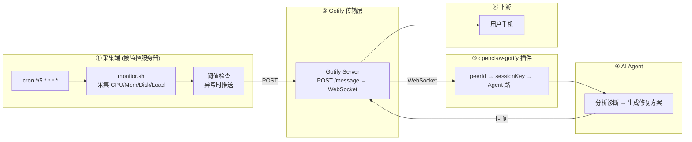

# 【AI 智能运维】Cron + Shell + OpenClaw：零成本、零依赖接入 AI 运维——服务器出故障，AI 比你先知道

> **完整链路**：被监控服务器（bash 脚本 + cron）→ Gotify → openclaw-gotify → AI Agent → 用户手机
> **一句话**：纯 bash 脚本采集服务器指标，cron 定时执行，阈值超限时推送 Gotify。零外部依赖。

---

## 1. 方案概述

### 适用场景

- 裸机服务器、没有安装监控工具的传统环境
- 不想在服务器上安装任何额外软件包
- 需要快速部署、一行命令完成
- 为 3-5 台少量服务器提供基础告警能力

### 核心优势

| 维度 | 说明 |
|------|------|
| 依赖 | **零依赖**（bash + curl + cron，任何 Linux 发行版预装） |
| 资源消耗 | **~0**（每 5 分钟执行一次，耗时 <100ms） |
| 部署速度 | **1 分钟**（scp + crontab 一行命令） |
| 回退机制 | 不需要回退——这就是最基础的保障 |

### 局限

- 秒级实时数据不可得（cron 最小粒度 1 分钟，推荐 5 分钟）
- 无法发现两次采集间隔内的突增突降
- 无历史数据存储

---

## 2. 整体架构



---

## 3. 前置条件

| 条件 | 要求 |
|------|------|
| 操作系统 | Linux（bash 4+） |
| 已安装 | curl、bc（多数发行版预装） |
| 已安装 | cron（默认运行） |
| 网络 | 出站 HTTPS 到 Gotify 服务器 |
| 权限 | 脚本以 root 运行（或 sudo 权限） |

---

## 4. 安装步骤

无需安装任何工具。所有 Linux 发行版预装 bash + curl + cron。

```bash
# 确认基本工具可用
which bash curl crontab bc && echo "OK: 所有工具已就绪"
```

---

## 5. 采集脚本

```bash
#!/bin/bash
# /opt/server-monitor/monitor.sh — Shell + cron 采集推送脚本
#
# 功能：
# 1. 采集 CPU、内存、磁盘、负载四个核心指标
# 2. 检查阈值，异常时推送 Gotify
# 3. 正常时静默退出，零 token 消耗
#
# 配置：通过脚本顶部的变量设置，或通过环境变量覆盖

set -euo pipefail

# ═══════════════ 配置（通过环境变量覆盖） ═══════════════
GOTIFY_URL="${GOTIFY_URL:-https://gotify.example.com}"
GOTIFY_APP_TOKEN="${GOTIFY_APP_TOKEN:-}"
PEER_ID="${PEER_ID:-$(hostname)}"

CPU_WARN="${CPU_WARN:-70}"
CPU_CRIT="${CPU_CRIT:-90}"
MEM_WARN="${MEM_WARN:-80}"
MEM_CRIT="${MEM_CRIT:-92}"
DISK_WARN="${DISK_WARN:-80}"
DISK_CRIT="${DISK_CRIT:-92}"

# ═══════════════ 采集 ═══════════════

HOSTNAME=$(hostname)
TIMESTAMP=$(date -u +"%Y-%m-%dT%H:%M:%SZ")

# CPU
CPU=$(top -bn1 2>/dev/null | awk '/Cpu\(s\)/ {printf "%.0f", 100 - $8}')
[ -z "$CPU" ] && CPU=0

# Memory
MEM_TOTAL=$(free -m 2>/dev/null | awk '/Mem:/ {print $2}')
MEM_USED=$(free -m 2>/dev/null | awk '/Mem:/ {print $3}')
MEM=0; [ -n "$MEM_TOTAL" ] && [ "$MEM_TOTAL" -gt 0 ] && \
  MEM=$((MEM_USED * 100 / MEM_TOTAL))

# Load
LOAD=$(uptime 2>/dev/null | awk -F'load average:' '{print $2}' | awk '{print $2}' | tr -d ',')

# Disk（仅检查根分区 /）
DISK=$(df -h / 2>/dev/null | awk 'NR==2 {print $5}' | tr -d '%')
[ -z "$DISK" ] && DISK=0

# 服务状态
SERVICES=""
for svc in sshd cron docker nginx; do
  if systemctl is-active --quiet "$svc" 2>/dev/null; then
    SERVICES+="{\"name\":\"$svc\",\"status\":\"running\"},"
  else
    SERVICES+="{\"name\":\"$svc\",\"status\":\"stopped\"},"
  fi
done
SERVICES="[${SERVICES%,}]"

# Top 5 CPU 进程
TOP_PS=""
while IFS=' ' read -r pid comm cpu; do
  [ -z "$pid" ] && continue
  TOP_PS+="{\"pid\":$pid,\"name\":\"$comm\",\"cpu\":$cpu},"
done < <(ps -eo pid,comm,%cpu --sort=-%cpu --no-headers 2>/dev/null | head -5)
TOP_PS="[${TOP_PS%,}]"

# ═══════════════ 阈值检查 ═══════════════

ALERTS=""
PRIORITY=3  # 默认低优先级

check() {
  local label="$1" val="$2" w="$3" c="$4"
  [ "$(echo "$val >= $c" | bc -l 2>/dev/null)" = "1" ] && {
    ALERTS+="🔴 ${label}: ${val}%（严重）\n"; PRIORITY=9; return
  }
  [ "$(echo "$val >= $w" | bc -l 2>/dev/null)" = "1" ] && {
    ALERTS+="🟡 ${label}: ${val}%（警告）\n"; [ "$PRIORITY" -lt 6 ] && PRIORITY=6
  }
}

check "CPU" "$CPU" "$CPU_WARN" "$CPU_CRIT"
check "Memory" "$MEM" "$MEM_WARN" "$MEM_CRIT"
check "Disk (/)" "$DISK" "$DISK_WARN" "$DISK_CRIT"

# 服务异常检查
for svc in sshd cron; do
  if ! systemctl is-active --quiet "$svc" 2>/dev/null; then
    ALERTS+="🔴 服务 ${svc} 未运行\n"; PRIORITY=9
  fi
done

# ═══════════════ 无异常 → 静默退出 ═══════════════
[ -z "$ALERTS" ] && exit 0

# ═══════════════ 推送到 Gotify ═══════════════

COLOR="🔴"; [ "$PRIORITY" -le 6 ] && COLOR="🟡"

# 构建消息体（同时包含人可读的 Markdown 和机器可解析的 JSON）
MSG="## ${COLOR} 服务器异常报告

**服务器:** \`${HOSTNAME}\`
**时间:** $(date '+%Y-%m-%d %H:%M:%S')
**优先级:** ${PRIORITY}

### 异常指标
$(echo -e "$ALERTS")

### 当前指标
| 指标 | 值 |
|------|----|
| CPU | ${CPU}% |
| Memory | ${MEM}% |
| Disk / | ${DISK}% |
| Load | ${LOAD} |

### Top 进程
\`\`\`
$(ps -eo pid,comm,%cpu --sort=-%cpu --no-headers 2>/dev/null | head -5)
\`\`\`

---

🤖 *已发送 AI Agent 分析中...*"

PAYLOAD=$(jq -n \
  --arg title "${COLOR} ${HOSTNAME} — 服务器异常 (Shell+cron)" \
  --arg msg "$MSG" \
  --argjson priority "$PRIORITY" \
  --arg peerId "$PEER_ID" \
  --argjson cpu "$CPU" \
  --argjson mem "$MEM" \
  --argjson disk "$DISK" \
  --arg alerts "$ALERTS" \
  '{
    title: $title, message: $msg, priority: $priority,
    extras: {
      "client::display": {"contentType": "text/markdown"},
      "openclaw": {"peerId": $peerId},
      "snapshot": {
        hostname: (env.HOSTNAME // ""),
        collector: "shell",
        cpu: {usage_percent: $cpu},
        memory: {usage_percent: $mem},
        disk: {usage_percent: $disk},
        alerts: $alerts
      }
    }
  }' 2>/dev/null) || {
  # jq 不可用时用纯 curl 推送
  MSG_SIMPLE="${HOSTNAME}: CPU=${CPU}% MEM=${MEM}% DISK=${DISK}%"
  curl -s -X POST "${GOTIFY_URL}/message?token=${GOTIFY_APP_TOKEN}" \
    -F "title=${COLOR} ${HOSTNAME}" \
    -F "message=${MSG_SIMPLE}" \
    -F "priority=${PRIORITY}" > /dev/null
  exit $?
}

curl -s -X POST "${GOTIFY_URL}/message?token=${GOTIFY_APP_TOKEN}" \
  -H "Content-Type: application/json" \
  -d "$PAYLOAD" > /dev/null

logger -t "server-monitor" "Pushed: ${PRIORITY} (CPU=${CPU} MEM=${MEM})"
```

---

## 6. Gotify 对接

### 在 Gotify 中创建 Application

```bash
# 通过 WebUI:
# 1. 登录 Gotify WebUI
# 2. 点击顶部 Apps 标签
# 3. 点击 Create Application
# 4. 名称: openclaw-monitor
# 5. 创建后记录 appToken（形如 Axxxx...）
```

### 对应关系

| 采集脚本配置项 | Gotify 侧对应 |
|--------------|--------------|
| `GOTIFY_URL` | Gotify 服务器地址 (https://gotify.example.com) |
| `GOTIFY_APP_TOKEN` | Application 的 appToken |
| `PEER_ID` | 采集脚本所在服务器的主机名 |

### 验证 Gotify 连通性

```bash
# 手动发送测试消息
GOTIFY_URL=https://gotify.example.com
GOTIFY_APP_TOKEN=A_MONITOR_TOKEN

curl -X POST "${GOTIFY_URL}/message?token=${GOTIFY_APP_TOKEN}" \
  -H "Content-Type: application/json" \
  -d '{"title":"🧪 测试","message":"Shell采集连通性测试","priority":3}'

# 检查 Gotify WebUI → Messages 是否看到这条消息
```

---

## 7. openclaw-gotify 集成

### OpenClaw 配置

```json
{
  "channels": {
    "gotify": {
      "accounts": {
        "monitor": {
          "serverUrl": "https://gotify.example.com",
          "appToken": "A_MONITOR_TOKEN",
          "clientToken": "C_MONITOR_TOKEN",
          "inbound": { "enabled": true }
        }
      }
    }
  },
  "bindings": [
    {
      "agentId": "ops-agent",
      "match": { "channel": "gotify", "accountId": "monitor" }
    }
  ],
  "session": {
    "dmScope": "per-account-channel-peer"
  }
}
```

### 入站数据在 openclaw-gotify 中的流转

```
WebSocket /stream (clientToken)
  ↓
ws-listener.ts → onMessage(message)
  ↓
dispatchInboundMessage()
  ↓
幂等去重: dedupCache.check(message.id) → 30s 窗口
  ↓
resolvePeerIdFromStreamMessage()
  → extras.openclaw.peerId = "web-01"
  ↓
resolveAgentRoute() → (channel=gotify, accountId=monitor, peer.id=web-01)
  → bindings 匹配 → ops-agent
  ↓
buildSessionKeyFromDmScope()
  → "agent:main:gotify:monitor:direct:web-01"
  ↓
finalizeInboundContext() → dispatchReplyFromConfig()
  ↓
AI Agent 推理 → 回复 → sendGotifyMessage()
```

### 多台服务器的会话隔离

每个 `PEER_ID` 对应一个独立的 sessionKey，Agent 上下文互不干扰：

| 服务器 | PEER_ID | sessionKey |
|--------|---------|-----------|
| web-01 | "web-01" | agent:main:gotify:monitor:direct:web-01 |
| db-01 | "db-01" | agent:main:gotify:monitor:direct:db-01 |
| api-01 | "api-01" | agent:main:gotify:monitor:direct:api-01 |

---

## 8. AI Agent 配置

### 智能体定义

本场景推荐的 AI Agent 对应 [agency-agents-zh](https://github.com/jnMetaCode/agency-agents-zh) 中的 **基础设施运维师**：

- 中文定义：[support-infrastructure-maintainer.md](https://github.com/jnMetaCode/agency-agents-zh/blob/main/support/support-infrastructure-maintainer.md)
- 英文定义：[support-infrastructure-maintainer.md](https://github.com/msitarzewski/agency-agents/blob/main/support/support-infrastructure-maintainer.md)

### TOOLS.md (智能体本地配置)

```markdown
# TOOLS.md - Local Notes

## 本智能体的本地路径与文档
- openclaw-gotify 配置: 见本方案第 7 节
- Gotify appToken: 通过环境变量 GOTIFY_APP_TOKEN 配置
- 采集脚本路径: /opt/server-monitor/monitor.sh

## 本地执行约定
- 所有运行时约定保持在本方案文档目录内
- 部署时 workspace 路径: `~/.openclaw/workspace-infrastructure-maintainer`

## 数据源
- 采集脚本通过 curl 和 bash 内置命令获取指标，GOTIFY_URL 和 appToken 通过环境变量注入
```

### AI Agent 提示词

在 Agent 的 `AGENTS.md` 或系统提示词中加入：

```markdown
## 服务器监控告警 (Shell + cron 采集)

当收到来自 gotify 通道的服务器异常报告时：

### 第一步：解析异常指标
读取消息正文中的异常列表，确定哪些指标超阈值。

### 第二步：定位根因
如果消息中包含 Top 进程信息，检查是哪个进程导致。常见情况：
- nginx worker CPU 过高 → 检查并发连接数
- mysqld CPU 过高 → 检查慢查询
- 磁盘使用率高 → 检查大文件

### 第三步：输出诊断和修复方案

回复格式：
🚨 {服务器名}
━━━━━━━━━━━━━━
🔍 诊断: {根因和影响范围}
💡 建议: {具体命令，如 "sudo nginx -s reload"}

使用 Markdown 格式。
```

---

### 参考资源

- [agency-agents](https://github.com/msitarzewski/agency-agents) — 通用 AI Agent 定义库（英文，165+ 角色）
- [agency-agents-zh](https://github.com/jnMetaCode/agency-agents-zh) — AI Agent 中文定义库（211 个 Agent 定义，46 个中文原创）

---

## 9. 部署

### 创建目录和脚本

```bash
# 在目标服务器上执行
mkdir -p /opt/server-monitor
cat > /opt/server-monitor/monitor.sh << 'SCRIPT'
# 粘贴上面的完整脚本内容
SCRIPT
chmod 755 /opt/server-monitor/monitor.sh
```

### 配置环境变量

```bash
cat > /opt/server-monitor/config.env << 'ENV'
GOTIFY_URL=https://gotify.example.com
GOTIFY_APP_TOKEN=A_MONITOR_TOKEN
PEER_ID=$(hostname)
CPU_CRIT=90
MEM_CRIT=92
DISK_CRIT=92
ENV
```

### 添加 cron 任务

```bash
# 每 5 分钟执行一次
echo "*/5 * * * * root . /opt/server-monitor/config.env; /opt/server-monitor/monitor.sh" \
  > /etc/cron.d/server-monitor

# 生效
systemctl reload cron  # Debian/Ubuntu
# 或
systemctl reload crond  # CentOS/RHEL
```

### 批量部署（多台服务器）

```bash
# 在 Ansible 或手动 SSH 循环中
for host in web-01 db-01 api-01; do
  ssh "root@$host" bash -s << 'REMOTE'
    mkdir -p /opt/server-monitor
    # ... 复制脚本 ...
    echo '*/5 * * * * root /opt/server-monitor/monitor.sh' > /etc/cron.d/server-monitor
REMOTE
done
```

---

## 10. 验证

### 手动触发测试

```bash
# 临时降低阈值，触发告警
CPU_CRIT=1 /opt/server-monitor/monitor.sh

# 查看日志
tail -20 /var/log/syslog | grep server-monitor
# 或
journalctl -t server-monitor --since "1 min ago"
```

### 检查 Gotify 是否收到

```bash
# 查看 Gotify WebUI → Messages
# 或通过 API 查询
curl -s -H "X-Gotify-Key: C_MONITOR_TOKEN" \
  "https://gotify.example.com/message?limit=5" | jq
```

### 检查 Agent 是否回复

Agent 通常在收到消息后 2-8 秒内回复。检查 Gotify 中是否有 Agent 发送的新消息（来自 appToken A_MONITOR_TOKEN 的消息）。

### 正常情况验证

```bash
# 确认脚本在正常时确实不推送
# 查看 cron 日志
grep monitor /var/log/cron  # 确认有执行记录
# 查看 Gotify Messages — 应该没有新消息
```

---

## 11. 运维

### 日志查看

```bash
# 推送日志（syslog）
journalctl -t server-monitor --since "1 hour ago"

# cron 执行日志
grep -i monitor /var/log/syslog
```

### 临时停用

```bash
# 移除 cron 文件
rm /etc/cron.d/server-monitor

# 或临时注释
sed -i 's/^/#/' /etc/cron.d/server-monitor
```

### 常见问题

**Q: 脚本执行了但没有推送？**
A: 检查 `exit 0` 前面的阈值判断——可能是所有指标都正常，脚本静默退出了。可以用 `CPU_CRIT=1` 强制触发测试。

**Q: Gotify 返回 401？**
A: appToken 错误。确认 `GOTIFY_APP_TOKEN` 的值与 Gotify WebUI 中的 appToken 一致。

**Q: curl 连接失败？**
A: 检查网络连通性：`curl -I https://gotify.example.com`。确认 Gotify 服务器地址正确且可达。

**Q: bc: command not found？**
A: 安装 bc：`apt install -y bc` 或 `yum install -y bc`。该脚本使用 bc 做浮点数比较。

---

## 12. 附录

### 完整脚本（精简无 jq 版）

如果目标服务器没有 jq，使用以下精简版：

```bash
#!/bin/bash
GOTIFY_URL="${GOTIFY_URL:-https://gotify.example.com}"
GOTIFY_APP_TOKEN="${GOTIFY_APP_TOKEN:-}"
PEER_ID="${PEER_ID:-$(hostname)}"
CPU_CRIT="${CPU_CRIT:-90}"

CPU=$(top -bn1 | awk '/Cpu\(s\)/ {printf "%.0f", 100-$8}')
MEM=$(free | awk '/Mem/ {printf "%.0f", ($3/$2)*100}')
DISK=$(df -h / | awk 'NR==2 {print $5}' | tr -d '%')

[ "$CPU" -lt "$CPU_CRIT" ] && [ "$MEM" -lt 92 ] && [ "$DISK" -lt 92 ] && exit 0

curl -s -X POST "${GOTIFY_URL}/message?token=${GOTIFY_APP_TOKEN}" \
  -F "title=$(hostname) - CPU ${CPU}% MEM ${MEM}%" \
  -F "message=CPU: ${CPU}% Mem: ${MEM}% Disk: ${DISK}%" \
  -F "priority=9" > /dev/null
```

### 环境变量参考

| 变量 | 默认值 | 说明 |
|------|--------|------|
| `GOTIFY_URL` | https://gotify.example.com | Gotify 服务器地址 |
| `GOTIFY_APP_TOKEN` | (必填) | Application 的 appToken |
| `PEER_ID` | $(hostname) | 服务器标识，Agent 据此区分 |
| `CPU_WARN` | 70 | CPU 警告阈值 |
| `CPU_CRIT` | 90 | CPU 严重阈值 |
| `MEM_WARN` | 80 | 内存警告阈值 |
| `MEM_CRIT` | 92 | 内存严重阈值 |
| `DISK_WARN` | 80 | 磁盘警告阈值 |
| `DISK_CRIT` | 92 | 磁盘严重阈值 |
