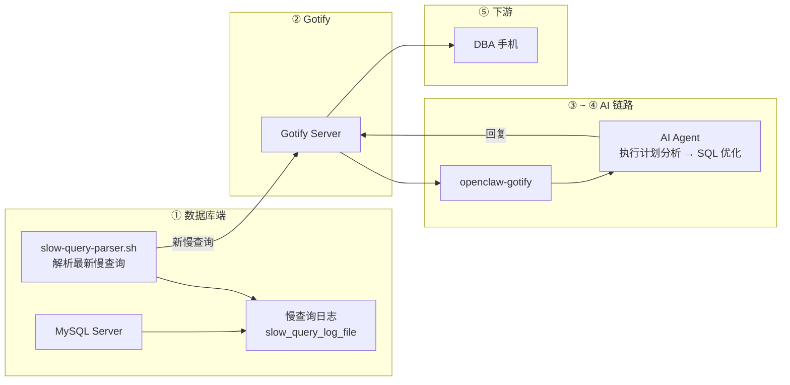

# 【AI 智能运维】慢查询 + OpenClaw：数据库又慢了？AI 分析执行计划、推荐索引优化——DBA 的智能副驾

> **完整链路**：数据库服务器（MySQL 慢查询日志）→ 定时解析脚本 → Gotify → openclaw-gotify → AI Agent → DBA 手机
> **一句话**：定时解析 MySQL 慢查询日志，将执行计划推送到 Gotify，AI Agent 分析查询语句、推荐索引优化和 SQL 改写方案。

---

## 1. 方案概述

### 适用场景

- MySQL/PostgreSQL 数据库出现慢查询，影响业务响应
- DBA 每天需要人工分析慢查询日志
- 想快速判断"加个索引就能解决"还是"需要 SQL 重构"
- 需要在第一时间知道新出现的慢查询

### 核心优势

| 维度 | 说明 |
|------|------|
| 响应速度 | **分钟级**（慢查询出现 → 解析 → AI 分析） |
| 分析深度 | AI 直接读执行计划，区分走没走索引、扫描行数、排序方式 |
| 实用输出 | 直接给出 `CREATE INDEX` 语句或 SQL 改写建议 |
| 全量覆盖 | 周期扫描慢日志，不遗漏任何一条慢查询 |

### 局限

- 需要开启 MySQL 慢查询日志
- 复杂的查询优化可能需要更多上下文（表结构、数据分布）
- 仅限于慢日志有记录的查询，瞬时性能抖动可能不在此列

---

## 2. 整体架构



---

## 3. 前置条件

| 条件 | 要求 |
|------|------|
| 数据库 | MySQL 5.7+ 或 PostgreSQL 12+ |
| 慢日志开启 | `slow_query_log=ON`、`long_query_time ≥ 1` |
| 已安装 | curl、jq、bc |
| 已安装 | pt-query-digest（可选，用于深度分析） |
| 网络 | 出站 HTTPS 到 Gotify 服务器 |
| 工具 | `mysqldumpslow`（MySQL 自带） |

---

## 4. 安装步骤

### 开启 MySQL 慢查询日志

```sql
-- 查看当前设置
SHOW VARIABLES LIKE 'slow_query%';
SHOW VARIABLES LIKE 'long_query_time';

-- 启用慢查询日志（MySQL 5.7+）
SET GLOBAL slow_query_log = ON;
SET GLOBAL long_query_time = 1;        -- 超过 1 秒记录
SET GLOBAL log_queries_not_using_indexes = ON;
```

持久化配置（`/etc/mysql/my.cnf`）：

```ini
[mysqld]
slow_query_log = ON
slow_query_log_file = /var/log/mysql/mysql-slow.log
long_query_time = 1
log_queries_not_using_indexes = ON
```

### 安装分析工具

```bash
apt-get install -y curl jq bc percona-toolkit  # 包含 pt-query-digest
```

---

## 5. 采集脚本

```bash
#!/bin/bash
# /opt/slow-query-monitor/slow-query-parser.sh — 慢查询解析推送
#
# 功能：
# 1. 读取 MySQL 慢查询日志的新增条目
# 2. 解析查询语句、执行时间、扫描行数
# 3. 识别新的慢查询（基于指纹去重）
# 4. 推送到 Gotify 供 AI Agent 分析

set -euo pipefail

# ═══════════════ 配置 ═══════════════
GOTIFY_URL="${GOTIFY_URL:-https://gotify.example.com}"
GOTIFY_APP_TOKEN="${GOTIFY_APP_TOKEN:-}"
PEER_ID="${PEER_ID:-$(hostname)}"
SLOW_LOG="${SLOW_LOG:-/var/log/mysql/mysql-slow.log}"
STATE_FILE="/tmp/.slow-query-state"      # 已处理位置标记
FINGERPRINT_FILE="/tmp/.slow-query-fingerprints"  # 去重指纹

# 阈值
SLOW_SEC_WARN="${SLOW_SEC_WARN:-2}"      # 超过 2s 警告
SLOW_SEC_CRIT="${SLOW_SEC_CRIT:-10}"     # 超过 10s 严重

# ═══════════════ 慢查询解析 ═══════════════

parse_slow_log() {
  local log_file="$1" from_pos="$2"
  if [ ! -f "$log_file" ]; then
    echo "{}"
    return
  fi

  # 用 mysqldumpslow 解析慢日志（MySQL 自带工具）
  # 获取从 from_pos 开始的新增内容
  local new_entries
  new_entries=$(tail -c +"$from_pos" "$log_file" 2>/dev/null || echo "")

  [ -z "$new_entries" ] && { echo "{}"; return; }

  # 提取慢查询条目（以 # Time: 开头的块）
  local query_count=0
  local current_query=""
  local current_time=""
  local current_duration=""
  local current_rows=""
  local current_lock=""
  local parsing_query=false
  local result="[]"

  while IFS= read -r line; do
    case "$line" in
      "# Time:"*)
        # 新查询开始，保存上一条
        if $parsing_query && [ -n "$current_query" ]; then
          query_count=$((query_count + 1))
          # 生成指纹（去重 ID）：去掉具体值后的模板
          local fingerprint
          fingerprint=$(echo "$current_query" | sed -E 's/\b[0-9]+\b/?/g; s/\x27[^\x27]*\x27/?/g' | tr -d '\n' | md5sum | awk '{print $1}')

          result=$(echo "$result" | jq \
            --arg time "$current_time" \
            --arg duration "$current_duration" \
            --arg rows "$current_rows" \
            --arg sql "$current_query" \
            --arg fp "$fingerprint" \
            '. += [{
              time: $time, duration: ($duration | tonumber),
              rows_examined: ($rows | tonumber // 0),
              sql: $sql, fingerprint: $fp
            }]' 2>/dev/null)
        fi
        current_time=$(echo "$line" | sed 's/# Time: //')
        parsing_query=false
        current_query=""
        ;;
      "# Query_time:"*)
        current_duration=$(echo "$line" | awk '{print $3}')
        current_rows=$(echo "$line" | awk '{print $7}')
        current_lock=$(echo "$line" | awk '{print $5}')
        parsing_query=false
        ;;
      "# User@Host:"*) parsing_query=false ;;
      "use "*) ;;
      "SET timestamp="*) ;;
      ";"*) ;;
      "SELECT"*|"select"*|"UPDATE"*|"update"*|"DELETE"*|"delete"*|"INSERT"*|"insert"*)
        current_query="$line"
        parsing_query=true
        ;;
      *)
        if $parsing_query; then
          current_query="${current_query} ${line}"
        fi
        ;;
    esac
  done <<< "$new_entries"

  # 处理最后一条
  if $parsing_query && [ -n "$current_query" ]; then
    local fingerprint
    fingerprint=$(echo "$current_query" | sed -E 's/\b[0-9]+\b/?/g; s/\x27[^\x27]*\x27/?/g' | tr -d '\n' | md5sum | awk '{print $1}')
    result=$(echo "$result" | jq \
      --arg time "$current_time" \
      --arg duration "$current_duration" \
      --arg rows "$current_rows" \
      --arg sql "$current_query" \
      --arg fp "$fingerprint" \
      '. += [{
        time: $time, duration: ($duration | tonumber),
        rows_examined: ($rows | tonumber // 0),
        sql: $sql, fingerprint: $fp
      }]' 2>/dev/null)
  fi

  echo "$result"
}

# ═══════════════ 主流程 ═══════════════

# 获取上次处理位置
LAST_POS=0
[ -f "$STATE_FILE" ] && LAST_POS=$(cat "$STATE_FILE")

# 检查日志文件大小变化
CURRENT_SIZE=$(stat -c%s "$SLOW_LOG" 2>/dev/null || echo 0)
if [ "$CURRENT_SIZE" -le "$LAST_POS" ]; then
  # 日志可能被轮转了，重置位置
  LAST_POS=0
fi

# 解析新增慢查询
QUERIES=$(parse_slow_log "$SLOW_LOG" "$LAST_POS")

# 更新处理位置
echo "$CURRENT_SIZE" > "$STATE_FILE"

# 加载已有指纹
touch "$FINGERPRINT_FILE"

# 逐条处理
echo "$QUERIES" | jq -c '.[]' 2>/dev/null | while IFS= read -r query_json; do
  duration=$(echo "$query_json" | jq -r '.duration // 0')
  fingerprint=$(echo "$query_json" | jq -r '.fingerprint // ""')
  sql=$(echo "$query_json" | jq -r '.sql // ""')
  rows=$(echo "$query_json" | jq -r '.rows_examined // 0')

  # 去重：已处理过相同指纹的跳过
  [ -z "$fingerprint" ] && continue
  if grep -q "^${fingerprint}$" "$FINGERPRINT_FILE" 2>/dev/null; then
    continue
  fi

  # 记录指纹
  echo "$fingerprint" >> "$FINGERPRINT_FILE"

  # 判断优先级
  PRIORITY=3
  [ "$(echo "$duration >= $SLOW_SEC_CRIT" | bc -l 2>/dev/null)" = "1" ] && PRIORITY=9
  [ "$(echo "$duration >= $SLOW_SEC_WARN" | bc -l 2>/dev/null)" = "1" ] && [ "$PRIORITY" -lt 6 ] && PRIORITY=6

  COLOR="🟢"
  [ "$PRIORITY" -ge 9 ] && COLOR="🔴"
  [ "$PRIORITY" -ge 6 ] && [ "$PRIORITY" -lt 9 ] && COLOR="🟡"

  TIMESTAMP=$(echo "$query_json" | jq -r '.time // "unknown"')
  SQL_TRUNCATED="${sql:0:1500}"
  [ "${#sql}" -gt 1500 ] && SQL_TRUNCATED+="\n-- ...（查询语句过长已截断）"

  MSG="## ${COLOR} 慢查询告警

**服务器:** \`${PEER_ID}\`
**时间:** ${TIMESTAMP}
**执行时间:** ${duration}s
**扫描行数:** ${rows}
**优先级:** ${PRIORITY}

### 查询语句

\`\`\`sql
${SQL_TRUNCATED}
\`\`\`

---

🤖 *已发送 AI Agent 分析中...*"

  # 推送 Gotify
  jq -n \
    --arg title "${COLOR} 慢查询 ${duration}s — ${PEER_ID}" \
    --arg msg "$MSG" \
    --argjson priority "$PRIORITY" \
    --arg peerId "$PEER_ID" \
    --argjson duration "$duration" \
    --arg sql "$sql" \
    --argjson rows "$rows" \
    --arg fingerprint "$fingerprint" \
    '{
      title: $title, message: $msg, priority: $priority,
      extras: {
        "client::display": {"contentType": "text/markdown"},
        "openclaw": {"peerId": $peerId},
        "slow_query": {
          duration_seconds: $duration,
          sql: $sql,
          rows_examined: $rows,
          fingerprint: $fingerprint
        }
      }
    }' | curl -s -X POST "${GOTIFY_URL}/message?token=${GOTIFY_APP_TOKEN}" \
      -H "Content-Type: application/json" -d @- > /dev/null

  logger -t "slow-query" "Pushed: ${duration}s ${fingerprint}"
done
```

---

## 6. Gotify 对接

创建 Application 获取 appToken：

1. 登录 Gotify WebUI，点击顶部 Apps → Create Application
2. 名称设为 `openclaw-db`
3. 创建后复制 appToken

### 验证连通性

```bash
curl -X POST "${GOTIFY_URL}/message?token=${GOTIFY_APP_TOKEN}" \
  -H "Content-Type: application/json" \
  -d '{"title":"🧪 慢查询连通性测试","message":"DB 监控链连通","priority":3}'
```

---

## 7. openclaw-gotify 集成

### OpenClaw 配置

```json
{
  "channels": {
    "gotify": {
      "accounts": {
        "db-monitor": {
          "serverUrl": "https://gotify.example.com",
          "appToken": "A_DB_TOKEN",
          "clientToken": "C_DB_TOKEN",
          "inbound": { "enabled": true }
        }
      }
    }
  },
  "bindings": [
    {
      "agentId": "ops-agent",
      "match": { "channel": "gotify", "accountId": "db-monitor" }
    }
  ],
  "session": {
    "dmScope": "per-account-channel-peer"
  }
}
```

---

## 8. AI Agent 配置

### 智能体定义

本场景推荐的 AI Agent 对应 [agency-agents-zh](https://github.com/jnMetaCode/agency-agents-zh) 中的 **数据库优化师**：

- 中文定义：[engineering-database-optimizer.md](https://github.com/jnMetaCode/agency-agents-zh/blob/main/engineering/engineering-database-optimizer.md)
- 英文定义：[engineering-database-optimizer.md](https://github.com/msitarzewski/agency-agents/blob/main/engineering/engineering-database-optimizer.md)

### TOOLS.md (智能体本地配置)

```markdown
# TOOLS.md - Local Notes

## 本智能体的本地路径与文档
- openclaw-gotify 配置: 见本方案第 7 节
- Gotify appToken: 通过环境变量 GOTIFY_APP_TOKEN 配置
- 解析脚本路径: /opt/slow-query-monitor/slow-query-parser.sh
- 慢查询日志: /var/log/mysql/mysql-slow.log
- 状态文件: /tmp/.slow-query-state, /tmp/.slow-query-fingerprints

## 本地执行约定
- 所有运行时约定保持在本方案文档目录内
- 部署时 workspace 路径: `~/.openclaw/workspace-database-optimizer`

## 数据源
- 慢查询：从 MySQL slow_query_log_file 中增量读取
- 指纹去重：基于 SQL 模板的 MD5 指纹，相同查询只推送一次
- 扫描频率：1 分钟（cron 驱动）
```

### AI Agent 提示词

```markdown
## 慢查询 SQL 优化分析

当收到来自 gotify 通道的慢查询告警时：

### 第一步：理解查询
查看 `slow_query.sql` 中的完整查询语句，判断 SQL 类型（SELECT/UPDATE/DELETE）。

### 第二步：分析执行效率
- 是否全表扫描（缺少 WHERE 条件或 WHERE 列无索引）
- 扫描行数是否远大于返回行数（索引选择性差）
- 是否有排序操作（ORDER BY 未走索引）
- 是否有 JOIN 未走索引
- 是否有临时表（Using temporary）
- 是否有文件排序（Using filesort）

### 第三步：给出优化建议

回复格式：
🟡 **{服务器}** — 慢查询优化分析
━━━━━━━━━━━━━━━━
⏱ 执行时间: {duration}s
📊 扫描行数: {rows}

🔍 诊断:
{判断根因，如 "缺少联合索引导致全表扫描"}

💡 优化建议:

**方案 1：添加索引**
\`\`\`sql
CREATE INDEX idx_{表名}_{列} ON {表名}({列});
\`\`\`

**方案 2：SQL 改写**
\`\`\`sql
{优化后的 SQL}
\`\`\`

⚠️ 影响评估:
{添加索引或改写 SQL 可能的影响，如写性能、锁表时间等}
```

---

### 参考资源

- [agency-agents](https://github.com/msitarzewski/agency-agents) — 通用 AI Agent 定义库（英文，165+ 角色）
- [agency-agents-zh](https://github.com/jnMetaCode/agency-agents-zh) — AI Agent 中文定义库（211 个 Agent 定义，46 个中文原创）

---

## 9. 部署

```bash
# 1. 创建目录
mkdir -p /opt/slow-query-monitor

# 2. 复制脚本
cat > /opt/slow-query-monitor/slow-query-parser.sh << 'SCRIPT'
# 粘贴第 5 节完整脚本内容
SCRIPT
chmod 755 /opt/slow-query-monitor/slow-query-parser.sh

# 3. 配置
cat > /opt/slow-query-monitor/config.env << 'ENV'
GOTIFY_URL=https://gotify.example.com
GOTIFY_APP_TOKEN=A_DB_TOKEN
PEER_ID=db-master-01
SLOW_LOG=/var/log/mysql/mysql-slow.log
SLOW_SEC_WARN=2
SLOW_SEC_CRIT=10
ENV

# 4. 添加 cron（建议 1 分钟执行一次）
echo "* * * * * root . /opt/slow-query-monitor/config.env; /opt/slow-query-monitor/slow-query-parser.sh" \
  > /etc/cron.d/slow-query-monitor

# 5. 初始化位置标记
stat -c%s /var/log/mysql/mysql-slow.log > /tmp/.slow-query-state
```

---

## 10. 验证

```bash
# 手动触发慢查询用于测试
mysql -e "SELECT BENCHMARK(50000000, MD5('test'));" > /dev/null &

# 等待一分钟，让 cron 执行采集
sleep 65

# 查看日志
journalctl -t slow-query --since "2 min ago"

# 检查 Gotify
curl -s -H "X-Gotify-Key: C_DB_TOKEN" \
  "https://gotify.example.com/message?limit=3" | jq '.messages[].title'
```

---

## 11. 运维

```bash
# 采集日志
journalctl -t slow-query --since "1 hour ago"

# 查看已处理指纹（去重列表）
cat /tmp/.slow-query-fingerprints | wc -l

# 重置指纹（如需要重新分析所有慢查询）
rm /tmp/.slow-query-fingerprints

# 查看当前慢查询设置
mysql -e "SHOW VARIABLES LIKE 'slow_query%'; SHOW VARIABLES LIKE 'long_query_time';"
```

### 常见问题

**Q: 日志轮转后脚本不再解析新数据？**
A: 脚本会检测文件大小变化，如果小于上次记录位置会自动重置。

**Q: 同一个慢查询重复推送？**
A: 基于指纹（fingerprint）去重，相同结构的查询只推送一次。如需重新推送，删除 `/tmp/.slow-query-fingerprints` 文件。

**Q: 慢查询日志太大影响性能？**
A: 脚本仅读取新增部分（tail from last position），不扫描整个文件。建议同时设置 `long_query_time` 不要太小（推荐 ≥ 1 秒）。

---

## 12. 附录

### MySQL 慢查询配置参考

```ini
[mysqld]
slow_query_log = ON
slow_query_log_file = /var/log/mysql/mysql-slow.log
long_query_time = 1
log_queries_not_using_indexes = ON
log_slow_admin_statements = ON
log_slow_slave_statements = ON
# 可选：记录不使用索引的查询
# min_examined_row_limit = 1000
```

### 常见慢查询类型与优化方向

| 慢查询模式 | 典型原因 | AI 推荐方案 |
|-----------|---------|------------|
| 全表扫描 | 查询条件列无索引 | 添加索引 |
| 排序慢 | ORDER BY 列无索引 | 添加排序索引或联合索引 |
| JOIN 慢 | 关联列无索引 | 添加外键索引 |
| COUNT(*) 慢 | InnoDB 全表扫描 | 使用计数表或缓存 |
| 子查询慢 | 每行执行一次子查询 | 改写为 JOIN |
| 分页偏移大 | OFFSET 扫描大量行 | 使用游标分页 |
