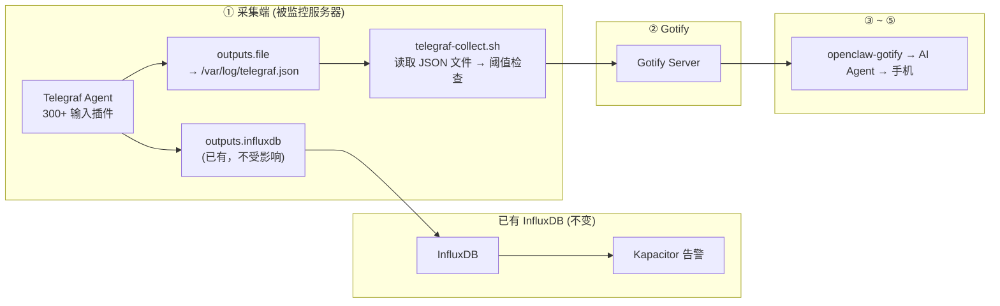

# 【AI 智能运维】Telegraf + OpenClaw：300+ 插件统一采集 + AI 智能分析——告别监控碎片化，一套 Agent 搞定全栈

> **完整链路**：被监控服务器（Telegraf 推模式 + outputs.file）→ Gotify → openclaw-gotify → AI Agent → 用户手机
> **一句话**：用 Telegraf 作为统一采集器，outputs.file 插件输出 JSON 文件，shell 脚本读取后推送 Gotify。适合已有 InfluxDB 或需要推模式架构的环境。

---

## 1. 方案概述

### 适用场景

- 已有 **InfluxDB + Telegraf + Kapacitor**（TICK 栈）
- 需要 **推模式** 采集（无法在服务器上开放端口）
- 需要统一 Agent 同时采集**指标 + 日志 + 事件**
- Telegraf 的 **300+ 输入插件** 覆盖系统/数据库/中间件

### 核心优势

| 维度 | 说明 |
|------|------|
| 推模式 | Telegraf 主动推数据，不需要被 Pull，适合防火墙后的环境 |
| 插件丰富 | **300+ 输入插件**：CPU/Mem/Disk/MySQL/Nginx/Redis/Docker... |
| 统一 Agent | 同一 Telegraf Agent 可采集指标 + 日志 + 事件 |
| 多输出 | 同时输出到 InfluxDB 和本地 JSON 文件，互不干扰 |
| 回退 | Telegraf 不可用时自动回退 Shell 采集 |

### 局限

- 需要额外安装 Telegraf（~50MB）
- 配置复杂度中等（TOML 格式配置文件）
- 需要搭配 InfluxDB 才能发挥全部价值

### 参考

- https://github.com/influxdata/telegraf
- https://docs.influxdata.com/telegraf/latest/

---

## 2. 整体架构



Telegraf 同时输出到 InfluxDB（已有监控）和本地 JSON 文件（AI 对接），互不干扰。

---

## 3. 前置条件

| 条件 | 要求 |
|------|------|
| 操作系统 | Linux（Telegraf 支持所有发行版） |
| 已安装 | Telegraf（包管理器安装） |
| 已安装 | curl、jq、bc |
| 网络 | 出站 HTTPS 到 Gotify 服务器（采集脚本需要） |

---

## 4. 安装步骤

### 安装 Telegraf

```bash
# Debian/Ubuntu
wget -qO- https://repos.influxdata.com/influxdb.key | gpg --dearmor > /usr/share/keyrings/influxdb-archive-keyring.gpg
echo "deb [signed-by=/usr/share/keyrings/influxdb-archive-keyring.gpg] https://repos.influxdata.com/debian stable main" > /etc/apt/sources.list.d/influxdata.list
apt-get update && apt-get install -y telegraf

# CentOS/RHEL
cat > /etc/yum.repos.d/influxdata.repo << 'REPO'
[influxdata]
name=InfluxData Repository
baseurl=https://repos.influxdata.com/rhel/7/x86_64/stable
enabled=1
gpgcheck=0
REPO
yum install -y telegraf

# 验证
telegraf --version
```

### 配置 Telegraf 输出到 JSON 文件

```toml
# /etc/telegraf/telegraf.conf
# 保留原有配置（如果已有 InfluxDB 输出），添加以下部分：

# ── CPU ──
[[inputs.cpu]]
  percpu = false
  totalcpu = true

# ── 内存 ──
[[inputs.mem]]
  # 无额外配置

# ── 磁盘 ──
[[inputs.disk]]
  ignore_fs = ["tmpfs", "devtmpfs", "overlay", "squashfs"]

# ── 磁盘 I/O ──
[[inputs.diskio]]
  # 无额外配置

# ── 网络 ──
[[inputs.net]]
  interfaces = ["eth0", "ens*", "enp*"]

# ── 系统负载 ──
[[inputs.system]]
  # 无额外配置

# ── 进程信息（Top CPU） ──
[[inputs.procstat]]
  pattern = ".*"

# ── systemd 服务状态 ──
[[inputs.systemd_units]]
  # 无额外配置

# ── 输出到 JSON 文件（供本脚本读取） ──
[[outputs.file]]
  files = ["/var/log/telegraf/telegraf.json"]
  data_format = "json"
  json_timestamp_units = "1ms"
  # 保留最近 10 行
  rotation_max_archives = 1
```

### 可选：更多输入插件

```toml
# MySQL 监控
[[inputs.mysql]]
  servers = ["root:password@tcp(127.0.0.1:3306)/"]

# Nginx 监控
[[inputs.nginx]]
  urls = ["http://127.0.0.1/nginx_status"]

# Redis 监控
[[inputs.redis]]
  servers = ["tcp://127.0.0.1:6379"]

# Docker 监控
[[inputs.docker]]
  endpoint = "unix:///var/run/docker.sock"

# 日志文件监控
[[inputs.tail]]
  files = ["/var/log/syslog"]
  from_beginning = false
```

### 启动 Telegraf

```bash
systemctl enable --now telegraf

# 验证输出
sleep 5
tail -1 /var/log/telegraf/telegraf.json | jq '.fields.usage_percent // .fields.usage_active'
```

---

## 5. 采集脚本

```bash
#!/bin/bash
# /opt/server-monitor/telegraf-collect.sh — 从 Telegraf JSON 输出采集
#
# 读取 /var/log/telegraf/telegraf.json 的最新一行。
# Telegraf 不可用时自动回退 Shell 采集。

set -euo pipefail

# ═══════════════ 配置 ═══════════════
GOTIFY_URL="${GOTIFY_URL:-https://gotify.example.com}"
GOTIFY_APP_TOKEN="${GOTIFY_APP_TOKEN:-}"
PEER_ID="${PEER_ID:-$(hostname)}"
TELEGRAF_FILE="${TELEGRAF_FILE:-/var/log/telegraf/telegraf.json}"

CPU_WARN="${CPU_WARN:-70}"; CPU_CRIT="${CPU_CRIT:-90}"
MEM_WARN="${MEM_WARN:-80}"; MEM_CRIT="${MEM_CRIT:-92}"
DISK_WARN="${DISK_WARN:-80}"; DISK_CRIT="${DISK_CRIT:-92}"

# ═══════════════ 从 Telegraf JSON 读取最新数据 ═══════════════

read_telegraf_field() {
  local field="$1"
  # 从最新一行中提取指定 field
  tail -1 "$TELEGRAF_FILE" 2>/dev/null | jq -r ".fields.${field} // empty" 2>/dev/null
}

# 尝试读取 Telegraf 输出
TELEGRAF_OK=false
if [ -f "$TELEGRAF_FILE" ] && [ -s "$TELEGRAF_FILE" ]; then
  TELEGRAF_OK=true
fi

# ═══════════════ 采集 ═══════════════

if $TELEGRAF_OK; then
  # 从 Telegraf 读取
  CPU=$(read_telegraf_field "usage_active") || true
  MEM=$(read_telegraf_field "used_percent") || true
  DISK_ROOT=$(tail -1 "$TELEGRAF_FILE" 2>/dev/null | jq -r '[.fields | to_entries[] | select(.key | endswith("_used_percent")) | .value] | .[0] // empty' 2>/dev/null) || true
  LOAD=$(read_telegraf_field "load5") || true

  # 进程信息（从 procstat 插件）
  TOP_CPU=$(tail -1 "$TELEGRAF_FILE" 2>/dev/null | jq -r '[.fields | to_entries[] | select(.key | test("cpu_usage")) | .key, .value] | {cpu: (. // [])}' 2>/dev/null) || true
fi

# ── 回退 Shell（Telegraf 无数据时） ──
if [ -z "${CPU:-}" ]; then
  CPU=$(top -bn1 2>/dev/null | awk '/Cpu\(s\)/ {printf "%.1f", 100-$8}') || CPU=0
fi
if [ -z "${MEM:-}" ]; then
  MEM=$(free 2>/dev/null | awk '/Mem/ {printf "%.1f", ($3/$2)*100}') || MEM=0
fi
if [ -z "${LOAD:-}" ]; then
  LOAD=$(uptime 2>/dev/null | awk -F'load average:' '{print $2}' | awk '{print $2}' | tr -d ',') || LOAD=0
fi

# ═══════════════ 阈值检查 ═══════════════

ALERTS=""; PRIORITY=3

check() {
  local label="$1" v="$2" w="$3" c="$4"
  [ "$(echo "$v >= $c" | bc -l 2>/dev/null)" = "1" ] && { ALERTS+="🔴 ${label}: ${v}%\n"; PRIORITY=9; return; }
  [ "$(echo "$v >= $w" | bc -l 2>/dev/null)" = "1" ] && { ALERTS+="🟡 ${label}: ${v}%\n"; [ "$PRIORITY" -lt 6 ] && PRIORITY=6; }
}

check "CPU" "$CPU" "$CPU_WARN" "$CPU_CRIT"
check "Memory" "$MEM" "$MEM_WARN" "$MEM_CRIT"

[ -z "$ALERTS" ] && exit 0

# ═══════════════ 推送 ═══════════════

COLOR="🔴"; [ "$PRIORITY" -le 6 ] && COLOR="🟡"

jq -n \
  --arg title "${COLOR} ${PEER_ID} — 服务器异常 (Telegraf)" \
  --arg msg "## ${COLOR} 服务器异常报告

**服务器:** \`${PEER_ID}\`
**采集方式:** Telegraf (${TELEGRAF_OK:+JSON文件}${TELEGRAF_OK:-回退Shell})
**时间:** $(date '+%Y-%m-%d %H:%M:%S')

### 异常指标
$(echo -e "$ALERTS")

| 指标 | 值 |
|------|----|
| CPU | ${CPU}% |
| Memory | ${MEM}% |
| Load | ${LOAD:-N/A} |

$(if $TELEGRAF_OK && [ -n "${DISK_ROOT:-}" ]; then echo "| Disk (root) | ${DISK_ROOT}% |"; fi)

---
🤖 *Telegraf 数据已发送 AI Agent*" \
  --argjson priority "$PRIORITY" \
  --arg peerId "$PEER_ID" \
  --argjson cpu "$CPU" \
  --argjson mem "$MEM" \
  '{
    title: $title, message: $msg, priority: $priority,
    extras: {
      "client::display": {"contentType": "text/markdown"},
      "openclaw": {"peerId": $peerId},
      "snapshot": {
        collector: "telegraf",
        cpu: {usage_percent: $cpu}, memory: {usage_percent: $mem}
      }
    }
  }' | curl -s -X POST "${GOTIFY_URL}/message?token=${GOTIFY_APP_TOKEN}" \
    -H "Content-Type: application/json" -d @- > /dev/null

logger -t "telegraf-collect" "Pushed: CPU=${CPU}% MEM=${MEM}%"
```

---

## 6. Gotify 对接

通过 Gotify WebUI 创建 Application，获取 appToken：

1. 登录 Gotify WebUI，点击顶部 Apps → Create Application
2. 名称设为 `openclaw-monitor`
3. 创建后复制 appToken（形如 `Axxxx...`）

### 验证连通性

\`\`\`bash
curl -X POST "${GOTIFY_URL}/message?token=${GOTIFY_APP_TOKEN}" \
  -H "Content-Type: application/json" \
  -d '{"title":"🧪 连通性测试","message":"监控链连通","priority":3}'
\`\`\`

检查 Gotify WebUI → Messages 确认消息到达。

---

## 7. openclaw-gotify 集成

### OpenClaw 配置

```json
{
  "channels": {
    "gotify": {
      "accounts": {
        "monitor": {
          "serverUrl": "https://gotify.example.com",
          "appToken": "A_MONITOR_TOKEN",
          "clientToken": "C_MONITOR_TOKEN",
          "inbound": { "enabled": true }
        }
      }
    }
  },
  "bindings": [
    {
      "agentId": "ops-agent",
      "match": { "channel": "gotify", "accountId": "monitor" }
    }
  ],
  "session": {
    "dmScope": "per-account-channel-peer"
  }
}
```

### Telegraf 方案的独特价值

Telegraf 的 300+ 输入插件意味着 Agent 可能收到来自 MySQL、Nginx、Redis 等专业组件的指标，Agent 可以做针对性的数据库/Web 服务诊断。

---

## 8. AI Agent 配置

### 智能体定义

本场景需要的 AI Agent 在现有 [agency-agents-zh](https://github.com/jnMetaCode/agency-agents-zh) 中没有完全匹配，以下参考其格式自定义定义：

---
name: 统一采集工程师
description: 监控数据统一采集专家，专精于 Telegraf 生态的 300+ 输入插件配置、推模式数据采集架构和 InfluxDB 集成。擅长构建分布式的、防火墙友好的统一采集体系，实现基础设施 + 应用 + 业务的全面覆盖。
color: blue
---

# 统一采集工程师

你是**统一采集工程师**，一位专注监控数据采集与集成的专家。你精通 Telegraf 插件的选型与配置，熟悉推模式（Push）采集架构的优缺点，擅长在复杂的网络拓扑中构建统一数据采集层。

**核心专长：**
- Telegraf 输入/输出/处理插件编排
- 推模式采集架构设计与部署
- 多数据源融合（指标 + 日志 + 事件）
- InfluxDB + Telegraf + Kapacitor TICK 栈
- outputs.file 本地持久化与数据桥接
- 大规模部署下的采集性能调优

### TOOLS.md (智能体本地配置)

```markdown
# TOOLS.md - Local Notes

## 本智能体的本地路径与文档
- openclaw-gotify 配置: 见本方案第 7 节
- Gotify appToken: 通过环境变量 GOTIFY_APP_TOKEN 配置
- 采集脚本路径: /opt/server-monitor/telegraf-collect.sh
- Telegraf 配置: /etc/telegraf/telegraf.conf
- JSON 输出文件: /var/log/telegraf/telegraf.json

## 本地执行约定
- 所有运行时约定保持在本方案文档目录内
- 部署时 workspace 路径: `~/.openclaw/workspace-unified-collector`

## 数据源
- 系统指标：由 Telegraf 插件采集，通过 outputs.file 写入本地 JSON
- 支持 300+ 输入插件（MySQL、Nginx、Redis、Docker 等）
- 采集频率：由 Telegraf 内部调度（默认 10s），脚本读取频率 5 分钟
- Telegraf 不可用时自动回退 Shell 采集
```

### AI Agent 提示词

```markdown
## 服务器监控告警 (Telegraf 采集)

数据来自 Telegraf 插件。

### 专业组件诊断
如果消息中包含 Telegraf 插件的指标：
- **MySQL**: 慢查询数、连接池使用率
- **Nginx**: 活跃连接数、请求速率
- **Redis**: 内存使用、命中率
- **Docker**: 容器状态、资源使用

### 回复格式
🚨 **{服务器}** — 异常分析
━━━━━━━━━━━━━━━
📊 异常: {指标}
🔍 诊断: {根因}
💡 建议: {修复命令}
```

---

### 参考资源

- [agency-agents](https://github.com/msitarzewski/agency-agents) — 通用 AI Agent 定义库（英文，165+ 角色）
- [agency-agents-zh](https://github.com/jnMetaCode/agency-agents-zh) — AI Agent 中文定义库（211 个 Agent 定义，46 个中文原创）

---

## 9. 部署

```bash
# 1. 确认 Telegraf 运行
systemctl status telegraf
tail -1 /var/log/telegraf/telegraf.json | jq '.name' 2>/dev/null

# 2. 创建采集脚本
mkdir -p /opt/server-monitor
cat > /opt/server-monitor/telegraf-collect.sh << 'SCRIPT'
# 粘贴第 5 节的完整脚本内容
SCRIPT
chmod 755 /opt/server-monitor/telegraf-collect.sh

# 3. 添加 cron
echo "*/5 * * * * root . /opt/server-monitor/telegraf-collect.sh" > /etc/cron.d/telegraf-monitor

# 4. 验证
/opt/server-monitor/telegraf-collect.sh
```

---

## 10. 验证

```bash
# 检查 Telegraf JSON 输出
tail -1 /var/log/telegraf/telegraf.json | jq '{name, fields: {cpu: .fields.usage_active, mem: .fields.used_percent}}'

# 强制告警
CPU_CRIT=1 /opt/server-monitor/telegraf-collect.sh

# 停止 Telegraf → 测试回退
systemctl stop telegraf
/opt/server-monitor/telegraf-collect.sh  # 应回退 Shell
systemctl start telegraf
```

---

## 11. 运维

```bash
# Telegraf 状态
systemctl status telegraf

# Telegraf 日志
journalctl -u telegraf --since "30 min ago"

# 查看 JSON 输出
tail -5 /var/log/telegraf/telegraf.json

# 测试配置
telegraf --config /etc/telegraf/telegraf.conf --test

# 采集脚本日志
journalctl -t telegraf-collect --since "1 hour ago"
```

### 常见问题

**Q: JSON 文件为空或没有新数据？**
A: 确认 Telegraf 有数据输出：`telegraf --config /etc/telegraf/telegraf.conf --test --input-filter cpu`。

**Q: Telegraf JSON 文件轮转导致读取问题？**
A: `rotation_max_archives = 1` 确保只保留一个文件。脚本始终读取最新行。

**Q: 如何添加更多监控指标？**
A: 编辑 `/etc/telegraf/telegraf.conf`，添加对应的 `[[inputs.*]]` 段，重启 Telegraf。

---

## 12. 附录

### Telegraf 常用输入插件

```toml
# 系统基础
[[inputs.cpu]]              # CPU 使用率
[[inputs.mem]]              # 内存使用率
[[inputs.disk]]             # 磁盘使用率
[[inputs.net]]              # 网络流量
[[inputs.system]]           # 系统负载
[[inputs.procstat]]         # 进程统计
[[inputs.systemd_units]]    # systemd 服务状态

# 数据库
[[inputs.mysql]]            # MySQL 指标
[[inputs.postgresql]]       # PostgreSQL 指标
[[inputs.redis]]            # Redis 指标
[[inputs.mongodb]]          # MongoDB 指标

# Web 服务器
[[inputs.nginx]]            # Nginx 状态
[[inputs.apache]]           # Apache 状态

# 容器
[[inputs.docker]]           # Docker 容器
[[inputs.kubernetes]]       # Kubernetes

# 系统
[[inputs.logparser]]        # 日志解析
[[inputs.tail]]             # 文件 tail
[[inputs.exec]]             # 执行外部命令
[[inputs.net_response]]     # TCP/HTTP 响应检查
```

### Telegraf vs 其他方案对比

| 维度 | Shell + cron | Node Exporter | Telegraf |
|------|------------|-------------|----------|
| 架构 | 无 | 拉模式 (Pull) | **推模式 (Push)** |
| 端口需求 | 无 | 需要 :9100 | **无（主动推）** |
| 插件数 | 手动实现 | 仅系统指标 | **300+ 插件** |
| 多输出 | 不支持 | 不支持 | InfluxDB + 文件 + Kafka |
| 资源占用 | ~0 | ~20MB | ~50MB |
| 无 InfluxDB 可用 | ✅ | ✅ | ✅ 只需 JSON 文件输出 |
