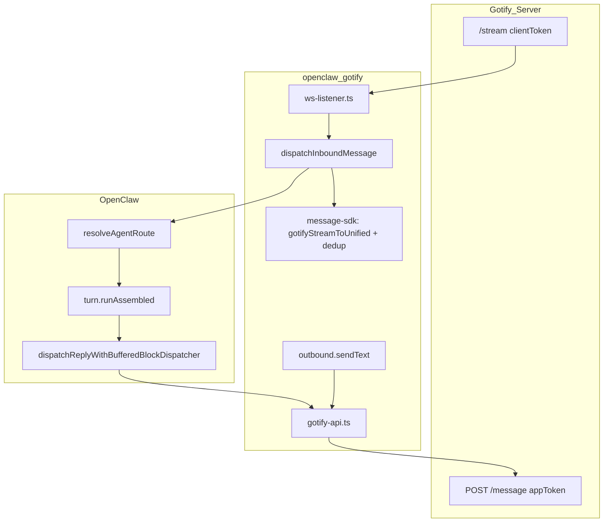

# OpenClaw Gotify 插件架构

> 包名：`@partme.ai/openclaw-gotify`  
> 源码：`extensions/gotify`  
> 渠道 ID：`gotify`  
> 验证（2026-05-22）：`pnpm typecheck` 通过，`pnpm test` 97/97 通过

## 1. 定位

将自托管 [Gotify](https://gotify.net/) 接入 OpenClaw Agent：

| 方向 | 协议 | Token |
|------|------|-------|
| 入站 | WebSocket `GET /stream?token=...` | **Client Token**（`C...`） |
| 出站 | REST `POST /message` | **Application Token**（`A...`） |

能力：仅 `direct` 文本（`capabilities.media: false`），无 topic/queue 传输层。

与 MQ 插件差异：**未**使用 `@partme.ai/openclaw-message-sdk/bridge` 的 `dispatchInbound`；入站走 WeCom 式 `finalizeInboundContext` + `turn.runAssembled`，以保证 Control UI transcript。

## 2. 模块与入口

```
extensions/gotify/
├── index.ts              → re-export src/index.js
├── setup-entry.ts        → re-export src/setup-entry.js
├── src/
│   ├── index.ts          defineChannelPluginEntry + HTTP /gotify/*
│   ├── setup-entry.ts    defineSetupPluginEntry（仅元数据）
│   ├── channel.ts        ChannelPlugin + dispatchInboundMessage
│   ├── ws-listener.ts    WebSocket /stream
│   ├── gotify-api.ts     REST 客户端
│   ├── outbound.ts       通用出站 adapter
│   ├── config.ts         账号解析与默认值
│   ├── inbound-access.ts DM 策略（ingress-runtime）
│   ├── peer-resolver.ts  peerId / 会话标签
│   ├── message-mapper.ts 出站 extras、回环过滤、遗留 mapGotifyToInbound
│   └── ...
└── scripts/              E2E / standard-test / ui-gate
```

## 3. 数据流



## 4. WebSocket 入站（`ws-listener.ts`）

- URL：`{ws}://{host}/stream?token={clientToken}`（`http` → `ws`）
- Zod 校验 `GotifyStreamEnvelope`（id、appid、message、extras 等）
- 首次连接超时 15s；失败/断线后指数退避重连（默认 2s 起，上限 30s，最多 10 次）
- `gateway.startAccount` 中 `onMessage` → `dispatchInboundMessage`

## 5. 入站派发（`channel.ts` → `dispatchInboundMessage`）

按执行顺序：

1. **回环过滤**：`extras.openclaw.outbound === true`；或 `message.appid === ownAppId`（出站后缓存的本应用 ID）
2. **幂等**：`createIdempotencyCache`（60s），key = `${accountId}:${message.id}`；**成功派发后**才 `remember`
3. **归一化**：`gotifyStreamToUnified`（[`message-sdk/src/adapters/gotify.ts`](../../../extensions/message-sdk/src/adapters/gotify.ts)）
4. **准入**：`checkGotifyInboundAccess`（`dmPolicy` / `allowFrom` / pairing）
5. **路由**：`resolveAgentRoute({ channel: 'gotify', peer: { kind: 'direct', id: peerId } })`
6. **上下文**：`finalizeInboundContext`（Body、SessionKey、SenderName、`gotifyMetadata`、`unifiedMessageId`）
7. **派发**：优先 `turn.runAssembled` + `recordInboundSession` + `dispatchReplyWithBufferedBlockDispatcher`
8. **回复**：`deliverReply` → `sendGotifyMessageWithDeliveryRetry` + `withOpenClawOutboundExtras()` → 删回复消息
9. **清理**：若 `deleteAfterConsume !== false`，删除入站 Gotify 消息

`peerId` 由 [`peer-resolver.ts`](../../../extensions/gotify/src/peer-resolver.ts) 从 `appid` 等字段解析。

## 6. REST 出站（`gotify-api.ts` + `outbound.ts`）

**入站回合内**：`deliverReply` 使用 `appToken` POST，带 openclaw 出站标记 extras。

**通用出站**（`outbound.ts`）：

- `deliveryMode: 'direct'`
- `sendText` → 按 `accountId` / `to: gotify:<id>` / 默认账号选账号 → `mapOutboundToGotify` → `sendGotifyMessage`

**HTTP 特性**：

- 每账号 `withAccountLock` 串行
- `fetchWithRetry`：默认 8s 超时，5xx 重试 1 次
- Client Token：管理 API（列消息、删消息、应用/客户端 CRUD）
- `healthCheck` / `runGotifyDoctor` / `probeGotifyAccount`

## 7. 配置（`channels.gotify`）

| 字段 | 说明 |
|------|------|
| `serverUrl` | Gotify 根 URL |
| `appToken` | 出站必需；`configured = serverUrl && appToken` |
| `clientToken` | 入站 WS + 管理 API |
| `accounts.<id>` | 多账号合并顶层 |
| `dmPolicy` | open / allowlist / pairing / disabled |
| `inbound.deleteAfterConsume` | 默认 true，派发后删 Gotify 消息 |

**入站 enabled 注意**：运行时 [`config.ts`](../../../extensions/gotify/src/config.ts) 为 `inbound.enabled ?? Boolean(clientToken)`；Zod [`channel-config.ts`](../../../extensions/gotify/src/channel-config.ts) 默认 `false`。见 [Known-Gaps](./OpenClaw-Gotify-Known-Gaps.md)。

## 8. message-sdk 集成范围

| API | 用途 |
|-----|------|
| `gotifyStreamToUnified` | 入站 → `UnifiedMessage` |
| `createIdempotencyCache` | WS 入站去重 |

**未使用**（MQ 插件已用）：`parseTransportPayload`、JSON 信封、`dispatchInbound`（`/bridge`）、`serializeForTransport`。

## 9. 与生态关系

- **MQ 插件**（mqtt、rabbitmq 等）：传输层 + `message-sdk/bridge`
- **WeCom**：同类 transcript 路径（`runAssembled`），协议留在插件内
- **`@partme.ai/openclaw-bridge`**（`extensions/bridge`）：跨 Gateway MQ 镜像，与 Gotify 包无关

## 10. 运维接口

| HTTP | 说明 |
|------|------|
| `GET /gotify/status` | 账号快照 |
| `GET /gotify/health` | 连通性 |
| `GET /gotify/doctor` | 配置诊断 |

CLI：`onboarding.ts`、`config-wizard.ts`、`setup.ts`（bootstrap / doctor）。

## 11. 测试

```bash
cd extensions/gotify
pnpm typecheck   # 通过
pnpm test        # 9 files, 97 tests 通过
pnpm test:standard   # 需真实 Gotify
pnpm test:ui-gate    # Control UI transcript 门禁
```

相关场景文档：`doc/infrastructure/gotify/`（Telegraf、CI/CD 等）。
