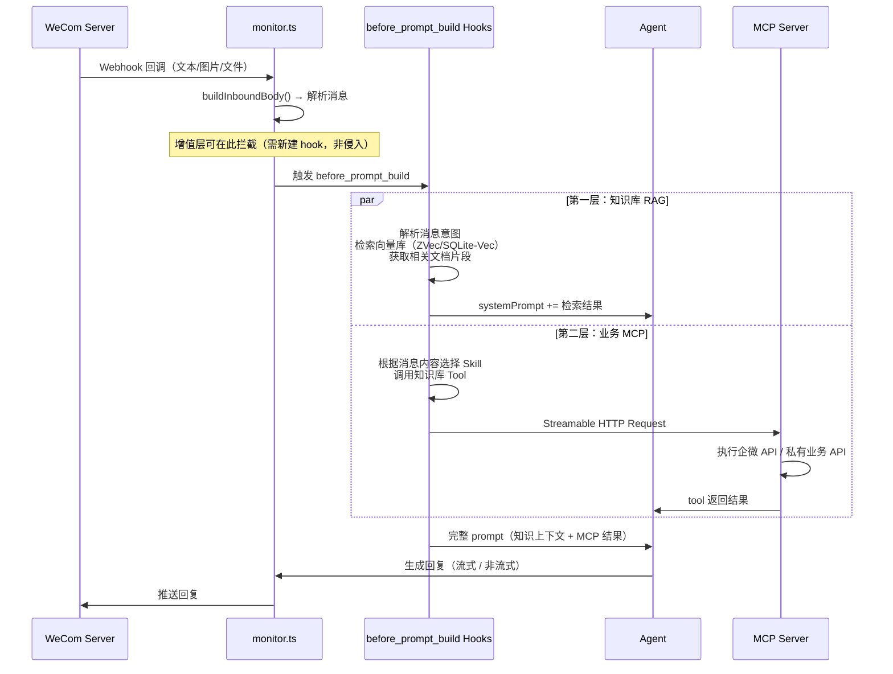
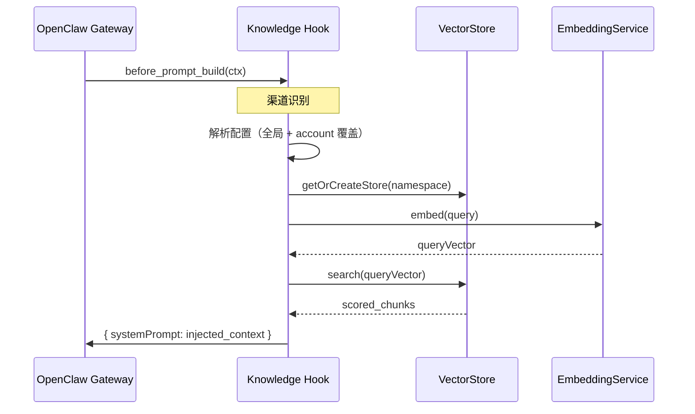
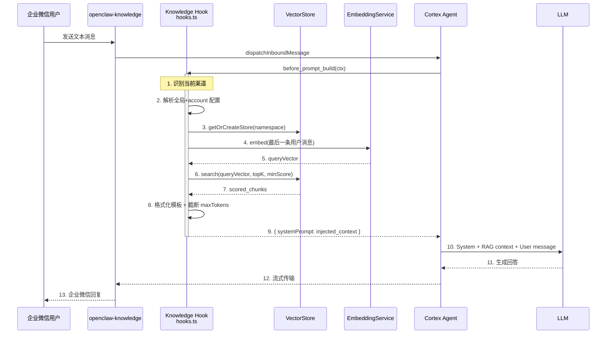
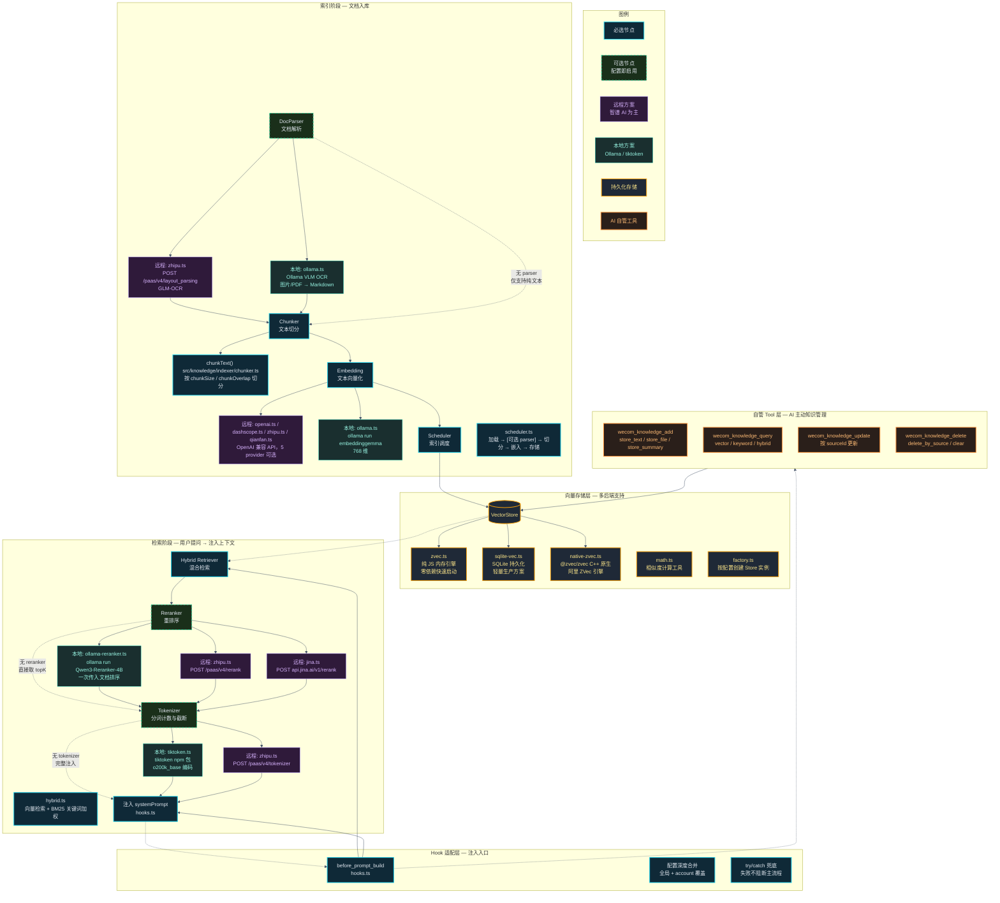
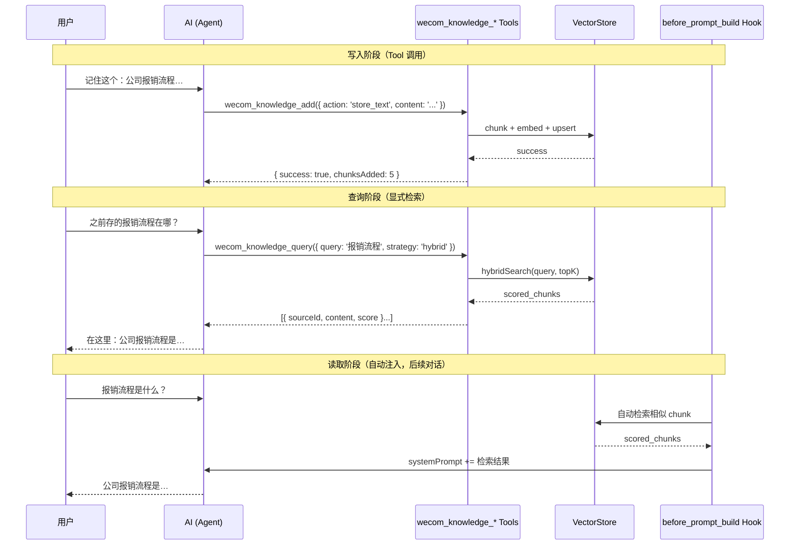

# OpenClaw Knowledge RAG 引擎 — 架构设计文档
>
> **OpenClaw Knowledge RAG = 面向 OpenClaw 渠道插件的知识库增强引擎。**
>
> 它基于 OpenClaw 的 `before_prompt_build` hook 机制，为企微、飞书、钉钉、QQ 机器人、微信等多渠道 AI 对话注入向量检索增强生成（RAG）上下文，实现**文件自动入库、语义检索、多租户隔离**的一站式知识管理。

[](#)
[](#)
[](#)

---

**文档约定**：本文以 `@partme.ai/openclaw-knowledge` 为代码基线，定义知识库 RAG 引擎的架构设计、模块划分、配置模型与实现落点。「插件」即指 `openclaw-knowledge` 知识库 RAG 引擎；默认运行环境为 Node.js / TypeScript，插件宿主为 OpenClaw Gateway。

**实现状态标签**：
- `[已实现]`：仓库已完成的模块
- `[目标态]`：本文定义的目标能力

---

## 目录

### Part I：战略定位与核心价值
- 1. 为什么需要知识库 RAG
- 2. 在 OpenClaw 插件生态中的位置
- 3. 三条硬约束与总体架构
- 4. 两层增值能力架构总览

### Part II：架构总览——Hook 注入模型
- 5. OpenClaw 的 `before_prompt_build` Hook 回顾
- 6. RAG 注入的四层职责
- 7. 核心工作流：索引、检索、注入
  - 7.1 通路 A：用户上传文件 → 对话级索引
  - 7.2 检索工作流
  - 7.3 命名空间隔离与数据来源隔离
  - 7.4 通路 B：企微文档拉取 → 企业级知识库

### Part III：核心技术实现
- 8. 模块划分与目录结构
- 9. Embedding 服务层
- 10. Reranker 重排序服务层
- 11. Tokenizer 分词计数服务层
- 12. DocParser 文档解析服务层
- 13. 向量存储层与多后端支持
- 14. 文本切分（Chunker）与文档索引
- 15. 混合检索（Hybrid Retriever）
- 16. 配置模型与深度合并
- 17. 生命周期、缓存与多租户隔离

### Part IV：双模式侵入点
- 18. Agent 模式：文件入库索引
- 19. Bot 模式：消息触发索引
- 20. `before_prompt_build` Hook 配置读取

### Part V：部署与配置
- 21. 最小配置
- 22. 多租户配置
- 23. 运维诊断

### Part VI：附录
- 附录 A：术语表
- 附录 B：配置参考
- 附录 C：支持的向量数据库

---

# Part I：战略定位与核心价值

## 1. 为什么需要知识库 RAG
sss
企业 AI 机器人在实际场景中频繁遇到以下痛点：

| 痛点 | 场景 | 解决方案 |
|------|------|----------|
| **知识孤岛** | 机器人回答客户问题时，无法引用公司内部文档 | RAG 将文档嵌入向量库，对话时检索注入 |
| **文件浪费** | 用户上传的文件被丢弃，无法沉淀为知识资产 | 自动索引上传的文件到知识库 |
| **多租户混淆** | 多个企业使用同一个实例，知识互相污染 | 命名空间隔离，按 `accountId:mode` 分离 |
| **响应机械** | 机器人只能靠预训练数据回答，不能引用最新文档 | RAG 实时检索，回答可溯源 |

`@partme.ai/openclaw-knowledge` 知识库 RAG 引擎解决了这些问题，为各渠道插件提供了**零配置启动、轻量内置、可选外部扩展**的知识检索方案。

### 1.1 三大非妥协目标

| 目标 | 强约束 | 体现 |
|------|--------|------|
| **零依赖起步** | 不依赖外部服务即可运行 | 内置 ZVec（纯 JS 向量引擎）、OpenAI 兼容 Embedding API |
| **多租户安全** | 不同客户/场景的知识必须严格隔离 | 命名空间 `accountId:mode`，配置按 account 深度合并 |
| **最小侵入** | 不破坏原有 Bot/Agent 的主流程 | 4 个侵入点总计 ~125 行，try/catch 兜底 |

### 1.2 非目标

- 不替代专业向量数据库（Pinecone/Weaviate 等）的高性能场景；
- 不通用的文档格式支持（如 Office/PDF 需要额外转换层）；
- 不在插件内实现知识库管理 UI（由 OpenClaw 管理面板提供）。

## 2. 在 OpenClaw 插件生态中的位置

`openclaw-knowledge` 本身是一个 **独立 RAG 引擎插件**，通过 `before_prompt_build` hook 与路由无关的方式注入到各个渠道插件的消息流中。

```mermaid
graph TB
    subgraph OC[OpenClaw Gateway]
        direction TB
        CTX[Cortex<br/>Agent 调度]
        SES[Session Bus<br/>会话管理]
    end

    subgraph CP[Channel Plugins]
        direction TB
        WX[wecom 企业微信]
        GF[gotify 消息推送]
        MT[matrix 即时通讯]
        DP[...]
    end

    subgraph WXINNER[openclaw-knowledge]
        direction LR
        BOT[Bot 流式对话]
        AGT[Agent 自建应用]
        KR[Knowledge RAG<br/>◄ 本文聚焦]
    end

    CTX --> WX
    CTX --> GF
    CTX --> MT
    CTX --> DP
    WX --> BOT
    WX --> AGT
    WX --> KR

    style KR fill:#1a3a2a,stroke:#34d399,stroke-width:2px
    style OC fill:#0f2937,stroke:#22d3ee,stroke-width:1px
    style CP fill:#111827,stroke:#475569,stroke-width:1px
```



## 3. 多渠道集成架构

`openclaw-knowledge` 设计为独立于渠道插件的 RAG 引擎，各渠道通过 ~10 行胶水代码集成。集成方式完全一致，仅 [配置路径](config-path-diff) 和 [可用的文档获取 skill](skill-diff) 不同。

| 渠道 | 插件包名 | 配置路径 | 集成代码 | 特有文档 Skill |
|------|---------|---------|---------|--------------|
| **企微** | `@mocrane/wecom` | `channels.wecom.knowledge` | ~10 行 `onRegister` | `wecom-doc` |
| **飞书** | `@partme.ai/openclaw-lark` | `channels.lark.knowledge` | ~10 行 | `feishu-fetch-doc` |
| **钉钉** | `@partme.ai/openclaw-dingtalk` | `channels.dingtalk.knowledge` | ~10 行 | 待实现 |
| **QQ 机器人** | `@partme.ai/openclaw-qqbot` | `channels.qqbot.knowledge` | ~10 行 | 待实现 |
| **微信** | `@partme.ai/openclaw-weixin` | `channels.weixin.knowledge` | ~10 行 | 待实现 |

> **集成代码示例（通用）**：
> ```typescript
> import { registerKnowledgeHooks, createKnowledgeAddTool,
>   createKnowledgeQueryTool, createKnowledgeUpdateTool,
>   createKnowledgeDeleteTool } from '@partme.ai/openclaw-knowledge';
> 
> export function onRegister(api: PluginApi) {
>   registerKnowledgeHooks(api, 'channels.{channel}.knowledge');
>   api.registerTool(createKnowledgeAddTool);
>   api.registerTool(createKnowledgeQueryTool);
>   api.registerTool(createKnowledgeUpdateTool);
>   api.registerTool(createKnowledgeDeleteTool);
> }
> ```

> **配置路径差异说明**：`registerKnowledgeHooks` 的第二个参数指定配置路径，各渠道插件将配置放在各自的 channel 路径下。例如 wecom 的配置在 `channels.wecom.knowledge.*`，lark 在 `channels.lark.knowledge.*`。`openclaw-knowledge` 不关心具体的 channel 名称，只按传入的路径读取配置。

## 4. 三条硬约束与总体架构

### 4.1 硬约束 A：OpenClaw Hook 契约不可违反

| 契约 | 要求 | 落点 |
|------|------|------|
| `before_prompt_build` 事件 | 只能返回 `systemPrompt` 或 `userPrompt`，不可修改原始请求 | `handleBeforePromptBuild` |
| Hook 的 `ctx` 类型 | `PluginHookAgentContext`，无 `config` 字段 | 配置读取绕过 ctx，使用插件 API |
| 事件执行顺序 | 多个 hook 按注册顺序执行，不可阻塞主流程 | try/catch 包裹所有逻辑，失败静默返回 `undefined` |

### 3.2 硬约束 B：存储后端必须可切换

| 后端类型 | 场景 | 实现状态 |
|----------|------|----------|
| **ZVec**（纯 JS 内存引擎） | 零依赖快速启动 | `[已实现]` |
| **SQLite-Vec**（本地持久化） | 轻量生产方案 | `[已实现]` |
| Redis / Pinecone / Chroma / Weaviate / Qdrant / Milvus / pgvector | 高性能/分布式 | `[目标态]` |

### 3.3 硬约束 C：双模式下行为一致

| 模式 | 触发索引 | 触发检索 | 命名空间 |
|------|----------|----------|----------|
| **Bot**（智能体） | 用户上传文件 → 自动索引 | 每次对话 → `before_prompt_build` | `accountId:bot` |
| **Agent**（自建应用） | 用户上传文件 → 自动索引 | 同上 | `accountId:agent` |

## 4. 两层增值能力架构总览

> 本文聚焦的"知识库 RAG"是增值能力的第一层。与之并行的是第二层——**业务 MCP** ——两者通过 OpenClaw 的 `before_prompt_build` hook 机制共同注入。

### 4.1 两层能力模型

`@partme.ai/openclaw-knowledge` 的商业增值基于"让 AI 有脑子"和"让 AI 能干活"两条主线展开：

| 层级 | 能力 | 核心组件 | 注入方式 | 解决什么问题 |
|------|------|----------|----------|-------------|
| **第一层** | 知识库 RAG | `src/knowledge/`（Chunker + Embedding + Vector Store + Retriever） | `before_prompt_build` hook → `systemPrompt` | 让 AI 回复时能查企业文档、查群聊历史，不凭空编造 |
| **第二层** | 业务 MCP | `src/mcp/`（Streamable HTTP Transport + Tool Registry） + `skills/`（11个企微技能） | 通过 Agent Tool 注册 | 让 AI 能操作企微数据（文档/通讯录/会议/日程/待办），未来接入企业私有业务系统 |

### 4.2 在消息流中的位置

两层能力在 Bot + Agent 双模式消息流中的注入点不同：



### 4.3 与本文的关系

本文的**核心主题是第一层（知识库 RAG）的实现细节**。第二层（业务 MCP）仅在架构总览中介绍其存在和与 RAG 的协同关系，详细的 MCP 架构设计、Skill 注册机制、私有业务系统接入方案，请参考：

|- [OpenClaw-Knowledge-RAG-Strategy_CN.md](./OpenClaw-Knowledge-RAG-Strategy_CN.md) — 商业增值策略与三层能力模型，含扩展点说明和版本发布策略

### 4.4 纯加法原则

两层增值能力均遵循**纯加法原则**：
- 不修改 `monitor.ts`（2993行核心消息流）的已有逻辑
- 不修改 `channel.ts` 的 ChannelPlugin 生命周期
- 第一层通过 `before_prompt_build` hook 注入
- 第二层通过 `src/mcp/` 扩展新 MCP 品类 + `skills/` 新增技能描述
- 配置使用深度合并（全局配置兜底，account 级覆盖）

---

# Part II：架构总览——Hook 注入模型

## 5. OpenClaw 的 `before_prompt_build` Hook 回顾

OpenClaw 在构建 Agent 请求（拼接历史、系统提示、工具列表等）之前，按顺序触发所有已注册的 `before_prompt_build` 事件。每个处理器可以返回 `{ systemPrompt: string }` 或 `{ userPrompt: string }`，OpenClaw 会将这些内容叠加到最终的请求中。



## 6. RAG 注入的四层职责

| 层次 | 职责 | 实现组件 |
|------|------|----------|
| **Hook 适配层** | 监听 `before_prompt_build`，解析配置，执行检索注入 | `src/knowledge/hooks.ts` |
| **索引层** | 文档读取 → 切分 → 嵌入 → 存储 | `src/knowledge/indexer/` |
| **检索层** | 向量检索 + 关键词增强混合检索 | `src/knowledge/retriever/` |
| **基础设施层** | Embedding 调用、向量存储、配置合并 | `src/knowledge/embedding/`、`src/knowledge/store/` |

## 7. 核心工作流：索引、检索、注入

### 7.1 索引工作流（通路 A：用户上传文件 → 对话级索引）

> **数据来源：通路 A** — 用户发给 Bot/Agent 的文件，索引到该用户 `accountId:mode` 的**私有命名空间**，仅作为当前对话上下文使用，**不沉淀为企业业务知识**。

```mermaid
flowchart TD
    U[用户发送文件到企微] --> M[企微回调 → Bot/Agent 处理<br/>monitor.ts / agent/handler.ts]
    M --> D[下载文件到本地<br/>media.ts decryptMedia]
    D --> Q{是否可索引<br/>文本文件?}
    Q -->|否| S[跳过索引<br/>继续正常对话]
    Q -->|是<br/>.md .txt .csv .json| C[chunkText 切分<br/>按 chunkSize/chunkOverlap]
    C --> E[embedding.embedBatch<br/>批量向量化]
    E --> V[写入 VectorStore<br/>命名空间 accountId:mode<br/>◄ 仅影响当前用户私有空间]
    V --> L[记录日志<br/>[KNOWLEDGE] 通路A 索引成功]
    L --> N[继续原有对话流程]
    S --> N

    style V fill:#1a3a2a,stroke:#34d399,stroke-width:2px
    style C fill:#0f2937,stroke:#22d3ee,stroke-width:1px
    style E fill:#0f2937,stroke:#22d3ee,stroke-width:1px
```

### 7.2 检索工作流（用户提问 → 注入上下文）



### 7.3 命名空间隔离与数据来源隔离

每个命名空间 `{accountId}:{mode}` 拥有独立的 VectorStore 实例，知识数据完全隔离。

| accountId | mode | 命名空间 | 隔离说明 |
|-----------|------|----------|----------|
| `default` | `bot` | `default:bot` | 默认的 Bot 模式知识库 |
| `default` | `agent` | `default:agent` | 默认的 Agent 模式知识库 |
| `acme_corp` | `bot` | `acme_corp:bot` | acme_corp 租户的 Bot 知识库 |
| `acme_corp` | `agent` | `acme_corp:agent` | acme_corp 租户的 Agent 知识库 |

**两条数据通路写入不同 namespace**：

| 通路 | 数据源 | 写入命名空间模式 | 说明 |
|------|--------|-------------------|------|
| **通路 A** | 用户上传文件（Bot/Agent 消息中的附件） | `{accountId}:bot` 或 `{accountId}:agent` | 对话级私有空间，用户只能影响自己的 namespace |
| **通路 B** | 企微文档 API 拉取（管理员指定文档库） | `{accountId}:enterprise`（建议） | 企业级全局知识空间，需要管理员显式授权 |
| **通路 C** | AI 主动存储（knowledge_* Tool 系列） | `{accountId}:bot` 或 `{accountId}:agent`（对话级） | 对话中由 AI 根据用户指令调用，owner 可写全局 namespace |

> **设计约束**：通路 A 和通路 B 写入**不同的 namespace**，数据不混淆。通路 A 不需要额外 API 权限；通路 B 需要企微文档 `doc/get_doc_content` 等 MCP API 权限，且配置中必须显式指定文档库的 `folderId`/`docId`。通路 C 由 AI 在对话中主动触发，权限通过 `senderIsOwner` 判断。

### 7.4 索引工作流（通路 B：企微文档拉取 → 企业级知识库）

> **数据来源：通路 B** — 由管理员指定 `accountId` 的授权账户，通过企微文档 API 主动拉取，索引到该 `accountId` 的**企业级全局知识空间**，对租户内所有用户可见。

**前提**：
- 配置中必须指定企微文档库 ID（`folderId`/`docId`）
- 需要额外的企微 API 权限（`doc/get_doc_content` 等 MCP Skill）
- 需要管理员对目标 `accountId` 进行授权

**流程**：

```mermaid
flowchart TD
    A[管理员配置<br/>folderId/docId 列表] --> B[定时调度器触发<br/>scheduler.ts]
    B --> C[调用企微 MCP API<br/>doc/get_doc_content]
    C --> D{API 调用成功?}
    D -->|否| E[记录错误<br/>跳过本轮同步]
    D -->|是| F[获取文档内容<br/>Markdown/HTML]
    F --> G[chunkText 切分<br/>按 chunkSize/chunkOverlap]
    G --> H[embedding.embedBatch<br/>批量向量化]
    H --> I[写入 VectorStore<br/>命名空间 accountId:enterprise<br/>◄ 全局知识空间，非对话级]
    I --> J[记录日志<br/>[KNOWLEDGE] 通路B 同步成功]
    J --> K[更新同步状态<br/>记录 lastSyncTime / etag]

    subgraph 隔离说明
        L[通路 B 写入 <b>accountId:enterprise</b><br/>通路 A 写入 <b>accountId:bot/agent</b><br/>两路数据完全隔离]
    end

    style I fill:#1a3a2a,stroke:#34d399,stroke-width:2px
    style C fill:#0f2937,stroke:#f59e0b,stroke-width:2px
    style A fill:#0f2937,stroke:#f59e0b,stroke-width:1px
```

**关键区别（vs 通路 A）**：

| 维度 | 通路 A（用户上传 → 对话级） | 通路 B（企微文档拉取 → 企业级） |
|------|---------------------------|-------------------------------|
| **触发方式** | 用户发送文件到对话 | 定时任务 + 管理员配置 |
| **API 依赖** | 无额外 API 权限 | 需要 `doc/get_doc_content` 等 MCP Skill |
| **数据范围** | 单个用户的单次上传 | 企业文档库中的全部文档 |
| **索引目标** | `namespace = accountId:mode`（对话级） | `namespace = accountId:enterprise`（企业级） |
| **可见性** | 仅当前对话/当前用户 | 该 accountId 下所有用户 |
| **配置要求** | 无额外配置 | 必须指定 `folderId`/`docId` |
| **误用风险** | 低 — 用户只能影响自己的 namespace | **高** — 误将对话文件全量推入会污染企业知识库 |

### 7.5 工作流（通路 C：AI 主动存储 → 4 个分立知识库 Tool）

> **数据来源：通路 C** — 对话中 AI 根据用户指令（如"记住这个""总结今天的对话""搜索知识库""更新资料"），通过 `knowledge_*` 系列 Tool 主动操作知识库。写入目标为对话级 namespace（`{accountId}:{mode}`），owner 可写入 enterprise 等全局 namespace。

**核心设计**：

- 四个独立 Tool，各司其职，无 action 参数冗余：
  - `knowledge_add` — 写入（store_text / store_file / store_summary）
  - `knowledge_query` — 检索（vector / keyword / hybrid）
  - `knowledge_update` — 更新（按 sourceId 替换内容）
  - `knowledge_delete` — 删除（按 sourceId 删除 / 清空命名空间）
- 每个 Tool 由独立工厂函数创建，闭包中持有 `OpenClawPluginToolContext`
- 闭包可访问 `senderIsOwner`、`agentAccountId`、`runtimeConfig` 等属性
- 注册在 `index.ts`：
  ```typescript
  api.registerTool(createWeComKnowledgeAddTool,    { name: "wecom_knowledge_add" });
  api.registerTool(createWeComKnowledgeQueryTool,  { name: "wecom_knowledge_query" });
  api.registerTool(createWeComKnowledgeUpdateTool, { name: "wecom_knowledge_update" });
  api.registerTool(createWeComKnowledgeDeleteTool, { name: "wecom_knowledge_delete" });
  ```

**四个 Tool 说明**：

| Tool | 功能 | 关键参数 | 典型场景 |
|------|------|----------|----------|
| `knowledge_add` | 写入知识 | `action`（store_text / store_file / store_summary）+ 内容参数 | 记住信息、存储文件、总结对话 |
| `knowledge_query` | 检索知识 | `query`、`strategy`（vector/keyword/hybrid，默认 hybrid）、`topK`（默认 5）、`filters` | 问答检索、语义搜索、关键词匹配 |
| `knowledge_update` | 更新条目 | `sourceId` + 更新内容 | 修正过时信息、替换文档版本 |
| `knowledge_delete` | 删除条目 | `action`（delete_by_source / clear） | 移除过时记录、清空测试数据 |

**权限控制**：

- 四个 Tool 均不设 `ownerOnly`，权限通过 execute 内部判断
- 非 owner 只能操作对话级 namespace（`{accountId}:{mode}`）
- owner 可操作 enterprise 等全局 namespace
- 操作类动作（add/update/delete 中的非对话级写入）检查 owner 身份
- `knowledge_delete` 的 `clear` 操作要求 AI 先向用户确认，再执行

**与 Hook 驱动的检索关系**：

```mermaid
flowchart LR
    subgraph WRITE[写入通路]
        A[通路 A<br/>用户上传文件] --> S[(VectorStore)]
        C[通路 C<br/>wecom_knowledge_add Tool] --> S
        U[通路 C<br/>wecom_knowledge_update Tool] --> S
        D[通路 C<br/>wecom_knowledge_delete Tool] --> S
    end
    subgraph READ[检索通路]
        Q[wecom_knowledge_query Tool] -.->|显式检索| S
        S --> H[before_prompt_build Hook<br/>自动注入]
        H --> LLM[LLM 回答]
    end

    style C fill:#1a3a2a,stroke:#34d399,stroke-width:2px
    style U fill:#1a3a2a,stroke:#f59e0b,stroke-width:2px
    style D fill:#1a3a2a,stroke:#ef4444,stroke-width:2px
    style H fill:#0f2937,stroke:#22d3ee,stroke-width:1px
    style Q fill:#0f2937,stroke:#a78bfa,stroke-width:1px
    style Q stroke-dasharray: 5 5
```



通路 C 写入的数据与通路 A 写入的数据在同一 namespace 中共同参与检索。AI 通过 `knowledge_add` 写入的内容，在后续对话中会自动被 Hook 检索到；`knowledge_query` 则提供显式检索通道，让 AI 在需要精确控制检索范围和策略时主动调用。

### 7.6 可选流水线节点

RAG 流水线中的部分节点是**可选的**，通过配置项的存在/缺失来控制是否启用。这种"配置即启用"的设计让插件在保持轻量默认的同时，按需开启增强能力。

#### 7.6.1 完整流水线图

```mermaid
flowchart TD
    subgraph INDEX[索引阶段]
        UF[用户上传文件] --> DP{DocParser?}
        DP -->|无 parser| TEXT[仅支持纯文本文件<br/>.md .txt .csv .json]
        DP -->|有 parser| PARSED[解析 PDF/图片/DOCX<br/>为 Markdown]
        TEXT --> CHUNK[Chunker]
        PARSED --> CHUNK
        CHUNK --> EMB[Embedding]
        EMB --> VS[(VectorStore)]
    end

    subgraph RETRIEVAL[检索阶段]
        MSG[用户消息] --> IG{IntentGate?}
        IG -->|skip| SKIP[跳过 RAG<br/>直接走原始 prompt]
        IG -->|pass| HS[hybridSearch]
        HS --> RR{Reranker?}
        RR -->|无 reranker| TOPK[直接取 topK]
        RR -->|有 reranker| RERANKED[按 query 相关性<br/>重排序]
        TOPK --> TK{Tokenizer?}
        RERANKED --> TK
        TK -->|无 tokenizer| INJECT[直接注入 systemPrompt]
        TK -->|有 tokenizer| TRUNCATED[截断不超过 maxTokens]
        TRUNCATED --> INJECT
    end

    style IG fill:#1a3a2a,stroke:#34d399,stroke-width:2px,stroke-dasharray: 5 5
    style DP fill:#1a3a2a,stroke:#34d399,stroke-width:2px,stroke-dasharray: 5 5
    style RR fill:#1a3a2a,stroke:#f59e0b,stroke-width:2px,stroke-dasharray: 5 5
    style TK fill:#1a3a2a,stroke:#a78bfa,stroke-width:2px,stroke-dasharray: 5 5
    style SKIP fill:#3a1a1a,stroke:#ef4444,stroke-width:1px
```



#### 7.6.2 节点可选性说明

| 节点 | 可选性 | 默认行为 | 配置方式 |
|------|--------|----------|----------|
| **IntentGate** | 可选 | 启用（rule 模式），rule 模式下零外部调用 ≈0ms | 配置 `knowledge.intentGate` 对象或关闭 |
| **DocParser** | 可选 | 不启用，仅支持纯文本文件（`.md`/`.txt`/`.csv`/`.json`） | 配置 `knowledge.parser` 对象 |
| **Reranker** | 可选 | 不启用，直接取 hybridSearch 结果的 topK | 配置 `knowledge.retrieval.reranker` 对象 |
| **Tokenizer** | 可选 | 不启用，检索结果完整注入 systemPrompt | 配置 `knowledge.retrieval.tokenizer` 对象 |

#### 7.6.3 设计原则：配置即启用

```typescript
// 配置示例：启用所有可选节点
{
  "knowledge": {
    "intentGate": {
      "mode": "rule"           // 默认规则门，≈0ms；可选 "strict"
    },
    "parser": {
      "provider": "zhipu",
      "apiKey": "***"
    },
    "retrieval": {
      "reranker": {
        "provider": "jina",
        "model": "jina-reranker-v2-base-multilingual",
        "topK": 3
      },
      "tokenizer": {
        "provider": "tiktoken",
        "model": "gpt-4",
        "maxTokens": 3000
      }
    },
    "injection": {
      "template": "以下是与当前话题可能相关的知识库内容，请选择性参考（如果不相关可忽略）：\n\n{context}"
    }
  }
}
```

**核心逻辑**：

```typescript
// 可选节点的 createIfConfigured 模式伪代码
function createRerankerIfConfigured(config: KnowledgeConfig): RerankerService | null {
  if (!config.retrieval?.reranker) return null;            // 未配置 → 不启用
  return createRerankerService(config.retrieval.reranker); // 已配置 → 启用
}
```

- **按需创建**：每个可选节点由对应的工厂函数检查配置是否存在，存在则创建实例
- **零配置启动**：不配置任何可选节点时，流水线以最简路径运行
- **渐进增强**：用户可按需逐步添加配置项，无需修改代码

---

# Part III：核心技术实现

## 8. 模块划分与系统架构图

> 下图将项目概览中的完整目录结构与 RAG 流水线的分层职责融合为一张视觉架构图。虚线框 = 可选节点，实线框 = 必选节点，颜色区分远程/本地方案。



### 8.1 分层职责矩阵

| 层次 | 核心模块 | 职责 |
|------|----------|------|
| **1. Hook 适配层** | `hooks.ts` | 监听 `before_prompt_build`，深度合并配置，编排检索→注入 |
| **2. 自管 Tool 层** | `tools/knowledge-*.ts` | AI 通过 `knowledge_*` 工具主动增/删/查知识条目 |
| **3. 索引阶段** | `indexer/scheduler.ts` + `indexer/chunker.ts` | 文档加载 → parser（可选）→ 切分 → 嵌入 → 入库 |
| **4. 向量存储层** | `store/`（3 后端 + 工厂） | 向量持久化、命名空间隔离、相似度搜索 |
| **5. 检索阶段** | `retriever/hybrid.ts` | 混合检索 → reranker（可选）→ tokenizer（可选）→ 注入 |

### 8.2 目录对照

```
src/knowledge/
├── types.ts                    # 核心类型（347行）
├── hooks.ts                    # Hook 注入 + 可选流水线编排
├── index.ts                    # 统一导出 + 文件索引入口
│
├── embedding/                  # Embedding 层
│   ├── openai.ts               # 远程: OpenAI 兼容
│   ├── dashscope.ts            # 远程: 阿里云百炼
│   ├── zhipu.ts                # 远程: 智谱 AI
│   ├── qianfan.ts              # 远程: 百度千帆
│   ├── ollama.ts               # 本地: embeddinggemma
│   └── factory.ts
│
├── tokenizer/                  # Tokenizer 层（可选节点）
│   ├── tiktoken.ts             # 本地: tiktoken, o200k_base
│   ├── zhipu.ts                # 远程: /paas/v4/tokenizer
│   └── factory.ts
│
├── reranker/                   # Reranker 层（可选节点）
│   ├── ollama-reranker.ts      # 本地: Qwen3-Reranker via chat
│   ├── jina.ts                 # 远程: api.jina.ai/v1/rerank
│   ├── zhipu.ts                # 远程: /paas/v4/rerank
│   └── factory.ts
│
├── parser/                     # DocParser 层（可选节点）
│   ├── ollama.ts               # 本地: VLM OCR
│   ├── zhipu.ts                # 远程: /paas/v4/layout_parsing
│   └── factory.ts
│
├── store/                      # 向量存储层
│   ├── factory.ts              # 工厂
│   ├── zvec.ts                 # 纯 JS 内存引擎
│   ├── sqlite-vec.ts           # SQLite 持久化
│   ├── native-zvec.ts          # 阿里 ZVec C++ 原生
│   └── math.ts                 # 相似度计算
│
├── indexer/                    # 索引层
│   ├── chunker.ts              # 文本切分
│   └── scheduler.ts            # 索引调度
│
├── retriever/                  # 检索层
│   └── hybrid.ts               # 混合检索
│
└── tools/                      # 自管 Tool 层
      ├── knowledge-add.ts
      ├── knowledge-query.ts
      ├── knowledge-update.ts
      └── knowledge-delete.ts
```

## 9. Embedding 服务层

Embedding 模块支持多种后端实现，通过工厂模式创建：

```
embedding/
├── openai.ts       # OpenAI 兼容 API（生产推荐）
├── local.ts        # 本地模拟 Embedding（测试/离线场景）
└── factory.ts      # 工厂模式创建 EmbeddingService 实例
```

### 8.1 OpenAI 兼容 API

`OpenAIEmbeddingService` 实现 `EmbeddingService` 接口，支持任何 OpenAI 兼容的 Embedding API。

```typescript
export class OpenAIEmbeddingService implements EmbeddingService {
  readonly dimensions: number;
  readonly modelName: string;

  constructor(config: KnowledgeEmbeddingConfig) {
    // 默认复用 LLM 配置端点，支持自定义 baseUrl/apiKey/model
  }

  async embed(text: string): Promise<number[]>;
  async embedBatch(texts: string[]): Promise<number[][]>;
  async health(): Promise<boolean>;
}
```

**配置示例**：

```json
{
  "embedding": {
    "provider": "openai",
    "baseUrl": "https://api.openai.com/v1",
    "apiKey": "***",
    "model": "text-embedding-3-small",
    "dimensions": 1536
  }
}
```

**设计要点**：
- 未显式配置 `baseUrl`/`apiKey` 时，自动复用 LLM 的 OpenAI 兼容配置；
- `dimensions` 需与向量存储的维度对齐，写错会导致 `upsert` 失败；
- 批量嵌入自动将长文本按 token 上限分片（默认 8192 tokens）。

### 8.2 本地 Embedding

`LocalEmbeddingService` 用于测试环境和离线场景，返回固定维度的随机向量。

```typescript
export class LocalEmbeddingService implements EmbeddingService {
  readonly dimensions: number;    // 固定维度（如 4）
  readonly modelName: string;     // "local"
  // embed() 返回固定维度的归一化随机向量
  // embedBatch() 批量处理
  // health() 始终返回 true
}
```

### 8.3 Embedding 工厂

`createEmbeddingService()` 按 provider 名路由到对应后端：

| provider 值 | 实现类 | 适用场景 |
|-------------|--------|----------|
| `"openai"` | `OpenAIEmbeddingService` | 生产环境（默认） |
| `"local"` | `LocalEmbeddingService` | 测试/离线 |

未指定 provider 时默认使用 `"openai"`。

## 10. Reranker 重排序服务层

Reranker（重排序器）位于检索阶段之后，对向量召回或关键词召回的结果进行**精细相关性打分与重排序**，提升注入 prompt 的上下文质量。Reranker 模块支持多种后端实现，通过工厂模式创建：

```
reranker/
├── zhipu.ts       # 智谱 AI rerank API（生产推荐）
├── jina.ts        # Jina Reranker 本地/远程实现
└── factory.ts     # 工厂模式创建 RerankerService 实例
```

### 10.1 RerankerService 接口

```typescript
export interface ScoredDocument {
  index: number;
  text: string;
  relevanceScore: number;
}

export interface RerankerService {
  /** 对候选文档进行重排序，返回按相关性降序排列的结果 */
  rerank(query: string, documents: string[], topN?: number): Promise<ScoredDocument[]>;

  /** 健康检查 */
  health(): Promise<boolean>;
}
```

### 10.2 智谱 AI Rerank API

`ZhipuRerankerService` 调用智谱 AI 的 rerank API 对候选文档进行精细重排序。

```typescript
export class ZhipuRerankerService implements RerankerService {
  readonly modelName: string;

  constructor(config: KnowledgeRerankerConfig) {
    // 默认端点 https://open.bigmodel.cn/api/paas/v4
  }

  async rerank(query: string, documents: string[], topN?: number): Promise<ScoredDocument[]>;
  async health(): Promise<boolean>;
}
```

**智谱 API 说明**：

| 属性 | 值 |
|------|-----|
| 端点 | `POST /paas/v4/rerank` |
| 模型 | `model=rerank` |
| 请求体 | `{ model: "rerank", query: string, documents: string[], top_n?: number }` |
| 返回 | `{ results: [{ index: number, relevance_score: number }] }` |
| 官方文档 | [智谱 Rerank API](https://open.bigmodel.cn/dev/api/nlu-model/rerank) |

**配置示例**：

```json
{
  "reranker": {
    "provider": "zhipu",
    "baseUrl": "https://open.bigmodel.cn/api/paas/v4",
    "apiKey": "***",
    "model": "rerank"
  }
}
```

### 10.3 Jina Reranker 实现

`JinaRerankerService` 通过 Jina AI 的 rerank 端点或本地自部署的 `jina-reranker-v2-base-multilingual` 模型提供重排序能力，适合中英文混合场景。

```typescript
export class JinaRerankerService implements RerankerService {
  readonly modelName: string;  // "jina-reranker-v2-base-multilingual"

  constructor(config: KnowledgeRerankerConfig) {
    // 远程端点 https://api.jina.ai/v1/rerank
    // 或本地自部署 http://localhost:8080/rerank
  }

  async rerank(query: string, documents: string[], topN?: number): Promise<ScoredDocument[]>;
  async health(): Promise<boolean>;
}
```

**配置示例**：

```json
{
  "reranker": {
    "provider": "jina",
    "baseUrl": "https://api.jina.ai/v1",
    "apiKey": "***",
    "model": "jina-reranker-v2-base-multilingual"
  }
}
```

**本地部署**：可通过 Ollama 或 vLLM 启动 `jinaai/jina-reranker-v2-base-multilingual` 模型，暴露兼容的 rerank 端点。

### 10.4 Reranker 工厂

`createRerankerService()` 按 provider 名路由到对应后端：

| provider 值 | 实现类 | 适用场景 |
|-------------|--------|----------|
| `"zhipu"` | `ZhipuRerankerService` | 生产环境，Github 系深度用户（默认） |
| `"jina"` | `JinaRerankerService` | 中英文混合/本地自部署 |
| `"none"` | 无操作（跳过重排序） | 测试/不需要重排序 |

未指定 provider 时默认使用 `"none"`（跳过 rerank 步骤，避免额外 API 调用）。

## 11. Tokenizer 分词计数服务层

Tokenizer 模块负责文本的**分词计数与截断**，在嵌入前控制输入长度、在注入前确保上下文不超出模型 token 限制。支持多种后端实现，通过工厂模式创建：

```
tokenizer/
├── zhipu.ts        # 智谱 AI tokenizer API
├── tiktoken.ts     # 本地 tiktoken 实现（默认推荐）
└── factory.ts      # 工厂模式创建 TokenizerService 实例
```

### 11.1 TokenizerService 接口

```typescript
export interface TokenizerService {
  /** 统计文本的 token 数量，可选指定模型编码 */
  countTokens(text: string, model?: string): Promise<number>;

  /** 按 maxTokens 截断文本，保留完整前缀 */
  truncate(text: string, maxTokens: number, model?: string): Promise<string>;

  /** 健康检查 */
  health(): Promise<boolean>;
}
```

### 11.2 智谱 AI Tokenizer API

`ZhipuTokenizerService` 调用智谱 AI 的 tokenizer API，准确计算指定模型下的 token 消耗。

```typescript
export class ZhipuTokenizerService implements TokenizerService {
  readonly modelName: string;

  constructor(config: KnowledgeTokenizerConfig) {
    // 默认端点 https://open.bigmodel.cn/api/paas/v4
  }

  async countTokens(text: string, model?: string): Promise<number>;
  async truncate(text: string, maxTokens: number, model?: string): Promise<string>;
  async health(): Promise<boolean>;
}
```

**智谱 API 说明**：

| 属性 | 值 |
|------|-----|
| 端点 | `POST /paas/v4/tokenizer` |
| 模型 | 支持 `glm-4` 系列模型 |
| 请求体 | `{ model: string, messages: [{ role: string, content: string }] }` |
| 返回 | `{ usage: { total_tokens: number } }` |
| 官方文档 | [智谱 Tokenizer API](https://open.bigmodel.cn/dev/api/nlu-model/tokenizer) |

**配置示例**：

```json
{
  "tokenizer": {
    "provider": "zhipu",
    "baseUrl": "https://open.bigmodel.cn/api/paas/v4",
    "apiKey": "***",
    "model": "glm-4"
  }
}
```

### 11.3 本地 tiktoken 实现

`TikTokenService` 使用 tiktoken 包在本地完成 token 计数与截断，无需网络调用，适合离线场景和高频调用。

```typescript
export class TikTokenService implements TokenizerService {
  /** 默认编码，可通过 model 参数切换 */
  readonly defaultEncoding: string;  // "o200k_base"

  constructor(config: KnowledgeTokenizerConfig) {
    // 默认编码 o200k_base（兼容 GPT-4o / GLM-4 系列）
    // 可通过 config.encoding 覆盖
  }

  async countTokens(text: string, model?: string): Promise<number>;
  async truncate(text: string, maxTokens: number, model?: string): Promise<string>;
  async health(): Promise<boolean>;
}
```

**编码映射**：

| 模型 | 编码 | 说明 |
|------|------|------|
| `glm-4` 系列 | `o200k_base` | 智谱 GLM-4 系列（兼容） |
| `gpt-4o` / `gpt-4` | `o200k_base` / `cl100k_base` | OpenAI 模型 |
| 默认 | `o200k_base` | 通用编码 |

> **说明**：tiktoken 的 `o200k_base` 编码与 GLM-4 系列的 token 划分高度兼容，作为默认编码可满足绝大多数场景。如需精确匹配特定模型，建议使用智谱 Tokenizer API。

**配置示例**：

```json
{
  "tokenizer": {
    "provider": "tiktoken",
    "encoding": "o200k_base"
  }
}
```

### 11.4 Tokenizer 工厂

`createTokenizerService()` 按 provider 名路由到对应后端：

| provider 值 | 实现类 | 适用场景 |
|-------------|--------|----------|
| `"zhipu"` | `ZhipuTokenizerService` | 需要精确模型 token 计数 |
| `"tiktoken"` | `TikTokenService` | 本地/离线/高频调用（默认） |

未指定 provider 时默认使用 `"tiktoken"`。

## 12. DocParser 文档解析服务层

DocParser 模块负责将**非纯文本文件**（PDF、DOCX、图片等）解析为结构化文本和元数据，为后续切分和嵌入提供高质量的文本输入。支持多种后端实现，通过工厂模式创建：

```
parser/
├── zhipu.ts        # 智谱 AI layout/OCR 解析 API
├── local.ts        # 本地 pdf.js-extracted + mammoth + tesseract.js 组合
└── factory.ts      # 工厂模式创建 DocParserService 实例
```

### 12.1 DocParserService 接口

```typescript
export interface ParsedDocument {
  /** 解析后的纯文本内容 */
  text: string;
  /** 文档元数据 */
  metadata: {
    fileName: string;
    fileType: string;
    pageCount?: number;
    title?: string;
    author?: string;
    createdAt?: string;
  };
  /** 按页分割的内容（PDF/OCR 场景） */
  pages?: Array<{
    pageNumber: number;
    text: string;
    layout?: Record<string, unknown>;
  }>;
  /** 原始布局信息（智谱 layout_parsing 模式） */
  layout?: Record<string, unknown>;
}

export interface DocParserService {
  /** 解析文件，返回结构化文档 */
  parse(file: FileInput): Promise<ParsedDocument>;

  /** 健康检查 */
  health(): Promise<boolean>;
}

export type FileInput = {
  /** 本地文件路径 */
  path?: string;
  /** 文件二进制 Buffer */
  buffer?: Buffer;
  /** 远程文件 URL（用于智谱 API） */
  url?: string;
  /** 文件 MIME 类型 */
  mimeType?: string;
  /** 原始文件名 */
  fileName?: string;
};
```

### 12.2 智谱 AI Layout/OCR 解析 API

`ZhipuDocParserService` 调用智谱 AI 的 layout_parsing API，将 PDF、图片等文件解析为 Markdown 文本和布局详情，支持 OCR 识别、版面分析等高级功能。

```typescript
export class ZhipuDocParserService implements DocParserService {
  readonly modelName: string;  // "glm-ocr"

  constructor(config: KnowledgeDocParserConfig) {
    // 默认端点 https://open.bigmodel.cn/api/paas/v4
  }

  async parse(file: FileInput): Promise<ParsedDocument>;
  async health(): Promise<boolean>;
}
```

**智谱 API 说明**：

| 属性 | 值 |
|------|-----|
| 端点 | `POST /paas/v4/layout_parsing` |
| 模型 | `model=glm-ocr` |
| 请求体 | `{ model: "glm-ocr", file: { url: string \| base64: string }, detail: boolean }` |
| 返回 | `{ md_results: string, layout_details?: [...], usage: { total_tokens: number } }` |
| 官方文档 | [智谱 Layout Parsing API](https://open.bigmodel.cn/dev/api/nlu-model/glm-ocr) |

**配置示例**：

```json
{
  "parser": {
    "provider": "zhipu",
    "baseUrl": "https://open.bigmodel.cn/api/paas/v4",
    "apiKey": "***",
    "model": "glm-ocr"
  }
}
```

### 12.3 本地解析实现

`LocalDocParserService` 使用纯本地工具组合完成文档解析，无需网络调用，适合离线场景和敏感数据处理：

```typescript
export class LocalDocParserService implements DocParserService {
  constructor(config: KnowledgeDocParserConfig) {
    // 支持的文件类型通过 config.fileTypes 配置，默认 ["pdf", "docx", "txt", "md"]
  }

  async parse(file: FileInput): Promise<ParsedDocument>;
  async health(): Promise<boolean>;
}
```

**支持的文件格式与解析策略**：

| 文件类型 | 解析策略 | 依赖 |
|----------|----------|------|
| `.pdf` | pdf.js-extracted（pdfjs-dist 文本提取） | `pdfjs-dist` |
| `.docx` | mammoth（转换为 Markdown） | `mammoth` |
| `.png` / `.jpg` / `.jpeg` | tesseract.js OCR | `tesseract.js` |
| `.txt` / `.md` / `.csv` / `.json` | 直接读取 UTF-8 | 无 |

> **说明**：PDF 解析优先使用文本提取层（pdf.js），当提取结果为空或字符数 < 50 时自动降级为 OCR 模式（依赖 tesseract.js），确保图片型 PDF 也能被正确解析。

**配置示例**：

```json
{
  "parser": {
    "provider": "local",
    "fileTypes": ["pdf", "docx", "png", "jpg", "txt", "md"],
    "ocrLanguage": "chi_sim+eng"
  }
}
```

### 12.4 DocParser 工厂

`createDocParserService()` 按 provider 名路由到对应后端：

| provider 值 | 实现类 | 适用场景 |
|-------------|--------|----------|
| `"zhipu"` | `ZhipuDocParserService` | 生产环境，需要高质量 OCR/版面分析（默认） |
| `"local"` | `LocalDocParserService` | 离线/敏感数据/无外部 API 调用 |

未指定 provider 时默认使用 `"local"`。

## 13. 向量存储层与多后端支持

### 13.1 VectorStore 接口

```typescript
export interface VectorStore {
  initialize(): Promise<void>;
  upsert(chunks: VectorChunk[]): Promise<void>;
  upsertBatch(chunks: VectorChunk[], batchSize?: number): Promise<void>;
  search(vector: number[], options?: SearchOptions): Promise<ScoredChunk[]>;
  keywordSearch?(query: string, topK?: number, sourceId?: string): Promise<ScoredChunk[]>;
  deleteBySource(sourceId: string): Promise<void>;
  clear(): Promise<void>;
  stats(): Promise<StoreStats>;
}
```

> `keywordSearch()` 是可选的 FTS5 关键词检索方法，仅支持 SQLite-Vec（通过 sqlite FTS5 虚拟表实现）。非 SQLite 后端无需实现。

### 13.2 EmbeddingEngine 接口（函数重载）

除了 `EmbeddingService` 之外，代码中还定义了 `EmbeddingEngine` 接口，使用函数重载统一处理单文本和多文本：

```typescript
export interface EmbeddingEngine {
  readonly dimensions: number;
  embed(input: string): Promise<number[]>;
  embed(input: string[]): Promise<number[][]>;
  embed(input: string | string[]): Promise<number[] | number[][]>;
}
```

调用方无需区分 `embed()` 和 `embedBatch()` —— 传入单字符串返回一维向量，传入数组返回二维数组。

### 13.3 内置引擎

| 引擎 | 存储模式 | 适用场景 | 依赖 |
|------|----------|----------|------|
| **ZVec** | 内存 | 开发/测试/小规模（<1000 文档） | 零依赖 |
| **SQLite-Vec** | 磁盘持久化 | 轻量生产（<10万 文档） | `better-sqlite3` |
| **Native ZVec** | 内存+磁盘持久化 | 备选原生加速 | `@zvec/zvec` |

### 13.4 外部引擎（目标态）

| 引擎 | 适用场景 | 连接方式 |
|------|----------|----------|
| Redis | 内存缓存/快速检索 | `redisUri` |
| Pinecone | 云原生向量数据库 | `pineconeApiKey` + `pineconeEnvironment` |
| Chroma | 本地/嵌入式 | `url` |
| Weaviate | 混合搜索（向量+标量） | `url` |
| Qdrant | 高性能向量检索 | `url` |
| Milvus | 大规模向量搜索 | `url` |
| pgvector | 与现有 PostgreSQL 集成 | `url` + `pgvectorIndexType` |
| Elasticsearch | 全文+向量混合搜索 | `url` + `esIndexName` |
| OpenSearch | Elasticsearch 兼容 | `url` + `esIndexName` |

**引擎选择指导**：

```
你的环境
├─ 开发/测试          → ZVec（零配置）
├─ 单机轻量生产        → SQLite-Vec（默认推荐）
├─ 已有 PostgreSQL    → pgvector
├─ 云原生/高可用       → Pinecone / Weaviate / Qdrant
├─ 大规模/多租户       → Milvus / Elasticsearch
└─ 需要原生加速        → Native ZVec（需安装 @zvec/zvec）
```

### 13.5 默认 Store 配置

```typescript
export function getDefaultStoreConfig(namespace: string): KnowledgeStoreConfig {
  return {
    provider: 'sqlite-vec',
    namespace,
    dbPath: `./data/wecom-kb-${namespace}.db`,
  };
}
```

当用户在配置中未指定 `store` 时，系统自动使用 `getDefaultStoreConfig()` 以当前 namespace 生成默认配置（sqlite-vec + 自动路径）。

## 14. 文本切分（Chunker）与文档索引

### 14.1 Chunker 配置

```typescript
export type ChunkerConfig = {
  /** 每块最大字符数 */
  maxChars: number;      // 默认 1000
  /** 块间重叠字符数 */
  overlapChars: number;  // 默认 200
  /** 最小块字符数（小于此的块被合并到前一块） */
  minChars: number;      // 默认 100
};
```

### 14.2 索引调度器

`indexDocument()` 一站式完成：读取文件 → 切分 → 嵌入 → 存储。

```typescript
async function indexDocument(
  filePath: string,
  sourceId: string,
  embedding: EmbeddingService,
  store: VectorStore,
  chunkerConfig?: Partial<ChunkerConfig>,
): Promise<IndexResult>;
```

**支持的文件格式**：`.md`、`.txt`、`.csv`、`.json`

**索引流程**：
1. 读取文件内容（UTF-8）
2. 调用 `chunkText()` 切分
3. 批量调用 `embedding.embedBatch()` 生成向量
4. 先 `deleteBySource()` 清除旧数据
5. 批量 `upsert()` 写入

## 15. 混合检索（Hybrid Retriever）

### 15.1 检索策略

| 策略 | 说明 | 适用场景 |
|------|------|----------|
| `vector` | 纯向量余弦相似度 | 语义匹配（同义词、语义相似） |
| `keyword` | BM25 关键词匹配 | 精确匹配（产品名、编号） |
| `hybrid` | 向量 + 关键词加权融合（默认） | 大多数场景 |

### 15.2 混合检索实现

```typescript
async function hybridSearch(
  query: string,
  embedding: EmbeddingService,
  store: VectorStore,
  options: {
    topK: number;        // 默认 5
    minScore: number;    // 默认 0.0
    strategy: 'vector' | 'keyword' | 'hybrid';
    keywordWeight?: number; // 默认 0.3
  },
): Promise<RagContextResult>;
```

**混合策略**：
1. 向量检索 topK 结果 → 余弦相似度评分
2. BM25 关键词检索 topK 结果 → 词频评分
3. `score = vectorScore * (1 - keywordWeight) + keywordScore * keywordWeight`
4. 按加权评分排序，取最优 topK

## 16. 配置模型与深度合并

### 16.1 全局配置

> **说明**：`knowledge_*` Tool 系列无额外配置项，复用 `channels.wecom.knowledge` 中的 embedding / store 配置。Tool 的 `execute` 中通过 `ctx.runtimeConfig?.channels?.wecom?.knowledge` 读取。

```json
{
  "channels": {
    "wecom": {
      "knowledge": {
        "enabled": true,
        "embedding": { "model": "text-embedding-3-small" },
        "store": { "provider": "zvec" },
        "retrieval": { "topK": 5, "strategy": "hybrid" },
        "injection": {
          "position": "system",
          "template": "以下是相关知识库内容：\n\n{context}"
        }
      }
    }
  }
}
```

### 16.2 Account 级覆盖

```json
{
  "channels": {
    "wecom": {
      "knowledge": { "enabled": true, "...": "..." },
      "accounts": {
        "tenant_a": {
          "knowledge": {
            "store": {
              "provider": "sqlite-vec",
              "dbPath": "/data/tenant_a_knowledge.db"
            },
            "retrieval": { "topK": 10 }
          }
        }
      }
    }
  }
}
```

### 16.3 合并规则

| 字段 | 合并策略 |
|------|----------|
| `enabled` | 继承全局，account 级不可覆盖 |
| `embedding` | 深度合并（account 级字段覆盖全局同名字段） |
| `store` | 深度合并，但 `sources` 字段完全替换 |
| `retrieval` | 深度合并 |
| `injection` | 深度合并 |
| `moderation` | 深度合并 |

## 17. 生命周期、缓存与多租户隔离

### 17.1 Store 实例缓存

`getOrCreateStore()` 按 `namespace` 缓存 VectorStore 实例：

```typescript
const storeCache = new Map<string, { store: VectorStore; embedding: EmbeddingService; config: KnowledgeConfig }>();

async function getOrCreateStore(config: KnowledgeConfig, namespace: string) {
  const cached = storeCache.get(namespace);
  if (cached) return cached;

  const embedding = new OpenAIEmbeddingService(config.embedding);
  const store = await createVectorStore(config.store, config.embedding.dimensions);
  storeCache.set(namespace, { store, embedding, config });
  return { store, embedding };
}
```

### 17.2 工厂函数闭包行为

`createKnowledgeStoreTool(ctx)` 是**工厂函数**，在 `index.ts` 的 `register()` 阶段被调用时传入 `OpenClawPluginToolContext`。需要注意：

- **每次会话的 ctx 不同**：OpenClaw 在每次 Agent 会话构建时，依次调用已注册的 Tool 工厂函数，入参 `ctx` 包含当前会话的 `senderIsOwner`、`agentAccountId`、`agentId` 等上下文
- **闭包持有最新 ctx**：Tool 的 `execute` 通过闭包访问 `ctx`，因此每次调用的上下文与当前会话绑定
- **与 Hook 的区别**：Hook 在 `before_prompt_build` 事件中可访问 `PluginHookAgentContext`；Tool 工厂函数在 Tool 注册阶段执行，参数类型为 `OpenClawPluginToolContext`，两者提供不同的上下文信息

### 17.3 缓存失效

```typescript
// 清除单个命名空间
invalidateStoreCache('default:bot');

// 清除所有缓存（配置变更后调用）
invalidateStoreCache();
```

### 17.4 多租户隔离矩阵

| 维度 | 隔离方式 |
|------|----------|
| Account 级别 | 命名空间 `accountId:mode` |
| Bot vs Agent | 命名空间 mode 区分 |
| 配置 | 深度合并，account 级可完全独立 |
| 存储文件 | ZVec 内存不同实例；SQLite-Vec 不同 `.db` 文件 |

### 17.5 可选节点的创建与缓存策略

Reranker、Tokenizer、Parser、IntentGate 等可选节点遵循统一的创建与缓存策略：

- **Intent Gate 的特殊性**：与 Reranker/Tokenizer/Parser 不同，Intent Gate 不是一个需要保留状态的服务实例，而是一个**纯函数**（`evaluateIntent`）。它不创建任何实例，不接受 `new`，也不缓存任何状态。其词表（触发词/跳过词）在编译期就以常量形式嵌入，整体性能 ≈0ms
- **按需创建（createIfConfigured 模式）**：Reranker、Tokenizer、Parser 等有状态节点由独立的工厂函数检查对应配置项是否存在，存在则创建实例，不存在则返回 `null`，流水线自动跳过该节点
- **工厂实例不缓存**：可选节点的工厂函数每次被调用时都创建新实例，不缓存。因为：
  - 实例创建成本低（轻量 HTTP 客户端或本地计算）
  - 避免缓存带来的配置变更滞后问题
  - 失败不阻断主流程——节点返回 `null` 时流水线以最简路径继续运行
- **配置变更自动生效**：由于不缓存实例，配置变更后下次调用工厂函数时自动使用新配置，无缓存失效问题

```typescript
// 可选节点工厂模式示意
function createRerankerIfConfigured(config: KnowledgeConfig): RerankerService | null {
  if (!config.retrieval?.reranker) return null;            // 未配置 → 不启用，不阻塞
  return new JinaRerankerService(config.retrieval.reranker); // 每次新建，轻量创建
}

function createTokenizerIfConfigured(config: KnowledgeConfig): TokenizerService | null {
  if (!config.retrieval?.tokenizer) return null;
  return new TikTokenService(config.retrieval.tokenizer);
}

function createDocParserIfConfigured(config: KnowledgeConfig): DocParserService | null {
  if (!config.parser) return null;
  return createParserService(config.parser);
}
```

---

# Part IV：双模式侵入点

> 详见 [开发者指南](./OpenClaw-Knowledge-RAG-Development_CN.md) 第 8.4 节「侵入式修改的规范」，本章仅做概要。

## 18. Agent 模式：文件入库索引

**位置**：`src/agent/handler.ts`，`processAgentMessage()` 文件下载块后。

**逻辑**：
1. 判断文件类型是否可索引（`.md`/`.txt`/`.csv`/`.json`）
2. 如果是 → 读取内容 → chunk → embed → 写入 VectorStore
3. 异常降级（try/catch，失败只打日志，不阻塞对话）

## 19. Bot 模式：消息触发索引

**位置**：`src/monitor.ts`，`startAgentForStream()` 中 `processInboundMessage` 调用后。

**逻辑**：与 Agent 模式相同，仅在解密下载完成后插入。

## 20. `before_prompt_build` Hook 配置读取

**问题**：hook 的 `ctx` 类型不包含 `config` 字段。

**方案**：通过 `api.config.get?.()` 获取完整运行时配置，或插件注册时捕获一次配置引用。

### 17.1 Tool 与 Hook 的关系

`knowledge_*` 系列 Tool 与 `before_prompt_build` Hook 相互配合，构成知识库的"写"与"读"：

| 维度 | wecom_knowledge_* Tools | before_prompt_build Hook |
|------|------------------------|--------------------------|
| **职责** | 写入 / 查询 / 更新 / 删除知识库 | 检索知识自动注入（读通路） |
| **触发时机** | AI 在对话中主动调用 Tool | OpenClaw 每次构建 prompt 前自动触发 |
| **上下文来源** | `OpenClawPluginToolContext`（Tool 注册阶段传入） | `PluginHookAgentContext`（hook 事件参数） |
| **配置读取** | `ctx.runtimeConfig?.channels?.wecom?.knowledge` | 闭包捕获的 `wecomConfig`（register 时保存） |
| **Namespace 选择** | 默认 `{accountId}:{mode}`，可通过 `namespace` 参数覆盖 | 自动根据 `ctx.accountId` + `ctx.agentId` 确定 |
| **错误处理** | 每个 Tool 返回结构化结果 | try/catch 包裹，失败返回 `undefined` |

**协作流程**：



四个 Tool 与 Hook 共享同一个 VectorStore 和数据源：`knowledge_add` 写入的内容，`knowledge_query` 可主动查询，Hook 在后续对话中自动检索到。`knowledge_update` 和 `knowledge_delete` 负责维护知识库的时效性。

---

# Part V：部署与配置

## 21. 最小配置

```json
{
  "channels": {
    "wecom": {
      "knowledge": {
        "enabled": true,
        "embedding": {
          "baseUrl": "https://api.openai.com/v1",
          "apiKey": "sk-xxx",
          "model": "text-embedding-3-small"
        },
        "store": {
          "provider": "zvec"
        }
      }
    }
  }
}
```

## 22. 多租户配置

```json
{
  "channels": {
    "wecom": {
      "knowledge": {
        "enabled": true,
        "embedding": { "model": "text-embedding-3-small" },
        "store": { "provider": "sqlite-vec" },
        "retrieval": { "topK": 5 },
        "injection": {
          "position": "system",
          "template": "以下是相关知识库内容：\n\n{context}"
        }
      },
      "accounts": {
        "acme": {
          "store": {
            "dbPath": "/data/knowledge/acme.db"
          },
          "retrieval": { "topK": 10 }
        },
        "globex": {
          "store": {
            "dbPath": "/data/knowledge/globex.db"
          }
        }
      }
    }
  }
}
```

## 23. 运维诊断

```bash
# 查看知识库状态（通过 OpenClaw doctor）
openclaw doctor --channel wecom

# 手动触发索引（通过插件内置命令）
openclaw run knowledge:index --path /docs/manual.md

# 清空知识库（特定租户）
openclaw run knowledge:clear --namespace acme:bot

# 查看知识库统计
openclaw run knowledge:stats
```

---

# Part VI：附录

## 附录 A：术语表

| 术语 | 定义 |
|------|------|
| RAG | Retrieval-Augmented Generation，检索增强生成 |
| Embedding | 将文本转换为向量表示的技术 |
| VectorStore | 向量数据库存储和检索引擎 |
| Chunk | 文本切分后的片段 |
| Chunker | 文本切分器 |
| ZVec | 纯 JavaScript 实现的轻量向量引擎 |
| Native ZVec | 基于 C++ 原生扩展的 ZVec 引擎（`@zvec/zvec`） |
| Namespace | 命名空间，用于多租户数据隔离 |
| before_prompt_build | OpenClaw 在构建请求前触发的 hook 事件 |
| Reranker / 重排序器 | 对检索结果按相关性重新打分的服务，提升注入 prompt 的上下文质量 |
| Tokenizer / 分词器 | 将文本切分为模型可识别的 token 并计算数量的服务 |
| DocParser / 文档解析器 | 将 PDF、DOCX、图片等非纯文本文件解析为结构化文本和元数据的服务 |
| tiktoken | OpenAI 开源的本地 token 计数库，支持 o200k_base 等编码方案 |
| **通路 A** | 用户上传文件 → 对话级索引，写入 `accountId:mode` 私有 namespace |
| **通路 B** | 企微文档 API 拉取 → 企业级知识库，写入 `accountId:enterprise` namespace |
| **通路 C** | AI 主动存储（knowledge_* Tool 系列）→ 对话级索引，AI 调用写入/查询/更新/删除 |

## 附录 B：配置参考

### `channels.wecom.knowledge` 配置项

| 字段 | 类型 | 必需 | 默认值 | 说明 |
|------|------|------|--------|------|
| `enabled` | boolean | 是 | `false` | 是否启用知识库 |
| `intentGate.mode` | string | 否 | `"rule"` | 意图门控模式（rule / strict / false=关闭） |
| `intentGate.triggers` | string[] | 否 | 内置词表 | 自定义触发词（命中 → 允许检索） |
| `intentGate.skips` | string[] | 否 | 内置词表 | 自定义跳过词（命中 → 跳过检索） |
| `embedding.provider` | string | 否 | `"openai"` | Embedding 提供商 |
| `embedding.baseUrl` | string | 否 | 复用 LLM 配置 | API 端点 |
| `embedding.apiKey` | string | 否 | 复用 LLM 配置 | API 密钥 |
| `embedding.model` | string | 否 | `"text-embedding-3-small"` | 嵌入模型 |
| `embedding.dimensions` | number | 否 | 模型默认 | 向量维度 |
| `store.provider` | string | 是 | `"zvec"` | 存储引擎 |
| `store.dbPath` | string | 否 | 随引擎自动 | SQLite-Vec 数据库路径 |
| `store.sources` | object | 否 | - | 文档来源配置 |
| `retrieval.topK` | number | 否 | `5` | 返回 topK 结果 |
| `retrieval.minScore` | number | 否 | `0.3` | 相似度阈值（低于此值不返回） |
| `retrieval.strategy` | string | 否 | `"hybrid"` | 检索策略 |
| `injection.position` | string | 否 | `"system"` | 注入位置（system/user） |
| `injection.template` | string | 否 | 见下文 | 上下文模板 |
| `moderation.enabled` | boolean | 否 | `false` | 内容审核（预留） |
| `reranker.provider` | string | 否 | `"none"` | Reranker 提供商（zhipu / jina / ollama / none） |
| `reranker.baseUrl` | string | 否 | provider 默认 | Reranker API 端点 |
| `reranker.apiKey` | string | 否 | - | API 密钥（云端 Reranker 必需） |
| `reranker.model` | string | 否 | provider 默认 | Reranker 模型名称 |
| `reranker.topN` | number | 否 | `5` | 返回得分最高的前 N 条 |
| `tokenizer.provider` | string | 否 | `"tiktoken"` | Tokenizer 提供商（zhipu / tiktoken） |
| `tokenizer.model` | string | 否 | `"o200k_base"` | 分词模型（本地 tiktoken 编码名） |
| `parser.provider` | string | 否 | `"ollama"` | 文档解析提供商（zhipu / ollama） |
| `parser.apiKey` | string | 否 | - | API 密钥（云端解析器必需） |

**默认注入模板**：

```
以下是与当前话题可能相关的知识库内容，请选择性参考（如果不相关可忽略）：

{context}
```

## 附录 C：支持的向量数据库

| 引擎 | provider | 依赖 | 生产就绪 | 性能 |
|------|----------|------|----------|------|
| ZVec | `zvec` | 无 | ❌（内存，重启丢失） | ~1ms/千文档 |
| SQLite-Vec | `sqlite-vec` | `better-sqlite3` | ✅ | ~10ms/万文档 |
| Native ZVec | `native-zvec` | `@zvec/zvec` | ✅ | ~1ms/万文档 |
| Redis | `redis` | `redis` | ✅ | ~1ms |
| Pinecone | `pinecone` | `@pinecone-database/pinecone` | ✅ | 云原生 |
| Chroma | `chroma` | `chromadb` | ✅ | ~5ms |
| Weaviate | `weaviate` | `weaviate-ts-client` | ✅ | ~5ms |
| Qdrant | `qdrant` | `@qdrant/js-client-rest` | ✅ | ~3ms |
| Milvus | `milvus` | `@zilliz/milvus2-sdk-node` | ✅ | ~2ms |
| pgvector | `pgvector` | `pg` | ✅ | ~10ms |
| Elasticsearch | `elasticsearch` | `@elastic/elasticsearch` | ✅ | ~10ms |
| OpenSearch | `opensearch` | `@opensearch-project/opensearch` | ✅ | ~10ms |

> **建议**：生产环境优先选择 **SQLite-Vec**（轻量）或 **Pinecone**（云原生）。

---

**文档版本**：1.0.0
**最后更新**：2026-04-24
**维护者**：PartMe.AI
