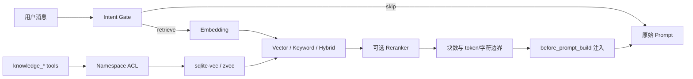
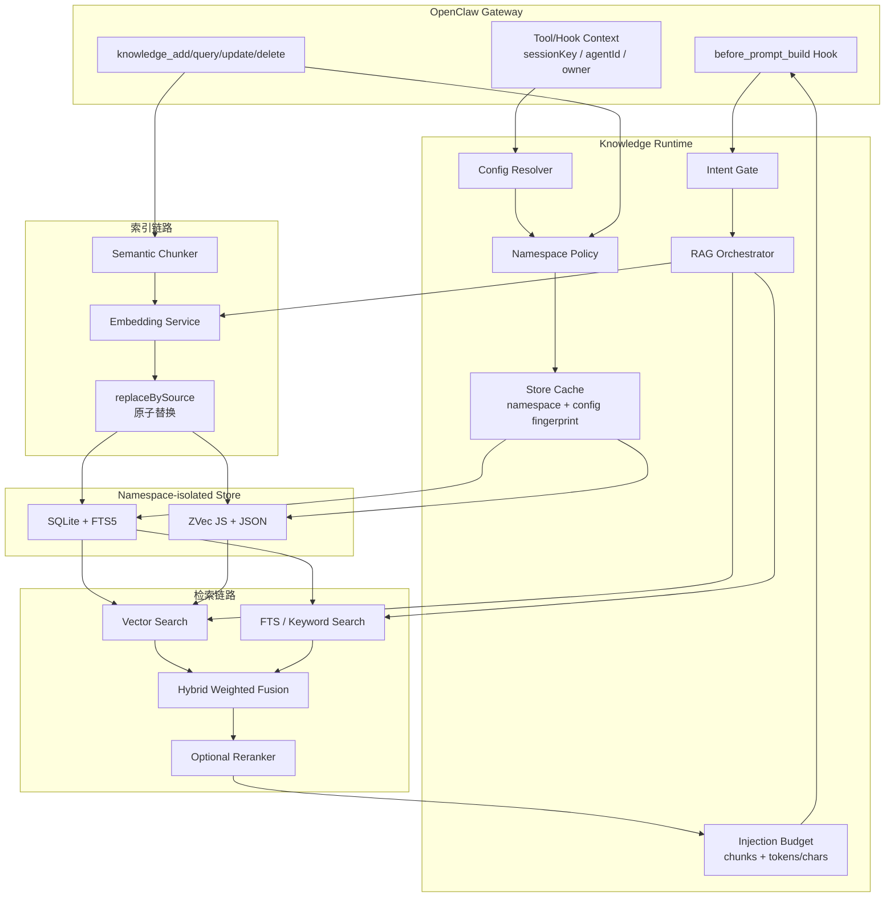
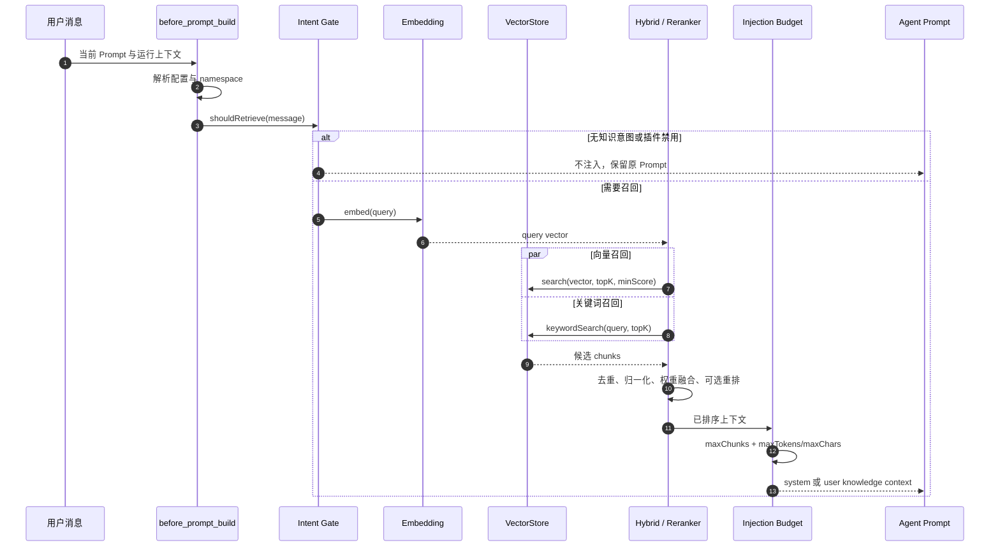
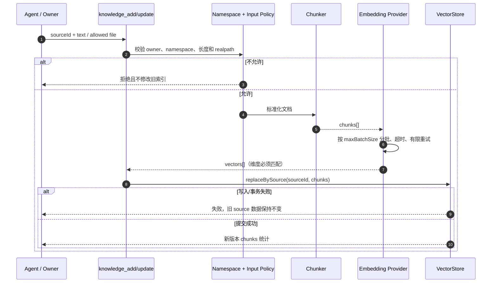
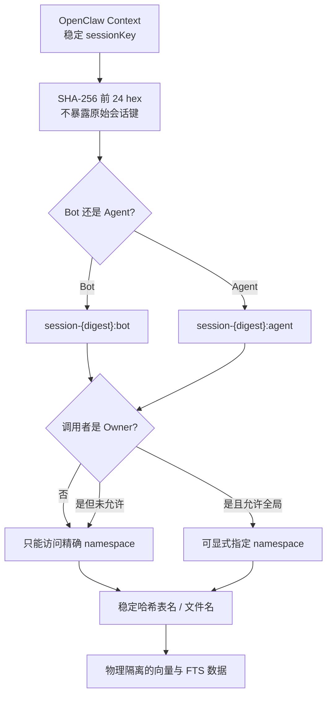
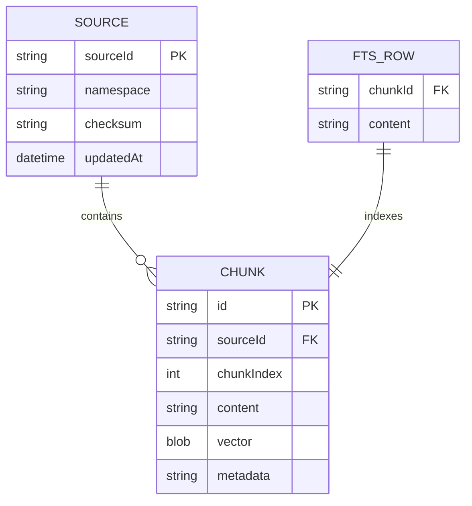
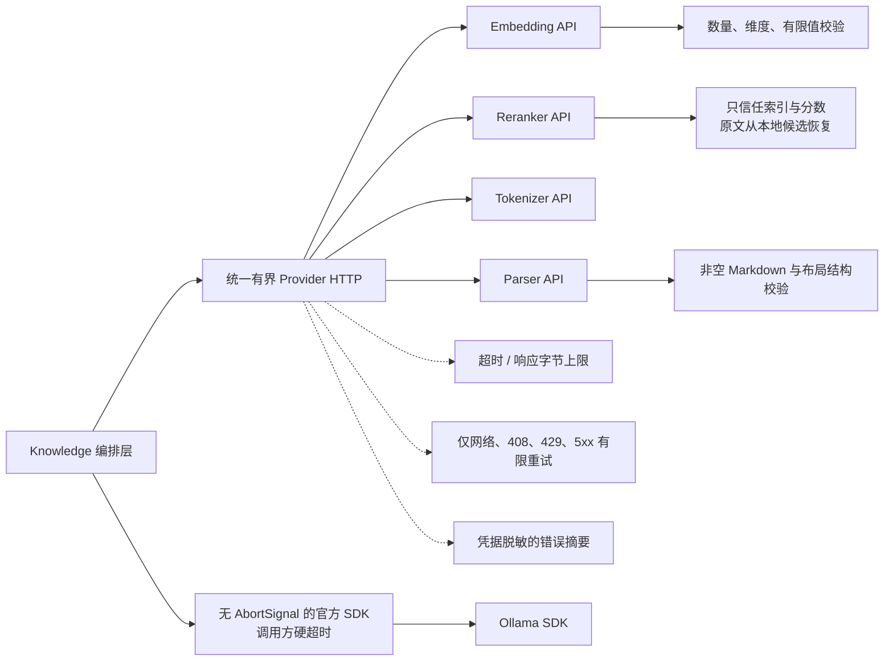
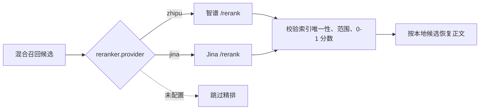

# OpenClaw Knowledge RAG 架构（2026.7.1）

## 定位

Knowledge 是 OpenClaw 基础设施插件，不是 channel。它通过 `before_prompt_build` 自动召回知识，也向 Agent 暴露四个 CRUD 工具。

```mermaid
flowchart LR
  U["用户消息"] --> G["Intent Gate"]
  G -->|skip| P["原始 Prompt"]
  G -->|retrieve| E["Embedding"]
  E --> R["Vector / Keyword / Hybrid"]
  R --> K["可选 Reranker"]
  K --> B["块数与 token/字符边界"]
  B --> I["before_prompt_build 注入"]
  I --> P
  T["knowledge_* tools"] --> A["Namespace ACL"]
  A --> S["sqlite-vec / zvec"]
  S --> R
```

## 运行时组件

| 组件 | 真实职责 |
|---|---|
| `src/index.ts` | 解析插件配置，注册 hook、tools 和 shutdown 清理 |
| `runtime/hooks.ts` | 配置合并、store 缓存、RAG 编排和有界注入 |
| `tools/policy.ts` | namespace ACL、输入上限、owner 文件白名单 |
| `indexer/chunker.ts` | 字符窗口、语义边界优先、重叠切分 |
| `retriever/hybrid.ts` | vector/keyword 双路召回和加权融合 |
| `store/sqlite-vec.ts` | Node.js 内置 SQLite 持久化、FTS5 和 namespace 独立表 |
| `store/zvec.ts` | 纯 JS 余弦检索和可选 JSON 持久化 |

## 隔离与生命周期

- OpenClaw 2026.7.1 的 Prompt Hook 不提供 `accountId`；namespace 由 Hook/Tool 共有的稳定 `sessionKey` 摘要和 bot/agent 模式派生。
- 非 owner 只能访问自己的精确 namespace；owner 是否可跨 namespace 由配置控制。
- SQLite 表名、ZVec 文件名使用稳定哈希，防止清洗碰撞。
- store 缓存同时按 namespace 和完整配置指纹区分；并发初始化去重。
- Gateway 停止时等待初始化、关闭 SQLite，并强制刷新 ZVec 延迟写入。

## 能力边界

插件正式支持 `sqlite-vec` 和 `zvec`，并可选接入智谱 Layout Parsing 或 Ollama 视觉模型，
将 PDF/Office/图片转换为 Markdown 后进入统一切块链路。远程 URL 抓取、外部向量数据库、
原生 ZVec 和多节点共享写入不属于 2026.7.1 承诺面。

## 组件协作图

```mermaid
flowchart TB
    subgraph HOST["OpenClaw Gateway"]
        HOOK["before_prompt_build Hook"]
        TOOL["knowledge_add/query/update/delete"]
        CTX["Tool/Hook Context<br/>sessionKey / agentId / owner"]
    end

    subgraph ORCH["Knowledge Runtime"]
        CFG["Config Resolver"]
        NS["Namespace Policy"]
        CACHE["Store Cache<br/>namespace + config fingerprint"]
        GATE["Intent Gate"]
        RAG["RAG Orchestrator"]
        BOUND["Injection Budget<br/>chunks + tokens/chars"]
    end

    subgraph INDEX["索引链路"]
        CHUNK["Semantic Chunker"]
        EMB["Embedding Service"]
        REPLACE["replaceBySource<br/>原子替换"]
    end

    subgraph RETRIEVE["检索链路"]
        VECTOR["Vector Search"]
        KEYWORD["FTS / Keyword Search"]
        FUSION["Hybrid Weighted Fusion"]
        RERANK["Optional Reranker"]
    end

    subgraph STORE["Namespace-isolated Store"]
        SQLITE["SQLite + FTS5"]
        ZVEC["ZVec JS + JSON"]
    end

    CTX --> CFG --> NS --> CACHE
    HOOK --> GATE --> RAG
    TOOL --> NS
    TOOL --> CHUNK --> EMB --> REPLACE
    CACHE --> SQLITE
    CACHE --> ZVEC
    REPLACE --> SQLITE
    REPLACE --> ZVEC
    RAG --> EMB
    RAG --> VECTOR
    RAG --> KEYWORD
    SQLITE --> VECTOR
    SQLITE --> KEYWORD
    ZVEC --> VECTOR
    VECTOR --> FUSION
    KEYWORD --> FUSION
    FUSION --> RERANK --> BOUND --> HOOK
```

### 组件职责

| 层 | 组件 | 职责与约束 |
|---|---|---|
| 注册层 | `src/index.ts` | 注册 Hook、四个 Tool 与 Gateway stop 清理 |
| 编排层 | `runtime/hooks.ts` | 合并配置、派生 namespace、复用 Store、执行自动 RAG |
| 策略层 | `tools/policy.ts` | owner、namespace、输入长度、文件 realpath 白名单 |
| 索引层 | `indexer/chunker.ts` | 优先语义边界的有重叠切块 |
| Embedding | `embedding/*` | Provider 批处理、超时、瞬时错误重试、向量维度校验 |
| 检索层 | `retriever/hybrid.ts` | vector/keyword 召回、归一化、权重融合和可选重排 |
| 存储层 | `store/sqlite-vec.ts` | SQLite 事务、向量 BLOB、FTS5、原子 source 替换 |
| 存储层 | `store/zvec.ts` | 纯 JS 余弦检索、有界小规模数据和可选 JSON 原子持久化 |

## 自动召回时序

```mermaid
sequenceDiagram
    autonumber
    participant U as 用户消息
    participant H as before_prompt_build
    participant G as Intent Gate
    participant E as Embedding
    participant S as VectorStore
    participant R as Hybrid / Reranker
    participant B as Injection Budget
    participant A as Agent Prompt

    U->>H: 当前 Prompt 与运行上下文
    H->>H: 解析配置与 namespace
    H->>G: shouldRetrieve(message)
    alt 无知识意图或插件禁用
        G-->>A: 不注入，保留原 Prompt
    else 需要召回
        G->>E: embed(query)
        E-->>R: query vector
        par 向量召回
            R->>S: search(vector, topK, minScore)
        and 关键词召回
            R->>S: keywordSearch(query, topK)
        end
        S-->>R: 候选 chunks
        R->>R: 去重、归一化、权重融合、可选重排
        R->>B: 已排序上下文
        B->>B: maxChunks + maxTokens/maxChars
        B-->>A: system 或 user knowledge context
    end
```

自动召回是辅助路径：没有结果时返回原 Prompt；外部 Embedding 或 Store 出错时由 Hook 记录
受控错误，不应把任意未校验内容注入 Agent。注入模板只接受已经通过 namespace 策略的块。

## 写入与更新时序

```mermaid
sequenceDiagram
    autonumber
    participant C as Agent / Owner
    participant T as knowledge_add/update
    participant P as Namespace + Input Policy
    participant K as Chunker
    participant E as Embedding Provider
    participant S as VectorStore

    C->>T: sourceId + text / allowed file
    T->>P: 校验 owner、namespace、长度和 realpath
    alt 不允许
        P-->>C: 拒绝且不修改旧索引
    else 允许
        P->>K: 标准化文档
        K-->>E: chunks[]
        E->>E: 按 maxBatchSize 分批、超时、有限重试
        E-->>T: vectors[]（维度必须匹配）
        T->>S: replaceBySource(sourceId, chunks)
        alt 写入/事务失败
            S-->>C: 失败，旧 source 数据保持不变
        else 提交成功
            S-->>C: 新版本 chunks 统计
        end
    end
```

同一 `sourceId` 的 add/update/delete 在调用层按顺序执行；namespace clear 使用 Store 级
独占屏障，先等待已登记写入，再阻止后续写入越过清空操作。`replaceBySource` 是存储契约的一部分：SQLite
在同一事务中删除旧向量/FTS 行并写入新行；ZVec 在新快照准备完成后替换内存状态。任何阶段
失败都不能留下“部分新块 + 部分旧块”的混合索引。

## Namespace 隔离

```mermaid
flowchart TD
    CTX["OpenClaw Context<br/>稳定 sessionKey"] --> HASHKEY["SHA-256 前 24 hex<br/>不暴露原始会话键"]
    HASHKEY --> MODE{"Bot 还是 Agent?"}
    MODE -->|Bot| BOT["session-{digest}:bot"]
    MODE -->|Agent| AGENT["session-{digest}:agent"]
    BOT --> POLICY{"调用者是 Owner?"}
    AGENT --> POLICY
    POLICY -->|否| EXACT["只能访问精确 namespace"]
    POLICY -->|是且允许全局| GLOBAL["可显式指定 namespace"]
    POLICY -->|是但未允许| EXACT
    EXACT --> HASH["稳定哈希表名 / 文件名"]
    GLOBAL --> HASH
    HASH --> DATA["物理隔离的向量与 FTS 数据"]
```

隔离要点：

- namespace 来自可信 OpenClaw Context，不接受普通用户任意覆盖；
- 非 owner 只能使用当前 sessionKey 和模式派生出的精确 namespace；
- owner 跨 namespace 仍需 `allowOwnerGlobalNamespaces=true`；
- SQLite 表名和 ZVec 文件名使用“可读前缀 + 稳定哈希”，避免仅替换标点造成碰撞；
- Store Cache 键包含完整配置指纹，namespace 相同但 Embedding/Store 配置不同不会错误复用。

## 存储模型

```mermaid
erDiagram
    SOURCE ||--o{ CHUNK : contains
    SOURCE {
        string sourceId PK
        string namespace
        string checksum
        datetime updatedAt
    }
    CHUNK {
        string id PK
        string sourceId FK
        int chunkIndex
        string content
        blob vector
        string metadata
    }
    FTS_ROW ||--|| CHUNK : indexes
    FTS_ROW {
        string chunkId FK
        string content
    }
```

`sqlite-vec` 是默认生产后端，适合需要事务和 FTS5 的本地单节点部署。`zvec` 当前是纯
JavaScript 余弦实现，更适合测试、小数据集或无原生 SQLite 能力的环境；配置 `dbPath` 时会
延迟合并写入 JSON，Gateway stop 会强制刷新。

## Embedding Provider 边界

```mermaid
flowchart LR
    K["Knowledge 编排层"] --> H["统一有界 Provider HTTP"]
    K --> SDK["无 AbortSignal 的官方 SDK<br/>调用方硬超时"]
    H --> E["Embedding API"]
    H --> R["Reranker API"]
    H --> T["Tokenizer API"]
    H --> P["Parser API"]
    SDK --> O["Ollama SDK"]

    H -.-> LIMIT["超时 / 响应字节上限"]
    H -.-> RETRY["仅网络、408、429、5xx 有限重试"]
    H -.-> SAFE["凭据脱敏的错误摘要"]
    E --> VALIDATE["数量、维度、有限值校验"]
    R --> TRUST["只信任索引与分数<br/>原文从本地候选恢复"]
    P --> MARKDOWN["非空 Markdown 与布局结构校验"]
```

| Provider | 接入方式 | 默认凭据/端点 |
|---|---|---|
| OpenAI-compatible | `/embeddings` | `OPENAI_API_KEY`、`OPENAI_BASE_URL` |
| DashScope | OpenAI-compatible Embedding | 插件配置或环境变量 |
| 智谱 | `/api/paas/v4/embeddings` | 插件配置 |
| 千帆 | `/v2/embeddings` | BCE IAM Token |
| Ollama | 官方 `ollama` SDK `/api/embed` | `OLLAMA_HOST` |

Reranker 只注册具备已核实 HTTP 契约的智谱 `/api/paas/v4/rerank` 与 Jina `/v1/rerank`。
不再把 Qwen3-Reranker 当作普通 Chat 模型要求其生成 JSON：这种方式无法取得 cross-encoder
的 `yes/no` logits，结果不具备可解释的重排分数语义。

```mermaid
flowchart LR
    CANDIDATE["混合召回候选"] --> CHOICE{"reranker.provider"}
    CHOICE -->|zhipu| Z["智谱 /rerank"]
    CHOICE -->|jina| J["Jina /rerank"]
    Z --> V["校验索引唯一性、范围、0-1 分数"]
    J --> V
    V --> LOCAL["按本地候选恢复正文"]
    CHOICE -.->|未配置| SKIP["跳过精排"]
```

所有 Provider 共享以下约束：

- `requestTimeoutMs` 控制单次远程请求；
- `maxRetries` 只针对网络、408、429 和 5xx 等瞬时错误；
- `maxBatchSize` 控制每次请求文本数；
- 返回向量数量、数值有限性和 dimensions 必须完整匹配；
- Reranker 返回的文档正文不受信任，只使用经过校验的索引和 0-1 分数；
- Parser 输出必须包含非空 Markdown，响应体和本地输入文件都有字节上限；
- 更换模型或维度后必须重新索引，旧向量不能继续混用。

## 失败模式与可恢复性

| 故障 | 处理 | 数据语义 |
|---|---|---|
| Embedding 超时/限流 | 有限重试后失败 | 不修改旧 source |
| 返回向量维度错误 | 立即拒绝 | 不写入 Store |
| SQLite 事务失败 | rollback | 旧 source 完整保留 |
| ZVec JSON 写入失败 | 保留内存状态并在关闭时重试 flush | 状态端应报告错误 |
| ZVec 快照损坏 | 启动失败并保留现场 | 不把损坏索引静默当空库 |
| 自动召回无结果 | 不注入上下文 | Agent 使用原 Prompt |
| 非 owner 越权 namespace | 策略层拒绝 | 不查询、不写入 |
| Gateway stop | 等待初始化并关闭/刷新 Store | 不遗留打开句柄或延迟写入 |

## 当前非目标

下列能力不代表 2026.7.1 插件对外承诺：

- 远程 URL 抓取与网页清洗；
- 外部 Milvus、Pinecone、Weaviate 等向量数据库；
- 多节点共享写入、分布式锁和在线索引迁移；
- 自动把所有会话内容永久写入知识库。

需要这些能力时，应先扩展配置契约、租户安全模型、资源上限和集成测试，而不是直接暴露
现有库级实验模块。
