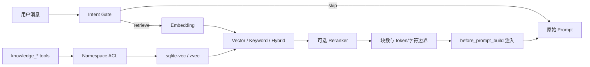

# OpenClaw Knowledge RAG 架构（2026.7.1）

## 定位

Knowledge 是 OpenClaw 基础设施插件，不是 channel。它通过 `before_prompt_build` 自动召回知识，也向 Agent 暴露四个 CRUD 工具。

```mermaid
flowchart LR
  U["用户消息"] --> G["Intent Gate"]
  G -->|skip| P["原始 Prompt"]
  G -->|retrieve| E["Embedding"]
  E --> R["Vector / Keyword / Hybrid"]
  R --> K["可选 Reranker"]
  K --> B["块数与 token/字符边界"]
  B --> I["before_prompt_build 注入"]
  I --> P
  T["knowledge_* tools"] --> A["Namespace ACL"]
  A --> S["sqlite-vec / zvec"]
  S --> R
```

## 运行时组件

| 组件 | 真实职责 |
|---|---|
| `src/index.ts` | 解析插件配置，注册 hook、tools 和 shutdown 清理 |
| `runtime/hooks.ts` | 配置合并、store 缓存、RAG 编排和有界注入 |
| `tools/policy.ts` | namespace ACL、输入上限、owner 文件白名单 |
| `indexer/chunker.ts` | 字符窗口、语义边界优先、重叠切分 |
| `retriever/hybrid.ts` | vector/keyword 双路召回和加权融合 |
| `store/sqlite-vec.ts` | Node.js 内置 SQLite 持久化、FTS5 和 namespace 独立表 |
| `store/zvec.ts` | 纯 JS 余弦检索和可选 JSON 持久化 |

## 隔离与生命周期

- namespace 由当前 `accountId` 和 bot/agent 模式派生。
- 非 owner 只能访问自己的精确 namespace；owner 是否可跨 namespace 由配置控制。
- SQLite 表名、ZVec 文件名使用稳定哈希，防止清洗碰撞。
- store 缓存同时按 namespace 和完整配置指纹区分；并发初始化去重。
- Gateway 停止时等待初始化、关闭 SQLite，并强制刷新 ZVec 延迟写入。

## 能力边界

插件正式支持 `sqlite-vec` 和 `zvec`。PDF/Office、URL 抓取、原生 ZVec、外部向量数据库和 parser 管道不属于 2026.7.1 独立插件承诺面。
