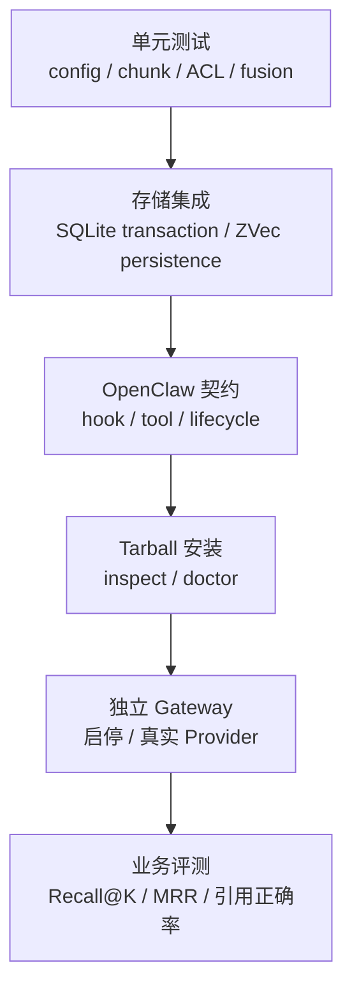

# OpenClaw Knowledge 开发与验证（2026.7.1）



## 本地门禁

```bash
cd extensions/knowledge
pnpm typecheck
pnpm test
pnpm build
```

当前测试覆盖配置合并、embedding/reranker/tokenizer 工厂、分块、意图门控、SQLite、ZVec、混合检索及工具安全策略。

## 设计约束

- 插件入口使用 OpenClaw 2026.7.1 `definePluginEntry`。
- 配置 schema 使用 `additionalProperties: false`，运行时还需执行语义校验。
- 所有 tool 在创建 store 或发起 embedding 前完成 ACL 和输入大小校验。
- 更新流程必须先验证并生成新内容，再删除旧 source，避免失败导致数据丢失。
- 本地持久化必须使用 namespace 隔离并在 shutdown 释放资源。
- 新增配置项时同步修改 `types.ts`、`config.ts`、manifest、README 和测试。

## 发布检查

构建后用 `pnpm pack` 检查 tarball，只应包含 `dist`、manifest、README 和 LICENSE。随后在隔离的 OpenClaw 2026.7.1 配置目录中安装，执行 `openclaw plugins inspect knowledge` 与 `openclaw doctor`，再验证一次真实 Gateway 启停。

## 变更检查表

- 修改 Chunker：补充跨 chunk、中文标点、超长段落和 overlap 测试；
- 修改 Embedding：补充超时、429/5xx 重试、批次数量和维度不匹配测试；
- 修改 Store：证明 `replaceBySource` 失败时旧数据完整保留；
- 修改 ACL：覆盖 owner/non-owner、account、bot/agent 和显式 namespace 矩阵；
- 修改 Hook：覆盖 skip、空召回、注入预算和 Gateway stop 资源释放；
- 修改发布面：同步 package、manifest、README、配置 Schema 和 2026.7.1 兼容门禁。
