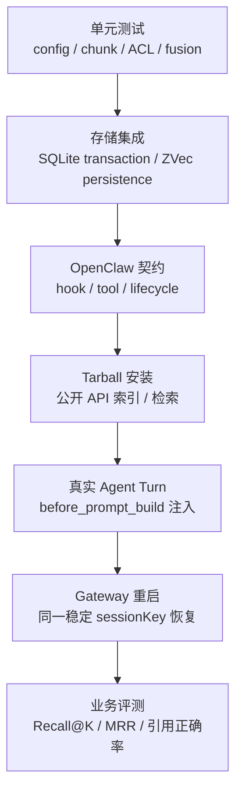

# OpenClaw Knowledge 开发与验证（2026.7.1）



## 本地门禁

```bash
cd extensions/knowledge
pnpm typecheck
pnpm test
pnpm test:coverage
pnpm build
```

当前测试覆盖配置合并、Provider 有界 HTTP 与供应商批次限制、分块、意图门控、SQLite、ZVec、
混合检索、CRUD Tool、namespace ACL、source/clear 并发屏障及 Store 配置切换失败恢复。

安装态统一 E2E：

```bash
OPENCLAW_E2E_HOST_GATEWAY=1 node scripts/e2e/run-e2e.mjs \
  --plugins knowledge --skip-browser
```

该场景使用本地 OpenAI-compatible Embedding/Chat fixture，不依赖商业凭据，但会真实执行
`pnpm pack → OpenClaw 2026.7.1 安装 → 文档索引 → Agent Hook 注入 → Gateway 重启 → 再召回`。

## 设计约束

- 插件入口使用 OpenClaw 2026.7.1 `definePluginEntry`。
- 自动 RAG 属于启动期 Hook，manifest 必须声明 `activation.onStartup=true`；否则插件可在 `plugins list` 中显示 enabled，却不会进入 Gateway 启动加载计划。
- `before_prompt_build` 正文来自第一个参数 `event.prompt`；第二个参数 `ctx` 使用官方
  `sessionKey`/`agentId` 派生隔离 namespace，不得读取不存在的 `accountId`。system 注入使用
  `prependSystemContext`，不得用 `systemPrompt` 覆盖宿主完整提示词。
- 配置 schema 使用 `additionalProperties: false`，运行时还需执行语义校验。
- 所有 tool 在创建 store 或发起 embedding 前完成 ACL 和输入大小校验。
- 更新流程必须先验证并生成全部新内容，再由 Store 的 `replaceBySource` 在一个事务/快照切换中
  原子替换；禁止重新引入 `deleteBySource → upsert` 两阶段窗口。
- 本地持久化必须使用 namespace 隔离并在 shutdown 释放资源。
- 新增配置项时同步修改 `types.ts`、`config.ts`、manifest、README 和测试。

## 发布检查

构建后用 `npm pack --dry-run --json` 检查 tarball，只应包含 `dist`、manifest、双语 README、
`INSTALL.md`、`package.json` 和 LICENSE。随后在隔离的 OpenClaw 2026.7.1 配置目录中安装，
执行 `openclaw plugins inspect knowledge` 与 `openclaw doctor`，再验证真实 Gateway 启停。

## 变更检查表

- 修改 Chunker：补充跨 chunk、中文标点、超长段落和 overlap 测试；
- 修改 Embedding：补充超时、429/5xx 重试、批次数量和维度不匹配测试；
- 修改 Store：证明 `replaceBySource` 失败时旧数据完整保留；
- 修改 ACL：覆盖 owner/non-owner、sessionKey 摘要、bot/agent 和显式 namespace 矩阵；
- 修改 Hook：覆盖 skip、空召回、注入预算和 Gateway stop 资源释放；
- 修改发布面：同步 package、manifest、README、配置 Schema 和 2026.7.1 兼容门禁。
