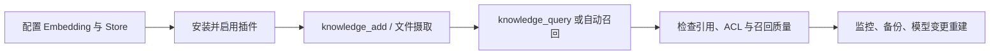
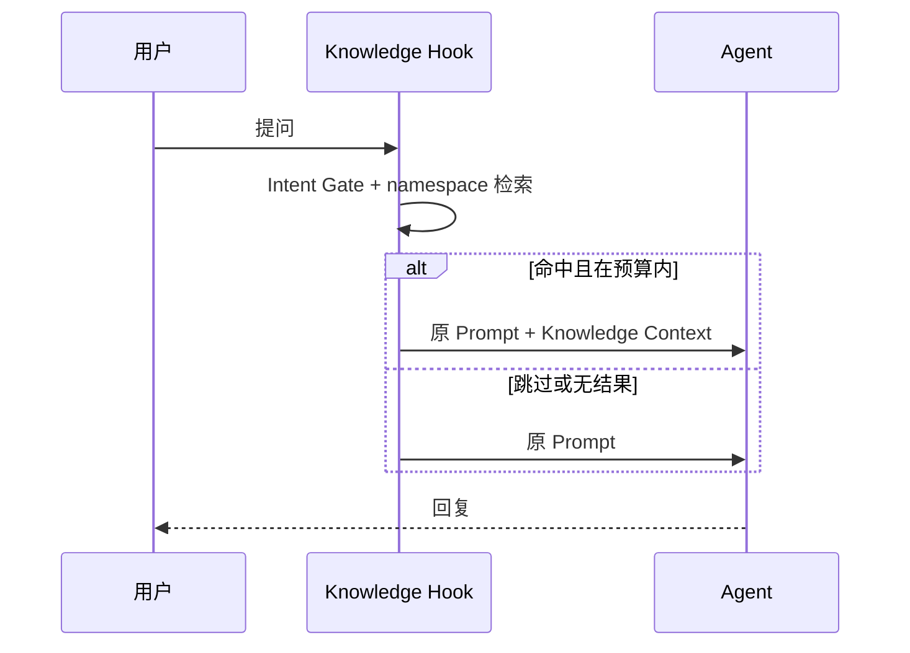

# OpenClaw Knowledge RAG 使用指南（2026.7.1）



## 最小配置

```json
{
  "enabled": true,
  "embedding": {
    "provider": "openai",
    "model": "text-embedding-3-small",
    "dimensions": 1536
  },
  "store": {
    "provider": "sqlite-vec",
    "dbPath": "./data/knowledge.db"
  }
}
```

此对象应放在 `plugins.entries.knowledge.config` 下；entry 本身也需要 `enabled: true`。OpenAI-compatible provider 可从 `OPENAI_API_KEY`、`OPENAI_BASE_URL`、`OPENAI_EMBEDDING_MODEL` 读取参数。

## 配置项

| 路径 | 默认值 | 说明 |
|---|---:|---|
| `enabled` | `false` | 必须显式启用 |
| `store.provider` | `sqlite-vec` | `sqlite-vec` 或 `zvec` |
| `retrieval.strategy` | `hybrid` | `vector`、`keyword`、`hybrid` |
| `retrieval.topK` | `5` | 1-100 |
| `retrieval.minScore` | `0.3` | 最终分数阈值 0-1 |
| `retrieval.vectorWeight` | `0.7` | hybrid 向量权重 |
| `retrieval.keywordWeight` | `0.3` | hybrid 关键词权重 |
| `injection.maxChunks` | `5` | 最大注入块数 |
| `injection.maxTokens` | `2048` | tokenizer 上限；无 tokenizer 时按四倍字符近似 |
| `tools.allowFileIngest` | `false` | owner 文件摄取开关 |
| `tools.allowedFileRoots` | `[]` | 允许根目录，按 realpath 检查 |

`injection.template` 必须包含 `{context}`。两个 hybrid 权重不能同时为 0。

## 工具权限

- `knowledge_query/add/update/delete` 默认只作用于当前 `accountId:bot|agent`。
- 非 owner 指定其他 namespace 会被拒绝。
- owner 的跨 namespace 权限可通过 `allowOwnerGlobalNamespaces` 关闭。
- `store_file` 只允许 owner，且还需启用文件开关并配置至少一个允许根目录。

## 存储选择

- `sqlite-vec`：默认推荐，具备持久化和 FTS5，适合生产验证。
- `zvec`：纯 JavaScript 全量相似度扫描，适合小数据量或开发；配置 `dbPath` 才持久化。

模型或 dimensions 变更后必须重新索引。早期 namespace 表不会自动迁移，详见插件 README 的升级说明。

## 工具调用示例

写入一份可信知识：

```json
{
  "sourceId": "product-refund-policy-v3",
  "content": "退款申请应在订单完成后 7 天内提交……"
}
```

查询时应给出完整问题，而不是只传关键词：

```json
{
  "query": "已经签收 5 天的订单还能否申请退款？",
  "topK": 5
}
```

更新同一个 `sourceId` 会原子替换全部旧块；删除按 `sourceId` 进行，不接受任意磁盘路径。

## 自动注入检查



验收时至少检查：普通闲聊不会无意义调用 Embedding；不同账号不能互相召回；注入上下文不
超过配置预算；无结果和 Provider 暂时失败时 Agent 仍能使用原 Prompt 工作。
