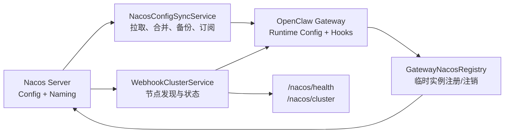
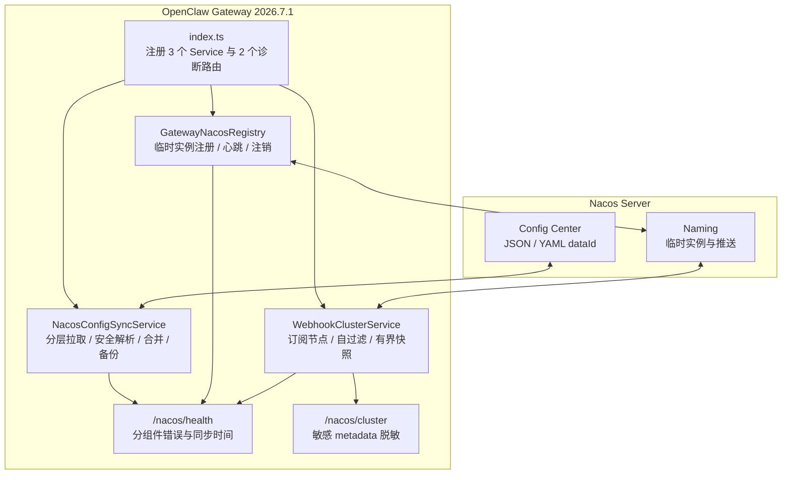
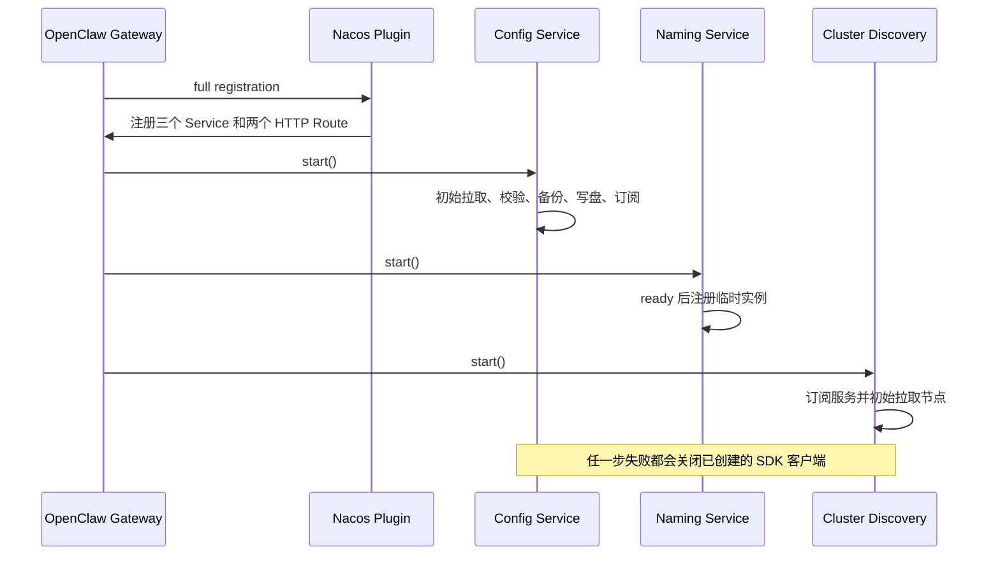
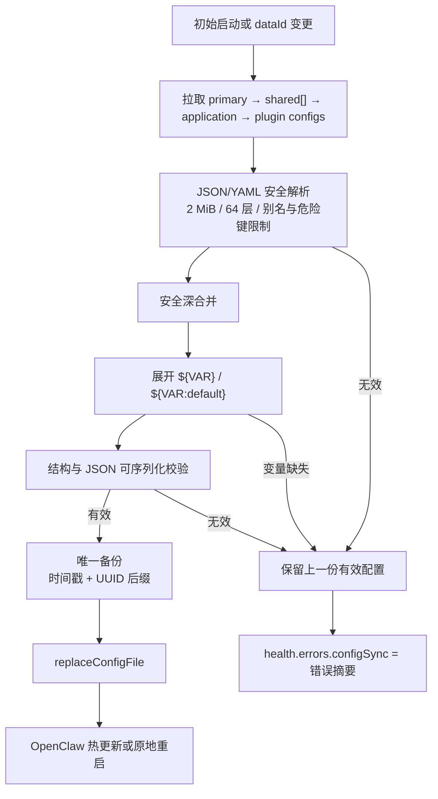

# 架构文档 — openclaw-nacos

## 系统概述

openclaw-nacos 将 OpenClaw Gateway 与 Nacos 集成，提供三大核心能力：

1. **配置中心** — 从 Nacos 加载 OpenClaw 配置，与本地配置合并，写入前备份，订阅远程变更。
2. **服务注册** — 将 Gateway 实例注册为 Nacos 临时实例，附带 webhook/Hooks 元数据。
3. **集群发现** — 订阅 Nacos 命名服务，实时发现其他 Gateway 节点。





### 纯文本架构速览

下面的字符图与 Mermaid 并列保留：它在终端、源码评审、纯文本日志和不支持 Mermaid 的平台中，
仍能一眼看清三个组件与 Nacos 两个子系统的关系。

```text
┌──────────────────────────────────────────────────────────────────┐
│                    OpenClaw Gateway                               │
├──────────────────────────────────────────────────────────────────┤
│  openclaw-nacos 插件                                              │
│                                                                   │
│  ┌─────────────────────┐  ┌──────────────────────────────────┐   │
│  │ NacosConfigSync     │  │ GatewayNacosRegistry             │   │
│  │ • primaryConfigDataId│  │ • 注册临时实例                    │   │
│  │ • sharedConfigs     │  │ • Hooks 元数据                   │   │
│  │ • pluginConfigIds   │  │ • 心跳维持                       │   │
│  │ • 备份 → 写入       │  │ • 停止时注销                     │   │
│  │ • 订阅变更          │  └──────────────┬───────────────────┘   │
│  └──────────┬──────────┘                 │                       │
│             │                            │                       │
│  ┌──────────┴────────────────────────────┴───────────────────┐   │
│  │ WebhookClusterService                                    │   │
│  │ • 订阅命名服务 → 实时节点列表                            │   │
│  │ • 自身过滤（排除本机 ip:port）                           │   │
│  │ • HTTP: GET /nacos/cluster → 节点元数据                  │   │
│  │ • HTTP: GET /nacos/health  → 组件状态                    │   │
│  └───────────────────────────────────────────────────────────┘   │
└──────────────────────────────────────────────────────────────────┘
         │                          │
         ▼                          ▼
┌──────────────────────────────────────────┐
│              Nacos Server                │
│  ┌────────────┐  ┌───────────────────┐   │
│  │ Naming     │  │ Config Center     │   │
│  │ (Distro)   │  │ (Raft)            │   │
│  └────────────┘  └───────────────────┘   │
└──────────────────────────────────────────┘
```

## 模块地图

```
src/
├── index.ts                  插件入口（definePluginEntry）
│   • 注册 3 个服务：config, naming, cluster
│   • 注册 HTTP 路由：/nacos/health, /nacos/cluster
│
├── shared/                   共享常量、类型、时间戳与 bootstrap 垫片
│
├── runtime/nacos-config-sync.ts      配置中心引擎
│   • NacosConfigSyncService 类
│   • pullAndApply() — 拉取、合并、验证、备份、写入
│   • start() — 创建客户端、初始拉取、订阅
│   • stop() — 取消订阅、关闭客户端
│   • backupOpenClawConfig() — 时间戳备份
│
├── runtime/nacos-registry.ts         服务注册（Naming）
│   • GatewayNacosRegistry 类
│   • register() — 创建 Naming 客户端、注册实例
│   • stop() — 注销实例
│   • buildInstanceMetadata() — hooks + gateway 元数据
│
├── runtime/nacos-cluster.ts          集群发现
│   • WebhookClusterService 类
│   • start() — 订阅命名服务、维护节点列表
│   • stop() — 取消订阅、清空节点列表
│   • getPeers() / getState() — 读取当前状态
│
├── runtime/nacos-connection.ts       客户端配置
│   • buildNacosConfigClientOptions()
│   • resolveProfile(), expandDataIdTemplate()
│   • resolveServerAddr(), resolveConfigNamespace()
│
├── config/config-parse.ts           插件配置解析
│   • parseNacosPluginConfig() → 可辨识联合结果
│   • parseConfigCenter() — configCenter 子树
│
├── config/spring-normalize.ts       Spring Cloud 兼容
│   • flattenSpringNacosPluginConfig()
│   • resolveNamingServerList(), resolveConfigServerList()
│
├── config/resolve-endpoint.ts       网络解析
│   • resolveGatewayPort() — OPENCLAW_GATEWAY_PORT → config → 18789
│   • resolveRegisterIp() — config → env → LAN IPv4 → 127.0.0.1
│   • resolveHooksInfo() — hooks 路径规范化
│
├── config/env-expand.ts             ${VAR} 占位符展开（缺失时失败关闭）
├── config/merge-deep.ts             安全的纯对象深度合并
├── config/parse-config-content.ts   JSON / YAML 正文解析与资源边界
└── setup-entry.ts            轻量级设置入口
```

## 服务生命周期

### 注册模式

插件通过 `definePluginEntry` 使用 OpenClaw 的**服务注册**模式。三个服务由 OpenClaw 运行时管理生命周期：

| 服务 ID | 启动 | 停止 |
|-----------|-------|------|
| `openclaw-nacos-config` | 创建 ConfigClient，拉取配置，订阅 | 取消订阅，关闭客户端 |
| `openclaw-nacos-naming` | 创建 NamingClient，注册实例 | 注销，关闭客户端 |
| `openclaw-nacos-cluster` | 创建 NamingClient，订阅节点 | 取消订阅，清空节点列表 |

所有服务均为**长期运行**，仅在 `registrationMode === "full"` 时启动。

### 启动顺序



## 数据流：配置同步



同一流程的纯文本版本保留如下，便于在源码和终端中直接阅读：

```text
远程 Nacos 配置
        │
        ▼
  NacosConfigClient.getConfig(dataId, group)
        │
        ▼
  parseConfigBody() — JSON 或 YAML 安全解析
        │
        ▼
  deepMerge(base, fetched) — 顺序：primary → shared[] → app → plugins
        │
        ▼
  expandEnvPlaceholdersInValue() — ${VAR} / ${VAR:default} 解析
        │
        ▼
  validateMergedConfig() — 结构与 JSON 可序列化检查
        │
        ▼
  backupOpenClawConfig() → stateDir/openclaw-nacos-yyyyMMddHHmmss-<uuid>.json
        │
        ▼
  api.runtime.config.replaceConfigFile() → 写入磁盘 openclaw.json
        │
        ▼
  Gateway 检测配置变更 → 热更新或原地重启
```

## 数据流：服务注册

```
Gateway 启动
        │
        ▼
  resolveGatewayPort() → 端口
  resolveRegisterIp() → IP
  resolveHooksInfo() → hooks 元数据
        │
        ▼
  buildInstanceMetadata() → { hooksBasePath, gatewayPort, provider, ... }
        │
        ▼
  NacosNamingClient.registerInstance(serviceName, { ip, port, metadata })
        │
        ▼
  Nacos 心跳循环（临时实例）
        │
        ▼
  停止时：deregisterInstance()
```

## 一致性模型

| 数据 | 协议 | CAP | 原因 |
|------|----------|-----|-----------|
| 配置 | Raft（Nacos 服务端） | CP | 配置数据必须强一致 |
| 服务实例 | Distro（Nacos 服务端） | AP | 服务发现高可用优先 |
| 本地节点列表 | 内存订阅 | 最终一致性 | Nacos 推送事件更新 |

## 关键设计决策

### 注册与发现使用独立的 Naming 客户端

插件使用**两个独立**的 `NacosNamingClient` 实例：
- 一个用于注册（由 `GatewayNacosRegistry` 持有）
- 一个用于集群发现（由 `WebhookClusterService` 持有）

这种分离确保即使发现出现问题时，注册心跳仍继续运行，反之亦然。

### 配置采用分层合并而非替换

来自 Nacos 的配置被**合并到**当前运行时配置中，而非替换。这保留了本地未在 Nacos 中管理的设置。`primaryConfigDataId` 选项提供了将单个 Nacos 配置指定为权威基准的能力，同时 shared/plugin 配置仍在之上叠加。

### 写入前备份

每次由 Nacos 触发的配置写入前都会创建备份。这提供审计追踪和人工回滚能力。备份存储在 OpenClaw 的 `stateDir` 中，命名模式为 `openclaw-nacos-yyyyMMddHHmmss-xxxxxxxx.json`；随机后缀防止同一秒内的连续更新相互覆盖。

### 插件配置 ID 支持 Profile

按插件配置遵循约定 `{pluginId}-{profile}.json`（如 `wechat-dev.json`）。Profile 从插件配置 → `OPENCLAW_PROFILE` → `SPRING_PROFILES_ACTIVE` → `"default"` 依次解析。
