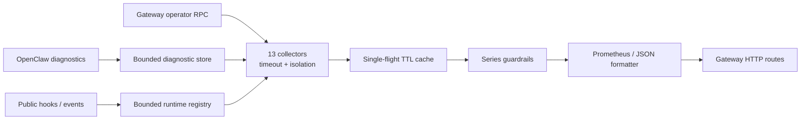

# OpenClaw Prometheus 插件架构

> 版本：2026.7.1｜更新：2026-07-16｜状态：已通过 OpenClaw 2026.7.1 独立 Gateway 验证

## 定位

`@partme.ai/openclaw-prometheus` 是 infra 插件，不是 Channel，也不启动独立 HTTP 端口。插件 ID 和配置键均为 `prometheus`，指标路由精确挂载到 OpenClaw Gateway。

插件汇聚三类数据：

1. trusted internal diagnostics：模型用量、运行、工具、消息、Harness 等事件；
2. Gateway operator RPC：usage、sessions、channels、models、nodes、skills、cron、presence、health；
3. 公共 Plugin hooks/runtime events：消息、工具、会话、压缩、子代理和插件生命周期。

插件不读取对话内容，不注册 `agent_end`、`llm_input` 等受保护 hook，也不需要 `hooks.allowConversationAccess`。

## 运行结构



- diagnostics store 最多 2048 个 series；超限计入 `openclaw_prometheus_series_dropped_total`。
- runtime registry 最多 4096 个 series；超限计入 `openclaw_runtime_metric_series_dropped_total`。
- collector 并行执行，单个 collector 失败不会丢弃其他采集结果。
- 健康状态只反映最近一次采集结果，累计错误计数不会永久污染健康状态。
- Gateway RPC 客户端、重连定时器、runtime event 订阅和事件循环采样器均在停止时释放。

## HTTP 契约

默认根路径为 `/metrics`，可通过 `plugins.entries.prometheus.config.path` 修改。

| 路径 | 返回 | 说明 |
| --- | --- | --- |
| `GET /metrics` | Prometheus text | 标准 scrape |
| `GET /metrics/per-object` | JSON | 按对象分组 |
| `GET /metrics/detailed?family=prefix` | JSON | 按合法指标名前缀过滤 |
| `GET /metrics/health` | JSON | 健康返回 200，降级返回 503 |
| `GET /metrics/debug?component=all` | JSON | `all/collectors/registry/config` |

所有路由均为 exact match、GET-only、`Cache-Control: no-store`。非 GET 返回 405。开启 `scrapeAuth` 后，缺少或错误 Bearer 返回 401；启用鉴权但未提供服务端密钥返回 503。

## 生命周期

- manifest 使用 `activation.onStartup: true`，确保 Gateway 启动时加载 infra 插件。
- `register()` 只注册路由、hooks、RPC 方法和服务定义。
- diagnostics 订阅由插件 service 启动，在 service stop 时清理。
- `RuntimeCollector` 的采样定时器使用 `unref()`，不会阻塞 `plugins install/inspect/doctor` 等 CLI 退出。
- bundled `diagnostics-prometheus` 与本插件不可同时启用，否则会重复订阅并产生重复 series。

## 配置

```json
{
  "plugins": {
    "allow": ["prometheus"],
    "entries": {
      "diagnostics-prometheus": { "enabled": false },
      "prometheus": {
        "enabled": true,
        "config": {
          "path": "/metrics",
          "collectIntervalMs": 15000,
          "snapshotIntervalMs": 30000,
          "workloadWindowMs": 300000,
          "includeRuntime": true,
          "monitoredProviders": [],
          "instance": "",
          "scrapeAuth": { "enabled": true }
        }
      }
    }
  }
}
```

生产环境通过 `OPENCLAW_PROMETHEUS_BEARER_TOKEN` 注入密钥。TLS 和网络访问控制由 Gateway 或反向代理承担。

## 已验证门禁

- Node.js `>=22`，构建 target `node22`；
- OpenClaw peer/compat `>=2026.7.1`；
- typecheck、build、33 项测试、结构检查 0 问题；
- tarball 安装、`plugins inspect prometheus`、`doctor` 无插件错误；
- 独立 Gateway 实测 `/metrics` 200、health 200、POST 405、未授权 401、SIGINT 干净退出。
