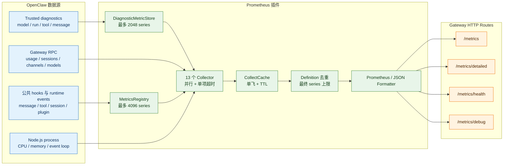
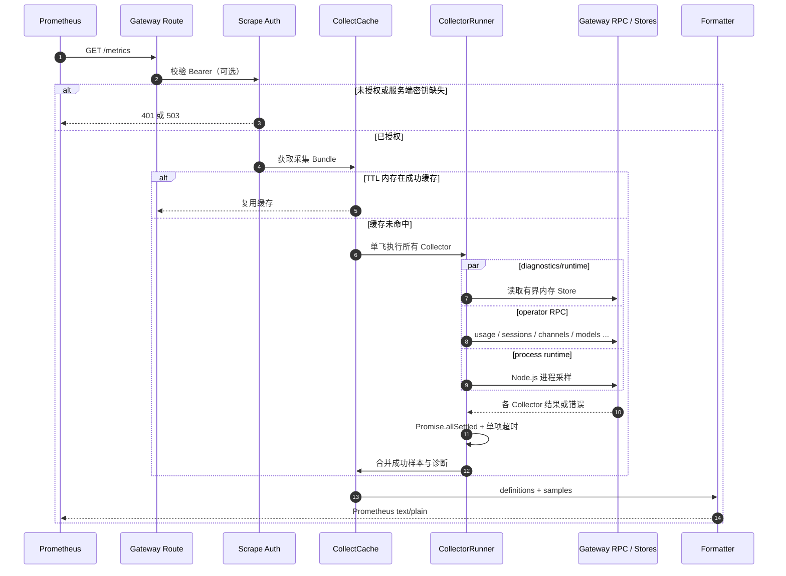
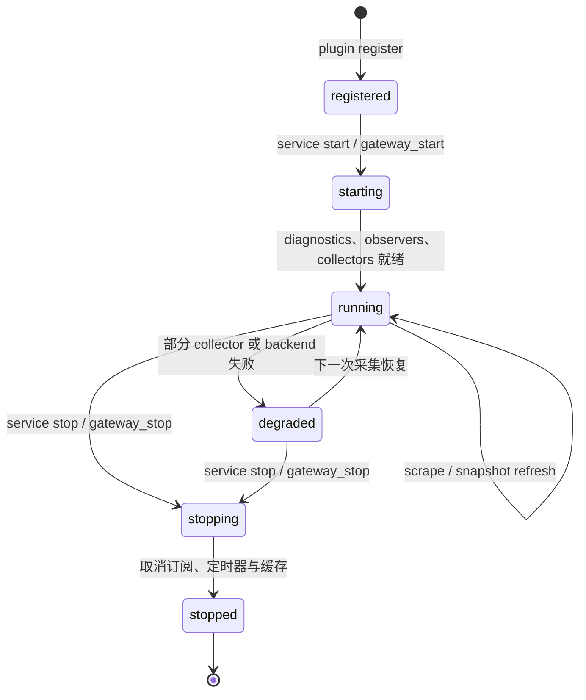
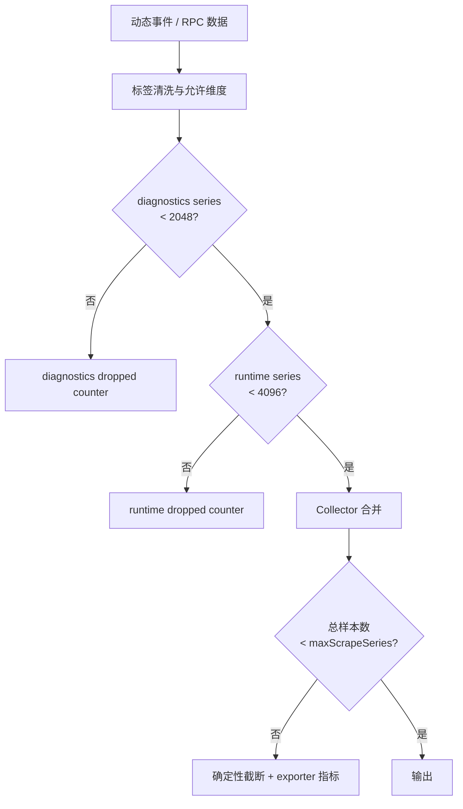

# OpenClaw Prometheus 插件架构

> 版本：2026.7.1｜状态：已按 OpenClaw 2026.7.1 插件契约实现并验证

## 1. 定位与边界

`@partme.ai/openclaw-prometheus` 是直接挂载在 OpenClaw Gateway 上的基础设施插件，不是
Channel，也不会另开 HTTP 监听端口。它汇聚内部 diagnostics、Gateway RPC 和公共插件事件，
最终输出 Prometheus 文本与受控 JSON 诊断接口。

插件不读取对话正文，不注册需要 `hooks.allowConversationAccess` 的受保护 Hook。TLS 终止、
公网访问控制和网络限流由 Gateway 或其前置反向代理负责。



## 2. 三条采集链路

| 链路 | 输入 | 主要职责 | 典型指标 |
| --- | --- | --- | --- |
| Trusted diagnostics | Gateway 内部诊断事件 | 与 bundled exporter 对齐的模型、运行、工具、消息指标 | `openclaw_model_tokens_total` |
| Gateway RPC | `usage.cost`、`sessions.usage`、`channels.status` 等 | 周期快照与运维状态 | `openclaw_usage_*`、`openclaw_model_auth_*` |
| Hooks/runtime | 消息、工具、会话、插件生命周期 | 当前插件可公开观察的工作负载 | `openclaw_runtime_*`、`openclaw_messages_*` |

diagnostics 事件先进入独立 `DiagnosticMetricStore`；RPC Collector 在抓取阶段主动调用 Gateway；
Hooks/runtime 事件写入 `MetricsRegistry`。三条链路最后统一成 `MetricDefinition[] + MetricSample[]`，
因此 Prometheus 文本、JSON 明细和健康诊断使用同一份采集结果。

## 3. 抓取时序



关键语义：

- 同一 Collector 上一次调用仍悬挂时，后续抓取复用相同 in-flight Promise，不重复打爆 Gateway；
- `collectorTimeoutMs` 只限制本次抓取等待时间，不能取消不支持 AbortSignal 的上游 RPC；
- Collector 使用 `Promise.allSettled` 隔离失败，一个 RPC 超时不会丢弃其它指标；
- `collectIntervalMs > 0` 时只缓存成功组装的 Bundle，避免高频 scrape 重复执行昂贵 RPC；
- 最终响应受 `maxScrapeSeries` 限制，防止多个合法来源合并后产生过大输出。

## 4. 组件职责

| 组件 | 源码位置 | 职责 |
| --- | --- | --- |
| 插件入口 | `src/index.ts` | 组装 Collector、路由、服务、Hook、缓存和生命周期 |
| Diagnostics Store | `src/diagnostics/metric-store.ts` | 接收可信诊断事件并限制动态 series |
| Runtime Registry | `src/diagnostics/metrics-registry.ts` | 记录 Hook/runtime 指标、Histogram 与快照缓存 |
| Collector Runner | `src/collectors/collector-runner.ts` | 单 Collector 单飞、超时等待和在途状态清理 |
| Collect Cache | `src/collectors/collect-cache.ts` | 整体抓取结果 TTL 缓存与并发请求合并 |
| Observer | `src/runtime/observer.ts` | 注册/注销 Hook 与 runtime event，维护周期快照 |
| RPC Bridge | `src/runtime/ws-bridge.ts` | 通过官方 Runtime 调用 Gateway 运维 RPC |
| Formatter | `src/formatters/*` | Prometheus 文本和 JSON 格式化 |
| Auth Guard | `src/transport/server.ts` | 可选 Bearer Token 校验和常量时间比较 |

## 5. 生命周期



`register()` 只声明能力；真正的 diagnostics 订阅、runtime observer 和定时采样由插件 service
启动。停止阶段按以下顺序清理：

1. 停止 observer 和周期快照；
2. 取消 diagnostics 订阅；
3. dispose 带定时器的 Collector；
4. 清空 in-flight runner 与采集缓存；
5. 释放 Gateway Runtime 引用。

所有维护定时器均调用 `unref()`，不会阻塞 `plugins inspect/doctor/install` 等短生命周期 CLI。

## 6. 基数、隐私与资源边界



- diagnostics store 最多 2048 个 series；超限计入
  `openclaw_prometheus_series_dropped_total`；
- runtime registry 最多 4096 个 series；超限计入
  `openclaw_runtime_metric_series_dropped_total`；
- 不导出自由文本消息、对话正文、Token、Profile 详情和未经清洗的异常；
- provider、model、channel、tool 等动态标签经过格式和长度清洗；
- `/debug` 与 collector 诊断中的错误先脱敏再返回；
- 启用 `scrapeAuth` 时生产密钥应从 `OPENCLAW_PROMETHEUS_BEARER_TOKEN` 注入。

## 7. HTTP 契约

默认根路径为 `/metrics`，可通过 `plugins.entries.prometheus.config.path` 修改。

| 路径 | 格式 | 说明 |
| --- | --- | --- |
| `GET /metrics` | Prometheus text | 标准抓取入口 |
| `GET /metrics/per-object` | JSON | 按对象聚合的指标视图 |
| `GET /metrics/detailed?family=prefix` | JSON | 按合法指标名前缀过滤 |
| `GET /metrics/health` | JSON | 正常 200，当前采集降级时 503 |
| `GET /metrics/debug?component=...` | JSON | `all/collectors/registry/config` 诊断 |

所有路由均为 exact match、GET-only，并返回 `Cache-Control: no-store`；非 GET 请求返回 405。
启用鉴权后，错误或缺失 Bearer Token 返回 401；配置要求鉴权但服务端没有密钥时返回 503。

## 8. 失败与恢复语义

| 故障 | 行为 | 健康影响 |
| --- | --- | --- |
| 单个 RPC/Collector 失败 | 保留其它 Collector 结果并记录诊断 | 最近一次采集降级 |
| Collector 超时 | 本次等待失败；相同悬挂调用不重复启动 | collector success=0 |
| 缓存过期时并发抓取 | 合并为一次 collect | 无额外影响 |
| series 超限 | 丢弃新增 series 并增加 dropped 指标 | 可告警 |
| Gateway Runtime 未就绪 | RPC Collector 返回受控失败 | health 503，基础 exporter 仍可响应 |
| bundled exporter 同时启用 | 可能重复订阅和重复 series | 配置错误，必须禁用其中一个 |

累计错误计数用于趋势观察，但健康状态只反映最近一次采集，不会因为历史错误永久保持失败。

## 9. 生产配置示例

```json
{
  "plugins": {
    "entries": {
      "diagnostics-prometheus": { "enabled": false },
      "prometheus": {
        "enabled": true,
        "config": {
          "path": "/metrics",
          "collectIntervalMs": 15000,
          "snapshotIntervalMs": 30000,
          "workloadWindowMs": 300000,
          "collectorTimeoutMs": 10000,
          "maxScrapeSeries": 10000,
          "includeRuntime": true,
          "monitoredProviders": [],
          "scrapeAuth": { "enabled": true }
        }
      }
    }
  }
}
```

## 10. 验证边界

- Node.js `>=22`，OpenClaw peer/compat `>=2026.7.1`；
- typecheck、build、单元/集成测试和插件结构检查必须通过；
- tarball 安装后验证 `plugins inspect prometheus` 与 `plugins doctor`；
- 独立 Gateway 验证 metrics/health/debug、GET-only、Bearer 401/503 与 SIGINT 干净退出；
- 生产环境还需通过真实 Prometheus 抓取、告警规则和目标网络策略验收。

指标字典、部署和排障分别见同目录 Guide 及上级目录中的 Metrics、Deployment、
Troubleshooting 文档。
