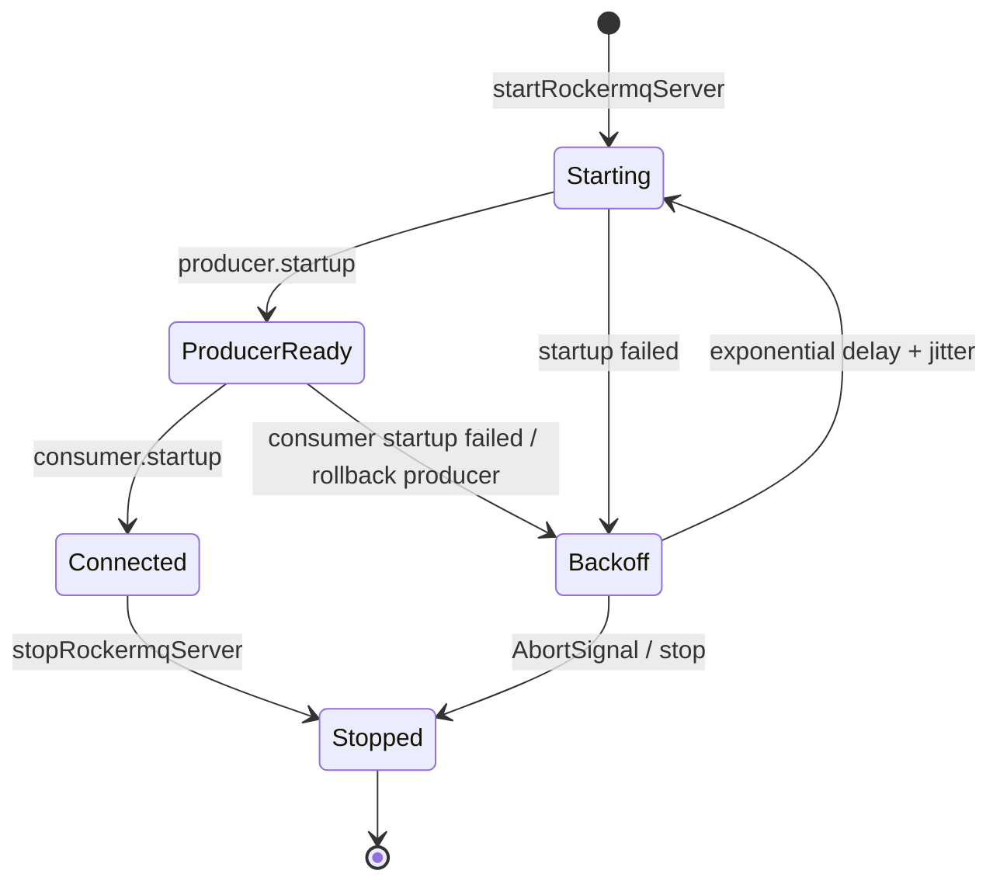

# Technical Details — openclaw-rocketmq

## Transport Layer (`transport/server.ts`)

### Producer Management

- A long-lived `Producer` instance is created at channel startup
- Configured with `endpoints`, `namespace`, `requestTimeout`, and optional `sessionCredentials`
- `publishMessage()` uses the existing producer when available
- **One-shot fallback**: In subagent/child-process contexts where the module-level producer is null, a temporary `Producer` is created, used for a single send, and shut down

### PushConsumer Management

- A long-lived `PushConsumer` instance listens for inbound messages
- `messageListener.consume()` is the entry point for all inbound processing
- Returns `ConsumeResult.SUCCESS` to ack, `ConsumeResult.FAILURE` to nack
- Reconsume behavior is controlled by `consumer.reconsumeOnError` config

### Connection Lifecycle



对应源码调用关系保留如下，便于从状态图直接定位实现，而不必只靠文字猜测：

```text
startRockermqServer()
  └── connectWithRetry(signal)
       └── connectOnce()
            ├── new Producer() → producer.startup()
            └── new PushConsumer() → consumer.startup()
                 └── 失败时 shutdown producer（回滚半启动状态）

stopRockermqServer()
  ├── AbortController.abort()（打断退避等待）
  ├── consumer.shutdown()
  └── producer.shutdown()
```

默认最多尝试 6 次；等待时间从 `retryDelayMs` 开始指数增长，受
`retryMaxDelayMs` 限制，并按 `retryJitterRatio` 加入抖动。停止账号会通过
`AbortSignal` 打断等待，不会让 Gateway 关闭流程卡在定时器上。

### Stats Tracking

Module-level `RockermqStats` object tracks:
- Connection state (`connected`, `lastConnectAt`, `lastDisconnectAt`)
- Message counters (`messagesReceived`, `messagesSent`, `messagesAcked`, `messagesNacked`, `messagesRequeued`)
- Error state (`lastError`, `errors`)
- In-flight count (`inFlight`)

计数语义：`messagesAcked` 对应返回 Broker 的 `SUCCESS`；`messagesNacked` 与
`messagesRequeued` 对应 `FAILURE`；永久拒绝另记 `messagesDropped`；DLQ 转发成功另记
`messagesDeadLettered`，随后才 ACK 原消息。

Stats are returned as a shallow copy via `getStats()` to prevent external mutation.

## Routing Algorithm (`topic-router.ts`)

### Resolving Inbound Messages

`resolveInboundRoute(topic, tag, config, peerIdHint?)` operates in two passes:

**Pass 1 — Explicit Bindings** (priority)
```
for each binding in topicBindings:
  if binding.topic === topic:
    if binding.tag === "*" or binding.tag === tag:
      → return route with binding.agentId, binding.accountId
```

**Pass 2 — Standard Format** (fallback)
```
parseStandardTopic(topic, topicPrefix):
  prefix = topicPrefix ? topicPrefix + "--agent--" : "agent--"
  if topic starts with prefix:
    parts = topic.slice(prefix.length).split("--")
    if 2 <= parts.length <= 3 and every part is non-empty:
      agentId = parts[0]
      direction = parts[1]  # "in" or "out"
      peerId = parts[2] or ""
      → return { agentId, direction, peerId }
```

RocketMQ broker resource names are validated against `^[a-zA-Z0-9_-]+$`; `--` is reserved as the standard-route delimiter and cannot appear inside `topicPrefix`, `agentId`, or `peerId` segments.

### Topic Wildcard Matching

`matchTopic(topic, pattern)` supports RabbitMQ-style wildcards:
- `*` or `+` — matches exactly one segment
- `#` — matches zero or more segments (greedy)
- Forward slashes `/` are normalized to `.` before matching

### Reply Topic Derivation

- `buildReplyTopicFromInbound(inboundTopic)`: Replaces trailing `.in` with `.out`, or appends `.out`
- `buildOutboundTopic(agentId, topicPrefix, peerId?)`: Constructs standard outbound topic

## Dispatch Modes

### 1. `reply-pipeline`
Uses OpenClaw's core reply pipeline (`dispatchReplyFromConfig`). The message flows through standard reply middleware with typing indicators, chunking, and channel-aware delivery.

### 2. `embedded-agent`
Runs the agent synchronously within the channel process:
```
rt.agent.runEmbeddedAgent({
  sessionId, sessionKey, agentId,
  sessionFile, workspaceDir, prompt,
  timeoutMs, runId, config
})
→ extractFinalTextFromRunResult()
→ publishMessage(reply)
```

### 3. `subagent`
Spawns an agent in a separate process:
```
rt.subagent.run({ sessionKey, message, deliver: false })
→ rt.subagent.waitForRun({ runId, timeoutMs })
→ publishMessage(reply)
```

## Config Resolution (`config.ts`)

### Resolution Path

Config is read from `channels.rocketmq` (or top-level `rocketmq` as fallback) in the OpenClaw config:

```typescript
resolveRockermqConfig(cfg)
  → cfg.channels.rocketmq ?? cfg.rocketmq ?? {}
  → merge with DEFAULT_ROCKERMQ_CONFIG
```

### Validation Rules

`validateRockermqConfig()` checks:
1. `endpoints`、ACL 成对凭证与 Broker 资源名
2. Producer/Consumer/幂等/连接重试数值范围及整数约束
3. Payload/dispatch 枚举、重复 subscription/binding 与重试上下限关系

只有缺省字段才使用默认值；显式非法值不会静默回退。Invalid configuration fails
channel startup with a combined validation error.

### Credential Masking

`buildRockermqConfigSnapshot()` deeply copies the config and replaces:
- `sessionCredentials.accessKey` → `"***"`
- `sessionCredentials.accessSecret` → `"***"`
- `sessionCredentials.securityToken` → `"***"`

## Idempotency

Enabled by default (`idempotency.enabled: true`):
- Uses `correlationId` from message payload or `messageId` as the key
- Uses a bounded process-local claim/commit cache
- Claims before Agent dispatch, commits only after dispatch and reply publication succeed
- Releases the claim on transient failure so RocketMQ redelivery can retry
- Treats in-flight and committed duplicates as acknowledged duplicates
- Does not provide distributed exactly-once delivery across plugin processes

## Session Mapping (`session-mapper.ts`)

Two in-memory maps maintain routing state:
- `sessionPeerMap: Map<sessionKey, peerId>` — reverse lookup for outbound
- `sessionContextMap: Map<sessionKey, RockermqSessionContext>` — routing metadata

Session keys are generated by OpenClaw core's `resolveAgentRoute()`, not by this plugin.

## Payload Parsing

Three modes for extracting text from inbound message bodies:

| Mode | Behavior |
|------|----------|
| `plainText` | Raw body is used as-is |
| `jsonOnly` | Body is parsed as JSON; uses `text` field or full JSON string |
| `jsonTextOrPlain` | Tries JSON first; if `text` field exists and is non-empty, uses it; otherwise returns raw body |

## Run ID Generation

Uses `crypto.randomBytes(16)` for cryptographically secure run IDs: `{timestamp}-{32 hex chars}`.
