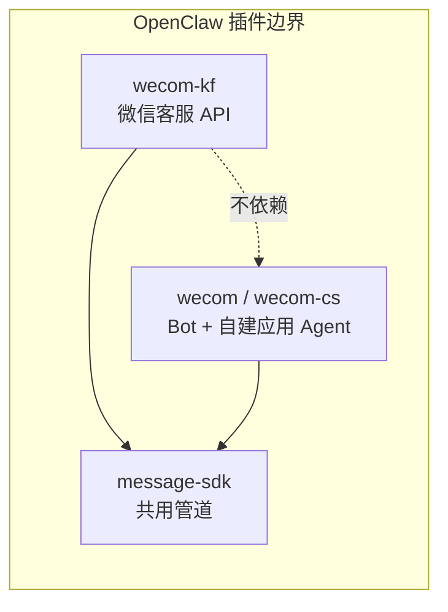
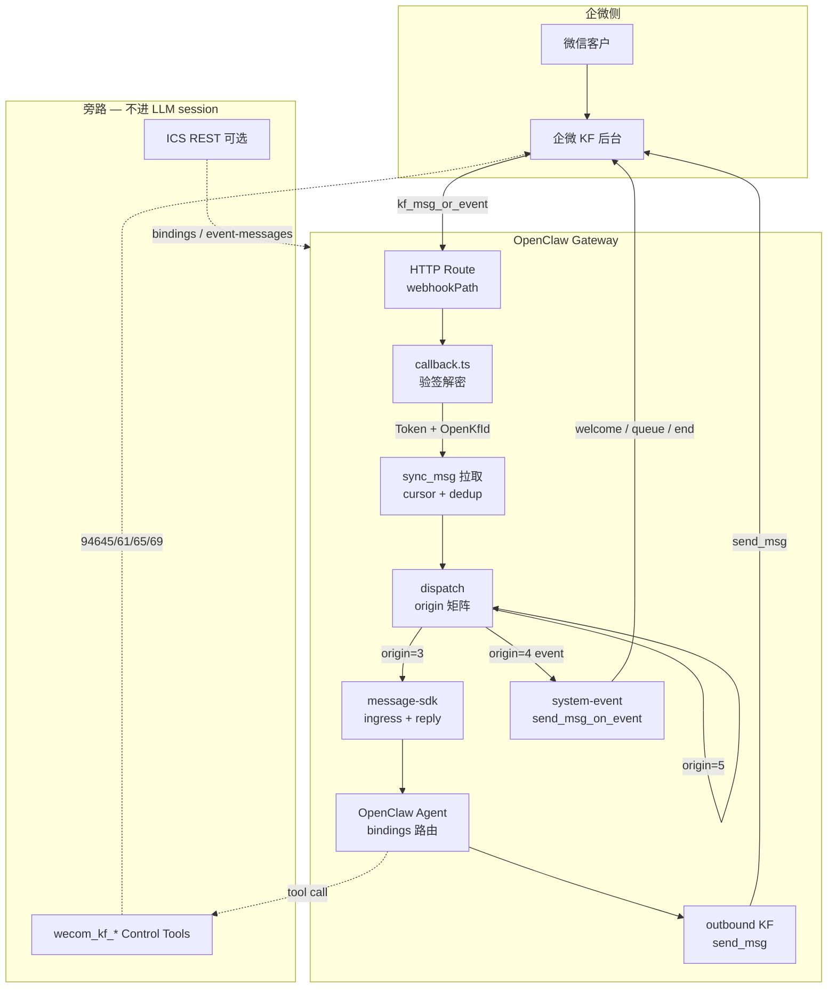
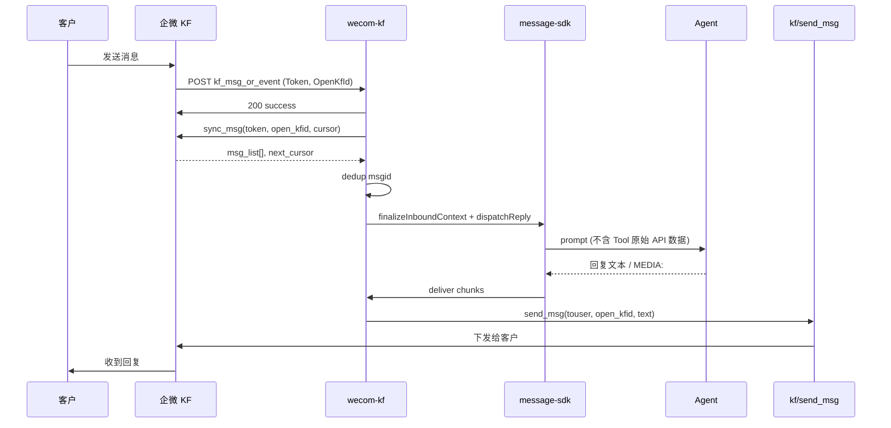
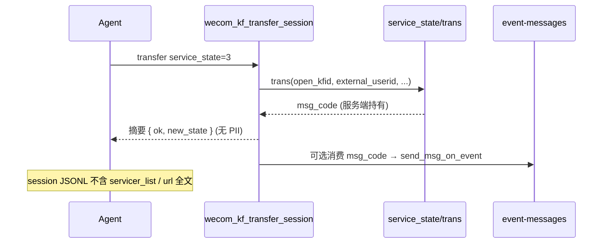
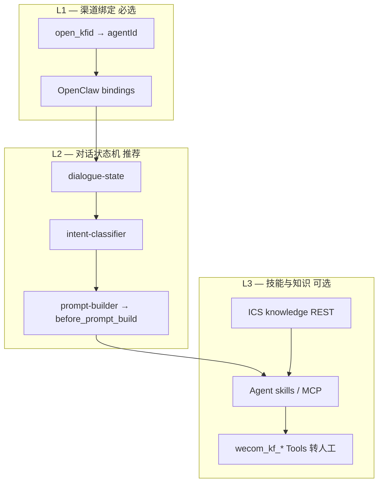
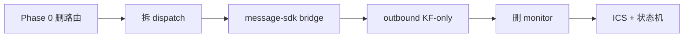

# OpenClaw WeCom KF 主架构（KF-only）

> 文档版本：2026-05-24  
> 适用范围：`@partme.ai/wecom-kf`（`extensions/wecom-kf`）  
> 关联文档：[Tools 架构](./OpenClaw-WeCom-KF-Tools-Architecture.md)  
> 官方 API：[94638 概述](https://developer.work.weixin.qq.com/document/path/94638) · [94670 接收消息](https://developer.work.weixin.qq.com/document/path/94670) · [94677 发送消息](https://developer.work.weixin.qq.com/document/path/94677) · [95122 事件响应消息](https://developer.work.weixin.qq.com/document/path/95122) · [95159 客户基础信息](https://developer.work.weixin.qq.com/document/path/95159) · [97712 回调通知](https://developer.work.weixin.qq.com/document/path/97712) · [94645/94661/94665/94669 管理 API](https://developer.work.weixin.qq.com/document/path/94645)

**本文档为 KF-only 主架构设计交付物，不含业务实现代码。** 目标：将 `wecom-kf` 收敛为 **纯微信客服渠道插件**，与 `wecom` / `wecom-cs`（Bot / Agent / monitor）彻底解耦，并给出可执行的迁移与分阶段路线图。

---

## 0. 架构决策摘要

| 决策 | 选择 | 理由 |
|------|------|------|
| 插件边界 | **KF-only** | 企微客服 API 模式（Hybrid 回调 + sync_msg）与 Bot/Agent 回调协议、出站 API 完全不同 |
| 与 wecom 关系 | **独立插件 + 共用 message-sdk** | 避免 wecom-cs 历史包袱；ingress/reply/dedup 复用成熟抽象 |
| 多账号模型 | **一 open_kfid → 一 OpenClaw Agent** | 与 `bindings.match.accountId = open_kfid` 对齐，支持矩阵化客服智能化 |
| Control Tools | **`wecom_kf_*` 旁路，结果不进 session** | 见 [Tools 架构](./OpenClaw-WeCom-KF-Tools-Architecture.md) |
| ICS 模块 | **可选子系统** | 知识库 / bindings REST / event-messages / stats 不阻塞 KF 核心闭环 |

---

## 1. 产品边界：KF-only vs 应删除/迁出

### 1.1 KF-only 范围内（保留并强化）

| 能力域 | 说明 | 企微 API / 机制 |
|--------|------|-----------------|
| **回调入口** | GET 验签 + POST 解密，`kf_msg_or_event` / `kf_account_auth_change` | 97712 / 94670 |
| **消息拉取** | `sync_msg` + cursor 持久化 + msgid 去重 | 94670 |
| **入站分发** | origin 3/4/5 矩阵；客户消息 → Agent | 94670 |
| **出站回复** | `send_msg`（48h/5 条）+ 分片/Markdown 降级 | 94677 |
| **事件响应** | `send_msg_on_event`（欢迎语/排队/结束语） | 95122 |
| **Control Tools** | 接待人员/账号/链接/会话 trans | 94645/94661/94665/94669 |
| **多账号绑定** | `channels.wecom-kf.accounts.*` → openKfId + agentId | OpenClaw bindings |
| **智能化（可选）** | 对话状态机、intent、skills 注入 | 插件内 ICS/kf 子模块 |

### 1.2 明确不在 KF-only 目标内（删除或迁出）

以下能力来自 **wecom-cs / wecom 双模式** 历史合并，**不应** 作为 `wecom-kf` 的长期目标：

| 模块/路径 | 现状 | KF-only 处置 |
|-----------|------|--------------|
| `monitor.ts`（~3000 行） | Bot JSON 流式 + Agent XML 回调 + WS 长链 | **删除**；KF 仅保留 `callback.ts` 薄 HTTP 层 |
| `gateway-monitor.ts` | wecom-cs provider 生命周期 | **删除** |
| `ws-adapter.ts` | Bot WebSocket 模式 | **删除** |
| `index.ts` 中 csRoutes | `/plugins/wecom-cs/*`、`/wecom-cs/*` | **删除** 路由注册 |
| `outbound.ts` Bot/Agent 双分支 | `sendText`/`sendMedia` 走 agent API 或 WS | **薄化** 为 KF-only `sendKfMsg` 适配器 |
| `agent/handler.ts` Agent Webhook | XML 自建应用回调、`handleAgentWebhook` | **迁出** 至独立 `wecom` 或 `wecom-cs` 插件 |
| `types/config.ts` 中 `WecomBotConfig` / `WecomAgentConfig` | Bot/Agent 模式配置 | **从 wecom-kf 类型中移除**；若需兼容仅保留只读 deprecated 一层 |
| `channel.ts` setup 中 websocket/botId | onboarding 引导 Bot 模式 | **替换** 为 research 版 KF onboarding |
| `shared/xml-parser.ts` | Agent XML 解析 | **迁出**（KF sync_msg 为 JSON 结构） |
| `dynamic-agent.ts` | 通用动态 Agent（Bot/群聊场景） | **可选保留** 仅 KF DM；默认关闭 |
| `mcp/`、`wecom_kf_mcp` | 通用 MCP 代理 | **可选**；与 KF Control Tools 分工见 Tools 架构 |

### 1.3 与 sibling 插件的分工



- **wecom-kf**：仅 `cgi-bin/kf/*` + KF 回调事件。  
- **wecom / wecom-cs**（未来独立包）：`message/send`、Bot 流式、Agent XML、群聊、WS。  
- **message-sdk**：ingress、reply、dedup、routing、media guard — **无 KF 业务语义**。

---

## 2. 目标架构图

### 2.1 运行时数据流（主路径）



### 2.2 序列：客户消息闭环



### 2.3 Control Tools 旁路（与主会话隔离）



---

## 3. 模块目录设计（目标 `src/` 结构）

目标：**~15–20 个顶层模块**，KF 核心 + ICS 可选；删除 monitor/ws 后体量应 **< research MVP 的 2×**（因多账号 + Tools + ICS）。

```
extensions/wecom-kf/
├── index.ts                      # 插件注册：channel + KF routes + tools + hooks
├── openclaw.plugin.json
├── package.json
├── agents/                       # 可选：每 KF 账号 Agent 模板 / README
└── src/
    ├── channel.ts                # ChannelPlugin：meta、capabilities、onboarding
    ├── callback.ts               # KF HTTP：verify + kf_msg_or_event + sync loop
    ├── crypto.ts                 # 企微加解密（与 research 对齐）
    ├── runtime.ts                # OpenClaw runtime 持有
    │
    ├── config/                   # 配置解析
    │   ├── accounts.ts           # open_kfid ↔ accountKey ↔ agentId
    │   ├── kf-callback.ts        # getAccountConfig / listKfAccountConfigs
    │   ├── routing.ts            # failClosedOnDefaultRoute
    │   ├── schema.ts             # JSON Schema（KF-only 字段）
    │   └── event-messages.ts     # ICS：欢迎/排队/结束语配置
    │
    ├── api/                      # 企微 KF HTTP 客户端（自 agent/api-client  rename）
    │   ├── token.ts              # access_token 缓存
    │   ├── sync.ts               # sync_msg
    │   ├── send.ts               # send_msg + send_msg_on_event
    │   ├── session.ts            # service_state get/trans
    │   └── admin.ts              # servicer/account/link（Tools 共用）
    │
    ├── dispatch/                 # 消息分发（从 callback 拆出）
    │   ├── process-sync-batch.ts # cursor / has_more / 并发限制
    │   ├── customer-message.ts   # origin=3 → message-sdk bridge
    │   └── system-event.ts       # origin=4 事件矩阵
    │
    ├── outbound/                 # KF 出站适配
    │   ├── kf-outbound.ts        # ChannelOutboundAdapter → send_msg
    │   ├── chunker.ts            # 2048 字节分片
    │   └── media.ts              # 图片/文件/语音（KF 限制）
    │
    ├── dedup/
    │   └── kf-inbound-dedup.ts   # msgid claim（message-sdk persistent-dedupe）
    │
    ├── cursor-store.ts           # open_kfid → next_cursor 持久化
    │
    ├── kf/                       # 智能化 + Control Tools
    │   ├── control-tools.ts      # wecom_kf_* 工厂
    │   ├── call-context.ts       # open_kfid + external_userid 注入
    │   ├── dialogue-state.ts     # 可选：对话状态机
    │   ├── dialogue-transitions.ts
    │   ├── intent-classifier.ts
    │   └── prompt-builder.ts
    │
    ├── ics-handlers/             # 可选：ICS REST
    │   ├── bindings.ts
    │   ├── event-messages.ts
    │   ├── knowledge.ts
    │   └── stats.ts
    │
    ├── hooks/
    │   └── before-prompt-build.ts # dialogue + MEDIA 指令注入
    │
    ├── onboarding.ts             # cherry-pick from research
    ├── probe.ts                  # 账号探测（可选）
    │
    └── types/
        ├── config.ts             # WecomKfConfig / WecomKfAccountConfig（KF-only）
        ├── constants.ts          # API_ENDPOINTS、WEBHOOK_PATHS（仅 KF）
        └── message.ts            # SyncMsgItem / KfMessage / EventPayload
```

**删除目录（迁移完成后）：**

- `src/monitor.ts`、`src/monitor/`、`src/gateway-monitor.ts`
- `src/ws-adapter.ts`
- `src/agent/handler.ts`（Agent Webhook 部分；`handleCustomerMessage` 迁至 `dispatch/customer-message.ts`）
- `src/shared/xml-parser.ts`（若无 XML 依赖）
- `src/media/uploader.ts` 等与 Agent `media/upload` 强耦合且 KF 不用的部分

---

## 4. 配置与 bindings

### 4.1 配置模型（KF-only）

```yaml
# openclaw.json 示意
channels:
  wecom-kf:
    enabled: true
    defaultAccount: presale
    webhookPath: /wecom-kf          # cherry-pick：全局默认；账号可覆盖
    apiBaseUrl: https://qyapi.weixin.qq.com   # cherry-pick：可选代理/私有化
    routing:
      failClosedOnDefaultRoute: true
    accounts:
      presale:
        enabled: true
        name: 售前客服
        openKfId: wkAAA...
        agentId: agent-presale       # 必填：默认绑定的 OpenClaw Agent
        corpId: ww...
        corpSecret: ...
        token: ...
        encodingAESKey: ...
        webhookPath: /wecom-kf/presale   # 可选：每账号独立回调路径
        welcomeText: 您好，我是售前助手…
        dm:
          policy: open
          allowFrom: []
        agentMapping:                  # 可选：servicer_userid → agentId
          ZhangSan: agent-vip
      aftersale:
        openKfId: wkBBB...
        agentId: agent-aftersale
        # ...
```

**字段约束（KF-only 必填矩阵）：**

| 字段 | 回调验签 | sync_msg | send_msg | 说明 |
|------|:--------:|:--------:|:--------:|------|
| `token` | ✅ | | | 企微回调 Token |
| `encodingAESKey` | ✅ | | | 43 字符 |
| `corpId` | ✅ | | | 解密 receiveId |
| `corpSecret` | | ✅ | ✅ | 可后补（research 分步 onboarding） |
| `openKfId` | | ✅ | ✅ | 客服账号 ID |
| `agentId` | | | | OpenClaw Agent；与 bindings 冗余校验 |

**移除字段（不再出现在 schema 文档中）：** `bot.*`、`agent.*`（自建应用）、`connectionMode: websocket`、`botId`、`secret`（Bot WS）。

### 4.2 OpenClaw bindings 约定

```yaml
bindings:
  - match:
      channel: wecom-kf
      accountId: wkAAA...           # 推荐：等于 open_kfid
    agentId: agent-presale
  - match:
      channel: wecom-kf
      accountId: wkBBB...
    agentId: agent-aftersale
```

**路由规则：**

1. `handleCustomerMessage` / message-sdk bridge 调用 `resolveAgentRoute({ channel: "wecom-kf", accountId: openKfId, peer: { kind: "dm", id: external_userid } })`。  
2. `resolveKfAccountByOpenKfId` 提供 `accountKey`、`agentId` 配置层校验。  
3. `routing.failClosedOnDefaultRoute: true` 时，`matchedBy=default` 拒绝处理（多账号安全）。  
4. 可选 `agentMapping[servicer_userid]` 在 origin=5 或 trans 后人工接待阶段覆盖 Agent（Phase 3+）。

### 4.3 HTTP 路由

| 路径 | 用途 | 来源 |
|------|------|------|
| `webhookPath`（默认 `/wecom-kf`） | KF 回调 | research |
| `accounts.{key}.webhookPath` | 多账号分路径 | research |
| `/ics/*` | ICS REST（可选） | 现有 |
| ~~`/wecom-cs/*`~~ | 删除 | — |
| ~~`/plugins/wecom-cs/*`~~ | 删除 | — |

---

## 5. 事件类型处理矩阵

### 5.1 sync_msg 消息：origin 维度

| origin | 含义 | msgtype | 处理组件 | 是否进 Agent | 出站 API |
|:------:|------|---------|----------|:------------:|----------|
| **3** | 微信客户发送 | text/image/voice/video/file/… | `customer-message.ts` + message-sdk | ✅ | `send_msg` |
| **4** | 系统事件 | `event` | `system-event.ts` | ❌ | `send_msg_on_event` / 无 |
| **5** | 接待人员在企业微信客户端发送 | 同客户 | **Phase 1 忽略**；Phase 4 可选镜像/审计 | 可选 | 通常无 |

**origin=3 支持优先级（Phase 顺序）：**

| Phase | msgtype | 行为 |
|:-----:|---------|------|
| 0–1 | `text` | 入站 → Agent → 文本回复 |
| 2 | `image` / `file` | 下载媒体 → 入站附件描述 / OCR 可选 |
| 3 | `voice` | ASR → 文本入站 |
| 4 | `video` | 元数据 + 可选转码 |

### 5.2 origin=4 系统事件：event_type 矩阵

| event_type | 触发场景 | 处理 | send_msg_on_event | 配置来源 |
|------------|----------|------|:-----------------:|----------|
| **enter_session** | 客户进入会话 | 解析 `welcome_code` | ✅ 20s 内 1 条欢迎语 | `welcomeText` / ICS `event-messages.welcome` |
| **msg_send_fail** | 消息发送失败 | 记录 `fail_msgid` / `fail_type`；更新账号 state | ❌ | 日志 + metrics |
| **session_status_change** | 会话状态变更 | 更新本地 session 元数据；可选通知 Agent system event | 视状态：排队/结束语 | ICS `event-messages` |
| **servicer_status_change** | 接待人员状态变更 | 刷新 `servicerCache`（Tools 路由） | ❌ | 内存 cache |
| **kf_account_auth_change** | 回调 XML 层（97712） | 日志 + 告警；非 sync_msg | ❌ | — |

**session_status_change 与 service_state 对应：**

| service_state | 名称 | 插件行为 |
|:--:|------|----------|
| 0 | 未处理 | 等待首条 origin=3 |
| 1 | 智能助手接待 | 正常 Agent 对话 |
| 2 | 待接入池 | 可选自动排队语（95122） |
| 3 | 人工接待 | **停止 Agent 自动回复** 或切换 `agentMapping` |
| 4 | 已结束 | 可选结束语；清理 dialogue state |

### 5.3 回调层事件（HTTP POST 解密后，非 sync_msg）

| Event | 文档 | 处理 |
|-------|------|------|
| `kf_msg_or_event` | 94670 | 触发 sync_msg 主循环 |
| `kf_account_auth_change` | 97712 | AuthAddOpenKfId / AuthDelOpenKfId 日志 |

---

## 6. 智能化层（可选模块）

### 6.1 三层模型



### 6.2 对话状态机（现有 `src/kf/`）

| 状态 | 用途 | 典型转换 |
|------|------|----------|
| `idle` / `greeting` | 首轮 | `enter_session` 后首条用户消息 |
| `intent_gather` | 识别意图 | `classifyIntent()` |
| `info_gather` / `confirming` | 多轮收集 | 工单字段 |
| `answering` / `following_up` | 解答与追问 | Agent 主循环 |
| `handing_off` | 转人工 | 关键词 / `wecom_kf_transfer_session` |
| `closed` | 会话结束 | `service_state=4` |

持久化：`DIALOGUE_SESSION_NAMESPACE = wecom-kf-dialogue` via OpenClaw session extension。

### 6.3 Agents 矩阵与 KF 绑定

| 模式 | 配置 | 适用 |
|------|------|------|
| **1:1 静态** | `accounts.{key}.agentId` + bindings | 默认；每客服账号一个专职 Agent |
| **1:N 映射** | `agentMapping[servicer_userid]` | 人工接待不同坐席不同 Agent |
| **动态 peer** | `dynamicAgents.dmCreateAgent` | 每客户独立 Agent（高成本，默认关） |
| **ICS bindings** | `POST /ics/config/bindings` | 运营台动态改绑；需与 openclaw.json 同步策略 |

**Skills 集成：** Agent 侧挂载领域 skills（产品 FAQ、工单创建）；**不**在 wecom-kf 内嵌业务 skill 引擎。KF 插件仅保证 `channelId=wecom-kf`、`surface=wecom-kf` 与 CallContext 正确。

---

## 7. message-sdk 采用清单

### 7.1 已采用（保持）

| message-sdk 模块 | wecom-kf 用法 | 文件 |
|------------------|---------------|------|
| `config/merge-account-config` | 账号级配置合并 | `config/accounts.ts` |
| `dedup/claimable-dedupe` | KF msgid 去重 | `dedup/kf-inbound-dedup.ts` |
| `ingress/command-auth` | dm.policy 命令授权 | `shared/command-auth.ts` |
| `ingress/*`（types） | monitor 队列类型 re-export | `monitor/state.ts`（删除 monitor 后迁到 `dispatch/`） |
| `queue/*` | 入站 debounce / stream（若保留） | 评估后 **仅 KF 不需要则删** |
| `routing/dynamic-peer-agent` | 动态 Agent | `dynamic-agent.ts` |
| `text/strip-markdown` | 出站 Markdown 降级 | `agent/markdown-strip.ts` |
| `media/path-guard` | MEDIA: 本地路径 | `media-path-guard.ts` |
| `util/async-timeout` | HTTP 超时 | `timeout.ts` |
| `openclaw/state-dir` | cursor/dedup 持久化目录 | `state-dir-resolve.ts` |

### 7.2 目标态应接入（替代手写 dispatch）

| message-sdk 模块 | 用途 | 替换目标 |
|------------------|------|----------|
| **`bridge/inbound-bridge`** `dispatchInbound` | 标准入站 → Agent | `handleCustomerMessage` 内联 runtime 调用 |
| **`bridge/reply-bridge`** | 回复 deliver → KF send | outbound 与 dispatch 边界 |
| **`ingress/wire-ingress`** | 统一 dm policy | 与 research `checkDmPolicy` 对齐 |
| **`ingress/dm-policy`** | allowFrom / pairing | 账号 `dm` 字段 |
| **`dispatch/wire-dispatch`** | 可选入站队列 | 高并发账号 |
| **`media/media-io`** | 入站媒体下载 | origin=3 图片/文件 Phase 2 |
| **`media/parse-directives`** | MEDIA: 解析 | outbound |
| **`transcript/reply-dispatcher-factory`** | 流式/分块 | 与 blockStreaming 对齐 |
| **`http/safe-fetch`** | 媒体 URL 下载 | outbound `loadMediaBuffer` |
| **`dedup/persistent-dedupe`** | cursor 同目录 | 与 msgid dedup 统一 backend |

### 7.3 明确不采用

| 模块 | 原因 |
|------|------|
| `dispatch/subagent-dispatch` | KF 会话不需要 subagent 特殊路径 |
| `asr/*`、`tts/*`、`ocr/*` | 经 Agent skills 或可选 Phase 插件调用，非 SDK 硬依赖 |
| KF 管理 API 封装 | 留在 `wecom-kf/api/admin.ts` + Control Tools |

---

## 8. 从 research（A）cherry-pick 清单

来源：`research/openclaw-china/extensions/wecom-kf`

| 项 | 文件 | 优先级 | 说明 |
|----|------|:------:|------|
| **onboarding 分步向导** | `src/onboarding.ts` | P0 | corpSecret 可后补；cursor 状态展示；webhookPath 提示 |
| **webhookPath 路由收集** | `index.ts` `collectWecomKfRoutePaths` | P0 | 全局 + 每账号 path；替代硬编码多路由 |
| **apiBaseUrl** | `src/config.ts` `resolveApiBaseUrl` | P1 | 私有化 / 代理网关 |
| **webhook 目标注册表** | `src/webhook.ts` `registerWecomKfWebhookTarget` | P1 | 多账号同进程多 path |
| **primeWecomKfCursor** | `webhook.ts` / 已有 `callback.ts` | P0 | 冷启动防历史重放 |
| **dispatchKfMessage 结构** | `src/dispatch.ts` | P1 | 参考 dmPolicy + envelope；**实现改用 message-sdk bridge** |
| **sendKfTextMessage + split** | `src/api.ts` / `send.ts` | P0 | 2048 字节分片 + summarizeSendResults |
| **probeWecomKfAccount** | `src/probe.ts` | P2 | 健康检查 / CLI status |
| **state.ts 账号状态** | `src/state.ts` | P1 | lastError / lastSyncAt / hasCursor |
| **dmPolicy 扁平字段** | research `types` | P1 | `dmPolicy` + `allowFrom` vs 嵌套 `dm.*` — **统一为嵌套 `dm`** 以对齐 message-sdk |

**不 cherry-pick：**

- `bot.ts`（文本提取可保留为 `dispatch/extract-inbound-text.ts`）
- research 单账号假设的多处 `DEFAULT_ACCOUNT_ID` 硬编码 — 需改为 matrix 优先

---

## 9. 分 Phase 实现路线图

### Phase 0 — 边界收敛（删噪 + 文档化）

**目标：** 运行时仅暴露 KF 路径；构建通过；无 wecom-cs 路由注册。

| 交付 | 验收标准 |
|------|----------|
| 移除 `index.ts` csRoutes 与 monitor 注册 | `grep wecom-cs` 在 `wecom-kf/index.ts` 为零 |
| KF 回调 200 + sync_msg 可触发 | 集成测试或 manual：POST 模拟 `kf_msg_or_event` |
| 配置 schema 文档 KF-only | 无 bot/agent 必填项 |
| 本主架构 + Tools 架构评审通过 | PR 仅 doc + 删路由 |

### Phase 1 — KF 核心闭环（MVP parity++）

**目标：** 对齐 research MVP + 多账号 + message-sdk ingress。

| 交付 | 验收标准 |
|------|----------|
| `callback.ts` + `dispatch/customer-message` | origin=3 文本 round-trip |
| cursor + msgid dedup | 重复回调不重复回复 |
| onboarding + webhookPath | CLI 可配置并显示 cursor 状态 |
| bindings `accountId=open_kfid` | 两 open_kfid 路由到两 Agent |
| `enter_session` 欢迎语 | 20s 内 `send_msg_on_event` 成功 |
| Control Tools 会话隔离 | Tool 返回无 API 全文（见 Tools 架构 Phase 1） |

### Phase 2 — 媒体与策略

**目标：** 常见 msgtype + dm 策略 + 出站 MEDIA。

| 交付 | 验收标准 |
|------|----------|
| 入站 image/file | Agent 收到可读描述或路径 |
| outbound MEDIA: | 图片/文件符合 KF 大小限制 |
| dm policy allowlist | 非白名单用户被拒并提示 |
| `msg_send_fail` 可观测 | lastError + 日志含 fail_type |

### Phase 3 — 会话状态与智能化

**目标：** trans 转人工 + 事件语 + 对话状态机。

| 交付 | 验收标准 |
|------|----------|
| `wecom_kf_transfer_session` | state 0→3 成功 + Agent 摘要 |
| `session_status_change` | state=3 时 Agent 自动回复停止或切换 |
| ICS event-messages 消费 msg_code | 排队/结束语自动发送 |
| dialogue-state prompt 注入 | `before_prompt_build` 含状态标签 |
| servicerCache 刷新 | Tools list_servicers 与 trans 一致 |

### Phase 4 — 生产 hardened

**目标：** 可运维、可观测、可选高级能力。

| 交付 | 验收标准 |
|------|----------|
| origin=5 策略文档化并实现 | 人工消息不触发 Bot 抢答 |
| probe + 账号 state API | CLI / ICS stats 可见 lastSyncAt |
| apiBaseUrl +  egress 代理 | 私有化部署连通 |
| 负载：并发 sync + limit 8 | 压测无 cursor 错乱 |
| 完整删除 monitor/ws 死代码 | 包体积与文件数下降 ≥30% |

---

## 10. 与现有代码迁移策略

### 10.1 删除（Phase 0–1）

| 文件/目录 | 理由 |
|-----------|------|
| `src/monitor.ts` | wecom-cs Bot/Agent 心脏；KF 不用 |
| `src/monitor/**` | 附属状态/测试 |
| `src/gateway-monitor.ts` | cs provider |
| `src/ws-adapter.ts` | Bot WS |
| `src/agent/handler.ts` 中 `handleAgentWebhook`、XML 路径 | 非 KF |
| `index.ts` csRoutes 块 | 路由污染 |

### 10.2 薄化 / 重构（Phase 1–2）

| 现有 | 目标 | 动作 |
|------|------|------|
| `agent/handler.ts` `handleCustomerMessage` | `dispatch/customer-message.ts` | 搬迁；改用 `dispatchInbound` |
| `agent/api-client.ts` | `api/*.ts` | 按 sync/send/session/admin 拆分 |
| `outbound.ts` | `outbound/kf-outbound.ts` | 删除 Bot/Agent 分支，仅 KF |
| `channel.ts` setup | KF onboarding | 删除 websocket 校验 |
| `types/config.ts` | KF-only types | bot/agent 迁到 `@deprecated` 或删除 |
| `types/constants.ts` WEBHOOK_PATHS | 仅 KF_* | 删除 BOT/AGENT 常量 |
| `kf/tools.ts` 旧 Tool 名 | control-tools |  deprecate 别名后删除 |

### 10.3 保留（核心资产）

| 文件 | 说明 |
|------|------|
| `callback.ts` | KF 回调主入口（持续拆 sync/dispatch） |
| `crypto.ts` | 与企微一致 |
| `config/accounts.ts` + `kf-callback.ts` | 多账号解析 |
| `dedup/kf-inbound-dedup.ts` | 去重 |
| `cursor-store.ts` | cursor |
| `agent/system-event.ts` | 系统事件（可 rename） |
| `kf/control-tools.ts` + `call-context.ts` | Control Tools |
| `kf/dialogue-*` + `intent-classifier` | 智能化 |
| `ics-handlers/**` | 可选 REST |
| `shared/command-auth.ts` | dm 授权 |
| `onboarding.ts` | 用 research 版替换增强 |

### 10.4 迁移顺序（降低风险）



1. **先** 在新文件实现 KF dispatch + outbound，测试通过。  
2. **再** 删除 monitor 与 cs 路由（避免中间态全断）。  
3. **最后** 清理类型与 deprecated Tool 别名。

### 10.5 与 wecom 插件的关系

若企业仍需 Bot/Agent：

- 将 `monitor.ts`、`ws-adapter.ts`、Agent XML handler **迁移** 到 `extensions/wecom` 或新建 `extensions/wecom-cs`。  
- `wecom-kf` **不 re-export** 这些能力。  
- 共享代码抽到 `message-sdk` 或 `@partme.ai/wecom-shared`（未来），避免双份 crypto。

---

## 附录 A — API 文档索引

| path | 能力 |
|------|------|
| 94638 | 微信客服概述 |
| 94670 | 接收消息（sync_msg） |
| 94677 | 发送消息（send_msg） |
| 95122 | 发送事件响应消息（send_msg_on_event） |
| 95159 | 获取客户基础信息（默认不做 Tool） |
| 97712 | 回调通知 |
| 94645 | 接待人员列表 |
| 94661 | 客服账号列表 |
| 94665 | 客服账号链接 |
| 94669 | 会话状态 get/trans |

---

## 附录 B — 相关仓库路径

| 路径 | 说明 |
|------|------|
| `openclaw-plugins/extensions/wecom-kf/` | 当前实现 |
| `openclaw-plugins/extensions/message-sdk/` | 共用消息管道 |
| `openclaw-plugins/doc/wecom-kf/OpenClaw-WeCom-KF-Tools-Architecture.md` | Control Tools 详细设计 |
| `research/openclaw-china/extensions/wecom-kf/` | 上游 MVP 参考 |

---

*文档结束*
