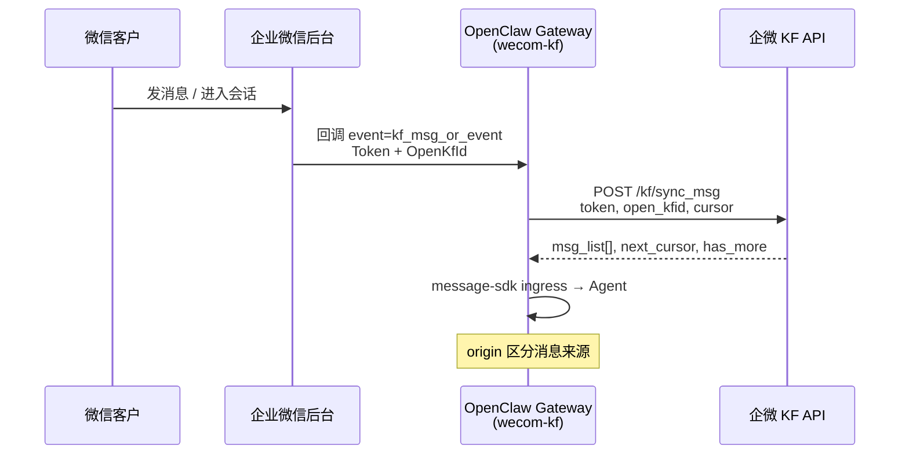
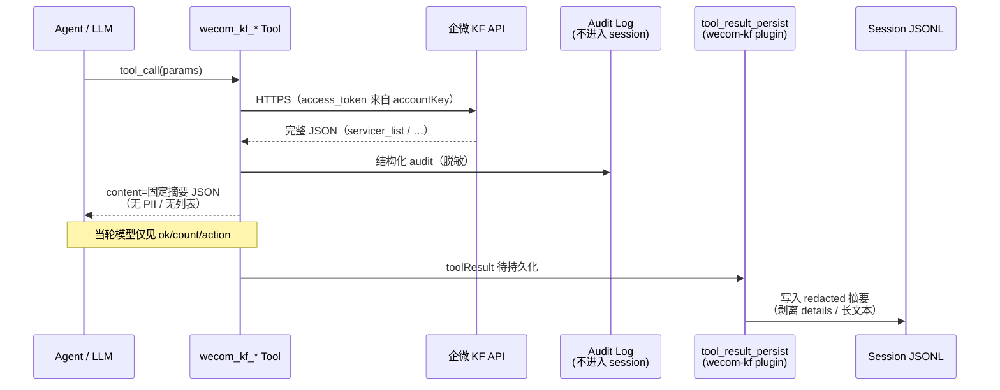

# 微信客服（WeCom KF）Tools 架构与设计

> 文档版本：2026-05-24  
> 适用范围：`@partme.ai/wecom-kf`（`extensions/wecom-kf`）  
> 关联代码：`openclaw-plugins/extensions/wecom-kf/src/kf/tools.ts`、`index.ts`  
> 官方文档：[94638 概述](https://developer.work.weixin.qq.com/document/path/94638) · [94670 接收消息](https://developer.work.weixin.qq.com/document/path/94670) · [94677 发送消息](https://developer.work.weixin.qq.com/document/path/94677) · [95122 事件响应消息](https://developer.work.weixin.qq.com/document/path/95122) · [97712 回调通知](https://developer.work.weixin.qq.com/document/path/97712)

**本文档为设计交付物，不含业务实现代码。** 目标：为客服智能体提供 **行为控制类** `wecom_kf_*` Tools（查列表、转人工等），并严格保证 Tool 拉取的数据 **不进入 LLM 会话上下文**。

---

## 0. 设计约束与边界

| 约束 | 说明 |
|------|------|
| **独立于 wecom** | `wecom-kf` 与 `wecom` / `wecom-cs` 分插件；共用 `@partme.ai/openclaw-message-sdk` 的 ingress、reply、dedup 等能力 |
| **行为控制 Tools** | 四个企微 API（94645/94661/94665/94669）封装为 Agent Tools，供智能体触发「查接待人员 / 查账号 / 拿链接 / 转会话」 |
| **会话隔离（硬约束）** | Tool 返回的 **原始 API 数据不得进入** LLM prompt、session transcript（JSONL）、compaction 上下文 |
| **message-sdk 职责** | 入站消息编排、回复管道、去重；**不**承担 KF 管理 API 的 Tool 封装 |
| **与 wecom_kf_mcp 分工** | `wecom_kf_mcp` 为通用 MCP 代理（doc/contact 等）；本设计为 **KF 专用、可审计、可隔离** 的一等 Tools |

### 0.1 现状快照（实现前）

`index.ts` 已注册 5 个 KF Tools + `wecom_kf_mcp`：

```96:101:openclaw-plugins/extensions/wecom-kf/index.ts
    // ── KF Agent Tools (客服行为) ──
    api.registerTool(createKfServicerListTool(), { name: "wecom_kf_servicer_list", optional: true });
    api.registerTool(createKfAccountListTool(), { name: "wecom_kf_account_list", optional: true });
    api.registerTool(createKfAccountLinkTool(), { name: "wecom_kf_account_link", optional: true });
    api.registerTool(createKfSessionStatusTool(), { name: "wecom_kf_session_status", optional: true });
    api.registerTool(createKfSessionTransferTool(), { name: "wecom_kf_session_transfer", optional: true });
```

**已知差距（Phase 1 需修复）：**

1. Tool 工厂未接收 `OpenClawPluginToolContext`，`execute` 内硬编码 `defaultAccount` 解析凭证  
2. `execute` 将完整 API 响应格式化为长文本写入 `content`，**违反会话隔离**  
3. 命名与本文推荐清单不完全一致（见 §3）

---

## 1. 微信客服原理摘要

> 参考：94638 / 94670 / 94677 / 95122 / 97712

### 1.1 产品定位与 API 管理模式

- 微信客服面向 **微信内/外** 多场景咨询；企业可在管理后台将指定 `open_kfid` 设为 **「通过 API 管理」**。
- 设为 API 管理后，该账号的消息与事件 **全部回调给企业**，原生接待规则暂不生效，企业须自行 **拉取消息、分配会话、收发消息**。
- 调用方应用须配置在「微信客服 → 可调用接口的应用」；接待人员须在应用 **可见范围** 内（否则 `60030`）。

### 1.2 Hybrid 推送 + 拉取（94670）



**要点：**

| 概念 | 说明 |
|------|------|
| **回调事件** | `MsgType=event`, `Event=kf_msg_or_event`；携带 `Token`（10 分钟有效）、`OpenKfId` |
| **sync_msg** | `POST /cgi-bin/kf/sync_msg`；应用 `token` 可放宽频率限制；应用 `cursor` 增量拉取 |
| **origin** | `3` 客户消息 · `4` 系统事件 · `5` 接待人员在企业微信客户端发送 |
| **servicer_userid** | 仅 `origin=5` 时返回当前接待人员 userid |
| **97712 回调** | 除消息外还有 `kf_account_auth_change`（客服账号授权增删）等管理类事件 |

OpenClaw `wecom-kf` 在 `callback.ts` / `monitor.ts` 处理 KF 回调，经 message-sdk 将 **客户可见对话** 送入 Agent；**管理类 API 结果不应反向污染该对话上下文**（§4）。

### 1.3 send_msg vs send_msg_on_event（94677 / 95122）

| 维度 | `send_msg`（94677） | `send_msg_on_event`（95122） |
|------|---------------------|------------------------------|
| **用途** | 智能助手/未处理状态下 **主动回复客户** | 特定 **事件场景** 的响应语（欢迎语、排队语、结束语等） |
| **凭证** | `touser` + `open_kfid` + `msgtype` | 一次性 `code`（来自事件或 `service_state/trans` 返回的 `msg_code`） |
| **条数/时效** | 客户发消息后 48h 内最多 5 条 | 按场景：欢迎语 20s/1 条；排队/接入 48h/1 条；结束 20s/1 条 |
| **与 Tools 关系** | **非** 本设计四个 Tool 的直接映射；由 reply 管道 / ics event-messages 处理 | 转人工/进池/结束时 `trans` 返回 `msg_code`，可触发 `send_msg_on_event`（Phase 3） |

**设计原则：** 四个 `wecom_kf_*` Tools 聚焦 **会话路由与资源发现**；对客户可见话术仍走现有 outbound / event-messages，避免 Tool 返回话术正文进入 transcript。

---

## 2. 四个 API 能力说明与参数

### 2.1 获取接待人员列表 — 94645

| 项 | 内容 |
|----|------|
| **方法** | `GET /cgi-bin/kf/servicer/list?access_token=…&open_kfid=…` |
| **必填** | `open_kfid` |
| **响应** | `servicer_list[]`：`userid` + `status`（0 接待中 / 1 停止接待）；或 `department_id`（部门接待） |
| **扩展字段** | `stop_type`（停止接待子类型：0 停止 / 1 挂起） |
| **权限** | 应用可见范围内；需该客服账号管理权限 |
| **与转人工** | `trans` 到 `service_state=3` 时，`servicer_userid` 须为 **status=0（接待中）** 且企业微信已激活（否则 `95014`） |

**常见 errcode：** `60011` 无权限 · `60030` 不在可见范围 · `95000` 不合法的 open_kfid

### 2.2 获取客服账号列表 — 94661

| 项 | 内容 |
|----|------|
| **方法** | `POST /cgi-bin/kf/account/list` |
| **Body** | `offset`（默认 0）· `limit`（1–100，默认 100） |
| **响应** | `account_list[]`：`open_kfid`, `name`, `avatar`, `manage_privilege` |
| **分页** | 当返回条数 `< limit` 时结束 |
| **与转人工** | 智能体通常 **不** 需全量账号；用于运维/多账号路由配置校验 |

### 2.3 获取客服账号链接 — 94665

| 项 | 内容 |
|----|------|
| **方法** | `POST /cgi-bin/kf/add_contact_way` |
| **Body** | `open_kfid`（必填）· `scene`（可选，≤32 字节，`[0-9a-zA-Z_-]*`） |
| **响应** | `url` — 可嵌入 H5；若带 `scene` 可拼接 `scene_param=`（urlencode，原始 ≤128 字节） |
| **约束** | 返回链接 **不可改参复制** 到其他链接，否则进入会话校验失败 |
| **与转人工** | 无直接关系；用于 **拉新/分渠道**，非当前会话操作 |

### 2.4 分配客服会话 — 94669

包含 **查询** 与 **变更** 两个子接口：

#### 2.4.1 获取会话状态 `service_state/get`

| Body | `open_kfid`, `external_userid` |
|------|--------------------------------|
| 响应 | `service_state`, `servicer_userid`（仅 state=3 有效） |

#### 2.4.2 变更会话状态 `service_state/trans`（转人工核心）

| Body | 说明 |
|------|------|
| `open_kfid` | 客服账号 ID |
| `external_userid` | 微信客户 external_userid |
| `service_state` | 目标状态（见下表） |
| `servicer_userid` | **state=3 必填**；须为接待中且已激活 |

**会话状态机：**

| service_state | 名称 | 典型 Tool 用途 |
|:--:|------|----------------|
| 0 | 未处理 | 新客户首条消息（通常由 sync_msg 驱动，非 Tool） |
| 1 | 智能助手接待 | 机器人继续接待 |
| 2 | 待接入池排队 | 转排队 + 可选 `msg_code` 发排队语 |
| 3 | 人工接待 | **转人工**（需 `servicer_userid`） |
| 4 | 已结束/未开始 | 结束会话；返回 `msg_code` 可发结束语 |

**trans 成功响应：** `msg_code` — 用于 95122 `send_msg_on_event`（Phase 3 与 ics event-messages 联动）。

**常见 errcode：** `95013` 会话状态不允许该变更 · `95014` 接待人员未激活 · `95015` 接待人员不在接待中 · `95016` 会话已结束

### 2.5 获取客户基础信息 — 95159（Tool 策略）

| 项 | 内容 |
|----|------|
| **方法** | `POST /cgi-bin/kf/customer/batchget` |
| **Body** | `external_userid_list`（1–100）· `need_enter_session_context`（0/1） |
| **响应** | `nickname`, `avatar`, `gender`, `unionid`, `enter_session_context`（scene / scene_param / 视频号信息） |
| **限制** | external_userid 须为 **48h 内** 有进入会话或发过消息的客户，否则进 `invalid_external_userid` |

**是否做 Tool？** **建议默认不做会话内 Tool**，理由：

1. 返回 **PII**（昵称、unionid、进入场景），与「Tool 数据不进 session」冲突最大  
2. 智能体接待所需上下文应来自 **sync_msg 客户消息本身**，而非 batchget  
3. 若运营/审计需要，采用 **独立 ephemeral 路径**（§4.4）

---

## 3. Tool 清单设计

### 3.1 命名规范

- 前缀：`wecom_kf_`  
- 动词在后：`list_*` / `get_*` / `transfer_*`  
- 与现有代码别名关系：

| 推荐名（本文） | 现有实现名 | 动作 |
|----------------|------------|------|
| `wecom_kf_list_servicers` | `wecom_kf_servicer_list` | 94645 |
| `wecom_kf_list_accounts` | `wecom_kf_account_list` | 94661 |
| `wecom_kf_get_account_link` | `wecom_kf_account_link` | 94665 |
| `wecom_kf_transfer_session` | `wecom_kf_session_transfer` | 94669 trans |
| — | `wecom_kf_session_status` | 94669 get（辅助，可选保留） |

Phase 1 建议：**注册推荐名**，旧名作为 deprecated alias 保留一版或仅文档说明。

### 3.2 Tool 详细定义

#### `wecom_kf_list_servicers`

| 属性 | 值 |
|------|-----|
| **description** | 查询指定客服账号的可接待人员（不含客户 PII）。仅用于转人工前确认是否有在线坐席；返回摘要，不含 userid 列表。 |
| **input schema** | `{ "open_kfid": "string?" }` — 省略时使用当前会话绑定的 open_kfid |
| **只读** | ✅ |
| **副作用** | 无；可更新进程内 `servicerCache`（`accounts.ts`）供路由，**cache 不进 session** |
| **Agent 可见返回** | `{ "ok": true, "online_count": 2, "total_count": 5 }` 或 `{ "ok": false, "error_code": 60030, "error": "…" }` |

#### `wecom_kf_list_accounts`

| 属性 | 值 |
|------|-----|
| **description** | 分页查询企业客服账号摘要（名称与 open_kfid 计数）。不返回 avatar URL 与完整列表文本。 |
| **input schema** | `{ "offset": "number?", "limit": "number?" }` |
| **只读** | ✅ |
| **副作用** | 无 |
| **Agent 可见返回** | `{ "ok": true, "count": 3, "has_more": false }` |

#### `wecom_kf_get_account_link`

| 属性 | 值 |
|------|-----|
| **description** | 生成客服账号咨询链接。链接仅通过 outbound/运营通道下发，Tool 不向模型返回完整 URL。 |
| **input schema** | `{ "open_kfid": "string?", "scene": "string?" }` |
| **只读** | ✅（企微侧会创建 contact_way，视为可重复生成的配置型资源） |
| **副作用** | 无会话状态变更；完整 URL 写入 **audit log** |
| **Agent 可见返回** | `{ "ok": true, "link_ready": true, "scene": "presale" }` |

#### `wecom_kf_transfer_session`

| 属性 | 值 |
|------|-----|
| **description** | 变更当前客户会话状态：转人工(3)、排队(2)、交还智能助手(1)、结束(4)。不返回 msg_code 明文给模型。 |
| **input schema** | `{ "service_state": "number", "servicer_userid": "string?" }` — `open_kfid` / `external_userid` **禁止**由模型传入，从 CallContext 注入 |
| **只读** | ❌ 写操作 |
| **副作用** | 调用 `service_state/trans`；可能触发企微侧会话事件；`msg_code` 交 ics/event-messages 消费 |
| **Agent 可见返回** | `{ "ok": true, "new_state": 3, "action": "transferred_to_human" }` |

#### （可选）`wecom_kf_get_session_status`

| 属性 | 值 |
|------|-----|
| **description** | 查询当前会话状态枚举值，不返回 servicer_userid。 |
| **input schema** | `{}` — 上下文注入 open_kfid + external_userid |
| **只读** | ✅ |
| **Agent 可见返回** | `{ "ok": true, "service_state": 1, "state_label": "smart_assistant" }` |

### 3.3 Tool 注册方式（目标态）

参照 `wecom` 插件的 **工厂 + CallContext** 模式：

```typescript
// 目标：index.ts（设计示意，非实现）
api.registerTool(
  (ctx: OpenClawPluginToolContext) => createWecomKfToolBundle(ctx),
  { names: [
    "wecom_kf_list_servicers",
    "wecom_kf_list_accounts",
    "wecom_kf_get_account_link",
    "wecom_kf_transfer_session",
  ], optional: true },
);
```

每个 factory 从 `ctx` 读取：

- `messageChannel === "wecom-kf"`  
- `agentAccountId` → `resolveWecomAccount(cfg, accountId)`  
- `sessionKey` / `requesterSenderId` → 当前 `external_userid`（仅服务端填充）

---

## 4. 会话隔离架构（核心）

### 4.1 威胁模型：数据为何会被注入会话？

OpenClaw Agent 循环中，Tool `execute()` 返回值会：

1. **当轮** — 作为 `toolResult` 消息送回 **LLM**（模型可见）  
2. **持久化** — 写入 session JSONL，后续 turn / compaction **再次进入 prompt**  
3. **可观测** — `after_tool_call` hook、trajectory、Prometheus 等

当前 `kf/tools.ts` 的 `textResult()` 把 API 全文塞进 `content[].text`，**三层全泄露**。

```75:77:openclaw-plugins/extensions/wecom-kf/src/kf/tools.ts
function textResult(text: string): { content: Array<{ type: "text"; text: string }>; details: Record<string, unknown> } {
  return { content: [{ type: "text", text }], details: {} };
}
```

### 4.2 OpenClaw 平台能力调研

| 机制 | 位置 | 能否隔离 KF Tool 数据 | 说明 |
|------|------|------------------------|------|
| `OpenClawPluginToolOptions` | plugin-sdk | ❌ 无 `visibleToAgent` | 仅 `name` / `names` / `optional` |
| `execute()` 返回值 `content` | Tool 实现 | ⚠️ 当轮 LLM 仍可见 | 必须返回 **红acted 摘要** |
| `execute()` 返回值 `details` | Tool 实现 | ⚠️ 默认会 persist | 需配合 `tool_result_persist` 剥离 |
| **`tool_result_persist` hook** | OpenClaw Core | ✅ **推荐** | 持久化前改写/剥离 toolResult |
| **`before_message_write` hook** | OpenClaw Core | ✅ 兜底 | `block: true` 或替换 message |
| **`after_tool_call` hook** | OpenClaw Core | ⚠️ 仅观测 | 不能阻止当轮 LLM 看到 result |
| **`before_tool_call` hook** | OpenClaw Core | ⚠️ 参数审计 | 可阻止非法参数，不解决返回值 |
| MCP interceptor | wecom_kf_mcp | ❌ 不适用 | 通用 MCP，无 KF 隔离语义 |
| message-sdk | 共用库 | ❌ | 无 tool transcript 钩子 |

`tool_result_persist` 契约（OpenClaw Core）：

```2185:2199:research/openclaw-zero-token/src/plugins/types.ts
export type PluginHookToolResultPersistEvent = {
  toolName?: string;
  toolCallId?: string;
  message: AgentMessage;
  isSynthetic?: boolean;
};
export type PluginHookToolResultPersistResult = {
  message?: AgentMessage;
};
```

测试用例证实：可在 persist 前 **删除 `details`、替换 `content`**。

### 4.3 推荐方案：三层隔离（Redacted Execute + Persist Hook + Audit Side-channel）



**Layer A — Execute 红acted 返回（必须）**

- `content`: 仅 **结构化摘要**（见 §3.2），禁止 userid 列表、URL、nickname  
- `details`: **留空** 或仅 `{ "audit_ref": "uuid" }`  
- 完整 API 响应 → **Audit**（结构化 log / 可选 ICS stats）

**Layer B — `tool_result_persist`（必须）**

在 `wecom-kf/index.ts` 注册：

```typescript
// 设计示意
const KF_CONTROL_TOOLS = new Set([
  "wecom_kf_list_servicers", "wecom_kf_servicer_list",
  "wecom_kf_list_accounts", "wecom_kf_account_list",
  // …
]);

api.on("tool_result_persist", (event) => {
  if (!event.toolName || !KF_CONTROL_TOOLS.has(event.toolName)) return;
  const msg = event.message;
  return {
    message: {
      ...msg,
      content: [{ type: "text", text: "[wecom-kf action recorded]" }],
      details: undefined,
    },
  };
}, { priority: 100 });
```

**Layer C — `before_message_write` 兜底（可选）**

对 `role=toolResult` 且 toolName 匹配且 content 超长 / 含敏感 pattern 时 `block` 或强制替换。

**Layer D — 副作用与 msg_code 旁路**

- `transfer_session` 成功后，`msg_code` **仅** 写入进程内 `KfSessionSideEffectStore`（key = sessionKey）  
- `ics-handlers/event-messages` 或 outbound 在 **同 run 后续阶段** 读取并调用 `send_msg_on_event`  
- **禁止** 将 `msg_code` 返回给 LLM

### 4.4 95159 客户基础信息：Ephemeral Tool 策略

若未来需要：

| 方案 | 做法 | 进 session？ |
|------|------|:--:|
| **A. 不做 Tool** | 在 sync_msg ingress 提取必要字段 → dialogue state（已有 `DIALOGUE_SESSION_NAMESPACE`） | 可控 |
| **B. Ephemeral admin tool** | 独立 `wecom_kf_admin_customer_peek`，仅 owner CLI / ICS REST 调用，**不注册为 Agent optional tool** | ❌ |
| **C. 红acted + 严格 hook** | 同 §4.3，仅返回 `{ "has_profile": true }` | 摘要 only |

**推荐：A + B** — 会话内用 state flow；运营排查走 ICS REST，不走 LLM Tool。

### 4.5 与 wecom_kf_mcp 的隔离

- `wecom_kf_mcp` **call** 路径仍可能把 MCP JSON 全文返回模型  
- 客服 Agent 的 **tool allowlist** 应 **仅启用** `wecom_kf_*` 控制类 Tools，禁用或从 profile 移除 `wecom_kf_mcp`（除非明确需要 doc 能力且接受 transcript 策略）  
- 文档化到各 `agents/*/TOOLS.md`

---

## 5. 与多账号模型关系

### 5.1 配置模型（channels.wecom-kf）

`accounts.ts` 已定义 **matrix 多账号**：

```28:38:openclaw-plugins/extensions/wecom-kf/src/config/accounts.ts
export type ResolvedKfAccount = {
    accountKey: string;
    agentId: string;
    openKfId: string;
    config: WecomAccountConfig;
};
```

- **`accountKey`**：`channels.wecom-kf.accounts.{accountKey}` 配置键  
- **`open_kfid`**：企微客服账号 ID；`resolveKfAccountByOpenKfId` 反查 accountKey  
- **`agentId`**：OpenClaw Agent 绑定（一 open_kfid 一 Agent）

每账号独立：`corpId` + `corpSecret`（或 agent 子配置）→ **独立 access_token**。

### 5.2 CallContext 注入规则

| 字段 | 来源 | 用途 |
|------|------|------|
| `ctx.agentAccountId` | 路由 / binding | `resolveWecomAccount(cfg, accountId)` 取 token |
| `ctx.messageChannel` | 固定 `wecom-kf` | 安全校验：非本 channel 拒绝执行写操作 |
| `ctx.sessionKey` | OpenClaw session | side-effect store、audit 关联 |
| `ctx.requesterSenderId` | 入站 external_userid | **禁止** Tool args 覆盖 |
| `open_kfid` | `resolveKfAccountByOpenKfId` 或 session 元数据 | API 必填参数 |

**安全规则：**

1. `external_userid`、`open_kfid` **仅** Trust boundary 注入；schema 中 **不提供** 或可選但 **忽略用户传入**  
2. 写操作 `transfer_session` 需校验当前 `service_state` 允许转移（可先 `get` 再 `trans`，get 结果也不进 session）

### 5.3 接待人员列表与账号缓存

- `cacheServicers(openKfId, list)` / `getOnlineServicers` 已存在于 `accounts.ts`  
- Tool 可将 API 结果写 cache 供 **转人工策略** 选 userid；LLM 只见 `online_count`  
- 转人工时 **服务端** 从 cache 或 API 选坐席（轮询 / 绑定表 / 意图路由），**不由模型指定 userid**（除非未来受控 optional 参数 + 白名单）

---

## 6. 实现阶段划分

### Phase 1 — 隔离基线 + Context 正确性（P0）

| # | 任务 | 产出 |
|---|------|------|
| 1.1 | Tool 改为 `OpenClawPluginToolFactory`，接入 `agentAccountId` / session 注入 | `kf/tools.ts` 重构 |
| 1.2 | 实现 **Redacted Execute** 摘要返回；删除长文本格式化 | 摘要 JSON schema |
| 1.3 | 注册 `tool_result_persist` + 单元测试（仿 OpenClaw guard test） | `index.ts` + test |
| 1.4 | 统一命名为 `wecom_kf_list_*` / `get_*` / `transfer_*` | 注册表更新 |
| 1.5 | Audit logger（info 级，脱敏 userid/url） | `kf/audit.ts` |

**验收：** Agent transcript 中搜索不到 `wk`/`wm` 开头的 id、完整 URL、接待人员列表。

### Phase 2 — 转人工闭环 + Cache（P1）

| # | 任务 | 产出 |
|---|------|------|
| 2.1 | `transfer_session` 服务端选坐席（online servicer + 策略） | `kf/transfer-policy.ts` |
| 2.2 | `KfSessionSideEffectStore` 保存 `msg_code` | 与 event-messages 对接 |
| 2.3 | 同步 servicer cache（list_servicers 或 webhook 触发） | 复用 `cacheServicers` |
| 2.4 | 错误码映射与用户友好话术（出站层，非 tool result） | handler 集成 |

**验收：** 智能体说「转人工」→ Tool 成功 → 客户侧进入人工态；模型下一轮不知道坐席 userid。

### Phase 3 — 运营能力与观测（P2）

| # | 任务 | 产出 |
|---|------|------|
| 3.1 | `get_account_link` 链接触发 outbound 卡片（非 tool 文本） | outbound 扩展 |
| 3.2 | ICS stats 汇总 Tool 调用次数 / 转人工成功率 | `ics-handlers/stats.ts` |
| 3.3 | 95159 仅 ICS REST admin 端点（optional） | 新 handler |
| 3.4 | `agents/*/TOOLS.md` 与 allowlist 文档 | 运维文档 |

---

## 7. 附录

### 7.1 官方文档索引

| Doc ID | 标题 | URL |
|--------|------|-----|
| 94638 | 概述 | https://developer.work.weixin.qq.com/document/path/94638 |
| 94670 | 接收消息和事件 | https://developer.work.weixin.qq.com/document/path/94670 |
| 94677 | 发送消息 | https://developer.work.weixin.qq.com/document/path/94677 |
| 95122 | 事件响应消息 | https://developer.work.weixin.qq.com/document/path/95122 |
| 95159 | 获取客户基础信息 | https://developer.work.weixin.qq.com/document/path/95159 |
| 97712 | 回调通知 | https://developer.work.weixin.qq.com/document/path/97712 |
| 94645 | 获取接待人员列表 | https://developer.work.weixin.qq.com/document/path/94645 |
| 94661 | 获取客服账号列表 | https://developer.work.weixin.qq.com/document/path/94661 |
| 94665 | 获取客服账号链接 | https://developer.work.weixin.qq.com/document/path/94665 |
| 94669 | 分配客服会话 | https://developer.work.weixin.qq.com/document/path/94669 |

### 7.2 相关仓库路径

| 路径 | 说明 |
|------|------|
| `extensions/wecom-kf/src/kf/tools.ts` | KF Tools 实现（待按本文重构） |
| `extensions/wecom-kf/index.ts` | Tool 注册与 hook |
| `extensions/wecom-kf/src/config/accounts.ts` | 多账号 / open_kfid 解析 |
| `extensions/message-sdk/` | 共用 ingress / reply |
| `research/openclaw-zero-token/src/agents/session-tool-result-guard*.ts` | transcript 持久化参考 |

---

*文档结束 — 实现请交由 Phase 1 Agent 按 §6 执行。*
