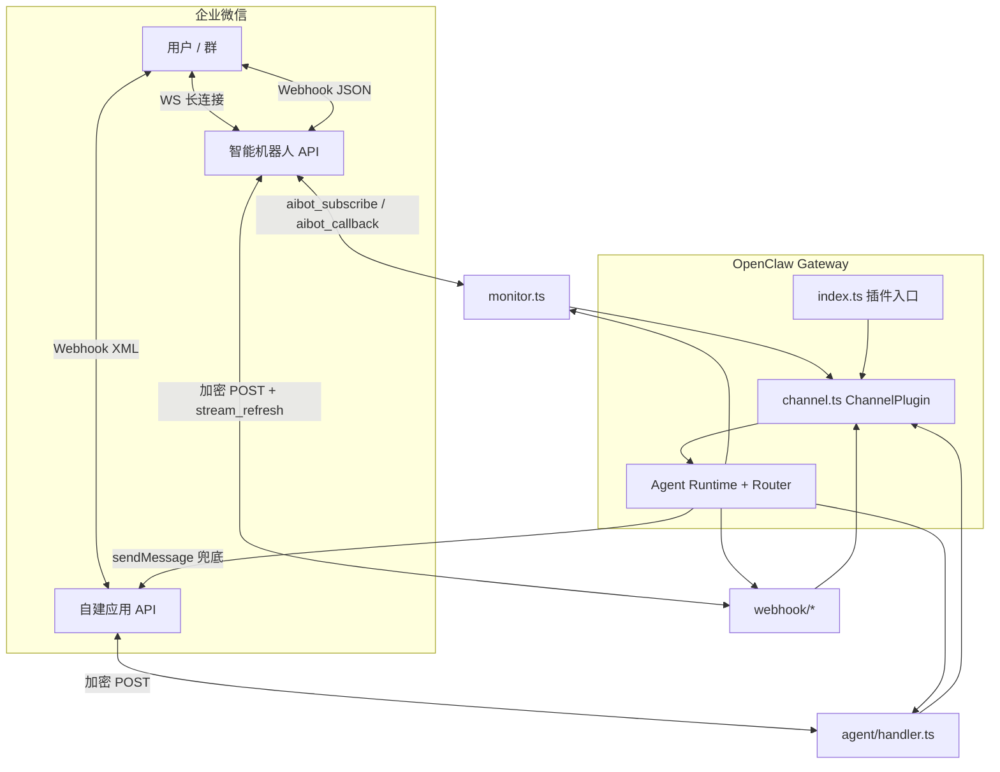
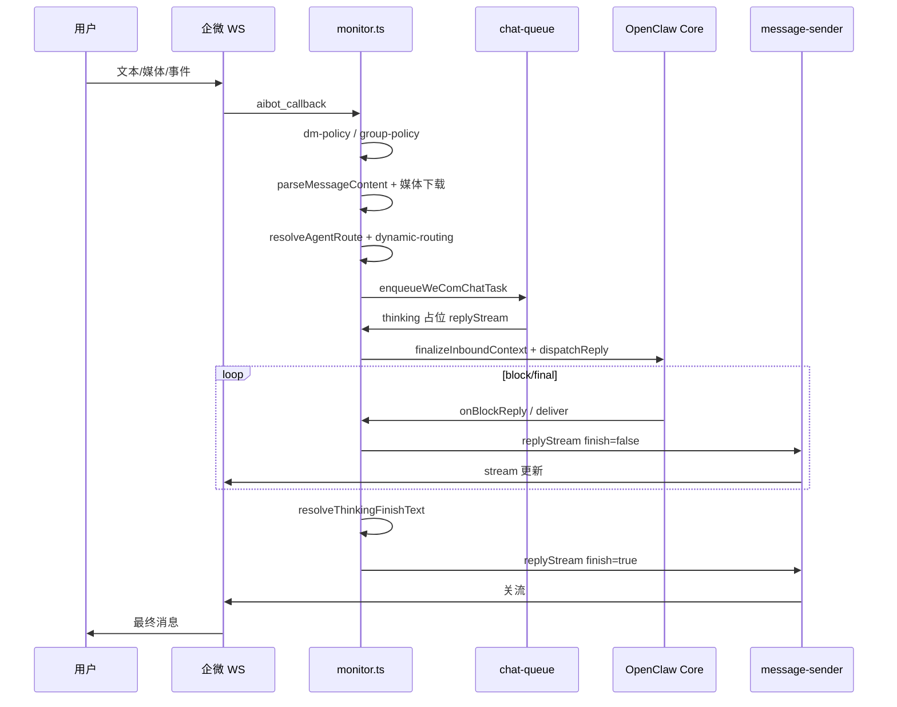
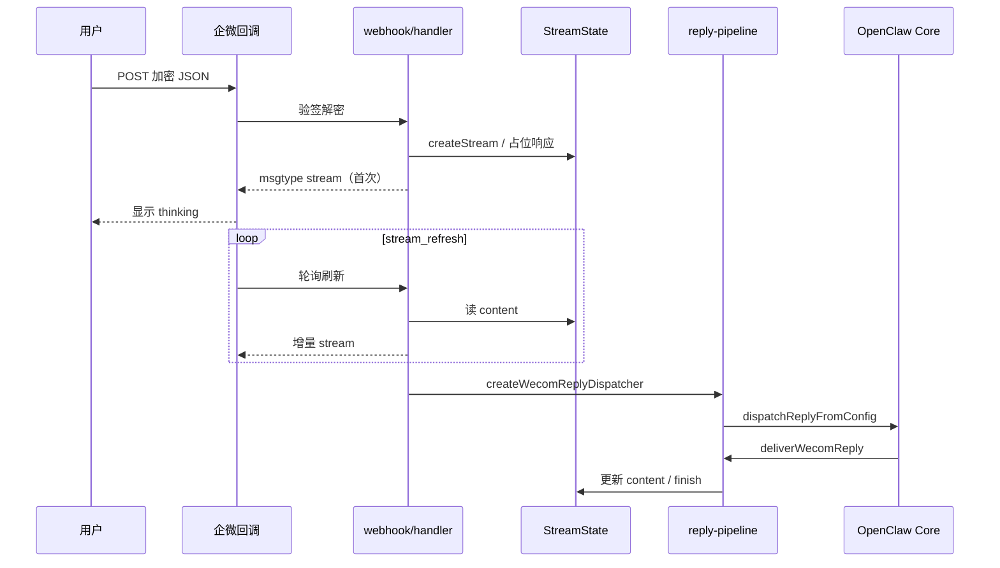
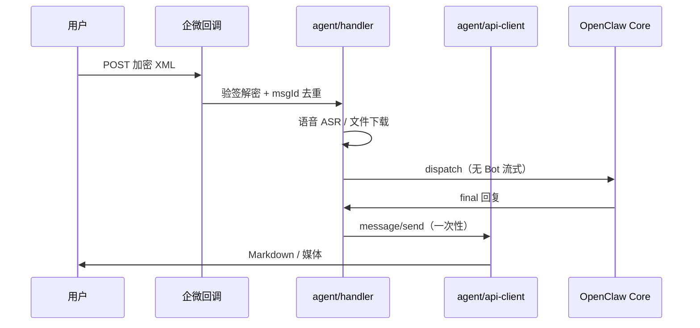

# 企业微信（WeCom）插件架构设计

> 文档版本：2026-05-23  
> 适用范围：`@partme.ai/wecom`（`extensions/wecom`）  
> 关联代码：`openclaw-plugins/extensions/wecom/src/`

本文是 WeCom 通道插件的**总览架构文档**，涵盖双模式设计、源码模块、入站主流程与流式输出概要。配置细节见 [Configuration](./OpenClaw-WeCom-Configuration.md)；流式协议、状态机与演进路线见 [Streaming Architecture](./OpenClaw-WeCom-Streaming-Architecture.md)。

---

## 1. 插件在 OpenClaw 中的位置

```
OpenClaw Gateway
       │
       ├── ChannelPlugin（wecomPlugin @ channel.ts）
       │     gateway.startAccount → Bot WS / Bot Webhook / Agent Webhook
       │     outbound.sendText / sendMedia → Bot 优先，Agent 兜底
       │
       ├── defineChannelPluginEntry（index.ts）
       │     registerTool(wecom_mcp)
       │     registerHttpRoute（Bot / Agent / wecom-media）
       │     before_prompt_build（MEDIA: / 模板卡片提示）
       │
       └── OpenClaw Core
             resolveAgentRoute → Agent Runtime → block/final 回复
```

**npm 包**：`@partme.ai/wecom`  
**渠道 ID**：`wecom`（别名：wechatwork、wework、qywx）  
**核心依赖**：`@wecom/aibot-node-sdk`（Bot WS）、`@partme.ai/openclaw-message-sdk`（可选桥接）

---

## 2. 双模式架构

企业微信插件同时支持 **Bot（智能机器人）** 与 **Agent（自建应用）**。二者可独立启用，也可在同一 `accountId` 下组合：**Bot 负责对话与流式，Agent 负责主动推送与出站兜底**。

### 2.1 模式对比

| 维度 | Bot（智能机器人） | Agent（自建应用） |
|------|-------------------|-------------------|
| 连接 | WebSocket（默认）或 HTTP Webhook | HTTP Webhook（加密 XML） |
| 消息格式 | JSON（WS / Webhook） | XML + AES-256-CBC |
| 群聊 | ✅ @机器人 | ❌ 仅私聊 |
| 流式回复 | ✅ `replyStream` / Webhook `stream` | ❌ 一次性发送 |
| 主动推送 | ❌ | ✅ 用户 / 部门 / 标签 / Cron |
| 公网 IP | WS 模式通常不需要 | 回调 URL 需要 |
| 典型凭证 | `botId` + `secret` 或 `token` + `encodingAESKey` | `corpId` + `corpSecret` + `agentId` + `token` + `encodingAESKey` |

### 2.2 拓扑图



### 2.3 连接模式（Bot 子模式）

| `connectionMode` | 凭证 | 启动路径（`channel.gateway.startAccount`） |
|------------------|------|------------------------------------------|
| `websocket`（默认） | `botId` + `secret` | `monitorWeComProvider()` → `@wecom/aibot-node-sdk` WSClient |
| `webhook` | `token` + `encodingAESKey` | `startWebhookGateway()` → `webhook/handler.ts` |

Agent 与 Bot **并行注册**：只要 `agent.configured`，即注册 `/plugins/wecom/agent/*`；只要存在 `botId`+`secret` 或 webhook 凭证，即启动对应 Bot 路径。

### 2.4 出站策略：Bot 优先，Agent 兜底

`channel.ts` 中 `outbound.sendText` / `sendMedia` 统一逻辑：

1. 若当前账号 **Bot WebSocket 已连接** → 经 WS 发送（Markdown / 媒体上传）
2. 否则若 **Agent 已配置** → 调用 `agent/api-client.ts`（`gettoken` → `message/send` / `media/upload`）
3. 否则抛出配置错误

Cron、CLI 主动投递等场景依赖 Agent 通道；对话回复优先走 Bot 流式。

### 2.5 HTTP 路由一览

注册于 `index.ts` + `channel.gateway.startAccount`：

| 路径 | 模式 | 说明 |
|------|------|------|
| `/plugins/wecom/bot`、 `/plugins/wecom/bot/<accountId>` | Bot Webhook | 推荐 |
| `/wecom`、`/wecom/bot` | Bot | 历史兼容 |
| `/plugins/wecom/agent`、 `/plugins/wecom/agent/<accountId>` | Agent | 推荐 |
| `/wecom/agent` | Agent | 历史兼容 |
| `/wecom-media` | 媒体 | 临时媒体 HTTP 访问 |

---

## 3. 源码模块地图

```
extensions/wecom/
├── index.ts                 # defineChannelPluginEntry：MCP、HTTP 路由、prompt 注入
├── channel.ts               # ChannelPlugin：账号、安全、出站、gateway.startAccount
├── const.ts                 # 渠道 ID、超时、Webhook 路径、媒体上限
├── interface.ts             # MessageState、WeComCallbackMessage 等类型
├── utils.ts / config.ts     # 配置解析、账号 merge
├── accounts.ts              # 多账号 list / resolve
│
├── monitor.ts               # ★ Bot WebSocket 主流程（~1400 行）
├── message-sender.ts        # replyStream / 846608 降级
├── message-parser.ts        # 入站 JSON 解析
├── media-handler.ts         # 入站媒体下载
├── chat-queue.ts            # 同会话串行队列（accountId:chatId）
├── state-manager.ts         # WS 实例、MessageState、session ↔ chatId
├── finish-thinking.ts       # 关流最终文案 resolveThinkingFinishText
├── streaming-config.ts      # streaming / footer / templates 解析
├── templates.ts             # 用户可见文案模板
├── dynamic-routing.ts       # 动态 Agent 注入
├── dynamic-agent.ts         # per-user / per-group agentId 生成
├── dm-policy.ts / group-policy.ts
│
├── webhook/                 # Bot HTTP Webhook
│   ├── index.ts / gateway.ts
│   ├── handler.ts           # 解密、路由、stream_refresh
│   ├── monitor.ts           # 入站处理、防抖、Agent 调度
│   ├── reply-pipeline.ts    # OpenClaw createChannelMessageReplyPipeline 适配
│   ├── state.ts             # StreamState Map
│   ├── helpers.ts           # buildStreamResponse、占位符
│   ├── dedup.ts             # msgId 去重
│   └── types.ts             # StreamState、STREAM_MAX_BYTES
│
├── agent/                   # Agent 自建应用
│   ├── handler.ts           # XML 入站、ASR、文件预览、msgId 去重
│   ├── api-client.ts        # gettoken、send、upload、download
│   ├── webhook.ts           # registerAgentWebhookTarget
│   └── stream.ts            # Agent 侧非 Bot 流式占位（文本 fallback）
│
├── outbound/
│   ├── reply-deliver.ts     # Webhook deliverWecomReply
│   └── media-deliver.ts     # 媒体批量发送
│
├── transport/server.ts      # HTTP handler 胶水
├── mcp/                     # wecom_mcp 工具 + 拦截器链
├── template-card-*.ts       # 模板卡片解析与事件
├── onboarding.ts            # CLI 配置向导
└── skills/                  # 11 个内置 Skill（manifest）
```

### 3.1 模块职责速查

| 层级 | 模块 | 职责 |
|------|------|------|
| 入口 | `index.ts` | 插件注册、MCP、路由、`before_prompt_build` |
| 契约 | `channel.ts` | OpenClaw ChannelPlugin 全量实现 |
| Bot WS | `monitor.ts` | WS 连接、入站、策略、dispatch、流式关流 |
| Bot WH | `webhook/monitor.ts` | JSON 入站、StreamState、reply-pipeline |
| Agent | `agent/handler.ts` | XML 入站、媒体、欢迎语、去重 |
| 出站 | `message-sender.ts`、`outbound/*`、`agent/api-client.ts` | 三路径统一交付 |
| 状态 | `state-manager.ts`、`webhook/state.ts` | MessageState / StreamState |
| 流式配置 | `streaming-config.ts`、`finish-thinking.ts` | 开关解析、关流文案 |
| 横切 | `chat-queue.ts`、`dynamic-routing.ts` | 串行化、动态 Agent |

---

## 4. 入站消息主流程

### 4.1 Bot WebSocket（默认路径）



**关键步骤说明**

| 步骤 | 模块 | 说明 |
|------|------|------|
| 1. 连接 | `monitor.ts` | `WSClient` + `aibot_subscribe`；心跳 30s；最多 10 次重连 |
| 2. 策略 | `dm-policy.ts`、`group-policy.ts` | open / pairing / allowlist / disabled |
| 3. 解析 | `message-parser.ts`、`media-handler.ts` | mixed、引用、图片/文件落盘 |
| 4. 路由 | `dynamic-routing.ts` | 可选 per-user/per-group Agent |
| 5. 串行 | `chat-queue.ts` | 同一 `accountId:chatId` 排队，避免并发乱序 |
| 6. 占位 | `monitor.ts` | `THINKING_MESSAGE`，受 `sendThinkingMessage` 控制 |
| 7. 调度 | OpenClaw SDK | `dispatchReplyWithBufferedBlockDispatcher` |
| 8. 增量 | `streaming-config.ts` | `syncWecomStreamContent` 拼 status + answer |
| 9. 关流 | `finish-thinking.ts` | 空回复 / 媒体 / 错误均有可见兜底文案 |
| 10. 降级 | `message-sender.ts` | errcode **846608** → `sendMessage` 主动发送 |

**MessageState**（`interface.ts`）在 WS 路径跟踪：`accumulatedText`、`streamId`、`hasMedia`、`streamExpired`、`dispatchErrorSummary` 等。

### 4.2 Bot Webhook



- 入站编排：`webhook/monitor.ts`（防抖、超时、`BOT_WINDOW_MS` 6 分钟）
- 与 WS 共用：`streaming-config.ts`、`finish-thinking.ts`、模板卡片逻辑
- 846608 / 超时：`active-reply.ts` 主动推送兜底

### 4.3 Agent 自建应用（XML）



- **不支持** Bot 式 `replyStream` 入站流式
- `rememberAgentMsgId` 防止企微重试导致重复回复（10 分钟 TTL）
- 出站文件：`media/upload` + `message/send`

### 4.4 三条路径汇合点

三条入站路径均在构建 **OpenClaw 标准 InboundContext** 后进入同一 **Agent Runtime**；差异仅在 **出站适配层**（WS stream / Webhook StreamState / Agent HTTP）。

---

## 5. 流式输出设计（概要）

> 完整协议、状态机、配置矩阵与演进路线见 **[OpenClaw-WeCom-Streaming-Architecture.md](./OpenClaw-WeCom-Streaming-Architecture.md)**。

### 5.1 能力边界

| 路径 | 流式 | 载体 |
|------|:----:|------|
| Bot WebSocket | ✅ | `replyStream` / `replyStreamNonBlocking` |
| Bot Webhook | ✅ | HTTP `msgtype: stream` + `stream_refresh` |
| Agent | ❌ | `sendMessage` 一次性 |

**硬约束**：`replyStream` 内容仅为**纯文本**（非 Markdown）；空白内容无法关流；**6 分钟**无更新 → **846608**。

### 5.2 配置模型（Feishu 对齐）

解析入口：`streaming-config.ts` → `resolveWecomStreamingConfig`

```json
{
  "channels": {
    "wecom": {
      "streaming": false,
      "footer": { "status": true, "elapsed": false },
      "templates": { "thinking": "...", "emptyReply": "..." }
    }
  }
}
```

| 配置 | 含义 |
|------|------|
| `streaming: false`（默认） | **默认模式**：footer 状态栏 + 最终一次出结果 |
| `streaming: true` | 启用流式；可细调 `streaming.status`、`streaming.content` |
| `footer.status` | 在 stream 气泡中展示阶段文案（tool / 阅读 / 生成等） |
| `footer.elapsed` | 关流时展示耗时脚注 |
| `templates.*` | 各阶段用户可见文案（配置见 [Configuration §文案模板](./OpenClaw-WeCom-Configuration.md#文案模板)；实现见 `templates.ts`） |

### 5.3 streamId 生命周期

```
创建 streamId → finish=false（thinking / 增量）→ finish=true（最终内容）→ 结束
```

- **WS**：`generateReqId("stream")` → `MessageState.streamId`
- **Webhook**：`StreamStore.createStream` → 首次 HTTP 返回占位 stream
- **关流**：`resolveThinkingFinishText` 保证 `finish=true` 时内容非空

### 5.4 媒体与流式

- 被动 `replyStream` **不能**与 `replyMedia` 互相覆盖 thinking 流
- 出站媒体走 **`aibot_send_msg` 主动发送**（`sendMediaBatch` / `media-uploader.ts`）
- 关流文案综合文本、模板卡片、媒体成功/失败、dispatch 错误

### 5.5 核心源码（流式）

| 主题 | 文件 |
|------|------|
| WS 主流程 | `src/monitor.ts` |
| WS 发送 | `src/message-sender.ts` |
| 关流文案 | `src/finish-thinking.ts` |
| 流式配置 | `src/streaming-config.ts` |
| Webhook 管线 | `src/webhook/reply-pipeline.ts` |
| Webhook 交付 | `src/outbound/reply-deliver.ts` |
| Stream 构造 | `src/webhook/helpers.ts` |

---

## 6. 横切能力

### 6.1 多账号

- 配置：`channels.wecom.accounts.<id>` + `defaultAccount`
- WS / MessageState / session 按 `accountId` 隔离
- Agent Webhook 多账号路径：`/plugins/wecom/agent/<accountId>`

### 6.2 动态 Agent

- 配置：`dynamicAgents.enabled`、`dmCreateAgent`、`groupEnabled`、`adminUsers`
- 实现：`dynamic-routing.ts` — 无显式 binding 时为 peer 生成 `wecom-dm-*` / `wecom-group-*`

### 6.3 MCP 与 Skills

- `wecom_mcp`：`index.ts` 注册；`chatId` 经 `state-manager.getSessionChatInfo` 获取（避免 sessionKey 小写化问题）
- 11 个内置 Skill：`skills/*/SKILL.md`（文档、日程、模板卡片等）
- `before_prompt_build` 注入 MEDIA: 与模板卡片 JSON 使用说明

### 6.4 与 openclaw-plugins 生态

| 组件 | 关系 |
|------|------|
| `openclaw-router` | 通过 `agent_end` 监听 wecom，**无需修改本插件** |
| `openclaw-knowledge` | 可配置 `channels.wecom.knowledge` 或 router 自动注入 |
| `message-sdk` | MQ 桥接场景可选；WeCom 主路径走 OpenClaw ChannelPlugin |

---

## 7. 相关文档

| 文档 | 内容 |
|------|------|
| [Configuration](./OpenClaw-WeCom-Configuration.md) | 安装、双模配置、多账号、访问控制 |
| [Streaming Architecture](./OpenClaw-WeCom-Streaming-Architecture.md) | 流式协议细节、状态机、演进路线 |
| [Testing](./OpenClaw-WeCom-Testing.md) | 联调、`user:` 前缀、93006 |
| [Feishu SDK Inventory](./OpenClaw-WeCom-Feishu-SDK-Inventory.md) | plugin-sdk 映射 |
| [extensions/wecom/README.zh-CN.md](../../extensions/wecom/README.zh-CN.md) | npm 包说明、Cron、构建 |

---

## 8. 结论

1. **双模式**不是二选一：Bot 负责对话与流式，Agent 负责推送与兜底，同一账号可并存。  
2. **入站**三条路径（Bot WS / Bot Webhook / Agent XML）在 Agent Runtime 汇合，**出站**按连接可用性分层适配。  
3. **流式**仅 Bot 支持；默认 `streaming=false` 为状态栏 + 整包答案；实现上必须保证任意路径都能 **关流**。  
4. 修改行为时优先定位：`monitor.ts`（WS）、`webhook/monitor.ts`（WH）、`streaming-config.ts` + `finish-thinking.ts`（流式策略）。
