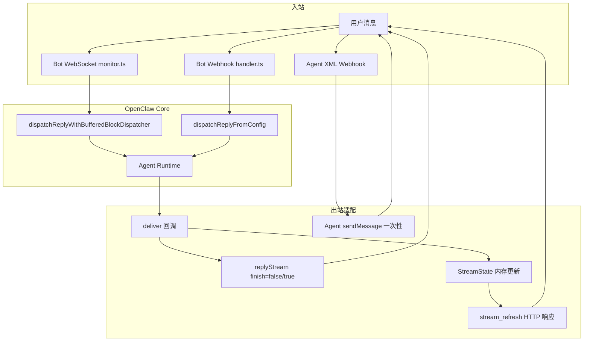
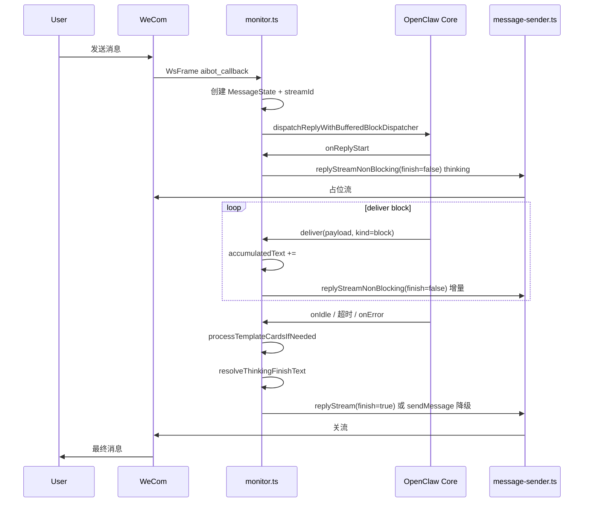
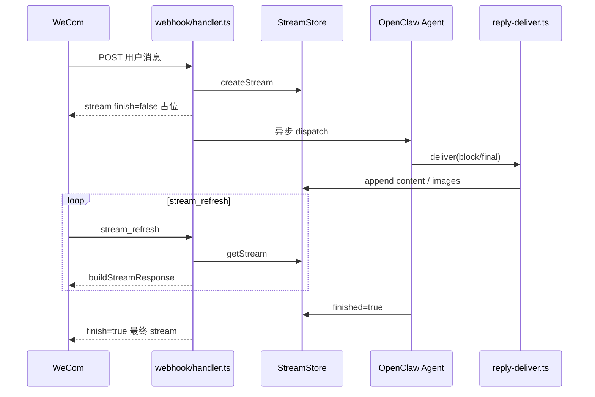

# 企业微信（WeCom）流式输出架构设计

> 文档版本：2026-05-23  
> 适用范围：`@partme.ai/wecom` 插件（Bot WebSocket / Bot Webhook / Agent 出站）  
> 关联代码：`openclaw-plugins/extensions/wecom/src/`

本文描述企业微信 **流式回复** 的平台能力、插件现状、关键约束，以及面向「对话场景 vs 业务整包场景」的分层设计方案。

**插件总览架构**（双模式、源码模块、入站主流程）：**[OpenClaw-WeCom-Architecture.md](./OpenClaw-WeCom-Architecture.md)**

---

## 1. 背景与目标

### 1.1 什么是 WeCom 流式

企业微信 **智能机器人（Bot）** 提供 `stream` 消息类型：同一条消息通过多次更新内容，最终在 `finish=true` 时定格。用户侧表现为「打字机 / 思考中 → 完整答案」。

OpenClaw WeCom 插件将 Agent 的 block / final 回复映射到该机制，并在超时、空回复、媒体失败等场景保证 **必须关流**，避免客户端 thinking 状态假死。

### 1.2 设计目标

| 目标 | 说明 |
|------|------|
| **可感知** | 长耗时 Agent 任务有 waiting 反馈（thinking / 进度） |
| **可关闭** | 任意路径（成功 / 超时 / 错误）都能 `finish=true` |
| **可降级** | 6 分钟流窗口过期 → 主动 `sendMessage` |
| **可分级** | 对话可流式；业务整包结果可 **atomic**（仅一条 final） |
| **不污染** | 业务 JSON / 报表不在会话中暴露中间草稿 |

### 1.3 非目标

- Agent 自建应用 **Inbound 对话** 的流式（平台不支持）
- 在 `replyStream` 通道内发送 Markdown（平台限制为纯文本）
- 与 Feishu Card Kit 1:1 复刻（载体与 API 不同）

---

## 2. 平台能力矩阵

| 接入模式 | 流式 | 传输 | 典型用途 |
|----------|:----:|------|----------|
| **Bot WebSocket** | ✅ | `replyStream` / `replyStreamNonBlocking` | 默认长连接对话 |
| **Bot Webhook** | ✅ | HTTP 加密响应 `msgtype: stream` + `stream_refresh` 轮询 | 无 WS 或兼容部署 |
| **Agent 自建应用** | ❌ | `sendMessage` 一次性 Markdown / 媒体 | 主动推送、文件兜底、私信 |

官方与插件文档一致：**仅 Bot 支持流式，Agent 不支持**（见 [OpenClaw-WeCom-Configuration.md](./OpenClaw-WeCom-Configuration.md) 模式对比表）。

---

## 3. 平台约束（硬边界）

实现任何流式策略前必须遵守以下约束；违反会导致 UI 假死、消息发不出或格式错误。

### 3.1 协议约束

| 约束 | 值 / 行为 | 代码依据 |
|------|-----------|----------|
| 流式载体 | `msgtype: stream`，同一 `stream.id` 贯穿生命周期 | `webhook/helpers.ts`、`message-sender.ts` |
| 关流条件 | 同一 `streamId` 发送 `finish=true` | `finishThinkingStream`、`buildStreamReplyFromState` |
| 内容格式 | `replyStream` **仅纯文本**（无 Markdown） | `monitor.ts` 注释、`buildMediaErrorSummary` |
| 空白内容 | 企微忽略纯空白，`finish=true` 须带可见字符 | `finish-thinking.ts`、`EMPTY_REPLY_FALLBACK_MESSAGE` |
| 流窗口 | **6 分钟**未更新 → errcode **846608**，流通道关闭 | `STREAM_EXPIRED_ERRCODE`、`BOT_WINDOW_MS` |
| 内容上限 | Webhook `StreamState.content` 截断 **20KB**（`STREAM_MAX_BYTES`） | `webhook/types.ts` |
| 状态 TTL | 内存 Stream 10 分钟 prune | `STREAM_TTL_MS` |

### 3.2 客户端行为（插件不可完全控制）

- Bot 在 `finish=false` 且占位内容为空或极短时，客户端可能展示内置文案（如「正在搜索相关内容」），**不在插件源码中**。
- Thinking 占位当前为 `THINKING_MESSAGE`（`const.ts`），可通过 `sendThinkingMessage` 开关控制是否发送。

### 3.3 媒体与流式互斥规则

- **被动 `replyStream` 与 `replyMedia` 不能互相覆盖** thinking 流；媒体统一走 **`aibot_send_msg` 主动发送**（`sendMediaBatch`）。
- 最终关流文案由 `resolveThinkingFinishText` 综合文本 / 卡片 / 媒体 / 错误状态决定。

---

## 4. 总体架构



### 4.1 模块职责

| 模块 | 路径 | 职责 |
|------|------|------|
| WS 入站与 dispatch | `src/monitor.ts` | 串行队列、`MessageState`、thinking / 中间帧 / 关流 |
| WS 发送 | `src/message-sender.ts` | `replyStream`、`replyStreamNonBlocking`、846608 降级 |
| 关流文案 | `src/finish-thinking.ts` | `resolveThinkingFinishText`、超时 / 错误摘要 |
| Webhook 入站 | `src/webhook/handler.ts` | 解密、分发、`stream_refresh` |
| Webhook 流状态 | `src/webhook/state.ts` | `StreamState` Map、TTL、finish 标记 |
| Webhook 回复管线 | `src/webhook/reply-pipeline.ts` | `createWecomReplyDispatcher` |
| Webhook 出站写入 | `src/outbound/reply-deliver.ts` | `deliverWecomReply` 更新 stream |
| Webhook 辅助 | `src/webhook/helpers.ts` | 占位符、buildStreamResponse、6 分钟窗口兜底 |
| Agent 流（非 Bot 流） | `src/agent/stream.ts` | Agent 模式占位逻辑（Bot stream 不适用时 fallback 文本） |
| 通道元数据 | `src/channel.ts` | 声明 `blockStreaming: true` |

---

## 5. 核心概念

### 5.1 streamId 生命周期

一条用户消息对应 **一个 stream 会话**：

```
streamId 创建 → finish=false（thinking / 中间更新）→ finish=true（最终内容）→ 会话结束
```

**WebSocket**：`generateReqId("stream")` 写入 `MessageState.streamId`（`monitor.ts`）。

**Webhook**：`StreamStore.createStream` 生成 ID，首次 HTTP 响应返回占位 `stream` 消息。

### 5.2 finish 语义

| finish | 含义 | 用户侧 |
|:------:|------|--------|
| `false` | 流进行中 | thinking 动画 / 打字机增量 |
| `true` | 流结束 | 定格为最终消息，不再刷新 |

**关流是强约束**：未 `finish=true` 时，thinking 可能永久悬挂（历史假死根因之一）。

### 5.3 两条状态模型

**WS — `MessageState`**（`interface.ts`）

| 字段 | 用途 |
|------|------|
| `accumulatedText` | Agent 文本累积 |
| `streamId` | 流 ID |
| `streamExpired` | 846608 后改主动发送 |
| `hasMedia` / `hasMediaFailed` | 媒体结果 |
| `dispatchErrorSummary` | 错误关流文案 |
| `hasTemplateCard` | 模板卡片已发 |

**Webhook — `StreamState`**（`webhook/types.ts`）

在 `MessageState` 基础上增加：`msgid` 去重、`dmContent`（私信完整内容）、`fallbackMode`、`agentMediaKeys`、6 分钟 Bot 窗口相关字段等。

---

## 6. WebSocket 流式路径（默认）

### 6.1 时序



### 6.2 关键回调

| 阶段 | 钩子 | 行为 |
|------|------|------|
| 开始 | `onReplyStart` | 若 `sendThinkingMessage !== false`，发 thinking（`finish=false`） |
| 增量 | `deliver`（`kind=block`） | 累积文本，`maskTemplateCardBlocks` 后 `replyStreamNonBlocking` |
| 结束 | dispatch 完成后 | `finishThinkingStream` → `finish=true` |
| 错误 | `onError` / `catch` | 写入 `dispatchErrorSummary`，仍执行关流 |
| 超时 | `withTimeout(agentReplyTimeoutMs)` | `buildAgentReplyTimeoutSummary`，仍关流 |

**注意**：当前 **未启用 `onPartialReply`**（代码中已注释）；中间更新来自 **block deliver**，不是 token 级 partial。

### 6.3 发送策略

| API | 场景 | 阻塞 |
|-----|------|:----:|
| `replyStream` | thinking 首帧（可选）、**final 关流** | 是（带 15s 超时） |
| `replyStreamNonBlocking` | 中间增量 | 否（上一帧未 ack 则 skip） |
| `sendMessage` | 846608 过期、event 回调无 req_id | 主动发送 Markdown |

### 6.4 事件回调特例

`msgtype=event`（如 `enter_chat`）**无有效 req_id**，不能 `replyStream`：

- 中间帧跳过
- 仅 `finish=true` 时用 `sendMessage` 发 Markdown

---

## 7. Webhook 流式路径

### 7.1 两轮 HTTP 模型

Bot Webhook 无法在单连接上 push，采用：

1. **首次响应**：加密 JSON，`msgtype: stream`，`finish: false`，占位内容（`streamPlaceholderText` 或默认 `"1"`）
2. **轮询刷新**：企微发送 `msgtype: stream` 的 `stream_refresh`，插件返回当前 `StreamState` 快照
3. **完成**：Agent `onIdle` 后标记 `finished: true`，下次 refresh 或 active reply 推送最终内容



### 7.2 与 WS 的差异

| 维度 | WebSocket | Webhook |
|------|-----------|---------|
| 更新触发 | 插件主动 `replyStream` | 企微轮询 `stream_refresh` |
| 占位配置 | `sendThinkingMessage` + `streamPlaceholderText` | `streamPlaceholderText` |
| 6 分钟窗口 | 846608 后 `sendMessage` | `BOT_WINDOW_MS` + Agent 私信兜底 |
| 去重 | messageId + 会话队列 | 持久化 msgid dedupe（`dedup.ts`） |
| blockStreaming | 经 `deliver` 写 StreamState | `disableBlockStreaming: false` |

### 7.3 6 分钟 Bot 窗口兜底

接近 `BOT_WINDOW_MS - BOT_SWITCH_MARGIN_MS` 时（`outbound/bot-window.ts`）：

- 可切换 **Agent 私信** 发送完整结果
- 群内发送 fallback 提示，避免 stream 通道失效后用户无感知

---

## 8. Agent 模式与 Outbound

### 8.1 Agent Inbound（XML Webhook）

- 接收用户消息，**无 Bot stream**
- 回复走 Agent API **一次性**发送

### 8.2 主动出站（`channel.ts` → `sendWeComMessage`）

- 优先 Bot WS `sendMessage`（Markdown）
- 不可用则 Agent HTTP API
- **天然 atomic**，适合通知、审批结果、业务推送

### 8.3 场景选择建议

| 场景 | 推荐通道 | 流式 |
|------|----------|:----:|
| 用户私聊 / 群 @ 对话 | Bot WS / Webhook | 可开 |
| 业务系统回调、只读结果 | Agent outbound 或 atomic profile | 关 |
| 大文件 / 群文件限制 | Agent 私信兜底 | 关（文本提示可流式） |

---

## 9. OpenClaw 集成层

### 9.1 Dispatcher 栈

```
createReplyDispatcherWithTyping（Webhook: createWecomReplyDispatcher）
  ├── onReplyStart
  ├── deliver(block | final | tool)
  ├── onError
  └── onIdle → 关流 / mark finished
```

Webhook 额外通过 `createChannelMessageReplyPipeline` 接入 typing 生命周期（企微无 reaction typing，主要为统一管线）。

### 9.2 Block Streaming

- 通道能力：`capabilities.blockStreaming: true`（`channel.ts`）
- Webhook dispatch 配置：`buildCfgForDispatch` 缩小 block chunk 阈值（minChars 120、idleMs 250）
- WS：`dispatchReplyWithBufferedBlockDispatcher` 缓冲 block 后触发 `deliver`

**现状**：只要 Agent 产出 block，WS 路径就会发 **中间 `finish=false` 帧**——尚无「atomic 模式」开关。

### 9.3 与 Feishu 流式对照

| 维度 | Feishu | WeCom Bot |
|------|--------|-----------|
| 载体 | Card Kit streaming API | 单条 stream 消息 |
| Partial | `onPartialReply` → 卡片更新 | block `deliver` 累积（无 onPartialReply） |
| Tool 进度 | `onToolStart` + `channel-streaming` SDK | `onToolStart` + `channel-streaming` + `suppressDefaultToolProgressMessages` |
| Reasoning | `onReasoningStream` 可选 | **未接入** |
| Compaction | `onCompactionStart` / `onCompactionEnd` | `onCompactionStart` / `onCompactionEnd`（`footer.status` / `streaming.status`） |
| 配置 | `streaming` / `renderMode` / `blockStreaming` | `sendThinkingMessage`、`streamPlaceholderText` |
| 关流 | `streaming_mode: false` | `finish=true` |

详见 [OpenClaw-WeCom-Feishu-SDK-Inventory.md](./OpenClaw-WeCom-Feishu-SDK-Inventory.md)。

### 9.4 与 `wecom-kf` 插件对照

`extensions/wecom-kf` 是客服场景下的 WeCom Bot 实现，与主插件 `extensions/wecom` **共用同一套企微 stream 协议**，但工程结构更偏向「StreamState 中枢 + 统一 Webhook/WS 管线」。

| 维度 | `wecom`（主插件） | `wecom-kf` |
|------|-------------------|------------|
| WS 出站 | `deliver` 内直接 `replyStreamNonBlocking` | `StreamState` + `watchStreamReply` 200ms 轮询推送 |
| Webhook 出站 | `reply-deliver` 写 `StreamState` + refresh | 同一 `monitor.ts` / `StreamStore` |
| Thinking | `onReplyStart` → thinking | 入队后立即 `replyStream(THINKING)` |
| 欢迎语 | WS `event.enter_chat` → `replyWelcome` | WS `event.enter_chat` → `replyWelcome` |
| Block 增量 | ✅ 每 block 更新 stream | ✅ 每 block append 到 `state.content` |
| 配置 | `sendThinkingMessage` | 同左 + `streamPlaceholderText` |
| 业务整包 | ❌ 无开关 | ❌ 同样无开关 |

**可借鉴（不必照搬 Feishu 复杂度）：**

1. **StreamState 与发送解耦**：kf 的 `watchStreamReply` 让 Agent `deliver` 只写状态，WS 推送独立循环——主插件可逐步对齐，降低 `monitor.ts` 耦合。
2. **WS / Webhook 共用一套 deliver 写状态**：kf 已验证；主插件 WS 与 Webhook 仍有两套路径，是后续收敛方向。
3. **欢迎语**：kf 已在 WS 实现 `replyWelcome`；主插件 P1 可直接参考。
4. **不做 command/agent 动态路由**：kf 也没有 routes；业务与对话靠 **不同账号 / 不同通道** 区分即可。

---

## 10. 场景分级：对话 vs 业务整包

### 10.1 问题陈述

流式适合 **对话**（降低等待焦虑）；不适合 **需要一次完整结果** 的场景：

- 中间态 JSON / 表格不完整，用户可能误读
- 同一会话历史被草稿污染
- 审计 / 合规要求「一次交付完整结果」

**推荐的分工（无需复杂路由）：**

| 场景 | 推荐 CLI |
|------|----------|
| 日常 Bot（默认） | `streaming false` + `footer.status true` |
| 对话要打字机 | `streaming true` + `streaming.content true` |
| 要 tool/解析进度 | `streaming true` + `streaming.status true` |
| 业务整包 | `streaming false` + `footer.status false`，或 Agent outbound |

### 10.2 当前缺口

| 能力 | 现状 |
|------|------|
| 关闭 thinking | ✅ `sendThinkingMessage: false` |
| 关闭答案增量 | ❌ 待 `streaming` / `streaming.content` |
| 状态栏阶段展示 | ❌ 待 `footer.status` |
| 账号级关闭流式 | ✅ `streaming false`（待实现） |
| Webhook 占位文案 | ✅ `streamPlaceholderText` |
| WS 占位文案 | ❌ 未接 `streamPlaceholderText` |

### 10.3 建议配置：Feishu 式布尔开关（待实现）

对齐飞书「几条 CLI 就能开关体验」的风格，**不用** `streamingMode` 枚举或 `routes` 路由。

#### 两种体验模式

| 模式 | `streaming` | 行为（对齐 `research/wecom-openclaw-plugin`） |
|------|:-----------:|-----------------------------------------------|
| **默认** | `false` | thinking 占位 → **状态栏**随阶段变化 → **一次性**给出完整结果（不刷答案草稿） |
| **流式输出** | `true` | 在默认基础上，可分别开启 **中间状态流式** 与 **结果内容流式** |

默认模式 = 旧插件心智：**用户先看到「在处理」，状态栏告诉进行到哪一步，最后才看到完整答案**——避免 JSON/半成品污染会话。

流式模式 = 需要打字机或 tool 进度时，再打开子开关。

#### CLI 示例（与飞书同风格）

```bash
# ── 默认模式（推荐大多数 Bot）──
openclaw config set channels.wecom.streaming false
openclaw config set channels.wecom.footer.status true   # 状态栏：思考中 / 查资料 / 生成中
openclaw config set channels.wecom.footer.elapsed true  # 关流时展示耗时

# ── 开启流式输出 ──
openclaw config set channels.wecom.streaming true

# 中间状态的流式输出（tool、解析、阶段文案）
openclaw config set channels.wecom.streaming.status true

# 结果内容的流式输出（答案 block 增量 / 打字机）
openclaw config set channels.wecom.streaming.content true

# ── 只要结果打字机，不要中间状态行 ──
openclaw config set channels.wecom.streaming true
openclaw config set channels.wecom.streaming.status false
openclaw config set channels.wecom.streaming.content true

# ── 关闭流式（等同飞书 streaming false）──
openclaw config set channels.wecom.streaming false

# ── 已有：thinking 占位 ──
openclaw config set channels.wecom.sendThinkingMessage true
```

与飞书对照：

| 飞书 | WeCom |
|------|-------|
| `channels.feishu.streaming true/false` | `channels.wecom.streaming true/false` |
| `channels.feishu.footer.status true` | `channels.wecom.footer.status true` |
| `channels.feishu.footer.elapsed true` | `channels.wecom.footer.elapsed true` |
| （Card 内 tool 进度） | `channels.wecom.streaming.status true` |
| （Card 内 partial 答案） | `channels.wecom.streaming.content true` |
| `channels.feishu.threadSession` | 企微话题/session 另文档（非流式专属） |

#### 默认值

| 配置项 | 默认 | 说明 |
|--------|------|------|
| `streaming` | `false` | 默认模式，不刷答案 partial |
| `streaming.status` | `true` | 仅当 `streaming=true` 时生效 |
| `streaming.content` | `true` | 仅当 `streaming=true` 时生效 |
| `footer.status` | `true` | 状态栏阶段文案（默认模式核心） |
| `footer.elapsed` | `false` | 关流附注耗时，按需开启 |
| `sendThinkingMessage` | `true` | thinking 占位 |

#### 单条 stream 气泡合成规则

企微只有 **一条** `replyStream` 气泡，内容与 Feishu Card 多区域不同，建议固定拼接：

```
{statusLine}          ← footer.status / streaming.status 驱动
\n\n---\n\n
{answerText}          ← streaming.content 为 true 时随 block 增长；否则仅 final 写入
\n\n---\n\n
{footerLine}          ← footer.elapsed：⏱ 12s · 已完成
```

**默认模式（`streaming=false`）**：只更新 `{statusLine}`，关流时写入完整 `{answerText}` + 可选 `{footerLine}`。

**流式模式（`streaming=true`）**：

- `streaming.status=true` → `{statusLine}` 随 tool/解析/onCompaction 更新（复用 `channel-streaming` 人类文案）
- `streaming.content=true` → `{answerText}` 随 block 增量更新（对齐 `wecom-openclaw-plugin` 的 deliver 中间帧）
- 二者可独立关闭

#### 状态栏阶段（`footer.status` 默认模式）

| 阶段 | 示例文案 | 触发 |
|------|----------|------|
| 已收到 | `已收到，正在处理…` | 入站 Ack（可选，与 welcome 正交） |
| 思考中 | `正在思考…` | `onReplyStart` / thinking 占位 |
| 工具中 | `正在查资料…` | `onToolStart` |
| 读文件中 | `正在阅读附件…` | 媒体解析队列 |
| 生成中 | `正在组织回复…` | `onAssistantMessageStart` |
| 完成 | （关流，展示最终答案） | `finish=true` |

#### 用户可见文案（`*Text`）

> **配置入口**：键表与 CLI 示例见 **[Configuration §用户可见文案](./OpenClaw-WeCom-Configuration.md#用户可见文案text)**。本节说明各文案在流式气泡中的触发时机。

| 配置键 | 默认 | 占位符 | 用途 |
|--------|------|--------|------|
| `thinkingText` | `正在思考…` | — | `onReplyStart` / compaction 结束 |
| `receivedText` | `已收到，正在处理…` | — | 入站 Ack（预留） |
| `toolStatusText` | `正在查资料…` | `{toolName}` | `onToolStart` |
| `readingText` | `正在阅读附件…` | — | 入站媒体解析 |
| `generatingText` | `正在组织回复…` | — | `onAssistantMessageStart` |
| `compactionText` | `📦 正在压缩上下文…` | — | `onCompactionStart` |
| `emptyReplyText` | `⚠️ 未能生成…` | — | 空回复关流 |
| `finishFooterText` | `⏱ {elapsed}s · 已完成` | `{elapsed}` | `footer.elapsed` |
| `welcomeText` | （空） | — | enter_chat |
| `queuedText` / `mergedQueuedText` / `mergedDoneText` | 队列 Ack | — | Webhook 批次 |

账号级覆盖：`channels.wecom.accounts.{id}.thinkingText` 等（scalar 覆盖顶层）。

```bash
openclaw config set channels.wecom.thinkingText "正在思考…"
openclaw config set channels.wecom.toolStatusText "正在调用 {toolName}…"
openclaw config set channels.wecom.welcomeText "你好，我是助手"
openclaw config set channels.wecom.accounts.bot2.thinkingText "Bot2 思考中…"
```

#### 与现有字段关系

| 字段 | 关系 |
|------|------|
| `sendThinkingMessage` | 控制是否发 thinking 首帧；与 `footer.status` 可并存 |
| `streamPlaceholderText` | Bot 流式 **首帧** replyStream 占位（协议层，非 welcome/thinkingText） |
| `blockStreaming`（agents.defaults） | Core 是否 emit block；`streaming.content=false` 时插件仍只累积不推送 |

业务 Bot（整包结果）：`streaming false` + `footer.status false` + `sendThinkingMessage false`，或单独账号配置。

### 10.4 实现要点（开发清单）

1. **`resolveWecomStreamingConfig(account)`**：解析 `streaming` / `streaming.status` / `streaming.content` / `footer.*`。
2. **默认模式**：`deliver` 只累积答案，中间帧只 `flushStreamingUpdate(statusLine)`，不推送 partial 答案。
3. **流式模式**：`streaming.content` 时恢复 `wecom-openclaw-plugin` 式 `replyStreamNonBlocking` 中间帧。
4. **`streaming.status` + `footer.status`**：`onToolStart` / 解析队列 → 更新 `statusLine`（参考 Feishu `updateStreamingStatusLine`）。
5. **`footer.elapsed`**：记录 `onReplyStart` 时间，关流时 append `⏱ {elapsed}s`。
6. **首帧占位**：`resolveWecomStreamPlaceholderText`（Webhook 默认 `"1"`，WS 默认 `THINKING_MESSAGE`）。

---

## 11. 可靠性设计

### 11.1 关流保证（P0）

任意路径必须调用关流逻辑：

- 正常：`onIdle` → `finishThinkingStream`
- 异常：`catch` + `finishThinkingStream`
- 超时：`withTimeout` → 兜底文案 + 关流
- 空回复：`resolveThinkingFinishText` → `EMPTY_REPLY_FALLBACK_MESSAGE`

### 11.2 流过期降级

```
replyStream 失败 (846608)
  → state.streamExpired = true
  → finishThinkingStream 使用 wsClient.sendMessage(markdown)
```

### 11.3 串行与超时

- 同 session **串行队列**（`enqueueWeComChatTask`），避免并行 dispatch 争用同一 streamId。
- `network.agentReplyTimeoutMs`（默认 6 分钟，可缩短）包裹整个 dispatch。

### 11.4 模板卡片

- 流式文本中检测 template card JSON → `processTemplateCardsIfNeeded` 独立发送
- 流式展示用 `maskTemplateCardBlocks` 避免 JSON 泄露

---

## 12. 配置参考（现状）

| 配置项 | 作用 | 默认 | 模式 |
|--------|------|------|------|
| `connectionMode` | `websocket` / `webhook` | `websocket` | Bot |
| `sendThinkingMessage` | 是否发 thinking 占位 | `true` | Bot |
| `streamPlaceholderText` | Webhook 首次 stream 占位 | `"1"` | Webhook |
| `network.agentReplyTimeoutMs` | Agent 总超时 | 6min | 全局 |
| `welcomeText` | enter_chat 欢迎语 | Bot WS / Webhook / kf WS |
| `*Text` 字段 | 用户可见文案（`thinkingText`、`welcomeText` 等） | Bot WS / Webhook |

**待实现（Feishu 式开关）**：

| 配置项 | 说明 | 默认 |
|--------|------|------|
| `streaming` | `false`=默认模式；`true`=流式输出 | `false` |
| `streaming.status` | 中间状态流式（tool/阶段） | `true` |
| `streaming.content` | 结果内容流式（打字机） | `true` |
| `footer.status` | 状态栏阶段文案 | `true` |
| `footer.elapsed` | 关流展示耗时 | `false` |
| WS 读取 `streamPlaceholderText` | 与 Webhook 占位统一 | ✅ |

---

## 13. 错误码与观测

| 现象 | 可能原因 | 处理 |
|------|----------|------|
| thinking 一直转 | 未 `finish=true` 或空白关流 | 查关流路径、兜底文案 |
| errcode 846608 | 流超过 6 分钟 | 自动 `sendMessage` 降级 |
| errcode 846605 | event 回调 invalid req_id | 改主动发送 |
| 中间 JSON 露出 | 模板卡片未 mask | 查 `maskTemplateCardBlocks` |
| 群文件失败 | Bot 限制 | Agent 私信 + 群内提示 |

**日志关键字**：`[plugin -> server] streamId=`、`Stream expired`、`deliver final streamId=`、`Non-blocking intermediate reply skipped`。

---

## 14. 演进路线图

| 阶段 | 内容 | 优先级 |
|------|------|:------:|
| **P0** | Feishu 式 `streaming` + `footer.status`（默认模式 + 状态栏） | 高 |
| **P0** | `streaming.status` / `streaming.content` 子开关 | 高 |
| **P0** | WS 必关流 + `streamPlaceholderText` 统一 | 高 |
| **P1** | WS `enter_chat` 欢迎语（`replyWelcome` + `welcomeText` / 自定义占位） | ✅ |
| **P1** | WS 侧 StreamState / `watchStreamReply` 与 kf 对齐（可选重构） | 中 |
| **P2** | `onPartialReply` 与 block deliver 策略统一 | 低 |
| **P3** | 重内容 Ack + 异步解析（队列 Ack 模板可配置） | ✅ |

**明确不做**：`routes` / commandPrefix / agentId 动态路由；与飞书 `threadSession` 无关的复杂 profile 嵌套。

---

## 15. 相关文档

- [OpenClaw-WeCom-Configuration.md](./OpenClaw-WeCom-Configuration.md) — 安装与配置
- [OpenClaw-WeCom-Testing.md](./OpenClaw-WeCom-Testing.md) — 联调步骤
- [OpenClaw-WeCom-Feishu-SDK-Inventory.md](./OpenClaw-WeCom-Feishu-SDK-Inventory.md) — SDK 对照

**核心源码索引**

| 主题 | 文件 |
|------|------|
| WS 主流程 | `extensions/wecom/src/monitor.ts` |
| WS 发送 | `extensions/wecom/src/message-sender.ts` |
| 关流文案 | `extensions/wecom/src/finish-thinking.ts` |
| Webhook 分发 | `extensions/wecom/src/webhook/handler.ts` |
| Webhook 流状态 | `extensions/wecom/src/webhook/state.ts` |
| Webhook 出站 | `extensions/wecom/src/outbound/reply-deliver.ts` |
| Stream 构造 | `extensions/wecom/src/webhook/helpers.ts` |
| 客服 Bot 参考实现 | `extensions/wecom-kf/src/ws-adapter.ts`、`monitor.ts` |

---

## 16. 结论

1. **WeCom Bot 支持流式**（WS `replyStream` + Webhook `stream` / `stream_refresh`），**Agent 不支持**。
2. 插件已实现 **thinking → block 增量 → finish 关流** 全链路，并处理 846608、空回复、媒体失败等降级。
3. **默认 `streaming=false`** 对齐 `wecom-openclaw-plugin`：**状态栏过程 + 最终整包**；需要打字机时再 `streaming true` 并细调 `streaming.status` / `streaming.content`。
4. **`footer.status` / `footer.elapsed`** 对标飞书卡片脚注，是默认模式的核心体验，与是否流式答案无关。
