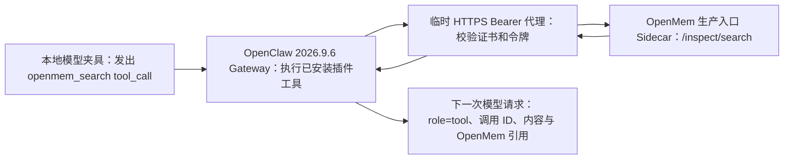

# OpenMem 安装态工具调用与全量本地复验

日期：2026-10-02。对应[稳定版升级规格](../specs/2026-09-29-openclaw-2026-9-6-upgrade.md) U8、[实施计划](../plans/2026-09-29-openclaw-2026-9-6-upgrade.md) Task 8，以及[U9 本地受保护代理记录](2026-10-02-u9-local-concurrency-and-proxy.md)。本轮验证使用 OpenClaw 2026.9.6、Node v24.18.0、安装后的插件 tarball、本地测试模型、临时 HTTPS 认证代理和真实 OpenMem `apps/server/dist/index.js`；未接入厂商平台。

## 验证路径

先归档第一轮会话，再重启 Gateway。模型夹具仅在第二轮显式要求 `openmem_search` 时发出一次确定性 tool call。断言检查模型请求确实暴露该工具、Gateway 日志记录同一调用 ID 的 start/end、下一次模型请求包含匹配调用 ID 的 `role: tool` 消息、工具内容命中“海盐蓝”及 `openmem/archive|memory/...#L1` 引用。代理在工具调用前后 `/inspect/search` 的上游 **2xx** 计数从 1 增至 2；直接由 E2E adapter 发出的第一次检索不能充当工具调用证据。第二轮 transcript 中出现上一轮文本只证明上下文保留，不用于证明工具调用。

实现先以无 tool 支持的模型配置和严格结果断言复现失败；修复仅对 OpenMem 的安装态配置开放工具，并给共享模型夹具增加显式的一次性 `nextToolCall` 控制。独立审查又用“工具错误回显查询词”和“代理转发但上游 HTTP 500”复现两项误报，再要求有效 OpenMem 引用及上游 2xx，定向测试最终 **10/10 PASS**。独立审查结论为 **Spec PASS、Quality APPROVE**，无 Critical/Important 阻断。对应代码提交 `4240c9ba2ac0a9252df5be5b396ad410f764b970`。

## 实际结果

| 检查 | 结果 |
| --- | --- |
| `OPENMEM_E2E_REPO=... node scripts/openmem-protected-e2e.mjs` | PASS，OpenClaw 2026.9.6，安装态 E2E 跳过 0；归档 `scripts/e2e/reports/protected/2026-10-02T12-03-57.131Z-openmem-2f2c10ba-5205-418a-9ba2-218aeac0bb26.json` |
| 受保护代理 | 认证转发 27、拒绝 2；同一会话提交路由 3 次；`/inspect/search` 2 次，均获上游 2xx；未信任证书拒绝，匿名及错误 Bearer 均为 401 |
| 产物绑定 | wrapper SHA-256 `05b9ca80e207ef15e526875fcc2c66ca6c281cad7090253bfba074a3471c2258` 与当前源码一致；OpenMem 安装 tarball SHA-256 `1962e95f939a51910fa7b9ef75ca97ff29a37dbf577814c5fc379f3c69544cd6`；底层安装态归档 `scripts/e2e/reports/2026-10-02T12-03-52.228Z-openmem-28942b60-2d51-42f7-a31b-6552be0cdfd7.json` 为 PASS |
| 定向测试 | `node --test scripts/e2e/helpers/openai-model-fixture.test.mjs scripts/e2e/lib/config.test.mjs scripts/e2e/plugins/openmem.test.mjs scripts/openmem-protected-e2e.test.mjs`，10/10 PASS |
| 全量安装态复验 | 共享模型夹具和配置改变后，重新运行 27 项场景；最新报告逐项为 E2E PASS、`skipCount=0`、`skipInstall=false`、`skipBrowser=false`、候选包 SHA 有值、宿主 2026.9.6；`node scripts/check-e2e-evidence.mjs` 退出 0 |
| 浏览器 | Web-MQTT、Web-Socket、Web-STOMP 均使用本机 Chrome 完成真实浏览器断言，三份最新报告均为 browser PASS |

全量矩阵使用 24 个单插件场景和 3 个组合场景：Bridge+MQTT、Router+Gotify、Tracing+MQTT。该次全量矩阵的 27 项报告均为 `gatewayMode=host`；需要后端服务的场景仍使用 Docker。后续单项 Prometheus 容器 Gateway 复验见下表。共享输入改动前的报告保留为历史证据，未用于本轮 27/27 门禁。

## 本机环境偏差与边界

| 现象 | 本轮处理 |
| --- | --- |
| 18080 被无关容器占用，Gotify 默认端口无法绑定 | 只对 Gotify 和 Router+Gotify 设置 `E2E_GOTIFY_PORT=18081` 与对应 `GOTIFY_URL`；未触碰占用者 |
| mTLS 错误地以 Docker Gateway 启动，未加载 mTLS 插件，18443 不监听 | 保留失败日志；按 E2E README 的宿主 Gateway 模式重跑，PASS |
| 先前 Prometheus 容器运行曾报告 `/state/state/openclaw.sqlite` malformed | 当次报错的原始日志和库快照在当前工作树不可得；当时改用独立 `queue-e2e` 宿主 Gateway 重跑，PASS。后续在全新 `/tmp/openclaw-container-e2e.*` 状态目录以容器 Gateway 重跑安装态 Prometheus，PASS、`skipCount=0`；报告为 `scripts/e2e/reports/2026-10-02T13-02-26.485Z-prometheus-38775f34-3121-49de-9d5f-dbd53c9f7907.json`，OpenClaw 2026.9.6、Node v24.18.0、候选 tarball SHA-256 `9b71aa17669245cee78ac71fa6671c5a93ac1d7cb70b99df08145072b2cbcdc3`。当前默认测试库和本轮隔离测试库的只读 `PRAGMA integrity_check` 均为 `ok`；无法据此确定先前报错原因。 |
| Playwright 默认缓存缺少 Chromium headless shell | 仅三组 Web 场景设置 `OPENCLAW_E2E_BROWSER_EXECUTABLE` 为本机 Google Chrome，三组浏览器均 PASS；未安装新浏览器 |

受保护代理和 Sidecar 均为本机临时环境，Sidecar 本机 HTTP 端口仍可由同机进程直接访问。通用 27 项证据门禁不检查受保护 wrapper，故本轮单独核对 wrapper SHA、底层报告及代理成功计数；受保护归档未保存工具正文或脱敏引用摘要，后续复用仍需结合当前断言源码。后续容器模式 Prometheus 复验通过，`node scripts/check-e2e-evidence.mjs` 对当前 27 项证据仍退出 0；先前容器状态库报错的根因没有保留下来可供复核。跨主机/网络卷的单写入约束、真实断电/部署恢复、已部署认证代理和厂商真实回调继续未验收；本地通过不等于生产环境就绪。
