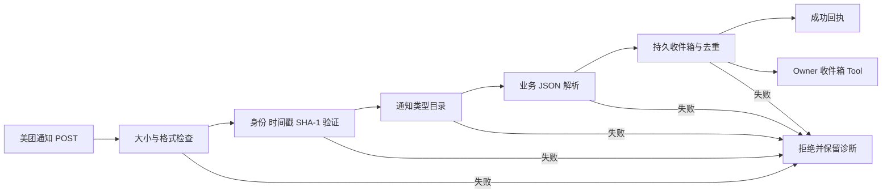

# 美团通知与消息回调规格

状态：已实现，隔离宿主验收通过。规格事实源：本文件。参考 `meituan-sdk-extension` 的 callback 信封、签名和业务类型目录，以及 `cloud-meituan` 的接收、验签与持久化链。

## 目标与范围

- 为 `meituan` 插件增加固定 HTTP POST 回调入口，仅接收已登记的通知/消息类型。同步查询、设备操作、OAuth 回调与需要即时业务数据响应的类型不在范围内。
- 兼容 JSON 与 `application/x-www-form-urlencoded` 信封，支持 `msgType/msg_type/invokeType`、`msgId/msg_id`、`message/param` 等已确认别名；业务内容解析为有界 JSON，保留原始类型编号和业务线。
- 要求开发者身份匹配、时间戳在窗口内、SHA-1 签名有效。签名参数必须与实际解析的信封一致；重复或冲突字段拒绝，未知类型不执行任何动作。
- 经验证的通知先持久写入私有收件箱，再返回 `{code:0,message:"success"}`。相同消息重复投递不得创建第二条；同 ID 不同内容拒绝。写入失败不得成功应答。
- 增加 owner 限定的收件箱 Tool，用于列出、读取和确认通知。回调正文属于不可信外部数据，插件不自动发起 MTOp 写操作或交给 Agent 自主执行。
- 接收箱容量限制未确认事件；完整归档默认最多 2000 条。确认新事件前先为完整正文预留槽位：可清理最早已确认正文，即使本次确认随后失败；原事件的 30 天去重标记仍保留。标记数量限制为完整归档上限的 10 倍；容量已满时拒绝新确认，不提前删除仍有效的标记。外部平台仅使用未签名的 `X-Msg-Type`/`X-Msg-Id` 时不兜底，因为这两个头不在签名范围。

## 交互

## 验收

1. 覆盖 SDK 中有明确编号的通知与消息类型，以及 `cloud-meituan` 已配置的服务零售通知；每类均能得到稳定 `businessId/msgType/typeName/payload`。查询、命令、未知编号明确拒绝。
2. Form、JSON、旧版别名的有效签名成功；缺签、错签、过期、开发者不匹配、重复关键字段、超大请求均拒绝，且收件箱不变化。
3. 落盘失败不成功回执；重启后可读取，重复投递恰好一条；相同 ID 冲突拒绝；确认后列表不再显示，容量满时拒绝新消息而不删除未确认事件。
4. Tool 未授权调用不能读取业务内容；结果不得包含 `signKey`、`appAuthToken`、回调签名或原始未清洗请求头。
5. `pnpm --dir extensions/meituan test`、`typecheck`、`build` 通过，并在隔离 OpenClaw 2026.9.6 宿主验证真实注册的回调路由和持久收件箱。外部美团平台生产投递另行验收。

## 验证记录

- 2026-09-29：插件 62 个测试、类型检查和构建通过；安装授权测试 2 个通过。
- 隔离 OpenClaw 2026.9.6 宿主：`5810055` 通知和 `210069` 消息经真实 HTTP POST 均获 200/code 0，两个事件正文落盘；Agent 完成一次已签名 MTOp Tool 调用。证据见 `scripts/e2e/reports/2026-09-29T14-26-49.571Z-meituan-98c3267b-9969-41d2-bfea-9c6c514d285a.json`。
- 未接入外部美团生产投递；业务字段维持无损 JSON 与类型编号，不在插件内执行订单投影或其它业务写操作。
- 2026-10-01：与 SDK 全部已编号回调目录逐项核对，目录覆盖异步通知与 IM 消息；同步查询及操作命令仍拒绝。补齐无外层 `msgId` 时安全整数型 `messageId` 的提取，与原有 19 位数字无损解析一致。插件 64 个测试、类型检查和构建通过；新候选包在隔离 OpenClaw 2026.9.6 宿主完成三类签名 HTTP 投递、持久收件箱及 Agent Tool 闭环，证据见 `scripts/e2e/reports/2026-10-01T11-31-47.185Z-meituan-2b44279b-b29a-4bac-8cdb-90ab5f7af743.json`。
