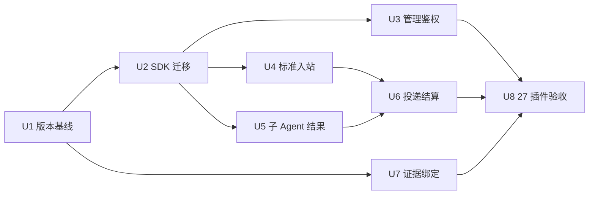

# OpenClaw 2026.9.6 稳定版升级规格

日期：2026-09-29。状态：实施中；U3 的 Router/Tracing 同插件浏览器 grant 正例已完成当前本地 Gateway 验证，见[U3 记录](../reports/2026-10-02-u3-browser-grants.md)。U9 的 OpenMem 可恢复提交已完成本地实现与安装态验证，见[U9 记录](../reports/2026-10-02-openmem-recoverable-commit.md)。共享 E2E 输入变化后全量 27 插件已重验，当前候选物证据门禁退出 0，见[当前复验记录](../reports/2026-10-02-current-candidate-verification.md)；旧候选物的 27 项记录见[原验收记录](../reports/2026-09-29-openclaw-2026-9-6-verification.md)。生产部署与厂商实网验收继续进行。本规格由 CodeGraph 审计和用户确认编写任务的请求形成，不是历史交付重建。

**规格事实源：** 本文件定义本次升级的增量要求；通用约定沿用 [PLUGIN_SPEC](../../../spec/PLUGIN_SPEC.md)。[实施计划](../plans/2026-09-29-openclaw-2026-9-6-upgrade.md) 只拆解任务，不另立需求。功能优化单独见 [优化规格](2026-09-29-openclaw-followup-optimization.md)。

## 1. 目标与基线

使 27 个运行时插件及共享 message-sdk 在 OpenClaw 2026.9.6 上完成安装、加载和可观察功能闭环，并修复已确认的管理接口鉴权与消息结果处理问题。

- 插件源码审计基线：`01a59c701c00226c1ed1130cc1fa37ac957e2ce5`。
- 上游固定版本：`v2026.9.6`，提交 `eb377ac59e6c9fd6c7705028034812becf00271b`；[官方 Release](https://github.com/openclaw/openclaw/releases/tag/v2026.9.6)。后续新版本另行评估，不自动漂移。
- 上游参考路径：`/Users/wandl/workspaces/workspace-octoclaw-labs/research/openclaw`，只读。
- 宿主 Node 范围：`>=24.16.0 <25 || >=26.1.0`；本轮 CI 和容器默认固定 Node `24.18.0`。
- 保持 pnpm `9.0.0`，先验证其锁文件与安装；升级 pnpm 不属于本轮必要变更。
- OpenClaw 开发依赖固定 `2026.9.6`；宿主兼容下限改为 `2026.9.6`。插件自身版本不自动等同宿主版本；发布版本在发布时决定。
- 插件集合：amap、bridge、douyin、gotify、knowledge、meituan、memory、mqtt、mtls、nacos、oauth2、openmem、prometheus、rabbitmq、redis-stream、rednode、rocketmq、router、stomp、tracing、web-mqtt、web-socket、web-stomp、wechat、wechat-ipad、wecom、wecom-kf。
- message-sdk 是共享库；`_template` 是模板，均不计入 27 个运行时插件。

## 2. 已验证事实与边界

| 证据 | 审计结果 | 本次要求 |
| --- | --- | --- |
| SDK 静态导入与上游 package exports 对照 | 72 处已删除路径引用，涉及 17 个运行时插件和模板；8 个插件有运行时导入 | U1、U2 |
| Router / Tracing 路由源码 | `auth: plugin` 的管理处理器缺少身份校验 | U3 |
| `dispatchTranscriptTurn` 调用链 | 使用已不存在的 `turn.runAssembled`，会进入旧 fallback | U4 |
| `extractSubagentResultText` 实际函数复现 | visible、silent、timeout、pending 结果均可能序列化为 JSON 正文 | U5 |
| Wire dispatch 与 deferred ACK | 已等待排空，但未消费稳定版结算回执 | U6 |
| `node scripts/check-e2e-evidence.mjs` | 27 个插件均因源码或 E2E 输入变化不匹配；退出码 1 | U7、U8 |

计数是审计快照，不作为未来硬编码常量。已删除根 SDK 的类型引用与运行时引用分开判断；类型引用不代表已发布 JS 必然加载失败。本轮未做真实平台生产验收，协议 fixture 不代表厂商实网验收。

## 3. 可观察要求

### U1：运行与版本元数据

根依赖、插件 package 的 peer/compat/build/install 元数据、CI、容器和模板保持同一宿主基线。Node 22 不得作为稳定版测试宿主。保留插件 ID、包名、用户配置键与现有状态目录；依赖安装和全局工具升级按现有授权规则处理。

### U2：公开 SDK 契约

生产源码和模板不再使用已删除的根 SDK、channel-runtime、channel-streaming、outbound-runtime、text-runtime。对仍存在子路径的具名导出也做校验，尤其微信媒体授权、临时目录和文件锁。不得通过私有源码路径、`any`、移除权限校验或关闭类型检查绕过兼容问题。最终 tarball 必须在未设置 VITEST / NODE_ENV=test 的真实宿主环境解析公开导入；可选动态导入失败必须能被诊断，必需能力不可静默降级。

### U3：管理端点鉴权

Router 的 status、health、dlq、audit、dlq/replay，以及 Tracing 的 status、traces、trace 全部使用 Gateway 鉴权。不得改变具有独立签名验证的平台 Webhook。测试必须从实际 Gateway HTTP 入口发请求；匿名请求返回 401/403 且无数据/重放副作用；有效授权允许相应操作；无效、过期凭据拒绝。只读浏览器 grant 不得触发 POST 重放。网关配置为 auth=none 时不能宣称接口经过身份认证，文档必须说明部署边界。

### U4：标准入站

优先使用稳定版 `channel.inbound` 公开接口；已组装上下文可使用 `dispatchReply`，完整路由优先 `dispatch`。保留原 account/agent/session、线程和回复目标。每条接受的入站消息只产生一次用户轮次，失败重试不重复写入；取消和服务停止不得继续投递。不能依赖 `runAssembled` 或把旧 fallback 的存在当作稳定版支持证明。

### U5：子 Agent 终态

识别 `AgentWaitResult.status` 和 `terminalReply.disposition`：只有 ok + visible 且非空文本可作为正文；silent/empty 不发送；pending/timeout/error 形成明确的非成功结果。不得发送状态 JSON，不得把未知结构作为成功。使用宿主返回的 canonical sessionKey（存在时），只在公开契约允许时回读结果，不混用其他会话。是否重试由传输状态与幂等契约决定，不根据错误文本猜测。

### U6：结算与 MQ ACK

保留稳定版 ReplyDispatchReceipt，包括 delivered、deliveredNotVisible、cancelled、failedBeforeSend、failedAfterSend、hasPendingDelivery。把入站接受、回复投递和 broker ACK 分开；禁止“Promise resolve”或“有一个 block 发出”直接证明整个 turn 成功。pending/发送后失败属于不确定投递，禁止自动重复发送整个 turn；进入可恢复待确认状态或 DLQ。发送前失败按配置重试；silent/empty 按明确的无回复终态处理。去重 commit 必须与最终处置一致，不得在 NACK 后提交成功去重键。重启恢复须保留投递身份。

### U7：证据绑定

报告分别记录真实运行宿主的版本/CLI 路径/Node 版本、插件安装版本、源码与测试输入指纹、最终 tarball SHA-256、实际测试结果、跳过项、fixture/外部平台边界。校验器从受信的候选产物清单取得预期摘要并与安装证据对照，不能只相信报告自报值。错误宿主版本、错误插件版本、变化的源码/归档、缺失浏览器证据和跳过必需测试均使门禁失败。旧报告可读但不可冒充当前证据。

### U8：27 插件安装态验收

完整执行注册表内 27 个插件的独立或规定组合场景，安装最终 tarball；覆盖 MQ Agent 回复与 ACK、IM transcript/媒体、业务工具调用、Memory/RAG、鉴权代理、Nacos 生命周期、Router 重放及可观测数据。浏览器场景不得使用 skip-browser；隔离插件使用各自测试 profile，不能污染用户宿主。真实平台凭据缺失时记录未验证边界，不能将 fixture PASS 宣称为实网 PASS。

### U9：OpenMem Sidecar 可恢复提交

同一 Sidecar 会话的提交必须以会话 ID 为幂等键。Sidecar 在变更会话终态前持久保存本次提交的归档与事实记忆快照；重复 POST 必须返回相同产物 ID，修复中断后缺失的归档、Markdown、事实记忆和检索索引，且不产生重复产物。只有产物写入完成才可返回成功并标记 `ARCHIVED`。Sidecar 提供只读能力/状态接口，让插件仅在确认该协议存在时自动重试；旧 Sidecar 仍保留人工对账边界。测试覆盖提交意图落盘后但 POST 前中断、各产物写入中断、终态写入后响应丢失和进程重启。当前部署模型限定每个数据目录只有一个 Sidecar 写入者；由生产入口启动的第二个同目录实例必须在对外监听前明确拒绝启动，原实例退出或崩溃后允许重新取得写入权。生产入口默认仅监听 loopback；外部地址绑定须显式配置，并由网络隔离或认证反向代理保护，因为 Sidecar 没有原生请求鉴权。启动日志须反映实际绑定地址。HTTP 应用默认只接受 loopback Host，拒绝不可信或 `null` Origin，不向任意来源开放 CORS；受保护代理的 Host/Origin 必须显式配置。无 Origin 的本地 CLI/Gateway 请求保持可用，跨站浏览器请求不得借助表单 POST、预检或 DNS rebinding 读写数据；GET 工作记忆不得因读取而新建文件。程序化引擎入口和旧版本不受单写入者防护，部署时必须单独隔离。跨进程并发提交及存储持久性限制必须明确记录，不以单进程测试替代生产部署验收。

## 4. 依赖与旧计划关系

已有 [当前源码 E2E 复验计划](../plans/2026-09-29-current-e2e-revalidation.md) 保留原始 2026.7.1 上下文及未完成状态。本次稳定版验收统一由 U8 执行，不并行维护另一套 2026.9.6 任务。完成 U8 后，提供证据并显式决定旧计划的替代/关闭状态，不能自动勾选旧任务。

## 5. 非目标与完成证据

本次不重写业务 API、不更换记忆后端、不新增渠道、不发布 npm、不执行生产状态迁移。Git 提交与推送由后续用户授权单独执行；后续优化属于独立规格。所有任务初始未完成；只有对应实现、目标测试和实际集成证据齐备才能勾选。历史文档中的 [x] 不能作为本轮验收。
