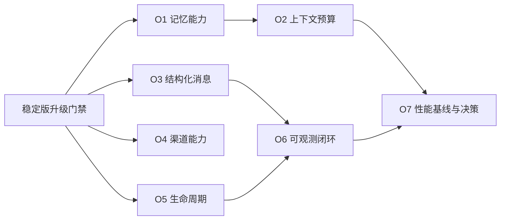

# OpenClaw 稳定版后续功能优化规格

日期：2026-09-29。状态：O1 已完成当时本地候选物验收，见[O1 记录](../reports/2026-10-03-o1-memory-capability.md)；O2 已完成当时本地候选物验收与独立审查，见[O2 记录](../../../.superpowers/sdd/2026-09-29-openclaw-followup-optimization/task-2-report.md)；O3 已完成当时本地候选物验收与独立审查，见[O3 记录](../../../.superpowers/sdd/2026-09-29-openclaw-followup-optimization/task-3-report.md)；O4 已完成当时本地候选物验收与独立复审，见[O4 记录](../../../.superpowers/sdd/2026-09-29-openclaw-followup-optimization/task-4-report.md)；O5 已完成当时本地候选物验收与独立复审，见[O5 记录](../../../.superpowers/sdd/2026-09-29-openclaw-followup-optimization/task-5-report.md)；O6 本地六插件安装态验收及独立质量复审通过，但 Agent 到投递的 trace 身份未贯通，仍为部分完成，见[O6 记录](../../../.superpowers/sdd/2026-09-29-openclaw-followup-optimization/task-6-report.md)；O7 本地基准与独立审查通过，见[基准报告](../reports/2026-09-29-plugin-state-benchmark.md)。O3 兼容修复后，全仓 27 插件证据需按新输入指纹重跑；O6 规格仍未完成。与 [稳定版升级规格](2026-09-29-openclaw-2026-9-6-upgrade.md) 分属两个交付目标，各自一份规格和一份计划。

**规格事实源：** 本文件；[实施计划](../plans/2026-09-29-openclaw-followup-optimization.md) 负责执行拆解。通用插件约定沿用 [PLUGIN_SPEC](../../../spec/PLUGIN_SPEC.md)。未实施项仍是审计建议的可审阅任务化设计，不能称为已实现能力。

## 1. 目标和前提

在 OpenClaw 2026.9.6 的兼容和安全问题解决后，改善记忆/RAG、消息表达、渠道能力、生命周期和可观测性，并为存储性能决策建立测量依据。

- 前置发布基线：稳定版升级 U1–U8 完成；优化单项可提前做独立测试设计，但不能绕过升级验收宣称已发布。
- 运行基线沿用 OpenClaw `2026.9.6`、Node `>=24.16.0 <25 || >=26.1.0`、pnpm `9.0.0`。
- 不新增跨插件依赖；公共代码仅放 message-sdk。保留现有配置默认行为，新增能力通过显式配置开启。
- 保留会话隔离、媒体访问授权、状态加密、保留策略、容量限制和现有故障回退。

## 2. 优化要求和验收

| 编号 | 目标 | 可观察验收 |
| --- | --- | --- |
| O1 | Memory/OpenMem 能力接入 | 已有 registerMemoryCapability 保留；声明实际召回工具、基于实际可用工具构建 prompt；缺失可靠会话身份不写入共享 unknown 桶；跨会话检索只按显式共享策略发生 |
| O2 | RAG 与记忆上下文预算 | 提供组合配置校验，所有启用插件的 token 预算之和不超过声明总预算；各插件注入带来源标记、同源结果去重、遵守分配上限；超时/取消不返回迟到注入 |
| O3 | 结构化消息保真 | Wire 新格式显式选择并标记版本；保留有序文本/媒体、reply/thread、消息与投递身份；旧消费者仍可使用原文本格式；不支持的附件明确降级或拒绝，不能悄悄丢失 |
| O4 | Bridge 渠道能力 | 更新稳定版渠道来源；区分静态已知、已安装、已启用、运行就绪；未知渠道不授予额外能力；静态配置存在不能被报告为已连接 |
| O5 | 生命周期 | 同一进程两个注册实例相互隔离；旧 stop 不停止新实例；重复 start/stop 幂等；启动失败释放部分资源；取消后的迟到回调不写状态或投递 |
| O6 | 可观测闭环 | run/message/delivery 身份贯通日志和 trace；新增结算失败、重试、DLQ、召回耗时指标；敏感正文与凭据脱敏；禁止 messageId/sessionKey 作为 Prometheus 无界标签 |
| O7 | 性能与存储决策 | 对 JSONL 检索和 Router JSON 状态记录规模、P50/P95、吞吐、扫描/写入字节和事件循环延迟；同机同数据可复现；形成保留或迁移建议，未授权不执行存储迁移 |

### O1 边界

memory 已有会话隔离、扫描预算、保留和加密；openmem 已有外部会话协调，不重新实现。`deterministicRecallToolName` 分别对应真实注册的 memory_search/openmem_search。promptBuilder 只描述已可调用工具。flush/publicArtifacts 按后端真实能力实现或明确未提供，禁止为对齐上游名称返回虚假空成功；不自动宣称 supportsPrivateTranscriptRecall。已有历史 unknown 会话数据不自动迁移或删除。

### O2 预算配置

新增显式可选的 context budget profile：`{totalTokens, allocations:{knowledge,memory,bridge}}`，值均为非负整数；分配和不得超过 totalTokens。各启用插件必须有分配，缺失时 profile 校验失败；未启用 profile 保留现有插件配置。tokenizer 固定并记录版本；未具备 tokenizer 时使用保守上界，不能把字符数当作 token 数。此 profile 只分配插件注入预算，不替代宿主对系统 prompt、对话和工具的上下文预算。新 profile 通过校验器生成各插件配置，避免共享运行时全局计数状态。

### O3 协议边界

新增 wire 格式以 `structured-v1` 显式启用，schemaVersion=1；旧 envelope/legacyJsonText 保留原行为。Router 对未声明支持结构化 payload 的目标默认拒绝含媒体消息；允许文本降级须显式配置并在审计中标识。出站媒体必须继续经过宿主授权加载，不得在信封中泄露本地绝对路径、认证 token 或未经批准的私有 URL。

Router 开启结构化能力后，普通业务 JSON（包括仅有 `schemaVersion` 字段的文本）仍走旧文本路由。只有带显式 `format: "structured-v1"` 标记，或为兼容已发布 O3 wire 而具备 `schemaVersion`、`messageId`、`deliveryId`、`parts` 全部协议字段的对象，才进入严格协议解析；被识别的无效版本或字段必须报错，不能悄悄降级。结构化发送方应携带显式格式标记，新旧完整 wire 的有序片段、身份和媒体授权语义保持不变。

### O5/O6 适用范围

优先覆盖 oauth2、mtls 的 activeProxy、nacos 活跃服务、tracing 的上下文和 prometheus 的 collector/cache。这些是需要验证的生命周期风险，不预先宣称所有插件都存在串实例故障。保留 tracing 已有 generation/停止超时和 Prometheus 已有 scrape 授权；新增隔离不能削弱已有机制。

### O7 决策门禁

使用确定性脱敏数据集：memory 1千/1万/10万记录，Router 100/1千/1万待投递项，在允许的容量配置内运行。每组固定种子、记录硬件、预热后至少 5 次测量；高规模超出配置时必须记录拒绝，不能悄悄调大生产上限。相同质量/隔离/加密约束下比较策略；没有用户工作负载 SLO 时只交付基线与瓶颈证据，不编造达标结论。SQLite/worker/索引迁移若被推荐，另立增量规格并获得确认。

## 3. 非目标与完成条件

不重写 amap/meituan/rednode 的业务 API，不自动扩展全部上游渠道，不重建 Agent Harness，不迁移用户存量数据，不发布 npm；Git 提交与推送仅按用户后续明确授权执行。每项优化独立记录结果；O7 完成意味着基准与决策文档完成，不意味着存储迁移完成。对行为有变化的插件重跑稳定版安装态证据；不得借用优化前 PASS。

