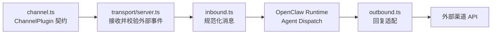

# TEMPLATE_LABEL

**OpenClaw 插件 — TEMPLATE_DESCRIPTION**

[English](./README.en.md) | [简体中文](./README.zh-CN.md)

## 简介

TEMPLATE_LABEL（`@partme.ai/openclaw-TEMPLATE_NAME`）是 [OpenClaw](https://github.com/openclaw/openclaw) 的 Channel 插件脚手架，目录结构遵循 [Base Profile](../../doc/OpenClaw-Plugin-Structure-Standard.md#4-base-profile--基础结构规范)。

## 默认运行链路



新插件必须根据真实协议改写这张图，并在图后说明 ACK、重试、幂等、背压和停机语义；脚手架只定义结构，不替具体协议作可靠性承诺。

## 目录结构

**Base Profile（§4，默认可运行）** — 平铺 `src/*.ts` + `transport/server.ts` + `test/*.test.ts`。

**Extended Profile（§7.2，占位目录）** — 复杂度触发后再迁移；空目录以 `.gitkeep` 保留于 Git。

```
├── skills/README.md          # Agent Skill 资产（MAY）
├── hooks/.gitkeep            # Hook 资产（MAY）
├── src/
│   ├── index.ts              # defineChannelPluginEntry 主入口
│   ├── channel.ts            # ChannelPlugin 定义
│   ├── channel-setup-factory.ts
│   ├── runtime.ts            # PluginRuntime 注入
│   ├── inbound.ts / outbound.ts
│   ├── onboarding.ts / setup-entry.ts
│   ├── config.ts / types.ts
│   ├── transport/server.ts   # HTTP / 传输层
│   ├── channel/.gitkeep      # Extended → channel/channel.ts
│   ├── config/.gitkeep       # Extended → config/
│   ├── dispatch/.gitkeep     # Extended → dispatch/（来自 inbound）
│   ├── outbound/.gitkeep     # Extended → outbound/index.ts
│   ├── runtime/.gitkeep      # Extended → runtime/
│   ├── types/.gitkeep        # Extended → types/
│   ├── webhook/.gitkeep      # Extended → webhook/（来自 transport）
│   └── media/.gitkeep        # Extended → 媒体模块
└── test/
    ├── *.test.ts             # 单元测试（SHOULD）
    └── e2e/.gitkeep          # E2E / 契约测试（MAY）
```

## 开发

```bash
pnpm install
pnpm typecheck
pnpm test
pnpm build
```

## 许可证

[MIT License](./LICENSE)
