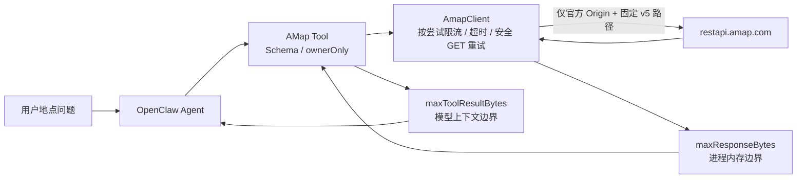
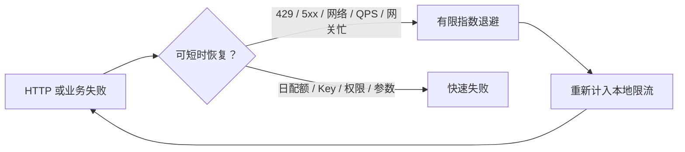

# OpenClaw AMap

适配 OpenClaw 2026.7.1 的高德 Web 服务 API 工具插件。它不是聊天渠道，不注册 Webhook，也不伪造消息发送能力。

## 调用架构

```text
用户地点问题
     │
     ▼
OpenClaw Agent
     │ 结构化 Tool Call
     ▼
AMap Tool 参数边界 ── ownerOnly / 坐标 / POI 类型 / 200 条分页上限
     │
     ▼
AmapClient ── 固定三条 GET 白名单 / 每次尝试计入限流
     │
     ├── 429、5xx、瞬时业务错误 → 指数退避 + 双向抖动 → 有限重试
     │
     ▼
https://restapi.amap.com（Key 仅在传输层）
     │
     ▼
响应流字节上限 → JSON/status 信封校验 → 错误凭据脱敏
     │
     ▼
Tool Result 字节上限 → Agent transcript
```



## 工具

- `amap_search_places`：地点搜索 2.0，调用 `/v5/place/text`。
- `amap_search_nearby`：周边搜索 2.0，调用 `/v5/place/around`。
- `amap_place_detail`：地点详情 2.0，调用 `/v5/place/detail`。

## 配置

```json
{
  "plugins": {
    "entries": {
      "amap": {
        "enabled": true,
        "config": {
          "enabled": true,
          "requestTimeoutMs": 8000,
          "retryAttempts": 1,
          "maxResponseBytes": 1048576,
          "maxToolResultBytes": 262144,
          "maxRequestsPerMinute": 120,
          "ownerOnly": false
        }
      }
    }
  }
}
```

生产环境通过 `AMAP_WEB_SERVICE_KEY` 注入 Web 服务 Key；也可使用敏感配置项 `key`。`apiBaseUrl` 只允许官方 `https://restapi.amap.com` 且禁止自定义端口；回环 E2E 地址可使用 HTTP。

插件校验六位 POI 类型码、最多 10 个 POI ID、经纬度和 200 条组合分页边界。`maxResponseBytes` 保护进程内存，`maxToolResultBytes` 保护模型上下文；每次实际 HTTP 尝试（包括重试）都会消耗本地速率额度。

429、5xx、网络错误，以及官方定义的分钟/QPS 限流和网关瞬时错误只做有限重试；日配额、Key、权限和参数错误不会重试。进程内限流不能替代多实例统一限流。



安装态闭环验证：

```bash
OPENCLAW_E2E_HOST_GATEWAY=1 pnpm test:e2e -- --plugins amap --skip-browser
```

官方接口依据：[Web 服务入门](https://lbs.amap.com/api/webservice/gettingstarted)、[地点搜索 2.0](https://lbs.amap.com/api/webservice/guide/api-advanced/newpoisearch)、[错误码说明](https://lbs.amap.com/api/webservice/guide/tools/info/)。
