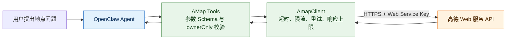

# OpenClaw AMap 中文说明

`@partme.ai/amap` 是适配 OpenClaw 2026.7.1 的高德 Web 服务工具插件。它向 Agent 提供地点搜索能力，不是聊天渠道，也不会注册 Webhook 或伪造消息发送能力。

完整参数和接口依据见同目录 [README.md](./README.md)，本页重点说明插件在系统中的位置、边界和上线检查方式。

## 架构与调用链



插件只负责把结构化工具调用转换成高德 HTTP 请求。对话上下文、工具选择和结果表达由 OpenClaw Agent 负责；Key 配额与高德数据质量由外部服务负责。

## 提供的工具

- `amap_search_places`：地点关键词搜索，对应 `/v5/place/text`。
- `amap_search_nearby`：指定经纬度的周边搜索，对应 `/v5/place/around`。
- `amap_place_detail`：根据 POI ID 查询详情，对应 `/v5/place/detail`。

## 最小配置

```json
{
  "plugins": {
    "entries": {
      "amap": {
        "enabled": true,
        "config": {
          "enabled": true,
          "requestTimeoutMs": 8000,
          "retryAttempts": 1,
          "maxRequestsPerMinute": 120,
          "ownerOnly": false
        }
      }
    }
  }
}
```

生产环境优先通过 `AMAP_WEB_SERVICE_KEY` 注入 Key。远程 `apiBaseUrl` 必须使用 HTTPS；仅回环测试地址允许 HTTP。

## 安全与生产边界

- 工具入口会校验关键词、POI ID、经纬度范围和分页参数。
- 客户端限制请求超时、响应体大小和单进程请求速率。
- 429、5xx 与网络错误只做有限重试，避免放大外部故障。
- `ownerOnly=true` 可把高德 Key 的消耗限制给所有者调用。
- 进程内限流不能替代多实例共享限流；集群部署需在网关或出口层统一保护配额。

## 验证

```bash
openclaw plugins doctor
pnpm --filter @partme.ai/amap typecheck
pnpm --filter @partme.ai/amap test
pnpm --filter @partme.ai/amap build
```

环境验收还应覆盖：合法地点搜索、非法经纬度、Key 失效、429、上游超时和超大响应。
