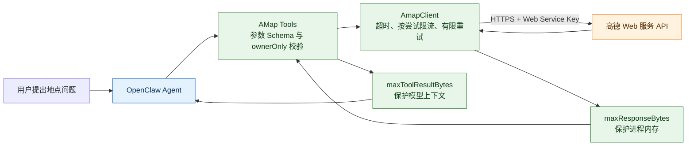
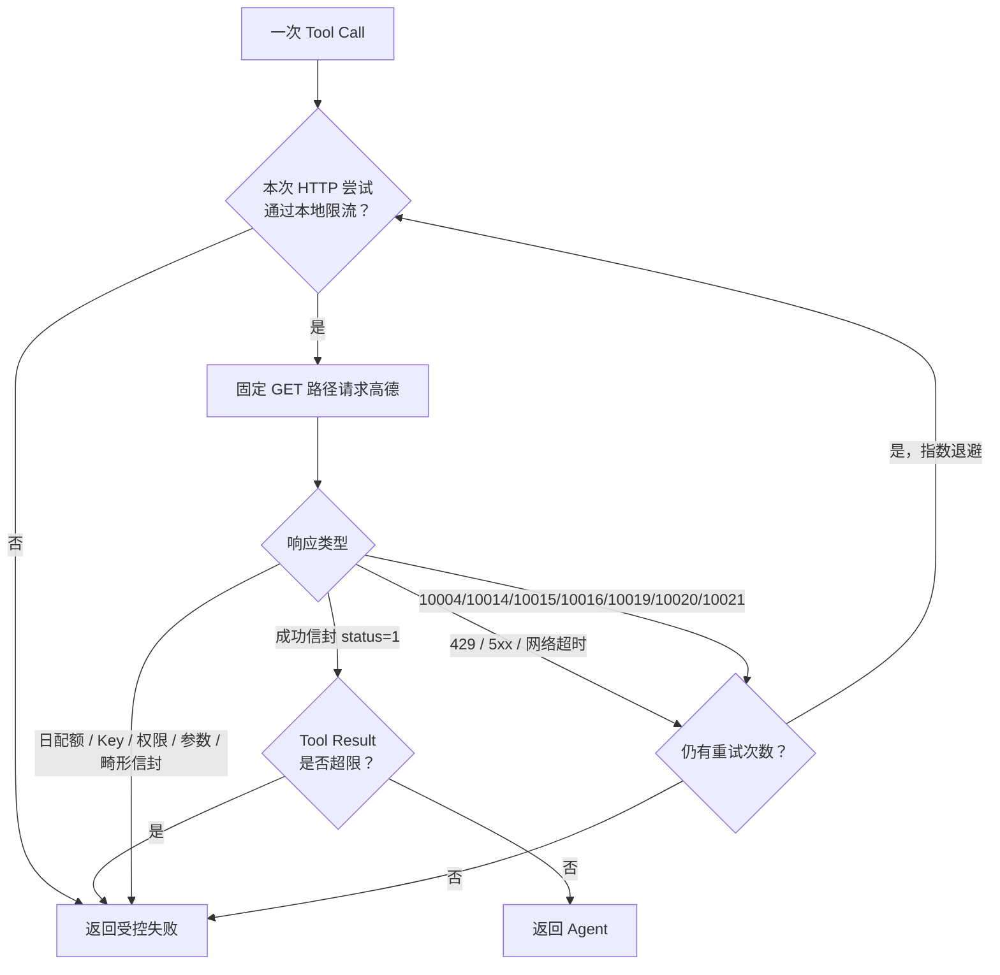

# OpenClaw AMap 中文说明

`@partme.ai/openclaw-amap` 是适配 OpenClaw 2026.7.1 的高德 Web 服务工具插件。它向 Agent 提供地点搜索能力，不是聊天渠道，也不会注册 Webhook 或伪造消息发送能力。

完整参数和接口依据见同目录 [README.md](./README.md)，本页重点说明插件在系统中的位置、边界和上线检查方式。

## 架构与调用链



插件只负责把结构化工具调用转换成高德 HTTP 请求。对话上下文、工具选择和结果表达由 OpenClaw Agent 负责；Key 配额与高德数据质量由外部服务负责。

## 提供的工具

- `amap_search_places`：地点关键词搜索，对应 `/v5/place/text`。
- `amap_search_nearby`：指定经纬度的周边搜索，对应 `/v5/place/around`。
- `amap_place_detail`：根据 POI ID 查询详情，对应 `/v5/place/detail`。

## 最小配置

```json
{
  "plugins": {
    "entries": {
      "amap": {
        "enabled": true,
        "config": {
          "enabled": true,
          "requestTimeoutMs": 8000,
          "retryAttempts": 1,
          "maxResponseBytes": 1048576,
          "maxToolResultBytes": 262144,
          "maxRequestsPerMinute": 120,
          "ownerOnly": false
        }
      }
    }
  }
}
```

生产环境优先通过 `AMAP_WEB_SERVICE_KEY` 注入 Key。远程 `apiBaseUrl` 只允许官方 `https://restapi.amap.com` 且禁止自定义端口；仅隔离回环测试地址允许 HTTP，避免把固定 Tool 变成访问第三方或内网的 SSRF 入口。

## 安全与生产边界

- 工具入口会校验关键词、六位 POI 类型码、最多 10 个 POI ID、经纬度范围，以及“同一检索条件最多 200 条”的组合分页边界。
- `maxResponseBytes` 限制供应商响应，保护进程内存；更小的 `maxToolResultBytes` 限制 Tool Result，避免大批 POI 挤占模型上下文和会话存储。
- 429、5xx、网络错误，以及官方错误码中的分钟/QPS 限流和网关忙只做有限重试；日配额、Key、权限和参数错误快速失败。
- 每次真实 HTTP 尝试（包括重试）都计入进程内限流，重试不能绕过本地配额。
- `ownerOnly=true` 可把高德 Key 的消耗限制给所有者调用。
- 三个路径虽是固定白名单，Origin 也必须锁定官方主机；“任意 HTTPS 都安全”是不成立的。
- 进程内限流不能替代多实例共享限流；集群部署需在网关或出口层统一保护配额。

## 失败与重试决策



这张图中的两个“上限”解决不同问题：供应商响应即使在 1 MiB 内，也可能仍然远大于一次合理的模型工具结果，因此不能只设置 `maxResponseBytes`。

## 验证

```bash
openclaw plugins doctor
pnpm --filter @partme.ai/openclaw-amap typecheck
pnpm --filter @partme.ai/openclaw-amap test
pnpm --filter @partme.ai/openclaw-amap test:coverage
pnpm --filter @partme.ai/openclaw-amap build
OPENCLAW_E2E_HOST_GATEWAY=1 pnpm test:e2e -- --plugins amap --skip-browser
```

独立 E2E 从正式 tarball 安装插件，真实发起 Agent Tool Call；本地高德协议夹具先返回 503、再返回 POI，验证安全 GET 只重试一次，并确认 Tool Result 回到模型 transcript。环境验收还应覆盖：真实合法地点搜索、非法经纬度、Key 失效、429、上游超时和超大响应。
