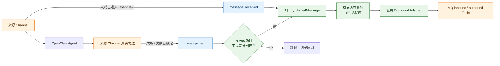
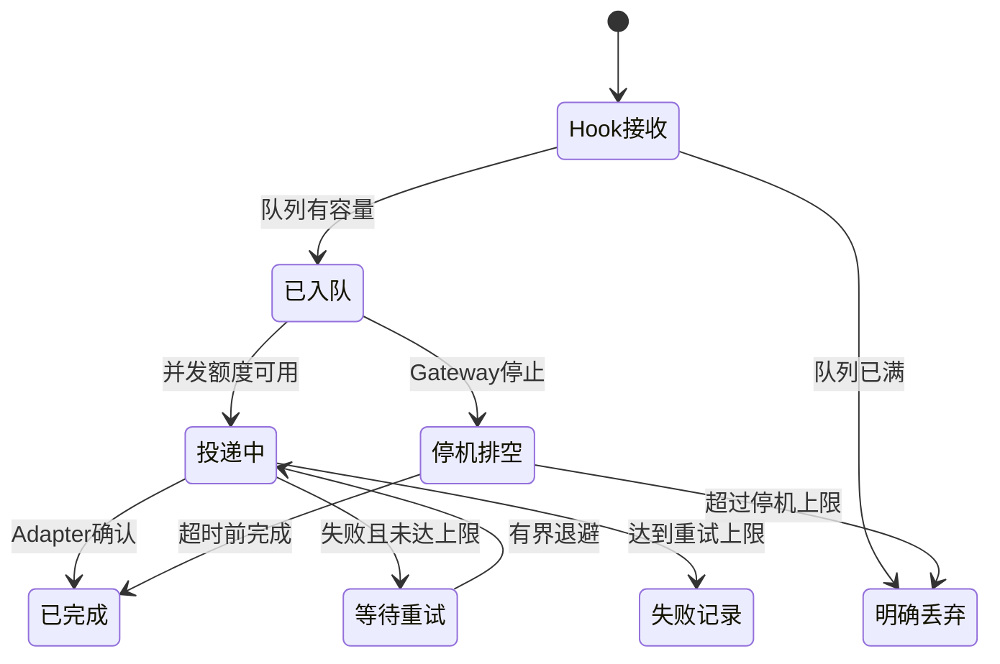

# OpenClaw Bridge

`@partme.ai/openclaw-bridge` 是面向 OpenClaw 2026.7.1 的跨渠道上下文与消息观测桥。它不替代任何 IM 或 MQ Channel 插件，主要提供两项能力：

- 通过官方 `before_prompt_build` Hook，为已配置的 IM 渠道追加平台交互约束。
- 通过官方 `message_received`、`message_sent` Hook 观察真实收发结果，再经公共 channel outbound adapter 将 `UnifiedMessage` 镜像到 MQ。

字符图先展示 Hook 主链与后台镜像的边界；下方 Mermaid 保留同一架构的可渲染视图：

```text
Source Channel
      │
      ├── before_prompt_build ──▶ platform context ──▶ Agent Prompt
      │
      ├── message_received ─────┐
      │                         │
      └── actual send ──▶ message_sent(success=true)
                                │
                                ▼
                       UnifiedMessage normalize
                                │
                                ▼
                     bounded in-memory queue
                       (ordered per traceId)
                                │
                    ┌───────────┴───────────┐
                    ▼                       ▼
             adapter confirmed        timeout / retry
                                             │
                                             ▼
                                    exhausted: log failure
                                │
                                ▼
                     Channel Outbound Adapter
                                │
                                ▼
                    MQTT / RabbitMQ / Redis Stream /
                         RocketMQ / STOMP
```



`message_sent` 是传输完成事件：Bridge 只镜像 `success=true` 的真实出站结果。仓库内使用 `message-sdk` 自定义 reply pipeline 的 Wire/MQ 通道，会在协议 publish 成功或失败后补齐同一官方 Hook；Hook 观察者失败不会反向改变已经完成的协议发送。`reply_payload_sending` 属于发送前的回复处理阶段，不能证明外部平台已经接受消息，因此不再用于 Bridge 出站审计。

## 安装

```bash
openclaw plugins install @partme.ai/openclaw-bridge
```

Bridge 的清单 ID 是 `bridge`，配置应写入 `plugins.entries.bridge.config`。

## 配置示例

```json
{
  "plugins": {
    "entries": {
      "bridge": {
        "enabled": true,
        "config": {
          "channels": {
            "discord": {
              "enabled": true,
              "contextInjection": true,
              "forwardToMq": true,
              "mqChannel": "rabbitmq",
              "mqAccountId": "default",
              "topicPrefix": "openclaw/bridge/discord"
            },
            "wecom": {
              "enabled": true,
              "forwardToMq": true,
              "mqChannel": "mqtt"
            }
          },
          "delivery": {
            "maxAttempts": 3,
            "retryDelayMs": 250,
            "publishTimeoutMs": 5000,
            "maxPayloadBytes": 1048576,
            "maxInFlight": 4,
            "maxBufferedMessages": 1024,
            "shutdownTimeoutMs": 10000
          }
        }
      }
    }
  }
}
```

只有 `channels` 中显式声明的来源渠道会被处理。未知来源渠道或 MQ 渠道会在启动时失败，避免静默回退后误投递。

## MQ 渠道

支持以下 outbound adapter ID：

- `mqtt`
- `mqtt-ws`（兼容旧别名 `web-mqtt`）
- `rabbitmq`
- `redis-stream`
- `rocketmq`
- `stomp`（兼容旧别名 `web-stomp`）
- `stomp-tcp`

MQ 插件必须独立安装并配置。MQTT、RabbitMQ、Redis Stream、RocketMQ 使用 `openclaw-direct-topic:v1:` 显式直达契约，不会把 OpenClaw 普通 durable reply 的 `deliveryQueueId` 误判成 Topic。STOMP 使用 `/topic/` destination。

默认 Topic：

- `openclaw/bridge/{sourceChannel}/inbound`
- `openclaw/bridge/{sourceChannel}/outbound`

可用 `topicPrefix` 覆盖前缀。

## 渠道范围

静态能力表包含 27 个渠道：20 个 OpenClaw 2026.7.1 stock 渠道、当前仓库的 `wecom`、`openclaw-weixin`、`wechat-ipad`、`wecom-kf`、`douyin`、`mqtt`，以及外部 `dingtalk-connector`。其中飞书与 QQ 的当前 stock ID 分别是 `feishu`、`qqbot`；旧文档中的 `openclaw-lark` 已不再使用。

Bridge 只对实际安装、运行、在配置中启用且正确发出官方消息 Hook 的渠道生效。静态能力表表示“有上下文预设和配置识别”，不代表 27 个渠道均已安装或完成环境验收。当前安装态 E2E 使用 MQTT 验证入站、Agent 回复、`message_sent`、双向审计 Topic 与防回环；其他渠道仍须逐个做真实账号/租户验收。

## 投递语义与边界

- Hook 只完成校验、归一化和非阻塞入队，不等待 Broker 网络请求，因此 MQ 故障不会把 OpenClaw 主消息链拖进重试延迟。
- 后台 Service 用 `maxInFlight` 限制并发、用 `maxBufferedMessages` 限制等待队列；不同 `traceId` 可并发，同一会话仍按入队顺序串行，避免重试时发生回复反超。队列满时明确记录被丢弃消息的 ID、渠道和方向。
- 单条后台任务有界重试，每次重试复用同一个 `deliveryQueueId`。
- 单条 JSON 载荷受 `maxPayloadBytes` 限制。
- Gateway 停止时先排空队列；超过 `shutdownTimeoutMs` 后中断退避、丢弃未开始任务并报告结果未知的在途数量。
- 进程崩溃会丢失尚未完成的内存任务，因此 Bridge 本身是 best-effort/at-least-once 观测镜像，不提供持久 Outbox。
- 需要跨重启恢复、DLQ、审计和运维回放时，应使用 `@partme.ai/openclaw-router` 的持久投递链路。
- Broker 超时后的实际结果可能未知，下游应按 `messageId`/`deliveryQueueId` 实现幂等。
- 来源 Channel 与目标 MQ adapter 的错误在进入 Gateway 日志前会脱敏 URL 用户信息、Authorization、Token/Secret，并清理控制字符、限制诊断长度。



## 开发验证

```bash
pnpm test
pnpm typecheck
pnpm build
npm pack --dry-run
```

## License

MIT
