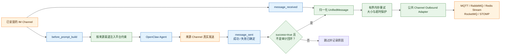
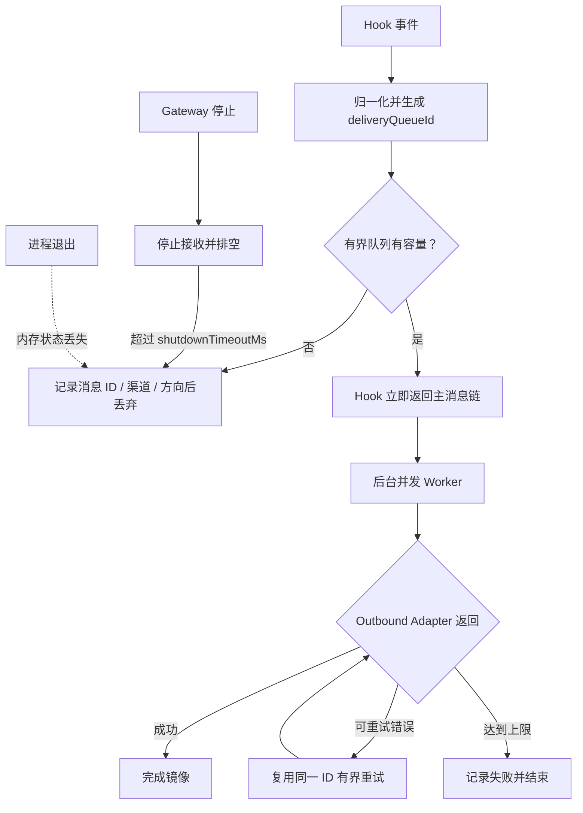

# OpenClaw Bridge 中文说明

`@partme.ai/openclaw-bridge` 是面向 OpenClaw 2026.7.1 的上下文与消息观测桥。它不会替代 IM 或 MQ Channel，而是利用官方 Hook 给指定渠道补充平台约束，并把真实收发消息归一化后镜像到 MQ。

完整配置和支持的 adapter 列表见 [README.md](./README.md)。

## 两条独立链路



上下文注入只影响 Agent 构建提示词；消息镜像只观察真实入站与已经完成传输的出站结果。二者可按来源渠道分别开关，不应把 MQ 消息再次伪装成 IM 入站消息。

Bridge 不再使用发送前的 `reply_payload_sending` 作为出站依据，因为它不能证明外部平台已接受消息。仓库内使用 `message-sdk` 自定义 reply pipeline 的 Wire/MQ 通道，会在协议发送成功或失败后补齐官方 `message_sent` Hook；Bridge 仅镜像 `success=true`，失败事件只记录告警。Hook 观察器自身失败不会改变原始协议发送结果。

## 覆盖范围与验收边界

静态注册表包含 27 个渠道：20 个 OpenClaw stock 渠道、仓库内 6 个渠道（`wecom`、`openclaw-weixin`、`wechat-ipad`、`wecom-kf`、`douyin`、`mqtt`）以及外部 `dingtalk-connector`。这只表示 Bridge 能识别配置并提供上下文预设，不等于全部渠道已经生产验收。

当前安装态 E2E 使用 MQTT 证明以下完整链路：真实 MQTT 入站 → Agent Turn → MQTT 回复 → `message_sent` → Bridge inbound/outbound 审计 Topic，并检查同源 MQ 审计不会递归。其他渠道仍要用真实账号、租户、权限和网络环境逐个验收。

## 配置示例

```json
{
  "plugins": {
    "entries": {
      "bridge": {
        "enabled": true,
        "config": {
          "channels": {
            "wecom": {
              "enabled": true,
              "contextInjection": true,
              "forwardToMq": true,
              "mqChannel": "mqtt",
              "topicPrefix": "openclaw/bridge/wecom"
            }
          },
          "delivery": {
            "maxAttempts": 3,
            "retryDelayMs": 250,
            "publishTimeoutMs": 5000,
            "maxPayloadBytes": 1048576,
            "maxInFlight": 4,
            "maxBufferedMessages": 1024,
            "shutdownTimeoutMs": 10000
          }
        }
      }
    }
  }
}
```

只有 `channels` 中显式声明的来源渠道会被处理。未知来源或 MQ adapter 会在启动时失败，避免静默回退后误投递。

## 投递语义



Bridge 是 best-effort/at-least-once 的观测镜像：Hook 不等待 Broker；后台 Service 以 `maxInFlight`、`maxBufferedMessages` 和 `shutdownTimeoutMs` 控制并发、内存与停机时长。不同 `traceId` 可并发，同一会话保持顺序。Broker 超时后结果可能未知，下游必须按 `messageId` 或 `deliveryQueueId` 幂等。需要跨重启 Outbox、DLQ、审计和人工回放时，应使用 `@partme.ai/openclaw-router`。

## 验证

```bash
openclaw plugins doctor
pnpm --filter @partme.ai/openclaw-bridge typecheck
pnpm --filter @partme.ai/openclaw-bridge test
pnpm --filter @partme.ai/openclaw-bridge build
```

环境验收需要同时观察：提示词是否只对指定 IM 渠道注入、入站与出站 Topic 是否正确、MQ 断开时重试是否有界、恢复后下游幂等是否生效。
