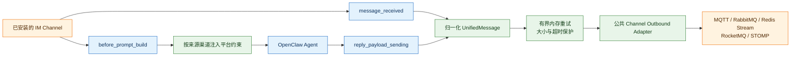
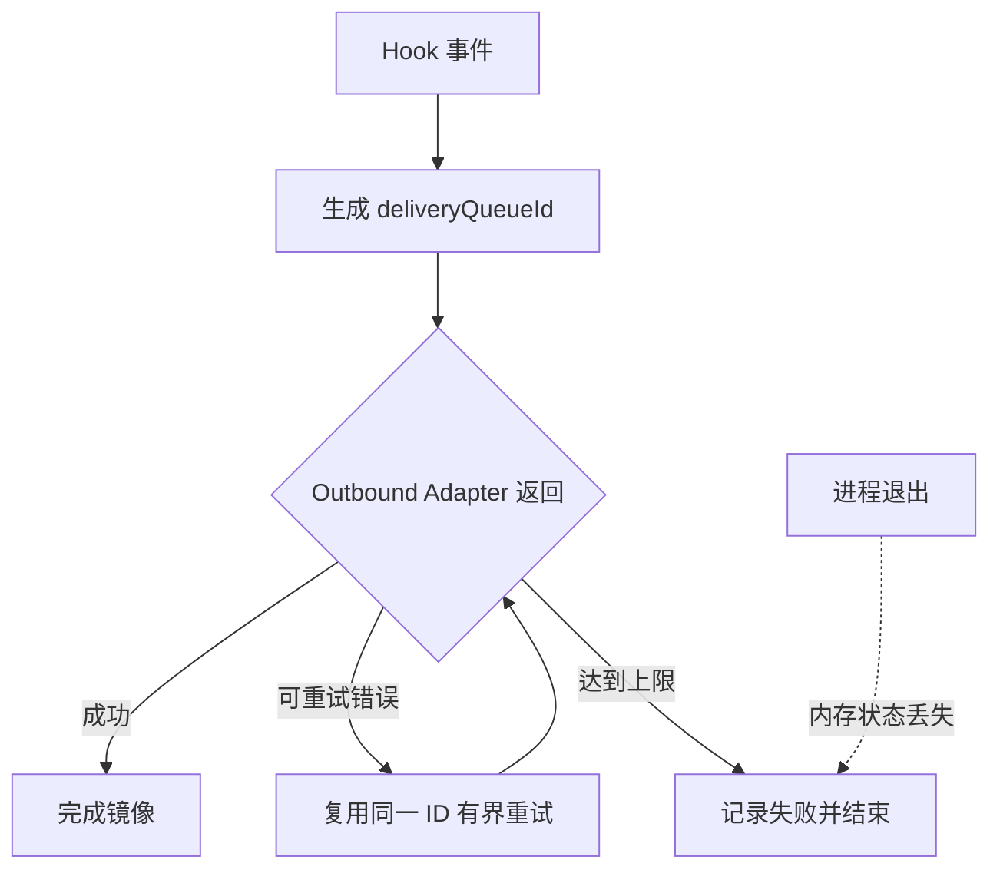

# OpenClaw Bridge 中文说明

`@partme.ai/openclaw-bridge` 是面向 OpenClaw 2026.7.1 的上下文与消息观测桥。它不会替代 IM 或 MQ Channel，而是利用官方 Hook 给指定渠道补充平台约束，并把真实收发消息归一化后镜像到 MQ。

完整配置和支持的 adapter 列表见 [README.md](./README.md)。

## 两条独立链路



上下文注入只影响 Agent 构建提示词；消息镜像只观察真实入站与待发送回复。二者可按来源渠道分别开关，不应把 MQ 消息再次伪装成 IM 入站消息。

## 配置示例

```json
{
  "plugins": {
    "entries": {
      "bridge": {
        "enabled": true,
        "config": {
          "channels": {
            "wecom": {
              "enabled": true,
              "contextInjection": true,
              "forwardToMq": true,
              "mqChannel": "mqtt",
              "topicPrefix": "openclaw/bridge/wecom"
            }
          },
          "delivery": {
            "maxAttempts": 3,
            "retryDelayMs": 250,
            "publishTimeoutMs": 5000,
            "maxPayloadBytes": 1048576
          }
        }
      }
    }
  }
}
```

只有 `channels` 中显式声明的来源渠道会被处理。未知来源或 MQ adapter 会在启动时失败，避免静默回退后误投递。

## 投递语义



Bridge 是 best-effort/at-least-once 的观测镜像：Broker 超时后结果可能未知，下游必须按 `messageId` 或 `deliveryQueueId` 幂等。需要跨重启 Outbox、DLQ、审计和人工回放时，应使用 `@partme.ai/openclaw-router`。

## 验证

```bash
openclaw plugins doctor
pnpm --filter @partme.ai/openclaw-bridge typecheck
pnpm --filter @partme.ai/openclaw-bridge test
pnpm --filter @partme.ai/openclaw-bridge build
```

环境验收需要同时观察：提示词是否只对指定 IM 渠道注入、入站与出站 Topic 是否正确、MQ 断开时重试是否有界、恢复后下游幂等是否生效。
