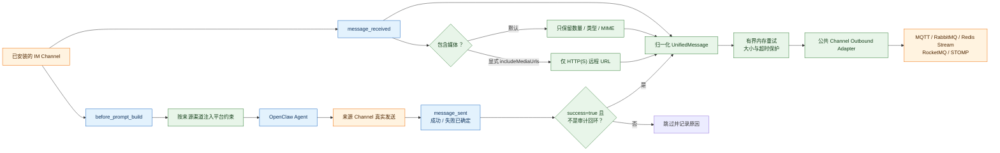
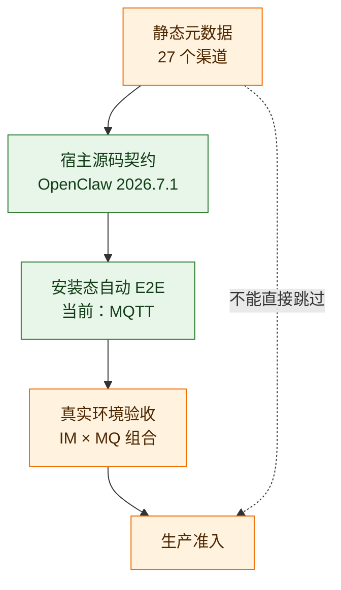
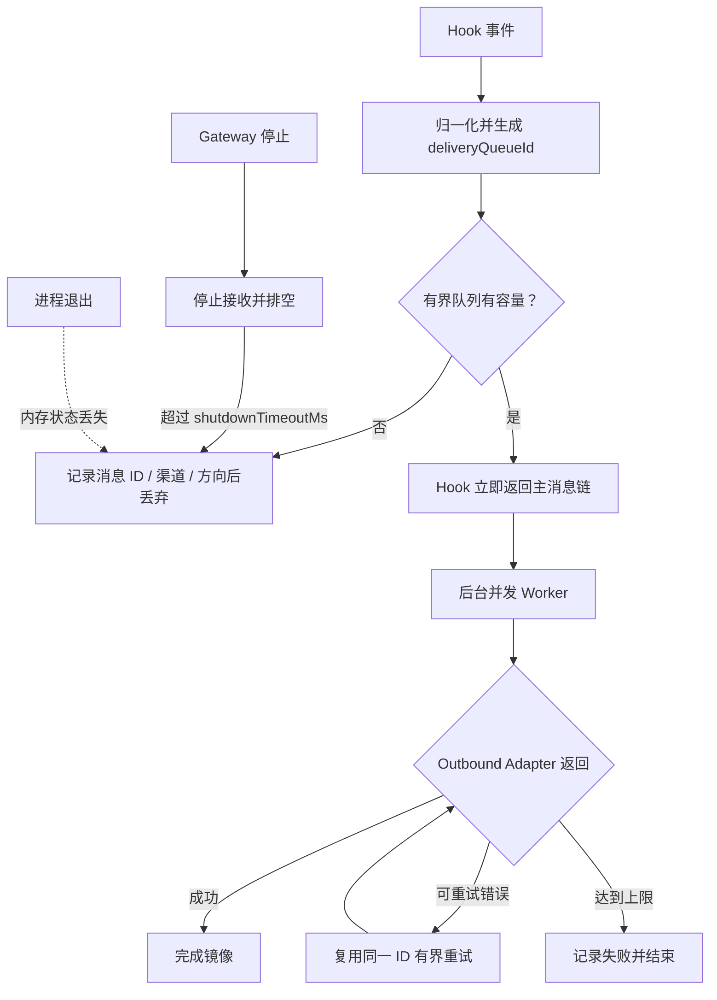

# OpenClaw Bridge 中文说明

<!-- README_STANDARD_START -->

> 统一阅读顺序：组件定位 → 架构 → 流程 → 边界 → 安装 → 配置 → 运维 → 深入阅读。
> 本区块以 npm 可稳定渲染的 text 图为主；适用时，更深入的 Mermaid 图保留在仓库 `doc/` 设计资料中。

[简体中文](./README.md)

## 1. 组件定位

跨渠道补充上下文并镜像消息事件。组件类型：**Hook / 消息观测桥**。

| 项目 | 内容 |
|---|---|
| npm 包 | `@partme.ai/openclaw-bridge` |
| 当前版本 | `2026.7.1` |
| 插件 ID | `bridge` |
| Channel ID | — |
| OpenClaw | `>=2026.7.1` |
| 源码目录 | `extensions/bridge` |

## 2. 一眼看懂

```text
[OpenClaw 收发消息 Hook]
          │
          ▼
┌──────────────────────────────────────────────────────────────┐
│ OpenClaw Gateway 内: bridge
│ 1. 识别来源 Channel 与上下文预设
│ 2. 规范化为 UnifiedMessage
│ 3. 注入上下文或投递到 MQ
└──────────────────────────────────────────────────────────────┘
          │
          ▼
[上下文约束与审计消息]
```

## 3. 架构与核心流程

该组件把“协议/平台差异”限制在自身边界内，对 OpenClaw 暴露稳定的插件、Channel、Hook、Tool 或 Service 契约。

```text
OpenClaw 收发消息 Hook
  │
  ▼
识别来源 Channel 与上下文预设
  │
  ▼
规范化为 UnifiedMessage
  │
  ▼
注入上下文或投递到 MQ
  │
  ▼
上下文约束与审计消息

异常路径: 任一步失败：记录可诊断错误并按组件策略重试、拒绝或降级
```

## 4. 能力与边界

| 能力 | 说明 |
|---|---|
| 负责 | 跨渠道补充上下文并镜像消息事件 |
| 不负责 | 不替代原始 Channel，也不接管平台鉴权 |
| 输入 | OpenClaw 收发消息 Hook |
| 输出 | 上下文约束与审计消息 |
| 失败原则 | 默认失败应可观测；鉴权、边界校验和持久化失败不得伪装成功 |

## 5. 快速开始

```bash
openclaw plugins install "@partme.ai/openclaw-bridge@2026.7.1"
```

安装后先按最小权限配置，再启动 Gateway；生产环境应在隔离配置目录中完成连通性、权限和失败恢复验证。

## 6. 配置入口

| 配置层 | 路径 |
|---|---|
| 插件配置 | `plugins.entries.bridge.config` |
| Channel 配置 | 不适用 |
| 配置 Schema | `extensions/bridge/openclaw.plugin.json` |

配置字段、环境变量与完整示例继续保留在下方原有详细说明中。

## 7. 运维、安全与故障定位

- 先确认 OpenClaw 版本、插件版本、manifest ID 与配置键一致。
- 凭据使用环境变量或 SecretRef，不写入日志、仓库和示例明文。
- 通过 Gateway 日志、插件健康状态及外部依赖状态分层定位问题。
- 升级前备份状态数据；涉及游标、队列或索引时，必须验证重启恢复与重复投递语义。

## 8. 验证与深入阅读

```bash
pnpm --filter "@partme.ai/openclaw-bridge" typecheck
pnpm --filter "@partme.ai/openclaw-bridge" test
pnpm --filter "@partme.ai/openclaw-bridge" build
```

- [插件总体架构](../../doc/OpenClaw-Plugins-Architecture_CN.md)
- [统一插件结构规范](../../doc/OpenClaw-Plugins-Structure-Standard.md)

## 9. 原有详细说明

以下内容保留该组件原有的配置表、协议细节、示例和故障排查资料。

<!-- README_STANDARD_END -->


`@partme.ai/openclaw-bridge` 是面向 OpenClaw 2026.7.1 的上下文与消息观测桥。它不会替代 IM 或 MQ Channel，而是利用官方 Hook 给指定渠道补充平台约束，并把真实收发消息归一化后镜像到 MQ。

完整配置和支持的 adapter 列表见 [README.md](./README.md)。

## 两条独立链路

字符图先区分“提示词约束”和“消息镜像”两条互不阻塞的链路；下方 Mermaid 继续保留完整、可渲染的组件关系：

```text
已安装的来源 Channel
        │
        ├── before_prompt_build ──▶ 平台上下文约束 ──▶ Agent Prompt
        │
        ├── message_received ─────┐
        │     ├── 文本             │
        │     └── 媒体元数据        │
        │                         │
        └── 平台真实发送 ──▶ message_sent(success=true)
                                  │
                                  ▼
                         UnifiedMessage 归一化
                      （正文 / 会话类型 / 媒体摘要）
                                  │
                                  ▼
                      有界内存队列（同会话保序）
                                  │
                     ┌────────────┴────────────┐
                     ▼                         ▼
              Adapter 确认成功          超时 / 失败重试
                                               │
                                               ▼
                                      达到上限后记录失败
                                  │
                                  ▼
                     MQ Channel Outbound Adapter
                                  │
                                  ▼
                    MQTT / RabbitMQ / Redis Stream /
                         RocketMQ / STOMP
```



上下文注入只影响 Agent 构建提示词；消息镜像只观察真实入站与已经完成传输的出站结果。二者可按来源渠道分别开关，不应把 MQ 消息再次伪装成 IM 入站消息。

Bridge 不再使用发送前的 `reply_payload_sending` 作为出站依据，因为它不能证明外部平台已接受消息。仓库内使用 `message-sdk` 自定义 reply pipeline 的 Wire/MQ 通道，会在协议发送成功或失败后补齐官方 `message_sent` Hook；Bridge 仅镜像 `success=true`，失败事件只记录告警。Hook 观察器自身失败不会改变原始协议发送结果。

## 覆盖范围与验收边界

静态注册表包含 27 个渠道：20 个 OpenClaw stock 渠道、仓库内 6 个渠道（`wecom`、`openclaw-weixin`、`wechat-ipad`、`wecom-kf`、`douyin`、`mqtt`）以及外部 `dingtalk-connector`。这只表示 Bridge 能识别配置并提供上下文预设，不等于全部渠道已经生产验收。

当前安装态 E2E 使用 MQTT 证明以下完整链路：真实 MQTT 入站 → Agent Turn → MQTT 回复 → `message_sent` → Bridge inbound/outbound 审计 Topic，并检查同源 MQ 审计不会递归。其他渠道仍要用真实账号、租户、权限和网络环境逐个验收。

不要把“注册表里有名字”直接理解成“插件已生产就绪”。当前证据分层如下；字符图用于快速判断，下方 Mermaid 保留可渲染的验收漏斗：

```text
27 个静态渠道元数据
        │  仅表示：配置可识别、存在上下文预设
        ▼
OpenClaw 2026.7.1 Hook 契约对齐
        │  表示：Bridge 使用的字段与宿主源码一致
        ▼
MQTT 安装态 tarball E2E
        │  已证明：真实入站 → Agent → 真实出站 → 双向审计、防回环
        ▼
具体 IM + 具体 MQ 的真实环境验收
        │  仍需逐个账号、租户、权限、限流和故障恢复验证
        ▼
该组合可进入生产
```



## 配置示例

```json
{
  "plugins": {
    "entries": {
      "bridge": {
        "enabled": true,
        "config": {
          "channels": {
            "wecom": {
              "enabled": true,
              "contextInjection": true,
              "forwardToMq": true,
              "includeMediaUrls": false,
              "mqChannel": "mqtt",
              "topicPrefix": "openclaw/bridge/wecom"
            }
          },
          "delivery": {
            "maxAttempts": 3,
            "retryDelayMs": 250,
            "publishTimeoutMs": 5000,
            "maxPayloadBytes": 1048576,
            "maxInFlight": 4,
            "maxBufferedMessages": 1024,
            "shutdownTimeoutMs": 10000
          }
        }
      }
    }
  }
}
```

只有 `channels` 中显式声明的来源渠道会被处理。未知来源或不受支持的 MQ ID 会在启动注册时失败；受支持但未安装/未就绪的 adapter 会在后台投递时明确失败并执行有界重试，不会静默回退到其它 MQ。

`includeMediaUrls` 默认是 `false`：媒体消息仍会进入 MQ，但只携带 `mediaCount`、媒体类型和 MIME，`media[].url` 为空。单个信封最多保留 16 个媒体条目，超出时 `mediaCount` 仍报告原始总数并设置 `mediaTruncated=true`。显式设为 `true` 后，Bridge 只复制不含 URL 用户名/密码的 HTTP(S) 地址；对象存储签名查询参数仍可能是敏感信息，启用前必须确认 MQ ACL、日志和消息留存策略。OpenClaw 2026.7.1 的出站 `message_sent` 不提供媒体元数据，因此当前只对入站媒体生成这一摘要。

## 投递语义



Bridge 是 best-effort/at-least-once 的观测镜像：Hook 不等待 Broker；后台 Service 以 `maxInFlight`、`maxBufferedMessages` 和 `shutdownTimeoutMs` 控制并发、内存与停机时长。不同 `traceId` 可并发，同一会话保持顺序。Broker 超时后结果可能未知，下游必须按 `messageId` 或 `deliveryQueueId` 幂等。需要跨重启 Outbox、DLQ、审计和人工回放时，应使用 `@partme.ai/openclaw-router`。

来源 Channel 的失败原因和目标 MQ adapter 异常在写入 Gateway 日志前统一脱敏 URL 用户信息、Authorization、Token/Secret，并清理控制字符、限制诊断长度。

## 验证

```bash
openclaw plugins doctor
pnpm --filter @partme.ai/openclaw-bridge typecheck
pnpm --filter @partme.ai/openclaw-bridge test
pnpm --filter @partme.ai/openclaw-bridge build
```

环境验收需要同时观察：提示词是否只对指定 IM 渠道注入、入站与出站 Topic 是否正确、MQ 断开时重试是否有界、恢复后下游幂等是否生效。
