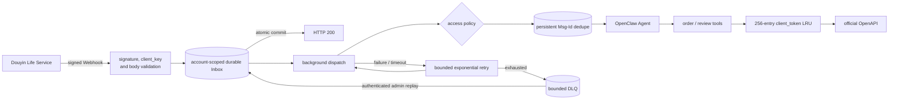

# Douyin Life Service plugin

`@partme.ai/openclaw-douyin` integrates OpenClaw with Douyin Life Service merchant applications.

It provides signed Webhook ingestion, cached `client_token` authentication, the official order-query API, and the catering review-reply API. Webhook `content` may be either an object or a JSON string. A valid event is atomically persisted to an account-scoped Inbox before HTTP 200; background dispatch then uses bounded retries, restart recovery, and a bounded DLQ.

The Life Service Webhook is not a symmetric direct-message protocol. Generic channel `sendText` therefore fails explicitly instead of returning a fake delivery result.

## Architecture

The character diagram is retained for terminals and raw Markdown; the Mermaid diagram provides the same boundary in rendered documentation.

```text
Douyin platform
      │ signed Webhook
      ▼
signature / client_key / body limit
      │
      ▼
durable account Inbox ──fsync──▶ HTTP 200
      │
      ▼
access policy ──▶ Msg-Id dedupe ──▶ OpenClaw Agent
      │ failure
      └──▶ bounded retry ──▶ DLQ ──▶ admin replay

Agent tools ──▶ 256-entry token LRU ──▶ official OpenAPI
```



If Inbox persistence or capacity checks fail, the handler returns 503 rather than acknowledging data it has not durably accepted. State is stored with 0700 directory and 0600 file permissions and is removed after terminal processing. `GET /douyin/status` exposes sanitized queue counts; authenticated administrators can replay dead letters with `POST /douyin/replay-dead-letters?account=default&limit=100`.

Retryable dispatch failure means the OpenClaw message pipeline returned `error`, `timed_out`, or `skipped`, or the plugin call itself threw. If OpenClaw classifies an Agent Turn—including its internal model-error handling—as `completed`, the Inbox treats it as terminal because blindly replaying a possibly side-effecting turn would be unsafe.

## Configuration

```jsonc
{
  "channels": {
    "douyin": {
      "enabled": true,
      "app_key": "your_client_key",
      "app_secret": "your_client_secret",
      "account_id": "your_life_account_id",
      "poi_id": "your_poi_id",
      "webhook_path": "/channels/douyin/webhook",
      "callback_url": "https://example.com/channels/douyin/webhook",
      "request_timeout_ms": 10000,
      "webhookDelivery": {
        "maxPending": 1000,
        "maxAttempts": 5,
        "initialDelayMs": 1000,
        "maxDelayMs": 60000,
        "maxDeadLetters": 100,
        "maxStateBytes": 33554432
      }
    }
  }
}
```

`shop_id` remains a compatibility alias for `account_id`; new configurations should use `account_id` and `poi_id` explicitly. `accounts.<id>` may override all account-specific settings. A named account without an explicit `webhook_path` receives a path derived from the top-level path, such as `/channels/douyin/webhook/shop-a`; duplicate routes fail startup instead of replacing another account handler.

## Tools

- `douyin_query_orders` calls `GET /goodlife/v1/trade/order/query/` and requires `life.capacity.order.query`.
- `douyin_reply_review` calls `POST /goodlife/v1/akte/comment/reply/` and requires `life.capacity.catering.comment` plus review-reply permission.

OpenAPI credentials are sent using the official `access-token` header. Redirects are disabled so `client_secret` and access tokens are never forwarded to a 3xx target. The token cache is a bounded 256-entry LRU with concurrent refresh coalescing. Platform errors are surfaced to the tool caller rather than converted into empty successful results.

## Verification

```bash
pnpm --dir extensions/douyin typecheck
pnpm --dir extensions/douyin test
pnpm --dir extensions/douyin build
```

Local tests use protocol-level mocks. Production acceptance still requires a permissioned Douyin Life Service application.

Official references: [WebHooks](https://partner.open-douyin.com/docs/resource/zh-CN/local-life/develop/preparation/webhooks), [client_token](https://partner.open-douyin.com/docs/resource/zh-CN/dop/develop/openapi/account-permission/client-token), [order query](https://partner.open-douyin.com/docs/resource/zh-CN/local-life/develop/OpenAPI/general-capabilities/order.query/query), [review reply](https://developer.open-douyin.com/docs/resource/zh-CN/local-life/develop/OpenAPI/catering/dining-group-solution/food-review/reply_comment).
