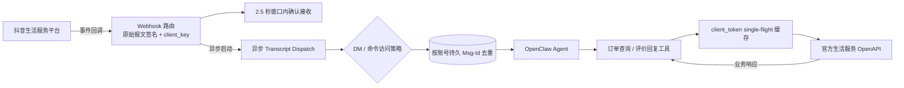
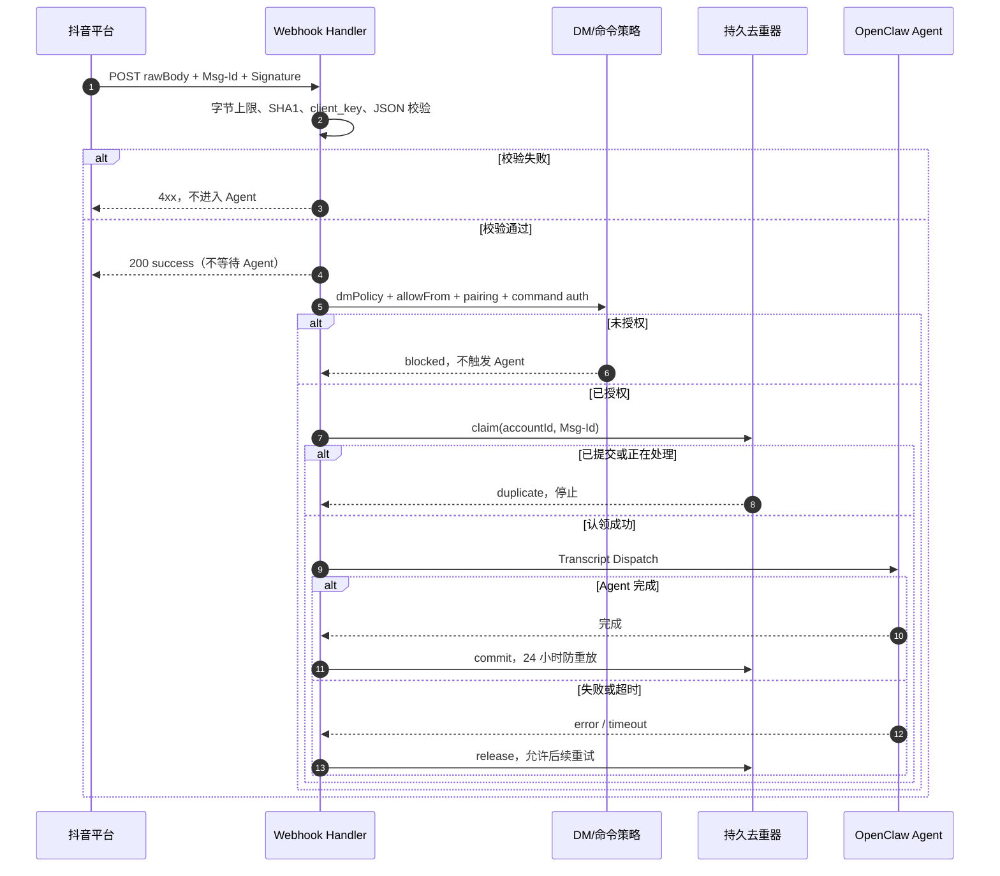
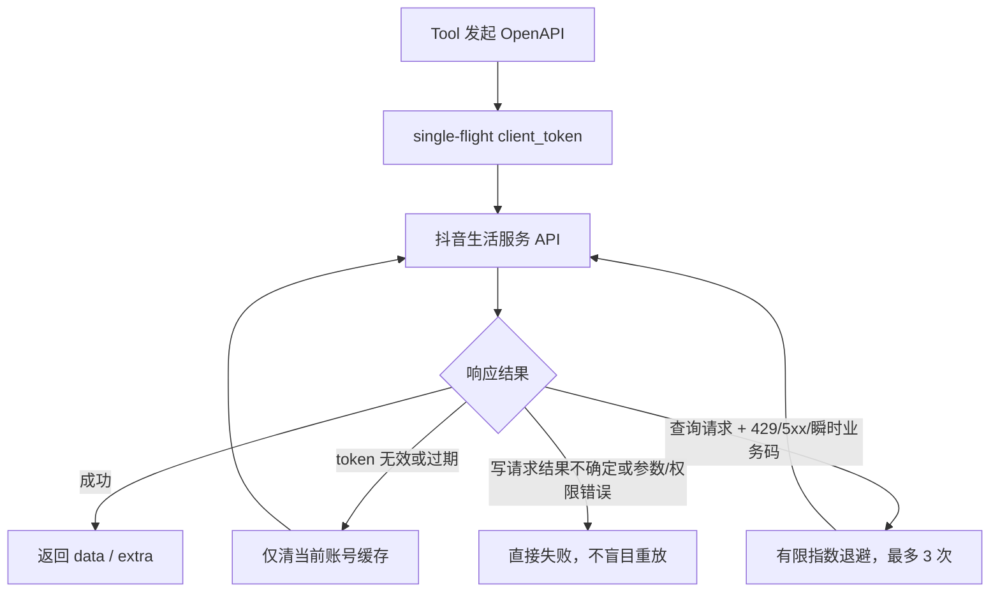

# 抖音生活服务插件

`@partme.ai/openclaw-douyin` 对接抖音生活服务商家应用，提供 Webhook 事件入站和经过官方 `client_token` 鉴权的运营工具。

## 能力边界

- Webhook：校验 `X-Douyin-Signature = SHA1(app_secret + rawBody)`，校验 `client_key`，按账号持久化 `Msg-Id` 去重；仅在处理成功后提交，失败会释放以允许重试。
- 回调验证：对签名有效的 `verify_webhook` 返回 `{"challenge": ...}` JSON。
- 事件处理：兼容 object 和 JSON 字符串两种 `content`；官方连接超过 5 秒会断开并最多重试 3 次，插件在验签与基础校验后立即确认，再异步进入 Agent Transcript 管线。
- 访问控制：自定义 Webhook 在 Transcript 前显式执行 `dmPolicy`、`allowFrom`、pairing store 和 OpenClaw 命令授权；签名有效不等于发送者有权触发 Agent。
- OpenAPI：缓存 `client_token`，合并并发刷新；Token 失效时刷新一次；查询类请求支持有限重试。
- 工具：实现官方订单查询、餐饮评价回复接口。
- 多账号：支持顶层账号及 `accounts.<id>` 覆盖。

生活服务 Webhook 不是私信协议，不提供对称消息发送 API。因此通用 `sendText` 会明确失败，不会返回虚假消息 ID。Agent 若要执行业务动作，应调用对应 OpenAPI 工具。

## 运行架构

```text
抖音生活服务平台
        │ 签名 Webhook                         ▲ 官方 OpenAPI
        ▼                                      │
原始报文验签 / client_key / 快速 ACK            │
        │                                      │
        ▼                                      │
DM 与命令策略 ──▶ 持久 Msg-Id 去重 ──▶ OpenClaw Agent
                                              │
                                              ▼
                          订单查询 / 评价回复 Tool ──▶ Token 缓存
```



Webhook 入站与 OpenAPI 业务动作是两条不同链路：前者成功进入 Agent 后才提交去重，后者按接口幂等属性决定是否允许重试。

## Webhook 确认与去重时序



## OpenAPI 重试边界



## 配置

```jsonc
{
  "channels": {
    "douyin": {
      "enabled": true,
      "app_key": "your_client_key",
      "app_secret": "your_client_secret",
      "account_id": "your_life_account_id",
      "poi_id": "your_poi_id",
      "webhook_path": "/channels/douyin/webhook",
      "callback_url": "https://example.com/channels/douyin/webhook",
      "request_timeout_ms": 10000,
      "dmPolicy": "open"
    }
  }
}
```

`dmPolicy` 的语义：

- `open`：允许所有已通过平台验签的发送者；若消息是 OpenClaw 命令，仍计算命令授权。
- `allowlist`：仅允许 `allowFrom` 或已批准 pairing store 中的发送者。
- `pairing`：未知发送者只创建 OpenClaw pairing 请求，本次事件不进入 Agent。生活服务 Webhook 没有通用被动回复能力，插件不会把配对码泄露到 HTTP 响应或日志；管理员通过 OpenClaw pairing 命令查看并批准。
- `disabled`：所有入站事件在 Agent 前被拒绝，但仍对已验签平台请求快速 ACK，防止无意义重投。

`account_id` 是抖音来客商户根账户 ID；`poi_id` 是评价回复等接口需要的门店 ID。旧字段 `shop_id` 仅作为 `account_id` 的兼容回退，新配置不应继续使用。

多账号示例：

```jsonc
{
  "channels": {
    "douyin": {
      "accounts": {
        "shop-a": {
          "enabled": true,
          "app_key": "client_key_a",
          "app_secret": "client_secret_a",
          "account_id": "account_a",
          "poi_id": "poi_a",
          "webhook_path": "/channels/douyin/webhook-shop-a"
        }
      }
    }
  }
}
```

命名账号未显式配置 `webhook_path` 时，会从顶层路径派生独立地址，例如 `shop-a` 对应 `/channels/douyin/webhook/shop-a`。不同账号不能共用同一回调路径；重复路由会直接启动失败，不会静默覆盖其他账号。

## OpenAPI 工具

### `douyin_query_orders`

调用 `GET https://open.douyin.com/goodlife/v1/trade/order/query/`。

主要参数：`account`、`account_id`、`page_num`、`page_size`、`cursor`、`order_id`、`ext_order_id`、`open_id`、`order_status`、创单/修改时间范围。

要求应用具备 `life.capacity.order.query` 权限。`page_size` 为 1–100，普通分页窗口不能超过 10000 条，超出后应使用 `cursor`。

### `douyin_reply_review`

调用 `POST https://open.douyin.com/goodlife/v1/akte/comment/reply/`。

参数：`account`、`account_id`、`poi_id`、`rate_id`、`text`。要求应用具备 `life.capacity.catering.comment` 和评价回复权限。

## Webhook 配置

抖音生活服务 Webhook 只接受 HTTPS 回调。将平台回调地址设置为：

```text
https://<公开域名>/channels/douyin/webhook
```

生产环境需保证反向代理完整保留原始请求体、`Msg-Id` 和 `X-Douyin-Signature`，不能重新序列化 JSON 后再转发。

## 验证

```bash
pnpm --dir extensions/douyin typecheck
pnpm --dir extensions/douyin test
pnpm --dir extensions/douyin build
OPENCLAW_E2E_HOST_GATEWAY=1 pnpm test:e2e -- --plugins douyin --skip-browser
```

独立 E2E 会打包安装插件到 OpenClaw 2026.7.1，验证挑战应答、非法签名拒绝、真实 Agent Turn、同进程重复投递和 Gateway 重启后的持久防重；不会调用真实抖音账号。正式上线前仍需使用已获权限的生活服务应用验证回调、订单查询和评价回复。

官方参考：

- [WebHooks 接入](https://partner.open-douyin.com/docs/resource/zh-CN/local-life/develop/preparation/webhooks)
- [生成 client_token](https://partner.open-douyin.com/docs/resource/zh-CN/dop/develop/openapi/account-permission/client-token)
- [订单查询](https://partner.open-douyin.com/docs/resource/zh-CN/local-life/develop/OpenAPI/general-capabilities/order.query/query)
- [回复评价](https://partner.open-douyin.com/docs/resource/zh-CN/local-life/develop/OpenAPI/catering/dining-group-solution/food-review/reply_comment)
