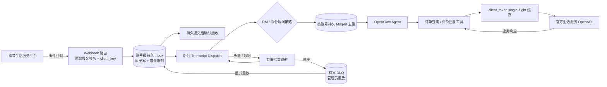
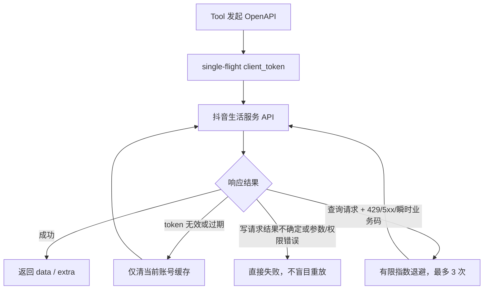

# 抖音生活服务插件

<!-- README_STANDARD_START -->

> 统一阅读顺序：组件定位 → 架构 → 流程 → 边界 → 安装 → 配置 → 运维 → 深入阅读。
> 本区块以 npm 可稳定渲染的 text 图为主；适用时，更深入的 Mermaid 图保留在仓库 `doc/` 设计资料中。

[简体中文](./README.zh-CN.md) | [English](./README.md)

## 1. 组件定位

连接抖音开放平台消息与白名单运营能力。组件类型：**公域 IM Channel**。

| 项目 | 内容 |
|---|---|
| npm 包 | `@partme.ai/openclaw-douyin` |
| 当前版本 | `2026.7.1` |
| 插件 ID | `douyin` |
| Channel ID | `douyin` |
| OpenClaw | `>=2026.7.1` |
| 源码目录 | `extensions/douyin` |

## 2. 一眼看懂

```text
[抖音 Webhook 与运营 Tool]
          │
          ▼
┌──────────────────────────────────────────────────────────────┐
│ OpenClaw Gateway 内: douyin
│ 1. 验签、策略校验与去重
│ 2. 映射会话并进入 Agent 管线
│ 3. 通过开放平台 API 回复或执行操作
└──────────────────────────────────────────────────────────────┘
          │
          ▼
[抖音消息与受控运营结果]
```

## 3. 架构与核心流程

该组件把“协议/平台差异”限制在自身边界内，对 OpenClaw 暴露稳定的插件、Channel、Hook、Tool 或 Service 契约。

```text
抖音 Webhook 与运营 Tool
  │
  ▼
验签、策略校验与去重
  │
  ▼
映射会话并进入 Agent 管线
  │
  ▼
通过开放平台 API 回复或执行操作
  │
  ▼
抖音消息与受控运营结果

异常路径: 任一步失败：记录可诊断错误并按组件策略重试、拒绝或降级
```

## 4. 能力与边界

| 能力 | 说明 |
|---|---|
| 负责 | 连接抖音开放平台消息与白名单运营能力 |
| 不负责 | 不绕过平台权限、内容审核或人工审批 |
| 输入 | 抖音 Webhook 与运营 Tool |
| 输出 | 抖音消息与受控运营结果 |
| 失败原则 | 默认失败应可观测；鉴权、边界校验和持久化失败不得伪装成功 |

## 5. 快速开始

```bash
openclaw plugins install "@partme.ai/openclaw-douyin@2026.7.1"
```

安装后先按最小权限配置，再启动 Gateway；生产环境应在隔离配置目录中完成连通性、权限和失败恢复验证。

## 6. 配置入口

| 配置层 | 路径 |
|---|---|
| 插件配置 | `plugins.entries.douyin.config` |
| Channel 配置 | `channels["douyin"]` |
| 配置 Schema | `extensions/douyin/openclaw.plugin.json` |

配置字段、环境变量与完整示例继续保留在下方原有详细说明中。

## 7. 运维、安全与故障定位

- 先确认 OpenClaw 版本、插件版本、manifest ID 与配置键一致。
- 凭据使用环境变量或 SecretRef，不写入日志、仓库和示例明文。
- 通过 Gateway 日志、插件健康状态及外部依赖状态分层定位问题。
- 升级前备份状态数据；涉及游标、队列或索引时，必须验证重启恢复与重复投递语义。

## 8. 验证与深入阅读

```bash
pnpm --filter "@partme.ai/openclaw-douyin" typecheck
pnpm --filter "@partme.ai/openclaw-douyin" test
pnpm --filter "@partme.ai/openclaw-douyin" build
```

- [插件总体架构](../../doc/OpenClaw-Plugins-Architecture_CN.md)
- [统一插件结构规范](../../doc/OpenClaw-Plugins-Structure-Standard.md)

## 9. 原有详细说明

以下内容保留该组件原有的配置表、协议细节、示例和故障排查资料。

<!-- README_STANDARD_END -->


`@partme.ai/openclaw-douyin` 对接抖音生活服务商家应用，提供 Webhook 事件入站和经过官方 `client_token` 鉴权的运营工具。

## 能力边界

- Webhook：校验 `X-Douyin-Signature = SHA1(app_secret + rawBody)` 和 `client_key`；事件必须先进入账号隔离的持久 Inbox，原子落盘成功后才返回 200。
- 回调验证：对签名有效的 `verify_webhook` 返回 `{"challenge": ...}` JSON。
- 事件处理：兼容 object 和 JSON 字符串两种 `content`；后台派发失败采用有限指数退避，Gateway 重启会恢复未完成事件，耗尽后进入有界 DLQ。
- 访问控制：自定义 Webhook 在 Transcript 前显式执行 `dmPolicy`、`allowFrom`、pairing store 和 OpenClaw 命令授权；签名有效不等于发送者有权触发 Agent。
- OpenAPI：`client_token` 使用最多 256 项的 LRU + single-flight 缓存；Token 失效时刷新一次；查询类请求支持有限重试；所有凭据请求禁止自动重定向。
- 工具：实现官方订单查询、餐饮评价回复接口。
- 多账号：支持顶层账号及 `accounts.<id>` 覆盖。

生活服务 Webhook 不是私信协议，不提供对称消息发送 API。因此通用 `sendText` 会明确失败，不会返回虚假消息 ID。Agent 若要执行业务动作，应调用对应 OpenAPI 工具。

## 运行架构

```text
抖音生活服务平台
        │ 签名 Webhook                         ▲ 官方 OpenAPI
        ▼                                      │
原始报文验签 / client_key                         │
        │                                      │
        ▼                                      │
账号级持久 Inbox（0600 / 原子写 / 容量限制）      │
        │ 落盘成功后 200                        │
        ▼                                      │
DM 与命令策略 ──▶ Msg-Id 去重 ──▶ OpenClaw Agent
        │失败                                     │
        └──▶ 指数退避 ──▶ DLQ ──▶ 管理员重放      │
                                              │
                                              ▼
                          订单查询 / 评价回复 Tool ──▶ Token 缓存
```



Webhook 入站与 OpenAPI 业务动作是两条不同链路：前者先持久接管、再异步派发，后者按接口幂等属性决定是否允许重试。Inbox 文件位于 OpenClaw state 目录，目录权限 0700、文件权限 0600；消息成功或被策略终止后会从 Inbox 删除。

这里的“派发失败”特指 OpenClaw 消息管道返回 `error`、`timed_out`、`skipped`，或插件在调用管道前后抛出异常。若 OpenClaw 已把一次 Agent Turn（包括内部模型错误处理）归类为 `completed`，插件没有可靠协议判断它是否应再次执行，Inbox 会按终态删除，避免把可能已经产生副作用的任务盲目重放。

## Webhook 确认与去重时序

```mermaid
sequenceDiagram
    autonumber
    participant D as 抖音平台
    participant H as Webhook Handler
    participant I as 持久 Inbox
    participant P as DM/命令策略
    participant Q as 持久去重器
    participant A as OpenClaw Agent

    D->>H: POST rawBody + Msg-Id + Signature
    H->>H: 字节上限、SHA1、client_key、JSON 校验
    alt 校验失败
        H-->>D: 4xx，不进入 Agent
    else 校验通过
        H->>I: 原子写入 Msg-Id + 原始事件
        alt 磁盘/容量失败
            I-->>H: 未接管
            H-->>D: 503，请平台重投
        else 持久提交成功
            H-->>D: 200 success（不等待 Agent）
            I->>P: 后台 dmPolicy + allowFrom + pairing + command auth
        alt 未授权
                P-->>I: blocked，删除 Inbox 条目
        else 已授权
                I->>Q: claim(accountId, Msg-Id)
            alt 已提交或正在处理
                    Q-->>I: duplicate，删除 Inbox 条目
            else 认领成功
                    I->>A: Transcript Dispatch
                alt Agent 完成
                        A-->>I: 完成
                        I->>Q: commit，24 小时防重放
                        I->>I: 删除 Inbox 条目
                else 失败或超时
                        A-->>I: error / timeout
                        I->>Q: release
                        I->>I: 指数退避；耗尽后进入 DLQ
                    end
                end
            end
        end
        end
    end
```

## OpenAPI 重试边界



## 配置

```jsonc
{
  "channels": {
    "douyin": {
      "enabled": true,
      "app_key": "your_client_key",
      "app_secret": "your_client_secret",
      "account_id": "your_life_account_id",
      "poi_id": "your_poi_id",
      "webhook_path": "/channels/douyin/webhook",
      "callback_url": "https://example.com/channels/douyin/webhook",
      "request_timeout_ms": 10000,
      "webhookDelivery": {
        "maxPending": 1000,
        "maxAttempts": 5,
        "initialDelayMs": 1000,
        "maxDelayMs": 60000,
        "maxDeadLetters": 100,
        "maxStateBytes": 33554432
      },
      "dmPolicy": "open"
    }
  }
}
```

`dmPolicy` 的语义：

- `open`：允许所有已通过平台验签的发送者；若消息是 OpenClaw 命令，仍计算命令授权。
- `allowlist`：仅允许 `allowFrom` 或已批准 pairing store 中的发送者。
- `pairing`：未知发送者只创建 OpenClaw pairing 请求，本次事件不进入 Agent。生活服务 Webhook 没有通用被动回复能力，插件不会把配对码泄露到 HTTP 响应或日志；管理员通过 OpenClaw pairing 命令查看并批准。
- `disabled`：所有入站事件在 Agent 前被拒绝，但仍对已验签平台请求快速 ACK，防止无意义重投。

## Inbox 运维

```text
GET  /douyin/status
        │ 查看各账号 pending / DLQ / 最老积压 / 最近错误
        ▼
确认故障已经修复
        │
        ▼
POST /douyin/replay-dead-letters?account=default&limit=100
        │
        ▼
DLQ ──原子迁回──▶ Pending Inbox ──▶ 后台重新派发
```

两个端点都要求 OpenClaw Gateway 管理员认证，不返回消息正文、用户 ID 或凭据。`maxStateBytes` 同时约束 pending 与 DLQ 的完整持久文件，避免大报文乘以积压数量耗尽磁盘；容量或持久化失败时 Webhook 返回 503。

`account_id` 是抖音来客商户根账户 ID；`poi_id` 是评价回复等接口需要的门店 ID。旧字段 `shop_id` 仅作为 `account_id` 的兼容回退，新配置不应继续使用。

多账号示例：

```jsonc
{
  "channels": {
    "douyin": {
      "accounts": {
        "shop-a": {
          "enabled": true,
          "app_key": "client_key_a",
          "app_secret": "client_secret_a",
          "account_id": "account_a",
          "poi_id": "poi_a",
          "webhook_path": "/channels/douyin/webhook-shop-a"
        }
      }
    }
  }
}
```

命名账号未显式配置 `webhook_path` 时，会从顶层路径派生独立地址，例如 `shop-a` 对应 `/channels/douyin/webhook/shop-a`。不同账号不能共用同一回调路径；重复路由会直接启动失败，不会静默覆盖其他账号。

## OpenAPI 工具

### `douyin_query_orders`

调用 `GET https://open.douyin.com/goodlife/v1/trade/order/query/`。

主要参数：`account`、`account_id`、`page_num`、`page_size`、`cursor`、`order_id`、`ext_order_id`、`open_id`、`order_status`、创单/修改时间范围。

要求应用具备 `life.capacity.order.query` 权限。`page_size` 为 1–100，普通分页窗口不能超过 10000 条，超出后应使用 `cursor`。

### `douyin_reply_review`

调用 `POST https://open.douyin.com/goodlife/v1/akte/comment/reply/`。

参数：`account`、`account_id`、`poi_id`、`rate_id`、`text`。要求应用具备 `life.capacity.catering.comment` 和评价回复权限。

## Webhook 配置

抖音生活服务 Webhook 只接受 HTTPS 回调。将平台回调地址设置为：

```text
https://<公开域名>/channels/douyin/webhook
```

生产环境需保证反向代理完整保留原始请求体、`Msg-Id` 和 `X-Douyin-Signature`，不能重新序列化 JSON 后再转发。

## 验证

```bash
pnpm --dir extensions/douyin typecheck
pnpm --dir extensions/douyin test
pnpm --dir extensions/douyin build
OPENCLAW_E2E_HOST_GATEWAY=1 pnpm test:e2e -- --plugins douyin --skip-browser
```

独立 E2E 会打包安装插件到 OpenClaw 2026.7.1，验证挑战应答、非法签名拒绝、真实 Agent Turn、同进程重复投递和 Gateway 重启后的持久防重；不会调用真实抖音账号。正式上线前仍需使用已获权限的生活服务应用验证回调、订单查询和评价回复。

官方参考：

- [WebHooks 接入](https://partner.open-douyin.com/docs/resource/zh-CN/local-life/develop/preparation/webhooks)
- [生成 client_token](https://partner.open-douyin.com/docs/resource/zh-CN/dop/develop/openapi/account-permission/client-token)
- [订单查询](https://partner.open-douyin.com/docs/resource/zh-CN/local-life/develop/OpenAPI/general-capabilities/order.query/query)
- [回复评价](https://partner.open-douyin.com/docs/resource/zh-CN/local-life/develop/OpenAPI/catering/dining-group-solution/food-review/reply_comment)
