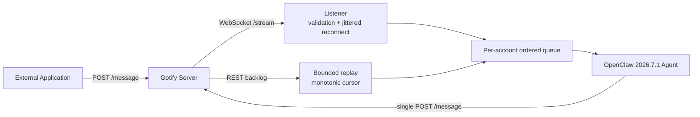
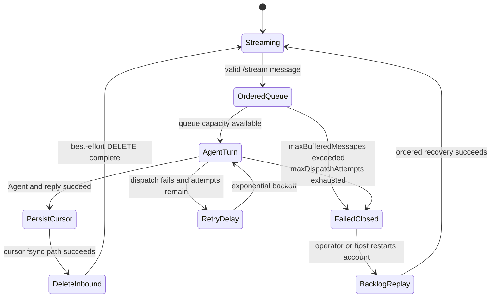

# OpenClaw Gotify

**OpenClaw plugin — Gotify channel bridge with Message API delivery, WebSocket stream inbound handling, and bootstrap helpers**


[English](./README.md) | [简体中文](./README.zh-CN.md)

## Introduction

`@partme.ai/openclaw-gotify` is an OpenClaw native channel plugin for [OpenClaw](https://github.com/openclaw/openclaw) that connects OpenClaw to a self-hosted [Gotify](https://gotify.net/) server. It uses the official OpenClaw channel plugin entrypoint and combines:

- Gotify `Message API` for outbound delivery
- Gotify `WebSocket Stream API` for inbound real-time listening
- Gotify `Application and Client API` for explicit bootstrap / doctor workflows

## Core Capabilities

- **Message API First**: standard outbound send path uses `POST /message`
- **Least Privilege Runtime**: normal delivery only requires an application token
- **Optional Inbound Stream**: enable WebSocket listener with a client token when you want Gotify -> OpenClaw input
- **Bootstrap Helpers**: doctor and application bootstrap are explicit workflows, not hidden runtime side effects
- **dmScope Isolation**: session isolation follows OpenClaw `session.dmScope` only
- **Multi-Account Routing**: route different OpenClaw agents to different Gotify accounts without session bleed

## Architecture

The character diagram highlights how real-time frames, backlog replay, and the durable cursor cooperate without a Broker ACK. The Mermaid diagram below remains the complete renderable view.

```text
External Application ──POST /message──▶ Gotify Server
                                           │
                    ┌──────────────────────┴─────────────────────┐
                    │ /stream live frames                       │ REST backlog
                    ▼                                           ▼
           bounded handoff / ordered queue             paged message-id replay
                    └──────────────────────┬─────────────────────┘
                                           ▼
                              policy + dedupe + Agent Turn
                                           │
                 success: persist cursor → optional delete source
                 failure: ordered retry → fail closed when exhausted

stop: close WebSocket → abort retry waits → drain admitted turns → exit
```



## Gotify API Notes

### Message API

- Create messages: `POST /message`
- Authentication: application token only (`X-Gotify-Key: <appToken>`)
- Token transport alternatives: query `token=...`, `Authorization: Bearer ...`
- Defaults: if `title` is empty, Gotify uses the application name; if `priority` is omitted, Gotify uses the application's default priority.

### WebSocket Stream API

- Endpoint: `GET /stream`
- Authentication: client token
- This plugin connects with query token: `/stream?token=<clientToken>`
- Server-side heartbeat uses ping/pong; origin validation may block cross-origin browsers depending on `AllowedWebSocketOrigins`.

### Application and Client API

- Applications (`/application`) and clients (`/client`) require client token authentication (application token cannot access these APIs).
- This plugin uses these APIs only for explicit bootstrap / doctor workflows.

### User API

User API is not required for normal send/receive workflows. Keep runtime least-privilege by using appToken for delivery and clientToken only when enabling inbound stream or running operator diagnostics.

## Quick Start

### Prerequisites

- OpenClaw `>= 2026.7.1`
- Node.js `22+`
- A running Gotify server

### Install

```bash
openclaw plugins install @partme.ai/openclaw-gotify
```

Requires `@partme.ai/openclaw-message-sdk >= 2026.6.1` and OpenClaw `>= 2026.7.1`.

### Minimal Config

```json
{
  "channels": {
    "gotify": {
      "defaultAccount": "default",
      "accounts": {
        "default": {
          "name": "default",
          "enabled": true,
          "serverUrl": "https://gotify.example.com",
          "appToken": "YOUR_GOTIFY_APP_TOKEN",
          "clientToken": "YOUR_GOTIFY_CLIENT_TOKEN",
          "defaultPriority": 5,
          "dmPolicy": "open",
          "allowFrom": ["*"],
          "inbound": {
            "enabled": true,
            "allowedAppId": 1
          }
        }
      }
    }
  },
  "session": {
    "dmScope": "per-account-channel-peer"
  }
}
```

## Multi-Account Config

```json
{
  "channels": {
    "gotify": {
      "defaultAccount": "default",
      "accounts": {
        "default": {
          "name": "default",
          "enabled": true,
          "serverUrl": "http://localhost:8080",
          "appToken": "ACYOShvtHHH2U69",
          "clientToken": "C7ErQjzzeoAXCKg",
          "defaultPriority": 5,
          "dmPolicy": "open",
          "allowFrom": ["*"],
          "inbound": {
            "enabled": true,
            "allowedAppId": 1
          }
        },
        "e2e": {
          "name": "e2e",
          "enabled": true,
          "serverUrl": "http://127.0.0.1:18080",
          "appToken": "Aiq5hUNRZLE9ucx",
          "clientToken": "CS8dXyptveo_dkm",
          "defaultPriority": 5,
          "dmPolicy": "open",
          "allowFrom": ["*"],
          "inbound": {
            "enabled": true,
            "allowedAppId": 2,
            "deleteAfterConsume": false
          }
        }
      }
    }
  }
}
```

This pattern makes the runtime intent explicit:

- `accounts.default` is the normal plugin account.
- `accounts.e2e` is a dedicated local test account.
- `appToken` is always the token used by `openclaw-gotify` itself for outbound send.
- `clientToken` is used by the plugin for `/stream` inbound listen and operator APIs.
- `inbound.allowedAppId` means one account only accepts inbound messages from one Gotify Application ID.

### Backlog Replay

When `inbound.enabled=true`, `openclaw-gotify` now requires `inbound.allowedAppId` and uses it for startup backlog replay:

1. connect `/stream` first and buffer newly arriving live messages
2. fetch historical messages from `GET /application/{allowedAppId}/message?since=<lastSeenMessageId>`
3. replay them one by one in ascending message-id order
4. persist `lastSeenMessageId` after each successfully processed message
5. drain buffered live messages in order
6. switch to normal live `/stream` handling

This design avoids sending a whole backlog batch to the agent at once. Each historical message is dispatched as an individual inbound turn.

The live buffer is capped by `inbound.maxBufferedMessages` (default `1000`). Reconnect
uses `inbound.reconnectJitterRatio` (default `0.2`) to avoid synchronized reconnect storms.
The same cap also bounds the normal live dispatch queue. A transient Agent/response failure is
retried in message order up to `inbound.maxDispatchAttempts` with exponential backoff. When the
limit is exhausted, the listener stops fail-closed and leaves the message in Gotify so the next
account start can recover it through backlog replay.



The cursor file is treated as durable acknowledgment state: only a missing file means a first
start. Corruption, permission errors, or other I/O failures stop replay instead of silently
resetting the cursor to zero and duplicating historical Agent turns.
Because Gotify does not expose an idempotency key for `POST /message`, message delivery is
not blindly retried by default; an unknown timeout outcome must not create duplicate notifications.
The per-account REST lock covers the full HTTP task, shutdown drains already admitted Agent turns
after closing the WebSocket intake, and all status/doctor errors redact configured tokens and token
query parameters.

For local end-to-end tests, the simulated external sender may use a second Gotify Application token such as `GOTIFY_SENDER_APP_TOKEN`. That sender token is a test harness concern and is not part of the plugin's runtime config shape.

## Session Isolation

`openclaw-gotify` does not define its own isolation model. All session partitioning follows OpenClaw `session.dmScope`.

Supported values:

- `main`
- `per-peer`
- `per-channel-peer`
- `per-account-channel-peer`

## Bootstrap and Doctor

Normal send only needs `appToken`. When you want setup automation, provide `clientToken` and run the test client or your own bootstrap wrapper.

```bash
GOTIFY_SERVER_URL=https://gotify.example.com \
GOTIFY_APP_TOKEN=app-token \
GOTIFY_CLIENT_TOKEN=client-token \
GOTIFY_BOOTSTRAP=true \
GOTIFY_BOOTSTRAP_CREATE=false \
npm run test:client
```

## Status Routes

- `GET /gotify/status`
- `GET /gotify/doctor`

Both routes are registered with `auth: plugin` in full mode.

## Testing

```bash
npm test
npm run test:client
```

Covered areas:

- config parsing
- dmScope session key derivation
- outbound account selection
- Message API request building
- bootstrap behavior
- WebSocket listener lifecycle

## GitHub Actions

| Workflow      | Trigger                         | Purpose                                                     |
| ------------- | ------------------------------- | ----------------------------------------------------------- |
| `ci.yml`      | Push / PR to `main` or `master` | Install, typecheck, build, test, upload `dist`              |
| `release.yml` | Push tag `v*`                   | Build, test, package, publish to npm, create GitHub release |

## Project Structure

```text
openclaw-gotify/
├── src/
│   ├── index.ts
│   ├── setup-entry.ts
│   ├── channel.ts
│   ├── config.ts
│   ├── peer-resolver.ts
│   ├── inbound-access.ts
│   ├── gotify-api.ts
│   ├── runtime.ts
│   ├── setup.ts
│   ├── ws-listener.ts
│   └── *.test.ts
├── scripts/
│   └── test-client.ts
├── .github/workflows/
├── openclaw.plugin.json
├── package.json
└── README.md / README.en.md
```

## FAQ

**Does this plugin require client token for every send?**

No. Standard outbound sending only uses the application token.

**Why keep bootstrap separate from normal runtime?**

Because Gotify client-level APIs are more privileged. `openclaw-gotify` keeps least privilege by default.

**Can WebSocket stream act like a two-way chat socket?**

Not directly. The plugin treats stream messages as inbound triggers and uses the normal OpenClaw reply pipeline plus Message API to answer.

## License

MIT

## Message Format Guide

Gotify uses native Gotify Message API and WebSocket Stream JSON rather than the generic MQ wire envelope. See [OpenClaw Queue Message Format Guide](../../doc/OpenClaw-Queue-Message-Format-Guide.en.md) for how Gotify maps native payloads to `UnifiedMessage`, plus the standard queue contract used by other MQ plugins.
