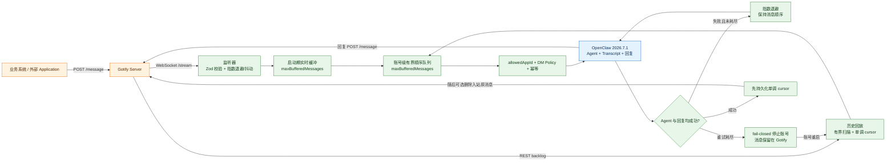
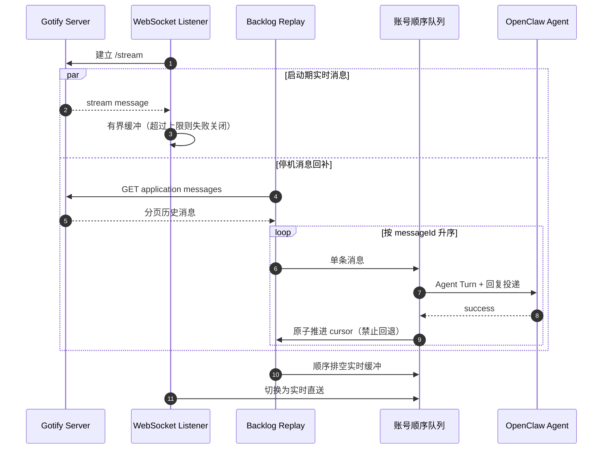

<div align="center">

# OpenClaw Gotify

**OpenClaw 插件：Gotify 渠道桥接 — REST API 推送 + WebSocket 流接收 + 多账号会话隔离**


</div>

<!-- README_STANDARD_START -->

> 统一阅读顺序：组件定位 → 架构 → 流程 → 边界 → 安装 → 配置 → 运维 → 深入阅读。
> 本区块以 npm 可稳定渲染的 text 图为主；适用时，更深入的 Mermaid 图保留在仓库 `doc/` 设计资料中。

[简体中文](./README.zh-CN.md) | [English](./README.md)

## 1. 组件定位

提供双向 Gotify 消息、积压恢复和诊断。组件类型：**推送 IM Channel**。

| 项目 | 内容 |
|---|---|
| npm 包 | `@partme.ai/openclaw-gotify` |
| 当前版本 | `2026.7.1` |
| 插件 ID | `gotify` |
| Channel ID | `gotify` |
| OpenClaw | `>=2026.7.1` |
| 源码目录 | `extensions/gotify` |

## 2. 一眼看懂

```text
[Gotify REST 消息与 WebSocket Stream]
          │
          ▼
┌──────────────────────────────────────────────────────────────┐
│ OpenClaw Gateway 内: gotify
│ 1. 解析账号、游标与访问策略
│ 2. 消费入站并运行 Agent
│ 3. 通过 Application API 发送回复
└──────────────────────────────────────────────────────────────┘
          │
          ▼
[Gotify 推送与可恢复消费状态]
```

## 3. 架构与核心流程

该组件把“协议/平台差异”限制在自身边界内，对 OpenClaw 暴露稳定的插件、Channel、Hook、Tool 或 Service 契约。

```text
Gotify REST 消息与 WebSocket Stream
  │
  ▼
解析账号、游标与访问策略
  │
  ▼
消费入站并运行 Agent
  │
  ▼
通过 Application API 发送回复
  │
  ▼
Gotify 推送与可恢复消费状态

异常路径: 任一步失败：记录可诊断错误并按组件策略重试、拒绝或降级
```

## 4. 能力与边界

| 能力 | 说明 |
|---|---|
| 负责 | 提供双向 Gotify 消息、积压恢复和诊断 |
| 不负责 | 不管理 Gotify Server 用户体系或 Go 插件 |
| 输入 | Gotify REST 消息与 WebSocket Stream |
| 输出 | Gotify 推送与可恢复消费状态 |
| 失败原则 | 默认失败应可观测；鉴权、边界校验和持久化失败不得伪装成功 |

## 5. 快速开始

```bash
openclaw plugins install "@partme.ai/openclaw-gotify@2026.7.1"
```

安装后先按最小权限配置，再启动 Gateway；生产环境应在隔离配置目录中完成连通性、权限和失败恢复验证。

## 6. 配置入口

| 配置层 | 路径 |
|---|---|
| 插件配置 | `plugins.entries.gotify.config` |
| Channel 配置 | `channels["gotify"]` |
| 配置 Schema | `extensions/gotify/openclaw.plugin.json` |

配置字段、环境变量与完整示例继续保留在下方原有详细说明中。

## 7. 运维、安全与故障定位

- 先确认 OpenClaw 版本、插件版本、manifest ID 与配置键一致。
- 凭据使用环境变量或 SecretRef，不写入日志、仓库和示例明文。
- 通过 Gateway 日志、插件健康状态及外部依赖状态分层定位问题。
- 升级前备份状态数据；涉及游标、队列或索引时，必须验证重启恢复与重复投递语义。

## 8. 验证与深入阅读

```bash
pnpm --filter "@partme.ai/openclaw-gotify" typecheck
pnpm --filter "@partme.ai/openclaw-gotify" test
pnpm --filter "@partme.ai/openclaw-gotify" build
```

- [gotify 深度设计文档](../../doc/gotify/)
- [统一插件结构规范](../../doc/OpenClaw-Plugins-Structure-Standard.md)

## 9. 原有详细说明

以下内容保留该组件原有的配置表、协议细节、示例和故障排查资料。

<!-- README_STANDARD_END -->


[English](./README.md) | [简体中文](./README.zh-CN.md)

`@partme.ai/openclaw-gotify` 是为 [OpenClaw](https://github.com/openclaw/openclaw) 开发的 [Gotify](https://gotify.net/) 渠道插件：通过 REST API **发送消息**，通过 WebSocket `/stream` **实时接收消息**，并完整支持 Application 和 Client 的 **生命周期管理**。

## 📖 简介

**OpenClaw Gotify**（`@partme.ai/openclaw-gotify`）基于 Gotify 官方 REST API 和 WebSocket Stream API，将自托管的 Gotify 推送服务器桥接到 OpenClaw Agent 系统。插件按照官方文档使用 [`defineChannelPluginEntry`](https://docs.openclaw.ai/plugins/sdk-entrypoints#definechannelpluginentry) + `ChannelPlugin` 实现。

### 🎯 核心能力

- **REST 消息发送** — 通过 Gotify Message API (`POST /message`) 发送 Agent 回复
- **WebSocket 流接收** — 通过 Gotify Stream API (`GET /stream`) 实时接收入站消息
- **Application 管理** — 完整的 CRUD：创建、更新、删除、上传图标
- **Client 管理** — 完整的 CRUD：创建、更新、删除
- **消息管理** — 获取消息列表（游标分页）、按 ID 删除、批量删除
- **多账号多智能体** — `accounts` 映射支持多个 Gotify 实例，按 `dmScope` 粒度隔离会话
- **会话隔离** — 完全遵循 OpenClaw 全局 `session.dmScope` 配置（`main` / `per-peer` / `per-channel-peer` / `per-account-channel-peer`）
- **幂等去重** — 60 秒窗口内相同账号+消息 ID 不会重复派发

### 生命周期

- WebSocket 监听器在 Gateway 对 Gotify 渠道执行 `startAccount` 时启动
- 账号级并发锁确保同一 Gotify 实例的请求串行化，防止触发限流
- HTTP `GET /gotify/status`、`/gotify/health`、`/gotify/doctor` 在入口的 `registerFull` 中注册
- 会话键粒度遵循 OpenClaw 全局 `session.dmScope` 配置
- **`package.json` → `openclaw.setupEntry`** 指向 `dist/setup-entry.js`，通过 `defineSetupPluginEntry` 导出轻量入口

## 前置要求

- 已安装 [OpenClaw](https://github.com/openclaw/openclaw)（`>=2026.7.1`，见 `package.json` 中 `peerDependencies` 与 `openclaw.compat` / `openclaw.build`）
- **Node.js 22+**（与官方 [Building plugins](https://docs.openclaw.ai/plugins/building-plugins) 前置要求一致）
- 一个运行中的 [Gotify 服务器](https://gotify.net/docs/install)（v2.x+）

## 安装

### 1. 使用 OpenClaw CLI（推荐）

```bash
openclaw plugins install @partme.ai/openclaw-gotify
```

最低依赖：`@partme.ai/openclaw-message-sdk >= 2026.6.1`、OpenClaw `>= 2026.7.1`。

然后在 `channels.gotify` 中填写配置（见下文）。

### 2. 使用 npm（手动 / 高级）

```bash
npm install @partme.ai/openclaw-gotify
```

再按你所用版本的规则，通过 `openclaw.plugin.json`、`plugins.entries` 等将包接入 OpenClaw。

## 配置

### 最小配置

```jsonc
{
  "channels": {
    "gotify": {
      "defaultAccount": "default",
      "accounts": {
        "default": {
          "name": "default",
          "enabled": true,
          "serverUrl": "https://gotify.example.com",
          "appToken": "Axxxxxxxxxxxxx",
          "clientToken": "Cxxxxxxxxxxxxx",
          "defaultPriority": 5,
          "dmPolicy": "open",
          "allowFrom": ["*"],
          "inbound": {
            "enabled": true,
            "allowedAppId": 1,
          },
        },
      },
    },
  },
}
```

### 多账号多智能体

```jsonc
{
  "channels": {
    "gotify": {
      "defaultAccount": "default",
      "accounts": {
        "default": {
          "name": "default",
          "enabled": true,
          "serverUrl": "http://localhost:8080",
          "appToken": "ACYOShvtHHH2U69",
          "clientToken": "C7ErQjzzeoAXCKg",
          "defaultPriority": 5,
          "dmPolicy": "open",
          "allowFrom": ["*"],
          "inbound": {
            "enabled": true,
            "allowedAppId": 1,
          },
        },
        "e2e": {
          "name": "e2e",
          "enabled": true,
          "serverUrl": "http://127.0.0.1:18080",
          "appToken": "Aiq5hUNRZLE9ucx",
          "clientToken": "CS8dXyptveo_dkm",
          "defaultPriority": 5,
          "dmPolicy": "open",
          "allowFrom": ["*"],
          "inbound": {
            "enabled": true,
            "allowedAppId": 2,
            "deleteAfterConsume": false,
          },
        },
      },
    },
  },
}
```

这个写法更明确：

- `accounts.default` 表示正常运行账号
- `accounts.e2e` 表示本地联调用测试账号
- `appToken` 始终表示 **openclaw-gotify 自己用于出站发送** 的 Application Token
- `clientToken` 表示插件用于 **WebSocket `/stream` 入站监听** 与管理/查询 API 的 Client Token
- `inbound.allowedAppId` 表示 **一个账号只接收一个指定 Application ID 的入站消息**

### 停机期间消息补偿（Backlog Replay）

当 `inbound.enabled=true` 时，`openclaw-gotify` 现在要求必须配置 `inbound.allowedAppId`，并据此在启动阶段执行历史消息补偿：

1. 先建立 `/stream` 连接，并把刚到达的实时消息暂存在内存缓冲区
2. 调用 `GET /application/{allowedAppId}/message?since=<lastSeenMessageId>` 拉取停机期间的历史消息
3. 按消息 ID 升序 **一条一条** 回放
4. 每成功处理一条消息，就持久化推进 `lastSeenMessageId`
5. 历史回放结束后，再按顺序处理缓冲区中的实时消息
6. 最后切换到正常的 `/stream` 实时处理

这样不会把一批历史消息一次性塞给智能体，而是保持逐条入站、逐条完成的处理方式。

如果本地测试需要再用一个独立的 Gotify Application 来模拟“外部用户发消息”，建议通过测试脚本环境变量（例如 `GOTIFY_SENDER_APP_TOKEN`）传入。那个 sender token 属于测试编排层，不属于插件运行配置本体。

### 配置说明

#### 顶级配置（单账号兼容模式）

| 字段              | 类型    | 默认值 | 说明                                                 |
| ----------------- | ------- | ------ | ---------------------------------------------------- |
| `enabled`         | boolean | `true` | 是否启用渠道                                         |
| `name`            | string  | —      | 账号显示名称                                         |
| `serverUrl`       | string  | —      | Gotify 服务器地址（如 `https://gotify.example.com`） |
| `appToken`        | string  | —      | 应用 Token，用于发送消息（前缀 `A`）                 |
| `clientToken`     | string  | —      | 客户端 Token，用于接收消息和管理 API（前缀 `C`）     |
| `defaultPriority` | number  | `5`    | 默认消息优先级（0–10）                               |
| `defaultAccount`  | string  | —      | 多账号模式下的默认账号 ID                            |
| `accounts`        | object  | —      | 多账号配置映射                                       |

#### `inbound` — WebSocket 流配置

| 字段                      | 类型    | 默认值                                  | 说明                                                                          |
| ------------------------- | ------- | --------------------------------------- | ----------------------------------------------------------------------------- |
| `enabled`                 | boolean | `false`（有 `clientToken` 时为 `true`） | 是否启用 WebSocket 流监听                                                     |
| `reconnectDelayMs`        | number  | `2000`                                  | 初始重连延迟（毫秒）                                                          |
| `maxReconnectDelayMs`     | number  | `30000`                                 | 最大重连延迟（指数退避上限）                                                  |
| `maxReconnectAttempts`    | number  | `10`                                    | 最大重连尝试次数                                                              |
| `reconnectJitterRatio`    | number  | `0.2`                                   | 重连抖动比例（0～1），避免多实例同步冲击服务端                                |
| `maxBufferedMessages`     | number  | `1000`                                  | 启动回放缓冲与正常实时派发队列共用的内存上限                                  |
| `maxDispatchAttempts`     | number  | `5`                                     | 单条实时消息进入 Agent/回复链路的最大尝试次数                                 |
| `dispatchRetryDelayMs`    | number  | `1000`                                  | Agent 派发首次重试等待时间（毫秒）                                            |
| `maxDispatchRetryDelayMs` | number  | `30000`                                 | Agent 派发指数退避的最大等待时间（毫秒）                                      |
| `deleteAfterConsume`      | boolean | `true`                                  | Agent 派发与回复投递成功后删除入站原消息；Agent 回复保留给在线/离线客户端读取 |

#### 消费即删策略

默认 **`deleteAfterConsume: true`**：只删除已经由 Agent 完成处理并成功投递回复的**入站原消息**。
Agent 回复不会被自动删除，在线或离线 Gotify Client 都可以继续读取。

| 方向 | 处理语义                                                              |
| ---- | --------------------------------------------------------------------- |
| 入站 | Agent **整轮回复投递完成**后，DELETE 用户发来的原消息（避免先删后答） |
| 出站 | Agent 回复保留在 Gotify，不自动 DELETE，保证离线客户端仍可读取        |

关闭方式：配置 `channels.gotify.inbound.deleteAfterConsume: false`。  
`OPENCLAW_TEST_VISIBLE=1` **不会**跳过插件侧删除，仅影响标准测试 runner 的额外 cleanup 行为。

### 环境变量声明

以下环境变量在 `openclaw.plugin.json` 的 `channelEnvVars` 中声明，供 OpenClaw 的 setup 发现机制在插件加载前通告给用户。**插件代码不直接读取 `process.env`** — 所有配置均从 `channels.gotify` 配置节解析（参见上面的配置章节）。

| 变量                  | 用途                                                       |
| --------------------- | ---------------------------------------------------------- |
| `GOTIFY_SERVER_URL`   | Gotify 服务器地址 — 等同于配置 `channels.gotify.serverUrl` |
| `GOTIFY_APP_TOKEN`    | 应用 Token — 等同于配置 `channels.gotify.appToken`         |
| `GOTIFY_CLIENT_TOKEN` | 客户端 Token — 等同于配置 `channels.gotify.clientToken`    |

## 🏗️ 消息处理流程

字符图先展示 Gotify 没有 Broker ACK 时，实时流、历史回放和本地持久游标如何共同保证恢复；下方 Mermaid 继续保留完整可渲染关系：

```text
外部 Application ──POST /message──▶ Gotify Server
                                      │
                 ┌────────────────────┴────────────────────┐
                 │ /stream 实时帧                         │ REST backlog
                 ▼                                        ▼
       启动期有界缓冲 / 实时顺序队列              分页扫描 + messageId 升序
                 └────────────────────┬────────────────────┘
                                      ▼
                       allowedAppId + DM Policy + 幂等
                                      ▼
                           OpenClaw Agent Turn + 回复
                                      │
                ┌─────────────────────┴─────────────────────┐
                │ 成功：先原子推进 cursor，再可选删除原消息 │
                │ 失败：顺序重试；耗尽后 fail-closed        │
                └─────────────────────┬─────────────────────┘
                                      ▼
                stop：关 WS → 中断退避 → 排空已接纳 Turn → 退出
```



1. Gotify 应用或外部系统发送消息到 Gotify 服务器
2. 插件通过 WebSocket `/stream` 实时接收消息
3. 幂等去重（60 秒窗口，SDK `createIdempotencyCache`，键 `${accountId}:${messageId}`）
4. 解析对端标识（`extras.openclaw.peerId` → `appid` → `title`）
5. 按 `session.dmScope` 构造会话键
6. 路由到对应 Agent 处理
7. Agent 回复通过 `POST /message`（App Token）发送回 Gotify

Gotify `/stream` 没有 Broker 式 ACK/NACK。实时派发失败时，插件会在账号级顺序队列中
保留当前消息并进行有界指数退避，不能让后续消息越过失败消息。达到
`maxDispatchAttempts` 后账号进入 fail-closed，消息仍留在 Gotify；下次启动由 backlog
回放恢复。游标文件只有 `ENOENT` 会被视为首次启动，JSON 损坏、权限或 IO 错误都会停止
回放，避免静默归零后把整段历史再次交给 Agent。

- 同一账号的 REST 请求由完整任务生命周期锁串行化；锁在 HTTP 请求结束后才释放，而不是仅在任务入队后释放。
- 停机先关闭 WebSocket 入口并打断尚在退避的重试，再等待已经进入 Agent 的任务完成游标持久化，最后结束账号生命周期。
- 日志、健康状态和 doctor 报告会屏蔽 App/Client Token、`token` 查询参数及认证请求头。

## 💬 一来一回对话（Gotify + Control UI）

| 层面                    | 行为                                                                                                                        |
| ----------------------- | --------------------------------------------------------------------------------------------------------------------------- |
| **Gotify App**          | 推送通知渠道；入站用户消息在 Agent **回复发送成功后**删除，出站回复保留供在线/离线客户端读取                                |
| **OpenClaw Control UI** | **完整对话历史** 保存在 Session Store；多轮共用同一 `sessionKey`（同一 `peerId` / appid）                                   |
| **幂等**                | SDK `@partme.ai/openclaw-message-sdk` → `createIdempotencyCache`；仅按 `messageId` 去重，同一对端连续多条新消息不会互相屏蔽 |
| **出站**                | Gotify 不提供幂等写入键，因此 `POST /message` 默认只执行一次，避免超时/5xx 后盲重试产生重复通知                             |

### 启动回放与实时流交接



**在 Control UI 查看测试 / 真实对话：**

1. 打开 Gateway（如 `http://127.0.0.1:18789`）→ **Sessions**
2. 不要选默认 `agent:main:main`；选择 **`gotify: e2e-user`** 或 sessionKey：`agent:main:gotify:default:direct:<peerId>`（`dmScope=per-account-channel-peer` 时，见下表）
3. Gotify 手机上可能看不到历史（已删），但 UI 里可顺畅多轮一来一回

手动连发 3 条验证：用 e2e-user App Token 连发 3 次 `POST /message`，应在同一 session 看到 3 轮 user/agent 记录。

## 🧭 dmScope 会话隔离

插件完全遵循 OpenClaw 全局 `session.dmScope` 配置，无需额外自定义隔离配置。

| dmScope                    | 会话键格式                                           | 隔离粒度                           |
| -------------------------- | ---------------------------------------------------- | ---------------------------------- |
| `main`                     | `agent:<agentId>:main`                               | 所有消息共享同一会话               |
| `per-peer`                 | `agent:<agentId>:direct:<peerId>`                    | 按对端隔离                         |
| `per-channel-peer`         | `agent:<agentId>:gotify:direct:<peerId>`             | 按渠道+对端隔离                    |
| `per-account-channel-peer` | `agent:<agentId>:gotify:<accountId>:direct:<peerId>` | 按账号+渠道+对端隔离（推荐多账号） |

对端标识解析优先级：`extras.openclaw.peerId` → `appid` → `title` → `"gotify"`

## 🧪 测试

### 诚实评估：单元测试 ≠ Control UI 成功

| 层级            | 命令                          | 证明什么                                             | **不能**证明什么                             |
| --------------- | ----------------------------- | ---------------------------------------------------- | -------------------------------------------- |
| L0 单元         | `pnpm test`（vitest，~91 条） | 配置解析、mock 派发、去重逻辑                        | Gateway 运行、WS 入站、**Control UI 有消息** |
| L1 标准         | `pnpm test:standard`          | Gotify 往返 +（默认）chat.history 抽检               | 用户肉眼在 UI 点对了会话                     |
| **UI 验收门禁** | **`pnpm test:ui-gate`**       | **`chat.history` 含 user 消息 = UI 同源 transcript** | Agent LLM 一定成功（user 消息必须先出现）    |

**发布 / 验收必须 `pnpm test:ui-gate` 通过。** 仅 vitest 全绿不算成功。

```bash
# 1. 构建并重启 Gateway（加载最新插件）
pnpm build && openclaw gateway restart

# 2. UI 验收门禁（必过）
GOTIFY_APP_TOKEN=AK-MvdcbyFOfBmQ GOTIFY_CLIENT_TOKEN=C7ErQjzzeoAXCKg pnpm test:ui-gate

# 3. 单元测试（CI，mock）
pnpm test

# 4. 标准 + Agent 往返（可选，含 chat.history 尾检）
GOTIFY_APP_TOKEN=... GOTIFY_CLIENT_TOKEN=... pnpm test:standard
```

### Control UI 里查看测试 / E2E 对话

测试消息经 Gotify REST 入站后，会话键由 **`session.dmScope`** 决定（本仓库常见为 `per-account-channel-peer` → `agent:main:gotify:default:direct:4`），**不会**出现在默认 **`agent:main:main`**。

- 打开 `http://127.0.0.1:18789` → **Sessions** → 选 **`gotify: e2e-user`** 或 **`agent:main:gotify:default:direct:4`**
- **勿用** `channels.gotify.appToken` 做入站测试（与出站同 appid 会被 echo 过滤）；用 **e2e-user App Token**（appid=4）
- 勿选已废弃的 `agent:main:gotify:direct:4`（旧 dmScope 残留、transcript 文件缺失时 UI 会显示 0 条消息）
- 默认只在整轮成功后删除入站原消息，Agent 回复会保留；如需同时保留入站原消息，设置 `channels.gotify.inbound.deleteAfterConsume: false`
- `OPENCLAW_TEST_VISIBLE=1 pnpm test:standard`：仅跳过 runner cleanup，不关闭插件删除

```bash
# 单元测试
npm test

# 类型检查
npm run typecheck

# 构建
npm run build
```

## 🤖 GitHub Actions

| 工作流        | 触发方式            | 作用                       |
| ------------- | ------------------- | -------------------------- |
| `ci.yml`      | push / PR 到 `main` | 安装、类型检查、构建、测试 |
| `release.yml` | `v*` 标签           | 构建、测试并发布 npm 包    |

## 📦 发版

```bash
npm version patch
git push origin main --follow-tags
```

## 📁 项目结构

```
openclaw-gotify/
├── src/
│   ├── index.ts              # defineChannelPluginEntry + registerFull（HTTP 路由）
│   ├── setup-entry.ts        # defineSetupPluginEntry 轻量入口
│   ├── channel.ts            # ChannelPlugin 定义 + dispatchInboundMessage
│   ├── gotify-api.ts         # Gotify REST API 全量封装（Message/Application/Client/Health）
│   ├── config.ts             # 配置解析（多账号合并、默认值补齐）
│   ├── channel-config.ts     # ChannelConfigSchema（Zod + JSON Schema）
│   ├── peer-resolver.ts      # Gotify peerId 解析（供 resolveAgentRoute）
│   ├── inbound-access.ts     # 入站 DM 策略（SDK channel-ingress-runtime）
│   ├── message-mapper.ts     # 入站/出站消息映射
│   ├── outbound.ts           # ChannelOutboundAdapter
│   ├── ws-listener.ts        # WebSocket 流监听器（指数退避重连）
│   ├── setup.ts              # Bootstrap + Doctor
│   ├── runtime.ts            # 运行时状态管理
│   ├── config-wizard.ts      # 配置向导
│   ├── gotify-client.ts      # GotifyClient 类封装
│   └── types.ts              # 类型定义
├── scripts/
│   ├── test-client.ts        # 手动 doctor/bootstrap 测试客户端
│   ├── functional-test.ts    # 完整 API 功能测试（需真实 Gotify 服务器）
│   ├── e2e-agent-test.ts     # 端到端 Agent 通信 + chat.history 验收
│   └── ui-transcript-gate-test.ts  # Control UI 验收门禁（发布必过）
├── openclaw.plugin.json      # 插件清单
├── package.json
└── README.md / README.en.md
```

## 📚 OpenClaw 官方文档

- [Channel plugins](https://docs.openclaw.ai/plugins/sdk-channel-plugins)
- [SDK entry points](https://docs.openclaw.ai/plugins/sdk-entrypoints)
- [SDK runtime](https://docs.openclaw.ai/plugins/sdk-runtime)
- [SDK setup](https://docs.openclaw.ai/plugins/sdk-setup)
- [SDK testing](https://docs.openclaw.ai/plugins/sdk-testing)
- [Plugin manifest](https://docs.openclaw.ai/plugins/manifest)
- [Plugin architecture](https://docs.openclaw.ai/plugins/architecture)

## 📚 Gotify 参考

- [Gotify 官网](https://gotify.net/)
- [Gotify 文档](https://gotify.net/docs/)
- [Push Message API](https://gotify.net/docs/pushmsg)
- [Message Extras](https://gotify.net/docs/msgextras)
- [Gotify CLI](https://github.com/gotify/cli)
- [Gotify Android](https://github.com/gotify/android)

## 企业级可靠性

> 完整说明：[队列可靠性指南](../../doc/OpenClaw-Queue-Reliability-Guide.md) · 专题：[Gotify 指南](../../doc/gotify/OpenClaw-Gotify-Guide_CN.md)

| 项         | 行为                               |
| ---------- | ---------------------------------- |
| **分级**   | 协议限制需文档约束                 |
| **入站**   | WebSocket 流；无 broker ACK        |
| **恢复**   | backlog cursor + 重连 replay       |
| **幂等**   | 60s 内存 dedup（多实例需业务幂等） |
| **自消费** | `extras.openclaw.outbound` 过滤    |

## ❓ 常见问题

**必须同时配置 appToken 和 clientToken 吗？**

如果只需要发送消息（出站），仅配置 `appToken` 即可。如果需要实时接收消息（入站 WebSocket 流），则需要 `clientToken`。对于完整的双向通信，两者都需要。

**WebSocket 连接断开后会自动重连吗？**

是的。插件使用带双向抖动的指数退避重连策略：初始延迟 `reconnectDelayMs`（默认 2000ms），每次失败翻倍，上限 `maxReconnectDelayMs`（默认 30000ms），并按 `reconnectJitterRatio`（默认 0.2）打散多实例重连时刻；最多重试 `maxReconnectAttempts`（默认 10）次。

**如何实现多智能体隔离？**

通过 `session.dmScope` 配置会话隔离粒度。推荐多账号场景使用 `"per-account-channel-peer"`，这样不同 Gotify 应用的消息分配到独立的会话。

**Gotify 消息如何路由到不同的 Agent？**

入站消息通过 `extras.openclaw.peerId` 字段指定对端标识，或根据发送方 Application ID 自动识别。然后通过 OpenClaw 的 Agent 路由配置确定目标 Agent。

## 📄 开源协议

本项目采用 [MIT License](./LICENSE) 协议。

## 🙏 致谢

- [Gotify](https://gotify.net/) — 优秀的自托管推送通知服务器
- [OpenClaw](https://github.com/openclaw/openclaw) — AI Gateway 平台

---

<div align="center">

**如果这个项目对你有帮助，请给我们一个 ⭐️**

Made with ❤️ by PartMe

</div>

## 消息格式指南

Gotify 使用原生 Message API 与 WebSocket Stream JSON，不直接消费通用 MQ wire envelope。Gotify 如何映射到 `UnifiedMessage`，以及其它队列插件的标准消息契约，见 [OpenClaw 队列消息格式指南](../../doc/OpenClaw-Queue-Message-Format-Guide.md)。
