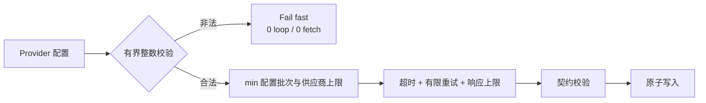
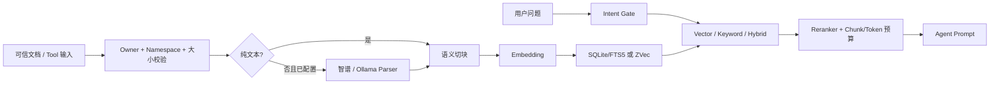

# OpenClaw Knowledge

<!-- README_STANDARD_START -->

> 统一阅读顺序：组件定位 → 架构 → 流程 → 边界 → 安装 → 配置 → 运维 → 深入阅读。
> 本区块以 npm 可稳定渲染的 text 图为主；适用时，更深入的 Mermaid 图保留在仓库 `doc/` 设计资料中。

[简体中文](./README.md)

## 1. 组件定位

提供受限写入、检索、重排与自动上下文注入。组件类型：**RAG / 知识能力**。

| 项目 | 内容 |
|---|---|
| npm 包 | `@partme.ai/openclaw-knowledge` |
| 当前版本 | `2026.7.1` |
| 插件 ID | `knowledge` |
| Channel ID | — |
| OpenClaw | `>=2026.7.1` |
| 源码目录 | `extensions/knowledge` |

## 2. 一眼看懂

```text
[文档、知识 Tool 与用户问题]
          │
          ▼
┌──────────────────────────────────────────────────────────────┐
│ OpenClaw Gateway 内: knowledge
│ 1. 解析、切块并生成向量
│ 2. 隔离存储并执行混合检索
│ 3. 重排、限长并注入 Prompt
└──────────────────────────────────────────────────────────────┘
          │
          ▼
[可追溯知识上下文]
```

## 3. 架构与核心流程

该组件把“协议/平台差异”限制在自身边界内，对 OpenClaw 暴露稳定的插件、Channel、Hook、Tool 或 Service 契约。

```text
文档、知识 Tool 与用户问题
  │
  ▼
解析、切块并生成向量
  │
  ▼
隔离存储并执行混合检索
  │
  ▼
重排、限长并注入 Prompt
  │
  ▼
可追溯知识上下文

异常路径: 任一步失败：记录可诊断错误并按组件策略重试、拒绝或降级
```

## 4. 能力与边界

| 能力 | 说明 |
|---|---|
| 负责 | 提供受限写入、检索、重排与自动上下文注入 |
| 不负责 | 不把远程 Provider 当作可信指令源 |
| 输入 | 文档、知识 Tool 与用户问题 |
| 输出 | 可追溯知识上下文 |
| 失败原则 | 默认失败应可观测；鉴权、边界校验和持久化失败不得伪装成功 |

## 5. 快速开始

```bash
openclaw plugins install "@partme.ai/openclaw-knowledge@2026.7.1"
```

安装后先按最小权限配置，再启动 Gateway；生产环境应在隔离配置目录中完成连通性、权限和失败恢复验证。

## 6. 配置入口

| 配置层 | 路径 |
|---|---|
| 插件配置 | `plugins.entries.knowledge.config` |
| Channel 配置 | 不适用 |
| 配置 Schema | `extensions/knowledge/openclaw.plugin.json` |

配置字段、环境变量与完整示例继续保留在下方原有详细说明中。

## 7. 运维、安全与故障定位

- 先确认 OpenClaw 版本、插件版本、manifest ID 与配置键一致。
- 凭据使用环境变量或 SecretRef，不写入日志、仓库和示例明文。
- 通过 Gateway 日志、插件健康状态及外部依赖状态分层定位问题。
- 升级前备份状态数据；涉及游标、队列或索引时，必须验证重启恢复与重复投递语义。

## 8. 验证与深入阅读

```bash
pnpm --filter "@partme.ai/openclaw-knowledge" typecheck
pnpm --filter "@partme.ai/openclaw-knowledge" test
pnpm --filter "@partme.ai/openclaw-knowledge" build
```

- [knowledge 深度设计文档](../../doc/knowledge/)
- [统一插件结构规范](../../doc/OpenClaw-Plugins-Structure-Standard.md)

## 9. 原有详细说明

以下内容保留该组件原有的配置表、协议细节、示例和故障排查资料。

<!-- README_STANDARD_END -->


适配 OpenClaw `2026.7.1` 的本地知识库 RAG 插件。插件注册 `before_prompt_build` 自动检索钩子，以及 `knowledge_add`、`knowledge_query`、`knowledge_update`、`knowledge_delete` 四个工具。

同一 `sourceId` 的重建使用存储层原子替换，并对并发写入按调用顺序串行；SQLite 会在同一事务中更新向量与 FTS，失败时保留旧文档。

## 架构总览

```text
可信文本 / Owner 文件                         用户问题
        │                                      │
        ▼                                      ▼
Namespace ACL + realpath + 大小限制        Intent Gate
        │                                      │
        ▼                                      ▼
Parser（可选）→ Chunk → Embedding       Vector / Keyword 双路召回
        │                                      │
        └──────────────┐       ┌───────────────┘
                       ▼       ▼
                 SQLite + FTS5 / ZVec
                           │
                           ▼
                 Reranker（可选）→ Token 预算
                           │
                           ▼
              before_prompt_build → Agent Prompt

共同边界：sessionKey 摘要隔离 │ 原子替换 │ Provider 超时/重试/响应上限
          凭据/路径脱敏       │ Gateway stop 关闭 Store
```

Provider 资源配置在调用前 fail-fast：`requestTimeoutMs=1..300000`、`maxRetries=0..10`、
`maxResponseBytes=1..64MiB`、`maxBatchSize=1..2048`。非法值不会进入批处理循环，也不会
发出网络请求；实际批次继续受各 Provider 更小的官方硬上限约束。





## 当前能力边界

- Embedding：OpenAI-compatible、DashScope、智谱、千帆、Ollama。
- 存储：`sqlite-vec`（默认，Node.js 内置 SQLite + FTS5）和 `zvec`（纯 JavaScript，小规模/开发用途，可选 JSON 持久化）。
- 检索：vector、keyword、hybrid；hybrid 默认权重为 0.7/0.3，可选智谱或 Jina Reranker。
- 文档解析：可选智谱 Layout Parsing 或 Ollama 视觉模型。智谱支持 PDF/PNG/JPEG；Ollama
  的 `images` 输入仅接收图片，PDF 必须先逐页渲染或改用智谱。
- 注入：按块数及 token/字符上限约束，可注入 system 或 user prompt。
- 隔离：默认 namespace 由 OpenClaw `sessionKey` 的 SHA-256 摘要派生；Hook 与 Tool 使用同一解析器，非 owner 不能跨 namespace。
- 文件摄取：默认关闭；仅 owner 可用，并且文件 realpath 必须位于允许根目录内。
- 错误边界：Provider、Parser、SQLite 和文件系统异常在进入 Hook 日志或 Tool 响应前统一遮蔽凭据、绝对路径和控制字符。

本插件当前不承诺远程 URL 抓取、外部向量数据库或多节点共享索引。PDF/Office/图片等格式必须显式配置 `parser.provider`，并在真实 Provider 环境验收。

## 安装与配置

```bash
openclaw plugins install @partme.ai/openclaw-knowledge@2026.7.1
```

在 OpenClaw 配置中启用：

```json
{
  "plugins": {
    "entries": {
      "knowledge": {
        "enabled": true,
        "config": {
          "enabled": true,
          "embedding": {
            "provider": "openai",
            "model": "text-embedding-3-small",
            "dimensions": 1536
          },
          "store": {
            "provider": "sqlite-vec",
            "dbPath": "./data/knowledge.db"
          },
          "retrieval": {
            "strategy": "hybrid",
            "topK": 5,
            "minScore": 0.3,
            "vectorWeight": 0.7,
            "keywordWeight": 0.3
          },
          "injection": {
            "position": "system",
            "maxChunks": 5,
            "maxTokens": 2048,
            "template": "以下是相关知识库内容，请据此回答用户问题：\n\n{context}"
          },
          "tools": {
            "allowFileIngest": false,
            "allowedFileRoots": [],
            "maxFileBytes": 10485760,
            "maxInputChars": 100000,
            "allowOwnerGlobalNamespaces": true
          }
        }
      }
    }
  }
}
```

OpenAI-compatible 模式默认读取 `OPENAI_API_KEY`、`OPENAI_BASE_URL` 和 `OPENAI_EMBEDDING_MODEL`。不要把密钥提交到仓库。

启用文件摄取时必须同时配置：

```json
{
  "tools": {
    "allowFileIngest": true,
    "allowedFileRoots": ["./knowledge-docs"],
    "maxFileBytes": 10485760
  }
}
```

纯文本支持 `.md`、`.txt`、`.text`、`.csv`、`.json`；其它格式需配置 Parser。符号链接越界会被拒绝。

## 数据与升级说明

- SQLite 使用同一数据库内的 namespace 专属表，表名包含稳定哈希，避免 `a:b` 与 `a_b` 碰撞。
- `zvec` 配置 `dbPath` 后会为每个 namespace 派生独立哈希文件，并在关闭时原子落盘。
- 早期版本对 namespace 的清洗可能产生碰撞。升级到 2026.7.1 后，含标点或大写字符的旧 namespace 表不会自动迁移；请从可信源重新索引，避免把历史碰撞数据复制到错误租户。
- 旧 `accountId:mode` 数据不会自动复制到新的会话摘要 namespace；这是有意的跨租户安全边界，应从可信源重新索引。
- 更换 embedding 模型或 dimensions 后应重新索引已有内容。
- `embedding.requestTimeoutMs`、`embedding.maxRetries`、`embedding.maxBatchSize` 分别控制外部请求超时、瞬时错误重试和单批规模；默认值为 30000、2、64。

## 验证

```bash
pnpm typecheck
pnpm test
pnpm build
```

详细设计和运维边界见 [`../../doc/knowledge`](../../doc/knowledge)。
