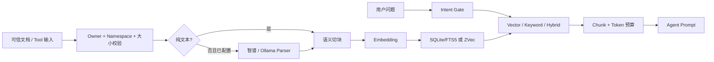
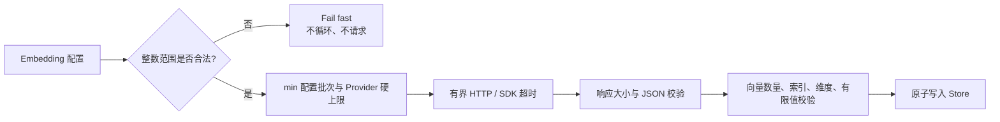

# OpenClaw Knowledge 知识库插件

<!-- README_STANDARD_START -->

> 统一阅读顺序：组件定位 → 架构 → 流程 → 边界 → 安装 → 配置 → 运维 → 深入阅读。
> 本区块以 npm 可稳定渲染的 text 图为主；适用时，更深入的 Mermaid 图保留在仓库 `doc/` 设计资料中。

[简体中文](./README.md)

## 1. 组件定位

提供受限写入、检索、重排与自动上下文注入。组件类型：**RAG / 知识能力**。

| 项目 | 内容 |
|---|---|
| npm 包 | `@partme.ai/openclaw-knowledge` |
| 当前版本 | `2026.7.1` |
| 插件 ID | `knowledge` |
| Channel ID | — |
| OpenClaw | `>=2026.7.1` |
| 源码目录 | `extensions/knowledge` |

## 2. 一眼看懂

```text
[文档、知识 Tool 与用户问题]
          │
          ▼
┌──────────────────────────────────────────────────────────────┐
│ OpenClaw Gateway 内: knowledge
│ 1. 解析、切块并生成向量
│ 2. 隔离存储并执行混合检索
│ 3. 重排、限长并注入 Prompt
└──────────────────────────────────────────────────────────────┘
          │
          ▼
[可追溯知识上下文]
```

## 3. 架构与核心流程

该组件把“协议/平台差异”限制在自身边界内，对 OpenClaw 暴露稳定的插件、Channel、Hook、Tool 或 Service 契约。

```text
文档、知识 Tool 与用户问题
  │
  ▼
解析、切块并生成向量
  │
  ▼
隔离存储并执行混合检索
  │
  ▼
重排、限长并注入 Prompt
  │
  ▼
可追溯知识上下文

异常路径: 任一步失败：记录可诊断错误并按组件策略重试、拒绝或降级
```

## 4. 能力与边界

| 能力 | 说明 |
|---|---|
| 负责 | 提供受限写入、检索、重排与自动上下文注入 |
| 不负责 | 不把远程 Provider 当作可信指令源 |
| 输入 | 文档、知识 Tool 与用户问题 |
| 输出 | 可追溯知识上下文 |
| 失败原则 | 默认失败应可观测；鉴权、边界校验和持久化失败不得伪装成功 |

## 5. 快速开始

```bash
openclaw plugins install "@partme.ai/openclaw-knowledge@2026.7.1"
```

安装后先按最小权限配置，再启动 Gateway；生产环境应在隔离配置目录中完成连通性、权限和失败恢复验证。

## 6. 配置入口

| 配置层 | 路径 |
|---|---|
| 插件配置 | `plugins.entries.knowledge.config` |
| Channel 配置 | 不适用 |
| 配置 Schema | `extensions/knowledge/openclaw.plugin.json` |

配置字段、环境变量与完整示例继续保留在下方原有详细说明中。

## 7. 运维、安全与故障定位

- 先确认 OpenClaw 版本、插件版本、manifest ID 与配置键一致。
- 凭据使用环境变量或 SecretRef，不写入日志、仓库和示例明文。
- 通过 Gateway 日志、插件健康状态及外部依赖状态分层定位问题。
- 升级前备份状态数据；涉及游标、队列或索引时，必须验证重启恢复与重复投递语义。

## 8. 验证与深入阅读

```bash
pnpm --filter "@partme.ai/openclaw-knowledge" typecheck
pnpm --filter "@partme.ai/openclaw-knowledge" test
pnpm --filter "@partme.ai/openclaw-knowledge" build
```

- [knowledge 深度设计文档](../../doc/knowledge/)
- [统一插件结构规范](../../doc/OpenClaw-Plugins-Structure-Standard.md)

## 9. 原有详细说明

以下内容保留该组件原有的配置表、协议细节、示例和故障排查资料。

<!-- README_STANDARD_END -->


`@partme.ai/openclaw-knowledge` 是适配 OpenClaw `2026.7.1` 的本地 RAG 插件。它既通过
`before_prompt_build` 自动召回相关知识，也向 Agent 提供 `knowledge_add`、
`knowledge_query`、`knowledge_update`、`knowledge_delete` 四个受控工具。

[English](README.md) | 简体中文

## 工作方式

字符图先展示两条主路径以及共同的隔离、资源与错误边界，适合快速定位组件；后面的 Mermaid
保留可渲染的依赖关系，二者共同维护，不能互相替代。

```text
可信文本 / Owner 文件                         用户问题
        │                                      │
        ▼                                      ▼
Namespace ACL + realpath + 大小限制        Intent Gate
        │                                      │
        ▼                                      ▼
Parser（可选）→ Chunk → Embedding       Vector / Keyword 双路召回
        │                                      │
        └──────────────┐       ┌───────────────┘
                       ▼       ▼
                 SQLite + FTS5 / ZVec
                           │
                           ▼
                 Reranker（可选）→ Token 预算
                           │
                           ▼
              before_prompt_build → Agent Prompt

共同边界：sessionKey 摘要隔离 │ 原子替换 │ Provider 超时/重试/响应上限
          凭据/路径脱敏       │ Gateway stop 关闭 Store
```



同一 `sourceId` 的更新使用存储层原子替换；Embedding 或写入失败时保留旧文档。OpenClaw
2026.7.1 的 Prompt Hook 不提供 `accountId`，因此默认 namespace 由 Hook 与 Tool 都具备的
稳定 `sessionKey` 做 SHA-256 摘要后派生；原始会话键不会写入路径或表名。非 owner 不能
查询或修改其它 namespace。

外部 Provider 的配置先经过公共资源边界，非法值不会进入循环或发出网络请求：

```text
embedding 配置
      │
      ▼
整数范围校验
  ├─ requestTimeoutMs：1 .. 300000 ms
  ├─ maxRetries：0 .. 10
  ├─ maxResponseBytes：1 .. 64 MiB
  └─ maxBatchSize：1 .. 2048
      │
      ├── 非法 ──▶ 启动/首次调用立即失败，fetch=0，batch loop=0
      │
      ▼
按 Provider 硬上限取 min(配置批次, Provider 批次)
      │
      ▼
有限请求 → 响应字节上限 → JSON/数量/索引/维度/有限值校验
```



## 能力范围

- Embedding：OpenAI-compatible、DashScope、智谱、千帆、Ollama；
- 存储：`sqlite-vec`（默认，Node.js SQLite + FTS5）和 `zvec`（纯 JavaScript）；
- 检索：vector、keyword、hybrid，可选智谱或 Jina Reranker；
- 文档解析：智谱支持 PDF/PNG/JPEG，owner 授权的本地文件会在出站前转换为受限 base64；
  Ollama 仅接收图片，PDF 需先逐页渲染或改用智谱，且不会主动抓取远程 URL；
- 注入：system/user 位置，受最大块数和 token/字符预算限制；
- 文件摄取：默认关闭，仅 owner 可用，realpath 必须位于允许根目录；
- 生命周期：Store 按 namespace + 配置指纹缓存，Gateway stop 时统一关闭或刷新。
- 并发删除：同 source 的 add/update/delete 保序；namespace clear 使用独占屏障，不能越过在途写入。
- 错误边界：Provider、Parser、SQLite 和文件系统异常在进入 Hook 日志或 Tool 响应前统一遮蔽凭据、绝对路径和控制字符。
- 配置边界：Provider 超时、重试、响应大小和 Embedding 批次必须是有界整数；`maxBatchSize=0` 等值会在进入循环前拒绝。

当前不承诺远程 URL 抓取、外部向量数据库和多节点共享索引。PDF/Office/图片等非纯文本
必须显式配置 `parser.provider`，并在真实 Provider 环境完成格式兼容性验收。

## 安装

```bash
openclaw plugins install @partme.ai/openclaw-knowledge@2026.7.1
openclaw plugins inspect knowledge
openclaw doctor
```

## 最小配置

```json
{
  "plugins": {
    "entries": {
      "knowledge": {
        "enabled": true,
        "config": {
          "enabled": true,
          "embedding": {
            "provider": "openai",
            "model": "text-embedding-3-small",
            "dimensions": 1536
          },
          "store": {
            "provider": "sqlite-vec",
            "dbPath": "./data/knowledge.db"
          },
          "retrieval": {
            "strategy": "hybrid",
            "topK": 5,
            "minScore": 0.3,
            "vectorWeight": 0.7,
            "keywordWeight": 0.3
          },
          "injection": {
            "position": "system",
            "maxChunks": 5,
            "maxTokens": 2048,
            "template": "以下是相关知识库内容，请据此回答用户问题：\n\n{context}"
          },
          "tools": {
            "allowFileIngest": false,
            "allowedFileRoots": [],
            "maxFileBytes": 10485760,
            "maxInputChars": 100000,
            "allowOwnerGlobalNamespaces": true
          }
        }
      }
    }
  }
}
```

OpenAI-compatible 模式默认读取 `OPENAI_API_KEY`、`OPENAI_BASE_URL` 和
`OPENAI_EMBEDDING_MODEL`，不要把密钥写入仓库。

## 文件摄取

```json
{
  "tools": {
    "allowFileIngest": true,
    "allowedFileRoots": ["./knowledge-docs"],
    "maxFileBytes": 10485760
  }
}
```

支持 `.md`、`.txt`、`.csv`、`.json`。符号链接的最终 realpath 越界、超大文件和不支持后缀
都会在读取前拒绝。

## 数据与升级

- SQLite 为每个 namespace 派生带稳定哈希的独立表，避免标点清洗碰撞；
- ZVec 配置 `dbPath` 后为每个 namespace 派生独立 JSON 文件，并在关闭时原子刷新；
- 更换 Embedding 模型或 dimensions 后必须从可信源重新索引；
- 早期仅清洗 namespace 的表不会自动迁移，避免把潜在碰撞数据复制到错误租户；
- 2026.7.1 会话摘要 namespace 不会自动读取旧 `accountId:mode` 数据；应从可信源重新索引，
  不做可能跨租户复制的自动迁移；
- `requestTimeoutMs`、`maxRetries`、`maxBatchSize` 分别控制超时、瞬时错误重试和批量规模。

## 开发验证

```bash
pnpm typecheck
pnpm test
pnpm build
```

详细内容：

- [架构设计](../../doc/knowledge/OpenClaw-Knowledge-RAG-Architecture_CN.md)
- [使用指南](../../doc/knowledge/OpenClaw-Knowledge-RAG-Guide_CN.md)
- [集成说明](../../doc/knowledge/OpenClaw-Knowledge-RAG-Integration_CN.md)
- [生产化策略](../../doc/knowledge/OpenClaw-Knowledge-RAG-Strategy_CN.md)
- [安装验收](INSTALL.md)

在真实 Embedding 服务、真实业务数据和隔离账号完成召回质量、ACL、重启恢复与性能验收前，
该插件应标记为“实现完成、待环境验收”，不能仅凭本地测试宣称生产就绪。
