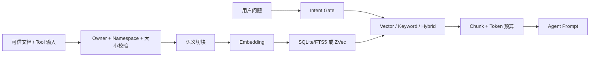

# OpenClaw Knowledge 知识库插件

`@partme.ai/openclaw-knowledge` 是适配 OpenClaw `2026.7.1` 的本地 RAG 插件。它既通过
`before_prompt_build` 自动召回相关知识，也向 Agent 提供 `knowledge_add`、
`knowledge_query`、`knowledge_update`、`knowledge_delete` 四个受控工具。

[English](README.md) | 简体中文

## 工作方式



同一 `sourceId` 的更新使用存储层原子替换；Embedding 或写入失败时保留旧文档。默认
namespace 为当前 `accountId:bot|agent`，非 owner 不能查询或修改其它 namespace。

## 能力范围

- Embedding：OpenAI-compatible、DashScope、智谱、千帆、Ollama；
- 存储：`sqlite-vec`（默认，Node.js SQLite + FTS5）和 `zvec`（纯 JavaScript）；
- 检索：vector、keyword、hybrid，可选 reranker；
- 注入：system/user 位置，受最大块数和 token/字符预算限制；
- 文件摄取：默认关闭，仅 owner 可用，realpath 必须位于允许根目录；
- 生命周期：Store 按 namespace + 配置指纹缓存，Gateway stop 时统一关闭或刷新。

当前不承诺 PDF/Office 解析、远程 URL 抓取、外部向量数据库和多节点共享索引。源码中的
parser 或实验接口不属于 2026.7.1 独立插件配置面。

## 安装

```bash
openclaw plugins install @partme.ai/openclaw-knowledge@2026.7.1
openclaw plugins inspect knowledge
openclaw doctor
```

## 最小配置

```json
{
  "plugins": {
    "entries": {
      "knowledge": {
        "enabled": true,
        "config": {
          "enabled": true,
          "embedding": {
            "provider": "openai",
            "model": "text-embedding-3-small",
            "dimensions": 1536
          },
          "store": {
            "provider": "sqlite-vec",
            "dbPath": "./data/knowledge.db"
          },
          "retrieval": {
            "strategy": "hybrid",
            "topK": 5,
            "minScore": 0.3,
            "vectorWeight": 0.7,
            "keywordWeight": 0.3
          },
          "injection": {
            "position": "system",
            "maxChunks": 5,
            "maxTokens": 2048,
            "template": "以下是相关知识库内容，请据此回答用户问题：\n\n{context}"
          },
          "tools": {
            "allowFileIngest": false,
            "allowedFileRoots": [],
            "maxFileBytes": 10485760,
            "maxInputChars": 100000,
            "allowOwnerGlobalNamespaces": true
          }
        }
      }
    }
  }
}
```

OpenAI-compatible 模式默认读取 `OPENAI_API_KEY`、`OPENAI_BASE_URL` 和
`OPENAI_EMBEDDING_MODEL`，不要把密钥写入仓库。

## 文件摄取

```json
{
  "tools": {
    "allowFileIngest": true,
    "allowedFileRoots": ["./knowledge-docs"],
    "maxFileBytes": 10485760
  }
}
```

支持 `.md`、`.txt`、`.csv`、`.json`。符号链接的最终 realpath 越界、超大文件和不支持后缀
都会在读取前拒绝。

## 数据与升级

- SQLite 为每个 namespace 派生带稳定哈希的独立表，避免标点清洗碰撞；
- ZVec 配置 `dbPath` 后为每个 namespace 派生独立 JSON 文件，并在关闭时原子刷新；
- 更换 Embedding 模型或 dimensions 后必须从可信源重新索引；
- 早期仅清洗 namespace 的表不会自动迁移，避免把潜在碰撞数据复制到错误租户；
- `requestTimeoutMs`、`maxRetries`、`maxBatchSize` 分别控制超时、瞬时错误重试和批量规模。

## 开发验证

```bash
pnpm typecheck
pnpm test
pnpm build
```

详细内容：

- [架构设计](../../doc/knowledge/OpenClaw-Knowledge-RAG-Architecture_CN.md)
- [使用指南](../../doc/knowledge/OpenClaw-Knowledge-RAG-Guide_CN.md)
- [集成说明](../../doc/knowledge/OpenClaw-Knowledge-RAG-Integration_CN.md)
- [生产化策略](../../doc/knowledge/OpenClaw-Knowledge-RAG-Strategy_CN.md)
- [安装验收](INSTALL.md)

在真实 Embedding 服务、真实业务数据和隔离账号完成召回质量、ACL、重启恢复与性能验收前，
该插件应标记为“实现完成、待环境验收”，不能仅凭本地测试宣称生产就绪。
