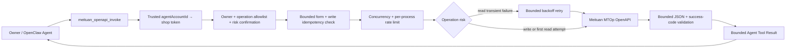

# @partme.ai/openclaw-meituan

Meituan MTOp OpenAPI capability for OpenClaw 2026.7.1. This package is not a chat channel. It invokes only operations explicitly allowlisted from your Meituan application documentation.

## What it implements

- The form-encoded request contract used by the official `MtOpJavaSDK`.
- SHA-1 signing over `signKey + sorted(key + value)`.
- Configured API path and `businessId` allowlists.
- Owner-only access by default, concurrency/rate limits, timeout, and body limits.
- Per-operation `read` / `write` risk classification; writes require `confirm=true` every time.
- Standard business-code validation (`OP_SUCCESS` by default).
- Trusted `agentAccountId` to shop-token binding for multi-shop deployments.
- Separate upstream-response and Agent Tool-result size limits.
- Bounded retries for read operations on network errors and HTTP 408/429/5xx; writes are never retried.
- Required-by-default write idempotency field with a bounded process-local TTL ledger.
- Manual redirect handling so a signed form and shop token are not automatically forwarded to another origin.

```text
Owner / OpenClaw Agent
          │ operation + biz + confirm?
          ▼
meituan_openapi_invoke
          │
          ├─ ownerOnly / operation allowlist / read-write risk gate
          ├─ trusted agentAccountId → one shop token
          └─ write requires confirm=true + idempotency value
                         │
                         ▼
             bounded biz JSON + MTOp form
                         │
                         ▼
       concurrency → SHA-1 signature → rate/idempotency limits
                         │
              ┌──────────┴──────────┐
              │ read: bounded retry │ write: one attempt
              │ backoff + jitter    │ retain TTL claim
              └──────────┬──────────┘
                         ▼
               Meituan MTOp OpenAPI
                         │
                         ▼
 bounded response → successCodes → credential/error redaction
                         │
                         ▼
              bounded Tool Result → Agent
```



MTOp uses POST for both business reads and writes. Verified `read` operations retry only network failures and HTTP 408/429/5xx with bounded backoff; business failures are not retried. A `write` is always sent once and must declare a top-level `idempotencyBizField` by default. Unknown config fields fail closed, every security boolean is type-strict, oversized response streams are cancelled, and a non-official remote origin requires explicit `allowCustomApiBaseUrl=true` acknowledgement.

`confirm=true` is a technical guard against accidental model invocation, not a substitute for business approval, financial controls, or human review. Refund, redemption, fulfilment, and similar high-risk operations should remain behind an upstream approval workflow or should not be exposed to a general Agent.

The TTL idempotency ledger is process-local and per account client. Multi-Gateway or financial workflows still require a shared business idempotency store or a server-side idempotency contract.

When `accounts` are configured, credentials are selected only from the runtime-trusted `agentAccountId`; the model cannot provide an account selector. `requireAccountBinding` defaults to true in this mode. Operations with `requiresAuth=false` never receive a shop token.

## Configuration

```json
{
  "plugins": {
    "entries": {
      "meituan": {
        "enabled": true,
        "config": {
          "enabled": true,
          "developerId": "123456",
          "signKey": "secret",
          "appAuthToken": "authorized-shop-token",
          "maxToolResultBytes": 262144,
          "operations": [
            {
              "name": "receipt_query",
              "apiPath": "/path-copied-from-meituan-docs",
              "businessId": 1,
              "requiresAuth": true,
              "riskLevel": "read",
              "successCodes": ["OP_SUCCESS"]
            }
          ]
        }
      }
    }
  }
}
```

For multiple shops, prefer environment-backed bindings:

```json
{
  "accounts": [
    { "accountId": "shop-a", "appAuthTokenEnv": "MEITUAN_SHOP_A_TOKEN" },
    { "accountId": "shop-b", "appAuthTokenEnv": "MEITUAN_SHOP_B_TOKEN" }
  ],
  "requireAccountBinding": true
}
```

Credentials may instead be provided through `MEITUAN_DEVELOPER_ID`, `MEITUAN_SIGN_KEY`, and `MEITUAN_APP_AUTH_TOKEN`. The default endpoint is `https://api-open-cater.meituan.com`.

The plugin registers `meituan_openapi_invoke` with `{ operation, biz, confirm? }`. Both the operation definition and its `biz` fields must come from the documentation available for your approved Meituan business integration. Operations default to `riskLevel: "write"`; explicitly mark verified read-only APIs as `read`.

Write operation example: `{ "name": "refund", "apiPath": "/approved/path", "businessId": 1, "riskLevel": "write", "idempotencyBizField": "orderId" }`. `requireWriteIdempotency=false` is an explicit legacy escape hatch and weakens duplicate protection.

See [README.zh-CN.md](./README.zh-CN.md) for the complete production checklist. Public platform entry: <https://openapi.meituan.com/>.

Installed-plugin Agent Tool E2E:

```bash
OPENCLAW_E2E_HOST_GATEWAY=1 pnpm test:e2e -- --plugins meituan --skip-browser
```
